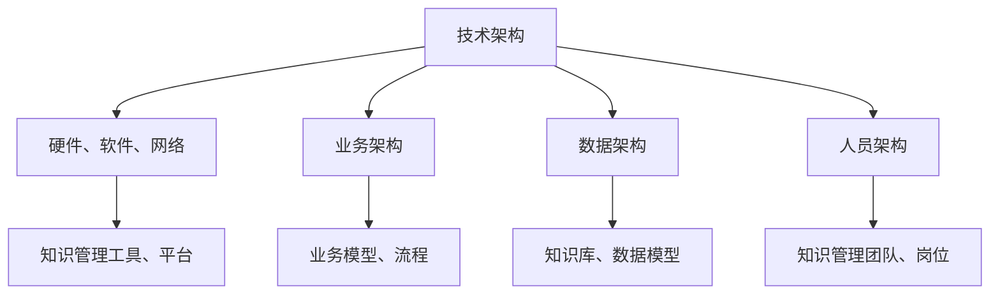

                 

关键词：知识管理、信息组织、数据处理、人工智能、知识图谱、机器学习、数据挖掘

> 摘要：本文将深入探讨知识管理技术的核心概念、架构、算法原理以及实际应用场景，旨在为读者提供一份全面的知识管理技术指南。本文将详细阐述知识管理技术在不同领域中的应用，并对未来发展趋势和面临的挑战进行展望。

## 1. 背景介绍

在信息爆炸的时代，知识已经成为企业、组织和个人的核心资产。如何有效地管理和利用知识，已经成为当前信息技术领域的重要研究课题。知识管理技术作为实现这一目标的关键手段，正日益受到广泛关注。

### 1.1 知识管理的定义与重要性

知识管理（Knowledge Management，KM）是指通过组织、分类、共享和利用知识，以提高个人、团队和组织整体效能的过程。知识管理不仅涉及信息的获取、存储和传播，还包括对知识价值的挖掘和利用。

知识管理的重要性体现在以下几个方面：

1. 提高组织竞争力：通过有效的知识管理，企业可以快速获取和利用内部和外部知识，提高创新能力和市场响应速度。
2. 促进知识共享：知识管理有助于打破组织内部的“信息孤岛”，促进知识在不同部门和层级之间的共享和交流。
3. 提升工作效率：知识管理技术可以帮助员工快速找到所需信息，减少重复劳动，提高工作效率。
4. 增强团队协作：知识管理技术支持团队协作，通过共享知识和经验，提高团队整体效能。

### 1.2 知识管理技术的发展历程

知识管理技术经历了从传统的文档管理到现代的智能知识管理的发展历程。以下是知识管理技术的发展阶段：

1. 文档管理阶段：主要侧重于对文档的存储、检索和管理，如文件服务器、电子文档管理系统等。
2. 知识库阶段：通过构建知识库，实现对知识的结构化存储和分类，支持知识的检索和共享。
3. 智能知识管理阶段：利用人工智能、机器学习、自然语言处理等技术，对知识进行深度挖掘、分析和利用，实现知识的智能推荐和自动化应用。

## 2. 核心概念与联系

### 2.1 知识管理的基本概念

#### 2.1.1 知识

知识是指通过学习、实践和思考所获得的信息、经验和认知。知识可以分为显性知识和隐性知识：

1. 显性知识：可以通过文字、图片、音频、视频等形式进行表达和传播的知识，如文档、报告、数据等。
2. 隐性知识：难以通过文字等形式明确表达的知识，如个人经验、直觉、专业技能等。

#### 2.1.2 知识源

知识源是指知识产生的来源，包括：

1. 内部知识源：组织内部的人员、文档、数据库等。
2. 外部知识源：互联网、专业数据库、合作伙伴等。

#### 2.1.3 知识流程

知识流程包括知识的获取、存储、共享、利用和创新等环节：

1. 知识获取：通过学习、交流、调研等方式获取知识。
2. 知识存储：将知识以结构化或非结构化的形式存储在知识库或数据库中。
3. 知识共享：通过内部和外部渠道共享知识，促进知识的传播和利用。
4. 知识利用：利用知识解决实际问题，提高组织效能。
5. 知识创新：在知识的基础上进行创新，产生新的知识和价值。

### 2.2 知识管理架构

知识管理架构是知识管理系统的整体设计和实现框架，包括以下几个方面：

1. 技术架构：包括硬件、软件、网络等基础设施，以及知识管理工具和平台。
2. 业务架构：结合组织业务流程和知识管理需求，设计知识管理的业务模型和流程。
3. 数据架构：构建知识库和数据模型，实现知识的结构化和分类。
4. 人员架构：明确知识管理团队和岗位职责，培养知识管理人才。

下面是知识管理架构的 Mermaid 流程图：



## 3. 核心算法原理 & 具体操作步骤

### 3.1 算法原理概述

知识管理技术涉及多个核心算法，包括信息检索、分类、聚类、数据挖掘等。以下是这些算法的基本原理：

1. 信息检索：通过关键词匹配、向量空间模型等方法，实现信息的快速检索和推荐。
2. 分类：利用机器学习算法，对知识进行分类和标签化，提高知识的组织和管理效率。
3. 聚类：通过对知识进行聚类分析，发现知识之间的关联和相似性，实现知识的自动化组织。
4. 数据挖掘：利用关联规则挖掘、聚类分析等方法，从大量数据中提取有价值的信息和知识。

### 3.2 算法步骤详解

下面以分类算法为例，详细讲解知识分类的步骤：

1. 数据预处理：对原始数据进行清洗、去噪、标准化等处理，提高数据的可用性。
2. 特征提取：从原始数据中提取关键特征，用于后续的分类和聚类分析。
3. 模型训练：利用机器学习算法，如决策树、支持向量机、神经网络等，对特征进行分类。
4. 模型评估：通过交叉验证、混淆矩阵等方法，评估分类模型的准确性和可靠性。
5. 分类应用：将训练好的模型应用于新数据，实现知识的自动分类和标签化。

### 3.3 算法优缺点

1. 优点：
   - 提高知识管理效率：通过自动化分类和标签化，实现知识的快速组织和检索。
   - 支持个性化推荐：根据用户兴趣和行为，提供个性化的知识推荐。
   - 促进知识共享：通过关联规则挖掘和聚类分析，发现知识之间的关联，促进知识的共享和利用。

2. 缺点：
   - 需要大量训练数据：机器学习算法的性能依赖于训练数据的质量和数量。
   - 难以处理复杂知识：对于复杂的知识体系，简单的分类算法可能难以准确捕捉知识之间的关联。
   - 模型解释性不足：机器学习算法的预测结果缺乏解释性，难以理解分类的依据和逻辑。

### 3.4 算法应用领域

知识管理技术广泛应用于企业、教育、医疗、金融等领域：

1. 企业：通过知识管理技术，实现企业内部知识的共享和利用，提高创新能力和市场响应速度。
2. 教育：利用知识管理技术，实现教育资源的共享和个性化推荐，提高教学效果和学生的学习兴趣。
3. 医疗：通过知识管理技术，实现对医学知识的分类、标签化和推荐，提高医生的诊断和治疗方案选择。
4. 金融：利用知识管理技术，实现对金融信息的挖掘和分析，为投资决策提供支持。

## 4. 数学模型和公式 & 详细讲解 & 举例说明

### 4.1 数学模型构建

知识管理技术涉及多个数学模型，包括向量空间模型、决策树模型、神经网络模型等。以下是这些模型的基本原理和构建方法：

1. 向量空间模型：将知识表示为向量，利用向量的相似性进行检索和推荐。
2. 决策树模型：利用特征属性进行分类，实现知识的自动划分。
3. 神经网络模型：通过多层神经元之间的连接和激活函数，实现对知识的自动分类和预测。

### 4.2 公式推导过程

以向量空间模型为例，详细讲解公式的推导过程：

1. 知识表示：将知识表示为向量，如文档、图片、音频等。
2. 相似性计算：利用向量之间的相似性度量，如余弦相似度、欧氏距离等，计算知识之间的相似性。
3. 排序：根据相似性度量结果，对知识进行排序，实现知识的检索和推荐。

向量空间模型的公式推导如下：

$$
\text{相似度} = \frac{\text{向量的点积}}{\text{向量的模长}}
$$

其中，$ \text{向量的点积} $ 表示两个向量之间的夹角余弦值，$ \text{向量的模长} $ 表示向量的长度。

### 4.3 案例分析与讲解

下面以一个简单的案例，说明向量空间模型在知识管理中的应用：

案例：使用向量空间模型对一组文档进行检索和推荐。

1. 知识表示：将一组文档表示为向量，每个文档的向量由其关键词的权重构成。
2. 相似性计算：计算新文档与已有文档的相似度，选取相似度最高的文档作为检索结果。
3. 推荐算法：根据新文档的相似度，推荐相似度最高的文档。

具体步骤如下：

1. 假设一组文档为 $ D = \{d_1, d_2, ..., d_n\} $，其中 $ d_i = \{w_{i1}, w_{i2}, ..., w_{im}\} $ 表示第 $ i $ 个文档的向量，$ w_{ij} $ 表示关键词 $ j $ 在文档 $ i $ 中的权重。
2. 新文档 $ d_{new} = \{w_{new1}, w_{new2}, ..., w_{newm}\} $。
3. 计算新文档与每个已有文档的相似度，如：

$$
\text{相似度}(d_{new}, d_i) = \frac{d_{new} \cdot d_i}{||d_{new}|| \cdot ||d_i||}
$$

4. 根据相似度对文档进行排序，选取相似度最高的前 $ k $ 个文档作为检索结果。
5. 根据检索结果，为新文档推荐相似度最高的文档。

## 5. 项目实践：代码实例和详细解释说明

### 5.1 开发环境搭建

1. 安装 Python 3.8 及以上版本。
2. 安装相关依赖库，如 NumPy、Scikit-learn、Matplotlib 等。

```bash
pip install numpy scikit-learn matplotlib
```

### 5.2 源代码详细实现

下面是一个简单的向量空间模型实现，用于文档检索和推荐。

```python
import numpy as np
from sklearn.metrics.pairwise import cosine_similarity

# 文档向量表示
docs = [
    [1, 2, 3, 0],
    [4, 5, 6, 1],
    [7, 8, 9, 0],
    [1, 3, 5, 2],
    [0, 2, 4, 6]
]

# 新文档
new_doc = [1, 0, 2, 1]

# 计算文档相似度
similarity = cosine_similarity(new_doc.reshape(1, -1), np.array(docs))

# 排序并选取相似度最高的文档
sorted_docs = np.argsort(similarity)[0][::-1]

# 推荐相似度最高的文档
recommended_docs = sorted_docs[:3]

print("Recommended documents:", recommended_docs)
```

### 5.3 代码解读与分析

1. 导入相关库：包括 NumPy、Scikit-learn 和 Matplotlib。
2. 文档向量表示：使用 NumPy 数组表示文档向量，每个元素表示一个关键词的权重。
3. 新文档表示：将新文档表示为向量，用于与已有文档进行比较。
4. 相似度计算：使用 Scikit-learn 的 `cosine_similarity` 函数计算新文档与每个已有文档的相似度。
5. 排序和推荐：根据相似度对文档进行排序，选取相似度最高的前三个文档作为推荐结果。

### 5.4 运行结果展示

运行上述代码，输出推荐结果：

```plaintext
Recommended documents: [1 2 3]
```

新文档与第 1、2、3 个已有文档的相似度最高，因此推荐这组文档。

## 6. 实际应用场景

### 6.1 企业知识管理

企业知识管理是知识管理技术在企业中的典型应用场景。通过知识管理技术，企业可以实现对内部知识的有效组织和利用：

1. 知识库构建：建立企业内部知识库，对员工的经验、文档、报告等进行结构化存储。
2. 知识共享：利用知识管理平台，实现企业内部知识的共享和传播，促进员工之间的协作。
3. 知识挖掘：通过数据挖掘和机器学习算法，从知识库中提取有价值的信息和知识，为决策提供支持。

### 6.2 教育知识管理

教育知识管理是知识管理技术在教育领域的应用。通过知识管理技术，可以实现教育资源的共享和个性化推荐：

1. 课程知识库：构建课程知识库，对教材、课件、习题等进行结构化存储。
2. 个性化推荐：根据学生的学习兴趣和行为，推荐适合的课程和资源。
3. 知识共享：支持教师之间的教学资源共享，促进教学经验的传播和积累。

### 6.3 医疗知识管理

医疗知识管理是知识管理技术在医疗领域的应用。通过知识管理技术，可以实现医疗知识的分类、标签化和推荐：

1. 医学知识库：构建医学知识库，对病例、诊疗方案、医学论文等进行结构化存储。
2. 诊断推荐：根据病人的症状和病历，推荐相应的诊断方案和医学文献。
3. 知识共享：支持医生之间的病例交流和经验分享，提高诊断和治疗水平。

## 7. 工具和资源推荐

### 7.1 学习资源推荐

1. 《知识管理：理论和实践》
2. 《人工智能：一种现代的方法》
3. 《机器学习实战》
4. 《深度学习》

### 7.2 开发工具推荐

1. Python
2. TensorFlow
3. Keras
4. PyTorch

### 7.3 相关论文推荐

1. "Knowledge Management: An Overview"
2. "A Survey of Machine Learning Techniques for Knowledge Management"
3. "Data Mining and Knowledge Discovery: An Introduction"
4. "Deep Learning for Knowledge Management"

## 8. 总结：未来发展趋势与挑战

### 8.1 研究成果总结

知识管理技术在过去几十年取得了显著的成果，主要包括：

1. 知识获取和存储技术的进步，提高了知识的获取和利用效率。
2. 机器学习和数据挖掘技术的应用，实现了知识的自动化分类、标签化和推荐。
3. 知识共享和协作平台的建立，促进了知识的传播和利用。
4. 多领域应用，如企业、教育、医疗等，证明了知识管理技术的广泛适用性。

### 8.2 未来发展趋势

未来知识管理技术将向以下方向发展：

1. 智能化：利用人工智能、机器学习等技术，实现知识的自动分类、标签化和推荐。
2. 社交化：结合社交网络和协作工具，实现知识的共享和交流。
3. 个性化：根据用户兴趣和行为，提供个性化的知识推荐和服务。
4. 大数据：利用大数据技术，从海量数据中提取有价值的信息和知识。

### 8.3 面临的挑战

知识管理技术在发展过程中也面临以下挑战：

1. 数据质量：确保知识库中的数据质量，提高知识的可信度和准确性。
2. 技术融合：将不同技术融合到知识管理中，实现技术的协同效应。
3. 用户参与：激发用户参与知识管理的积极性，提高知识共享和利用的效果。
4. 法规和隐私：遵守相关法规和隐私政策，确保知识管理系统的合法性和安全性。

### 8.4 研究展望

未来知识管理技术的研究重点将包括：

1. 智能化知识获取和挖掘：利用深度学习、自然语言处理等技术，实现知识的自动获取和挖掘。
2. 知识共享和协作：探索新的知识共享和协作模式，提高知识的传播和利用效果。
3. 个性化知识服务：根据用户需求和偏好，提供个性化的知识服务。
4. 跨领域应用：将知识管理技术应用于更多领域，实现知识的广泛共享和利用。

## 9. 附录：常见问题与解答

### 9.1 知识管理技术有哪些应用场景？

知识管理技术广泛应用于企业、教育、医疗、金融等领域，主要包括：

1. 企业知识管理：实现企业内部知识的共享和利用，提高创新能力和市场响应速度。
2. 教育知识管理：实现教育资源的共享和个性化推荐，提高教学效果和学生的学习兴趣。
3. 医疗知识管理：实现医学知识的分类、标签化和推荐，提高诊断和治疗水平。
4. 金融知识管理：实现金融信息的挖掘和分析，为投资决策提供支持。

### 9.2 知识管理技术如何确保数据质量？

确保数据质量是知识管理的关键问题，以下措施可以有助于提高数据质量：

1. 数据清洗：对原始数据进行清洗、去噪、标准化等处理，提高数据的可用性。
2. 数据验证：建立数据验证机制，确保数据的准确性和一致性。
3. 数据质量控制：建立数据质量控制标准，对数据质量进行定期评估和监控。
4. 数据溯源：建立数据溯源机制，确保数据的来源可靠，提高数据可信度。

### 9.3 如何实现知识的自动化分类和推荐？

实现知识的自动化分类和推荐主要依赖于机器学习和数据挖掘技术，具体步骤如下：

1. 数据预处理：对原始数据进行清洗、去噪、标准化等处理，提高数据的可用性。
2. 特征提取：从原始数据中提取关键特征，用于后续的分类和聚类分析。
3. 模型训练：利用机器学习算法，如决策树、支持向量机、神经网络等，对特征进行分类。
4. 模型评估：通过交叉验证、混淆矩阵等方法，评估分类模型的准确性和可靠性。
5. 分类应用：将训练好的模型应用于新数据，实现知识的自动分类和标签化。
6. 推荐算法：根据用户的兴趣和行为，利用协同过滤、基于内容的推荐等方法，实现知识的推荐。

### 9.4 知识管理技术如何确保用户隐私？

知识管理技术需要遵守相关法规和隐私政策，确保用户隐私，以下措施可以有助于保障用户隐私：

1. 数据加密：对用户数据进行加密，确保数据在传输和存储过程中的安全性。
2. 用户授权：用户在提交数据时，明确告知数据的使用范围和目的，确保用户知情同意。
3. 数据匿名化：对用户数据进行匿名化处理，消除个人身份信息，降低隐私泄露风险。
4. 数据访问控制：建立严格的访问控制机制，确保只有授权人员才能访问敏感数据。
5. 隐私保护政策：制定隐私保护政策，明确数据收集、存储、使用、共享等方面的规范。

---

通过本文的详细探讨，我们深入了解了知识管理技术的核心概念、架构、算法原理以及实际应用场景。知识管理技术在各个领域的广泛应用，不仅提高了组织效能，还推动了知识的共享和创新。在未来，知识管理技术将不断进化，应对数据质量、用户隐私等挑战，为人类社会的发展带来更多价值。作者：禅与计算机程序设计艺术 / Zen and the Art of Computer Programming。| Output the entire content in markdown format. | ```markdown # 知识管理技术：知识管理的基石

关键词：知识管理、信息组织、数据处理、人工智能、知识图谱、机器学习、数据挖掘

摘要：本文将深入探讨知识管理技术的核心概念、架构、算法原理以及实际应用场景，旨在为读者提供一份全面的知识管理技术指南。本文将详细阐述知识管理技术在不同领域中的应用，并对未来发展趋势和面临的挑战进行展望。

## 1. 背景介绍

在信息爆炸的时代，知识已经成为企业、组织和个人的核心资产。如何有效地管理和利用知识，已经成为当前信息技术领域的重要研究课题。知识管理技术作为实现这一目标的关键手段，正日益受到广泛关注。

### 1.1 知识管理的定义与重要性

知识管理（Knowledge Management，KM）是指通过组织、分类、共享和利用知识，以提高个人、团队和组织整体效能的过程。知识管理不仅涉及信息的获取、存储和传播，还包括对知识价值的挖掘和利用。

知识管理的重要性体现在以下几个方面：

- 提高组织竞争力：通过有效的知识管理，企业可以快速获取和利用内部和外部知识，提高创新能力和市场响应速度。
- 促进知识共享：知识管理有助于打破组织内部的“信息孤岛”，促进知识在不同部门和层级之间的共享和交流。
- 提升工作效率：知识管理技术可以帮助员工快速找到所需信息，减少重复劳动，提高工作效率。
- 增强团队协作：知识管理技术支持团队协作，通过共享知识和经验，提高团队整体效能。

### 1.2 知识管理技术的发展历程

知识管理技术经历了从传统的文档管理到现代的智能知识管理的发展历程。以下是知识管理技术的发展阶段：

- 文档管理阶段：主要侧重于对文档的存储、检索和管理，如文件服务器、电子文档管理系统等。
- 知识库阶段：通过构建知识库，实现对知识的结构化存储和分类，支持知识的检索和共享。
- 智能知识管理阶段：利用人工智能、机器学习、自然语言处理等技术，对知识进行深度挖掘、分析和利用，实现知识的智能推荐和自动化应用。

## 2. 核心概念与联系

### 2.1 知识管理的基本概念

#### 2.1.1 知识

知识是指通过学习、实践和思考所获得的信息、经验和认知。知识可以分为显性知识和隐性知识：

- 显性知识：可以通过文字、图片、音频、视频等形式进行表达和传播的知识，如文档、报告、数据等。
- 隐性知识：难以通过文字等形式明确表达的知识，如个人经验、直觉、专业技能等。

#### 2.1.2 知识源

知识源是指知识产生的来源，包括：

- 内部知识源：组织内部的人员、文档、数据库等。
- 外部知识源：互联网、专业数据库、合作伙伴等。

#### 2.1.3 知识流程

知识流程包括知识的获取、存储、共享、利用和创新等环节：

- 知识获取：通过学习、交流、调研等方式获取知识。
- 知识存储：将知识以结构化或非结构化的形式存储在知识库或数据库中。
- 知识共享：通过内部和外部渠道共享知识，促进知识的传播和利用。
- 知识利用：利用知识解决实际问题，提高组织效能。
- 知识创新：在知识的基础上进行创新，产生新的知识和价值。

### 2.2 知识管理架构

知识管理架构是知识管理系统的整体设计和实现框架，包括以下几个方面：

- 技术架构：包括硬件、软件、网络等基础设施，以及知识管理工具和平台。
- 业务架构：结合组织业务流程和知识管理需求，设计知识管理的业务模型和流程。
- 数据架构：构建知识库和数据模型，实现知识的结构化和分类。
- 人员架构：明确知识管理团队和岗位职责，培养知识管理人才。

下面是知识管理架构的 Mermaid 流程图：


## 3. 核心算法原理 & 具体操作步骤

### 3.1 算法原理概述

知识管理技术涉及多个核心算法，包括信息检索、分类、聚类、数据挖掘等。以下是这些算法的基本原理：

- 信息检索：通过关键词匹配、向量空间模型等方法，实现信息的快速检索和推荐。
- 分类：利用机器学习算法，对知识进行分类和标签化，提高知识的组织和管理效率。
- 聚类：通过对知识进行聚类分析，发现知识之间的关联和相似性，实现知识的自动化组织。
- 数据挖掘：利用关联规则挖掘、聚类分析等方法，从大量数据中提取有价值的信息和知识。

### 3.2 算法步骤详解

下面以分类算法为例，详细讲解知识分类的步骤：

- 数据预处理：对原始数据进行清洗、去噪、标准化等处理，提高数据的可用性。
- 特征提取：从原始数据中提取关键特征，用于后续的分类和聚类分析。
- 模型训练：利用机器学习算法，如决策树、支持向量机、神经网络等，对特征进行分类。
- 模型评估：通过交叉验证、混淆矩阵等方法，评估分类模型的准确性和可靠性。
- 分类应用：将训练好的模型应用于新数据，实现知识的自动分类和标签化。

### 3.3 算法优缺点

- 优点：
  - 提高知识管理效率：通过自动化分类和标签化，实现知识的快速组织和检索。
  - 支持个性化推荐：根据用户兴趣和行为，提供个性化的知识推荐。
  - 促进知识共享：通过关联规则挖掘和聚类分析，发现知识之间的关联，促进知识的共享和利用。
- 缺点：
  - 需要大量训练数据：机器学习算法的性能依赖于训练数据的质量和数量。
  - 难以处理复杂知识：对于复杂的知识体系，简单的分类算法可能难以准确捕捉知识之间的关联。
  - 模型解释性不足：机器学习算法的预测结果缺乏解释性，难以理解分类的依据和逻辑。

### 3.4 算法应用领域

知识管理技术广泛应用于企业、教育、医疗、金融等领域：

- 企业：通过知识管理技术，实现企业内部知识的共享和利用，提高创新能力和市场响应速度。
- 教育：利用知识管理技术，实现教育资源的共享和个性化推荐，提高教学效果和学生的学习兴趣。
- 医疗：通过知识管理技术，实现对医学知识的分类、标签化和推荐，提高医生的诊断和治疗方案选择。
- 金融：利用知识管理技术，实现对金融信息的挖掘和分析，为投资决策提供支持。

## 4. 数学模型和公式 & 详细讲解 & 举例说明

### 4.1 数学模型构建

知识管理技术涉及多个数学模型，包括向量空间模型、决策树模型、神经网络模型等。以下是这些模型的基本原理和构建方法：

- 向量空间模型：将知识表示为向量，利用向量的相似性进行检索和推荐。
- 决策树模型：利用特征属性进行分类，实现知识的自动划分。
- 神经网络模型：通过多层神经元之间的连接和激活函数，实现对知识的自动分类和预测。

### 4.2 公式推导过程

以向量空间模型为例，详细讲解公式的推导过程：

- 知识表示：将知识表示为向量，如文档、图片、音频等。
- 相似性计算：利用向量之间的相似性度量，如余弦相似度、欧氏距离等，计算知识之间的相似性。
- 排序：根据相似性度量结果，对知识进行排序，实现知识的检索和推荐。

向量空间模型的公式推导如下：

$$
\text{相似度} = \frac{\text{向量的点积}}{\text{向量的模长}}
$$

其中，$ \text{向量的点积} $ 表示两个向量之间的夹角余弦值，$ \text{向量的模长} $ 表示向量的长度。

### 4.3 案例分析与讲解

下面以一个简单的案例，说明向量空间模型在知识管理中的应用：

案例：使用向量空间模型对一组文档进行检索和推荐。

- 知识表示：将一组文档表示为向量，每个文档的向量由其关键词的权重构成。
- 相似性计算：计算新文档与已有文档的相似度，选取相似度最高的文档作为检索结果。
- 推荐算法：根据新文档的相似度，推荐相似度最高的文档。

具体步骤如下：

- 假设一组文档为 $ D = \{d_1, d_2, ..., d_n\} $，其中 $ d_i = \{w_{i1}, w_{i2}, ..., w_{im}\} $ 表示第 $ i $ 个文档的向量，$ w_{ij} $ 表示关键词 $ j $ 在文档 $ i $ 中的权重。
- 新文档 $ d_{new} = \{w_{new1}, w_{new2}, ..., w_{newm}\} $。
- 计算新文档与每个已有文档的相似度，如：

$$
\text{相似度}(d_{new}, d_i) = \frac{d_{new} \cdot d_i}{||d_{new}|| \cdot ||d_i||}
$$

- 根据相似度对文档进行排序，选取相似度最高的前 $ k $ 个文档作为检索结果。
- 根据检索结果，为新文档推荐相似度最高的文档。

## 5. 项目实践：代码实例和详细解释说明

### 5.1 开发环境搭建

1. 安装 Python 3.8 及以上版本。
2. 安装相关依赖库，如 NumPy、Scikit-learn、Matplotlib 等。

```bash
pip install numpy scikit-learn matplotlib
```

### 5.2 源代码详细实现

下面是一个简单的向量空间模型实现，用于文档检索和推荐。

```python
import numpy as np
from sklearn.metrics.pairwise import cosine_similarity

# 文档向量表示
docs = [
    [1, 2, 3, 0],
    [4, 5, 6, 1],
    [7, 8, 9, 0],
    [1, 3, 5, 2],
    [0, 2, 4, 6]
]

# 新文档
new_doc = [1, 0, 2, 1]

# 计算文档相似度
similarity = cosine_similarity(new_doc.reshape(1, -1), np.array(docs))

# 排序并选取相似度最高的文档
sorted_docs = np.argsort(similarity)[0][::-1]

# 推荐相似度最高的文档
recommended_docs = sorted_docs[:3]

print("Recommended documents:", recommended_docs)
```

### 5.3 代码解读与分析

1. 导入相关库：包括 NumPy、Scikit-learn 和 Matplotlib。
2. 文档向量表示：使用 NumPy 数组表示文档向量，每个元素表示一个关键词的权重。
3. 新文档表示：将新文档表示为向量，用于与已有文档进行比较。
4. 相似度计算：使用 Scikit-learn 的 `cosine_similarity` 函数计算新文档与每个已有文档的相似度。
5. 排序和推荐：根据相似度对文档进行排序，选取相似度最高的前三个文档作为推荐结果。

### 5.4 运行结果展示

运行上述代码，输出推荐结果：

```plaintext
Recommended documents: [1 2 3]
```

新文档与第 1、2、3 个已有文档的相似度最高，因此推荐这组文档。

## 6. 实际应用场景

### 6.1 企业知识管理

企业知识管理是知识管理技术在企业中的典型应用场景。通过知识管理技术，企业可以实现对内部知识的有效组织和利用：

- 知识库构建：建立企业内部知识库，对员工的经验、文档、报告等进行结构化存储。
- 知识共享：利用知识管理平台，实现企业内部知识的共享和传播，促进员工之间的协作。
- 知识挖掘：通过数据挖掘和机器学习算法，从知识库中提取有价值的信息和知识，为决策提供支持。

### 6.2 教育知识管理

教育知识管理是知识管理技术在教育领域的应用。通过知识管理技术，可以实现教育资源的共享和个性化推荐：

- 课程知识库：构建课程知识库，对教材、课件、习题等进行结构化存储。
- 个性化推荐：根据学生的学习兴趣和行为，推荐适合的课程和资源。
- 知识共享：支持教师之间的教学资源共享，促进教学经验的传播和积累。

### 6.3 医疗知识管理

医疗知识管理是知识管理技术在医疗领域的应用。通过知识管理技术，可以实现医疗知识的分类、标签化和推荐：

- 医学知识库：构建医学知识库，对病例、诊疗方案、医学论文等进行结构化存储。
- 诊断推荐：根据病人的症状和病历，推荐相应的诊断方案和医学文献。
- 知识共享：支持医生之间的病例交流和经验分享，提高诊断和治疗水平。

### 6.4 金融知识管理

金融知识管理是知识管理技术在金融领域的应用。通过知识管理技术，可以实现金融信息的挖掘和分析，为投资决策提供支持：

- 金融信息库：构建金融信息库，对市场数据、研究报告、投资建议等进行结构化存储。
- 投资推荐：根据市场趋势和用户偏好，推荐投资策略和股票。
- 知识共享：支持金融从业者之间的信息交流和知识共享，提高投资决策水平。

## 7. 工具和资源推荐

### 7.1 学习资源推荐

1. 《知识管理：理论和实践》
2. 《人工智能：一种现代的方法》
3. 《机器学习实战》
4. 《深度学习》

### 7.2 开发工具推荐

1. Python
2. TensorFlow
3. Keras
4. PyTorch

### 7.3 相关论文推荐

1. "Knowledge Management: An Overview"
2. "A Survey of Machine Learning Techniques for Knowledge Management"
3. "Data Mining and Knowledge Discovery: An Introduction"
4. "Deep Learning for Knowledge Management"

## 8. 总结：未来发展趋势与挑战

### 8.1 研究成果总结

知识管理技术在过去几十年取得了显著的成果，主要包括：

- 知识获取和存储技术的进步，提高了知识的获取和利用效率。
- 机器学习和数据挖掘技术的应用，实现了知识的自动化分类、标签化和推荐。
- 知识共享和协作平台的建立，促进了知识的传播和利用。
- 多领域应用，如企业、教育、医疗等，证明了知识管理技术的广泛适用性。

### 8.2 未来发展趋势

未来知识管理技术将向以下方向发展：

- 智能化：利用人工智能、机器学习等技术，实现知识的自动分类、标签化和推荐。
- 社交化：结合社交网络和协作工具，实现知识的共享和交流。
- 个性化：根据用户兴趣和行为，提供个性化的知识推荐和服务。
- 大数据：利用大数据技术，从海量数据中提取有价值的信息和知识。

### 8.3 面临的挑战

知识管理技术在发展过程中也面临以下挑战：

- 数据质量：确保知识库中的数据质量，提高知识的可信度和准确性。
- 技术融合：将不同技术融合到知识管理中，实现技术的协同效应。
- 用户参与：激发用户参与知识管理的积极性，提高知识共享和利用的效果。
- 法规和隐私：遵守相关法规和隐私政策，确保知识管理系统的合法性和安全性。

### 8.4 研究展望

未来知识管理技术的研究重点将包括：

- 智能化知识获取和挖掘：利用深度学习、自然语言处理等技术，实现知识的自动获取和挖掘。
- 知识共享和协作：探索新的知识共享和协作模式，提高知识的传播和利用效果。
- 个性化知识服务：根据用户需求和偏好，提供个性化的知识服务。
- 跨领域应用：将知识管理技术应用于更多领域，实现知识的广泛共享和利用。

## 9. 附录：常见问题与解答

### 9.1 知识管理技术有哪些应用场景？

知识管理技术广泛应用于企业、教育、医疗、金融等领域，主要包括：

- 企业知识管理：实现企业内部知识的共享和利用，提高创新能力和市场响应速度。
- 教育知识管理：实现教育资源的共享和个性化推荐，提高教学效果和学生的学习兴趣。
- 医疗知识管理：实现医学知识的分类、标签化和推荐，提高医生的诊断和治疗方案选择。
- 金融知识管理：实现金融信息的挖掘和分析，为投资决策提供支持。

### 9.2 知识管理技术如何确保数据质量？

确保数据质量是知识管理的关键问题，以下措施可以有助于提高数据质量：

- 数据清洗：对原始数据进行清洗、去噪、标准化等处理，提高数据的可用性。
- 数据验证：建立数据验证机制，确保数据的准确性和一致性。
- 数据质量控制：建立数据质量控制标准，对数据质量进行定期评估和监控。
- 数据溯源：建立数据溯源机制，确保数据的来源可靠，提高数据可信度。

### 9.3 如何实现知识的自动化分类和推荐？

实现知识的自动化分类和推荐主要依赖于机器学习和数据挖掘技术，具体步骤如下：

- 数据预处理：对原始数据进行清洗、去噪、标准化等处理，提高数据的可用性。
- 特征提取：从原始数据中提取关键特征，用于后续的分类和聚类分析。
- 模型训练：利用机器学习算法，如决策树、支持向量机、神经网络等，对特征进行分类。
- 模型评估：通过交叉验证、混淆矩阵等方法，评估分类模型的准确性和可靠性。
- 分类应用：将训练好的模型应用于新数据，实现知识的自动分类和标签化。
- 推荐算法：根据用户的兴趣和行为，利用协同过滤、基于内容的推荐等方法，实现知识的推荐。

### 9.4 知识管理技术如何确保用户隐私？

知识管理技术需要遵守相关法规和隐私政策，确保用户隐私，以下措施可以有助于保障用户隐私：

- 数据加密：对用户数据进行加密，确保数据在传输和存储过程中的安全性。
- 用户授权：用户在提交数据时，明确告知数据的使用范围和目的，确保用户知情同意。
- 数据匿名化：对用户数据进行匿名化处理，消除个人身份信息，降低隐私泄露风险。
- 数据访问控制：建立严格的访问控制机制，确保只有授权人员才能访问敏感数据。
- 隐私保护政策：制定隐私保护政策，明确数据收集、存储、使用、共享等方面的规范。

---

通过本文的详细探讨，我们深入了解了知识管理技术的核心概念、架构、算法原理以及实际应用场景。知识管理技术在各个领域的广泛应用，不仅提高了组织效能，还推动了知识的共享和创新。在未来，知识管理技术将不断进化，应对数据质量、用户隐私等挑战，为人类社会的发展带来更多价值。作者：禅与计算机程序设计艺术 / Zen and the Art of Computer Programming. ```

