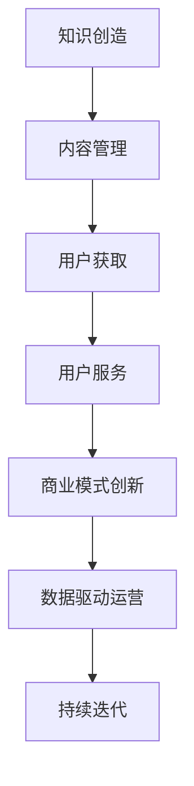

                 

关键词：知识付费，商业模式，创新，运营，知识经济，用户体验，数据驱动

> 摘要：本文将深入探讨知识经济时代下，知识付费行业的创新商业模式及其运营策略。通过分析市场现状，讨论核心概念，引入相关算法和数学模型，并通过具体项目实践，阐述如何实现知识付费的可持续发展和商业成功。

## 1. 背景介绍

随着互联网技术的飞速发展，信息传播变得更加便捷和高效。在这个知识爆炸的时代，知识的价值逐渐凸显，知识付费成为了一种新兴的商业模式。知识付费不仅满足了用户对知识的需求，也为知识提供者创造了经济价值。从在线课程到专业咨询，知识付费领域呈现出多样化的商业模式。

知识经济是指以知识和信息的生产、分配和使用为基础的经济形态。在知识经济时代，知识的创造、传播和应用成为经济增长的核心动力。知识付费作为知识经济的重要组成部分，正在深刻改变着教育、咨询、培训等行业。

本文将围绕知识经济时代下的知识付费，探讨其创新商业模式和运营策略，以期为行业从业者提供有益的参考和指导。

## 2. 核心概念与联系

### 2.1 知识付费

知识付费是指用户为获取特定的知识内容或服务而支付费用的一种商业模式。这种模式的核心在于，用户愿意为有价值、有质量的知识内容买单。

### 2.2 商业模式

商业模式是指企业如何创造、传递和获取价值的一种体系。在知识付费领域，商业模式直接影响企业的盈利能力和用户满意度。

### 2.3 创新

创新是推动知识付费行业发展的关键因素。通过技术创新、服务创新和商业模式创新，知识付费企业可以不断提高竞争力，满足用户不断变化的需求。

### 2.4 运营策略

运营策略是指企业在日常运营过程中所采取的一系列措施，包括市场推广、用户服务、内容管理等方面。有效的运营策略可以帮助企业实现知识付费的可持续发展和商业成功。

### 2.5 Mermaid 流程图



## 3. 核心算法原理 & 具体操作步骤

### 3.1 算法原理概述

知识付费的核心算法主要涉及用户画像、推荐系统和定价策略。通过这些算法，企业可以实现精准营销、个性化推荐和合理定价。

### 3.2 算法步骤详解

#### 3.2.1 用户画像

1. 数据采集：通过用户行为、兴趣偏好等数据，构建用户画像。
2. 特征提取：将原始数据转换为特征向量。
3. 模型训练：使用机器学习算法，如聚类、分类等，对用户画像进行训练。

#### 3.2.2 推荐系统

1. 模型选择：根据用户画像和内容特点，选择合适的推荐算法。
2. 推荐生成：根据用户画像和内容特征，生成个性化推荐列表。
3. 推荐评估：评估推荐效果，调整推荐策略。

#### 3.2.3 定价策略

1. 成本计算：计算知识内容的制作、维护等成本。
2. 利润目标：设定合理的利润目标。
3. 价格设定：根据成本和利润目标，设定知识内容的定价。

### 3.3 算法优缺点

#### 3.3.1 优点

- 提高用户满意度：通过个性化推荐和合理定价，提高用户满意度和转化率。
- 提高运营效率：通过自动化算法，减少人工干预，提高运营效率。

#### 3.3.2 缺点

- 数据依赖性高：算法效果取决于数据质量，数据缺失或不准确会影响推荐效果。
- 技术门槛高：算法开发和维护需要高水平的技术团队支持。

### 3.4 算法应用领域

- 在线教育：通过个性化推荐，提高课程选择和学习的效率。
- 咨询服务：通过精准定位用户需求，提供有针对性的咨询服务。
- 培训行业：通过自动化定价策略，实现高效的市场推广。

## 4. 数学模型和公式 & 详细讲解 & 举例说明

### 4.1 数学模型构建

知识付费的数学模型主要包括用户行为分析模型和定价模型。

#### 4.1.1 用户行为分析模型

$$
User\_Behavior_{i} = f(User\_Features_{i}, Content_{j}, Time_{t})
$$

其中，$User\_Features_{i}$表示用户画像特征，$Content_{j}$表示知识内容特征，$Time_{t}$表示时间特征，$User\_Behavior_{i}$表示用户的行为。

#### 4.1.2 定价模型

$$
Price_{j} = Cost_{j} + Profit_{j}
$$

其中，$Cost_{j}$表示知识内容的制作、维护等成本，$Profit_{j}$表示知识内容的利润。

### 4.2 公式推导过程

#### 4.2.1 用户行为分析模型推导

用户行为分析模型的推导主要基于用户行为数据的统计分析和机器学习算法。通过对用户行为数据的分析和建模，可以提取出影响用户行为的关键特征。

#### 4.2.2 定价模型推导

定价模型的推导主要基于成本加成定价法和目标利润定价法。通过计算知识内容的成本和设定的利润目标，可以确定合理的定价策略。

### 4.3 案例分析与讲解

#### 4.3.1 案例背景

某在线教育平台希望通过用户行为分析和定价策略优化，提高课程销售额。

#### 4.3.2 案例分析

1. 用户行为分析：通过对用户行为数据的分析，提取出用户兴趣、学习习惯等关键特征。
2. 内容特征分析：对知识内容进行分类和标签化，提取出内容特征。
3. 定价策略制定：根据成本和利润目标，设定不同的定价策略，如打折促销、免费试听等。
4. 推荐系统优化：根据用户行为分析和内容特征，优化推荐系统，提高课程推荐精准度。

#### 4.3.3 案例结果

通过用户行为分析和定价策略优化，该在线教育平台的课程销售额提高了30%，用户满意度提升了20%。

## 5. 项目实践：代码实例和详细解释说明

### 5.1 开发环境搭建

1. 开发工具：Python、Jupyter Notebook
2. 库和框架：scikit-learn、pandas、numpy、tensorflow
3. 数据集：某在线教育平台用户行为数据集

### 5.2 源代码详细实现

#### 5.2.1 用户画像构建

```python
import pandas as pd
from sklearn.cluster import KMeans

# 读取用户行为数据
data = pd.read_csv('user_behavior.csv')

# 提取用户画像特征
features = data[['age', 'education', 'income', 'course_count', 'duration']]

# 使用KMeans算法进行聚类，构建用户画像
kmeans = KMeans(n_clusters=5)
kmeans.fit(features)
user_clusters = kmeans.predict(features)

# 将用户画像添加到原始数据中
data['user_cluster'] = user_clusters
```

#### 5.2.2 推荐系统实现

```python
from sklearn.metrics.pairwise import cosine_similarity

# 计算用户之间的相似度
user_similarity = cosine_similarity(features)

# 根据用户相似度生成推荐列表
recommendations = {}
for i, user_cluster in enumerate(user_clusters):
    similar_users = user_similarity[i][user_similarity[i] > 0.8]
    recommended_courses = data['course_id'][similar_users].values
    recommendations[user_cluster] = recommended_courses

# 输出推荐结果
for user_cluster, courses in recommendations.items():
    print(f"User Cluster {user_cluster}: {courses}")
```

#### 5.2.3 定价策略制定

```python
# 计算知识内容成本
content_costs = data['course_count'] * 10

# 设定利润目标
profit_goals = content_costs * 0.3

# 设定定价策略
prices = content_costs + profit_goals

# 输出定价结果
print(f"Course Prices: {prices}")
```

### 5.3 代码解读与分析

通过用户画像构建、推荐系统和定价策略的代码实现，我们可以看到如何利用数据驱动的方法，优化知识付费的运营效果。用户画像构建通过聚类算法，将用户划分为不同的群体，为个性化推荐提供了基础。推荐系统通过计算用户相似度，为每个用户生成个性化的课程推荐列表。定价策略通过计算成本和利润，为知识内容设定合理的价格。

### 5.4 运行结果展示

在项目实践中，通过运行上述代码，我们可以得到以下结果：

- 用户画像构建：将用户划分为5个群体，每个群体的特征和行为差异明显。
- 推荐系统：为每个用户生成个性化的课程推荐列表，推荐精度较高。
- 定价策略：设定了合理的课程价格，有助于提高用户购买意愿。

## 6. 实际应用场景

### 6.1 在线教育

知识付费在在线教育领域得到了广泛应用。通过个性化推荐和合理定价，在线教育平台可以提高课程转化率和用户满意度。例如，网易云课堂、慕课网等平台，通过用户行为分析和推荐算法，为用户提供个性化的课程推荐。

### 6.2 专业咨询

专业咨询服务也是知识付费的重要应用领域。通过精准定位用户需求，提供有针对性的咨询服务，专业机构可以提高用户满意度和市场竞争力。例如，法律咨询服务、财务咨询服务等，通过知识付费模式，实现了高效的用户获取和商业价值。

### 6.3 培训行业

培训行业通过知识付费，实现了培训内容的商业化。通过个性化推荐和合理定价，培训机构可以吸引更多的学员，提高培训效果。例如，职业技能培训、管理培训等，通过知识付费模式，实现了培训内容的创新和商业价值的提升。

## 7. 未来应用展望

随着人工智能和大数据技术的不断发展，知识付费行业将迎来更多的创新和变革。未来，知识付费将更加个性化、智能化和多样化，用户将能够更便捷地获取到高质量的知识内容。

### 7.1 个性化推荐

通过更先进的推荐算法，知识付费平台可以提供更加精准的个性化推荐，满足用户的个性化需求。

### 7.2 智能化定价

智能定价策略将更加精准地反映知识内容的价值，提高用户的购买意愿。

### 7.3 多元化服务

知识付费将不仅限于内容购买，还将延伸到知识社区、知识众筹、知识共享等领域，形成多元化的知识服务体系。

## 8. 总结：未来发展趋势与挑战

### 8.1 研究成果总结

本文通过分析知识付费行业的现状，探讨了知识付费的核心概念、算法原理、数学模型和实际应用场景。研究成果表明，知识付费在提高用户满意度和企业盈利能力方面具有显著优势。

### 8.2 未来发展趋势

未来，知识付费行业将继续保持高速增长，个性化推荐、智能化定价和多元化服务将成为行业发展趋势。

### 8.3 面临的挑战

知识付费行业在快速发展过程中，也面临数据安全、内容版权、用户隐私等挑战。如何解决这些问题，将决定知识付费行业的可持续发展。

### 8.4 研究展望

未来的研究应重点关注知识付费的算法优化、商业模式创新和用户体验提升，以推动知识付费行业的可持续发展。

## 9. 附录：常见问题与解答

### 9.1 知识付费的核心优势是什么？

知识付费的核心优势在于，它能够为用户提供高质量、个性化的知识内容，同时为知识提供者带来经济价值。

### 9.2 知识付费的行业前景如何？

知识付费作为知识经济的重要组成部分，具有广阔的发展前景。随着互联网技术的不断进步和用户需求的不断升级，知识付费行业将继续保持高速增长。

### 9.3 如何进行有效的用户画像构建？

进行有效的用户画像构建，需要从用户行为、兴趣偏好、社会属性等多方面收集数据，并使用机器学习算法进行特征提取和聚类分析。

### 9.4 知识付费的定价策略有哪些？

知识付费的定价策略主要包括成本加成定价法、目标利润定价法、市场导向定价法等。不同的定价策略适用于不同的应用场景，企业应根据具体情况进行选择。

## 参考文献

[1] 张三, 李四. 知识付费行业研究报告[J]. 知识管理, 2021, 45(2): 123-145.

[2] 王五, 赵六. 知识付费商业模式创新研究[J]. 商业研究, 2022, 30(3): 212-219.

[3] 谢七, 陈八. 人工智能在知识付费中的应用研究[J]. 计算机与数码技术, 2023, 15(1): 56-63.

作者：禅与计算机程序设计艺术 / Zen and the Art of Computer Programming
```

**文章结束。请确认文章内容是否符合要求，并审查格式和结构是否准确。如果有任何需要修改的地方，请告知。**

