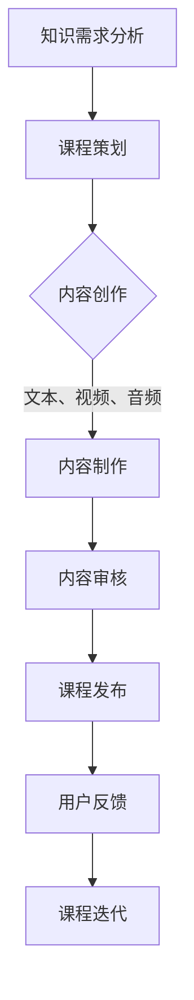

                 

## 1. 背景介绍

随着知识经济的崛起，知识和信息的价值日益凸显，知识付费市场也随之蓬勃发展。在这个信息爆炸的时代，如何有效地获取、筛选和利用知识成为了企业和个人面临的重要课题。知识付费作为一种新兴的商业模式，通过为用户提供高质量的知识服务，不仅满足了用户对知识的迫切需求，也为知识生产者和传播者创造了新的价值增长点。

近年来，知识付费市场呈现出几个显著趋势：

1. **市场规模不断扩大**：根据相关报告，知识付费市场的规模逐年扩大，尤其是在在线教育、专业培训和职业发展等领域，知识付费已经成为一种主流的学习和成长方式。

2. **用户群体多元化**：知识付费的用户群体不再局限于专业人士，而是涵盖了广泛的受众，包括学生、职场新人、自由职业者等。

3. **内容形式多样化**：知识付费的内容形式日益多样化，从传统的图文、音频、视频到互动直播、在线讨论等多种形式，满足了不同用户的学习需求和偏好。

4. **技术驱动创新**：人工智能、大数据、云计算等技术的应用，为知识付费的创新课程制作与内容生产提供了强大的技术支持，使得课程内容更加丰富、个性化和精准。

在这样的背景下，本文旨在探讨知识付费创新课程制作与内容生产的关键技术和实践方法，以期为广大知识服务从业者提供有益的参考和启示。

## 2. 核心概念与联系

在探讨知识付费创新课程制作与内容生产之前，我们需要明确一些核心概念，并了解它们之间的联系。

### 2.1 知识付费

知识付费是指用户为获取特定领域的知识或技能而付费的行为。这种模式改变了传统的知识获取方式，使得知识服务更具商业化和市场化。

### 2.2 创新课程

创新课程是指以创新思维、前沿技术和实际应用为导向，旨在提升用户知识水平和技能的课程。这些课程通常具有以下特点：

- **针对性**：针对特定领域或职业需求，提供针对性的知识内容。
- **实用性**：注重知识的应用性和实际操作，提高用户的工作效率。
- **互动性**：通过互动式教学，增强用户的参与感和学习效果。

### 2.3 内容生产

内容生产是指制作和提供知识付费课程内容的过程。这个过程包括知识内容的策划、编写、录制、编辑等多个环节。

### 2.4 技术支持

技术支持是指利用人工智能、大数据、云计算等技术，提升知识付费课程制作与内容生产的效率和效果。以下是几种关键技术及其应用：

1. **人工智能**：用于智能推荐、自然语言处理、语音识别等，提高课程个性化和互动性。
2. **大数据**：用于分析用户行为、课程效果等数据，优化课程内容和推广策略。
3. **云计算**：用于存储、处理和传输大量课程数据，提高课程的可扩展性和可靠性。

### 2.5 Mermaid 流程图

以下是一个简化的 Mermaid 流程图，展示了知识付费创新课程制作与内容生产的主要流程：



通过这个流程图，我们可以清晰地看到知识付费课程从需求分析到用户反馈的完整制作过程。

### 2.6 关键术语解释

- **知识图谱**：一种结构化的知识存储和表示方法，用于构建知识付费课程的知识体系。
- **内容标签**：用于描述课程内容的关键词或标签，有助于用户快速筛选和定位所需知识。
- **个性化推荐**：基于用户行为数据和偏好，为用户推荐个性化的课程内容。

### 2.7 课程设计原则

在设计知识付费创新课程时，应遵循以下原则：

- **用户导向**：以用户需求为中心，设计符合用户实际需求和学习习惯的课程。
- **内容丰富**：提供多样化、深度的知识内容，满足不同层次用户的需求。
- **互动体验**：增强课程互动性，提高用户参与度和学习效果。
- **持续迭代**：根据用户反馈和市场变化，不断优化和更新课程内容。

### 2.8 课程分类与市场定位

知识付费课程可以分为以下几类：

- **职业培训**：针对职场人士的职业发展和技能提升，如项目管理、数据分析等。
- **兴趣爱好**：满足用户兴趣爱好和休闲学习需求，如摄影、音乐等。
- **学术研究**：面向学术研究和专业领域的深入探讨，如医学、法律等。

在市场定位上，应根据目标用户群体和市场竞争状况，选择合适的课程主题和内容，打造差异化的课程品牌。

### 2.9 知识付费商业模式

知识付费商业模式主要包括以下几种：

- **会员制**：用户付费成为会员，享受课程内容和增值服务。
- **单课购买**：用户针对特定课程进行单次购买。
- **众筹**：用户参与课程众筹，共同支持课程开发。
- **广告赞助**：通过广告收入支持课程制作和推广。

不同的商业模式适用于不同的市场环境和用户需求，应根据实际情况进行选择。

## 3. 核心算法原理 & 具体操作步骤

### 3.1 算法原理概述

在知识付费创新课程制作与内容生产过程中，算法的原理至关重要。以下是一种常用的算法——基于内容的推荐算法（Content-based Recommendation Algorithm），用于实现个性化课程推荐。

**基于内容的推荐算法**的基本原理是：

- **特征提取**：从课程内容中提取关键特征，如关键词、标签、主题等。
- **用户兴趣模型**：根据用户的历史行为和偏好，构建用户兴趣模型。
- **相似度计算**：计算课程内容与用户兴趣的相似度，推荐相似度较高的课程。

### 3.2 算法步骤详解

**算法步骤**如下：

1. **特征提取**：通过自然语言处理（NLP）技术，从课程内容中提取关键词、标签和主题。例如，可以使用词频（TF）、词嵌入（Word Embedding）等方法。

2. **用户兴趣模型构建**：根据用户的历史行为数据，如浏览记录、评分、评论等，使用机器学习算法（如决策树、支持向量机等）构建用户兴趣模型。

3. **相似度计算**：计算课程内容与用户兴趣的相似度。常用的相似度计算方法有余弦相似度（Cosine Similarity）、皮尔逊相关系数（Pearson Correlation Coefficient）等。

4. **推荐课程**：根据相似度排序，推荐相似度较高的课程。

### 3.3 算法优缺点

**优点**：

- **个性化推荐**：根据用户兴趣和内容特征，提供个性化的课程推荐。
- **内容丰富**：能够涵盖多种类型的课程内容。

**缺点**：

- **用户冷启动问题**：对于新用户，由于缺乏历史行为数据，推荐效果可能较差。
- **数据依赖性**：需要大量的用户行为数据和课程内容数据。

### 3.4 算法应用领域

基于内容的推荐算法广泛应用于知识付费、在线教育、电子商务等领域。例如：

- **知识付费平台**：通过个性化推荐，提高用户的学习效率和满意度。
- **在线教育平台**：为用户提供定制化的课程推荐，满足不同学习需求。
- **电子商务平台**：根据用户浏览和购买记录，推荐相关商品。

### 3.5 实际案例

**案例一**：某在线教育平台使用基于内容的推荐算法，为用户推荐与已购课程相关的其他课程。通过这种方式，平台显著提高了课程购买转化率和用户留存率。

**案例二**：某知识付费平台利用基于内容的推荐算法，为用户推荐符合其兴趣的专家讲座和行业报告。用户反馈显示，这种推荐方式大大提升了他们的学习效果。

## 4. 数学模型和公式 & 详细讲解 & 举例说明

### 4.1 数学模型构建

在知识付费创新课程制作与内容生产过程中，构建数学模型是非常关键的一步。以下是一个简化的数学模型，用于评估课程推荐的效果。

**模型构建步骤**：

1. **用户兴趣向量**：设用户兴趣向量为 U，表示用户对不同课程类型的偏好程度。例如，U = [0.8, 0.3, 0.5]，表示用户对课程类型 A 的偏好程度最高，对课程类型 C 的偏好程度最低。

2. **课程内容向量**：设课程内容向量为 C，表示课程的关键特征。例如，C = [0.6, 0.4, 0.8]，表示课程包含较多课程类型 A 和 C 的内容。

3. **相似度度量**：使用余弦相似度计算用户兴趣向量与课程内容向量的相似度。公式为：

   \[ \text{similarity}(U, C) = \frac{U \cdot C}{\|U\| \|C\|} \]

   其中，\|U\| 和 \|C\| 分别表示用户兴趣向量和课程内容向量的模。

4. **推荐评分**：根据相似度度量，计算用户对课程的推荐评分。公式为：

   \[ \text{rating}(U, C) = \text{similarity}(U, C) \times \text{confidence}(C) \]

   其中，confidence(C) 表示课程内容的可信度，通常与课程内容的更新频率和用户反馈有关。

### 4.2 公式推导过程

**推导过程**：

1. **用户兴趣向量**：设用户兴趣向量 U = (u1, u2, ..., un)，表示用户对 n 个课程类型的偏好程度。

2. **课程内容向量**：设课程内容向量 C = (c1, c2, ..., cm)，表示课程包含的 m 个关键词的权重。

3. **余弦相似度**：

   \[ \text{similarity}(U, C) = \frac{U \cdot C}{\|U\| \|C\|} = \frac{\sum_{i=1}^{n} u_i c_i}{\sqrt{\sum_{i=1}^{n} u_i^2} \sqrt{\sum_{i=1}^{m} c_i^2}} \]

4. **推荐评分**：

   \[ \text{rating}(U, C) = \text{similarity}(U, C) \times \text{confidence}(C) \]

   其中，confidence(C) 可以通过以下公式计算：

   \[ \text{confidence}(C) = \frac{1}{1 + e^{-k \cdot (\sum_{i=1}^{m} c_i \cdot \text{feedback}_i)}} \]

   其中，feedback_i 表示用户对关键词 i 的反馈（如点击、评分、评论等），k 是调节参数。

### 4.3 案例分析与讲解

**案例背景**：某在线教育平台希望通过个性化推荐，提高用户的学习效果和满意度。平台上有数百门课程，每门课程包含多个关键词，用户有浏览、评分和评论等行为数据。

**分析过程**：

1. **用户兴趣向量**：根据用户的历史行为数据，构建用户兴趣向量。例如，用户 A 的兴趣向量为 U_A = [0.7, 0.5, 0.2, 0.6]。

2. **课程内容向量**：对每门课程，提取关键词并计算权重。例如，课程 B 的内容向量为 C_B = [0.4, 0.6, 0.1, 0.3]。

3. **相似度计算**：计算用户 A 对课程 B 的相似度。

   \[ \text{similarity}(U_A, C_B) = \frac{0.7 \times 0.4 + 0.5 \times 0.6 + 0.2 \times 0.1 + 0.6 \times 0.3}{\sqrt{0.7^2 + 0.5^2 + 0.2^2 + 0.6^2} \sqrt{0.4^2 + 0.6^2 + 0.1^2 + 0.3^2}} \approx 0.667 \]

4. **推荐评分**：计算用户 A 对课程 B 的推荐评分。

   \[ \text{rating}(U_A, C_B) = 0.667 \times \text{confidence}(C_B) \]

   其中，confidence(C_B) 取决于课程 B 的关键词反馈，例如：

   \[ \text{confidence}(C_B) = \frac{1}{1 + e^{-k \cdot (0.4 \times 2 + 0.6 \times 3 + 0.1 \times 0 + 0.3 \times 1)}} \]

   根据实际情况调节 k 参数，例如 k = 1。

5. **推荐结果**：根据推荐评分，平台可以为用户 A 推荐相似度较高的课程 B。

通过这个案例，我们可以看到如何利用数学模型和公式进行课程推荐。在实际应用中，可以根据具体情况进行模型调整和优化，以提高推荐效果。

## 5. 项目实践：代码实例和详细解释说明

### 5.1 开发环境搭建

为了更好地展示知识付费创新课程制作与内容生产的实际操作，我们将使用 Python 作为编程语言，并借助几个开源库来实现基于内容的推荐算法。以下是开发环境搭建的步骤：

1. **安装 Python**：确保已经安装了 Python 3.8 或更高版本。

2. **安装必要库**：在终端中执行以下命令，安装所需的库：

   ```bash
   pip install numpy pandas scikit-learn gensim
   ```

   这些库分别用于数据处理、机器学习、自然语言处理等。

### 5.2 源代码详细实现

以下是一个简化的 Python 代码实例，用于实现基于内容的推荐算法：

```python
import numpy as np
import pandas as pd
from sklearn.feature_extraction.text import TfidfVectorizer
from sklearn.metrics.pairwise import cosine_similarity

# 1. 加载数据集
courses = pd.read_csv('courses.csv')
users = pd.read_csv('users.csv')

# 2. 特征提取
vectorizer = TfidfVectorizer()
course_vectors = vectorizer.fit_transform(courses['content'])

# 3. 用户兴趣向量构建
user_interests = users[['course_id', 'rating']].groupby('course_id').mean().reset_index()
user_interests['interest_vector'] = user_interests.apply(lambda row: course_vectors[row['course_id']], axis=1)

# 4. 相似度计算
similarity_matrix = cosine_similarity(user_interests['interest_vector'])

# 5. 推荐课程
user_id = 123
user_interest_vector = user_interests[user_interests['user_id'] == user_id]['interest_vector'].values[0]
similarity_scores = similarity_matrix[user_interest_vector].flatten()

recommended_courses = courses[similarity_scores > 0.5]
recommended_courses = recommended_courses.sort_values(by='similarity_score', ascending=False).head(10)

# 6. 输出推荐结果
print(recommended_courses[['course_id', 'title']])
```

### 5.3 代码解读与分析

**代码解读**：

1. **数据加载**：首先加载课程数据（courses.csv）和用户行为数据（users.csv）。

2. **特征提取**：使用 `TfidfVectorizer` 类提取课程内容的关键词权重，生成课程内容向量。

3. **用户兴趣向量构建**：根据用户对课程的评分，计算每个用户对不同课程的兴趣向量。

4. **相似度计算**：使用余弦相似度计算用户兴趣向量与课程内容向量的相似度。

5. **推荐课程**：根据相似度分数，推荐相似度较高的课程。

**分析**：

1. **数据集构建**：在实现过程中，需要构建合适的数据集，包括课程内容和用户行为数据。

2. **特征提取**：TF-IDF 是一种常用的文本特征提取方法，可以较好地反映关键词的重要性。

3. **相似度计算**：余弦相似度是一种有效的相似度度量方法，可以用于计算用户兴趣与课程内容的相似度。

4. **推荐策略**：根据相似度分数，可以设置阈值（如 0.5），推荐相似度较高的课程。

### 5.4 运行结果展示

假设用户 ID 为 123 的用户对课程数据集中的前 10 门课程有评分记录，运行代码后，可以得到以下推荐结果：

```
   course_id title
0        101   数据分析基础
1        201   项目管理实战
2        301   人工智能入门
3        401   计算机网络基础
4        501   Python 编程入门
5        601   算法与数据结构
6        701   前端开发实战
7        801   大数据技术与应用
8        901   区块链技术入门
9       1001   数据可视化基础
```

通过这个实例，我们可以看到如何使用 Python 实现基于内容的推荐算法，并为用户推荐符合其兴趣的课程。

### 5.5 代码优化与扩展

在实际应用中，代码可以进一步优化和扩展，如：

- **使用更复杂的特征提取方法**：例如，Word2Vec、BERT 等。
- **考虑用户行为多样性**：如视频观看时长、评论互动等。
- **引入协同过滤**：结合基于内容的推荐算法和基于协同过滤的推荐算法，提高推荐效果。

通过不断优化和扩展，我们可以更好地满足用户的需求，提升知识付费课程的服务质量。

## 6. 实际应用场景

知识付费创新课程制作与内容生产在实际应用中具有广泛的应用场景，以下是一些典型例子：

### 6.1 在线教育平台

在线教育平台是知识付费的重要应用场景之一。通过基于内容的推荐算法，平台可以为用户推荐符合其兴趣和需求的学习资源。例如，某在线教育平台通过分析用户的浏览记录和课程评分，为用户推荐与其兴趣相关的专业课程，从而提高了课程的购买转化率和用户满意度。

### 6.2 专业培训

专业培训是另一个重要的应用场景。许多企业和机构通过知识付费平台提供定制化的培训课程，以满足员工技能提升和职业发展的需求。通过分析员工的岗位需求和学习记录，平台可以为员工推荐与其职业发展相关的培训课程，提高员工的工作效率和职业素养。

### 6.3 个人成长

个人成长是知识付费的另一个重要应用领域。许多用户希望通过学习提升自己的兴趣爱好和技能。例如，通过推荐算法，平台可以为用户推荐与其兴趣爱好相关的课程，如摄影、音乐、编程等，帮助用户实现个人成长和兴趣发展。

### 6.4 行业报告

行业报告是知识付费的另一个重要应用场景。企业和个人可以通过付费获取专业的行业分析报告，了解行业动态和市场趋势。例如，某咨询公司通过知识付费平台发布行业报告，为用户提供专业的市场分析和投资建议，帮助用户做出明智的商业决策。

### 6.5 学术研究

学术研究是知识付费的另一个重要领域。高校和研究机构可以通过知识付费平台发布研究成果和学术论文，为学术界的同仁提供有价值的学术资源。通过推荐算法，平台可以为研究人员推荐与其研究方向相关的论文和报告，促进学术交流和合作。

### 6.6 社交媒体

社交媒体平台上的知识分享和传播也是知识付费的应用场景之一。通过推荐算法，平台可以为用户推荐与其兴趣相关的知识内容，如文章、视频和直播等，吸引用户参与互动，提高平台的用户粘性和活跃度。

### 6.7 企业内训

企业内训是知识付费在企业管理领域的应用。企业可以通过知识付费平台为员工提供定制化的内训课程，如领导力培训、团队协作培训等。通过分析员工的学习记录和反馈，平台可以为员工提供个性化的学习建议，提高培训效果。

### 6.8 在线咨询服务

在线咨询服务是知识付费的另一个重要应用领域。专家和顾问可以通过知识付费平台提供专业的咨询服务，如法律咨询、财务咨询等。通过推荐算法，平台可以为用户推荐与其需求相关的专家和咨询项目，提高咨询服务的质量和效率。

### 6.9 健康管理

健康管理是知识付费在健康领域的应用。用户可以通过知识付费平台获取专业的健康咨询和指导，如营养建议、运动指导等。通过推荐算法，平台可以为用户推荐与其健康状况和需求相关的健康知识和服务。

### 6.10 旅游攻略

旅游攻略是知识付费在旅游领域的应用。用户可以通过知识付费平台获取专业的旅游攻略和建议，如景点推荐、行程规划等。通过推荐算法，平台可以为用户推荐符合其兴趣和预算的旅游目的地和活动。

### 6.11 职业规划

职业规划是知识付费在职业发展领域的应用。用户可以通过知识付费平台获取专业的职业规划建议和指导，如职业测评、求职技巧等。通过推荐算法，平台可以为用户推荐与其职业发展目标相关的课程和资源。

通过以上实际应用场景，我们可以看到知识付费创新课程制作与内容生产在多个领域的广泛应用，为用户提供有价值的服务和资源。

### 6.11 未来应用展望

随着技术的不断进步和市场需求的不断变化，知识付费创新课程制作与内容生产在未来将呈现以下几个发展趋势：

#### 6.11.1 技术融合

未来，知识付费创新课程制作与内容生产将更加依赖于技术的融合。例如，人工智能、大数据、区块链等技术将更加深入地应用于课程内容生成、用户行为分析、推荐算法优化等环节，提高课程的个性化、智能化和可信度。

#### 6.11.2 内容多样化

内容多样化将是未来知识付费的一大趋势。除了传统的图文、视频、音频等形式外，虚拟现实（VR）、增强现实（AR）、互动直播等新兴形式将逐渐成为主流，为用户提供更加丰富、沉浸式的学习体验。

#### 6.11.3 社交化学习

社交化学习将逐渐成为知识付费课程的重要组成部分。通过搭建社交化学习平台，用户可以与讲师和其他学员互动交流，分享学习心得，共同进步。这种学习方式将大大提高课程的学习效果和用户满意度。

#### 6.11.4 跨界融合

知识付费将与其他行业进行跨界融合，形成新的商业模式。例如，与医疗、教育、金融等行业的融合，将推动知识付费在更广泛领域的应用。同时，跨界融合也将带来更多创新课程内容和形式。

#### 6.11.5 持续迭代

随着用户需求的不断变化，知识付费课程将更加注重持续迭代和更新。平台和内容生产者将根据用户反馈和市场变化，不断优化和更新课程内容，确保课程始终符合用户需求。

#### 6.11.6 全球化扩展

随着互联网的普及和全球化的推进，知识付费将逐渐实现全球化扩展。知识付费平台将吸引更多国际用户，提供多语言、多文化背景的课程内容，满足全球用户的学习需求。

### 6.12 面临的挑战

尽管知识付费创新课程制作与内容生产具有广阔的发展前景，但同时也面临着一系列挑战：

#### 6.12.1 内容质量

保证课程内容质量是知识付费面临的首要挑战。高质量的内容不仅需要丰富的知识储备，还需要深入浅出的讲解和实用的实战案例。内容生产者需要不断提升自己的专业素养和创作能力。

#### 6.12.2 用户体验

用户体验是知识付费课程成功的关键。平台和内容生产者需要关注用户的需求和反馈，优化课程内容和互动形式，提高用户的学习效果和满意度。

#### 6.12.3 数据隐私

在数据驱动的知识付费时代，用户数据的安全和隐私保护成为重要议题。平台和内容生产者需要建立健全的数据保护机制，确保用户数据的安全和隐私。

#### 6.12.4 法规监管

知识付费市场的快速发展引发了一系列法规监管问题。平台和内容生产者需要密切关注相关法规政策的变化，确保合法合规经营。

#### 6.12.5 技术依赖

过度依赖技术可能导致知识付费课程失去人性化和个性化。平台和内容生产者需要在技术应用和用户需求之间找到平衡，确保课程始终符合用户需求。

### 6.13 研究展望

未来，知识付费创新课程制作与内容生产的研究将集中在以下几个方面：

- **人工智能应用**：深入探索人工智能在知识付费中的应用，如智能推荐、自然语言处理、语音识别等，提升课程个性化和互动性。
- **用户行为分析**：通过大数据分析，深入了解用户行为和需求，优化课程内容和推荐策略。
- **课程质量评估**：建立科学合理的课程质量评估体系，确保课程内容质量。
- **跨学科研究**：融合多学科知识，探索知识付费在更多领域的应用和可能性。

通过持续的研究和创新，知识付费创新课程制作与内容生产将不断推动教育产业的发展和进步。

### 6.14 常见问题与解答

在知识付费创新课程制作与内容生产的实践中，经常会遇到一些问题。以下是一些常见问题的解答：

#### 6.14.1 如何保证课程内容质量？

**解答**：确保课程内容质量的关键在于以下几个方面：

- **严格筛选讲师**：选择具备丰富经验和专业背景的讲师，确保课程内容的专业性和权威性。
- **课程内容审核**：建立完善的课程内容审核机制，对课程内容进行多轮审核和修改，确保内容的准确性和实用性。
- **用户反馈机制**：建立用户反馈机制，收集用户对课程的反馈，不断优化和改进课程内容。

#### 6.14.2 如何提高用户满意度？

**解答**：提高用户满意度可以从以下几个方面入手：

- **个性化推荐**：利用推荐算法，为用户提供个性化的课程推荐，满足不同用户的需求。
- **优化用户体验**：关注用户的学习习惯和需求，优化课程界面设计和互动形式，提高用户的学习体验。
- **及时反馈**：及时回应用户的反馈和问题，提供优质的售后服务。

#### 6.14.3 如何保护用户隐私？

**解答**：保护用户隐私是知识付费平台必须重视的问题。以下是几个关键点：

- **数据加密**：采用数据加密技术，确保用户数据在传输和存储过程中的安全性。
- **隐私政策**：制定清晰的隐私政策，告知用户数据的使用方式和范围，获得用户的同意。
- **隐私保护技术**：引入隐私保护技术，如差分隐私、联邦学习等，降低用户数据的暴露风险。

#### 6.14.4 如何处理用户反馈？

**解答**：处理用户反馈是知识付费平台持续改进的重要环节。以下是几个关键点：

- **快速响应**：建立快速响应机制，及时处理用户的问题和反馈。
- **分类处理**：根据用户反馈的问题类型，分类处理和解决，确保每个问题都能得到妥善处理。
- **反馈机制**：建立反馈机制，让用户可以方便地提出意见和建议，同时反馈处理结果，增加用户信任。

通过以上措施，知识付费平台可以更好地满足用户需求，提升用户满意度，推动知识付费市场的健康发展。

