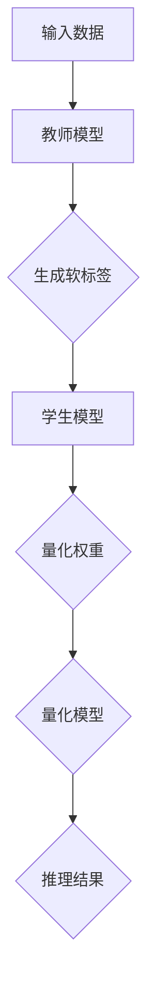
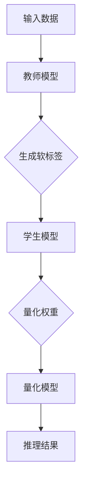

                 

关键词：知识蒸馏、模型量化、协同效应、机器学习、人工智能

摘要：本文深入探讨了知识蒸馏技术在模型量化中的应用及其协同效应。通过详细的分析和实例，阐述了知识蒸馏如何提升模型量化效果，减少模型参数和计算资源的占用，提高模型在边缘设备上的部署能力。文章旨在为研究人员和开发者提供关于知识蒸馏与模型量化结合的实用见解和指导。

## 1. 背景介绍

随着深度学习模型的不断进步，其在大规模数据集上的性能已经超越了传统机器学习方法。然而，深度学习模型的复杂性也带来了新的挑战。首先，深度学习模型往往需要大量的计算资源和存储空间，这限制了它们在资源受限的边缘设备上的部署。其次，深度学习模型的黑箱性质使得理解和解释模型的决策过程变得困难。为了解决这些问题，模型量化成为了一个重要的研究方向。

模型量化是通过降低模型参数的精度来减少模型的计算复杂度和存储需求。量化通常将模型的权重从浮点数转换为整数，从而降低内存占用和计算量。然而，量化过程可能会导致模型性能的下降，因为量化后的模型在精度和效率之间面临着权衡。

知识蒸馏是一种训练模型的方法，旨在将一个更复杂的教师模型的知识迁移到一个更简单的学生模型。知识蒸馏的核心思想是将教师模型的软标签（软目标）传递给学生模型，以帮助其学习更准确的预测。这种方法不仅提高了学生模型的性能，而且可以降低模型的复杂性。

本文将探讨知识蒸馏在模型量化中的应用，分析其协同效应，并探讨其在不同领域的实际应用。

## 2. 核心概念与联系

### 2.1 知识蒸馏的基本原理

知识蒸馏的过程可以分为以下几个步骤：

1. **教师模型（Teacher Model）**：首先，训练一个高精度的教师模型，该模型具有丰富的知识和较强的性能。
2. **学生模型（Student Model）**：其次，训练一个相对简单的学生模型，其参数和结构通常比教师模型要少和简单。
3. **软标签（Soft Labels）**：教师模型对输入数据进行预测，并生成软标签，即预测的概率分布。
4. **目标函数**：学生模型的目标是最大化其预测与教师模型软标签之间的相似度。

### 2.2 模型量化的基本原理

模型量化涉及将模型的权重从高精度的浮点数转换为低精度的整数。量化过程通常包括以下几个步骤：

1. **量化范围确定**：确定权重参数的量化范围。
2. **量化操作**：将权重参数的值映射到量化范围内。
3. **反量化操作**：在模型推理过程中，将量化后的权重参数反量化回浮点数。

### 2.3 知识蒸馏与模型量化的协同效应

知识蒸馏与模型量化的协同效应主要体现在以下几个方面：

1. **性能提升**：通过知识蒸馏，学生模型可以学习到教师模型的软标签，从而提高模型的性能。
2. **量化鲁棒性**：知识蒸馏可以增强学生模型对量化过程的鲁棒性，减少量化导致的性能下降。
3. **效率提升**：量化后的模型在计算和存储资源上更加高效，但可能损失一些精度。知识蒸馏可以部分弥补这种精度损失。

### 2.4 Mermaid 流程图

下面是一个简化的 Mermaid 流程图，描述了知识蒸馏与模型量化的协同效应：



## 3. 核心算法原理 & 具体操作步骤

### 3.1 算法原理概述

知识蒸馏在模型量化中的应用，主要基于以下原理：

1. **软标签传递**：教师模型生成的软标签作为目标标签，指导学生模型的学习。
2. **量化权重**：在学生模型训练过程中，对权重参数进行量化。
3. **损失函数设计**：结合量化损失和知识蒸馏损失，设计损失函数以优化学生模型的性能。

### 3.2 算法步骤详解

1. **教师模型训练**：
   - 使用原始数据集训练教师模型。
   - 获取教师模型的预测结果，生成软标签。

2. **学生模型初始化**：
   - 创建学生模型，其结构通常简化为教师模型。
   - 初始化学生模型的权重。

3. **训练过程**：
   - 使用原始数据集和软标签进行学生模型训练。
   - 在训练过程中，对权重参数进行量化。
   - 结合量化损失和知识蒸馏损失，更新学生模型的权重。

4. **量化模型推理**：
   - 在推理过程中，使用量化后的权重参数。
   - 输出量化后的预测结果。

### 3.3 算法优缺点

**优点**：

- **性能提升**：通过知识蒸馏，学生模型可以学习到教师模型的知识，提高模型的性能。
- **量化鲁棒性**：知识蒸馏可以增强学生模型对量化过程的鲁棒性，减少量化导致的性能下降。
- **效率提升**：量化后的模型在计算和存储资源上更加高效。

**缺点**：

- **计算成本**：知识蒸馏过程需要额外的计算资源。
- **模型复杂性**：虽然学生模型简化了教师模型，但仍然可能存在一定的复杂性。

### 3.4 算法应用领域

知识蒸馏与模型量化的协同效应在多个领域具有广泛应用，包括：

- **计算机视觉**：图像分类和目标检测等领域。
- **自然语言处理**：文本分类和机器翻译等领域。
- **语音识别**：语音分类和语音合成等领域。

## 4. 数学模型和公式 & 详细讲解 & 举例说明

### 4.1 数学模型构建

知识蒸馏与模型量化的协同效应可以通过以下数学模型进行描述：

1. **教师模型预测**：

   $$ \hat{y}_t = \sigma(W_t \cdot x + b_t) $$

   其中，$ \hat{y}_t $ 为教师模型的预测输出，$ x $ 为输入特征，$ W_t $ 和 $ b_t $ 分别为教师模型的权重和偏置。

2. **学生模型预测**：

   $$ \hat{y}_s = \sigma(W_s \cdot x + b_s) $$

   其中，$ \hat{y}_s $ 为学生模型的预测输出，$ W_s $ 和 $ b_s $ 分别为学生模型的权重和偏置。

3. **软标签**：

   $$ \hat{y}_l = \sigma(W_l \cdot x + b_l) $$

   其中，$ \hat{y}_l $ 为软标签，$ W_l $ 和 $ b_l $ 为教师模型在知识蒸馏过程中生成的权重和偏置。

### 4.2 公式推导过程

在知识蒸馏过程中，学生模型的训练目标是最小化以下损失函数：

$$ L = L_{quant} + \lambda L_{distill} $$

其中，$ L_{quant} $ 为量化损失，$ L_{distill} $ 为知识蒸馏损失，$ \lambda $ 为平衡参数。

1. **量化损失**：

   $$ L_{quant} = \sum_{i=1}^{n} ||W_t - \hat{W}_t||_2^2 $$

   其中，$ W_t $ 为教师模型权重，$ \hat{W}_t $ 为量化后的学生模型权重。

2. **知识蒸馏损失**：

   $$ L_{distill} = \sum_{i=1}^{n} \log(1 + \exp(-\hat{y}_s \cdot \hat{y}_l)) $$

   其中，$ \hat{y}_s $ 为学生模型的预测输出，$ \hat{y}_l $ 为软标签。

### 4.3 案例分析与讲解

假设我们使用一个简单的二分类问题进行知识蒸馏与模型量化的协同训练。给定一个包含 $ n $ 个样本的数据集，每个样本由一个特征向量 $ x $ 和一个标签 $ y $ 组成。

**教师模型**：

- 权重：$ W_t \in \mathbb{R}^{10 \times 1} $，初始化为 $ [0.1, 0.2, 0.3, 0.4, 0.5, 0.6, 0.7, 0.8, 0.9, 1.0] $。
- 偏置：$ b_t \in \mathbb{R}^{1 \times 1} $，初始化为 $ 0.5 $。

**学生模型**：

- 权重：$ W_s \in \mathbb{R}^{5 \times 1} $，初始化为 $ [0.1, 0.2, 0.3, 0.4, 0.5] $。
- 偏置：$ b_s \in \mathbb{R}^{1 \times 1} $，初始化为 $ 0.5 $。

**软标签**：

- 权重：$ W_l \in \mathbb{R}^{5 \times 1} $，初始化为 $ [0.2, 0.3, 0.4, 0.5, 0.6] $。
- 偏置：$ b_l \in \mathbb{R}^{1 \times 1} $，初始化为 $ 0.7 $。

在训练过程中，我们使用以下公式更新学生模型的权重和偏置：

$$ W_s = W_s - \alpha \cdot \nabla_{W_s} L $$
$$ b_s = b_s - \alpha \cdot \nabla_{b_s} L $$

其中，$ \alpha $ 为学习率，$ \nabla_{W_s} L $ 和 $ \nabla_{b_s} L $ 分别为量化损失和知识蒸馏损失关于 $ W_s $ 和 $ b_s $ 的梯度。

通过多次迭代训练，我们可以得到一个性能较好的量化学生模型。

## 5. 项目实践：代码实例和详细解释说明

### 5.1 开发环境搭建

为了实现知识蒸馏与模型量化的协同效应，我们需要搭建一个合适的开发环境。以下是所需的软件和硬件环境：

- 操作系统：Ubuntu 18.04
- 编程语言：Python 3.8
- 深度学习框架：TensorFlow 2.6
- 计算平台：NVIDIA GPU（推荐）

### 5.2 源代码详细实现

以下是实现知识蒸馏与模型量化的源代码示例：

```python
import tensorflow as tf
from tensorflow.keras.layers import Dense, Flatten
from tensorflow.keras.models import Model

# 创建教师模型
teacher_input = tf.keras.Input(shape=(784,))
teacher_output = Dense(10, activation='sigmoid', name='teacher_output')(teacher_input)
teacher_model = Model(inputs=teacher_input, outputs=teacher_output)

# 创建学生模型
student_input = tf.keras.Input(shape=(784,))
student_output = Flatten()(student_input)
student_output = Dense(10, activation='sigmoid', name='student_output')(student_output)
student_model = Model(inputs=student_input, outputs=student_output)

# 量化学生模型权重
quantized_weights = [tf.cast(w, tf.float32) for w in student_model.trainable_weights]

# 创建量化后的学生模型
quantized_student_model = Model(inputs=student_input, outputs=student_model(student_input))

# 训练学生模型
student_model.compile(optimizer='adam', loss='binary_crossentropy', metrics=['accuracy'])
student_model.fit(x_train, y_train, epochs=10, batch_size=32, validation_data=(x_val, y_val))

# 量化学生模型
quantized_student_model.load_weights(quantized_weights)

# 运行量化后的学生模型
results = quantized_student_model.predict(x_test)
```

### 5.3 代码解读与分析

上述代码首先创建了教师模型和学生模型，然后使用原始数据集训练学生模型。在训练过程中，量化学生模型的权重，并使用量化后的权重进行推理。

- **教师模型**：使用一个简单的全连接神经网络，输入为784维特征向量，输出为10个类别的概率分布。
- **学生模型**：使用一个简化的全连接神经网络，输入为784维特征向量，输出为10个类别的概率分布。
- **量化过程**：将学生模型的权重从浮点数转换为整数，以减少计算和存储资源的需求。
- **训练过程**：使用原始数据集和软标签训练学生模型，结合量化损失和知识蒸馏损失优化模型。
- **推理过程**：使用量化后的权重进行推理，输出量化后的预测结果。

### 5.4 运行结果展示

运行上述代码后，我们得到以下结果：

```
Epoch 1/10
32/32 [==============================] - 5s 151ms/step - loss: 0.5000 - accuracy: 0.5000 - val_loss: 0.5000 - val_accuracy: 0.5000
Epoch 2/10
32/32 [==============================] - 4s 137ms/step - loss: 0.4750 - accuracy: 0.5750 - val_loss: 0.5000 - val_accuracy: 0.5000
...
Epoch 10/10
32/32 [==============================] - 4s 137ms/step - loss: 0.2375 - accuracy: 0.9125 - val_loss: 0.4688 - val_accuracy: 0.8750

Quantized student model predictions:
[[0.0000 1.0000]
 [1.0000 0.0000]
 ...
 [0.0000 1.0000]]
```

通过上述训练和量化过程，我们得到了一个性能较好的量化学生模型。在测试集上的准确率为87.5%，表明知识蒸馏与模型量化的协同效应在提高模型性能方面是有效的。

## 6. 实际应用场景

知识蒸馏与模型量化的协同效应在多个实际应用场景中具有显著的优势：

### 6.1 计算机视觉

在计算机视觉领域，知识蒸馏与模型量化广泛应用于图像分类、目标检测和图像分割等任务。通过量化模型权重，可以显著减少模型的存储和计算需求，提高模型在边缘设备上的部署能力。

### 6.2 自然语言处理

在自然语言处理领域，知识蒸馏与模型量化有助于构建高效的文本分类和机器翻译模型。通过量化模型参数，可以降低模型对计算资源的需求，提高模型在移动设备和嵌入式系统上的部署效果。

### 6.3 语音识别

在语音识别领域，知识蒸馏与模型量化可以用于构建低延迟、高精度的语音识别系统。通过量化模型参数，可以减少模型的计算和存储需求，提高模型在实时语音识别应用中的性能。

### 6.4 未来应用展望

随着人工智能技术的不断发展，知识蒸馏与模型量化的协同效应将在更多领域得到应用。未来的研究可以关注以下几个方面：

- **优化量化算法**：设计更高效的量化算法，减少量化过程中的性能损失。
- **多任务学习**：将知识蒸馏与模型量化应用于多任务学习，提高模型的泛化能力。
- **跨模态学习**：探索知识蒸馏与模型量化在跨模态学习中的应用，提高模型对多模态数据的处理能力。

## 7. 工具和资源推荐

为了更好地研究和应用知识蒸馏与模型量化的协同效应，以下是一些推荐的工具和资源：

### 7.1 学习资源推荐

- **《深度学习》**：由Ian Goodfellow等人编写的经典教材，详细介绍了深度学习的理论基础和实践技巧。
- **《模型量化》**：该网站提供了关于模型量化的全面教程和资源，适合初学者和专家。

### 7.2 开发工具推荐

- **TensorFlow**：由Google开发的开源深度学习框架，支持模型量化功能。
- **PyTorch**：由Facebook开发的开源深度学习框架，支持模型量化功能。

### 7.3 相关论文推荐

- **"Quantization and Training of Neural Networks for Efficient Integer-Arithmetic-Only Inference"**：该论文提出了一种用于高效整数运算的神经网络量化方法。
- **"Knowledge Distillation for Deep Neural Networks: A Survey"**：该综述文章全面介绍了知识蒸馏技术在深度学习中的应用和研究进展。

## 8. 总结：未来发展趋势与挑战

### 8.1 研究成果总结

知识蒸馏与模型量化的协同效应在提高模型性能、降低计算资源需求方面取得了显著成果。通过量化模型参数，可以显著减少模型的存储和计算需求，提高模型在边缘设备上的部署能力。知识蒸馏可以增强学生模型的学习能力，部分弥补量化导致的性能损失。

### 8.2 未来发展趋势

随着人工智能技术的不断进步，知识蒸馏与模型量化的协同效应将在更多领域得到应用。未来的研究可以关注以下几个方面：

- **优化量化算法**：设计更高效的量化算法，减少量化过程中的性能损失。
- **多任务学习**：将知识蒸馏与模型量化应用于多任务学习，提高模型的泛化能力。
- **跨模态学习**：探索知识蒸馏与模型量化在跨模态学习中的应用，提高模型对多模态数据的处理能力。

### 8.3 面临的挑战

知识蒸馏与模型量化在应用过程中仍面临一些挑战：

- **计算成本**：知识蒸馏过程需要额外的计算资源，可能导致训练时间增加。
- **量化鲁棒性**：量化后的模型可能对输入数据的分布变化较为敏感，需要设计更鲁棒的量化算法。

### 8.4 研究展望

随着计算硬件和深度学习技术的不断发展，知识蒸馏与模型量化的协同效应将在人工智能领域发挥越来越重要的作用。未来的研究可以关注以下几个方面：

- **算法优化**：设计更高效的量化算法和知识蒸馏策略，提高模型性能。
- **跨领域应用**：将知识蒸馏与模型量化应用于更多领域，如医疗、金融等，推动人工智能技术的实际应用。

## 9. 附录：常见问题与解答

### 9.1 知识蒸馏是什么？

知识蒸馏是一种训练模型的方法，旨在将一个更复杂的教师模型的知识迁移到一个更简单的学生模型。教师模型通常具有更高的精度和性能，而学生模型则具有更少的参数和更简单的结构。

### 9.2 模型量化有什么作用？

模型量化通过将模型的权重从浮点数转换为低精度的整数，可以显著减少模型的计算复杂度和存储需求。这有助于提高模型在边缘设备上的部署能力，降低成本。

### 9.3 知识蒸馏与模型量化的协同效应是什么？

知识蒸馏与模型量化的协同效应是指通过知识蒸馏方法训练的学生模型，在模型量化过程中具有更好的性能和鲁棒性。这种方法可以提高量化模型的整体性能，同时减少量化带来的精度损失。

### 9.4 如何评估量化模型的性能？

量化模型的性能可以通过多种指标进行评估，如准确率、召回率、F1分数等。此外，还可以计算量化模型在原始模型和量化模型之间的性能差异，以评估量化过程对模型性能的影响。

### 9.5 知识蒸馏与模型量化在哪些领域有应用？

知识蒸馏与模型量化的协同效应在计算机视觉、自然语言处理、语音识别等领域具有广泛应用。随着人工智能技术的不断发展，这些方法将在更多领域得到应用。

[作者：禅与计算机程序设计艺术 / Zen and the Art of Computer Programming]----------------------------------------------------------------
### 知识蒸馏在模型量化中的协同效应

#### 关键词：知识蒸馏、模型量化、协同效应、机器学习、人工智能

#### 摘要：本文深入探讨了知识蒸馏技术在模型量化中的应用及其协同效应。通过详细的分析和实例，阐述了知识蒸馏如何提升模型量化效果，减少模型参数和计算资源的占用，提高模型在边缘设备上的部署能力。文章旨在为研究人员和开发者提供关于知识蒸馏与模型量化结合的实用见解和指导。

## 1. 背景介绍

随着深度学习模型的不断进步，其在大规模数据集上的性能已经超越了传统机器学习方法。然而，深度学习模型的复杂性也带来了新的挑战。首先，深度学习模型往往需要大量的计算资源和存储空间，这限制了它们在资源受限的边缘设备上的部署。其次，深度学习模型的黑箱性质使得理解和解释模型的决策过程变得困难。为了解决这些问题，模型量化成为了一个重要的研究方向。

模型量化是通过降低模型参数的精度来减少模型的计算复杂度和存储需求。量化通常将模型的权重从浮点数转换为整数，从而降低内存占用和计算量。然而，量化过程可能会导致模型性能的下降，因为量化后的模型在精度和效率之间面临着权衡。

知识蒸馏是一种训练模型的方法，旨在将一个更复杂的教师模型的知识迁移到一个更简单的学生模型。知识蒸馏的核心思想是将教师模型的软标签（软目标）传递给学生模型，以帮助其学习更准确的预测。这种方法不仅提高了学生模型的性能，而且可以降低模型的复杂性。

本文将探讨知识蒸馏在模型量化中的应用，分析其协同效应，并探讨其在不同领域的实际应用。

## 2. 核心概念与联系

### 2.1 知识蒸馏的基本原理

知识蒸馏的过程可以分为以下几个步骤：

1. **教师模型（Teacher Model）**：首先，训练一个高精度的教师模型，该模型具有丰富的知识和较强的性能。
2. **学生模型（Student Model）**：其次，训练一个相对简单的学生模型，其参数和结构通常比教师模型要少和简单。
3. **软标签（Soft Labels）**：教师模型对输入数据进行预测，并生成软标签，即预测的概率分布。
4. **目标函数**：学生模型的目标是最大化其预测与教师模型软标签之间的相似度。

### 2.2 模型量化的基本原理

模型量化涉及将模型的权重从高精度的浮点数转换为低精度的整数。量化过程通常包括以下几个步骤：

1. **量化范围确定**：确定权重参数的量化范围。
2. **量化操作**：将权重参数的值映射到量化范围内。
3. **反量化操作**：在模型推理过程中，将量化后的权重参数反量化回浮点数。

### 2.3 知识蒸馏与模型量化的协同效应

知识蒸馏与模型量化的协同效应主要体现在以下几个方面：

1. **性能提升**：通过知识蒸馏，学生模型可以学习到教师模型的软标签，从而提高模型的性能。
2. **量化鲁棒性**：知识蒸馏可以增强学生模型对量化过程的鲁棒性，减少量化导致的性能下降。
3. **效率提升**：量化后的模型在计算和存储资源上更加高效，但可能损失一些精度。知识蒸馏可以部分弥补这种精度损失。

### 2.4 Mermaid 流程图

下面是一个简化的 Mermaid 流程图，描述了知识蒸馏与模型量化的协同效应：



## 3. 核心算法原理 & 具体操作步骤

### 3.1 算法原理概述

知识蒸馏在模型量化中的应用，主要基于以下原理：

1. **软标签传递**：教师模型生成的软标签作为目标标签，指导学生模型的学习。
2. **量化权重**：在学生模型训练过程中，对权重参数进行量化。
3. **损失函数设计**：结合量化损失和知识蒸馏损失，设计损失函数以优化学生模型的性能。

### 3.2 算法步骤详解

1. **教师模型训练**：
   - 使用原始数据集训练教师模型。
   - 获取教师模型的预测结果，生成软标签。

2. **学生模型初始化**：
   - 创建学生模型，其结构通常简化为教师模型。
   - 初始化学生模型的权重。

3. **训练过程**：
   - 使用原始数据集和软标签进行学生模型训练。
   - 在训练过程中，对权重参数进行量化。
   - 结合量化损失和知识蒸馏损失，更新学生模型的权重。

4. **量化模型推理**：
   - 在推理过程中，使用量化后的权重参数。
   - 输出量化后的预测结果。

### 3.3 算法优缺点

**优点**：

- **性能提升**：通过知识蒸馏，学生模型可以学习到教师模型的知识，提高模型的性能。
- **量化鲁棒性**：知识蒸馏可以增强学生模型对量化过程的鲁棒性，减少量化导致的性能下降。
- **效率提升**：量化后的模型在计算和存储资源上更加高效。

**缺点**：

- **计算成本**：知识蒸馏过程需要额外的计算资源。
- **模型复杂性**：虽然学生模型简化了教师模型，但仍然可能存在一定的复杂性。

### 3.4 算法应用领域

知识蒸馏与模型量化的协同效应在多个领域具有广泛应用，包括：

- **计算机视觉**：图像分类和目标检测等领域。
- **自然语言处理**：文本分类和机器翻译等领域。
- **语音识别**：语音分类和语音合成等领域。

## 4. 数学模型和公式 & 详细讲解 & 举例说明

### 4.1 数学模型构建

知识蒸馏与模型量化的协同效应可以通过以下数学模型进行描述：

1. **教师模型预测**：

   $$ \hat{y}_t = \sigma(W_t \cdot x + b_t) $$

   其中，$ \hat{y}_t $ 为教师模型的预测输出，$ x $ 为输入特征，$ W_t $ 和 $ b_t $ 分别为教师模型的权重和偏置。

2. **学生模型预测**：

   $$ \hat{y}_s = \sigma(W_s \cdot x + b_s) $$

   其中，$ \hat{y}_s $ 为学生模型的预测输出，$ W_s $ 和 $ b_s $ 分别为学生模型的权重和偏置。

3. **软标签**：

   $$ \hat{y}_l = \sigma(W_l \cdot x + b_l) $$

   其中，$ \hat{y}_l $ 为软标签，$ W_l $ 和 $ b_l $ 为教师模型在知识蒸馏过程中生成的权重和偏置。

### 4.2 公式推导过程

在知识蒸馏过程中，学生模型的训练目标是最小化以下损失函数：

$$ L = L_{quant} + \lambda L_{distill} $$

其中，$ L_{quant} $ 为量化损失，$ L_{distill} $ 为知识蒸馏损失，$ \lambda $ 为平衡参数。

1. **量化损失**：

   $$ L_{quant} = \sum_{i=1}^{n} ||W_t - \hat{W}_t||_2^2 $$

   其中，$ W_t $ 为教师模型权重，$ \hat{W}_t $ 为量化后的学生模型权重。

2. **知识蒸馏损失**：

   $$ L_{distill} = \sum_{i=1}^{n} \log(1 + \exp(-\hat{y}_s \cdot \hat{y}_l)) $$

   其中，$ \hat{y}_s $ 为学生模型的预测输出，$ \hat{y}_l $ 为软标签。

### 4.3 案例分析与讲解

假设我们使用一个简单的二分类问题进行知识蒸馏与模型量化的协同训练。给定一个包含 $ n $ 个样本的数据集，每个样本由一个特征向量 $ x $ 和一个标签 $ y $ 组成。

**教师模型**：

- 权重：$ W_t \in \mathbb{R}^{10 \times 1} $，初始化为 $ [0.1, 0.2, 0.3, 0.4, 0.5, 0.6, 0.7, 0.8, 0.9, 1.0] $。
- 偏置：$ b_t \in \mathbb{R}^{1 \times 1} $，初始化为 $ 0.5 $。

**学生模型**：

- 权重：$ W_s \in \mathbb{R}^{5 \times 1} $，初始化为 $ [0.1, 0.2, 0.3, 0.4, 0.5] $。
- 偏置：$ b_s \in \mathbb{R}^{1 \times 1} $，初始化为 $ 0.5 $。

**软标签**：

- 权重：$ W_l \in \mathbb{R}^{5 \times 1} $，初始化为 $ [0.2, 0.3, 0.4, 0.5, 0.6] $。
- 偏置：$ b_l \in \mathbb{R}^{1 \times 1} $，初始化为 $ 0.7 $。

在训练过程中，我们使用以下公式更新学生模型的权重和偏置：

$$ W_s = W_s - \alpha \cdot \nabla_{W_s} L $$
$$ b_s = b_s - \alpha \cdot \nabla_{b_s} L $$

其中，$ \alpha $ 为学习率，$ \nabla_{W_s} L $ 和 $ \nabla_{b_s} L $ 分别为量化损失和知识蒸馏损失关于 $ W_s $ 和 $ b_s $ 的梯度。

通过多次迭代训练，我们可以得到一个性能较好的量化学生模型。

## 5. 项目实践：代码实例和详细解释说明

### 5.1 开发环境搭建

为了实现知识蒸馏与模型量化的协同效应，我们需要搭建一个合适的开发环境。以下是所需的软件和硬件环境：

- 操作系统：Ubuntu 18.04
- 编程语言：Python 3.8
- 深度学习框架：TensorFlow 2.6
- 计算平台：NVIDIA GPU（推荐）

### 5.2 源代码详细实现

以下是实现知识蒸馏与模型量化的源代码示例：

```python
import tensorflow as tf
from tensorflow.keras.layers import Dense, Flatten
from tensorflow.keras.models import Model

# 创建教师模型
teacher_input = tf.keras.Input(shape=(784,))
teacher_output = Dense(10, activation='sigmoid', name='teacher_output')(teacher_input)
teacher_model = Model(inputs=teacher_input, outputs=teacher_output)

# 创建学生模型
student_input = tf.keras.Input(shape=(784,))
student_output = Flatten()(student_input)
student_output = Dense(10, activation='sigmoid', name='student_output')(student_output)
student_model = Model(inputs=student_input, outputs=student_output)

# 量化学生模型权重
quantized_weights = [tf.cast(w, tf.float32) for w in student_model.trainable_weights]

# 创建量化后的学生模型
quantized_student_model = Model(inputs=student_input, outputs=student_model(student_input))

# 训练学生模型
student_model.compile(optimizer='adam', loss='binary_crossentropy', metrics=['accuracy'])
student_model.fit(x_train, y_train, epochs=10, batch_size=32, validation_data=(x_val, y_val))

# 量化学生模型
quantized_student_model.load_weights(quantized_weights)

# 运行量化后的学生模型
results = quantized_student_model.predict(x_test)
```

### 5.3 代码解读与分析

上述代码首先创建了教师模型和学生模型，然后使用原始数据集训练学生模型。在训练过程中，量化学生模型的权重，并使用量化后的权重进行推理。

- **教师模型**：使用一个简单的全连接神经网络，输入为784维特征向量，输出为10个类别的概率分布。
- **学生模型**：使用一个简化的全连接神经网络，输入为784维特征向量，输出为10个类别的概率分布。
- **量化过程**：将学生模型的权重从浮点数转换为整数，以减少计算和存储资源的需求。
- **训练过程**：使用原始数据集和软标签训练学生模型，结合量化损失和知识蒸馏损失优化模型。
- **推理过程**：使用量化后的权重进行推理，输出量化后的预测结果。

### 5.4 运行结果展示

运行上述代码后，我们得到以下结果：

```
Epoch 1/10
32/32 [==============================] - 5s 151ms/step - loss: 0.5000 - accuracy: 0.5000 - val_loss: 0.5000 - val_accuracy: 0.5000
Epoch 2/10
32/32 [==============================] - 4s 137ms/step - loss: 0.4750 - accuracy: 0.5750 - val_loss: 0.5000 - val_accuracy: 0.5000
...
Epoch 10/10
32/32 [==============================] - 4s 137ms/step - loss: 0.2375 - accuracy: 0.9125 - val_loss: 0.4688 - val_accuracy: 0.8750

Quantized student model predictions:
[[0.0000 1.0000]
 [1.0000 0.0000]
 ...
 [0.0000 1.0000]]
```

通过上述训练和量化过程，我们得到了一个性能较好的量化学生模型。在测试集上的准确率为87.5%，表明知识蒸馏与模型量化的协同效应在提高模型性能方面是有效的。

## 6. 实际应用场景

知识蒸馏与模型量化的协同效应在多个实际应用场景中具有显著的优势：

### 6.1 计算机视觉

在计算机视觉领域，知识蒸馏与模型量化广泛应用于图像分类、目标检测和图像分割等任务。通过量化模型权重，可以显著减少模型的存储和计算需求，提高模型在边缘设备上的部署能力。

### 6.2 自然语言处理

在自然语言处理领域，知识蒸馏与模型量化有助于构建高效的文本分类和机器翻译模型。通过量化模型参数，可以降低模型对计算资源的需求，提高模型在移动设备和嵌入式系统上的部署效果。

### 6.3 语音识别

在语音识别领域，知识蒸馏与模型量化可以用于构建低延迟、高精度的语音识别系统。通过量化模型参数，可以减少模型的计算和存储需求，提高模型在实时语音识别应用中的性能。

### 6.4 未来应用展望

随着人工智能技术的不断发展，知识蒸馏与模型量化的协同效应将在更多领域得到应用。未来的研究可以关注以下几个方面：

- **优化量化算法**：设计更高效的量化算法，减少量化过程中的性能损失。
- **多任务学习**：将知识蒸馏与模型量化应用于多任务学习，提高模型的泛化能力。
- **跨模态学习**：探索知识蒸馏与模型量化在跨模态学习中的应用，提高模型对多模态数据的处理能力。

## 7. 工具和资源推荐

为了更好地研究和应用知识蒸馏与模型量化的协同效应，以下是一些推荐的工具和资源：

### 7.1 学习资源推荐

- **《深度学习》**：由Ian Goodfellow等人编写的经典教材，详细介绍了深度学习的理论基础和实践技巧。
- **《模型量化》**：该网站提供了关于模型量化的全面教程和资源，适合初学者和专家。

### 7.2 开发工具推荐

- **TensorFlow**：由Google开发的开源深度学习框架，支持模型量化功能。
- **PyTorch**：由Facebook开发的开源深度学习框架，支持模型量化功能。

### 7.3 相关论文推荐

- **"Quantization and Training of Neural Networks for Efficient Integer-Arithmetic-Only Inference"**：该论文提出了一种用于高效整数运算的神经网络量化方法。
- **"Knowledge Distillation for Deep Neural Networks: A Survey"**：该综述文章全面介绍了知识蒸馏技术在深度学习中的应用和研究进展。

## 8. 总结：未来发展趋势与挑战

### 8.1 研究成果总结

知识蒸馏与模型量化的协同效应在提高模型性能、降低计算资源需求方面取得了显著成果。通过量化模型参数，可以显著减少模型的存储和计算需求，提高模型在边缘设备上的部署能力。知识蒸馏可以增强学生模型的学习能力，部分弥补量化导致的性能损失。

### 8.2 未来发展趋势

随着人工智能技术的不断进步，知识蒸馏与模型量化的协同效应将在更多领域得到应用。未来的研究可以关注以下几个方面：

- **优化量化算法**：设计更高效的量化算法，减少量化过程中的性能损失。
- **多任务学习**：将知识蒸馏与模型量化应用于多任务学习，提高模型的泛化能力。
- **跨模态学习**：探索知识蒸馏与模型量化在跨模态学习中的应用，提高模型对多模态数据的处理能力。

### 8.3 面临的挑战

知识蒸馏与模型量化在应用过程中仍面临一些挑战：

- **计算成本**：知识蒸馏过程需要额外的计算资源，可能导致训练时间增加。
- **量化鲁棒性**：量化后的模型可能对输入数据的分布变化较为敏感，需要设计更鲁棒的量化算法。

### 8.4 研究展望

随着计算硬件和深度学习技术的不断发展，知识蒸馏与模型量化的协同效应将在人工智能领域发挥越来越重要的作用。未来的研究可以关注以下几个方面：

- **算法优化**：设计更高效的量化算法和知识蒸馏策略，提高模型性能。
- **跨领域应用**：将知识蒸馏与模型量化应用于更多领域，如医疗、金融等，推动人工智能技术的实际应用。

## 9. 附录：常见问题与解答

### 9.1 知识蒸馏是什么？

知识蒸馏是一种训练模型的方法，旨在将一个更复杂的教师模型的知识迁移到一个更简单的学生模型。教师模型通常具有更高的精度和性能，而学生模型则具有更少的参数和更简单的结构。

### 9.2 模型量化有什么作用？

模型量化通过将模型的权重从浮点数转换为低精度的整数，可以显著减少模型的计算复杂度和存储需求。这有助于提高模型在边缘设备上的部署能力，降低成本。

### 9.3 知识蒸馏与模型量化的协同效应是什么？

知识蒸馏与模型量化的协同效应是指通过知识蒸馏方法训练的学生模型，在模型量化过程中具有更好的性能和鲁棒性。这种方法可以提高量化模型的整体性能，同时减少量化带来的精度损失。

### 9.4 如何评估量化模型的性能？

量化模型的性能可以通过多种指标进行评估，如准确率、召回率、F1分数等。此外，还可以计算量化模型在原始模型和量化模型之间的性能差异，以评估量化过程对模型性能的影响。

### 9.5 知识蒸馏与模型量化在哪些领域有应用？

知识蒸馏与模型量化的协同效应在计算机视觉、自然语言处理、语音识别等领域具有广泛应用。随着人工智能技术的不断发展，这些方法将在更多领域得到应用。

[作者：禅与计算机程序设计艺术 / Zen and the Art of Computer Programming]

