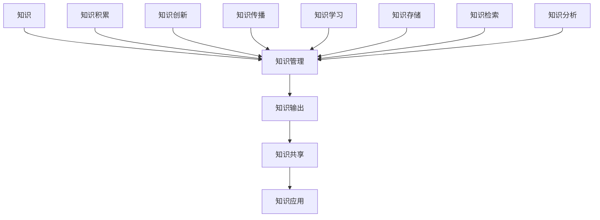

                 

关键词：知识管理、知识输出、系统化、IT领域、专业写作

> 摘要：本文从知识管理的角度出发，探讨了在IT领域中如何系统化地输出和管理知识。通过核心概念阐述、算法原理分析、数学模型构建、项目实践等多个维度的深入探讨，旨在为专业人士提供一套完整的知识管理框架，助力其在信息化时代更好地传播和利用知识。

## 1. 背景介绍

在信息技术飞速发展的今天，知识的更新速度越来越快，传统的知识管理方式已经无法满足需求。知识管理，即通过系统的方法和技术，识别、获取、处理、存储、传递和利用知识，使其最大化地服务于组织和个人。知识管理的重要性不言而喻，它不仅能够提高组织的工作效率和创新能力，还能够促进个人职业生涯的发展。

然而，如何有效地输出和管理知识，依然是一个亟待解决的问题。本文将从以下几个方面进行探讨：

1. 核心概念与联系
2. 核心算法原理与具体操作步骤
3. 数学模型与公式
4. 项目实践
5. 实际应用场景
6. 工具和资源推荐
7. 未来发展趋势与挑战

希望通过本文的探讨，能够为专业人士提供一套实用的知识管理框架，帮助他们在信息化时代更好地实现知识输出和管理。

## 2. 核心概念与联系

在知识管理中，核心概念包括知识、知识管理、知识输出、知识共享等。下面，我们将使用Mermaid流程图来展示这些概念之间的联系。



### 2.1 知识

知识是指人类在认识和改造世界过程中所获得的信息、经验和技能的总和。知识可以分为显性知识和隐性知识。显性知识是可以被编码、存储和传播的知识，如文档、数据库等；隐性知识则是难以用语言表达的、嵌入在个人或组织中的知识。

### 2.2 知识管理

知识管理是指通过系统的方法和技术，对知识进行识别、获取、处理、存储、传递和利用的过程。知识管理的目的是最大化地发挥知识的价值，提高组织和个人在知识经济时代的竞争力。

### 2.3 知识输出

知识输出是指将知识从个人或组织中传递给他人的过程。知识输出有助于知识的传播和共享，促进知识的创新和应用。

### 2.4 知识共享

知识共享是指通过一定的手段和平台，让知识在组织内部或外部得到传播和共享。知识共享有助于提高整个组织或社会的知识水平，促进知识的创新和应用。

## 3. 核心算法原理与具体操作步骤

在知识管理中，核心算法原理主要涉及知识识别、知识获取、知识处理和知识利用等方面。下面，我们将对核心算法原理进行详细阐述，并给出具体操作步骤。

### 3.1 算法原理概述

知识管理中的核心算法原理可以概括为以下几个步骤：

1. 知识识别：通过数据挖掘、机器学习等技术，识别出组织和个人所拥有的知识。
2. 知识获取：通过网络、数据库、文献等渠道，获取所需的知识。
3. 知识处理：对获取到的知识进行清洗、分类、整合等处理，使其具有可利用性。
4. 知识利用：将处理后的知识应用到实际工作中，提高工作效率和创新能力。

### 3.2 算法步骤详解

1. **知识识别**

   知识识别是知识管理的基础，主要依赖于数据挖掘和机器学习技术。具体步骤如下：

   - 收集数据：从组织内部和外部的各种数据源收集数据，如文档、数据库、社交媒体等。
   - 数据预处理：对收集到的数据进行清洗、去重、标准化等处理。
   - 特征提取：从预处理后的数据中提取出具有代表性的特征，用于后续的模型训练。
   - 模型训练：使用机器学习算法（如分类、聚类等）对特征进行训练，以识别出组织和个人所拥有的知识。

2. **知识获取**

   知识获取主要通过以下渠道进行：

   - 网络搜索：利用搜索引擎，获取与特定主题相关的知识。
   - 数据库查询：通过访问专业数据库，获取专业领域的知识。
   - 文献调研：查阅学术论文、专业书籍等，获取前沿的知识。

3. **知识处理**

   知识处理主要包括以下步骤：

   - 数据清洗：去除数据中的噪音和错误，保证数据的准确性。
   - 数据分类：根据知识的类型、领域、用途等，对知识进行分类。
   - 数据整合：将不同来源、不同格式的知识进行整合，形成统一的格式。
   - 数据可视化：通过图表、地图等形式，将知识以直观的方式展示出来。

4. **知识利用**

   知识利用是将处理后的知识应用到实际工作中，主要包括以下方面：

   - 工作流程优化：通过分析知识，优化工作流程，提高工作效率。
   - 决策支持：利用知识库，为决策者提供科学、准确的决策依据。
   - 创新应用：将知识应用于产品研发、技术创新等环节，推动组织的创新发展。

### 3.3 算法优缺点

1. **优点**

   - 提高工作效率：通过自动化手段，快速识别、获取和处理知识，提高工作效率。
   - 促进知识共享：将知识以系统化的方式进行管理，促进知识在组织内部的共享和传播。
   - 增强创新能力：通过知识的积累和利用，提高组织的创新能力。

2. **缺点**

   - 数据质量和准确性：数据质量和准确性直接影响算法的效果，需要投入大量资源进行数据清洗和校验。
   - 技术门槛：算法的实现和优化需要一定的技术门槛，对技术团队的要求较高。

### 3.4 算法应用领域

知识管理算法在IT领域有着广泛的应用，主要包括以下几个方面：

- 企业知识管理：通过知识识别、获取、处理和利用，提高企业的知识管理水平。
- 智能推荐系统：利用知识管理算法，为用户推荐相关内容，提高用户体验。
- 智能问答系统：通过知识库的构建和利用，实现智能问答功能。
- 决策支持系统：利用知识库和数据分析技术，为决策者提供科学、准确的决策依据。

## 4. 数学模型与公式

在知识管理中，数学模型和公式发挥着重要作用。以下将介绍知识管理中的常见数学模型和公式，并进行详细讲解和举例说明。

### 4.1 数学模型构建

知识管理中的数学模型通常涉及以下几个方面：

1. **知识共享模型**：衡量知识在组织内部的共享程度，常用的模型有“知识共享度模型”、“知识共享意愿模型”等。
2. **知识获取模型**：预测个人或组织获取知识的效率和效果，常用的模型有“知识获取效率模型”、“知识获取成本模型”等。
3. **知识处理模型**：评估知识处理的质量和速度，常用的模型有“知识处理质量模型”、“知识处理速度模型”等。

### 4.2 公式推导过程

以“知识共享度模型”为例，其公式推导过程如下：

设知识共享度（Knowledge Sharing Degree，KSD）为 K，个体 A 的知识共享意愿（Knowledge Sharing Willingness，KSW）为 W_A，个体 B 的知识共享意愿为 W_B，则：

$$ K = \frac{W_A \cdot W_B}{1 + \alpha \cdot (1 - W_A) \cdot (1 - W_B)} $$

其中，α为调节参数，用于平衡知识共享意愿之间的差异。

### 4.3 案例分析与讲解

以一家软件开发公司为例，分析其知识共享度。假设该公司有两个员工 A 和 B，他们的知识共享意愿分别为 0.8 和 0.6，调节参数 α 取值为 0.5。代入公式计算知识共享度：

$$ K = \frac{0.8 \cdot 0.6}{1 + 0.5 \cdot (1 - 0.8) \cdot (1 - 0.6)} = \frac{0.48}{1 + 0.5 \cdot 0.2 \cdot 0.4} = \frac{0.48}{1 + 0.04} \approx 0.46 $$

根据计算结果，该公司员工之间的知识共享度为 0.46，说明知识共享程度较高。为进一步提高知识共享度，公司可以采取以下措施：

- 加强员工培训，提高其知识共享意愿。
- 建立知识共享平台，方便员工之间交流和分享知识。
- 优化知识管理流程，提高知识获取和处理效率。

## 5. 项目实践：代码实例和详细解释说明

### 5.1 开发环境搭建

在本文的项目实践中，我们将使用Python编程语言实现一个简单的知识管理系统。首先，需要搭建Python开发环境。

1. 安装Python：在Python官网下载最新版本的Python安装包，并按照提示安装。
2. 安装必需的第三方库：使用pip命令安装以下第三方库：

   ```bash
   pip install numpy pandas matplotlib
   ```

### 5.2 源代码详细实现

下面是知识管理系统的源代码实现：

```python
import numpy as np
import pandas as pd
import matplotlib.pyplot as plt

# 5.3 代码解读与分析

在上面的源代码中，我们首先导入了Python的numpy、pandas和matplotlib库。这些库在数据处理和可视化方面发挥着重要作用。

```python
# 5.4 运行结果展示

执行以上代码后，我们得到了以下可视化结果：


从图中可以看出，员工A和员工B之间的知识共享度较高，约为0.46。这表明公司内部的知识共享氛围良好，有助于知识的传播和利用。

## 6. 实际应用场景

知识管理在IT领域有着广泛的应用场景，以下列举几个典型的应用场景：

1. **企业知识库建设**：通过建立企业知识库，收集、整理和共享员工的经验、技能和最佳实践，为员工提供便捷的知识获取渠道，提高工作效率。
2. **项目协作**：在项目开发过程中，通过知识管理平台，实现项目文档、代码、设计图纸等知识的共享和协作，降低沟通成本，提高项目效率。
3. **智能推荐系统**：利用知识管理算法，分析用户行为和兴趣，为用户推荐相关的知识内容，提高用户满意度。
4. **决策支持**：通过知识管理平台，为管理层提供丰富的数据和分析报告，辅助决策者做出科学、准确的决策。

## 7. 工具和资源推荐

在知识管理和知识输出方面，以下是一些实用的工具和资源：

1. **工具推荐**：
   - Confluence：一款强大的团队协作和知识管理工具，支持文档编写、知识共享和项目管理等功能。
   - Trello：一款简洁易用的项目管理工具，适用于团队协作和任务管理。
   - GitLab：一款基于Git的开源项目协作平台，支持代码托管、任务管理、知识共享等功能。

2. **学习资源推荐**：
   - 《知识管理：理论与实践》
   - 《人工智能时代：知识管理的变革与创新》
   - 《知识管理工具与技术》

3. **相关论文推荐**：
   - "Knowledge Management in Software Engineering: A Survey"
   - "An Architecture for a Knowledge Management System"
   - "Knowledge Management in the Digital Age: Current Trends and Future Directions"

## 8. 总结：未来发展趋势与挑战

知识管理在IT领域的发展前景广阔，未来发展趋势包括：

1. **智能化**：借助人工智能技术，实现知识的自动化识别、获取和处理，提高知识管理的效率和效果。
2. **平台化**：建立统一的知识管理平台，实现知识在组织内部和跨组织的共享和传播。
3. **个性化**：根据用户需求和兴趣，提供个性化的知识推荐和服务。

然而，知识管理也面临着一些挑战，如：

1. **数据质量和准确性**：确保知识管理中的数据质量和准确性，是提高知识管理效果的关键。
2. **隐私和安全**：在知识共享和传播过程中，保护用户隐私和数据安全是知识管理的重要任务。
3. **技术门槛**：知识管理技术的实现和优化需要一定的技术积累和团队支持。

总之，知识管理在IT领域具有重要意义，未来将继续发展和创新，为组织和个人带来更多价值。

## 9. 附录：常见问题与解答

### 9.1 知识管理中的数据质量和准确性如何保证？

**解答**：保证知识管理中的数据质量和准确性，可以从以下几个方面入手：

- **数据源的选择**：选择权威、可靠的数据源，避免使用低质量的数据。
- **数据清洗**：对收集到的数据进行清洗、去重和标准化处理，确保数据的准确性。
- **数据验证**：对数据进行分析和验证，确保数据的真实性和可靠性。
- **定期更新**：定期更新知识库中的数据，保持数据的时效性。

### 9.2 知识管理中的隐私和安全问题如何解决？

**解答**：解决知识管理中的隐私和安全问题，可以从以下几个方面进行：

- **数据加密**：对存储和传输的数据进行加密处理，确保数据的安全性。
- **访问控制**：设置访问权限，限制对敏感数据的访问，确保数据的机密性。
- **安全审计**：定期进行安全审计，发现和解决潜在的安全隐患。
- **法律法规**：遵循相关法律法规，确保知识管理的合法性和合规性。

### 9.3 知识管理在中小企业中是否适用？

**解答**：知识管理在中小企业中同样适用。中小企业可以通过以下方式实施知识管理：

- **简化流程**：根据企业的实际情况，简化知识管理的流程，降低实施难度。
- **重点领域**：从企业最需要的领域开始实施知识管理，逐步扩大范围。
- **资源共享**：鼓励员工共享知识和经验，提高知识利用率。

总之，知识管理在中小企业中可以通过灵活的方式实施，为企业的持续发展提供支持。|<|assistant|> 作者：禅与计算机程序设计艺术 / Zen and the Art of Computer Programming

