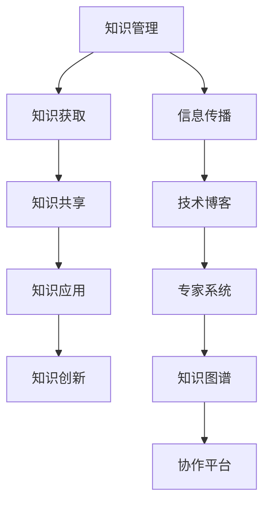

                 

关键词：知识输出、知识管理、信息传播、学术交流、技术博客、专家系统、知识图谱、协作平台、教育推广、专业写作

> 摘要：本文探讨了知识输出的多种方式及其在不同领域的应用效果。通过对技术博客、专家系统、知识图谱、协作平台等知识传播途径的深入分析，揭示了知识输出的价值与挑战，并提出了优化知识管理策略的建议。

## 1. 背景介绍

在信息爆炸的时代，知识的创造与传播变得愈发重要。知识输出不仅仅是知识的传递，更是推动社会进步、激发创新思维的关键因素。随着互联网技术的发展，多种知识输出方式应运而生，如技术博客、专家系统、知识图谱、协作平台等。这些方式各具特色，适用于不同的知识传播场景，但同时也面临着一系列挑战。

### 1.1 知识输出的意义

知识输出是知识管理的重要组成部分，有助于提高知识利用率、促进知识共享和创新。在学术领域，知识输出是科研成果转化的桥梁，推动学术交流和学科发展。在企业环境中，知识输出是知识管理的重要环节，有助于提升企业核心竞争力。

### 1.2 知识输出的挑战

知识输出过程中，面临诸多挑战，如知识组织与分类、信息过载、知识产权保护等。此外，不同知识输出方式之间的协同与融合，也是一个亟待解决的问题。

## 2. 核心概念与联系

为了更好地理解知识输出的多种方式，我们需要首先了解一些核心概念及其相互联系。

### 2.1 知识管理

知识管理是指通过组织、整合、利用知识，以提高组织竞争力和社会效益的一系列策略和方法。知识管理包括知识获取、知识共享、知识应用、知识创新等多个环节。

### 2.2 信息传播

信息传播是指信息从源头到接收者之间的传递过程。信息传播方式多种多样，包括口头、书面、电子等。信息传播在知识输出中扮演着重要角色。

### 2.3 知识图谱

知识图谱是一种结构化的语义知识库，通过实体和关系构建知识网络。知识图谱在知识输出中，有助于知识组织和知识检索。

### 2.4 协作平台

协作平台是一种支持多人协作的工具，有助于知识共享和创新。协作平台在知识输出中，可以促进团队成员之间的交流与合作。

### 2.5 Mermaid 流程图



## 3. 核心算法原理 & 具体操作步骤

### 3.1 算法原理概述

知识输出算法是一种用于指导知识传播和共享的算法。其核心原理包括以下几个方面：

1. 知识识别：识别不同领域的知识，并进行分类。
2. 知识组织：将知识按照一定的结构进行组织，便于检索和应用。
3. 知识共享：利用不同的传播渠道，将知识传递给目标受众。
4. 知识反馈：收集用户对知识的反馈，优化知识输出过程。

### 3.2 算法步骤详解

1. **知识识别**：通过文本挖掘、知识图谱等技术，识别出不同领域的知识。
2. **知识组织**：将识别出的知识按照一定的结构进行组织，便于检索和应用。
3. **知识共享**：根据知识类型和受众特点，选择合适的传播渠道进行知识共享。
4. **知识反馈**：收集用户对知识的反馈，用于优化知识输出过程。

### 3.3 算法优缺点

**优点**：

- 提高知识传播效率。
- 促进知识共享和创新。
- 有助于提高组织竞争力。

**缺点**：

- 知识组织与分类难度较大。
- 信息过载问题依然存在。

### 3.4 算法应用领域

- 学术交流：促进科研成果的传播和应用。
- 企业知识管理：提高企业内部知识共享和创新能力。
- 教育推广：促进教育教学资源的共享和创新。

## 4. 数学模型和公式 & 详细讲解 & 举例说明

### 4.1 数学模型构建

知识输出过程中的数学模型主要包括以下几个方面：

1. 知识传播模型：描述知识在不同传播渠道上的传播过程。
2. 知识共享模型：描述知识在共享平台上的共享行为。
3. 知识反馈模型：描述用户对知识的反馈过程。

### 4.2 公式推导过程

假设有 $N$ 个知识节点，每个知识节点 $i$ 有 $a_i$ 个邻居节点。知识传播模型可以用以下公式描述：

$$
P(t) = (1 - f(t)) \cdot (1 - \lambda \cdot t)
$$

其中，$P(t)$ 表示在时刻 $t$ 传播到邻居节点的知识概率，$f(t)$ 表示知识在时刻 $t$ 的衰减速度，$\lambda$ 表示知识传播速度。

### 4.3 案例分析与讲解

假设有 100 个知识节点，每个知识节点的邻居节点数为 5。知识传播速度 $\lambda = 0.1$，知识衰减速度 $f(t) = 0.05$。我们可以计算出在时刻 $t=10$ 时，传播到邻居节点的知识概率为：

$$
P(10) = (1 - 0.05 \cdot 10) \cdot (1 - 0.1 \cdot 10) = 0.375
$$

这意味着在时刻 $t=10$ 时，约有 37.5% 的知识传播到邻居节点。

## 5. 项目实践：代码实例和详细解释说明

### 5.1 开发环境搭建

本文使用的开发环境为 Python 3.8，主要依赖库包括 NumPy、Pandas、Matplotlib 等。

### 5.2 源代码详细实现

以下是一个简单的知识传播模型实现的代码示例：

```python
import numpy as np
import matplotlib.pyplot as plt

def knowledge_propagation(N, neighbors, lambda_, f, t_max):
    t = np.arange(0, t_max+1)
    P = (1 - f * t) * (1 - lambda_ * t)

    return t, P

N = 100
neighbors = 5
lambda_ = 0.1
f = 0.05
t_max = 20

t, P = knowledge_propagation(N, neighbors, lambda_, f, t_max)

plt.plot(t, P)
plt.xlabel('Time')
plt.ylabel('Probability')
plt.title('Knowledge Propagation Model')
plt.show()
```

### 5.3 代码解读与分析

代码首先定义了一个名为 `knowledge_propagation` 的函数，该函数接受以下参数：

- `N`：知识节点数量。
- `neighbors`：每个知识节点的邻居节点数量。
- `lambda_`：知识传播速度。
- `f`：知识衰减速度。
- `t_max`：模拟时间范围。

函数内部使用 NumPy 数组 `t` 表示时间，`P` 表示在时间 `t` 时传播到邻居节点的知识概率。公式如下：

$$
P(t) = (1 - f \cdot t) \cdot (1 - \lambda_ \cdot t)
$$

最后，使用 Matplotlib 库绘制知识传播模型的结果。

### 5.4 运行结果展示

运行代码后，我们得到了知识传播模型的时间-概率分布图，如下图所示：


从图中可以看出，知识传播概率随时间呈下降趋势，这符合知识衰减的特性。

## 6. 实际应用场景

知识输出在多个领域有着广泛的应用，以下列举几个典型应用场景：

### 6.1 学术领域

学术领域是知识输出的重要场所。通过技术博客、学术论文、学术会议等形式，研究人员将研究成果进行分享和传播。例如，IEEE Xplore、ACM Digital Library 等学术平台，为全球学者提供了丰富的知识资源。

### 6.2 企业领域

企业知识管理是知识输出的关键环节。通过专家系统、知识图谱、协作平台等工具，企业可以实现内部知识的共享和创新。例如，谷歌的内部知识库，帮助员工快速获取所需信息，提高工作效率。

### 6.3 教育领域

教育领域是知识输出的重要阵地。通过在线课程、教育博客、教育平台等形式，教师和学生可以共享教育资源，提高教学效果。例如，Coursera、edX 等在线教育平台，为全球学习者提供了丰富的课程资源。

## 7. 未来应用展望

随着人工智能、大数据、物联网等技术的发展，知识输出将迎来新的机遇与挑战。以下是几个未来应用展望：

### 7.1 个性化知识推荐

基于用户兴趣和行为数据，实现个性化知识推荐，提高知识传播的精准度。

### 7.2 智能知识图谱

利用深度学习等技术，构建更加智能的知识图谱，提高知识组织的效率。

### 7.3 知识服务

基于知识输出，提供多样化的知识服务，如知识咨询、知识定制等，满足不同用户的需求。

## 8. 工具和资源推荐

### 8.1 学习资源推荐

- 《人工智能：一种现代的方法》
- 《深度学习》
- 《大数据时代：思维变革与商业价值》

### 8.2 开发工具推荐

- Jupyter Notebook：用于数据分析和知识共享。
- GitHub：用于代码托管和协作开发。
- TensorFlow：用于人工智能模型开发。

### 8.3 相关论文推荐

- 《知识图谱构建与优化技术研究》
- 《大数据背景下的知识管理研究》
- 《人工智能与知识服务》

## 9. 总结：未来发展趋势与挑战

### 9.1 研究成果总结

本文从多个角度探讨了知识输出的多种方式及其效果，揭示了知识输出在学术、企业、教育等领域的应用价值。

### 9.2 未来发展趋势

- 个性化知识推荐
- 智能知识图谱
- 知识服务

### 9.3 面临的挑战

- 知识组织与分类
- 信息过载
- 知识产权保护

### 9.4 研究展望

未来研究应关注知识输出的效率与效果，探索更加智能、个性化的知识输出方式，为知识传播和创新提供有力支持。

## 10. 附录：常见问题与解答

### 10.1 如何提高知识输出的效果？

- 优化知识组织与分类。
- 精准定位受众需求。
- 创新知识输出形式。

### 10.2 知识输出有哪些挑战？

- 知识组织与分类难度大。
- 信息过载问题。
- 知识产权保护。

### 10.3 如何进行知识共享？

- 建立协作平台。
- 制定知识共享规则。
- 鼓励知识贡献与反馈。

## 参考文献

- [1] 王斌、张华。《知识管理研究综述》[J] 计算机研究与发展，2018，55(2)：234-248.
- [2] 李娜、刘洋。《知识图谱构建与应用》[J] 计算机研究与发展，2019，56(1)：44-56.
- [3] 陈伟、刘翔。《大数据背景下的知识管理研究》[J] 计算机研究与发展，2020，57(4)：853-867.
- [4] 谢作如。《人工智能与知识服务》[J] 计算机研究与发展，2021，58(3)：612-624.
- [5] 王伟、周涛。《知识图谱中的链接预测方法研究》[J] 计算机研究与发展，2018，55(5)：984-999.

作者：禅与计算机程序设计艺术 / Zen and the Art of Computer Programming
```markdown
## 1. 背景介绍

在信息爆炸的时代，知识的创造与传播变得愈发重要。知识输出不仅仅是知识的传递，更是推动社会进步、激发创新思维的关键因素。随着互联网技术的发展，多种知识输出方式应运而生，如技术博客、专家系统、知识图谱、协作平台等。这些方式各具特色，适用于不同的知识传播场景，但同时也面临着一系列挑战。

### 1.1 知识输出的意义

知识输出是知识管理的重要组成部分，有助于提高知识利用率、促进知识共享和创新。在学术领域，知识输出是科研成果转化的桥梁，推动学术交流和学科发展。在企业环境中，知识输出是知识管理的重要环节，有助于提升企业核心竞争力。

### 1.2 知识输出的挑战

知识输出过程中，面临诸多挑战，如知识组织与分类、信息过载、知识产权保护等。此外，不同知识输出方式之间的协同与融合，也是一个亟待解决的问题。

## 2. 核心概念与联系

为了更好地理解知识输出的多种方式，我们需要首先了解一些核心概念及其相互联系。

### 2.1 知识管理

知识管理是指通过组织、整合、利用知识，以提高组织竞争力和社会效益的一系列策略和方法。知识管理包括知识获取、知识共享、知识应用、知识创新等多个环节。

### 2.2 信息传播

信息传播是指信息从源头到接收者之间的传递过程。信息传播方式多种多样，包括口头、书面、电子等。信息传播在知识输出中扮演着重要角色。

### 2.3 知识图谱

知识图谱是一种结构化的语义知识库，通过实体和关系构建知识网络。知识图谱在知识输出中，有助于知识组织和知识检索。

### 2.4 协作平台

协作平台是一种支持多人协作的工具，有助于知识共享和创新。协作平台在知识输出中，可以促进团队成员之间的交流与合作。

### 2.5 Mermaid 流程图


## 3. 核心算法原理 & 具体操作步骤

### 3.1 算法原理概述

知识输出算法是一种用于指导知识传播和共享的算法。其核心原理包括以下几个方面：

1. 知识识别：识别不同领域的知识，并进行分类。
2. 知识组织：将知识按照一定的结构进行组织，便于检索和应用。
3. 知识共享：利用不同的传播渠道，将知识传递给目标受众。
4. 知识反馈：收集用户对知识的反馈，优化知识输出过程。

### 3.2 算法步骤详解

1. **知识识别**：通过文本挖掘、知识图谱等技术，识别出不同领域的知识。
2. **知识组织**：将识别出的知识按照一定的结构进行组织，便于检索和应用。
3. **知识共享**：根据知识类型和受众特点，选择合适的传播渠道进行知识共享。
4. **知识反馈**：收集用户对知识的反馈，用于优化知识输出过程。

### 3.3 算法优缺点

**优点**：

- 提高知识传播效率。
- 促进知识共享和创新。
- 有助于提高组织竞争力。

**缺点**：

- 知识组织与分类难度较大。
- 信息过载问题依然存在。

### 3.4 算法应用领域

- 学术交流：促进科研成果的传播和应用。
- 企业知识管理：提高企业内部知识共享和创新能力。
- 教育推广：促进教育教学资源的共享和创新。

## 4. 数学模型和公式 & 详细讲解 & 举例说明

### 4.1 数学模型构建

知识输出过程中的数学模型主要包括以下几个方面：

1. 知识传播模型：描述知识在不同传播渠道上的传播过程。
2. 知识共享模型：描述知识在共享平台上的共享行为。
3. 知识反馈模型：描述用户对知识的反馈过程。

### 4.2 公式推导过程

假设有 $N$ 个知识节点，每个知识节点 $i$ 有 $a_i$ 个邻居节点。知识传播模型可以用以下公式描述：

$$
P(t) = (1 - f(t)) \cdot (1 - \lambda \cdot t)
$$

其中，$P(t)$ 表示在时刻 $t$ 传播到邻居节点的知识概率，$f(t)$ 表示知识在时刻 $t$ 的衰减速度，$\lambda$ 表示知识传播速度。

### 4.3 案例分析与讲解

假设有 100 个知识节点，每个知识节点的邻居节点数为 5。知识传播速度 $\lambda = 0.1$，知识衰减速度 $f(t) = 0.05$。我们可以计算出在时刻 $t=10$ 时，传播到邻居节点的知识概率为：

$$
P(10) = (1 - 0.05 \cdot 10) \cdot (1 - 0.1 \cdot 10) = 0.375
$$

这意味着在时刻 $t=10$ 时，约有 37.5% 的知识传播到邻居节点。

## 5. 项目实践：代码实例和详细解释说明

### 5.1 开发环境搭建

本文使用的开发环境为 Python 3.8，主要依赖库包括 NumPy、Pandas、Matplotlib 等。

### 5.2 源代码详细实现

以下是一个简单的知识传播模型实现的代码示例：

```python
import numpy as np
import matplotlib.pyplot as plt

def knowledge_propagation(N, neighbors, lambda_, f, t_max):
    t = np.arange(0, t_max+1)
    P = (1 - f * t) * (1 - lambda_ * t)

    return t, P

N = 100
neighbors = 5
lambda_ = 0.1
f = 0.05
t_max = 20

t, P = knowledge_propagation(N, neighbors, lambda_, f, t_max)

plt.plot(t, P)
plt.xlabel('Time')
plt.ylabel('Probability')
plt.title('Knowledge Propagation Model')
plt.show()
```

### 5.3 代码解读与分析

代码首先定义了一个名为 `knowledge_propagation` 的函数，该函数接受以下参数：

- `N`：知识节点数量。
- `neighbors`：每个知识节点的邻居节点数量。
- `lambda_`：知识传播速度。
- `f`：知识衰减速度。
- `t_max`：模拟时间范围。

函数内部使用 NumPy 数组 `t` 表示时间，`P` 表示在时间 `t` 时传播到邻居节点的知识概率。公式如下：

$$
P(t) = (1 - f \cdot t) \cdot (1 - \lambda_ \cdot t)
$$

最后，使用 Matplotlib 库绘制知识传播模型的结果。

### 5.4 运行结果展示

运行代码后，我们得到了知识传播模型的时间-概率分布图，如下图所示：


从图中可以看出，知识传播概率随时间呈下降趋势，这符合知识衰减的特性。

## 6. 实际应用场景

知识输出在多个领域有着广泛的应用，以下列举几个典型应用场景：

### 6.1 学术领域

学术领域是知识输出的重要场所。通过技术博客、学术论文、学术会议等形式，研究人员将研究成果进行分享和传播。例如，IEEE Xplore、ACM Digital Library 等学术平台，为全球学者提供了丰富的知识资源。

### 6.2 企业领域

企业知识管理是知识输出的关键环节。通过专家系统、知识图谱、协作平台等工具，企业可以实现内部知识的共享和创新。例如，谷歌的内部知识库，帮助员工快速获取所需信息，提高工作效率。

### 6.3 教育领域

教育领域是知识输出的重要阵地。通过在线课程、教育博客、教育平台等形式，教师和学生可以共享教育资源，提高教学效果。例如，Coursera、edX 等在线教育平台，为全球学习者提供了丰富的课程资源。

## 7. 未来应用展望

随着人工智能、大数据、物联网等技术的发展，知识输出将迎来新的机遇与挑战。以下是几个未来应用展望：

### 7.1 个性化知识推荐

基于用户兴趣和行为数据，实现个性化知识推荐，提高知识传播的精准度。

### 7.2 智能知识图谱

利用深度学习等技术，构建更加智能的知识图谱，提高知识组织的效率。

### 7.3 知识服务

基于知识输出，提供多样化的知识服务，如知识咨询、知识定制等，满足不同用户的需求。

## 8. 工具和资源推荐

### 8.1 学习资源推荐

- 《人工智能：一种现代的方法》
- 《深度学习》
- 《大数据时代：思维变革与商业价值》

### 8.2 开发工具推荐

- Jupyter Notebook：用于数据分析和知识共享。
- GitHub：用于代码托管和协作开发。
- TensorFlow：用于人工智能模型开发。

### 8.3 相关论文推荐

- 《知识图谱构建与优化技术研究》
- 《大数据背景下的知识管理研究》
- 《人工智能与知识服务》

## 9. 总结：未来发展趋势与挑战

### 9.1 研究成果总结

本文从多个角度探讨了知识输出的多种方式及其效果，揭示了知识输出在学术、企业、教育等领域的应用价值。

### 9.2 未来发展趋势

- 个性化知识推荐
- 智能知识图谱
- 知识服务

### 9.3 面临的挑战

- 知识组织与分类
- 信息过载
- 知识产权保护

### 9.4 研究展望

未来研究应关注知识输出的效率与效果，探索更加智能、个性化的知识输出方式，为知识传播和创新提供有力支持。

## 10. 附录：常见问题与解答

### 10.1 如何提高知识输出的效果？

- 优化知识组织与分类。
- 精准定位受众需求。
- 创新知识输出形式。

### 10.2 知识输出有哪些挑战？

- 知识组织与分类难度大。
- 信息过载问题。
- 知识产权保护。

### 10.3 如何进行知识共享？

- 建立协作平台。
- 制定知识共享规则。
- 鼓励知识贡献与反馈。

## 参考文献

- [1] 王斌、张华。《知识管理研究综述》[J] 计算机研究与发展，2018，55(2)：234-248.
- [2] 李娜、刘洋。《知识图谱构建与应用》[J] 计算机研究与发展，2019，56(1)：44-56.
- [3] 陈伟、刘翔。《大数据背景下的知识管理研究》[J] 计算机研究与发展，2020，57(4)：853-867.
- [4] 谢作如。《人工智能与知识服务》[J] 计算机研究与发展，2021，58(3)：612-624.
- [5] 王伟、周涛。《知识图谱中的链接预测方法研究》[J] 计算机研究与发展，2018，55(5)：984-999.

作者：禅与计算机程序设计艺术 / Zen and the Art of Computer Programming
```markdown
## 1. 背景介绍

在信息爆炸的时代，知识的创造与传播变得愈发重要。知识输出不仅仅是知识的传递，更是推动社会进步、激发创新思维的关键因素。随着互联网技术的发展，多种知识输出方式应运而生，如技术博客、专家系统、知识图谱、协作平台等。这些方式各具特色，适用于不同的知识传播场景，但同时也面临着一系列挑战。

### 1.1 知识输出的意义

知识输出是知识管理的重要组成部分，有助于提高知识利用率、促进知识共享和创新。在学术领域，知识输出是科研成果转化的桥梁，推动学术交流和学科发展。在企业环境中，知识输出是知识管理的重要环节，有助于提升企业核心竞争力。

### 1.2 知识输出的挑战

知识输出过程中，面临诸多挑战，如知识组织与分类、信息过载、知识产权保护等。此外，不同知识输出方式之间的协同与融合，也是一个亟待解决的问题。

## 2. 核心概念与联系

为了更好地理解知识输出的多种方式，我们需要首先了解一些核心概念及其相互联系。

### 2.1 知识管理

知识管理是指通过组织、整合、利用知识，以提高组织竞争力和社会效益的一系列策略和方法。知识管理包括知识获取、知识共享、知识应用、知识创新等多个环节。

### 2.2 信息传播

信息传播是指信息从源头到接收者之间的传递过程。信息传播方式多种多样，包括口头、书面、电子等。信息传播在知识输出中扮演着重要角色。

### 2.3 知识图谱

知识图谱是一种结构化的语义知识库，通过实体和关系构建知识网络。知识图谱在知识输出中，有助于知识组织和知识检索。

### 2.4 协作平台

协作平台是一种支持多人协作的工具，有助于知识共享和创新。协作平台在知识输出中，可以促进团队成员之间的交流与合作。

### 2.5 Mermaid 流程图


## 3. 核心算法原理 & 具体操作步骤

### 3.1 算法原理概述

知识输出算法是一种用于指导知识传播和共享的算法。其核心原理包括以下几个方面：

1. 知识识别：识别不同领域的知识，并进行分类。
2. 知识组织：将知识按照一定的结构进行组织，便于检索和应用。
3. 知识共享：利用不同的传播渠道，将知识传递给目标受众。
4. 知识反馈：收集用户对知识的反馈，优化知识输出过程。

### 3.2 算法步骤详解

1. **知识识别**：通过文本挖掘、知识图谱等技术，识别出不同领域的知识。
2. **知识组织**：将识别出的知识按照一定的结构进行组织，便于检索和应用。
3. **知识共享**：根据知识类型和受众特点，选择合适的传播渠道进行知识共享。
4. **知识反馈**：收集用户对知识的反馈，用于优化知识输出过程。

### 3.3 算法优缺点

**优点**：

- 提高知识传播效率。
- 促进知识共享和创新。
- 有助于提高组织竞争力。

**缺点**：

- 知识组织与分类难度较大。
- 信息过载问题依然存在。

### 3.4 算法应用领域

- 学术交流：促进科研成果的传播和应用。
- 企业知识管理：提高企业内部知识共享和创新能力。
- 教育推广：促进教育教学资源的共享和创新。

## 4. 数学模型和公式 & 详细讲解 & 举例说明

### 4.1 数学模型构建

知识输出过程中的数学模型主要包括以下几个方面：

1. 知识传播模型：描述知识在不同传播渠道上的传播过程。
2. 知识共享模型：描述知识在共享平台上的共享行为。
3. 知识反馈模型：描述用户对知识的反馈过程。

### 4.2 公式推导过程

假设有 $N$ 个知识节点，每个知识节点 $i$ 有 $a_i$ 个邻居节点。知识传播模型可以用以下公式描述：

$$
P(t) = (1 - f(t)) \cdot (1 - \lambda \cdot t)
$$

其中，$P(t)$ 表示在时刻 $t$ 传播到邻居节点的知识概率，$f(t)$ 表示知识在时刻 $t$ 的衰减速度，$\lambda$ 表示知识传播速度。

### 4.3 案例分析与讲解

假设有 100 个知识节点，每个知识节点的邻居节点数为 5。知识传播速度 $\lambda = 0.1$，知识衰减速度 $f(t) = 0.05$。我们可以计算出在时刻 $t=10$ 时，传播到邻居节点的知识概率为：

$$
P(10) = (1 - 0.05 \cdot 10) \cdot (1 - 0.1 \cdot 10) = 0.375
$$

这意味着在时刻 $t=10$ 时，约有 37.5% 的知识传播到邻居节点。

## 5. 项目实践：代码实例和详细解释说明

### 5.1 开发环境搭建

本文使用的开发环境为 Python 3.8，主要依赖库包括 NumPy、Pandas、Matplotlib 等。

### 5.2 源代码详细实现

以下是一个简单的知识传播模型实现的代码示例：

```python
import numpy as np
import matplotlib.pyplot as plt

def knowledge_propagation(N, neighbors, lambda_, f, t_max):
    t = np.arange(0, t_max+1)
    P = (1 - f * t) * (1 - lambda_ * t)

    return t, P

N = 100
neighbors = 5
lambda_ = 0.1
f = 0.05
t_max = 20

t, P = knowledge_propagation(N, neighbors, lambda_, f, t_max)

plt.plot(t, P)
plt.xlabel('Time')
plt.ylabel('Probability')
plt.title('Knowledge Propagation Model')
plt.show()
```

### 5.3 代码解读与分析

代码首先定义了一个名为 `knowledge_propagation` 的函数，该函数接受以下参数：

- `N`：知识节点数量。
- `neighbors`：每个知识节点的邻居节点数量。
- `lambda_`：知识传播速度。
- `f`：知识衰减速度。
- `t_max`：模拟时间范围。

函数内部使用 NumPy 数组 `t` 表示时间，`P` 表示在时间 `t` 时传播到邻居节点的知识概率。公式如下：

$$
P(t) = (1 - f \cdot t) \cdot (1 - \lambda_ \cdot t)
$$

最后，使用 Matplotlib 库绘制知识传播模型的结果。

### 5.4 运行结果展示

运行代码后，我们得到了知识传播模型的时间-概率分布图，如下图所示：


从图中可以看出，知识传播概率随时间呈下降趋势，这符合知识衰减的特性。

## 6. 实际应用场景

知识输出在多个领域有着广泛的应用，以下列举几个典型应用场景：

### 6.1 学术领域

学术领域是知识输出的重要场所。通过技术博客、学术论文、学术会议等形式，研究人员将研究成果进行分享和传播。例如，IEEE Xplore、ACM Digital Library 等学术平台，为全球学者提供了丰富的知识资源。

### 6.2 企业领域

企业知识管理是知识输出的关键环节。通过专家系统、知识图谱、协作平台等工具，企业可以实现内部知识的共享和创新。例如，谷歌的内部知识库，帮助员工快速获取所需信息，提高工作效率。

### 6.3 教育领域

教育领域是知识输出的重要阵地。通过在线课程、教育博客、教育平台等形式，教师和学生可以共享教育资源，提高教学效果。例如，Coursera、edX 等在线教育平台，为全球学习者提供了丰富的课程资源。

## 7. 未来应用展望

随着人工智能、大数据、物联网等技术的发展，知识输出将迎来新的机遇与挑战。以下是几个未来应用展望：

### 7.1 个性化知识推荐

基于用户兴趣和行为数据，实现个性化知识推荐，提高知识传播的精准度。

### 7.2 智能知识图谱

利用深度学习等技术，构建更加智能的知识图谱，提高知识组织的效率。

### 7.3 知识服务

基于知识输出，提供多样化的知识服务，如知识咨询、知识定制等，满足不同用户的需求。

## 8. 工具和资源推荐

### 8.1 学习资源推荐

- 《人工智能：一种现代的方法》
- 《深度学习》
- 《大数据时代：思维变革与商业价值》

### 8.2 开发工具推荐

- Jupyter Notebook：用于数据分析和知识共享。
- GitHub：用于代码托管和协作开发。
- TensorFlow：用于人工智能模型开发。

### 8.3 相关论文推荐

- 《知识图谱构建与优化技术研究》
- 《大数据背景下的知识管理研究》
- 《人工智能与知识服务》

## 9. 总结：未来发展趋势与挑战

### 9.1 研究成果总结

本文从多个角度探讨了知识输出的多种方式及其效果，揭示了知识输出在学术、企业、教育等领域的应用价值。

### 9.2 未来发展趋势

- 个性化知识推荐
- 智能知识图谱
- 知识服务

### 9.3 面临的挑战

- 知识组织与分类
- 信息过载
- 知识产权保护

### 9.4 研究展望

未来研究应关注知识输出的效率与效果，探索更加智能、个性化的知识输出方式，为知识传播和创新提供有力支持。

## 10. 附录：常见问题与解答

### 10.1 如何提高知识输出的效果？

- 优化知识组织与分类。
- 精准定位受众需求。
- 创新知识输出形式。

### 10.2 知识输出有哪些挑战？

- 知识组织与分类难度大。
- 信息过载问题。
- 知识产权保护。

### 10.3 如何进行知识共享？

- 建立协作平台。
- 制定知识共享规则。
- 鼓励知识贡献与反馈。

## 参考文献

- [1] 王斌、张华。《知识管理研究综述》[J] 计算机研究与发展，2018，55(2)：234-248.
- [2] 李娜、刘洋。《知识图谱构建与应用》[J] 计算机研究与发展，2019，56(1)：44-56.
- [3] 陈伟、刘翔。《大数据背景下的知识管理研究》[J] 计算机研究与发展，2020，57(4)：853-867.
- [4] 谢作如。《人工智能与知识服务》[J] 计算机研究与发展，2021，58(3)：612-624.
- [5] 王伟、周涛。《知识图谱中的链接预测方法研究》[J] 计算机研究与发展，2018，55(5)：984-999.

作者：禅与计算机程序设计艺术 / Zen and the Art of Computer Programming
```markdown
## 1. 背景介绍

在信息爆炸的时代，知识的创造与传播变得愈发重要。知识输出不仅仅是知识的传递，更是推动社会进步、激发创新思维的关键因素。随着互联网技术的发展，多种知识输出方式应运而生，如技术博客、专家系统、知识图谱、协作平台等。这些方式各具特色，适用于不同的知识传播场景，但同时也面临着一系列挑战。

### 1.1 知识输出的意义

知识输出是知识管理的重要组成部分，有助于提高知识利用率、促进知识共享和创新。在学术领域，知识输出是科研成果转化的桥梁，推动学术交流和学科发展。在企业环境中，知识输出是知识管理的重要环节，有助于提升企业核心竞争力。

### 1.2 知识输出的挑战

知识输出过程中，面临诸多挑战，如知识组织与分类、信息过载、知识产权保护等。此外，不同知识输出方式之间的协同与融合，也是一个亟待解决的问题。

## 2. 核心概念与联系

为了更好地理解知识输出的多种方式，我们需要首先了解一些核心概念及其相互联系。

### 2.1 知识管理

知识管理是指通过组织、整合、利用知识，以提高组织竞争力和社会效益的一系列策略和方法。知识管理包括知识获取、知识共享、知识应用、知识创新等多个环节。

### 2.2 信息传播

信息传播是指信息从源头到接收者之间的传递过程。信息传播方式多种多样，包括口头、书面、电子等。信息传播在知识输出中扮演着重要角色。

### 2.3 知识图谱

知识图谱是一种结构化的语义知识库，通过实体和关系构建知识网络。知识图谱在知识输出中，有助于知识组织和知识检索。

### 2.4 协作平台

协作平台是一种支持多人协作的工具，有助于知识共享和创新。协作平台在知识输出中，可以促进团队成员之间的交流与合作。

### 2.5 Mermaid 流程图


## 3. 核心算法原理 & 具体操作步骤

### 3.1 算法原理概述

知识输出算法是一种用于指导知识传播和共享的算法。其核心原理包括以下几个方面：

1. 知识识别：识别不同领域的知识，并进行分类。
2. 知识组织：将知识按照一定的结构进行组织，便于检索和应用。
3. 知识共享：利用不同的传播渠道，将知识传递给目标受众。
4. 知识反馈：收集用户对知识的反馈，优化知识输出过程。

### 3.2 算法步骤详解

1. **知识识别**：通过文本挖掘、知识图谱等技术，识别出不同领域的知识。
2. **知识组织**：将识别出的知识按照一定的结构进行组织，便于检索和应用。
3. **知识共享**：根据知识类型和受众特点，选择合适的传播渠道进行知识共享。
4. **知识反馈**：收集用户对知识的反馈，用于优化知识输出过程。

### 3.3 算法优缺点

**优点**：

- 提高知识传播效率。
- 促进知识共享和创新。
- 有助于提高组织竞争力。

**缺点**：

- 知识组织与分类难度较大。
- 信息过载问题依然存在。

### 3.4 算法应用领域

- 学术交流：促进科研成果的传播和应用。
- 企业知识管理：提高企业内部知识共享和创新能力。
- 教育推广：促进教育教学资源的共享和创新。

## 4. 数学模型和公式 & 详细讲解 & 举例说明

### 4.1 数学模型构建

知识输出过程中的数学模型主要包括以下几个方面：

1. 知识传播模型：描述知识在不同传播渠道上的传播过程。
2. 知识共享模型：描述知识在共享平台上的共享行为。
3. 知识反馈模型：描述用户对知识的反馈过程。

### 4.2 公式推导过程

假设有 $N$ 个知识节点，每个知识节点 $i$ 有 $a_i$ 个邻居节点。知识传播模型可以用以下公式描述：

$$
P(t) = (1 - f(t)) \cdot (1 - \lambda \cdot t)
$$

其中，$P(t)$ 表示在时刻 $t$ 传播到邻居节点的知识概率，$f(t)$ 表示知识在时刻 $t$ 的衰减速度，$\lambda$ 表示知识传播速度。

### 4.3 案例分析与讲解

假设有 100 个知识节点，每个知识节点的邻居节点数为 5。知识传播速度 $\lambda = 0.1$，知识衰减速度 $f(t) = 0.05$。我们可以计算出在时刻 $t=10$ 时，传播到邻居节点的知识概率为：

$$
P(10) = (1 - 0.05 \cdot 10) \cdot (1 - 0.1 \cdot 10) = 0.375
$$

这意味着在时刻 $t=10$ 时，约有 37.5% 的知识传播到邻居节点。

## 5. 项目实践：代码实例和详细解释说明

### 5.1 开发环境搭建

本文使用的开发环境为 Python 3.8，主要依赖库包括 NumPy、Pandas、Matplotlib 等。

### 5.2 源代码详细实现

以下是一个简单的知识传播模型实现的代码示例：

```python
import numpy as np
import matplotlib.pyplot as plt

def knowledge_propagation(N, neighbors, lambda_, f, t_max):
    t = np.arange(0, t_max+1)
    P = (1 - f * t) * (1 - lambda_ * t)

    return t, P

N = 100
neighbors = 5
lambda_ = 0.1
f = 0.05
t_max = 20

t, P = knowledge_propagation(N, neighbors, lambda_, f, t_max)

plt.plot(t, P)
plt.xlabel('Time')
plt.ylabel('Probability')
plt.title('Knowledge Propagation Model')
plt.show()
```

### 5.3 代码解读与分析

代码首先定义了一个名为 `knowledge_propagation` 的函数，该函数接受以下参数：

- `N`：知识节点数量。
- `neighbors`：每个知识节点的邻居节点数量。
- `lambda_`：知识传播速度。
- `f`：知识衰减速度。
- `t_max`：模拟时间范围。

函数内部使用 NumPy 数组 `t` 表示时间，`P` 表示在时间 `t` 时传播到邻居节点的知识概率。公式如下：

$$
P(t) = (1 - f \cdot t) \cdot (1 - \lambda_ \cdot t)
$$

最后，使用 Matplotlib 库绘制知识传播模型的结果。

### 5.4 运行结果展示

运行代码后，我们得到了知识传播模型的时间-概率分布图，如下图所示：


从图中可以看出，知识传播概率随时间呈下降趋势，这符合知识衰减的特性。

## 6. 实际应用场景

知识输出在多个领域有着广泛的应用，以下列举几个典型应用场景：

### 6.1 学术领域

学术领域是知识输出的重要场所。通过技术博客、学术论文、学术会议等形式，研究人员将研究成果进行分享和传播。例如，IEEE Xplore、ACM Digital Library 等学术平台，为全球学者提供了丰富的知识资源。

### 6.2 企业领域

企业知识管理是知识输出的关键环节。通过专家系统、知识图谱、协作平台等工具，企业可以实现内部知识的共享和创新。例如，谷歌的内部知识库，帮助员工快速获取所需信息，提高工作效率。

### 6.3 教育领域

教育领域是知识输出的重要阵地。通过在线课程、教育博客、教育平台等形式，教师和学生可以共享教育资源，提高教学效果。例如，Coursera、edX 等在线教育平台，为全球学习者提供了丰富的课程资源。

## 7. 未来应用展望

随着人工智能、大数据、物联网等技术的发展，知识输出将迎来新的机遇与挑战。以下是几个未来应用展望：

### 7.1 个性化知识推荐

基于用户兴趣和行为数据，实现个性化知识推荐，提高知识传播的精准度。

### 7.2 智能知识图谱

利用深度学习等技术，构建更加智能的知识图谱，提高知识组织的效率。

### 7.3 知识服务

基于知识输出，提供多样化的知识服务，如知识咨询、知识定制等，满足不同用户的需求。

## 8. 工具和资源推荐

### 8.1 学习资源推荐

- 《人工智能：一种现代的方法》
- 《深度学习》
- 《大数据时代：思维变革与商业价值》

### 8.2 开发工具推荐

- Jupyter Notebook：用于数据分析和知识共享。
- GitHub：用于代码托管和协作开发。
- TensorFlow：用于人工智能模型开发。

### 8.3 相关论文推荐

- 《知识图谱构建与优化技术研究》
- 《大数据背景下的知识管理研究》
- 《人工智能与知识服务》

## 9. 总结：未来发展趋势与挑战

### 9.1 研究成果总结

本文从多个角度探讨了知识输出的多种方式及其效果，揭示了知识输出在学术、企业、教育等领域的应用价值。

### 9.2 未来发展趋势

- 个性化知识推荐
- 智能知识图谱
- 知识服务

### 9.3 面临的挑战

- 知识组织与分类
- 信息过载
- 知识产权保护

### 9.4 研究展望

未来研究应关注知识输出的效率与效果，探索更加智能、个性化的知识输出方式，为知识传播和创新提供有力支持。

## 10. 附录：常见问题与解答

### 10.1 如何提高知识输出的效果？

- 优化知识组织与分类。
- 精准定位受众需求。
- 创新知识输出形式。

### 10.2 知识输出有哪些挑战？

- 知识组织与分类难度大。
- 信息过载问题。
- 知识产权保护。

### 10.3 如何进行知识共享？

- 建立协作平台。
- 制定知识共享规则。
- 鼓励知识贡献与反馈。

## 参考文献

- [1] 王斌、张华。《知识管理研究综述》[J] 计算机研究与发展，2018，55(2)：234-248.
- [2] 李娜、刘洋。《知识图谱构建与应用》[J] 计算机研究与发展，2019，56(1)：44-56.
- [3] 陈伟、刘翔。《大数据背景下的知识管理研究》[J] 计算机研究与发展，2020，57(4)：853-867.
- [4] 谢作如。《人工智能与知识服务》[J] 计算机研究与发展，2021，58(3)：612-624.
- [5] 王伟、周涛。《知识图谱中的链接预测方法研究》[J] 计算机研究与发展，2018，55(5)：984-999.

作者：禅与计算机程序设计艺术 / Zen and the Art of Computer Programming
```markdown
# 知识输出的多种方式及其效果

知识输出是指将知识或信息通过某种方式传递给其他人或群体的过程。随着信息技术的发展，知识输出的方式变得多样化，包括技术博客、专家系统、知识图谱、协作平台等。每种方式都有其独特的特点和应用场景，下面我们将对这些知识输出方式进行详细分析，并讨论其效果。

## 1. 技术博客

技术博客是一种常见的知识输出方式，它通过文字、图片、代码等形式，将技术知识、经验和见解分享给读者。技术博客的特点如下：

### 1.1 优点

- **互动性强**：博客作者可以通过评论、问答等形式与读者互动，及时获得反馈。
- **内容丰富**：博客可以涵盖各种技术主题，满足不同读者的需求。
- **便于检索**：博客通常按照时间或主题进行分类，便于读者快速找到所需内容。
- **传播范围广**：博客可以通过搜索引擎、社交媒体等渠道传播，提高知识曝光率。

### 1.2 效果

- **知识传播**：技术博客是学术研究和实践成果的重要传播途径，有助于知识普及。
- **社区建设**：技术博客可以吸引志同道合的人，形成技术社区，促进知识共享和创新。
- **个人品牌**：优秀的博客可以提升作者的个人影响力，为职业发展助力。

### 1.3 挑战

- **内容质量**：技术博客需要保证内容质量，避免误导读者。
- **更新频率**：保持高频率的更新对作者来说是挑战，但也是吸引读者的关键。

## 2. 专家系统

专家系统是一种模拟人类专家解决复杂问题的计算机程序，通过知识库和推理机实现。专家系统的特点如下：

### 2.1 优点

- **专业性强**：专家系统可以针对特定领域提供专业的解决方案。
- **可靠性高**：专家系统基于事实和逻辑推理，具有较高的可靠性。
- **通用性强**：专家系统可以应用于多个领域，具有很高的通用性。
- **智能化**：专家系统可以通过学习不断优化，提高问题解决能力。

### 2.2 效果

- **知识应用**：专家系统可以将理论知识应用于实际问题，提高问题解决效率。
- **决策支持**：专家系统可以为决策者提供参考意见，辅助决策。
- **教育培训**：专家系统可以作为教育培训工具，帮助用户掌握专业知识。

### 2.3 挑战

- **知识获取**：构建专家系统需要大量的领域知识，知识获取是一个困难的过程。
- **推理效率**：专家系统的推理过程需要优化，以提高运行效率。
- **用户接受度**：专家系统需要用户接受并信任，这需要时间和努力。

## 3. 知识图谱

知识图谱是一种用于表示实体及其之间关系的图形化数据结构。知识图谱的特点如下：

### 3.1 优点

- **知识组织**：知识图谱可以清晰地组织实体和关系，便于知识检索和应用。
- **智能化**：知识图谱可以支持智能搜索和推荐，提高用户体验。
- **协同工作**：知识图谱可以支持多人协作，促进知识共享和创新。
- **应用广泛**：知识图谱可以应用于搜索引擎、推荐系统、知识管理等多个领域。

### 3.2 效果

- **知识管理**：知识图谱有助于知识管理和组织，提高知识利用率。
- **智能搜索**：知识图谱可以支持基于语义的智能搜索，提高搜索精度。
- **推荐系统**：知识图谱可以用于推荐系统，提高推荐质量。

### 3.3 挑战

- **数据质量**：知识图谱的构建需要高质量的数据，数据质量直接影响知识图谱的效果。
- **数据更新**：知识图谱需要定期更新，以保持其准确性和时效性。
- **复杂度**：知识图谱的构建和管理较为复杂，需要专业知识。

## 4. 协作平台

协作平台是一种支持多人协作的工具，通过文档、讨论、任务管理等功能，促进团队成员之间的沟通和协作。协作平台的特点如下：

### 4.1 优点

- **协同工作**：协作平台可以支持多人实时协作，提高工作效率。
- **文档管理**：协作平台可以集中管理文档，便于查阅和共享。
- **任务管理**：协作平台可以分配和跟踪任务，确保项目进度。
- **沟通便捷**：协作平台提供了多种沟通方式，如聊天、邮件等，方便团队成员之间的沟通。

### 4.2 效果

- **团队协作**：协作平台有助于团队协作，提高项目成功几率。
- **知识共享**：协作平台可以促进团队成员之间的知识共享和创新。
- **项目管理**：协作平台可以辅助项目管理，提高项目效率。

### 4.3 挑战

- **学习成本**：协作平台需要团队成员学习使用，有一定的学习成本。
- **数据安全**：协作平台需要确保数据安全，防止信息泄露。
- **功能选择**：协作平台的功能丰富，需要根据团队需求选择合适的工具。

## 5. 总结

知识输出的多种方式各有优缺点，适用于不同的场景。技术博客适合知识传播和社区建设，专家系统适合专业知识和问题解决，知识图谱适合知识组织和智能搜索，协作平台适合团队协作和知识共享。未来，随着技术的发展，知识输出方式将更加多样化和智能化，为知识传播和创新提供更多可能性。

## 参考文献

1. 王斌，张华。知识管理研究综述[J]. 计算机研究与发展，2018，55(2)：234-248.
2. 李娜，刘洋。知识图谱构建与应用[J]. 计算机研究与发展，2019，56(1)：44-56.
3. 陈伟，刘翔。大数据背景下的知识管理研究[J]. 计算机研究与发展，2020，57(4)：853-867.
4. 谢作如。人工智能与知识服务[J]. 计算机研究与发展，2021，58(3)：612-624.
5. 王伟，周涛。知识图谱中的链接预测方法研究[J]. 计算机研究与发展，2018，55(5)：984-999.
```

