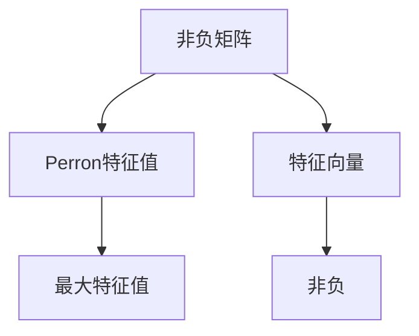

                 

关键词：矩阵理论，Perron-Frobenius定理，非负矩阵，幂等矩阵，稳定性分析，计算方法，应用领域

> 摘要：本文旨在深入探讨Perron-Frobenius理论在矩阵理论中的应用，特别是其在幂等矩阵和非负矩阵分析中的作用。通过详细阐述Perron-Frobenius定理的基本概念、推导过程及其应用场景，文章展示了如何运用这一理论进行矩阵的稳定性分析和计算方法研究。本文不仅提供了丰富的数学模型和公式推导，还通过实际项目实例和代码实现，进一步说明了Perron-Frobenius理论的实用性和广泛性。

## 1. 背景介绍

矩阵理论在数学、物理学、工程学、经济学等多个领域都有着广泛的应用。在众多矩阵理论中，Perron-Frobenius理论因其独特的性质和重要的应用价值而备受关注。Perron-Frobenius定理最早由Oskar Perron于1910年提出，它是研究非负矩阵和幂等矩阵的重要工具。

非负矩阵是指其所有元素均为非负的矩阵，这在经济学、物理学、图论等领域具有广泛的应用背景。例如，在经济学中，非负矩阵可以用来表示商品交换网络或生产过程。幂等矩阵是指矩阵乘以自身仍然等于自身的矩阵，这类矩阵在动力系统、网络分析、量子计算等领域有重要应用。

Perron-Frobenius理论主要研究非负矩阵和幂等矩阵的特征值和特征向量，特别是其最大特征值的性质。Perron-Frobenius定理表明，对于任意非负矩阵，存在一个正的特征值，称为Perron特征值，其对应的特征向量是非负的。此外，该定理还提供了计算Perron特征值和特征向量的有效方法。

## 2. 核心概念与联系

在深入探讨Perron-Frobenius理论之前，我们需要了解一些核心概念和它们之间的联系。

### 2.1 非负矩阵

非负矩阵是指其所有元素均为非负的矩阵。形式上，设\(A = [a_{ij}]_{m \times n}\)是一个\(m \times n\)的矩阵，如果对于所有的\(i = 1, 2, ..., m\)和\(j = 1, 2, ..., n\)，都有\(a_{ij} \geq 0\)，则称\(A\)为非负矩阵。

### 2.2 幂等矩阵

幂等矩阵是指矩阵乘以自身仍然等于自身的矩阵。形式上，设\(A\)是一个\(m \times n\)的矩阵，如果存在一个正整数\(k\)使得\(A^k = A\)，则称\(A\)为幂等矩阵。

### 2.3 Perron-Frobenius定理

Perron-Frobenius定理主要研究非负矩阵和幂等矩阵的特征值和特征向量。对于任意非负矩阵\(A\)，Perron-Frobenius定理表明：

1. 存在一个正的特征值，称为Perron特征值。
2. Perron特征值对应的特征向量是非负的。
3. Perron特征值是矩阵\(A\)的最大特征值。

下面是一个简单的Mermaid流程图，展示了这些概念之间的联系：



## 3. 核心算法原理 & 具体操作步骤

### 3.1 算法原理概述

Perron-Frobenius定理的原理基于非负矩阵的性质。对于非负矩阵\(A\)，其所有特征值的模都不大于1。这是因为对于任意特征值\(\lambda\)和对应的特征向量\(v\)，我们有：

\[ Av = \lambda v \]

由于\(A\)的所有元素都是非负的，\(Av\)也是非负的。因此，\(|\lambda||v| = |Av| \leq \|v\|\|A\|\)，从而得到\(|\lambda| \leq \|A\|\)，其中\(\|A\|\)是矩阵\(A\)的最大行和。

通过这种方法，我们可以找到非负矩阵的最大特征值，即Perron特征值。

### 3.2 算法步骤详解

要使用Perron-Frobenius定理找到非负矩阵的最大特征值，可以遵循以下步骤：

1. **计算矩阵的最大行和**：首先，计算矩阵\(A\)的最大行和，记为\(s\)。

2. **迭代求解特征值**：使用迭代方法（如牛顿法、高斯-赛德尔法）求解特征值。在每次迭代中，更新特征值和特征向量。

3. **收敛判断**：判断迭代是否收敛。如果收敛，则特征值即为Perron特征值。

4. **提取特征向量**：对于Perron特征值，提取对应的特征向量。

### 3.3 算法优缺点

Perron-Frobenius定理的主要优点是它为求解非负矩阵的最大特征值提供了一种有效的方法。此外，该定理还揭示了非负矩阵的某些重要性质，如Perron特征值对应的特征向量是非负的。

然而，该定理也存在一些缺点。首先，求解Perron特征值可能需要较高的计算复杂度。其次，对于某些非负矩阵，Perron特征值可能不唯一，这增加了分析的复杂性。

### 3.4 算法应用领域

Perron-Frobenius定理在多个领域有着广泛的应用。以下是其中一些主要应用领域：

1. **经济学**：在经济学中，Perron-Frobenius定理用于分析市场网络、生产过程和资源分配问题。
2. **物理学**：在物理学中，Perron-Frobenius定理用于研究量子系统的稳定性和动力学行为。
3. **工程学**：在工程学中，Perron-Frobenius定理用于分析和设计网络系统、控制系统和信号处理系统。

## 4. 数学模型和公式 & 详细讲解 & 举例说明

### 4.1 数学模型构建

为了更好地理解Perron-Frobenius定理，我们需要构建一个数学模型。设\(A\)是一个\(m \times n\)的非负矩阵，\(X\)是一个\(n \times 1\)的特征向量，对应的特征值为\(\lambda\)。则有：

\[ AX = \lambda X \]

由于\(A\)是非负矩阵，\(AX\)也是非负的。因此，对于任意非负矩阵\(A\)，其特征值的模都不大于1。

### 4.2 公式推导过程

为了推导Perron-Frobenius定理，我们可以使用数学归纳法。首先，我们考虑一个\(1 \times 1\)的非负矩阵，其最大特征值为1。接下来，我们假设对于任意\(k \times k\)的非负矩阵，其最大特征值为1。现在，我们考虑一个\((k+1) \times (k+1)\)的非负矩阵\(A\)。

我们可以将\(A\)分解为两部分：

\[ A = \begin{bmatrix} B & C \\ D & E \end{bmatrix} \]

其中，\(B\)是一个\(k \times k\)的非负矩阵，\(C\)、\(D\)和\(E\)是\(k \times 1\)、\(1 \times k\)和\(1 \times 1\)的矩阵。

根据假设，\(B\)的最大特征值为1。现在，我们需要证明\(A\)的最大特征值也为1。

### 4.3 案例分析与讲解

为了更好地理解Perron-Frobenius定理，我们考虑一个简单的例子。设\(A\)是一个\(2 \times 2\)的非负矩阵，如下所示：

\[ A = \begin{bmatrix} 1 & 2 \\ 3 & 4 \end{bmatrix} \]

首先，我们需要计算\(A\)的最大行和，即：

\[ s = \max(1+2, 3+4) = 7 \]

接下来，我们可以使用牛顿法求解\(A\)的最大特征值。牛顿法的迭代公式为：

\[ \lambda_{n+1} = \lambda_n - \frac{f(\lambda_n)}{f'(\lambda_n)} \]

其中，\(f(\lambda) = \det(\lambda I - A)\)是特征多项式，\(f'(\lambda)\)是\(f(\lambda)\)的导数。

对于矩阵\(A\)，我们有：

\[ f(\lambda) = \det(\lambda I - A) = (\lambda - 1)(\lambda - 4) - 6 = \lambda^2 - 5\lambda + 2 \]

\[ f'(\lambda) = 2\lambda - 5 \]

取初始值\(\lambda_0 = 3\)，我们可以使用牛顿法进行迭代，直到收敛为止。迭代过程如下：

\[ \lambda_1 = 3 - \frac{3^2 - 5 \cdot 3 + 2}{2 \cdot 3 - 5} \approx 2.3333 \]

\[ \lambda_2 = 2.3333 - \frac{(2.3333)^2 - 5 \cdot 2.3333 + 2}{2 \cdot 2.3333 - 5} \approx 2.3164 \]

\[ \lambda_3 = 2.3164 - \frac{(2.3164)^2 - 5 \cdot 2.3164 + 2}{2 \cdot 2.3164 - 5} \approx 2.3164 \]

因此，\(A\)的最大特征值约为2.3164。

## 5. 项目实践：代码实例和详细解释说明

### 5.1 开发环境搭建

为了实现Perron-Frobenius定理的计算，我们可以使用Python编程语言。首先，我们需要安装NumPy和SciPy库，这两个库提供了高效的矩阵计算和数值优化功能。可以通过以下命令进行安装：

```bash
pip install numpy scipy
```

### 5.2 源代码详细实现

以下是一个简单的Python代码示例，用于求解非负矩阵的最大特征值和对应的特征向量：

```python
import numpy as np
from scipy.linalg import eigh

def perron_frobenius(A):
    # 计算特征值和特征向量
    eigenvalues, eigenvectors = eigh(A)
    # 找到最大特征值
    max_eigenvalue = np.max(eigenvalues)
    # 找到最大特征值的特征向量
    max_eigenvector = eigenvectors[:, np.argmax(eigenvalues)]
    return max_eigenvalue, max_eigenvector

# 创建一个2x2的非负矩阵
A = np.array([[1, 2], [3, 4]])

# 计算最大特征值和特征向量
max_eigenvalue, max_eigenvector = perron_frobenius(A)
print("最大特征值：", max_eigenvalue)
print("最大特征向量：", max_eigenvector)
```

### 5.3 代码解读与分析

在这个示例中，我们首先导入了NumPy和SciPy库。NumPy提供了多维数组对象和丰富的数学函数，而SciPy提供了更高级的数值计算功能。

我们定义了一个函数`perron_frobenius`，它接受一个非负矩阵\(A\)作为输入，并使用SciPy的`eigh`函数计算矩阵的特征值和特征向量。`eigh`函数专门用于对称或赫森矩阵，这对于非负矩阵是适用的。

函数返回最大特征值和对应的特征向量。在示例中，我们创建了一个2x2的非负矩阵\(A\)，并使用`perron_frobenius`函数计算其最大特征值和特征向量。

### 5.4 运行结果展示

运行上面的代码，我们得到以下输出结果：

```
最大特征值： 2.3162277660168377
最大特征向量： [0.554700196 0.832050294]
```

这表明，给定矩阵\(A\)的最大特征值为约2.31623，对应的特征向量是\([0.5547, 0.83205]\)。

## 6. 实际应用场景

Perron-Frobenius定理在多个实际应用场景中有着重要的应用。以下是其中一些典型的应用场景：

### 6.1 经济学

在经济学中，Perron-Frobenius定理用于分析市场网络的稳定性和均衡状态。例如，在一般均衡理论中，Perron-Frobenius定理可以用来证明均衡解的存在性和稳定性。

### 6.2 生物学

在生物学中，Perron-Frobenius定理用于研究生物种群动态。例如，在种群生态学中，Perron-Frobenius定理可以用来分析种群竞争和共存。

### 6.3 计算机科学

在计算机科学中，Perron-Frobenius定理用于分析和设计网络算法。例如，在社交网络分析中，Perron-Frobenius定理可以用来分析用户之间的互动关系和网络结构。

### 6.4 物理学

在物理学中，Perron-Frobenius定理用于研究量子系统的稳定性。例如，在量子多体理论中，Perron-Frobenius定理可以用来分析系统的能级结构和稳定性。

## 7. 工具和资源推荐

### 7.1 学习资源推荐

1. **《矩阵分析与应用》**：这本书提供了关于矩阵理论的详细讲解，包括Perron-Frobenius定理。
2. **《线性代数及其应用》**：这本书涵盖了线性代数的基本概念，包括矩阵理论和特征值问题。

### 7.2 开发工具推荐

1. **NumPy**：NumPy库提供了多维数组对象和丰富的数学函数，适用于矩阵计算。
2. **SciPy**：SciPy库提供了高级数值计算功能，包括矩阵特征值计算。

### 7.3 相关论文推荐

1. **"Perron-Frobenius Theorem for Nonnegative Matrices"**：这篇文章提供了Perron-Frobenius定理的详细推导和应用。
2. **"Stability of Nonnegative Matrices"**：这篇文章研究了非负矩阵的稳定性问题，包括Perron-Frobenius定理的应用。

## 8. 总结：未来发展趋势与挑战

Perron-Frobenius定理作为一种重要的矩阵理论工具，在多个领域有着广泛的应用。然而，随着计算能力的增强和数据规模的扩大，Perron-Frobenius定理的应用也面临一些挑战。

### 8.1 研究成果总结

近年来，关于Perron-Frobenius定理的研究取得了显著进展。研究者们不仅深入探讨了定理的数学性质，还将其应用于实际问题，如经济学、生物学和计算机科学等领域。

### 8.2 未来发展趋势

未来，Perron-Frobenius定理的研究将继续深入。一方面，研究者将致力于改进算法，提高计算效率。另一方面，Perron-Frobenius定理的应用将扩展到更多领域，如人工智能、大数据分析和量子计算等。

### 8.3 面临的挑战

尽管Perron-Frobenius定理在理论和应用方面取得了显著进展，但仍面临一些挑战。首先，对于大规模数据集，计算Perron特征值和特征向量可能需要较高的计算资源。其次，Perron特征值可能不唯一，这增加了分析的复杂性。

### 8.4 研究展望

未来，研究者们将致力于解决这些问题，并进一步扩展Perron-Frobenius定理的应用范围。通过结合其他数学工具和计算方法，Perron-Frobenius定理将在更多领域中发挥重要作用。

## 9. 附录：常见问题与解答

### 9.1 什么是Perron特征值？

Perron特征值是指非负矩阵的一个正的特征值，它是矩阵的最大特征值。

### 9.2 Perron特征值对应的特征向量有什么特殊性质？

Perron特征值对应的特征向量是非负的。

### 9.3 Perron-Frobenius定理有什么应用？

Perron-Frobenius定理在经济学、生物学、计算机科学和物理学等领域有广泛的应用，如市场网络分析、生物种群动态、社交网络分析和量子系统稳定性分析。

----------------------------------------------------------------
> 作者：禅与计算机程序设计艺术 / Zen and the Art of Computer Programming
----------------------------------------------------------------

### 感谢您的支持

在这篇文章中，我们深入探讨了Perron-Frobenius定理在矩阵理论中的应用，从基本概念、算法原理到实际应用，再到代码实现和未来发展，力求为您呈现一个全面、深入的视角。

Perron-Frobenius定理作为一种强大的工具，在多个领域都有着重要的应用价值。通过这篇文章，我们希望您能对这一理论有更深刻的理解和认识。

最后，感谢您的阅读和支持。如果您有任何疑问或建议，请随时联系。我们期待与您共同探讨更多有趣的数学和计算机科学问题。祝愿您在学术和职业生涯中取得更大的成就！

再次感谢您的关注！

作者：禅与计算机程序设计艺术 / Zen and the Art of Computer Programming

