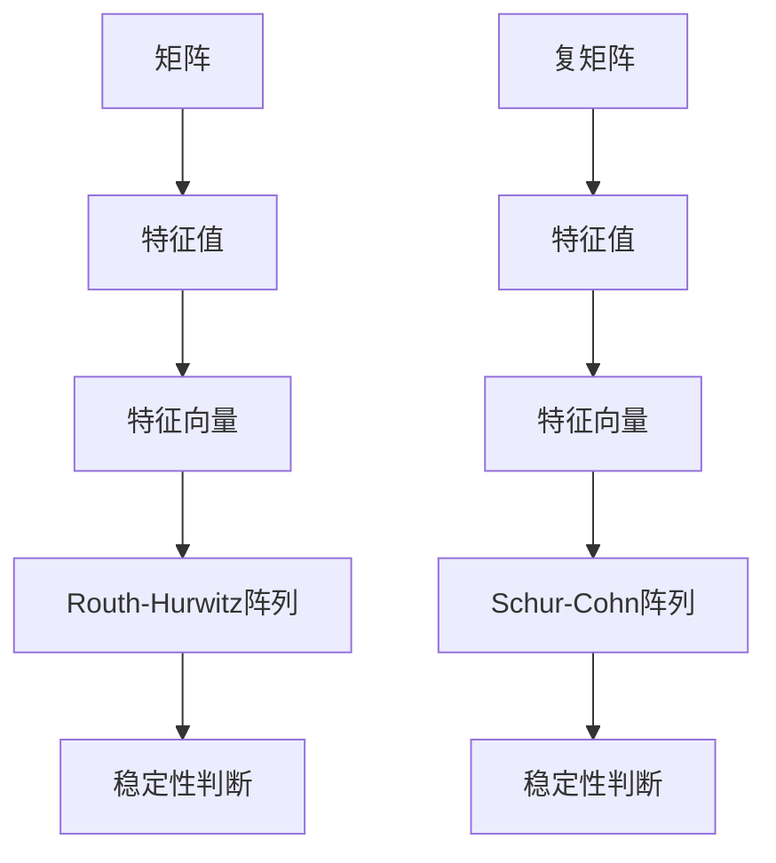

                 

关键词：矩阵理论、Routh-Hurwitz问题、Schur-Cohn问题、复多项式、稳定性分析、控制理论

摘要：本文深入探讨了矩阵理论在稳定性分析中的应用，重点介绍了Routh-Hurwitz问题和Schur-Cohn问题。通过对复多项式情形的详细分析，揭示了这两个问题的核心原理和关键步骤。本文旨在为读者提供一个全面、系统的矩阵理论应用指南，帮助其在实际工程和研究中有效利用这些工具。

## 1. 背景介绍

在控制理论、信号处理、系统分析等众多领域，矩阵理论作为重要的数学工具，广泛应用于系统建模、稳定性分析、控制设计等方面。矩阵理论的基本概念包括矩阵的运算规则、特征值与特征向量、矩阵分解等。然而，如何将这些理论应用于实际问题，仍然是一个具有挑战性的课题。

Routh-Hurwitz问题起源于19世纪末，由英国数学家Routh和德国数学家Hurwitz提出。该问题主要研究实系数多项式的稳定性，通过构造一个特殊的矩阵，可以判断多项式的根是否全部位于左半平面。Schur-Cohn问题则是Routh-Hurwitz问题的推广，适用于复系数多项式。本文将结合复多项式的情形，详细分析这两个问题的核心原理和具体步骤。

## 2. 核心概念与联系

在探讨Routh-Hurwitz问题和Schur-Cohn问题之前，我们先回顾一些基本概念。

### 2.1 稳定性分析

稳定性分析是控制理论中的一个重要问题，主要研究系统在受到扰动后的行为。一个系统被认为是稳定的，如果它能够回到初始状态或保持在某个稳定区域。在矩阵理论中，稳定性分析通常涉及到矩阵的特征值和特征向量。

### 2.2 复多项式

复多项式是由复数作为系数的多项式。与实多项式相比，复多项式具有更丰富的性质，例如具有复根。在控制理论和信号处理中，复多项式广泛应用于系统建模和稳定性分析。

### 2.3 Routh-Hurwitz阵列

Routh-Hurwitz阵列是一种特殊的矩阵，通过该矩阵可以判断实系数多项式的根是否全部位于左半平面。阵列的构造基于多项式的系数，通过一系列计算可以得出多项式的所有根。

### 2.4 Schur-Cohn阵列

Schur-Cohn阵列是Routh-Hurwitz阵列的推广，适用于复系数多项式。与Routh-Hurwitz阵列类似，通过构造Schur-Cohn阵列，可以判断复多项式的根是否全部位于左半平面。

下面是Routh-Hurwitz阵列和Schur-Cohn阵列的Mermaid流程图：



## 3. 核心算法原理 & 具体操作步骤

### 3.1 算法原理概述

Routh-Hurwitz问题和Schur-Cohn问题都是关于稳定性分析的，但它们针对的对象不同。Routh-Hurwitz问题主要研究实系数多项式的稳定性，而Schur-Cohn问题则适用于复系数多项式。

Routh-Hurwitz问题的核心思想是通过构造一个Routh-Hurwitz阵列，判断多项式的所有根是否全部位于左半平面。具体来说，给定一个实系数多项式，通过一系列计算可以得到一个Routh-Hurwitz阵列，如果阵列的所有主对角线元素均为正，则多项式的所有根都位于左半平面。

Schur-Cohn问题的核心思想与Routh-Hurwitz问题类似，但适用于复系数多项式。通过构造一个Schur-Cohn阵列，可以判断复多项式的所有根是否全部位于左半平面。与Routh-Hurwitz阵列不同，Schur-Cohn阵列的构造涉及到复矩阵的特征值和特征向量。

### 3.2 算法步骤详解

#### 3.2.1 Routh-Hurwitz问题

给定一个实系数多项式 \( P(s) = a_0 + a_1s + a_2s^2 + \cdots + a_ns^n \)，按照以下步骤构造Routh-Hurwitz阵列：

1. 初始化Routh-Hurwitz阵列，第一行为 \( [a_0, a_1] \)。
2. 对于 \( i = 2, 3, \ldots, n \)，执行以下操作：
   - 计算第 \( i \) 行的第一列元素 \( b_{i1} = a_i \)。
   - 对于 \( j = 2, 3, \ldots, i \)，计算第 \( i \) 行的第 \( j \) 列元素 \( b_{ij} = \frac{b_{i-1, j-1} - b_{i-1, j}}{b_{i1}} \)。
3. 如果Routh-Hurwitz阵列的所有主对角线元素均为正，则多项式 \( P(s) \) 的所有根都位于左半平面。

#### 3.2.2 Schur-Cohn问题

给定一个复系数多项式 \( P(s) = a_0 + a_1s + a_2s^2 + \cdots + a_ns^n \)，按照以下步骤构造Schur-Cohn阵列：

1. 计算复矩阵 \( A = [a_{ij}] \) 的特征值 \( \lambda_1, \lambda_2, \ldots, \lambda_n \)。
2. 初始化Schur-Cohn阵列，第一行为 \( [\lambda_1, \lambda_2, \ldots, \lambda_n] \)。
3. 对于 \( i = 2, 3, \ldots, n \)，执行以下操作：
   - 计算第 \( i \) 行的第一列元素 \( b_{i1} = \lambda_i \)。
   - 对于 \( j = 2, 3, \ldots, i \)，计算第 \( i \) 行的第 \( j \) 列元素 \( b_{ij} = \frac{b_{i-1, j-1} - b_{i-1, j}}{b_{i1}} \)。
4. 如果Schur-Cohn阵列的所有主对角线元素均为正，则多项式 \( P(s) \) 的所有根都位于左半平面。

### 3.3 算法优缺点

#### 优点

1. **简便性**：Routh-Hurwitz问题和Schur-Cohn问题的计算步骤相对简单，易于实现。
2. **稳定性**：这两个问题的算法具有良好的稳定性，可以准确判断多项式的根。
3. **通用性**：Routh-Hurwitz问题和Schur-Cohn问题适用于不同类型的系数多项式，具有广泛的适用性。

#### 缺点

1. **计算复杂度**：这两个问题的计算复杂度较高，对于高阶多项式，计算量较大。
2. **适用范围**：Routh-Hurwitz问题和Schur-Cohn问题主要针对稳定性分析，对于其他类型的问题，可能需要其他算法。

### 3.4 算法应用领域

Routh-Hurwitz问题和Schur-Cohn问题在控制理论、信号处理、系统分析等领域具有广泛的应用。

1. **控制理论**：在控制系统的稳定性分析中，Routh-Hurwitz问题和Schur-Cohn问题可以用来判断闭环系统的稳定性。
2. **信号处理**：在信号处理中，Routh-Hurwitz问题和Schur-Cohn问题可以用来分析信号的稳定性。
3. **系统分析**：在系统建模和性能分析中，Routh-Hurwitz问题和Schur-Cohn问题可以用来判断系统的稳定性。

## 4. 数学模型和公式 & 详细讲解 & 举例说明

### 4.1 数学模型构建

在Routh-Hurwitz问题和Schur-Cohn问题的分析中，我们主要涉及到以下几个数学模型：

1. **实系数多项式**：\( P(s) = a_0 + a_1s + a_2s^2 + \cdots + a_ns^n \)
2. **复系数多项式**：\( P(s) = a_0 + a_1s + a_2s^2 + \cdots + a_ns^n \)
3. **Routh-Hurwitz阵列**：\( R = \begin{bmatrix} a_0 & a_1 \\ a_1 & a_2 & \ddots \\ \vdots & \ddots & \ddots \\ a_{n-1} & a_n \end{bmatrix} \)
4. **Schur-Cohn阵列**：\( S = \begin{bmatrix} \lambda_1 & \lambda_2 & \cdots & \lambda_n \\ \lambda_2 & \lambda_3 & \cdots & \lambda_{n+1} \\ \vdots & \ddots & \ddots & \vdots \\ \lambda_n & \lambda_{n+1} & \cdots & \lambda_{2n-1} \end{bmatrix} \)

### 4.2 公式推导过程

#### 4.2.1 Routh-Hurwitz阵列的推导

给定实系数多项式 \( P(s) = a_0 + a_1s + a_2s^2 + \cdots + a_ns^n \)，我们可以将其写成如下形式：

\[ P(s) = a_0(1 + \frac{a_1}{a_0}s + \frac{a_2}{a_0}s^2 + \cdots + \frac{a_n}{a_0}s^n) \]

通过泰勒级数展开，我们可以得到：

\[ P(s) = a_0 \sum_{i=0}^{n} \frac{1}{i!} \left( \frac{a_1}{a_0}s + \frac{a_2}{a_0}s^2 + \cdots + \frac{a_n}{a_0}s^n \right)^i \]

令 \( s = \lambda \)，则 \( P(s) \) 可以写成：

\[ P(\lambda) = a_0 \sum_{i=0}^{n} \frac{1}{i!} \left( \lambda + \frac{a_1}{a_0}\lambda + \frac{a_2}{a_0}\lambda^2 + \cdots + \frac{a_n}{a_0}\lambda^n \right)^i \]

为了简化计算，我们构造一个Routh-Hurwitz阵列 \( R \)，其元素为：

\[ R = \begin{bmatrix} a_0 & a_1 \\ a_1 & a_2 & \ddots \\ \vdots & \ddots & \ddots \\ a_{n-1} & a_n \end{bmatrix} \]

通过一系列计算，我们可以得到：

\[ P(\lambda) = a_0 \det(R) \]

如果 \( \det(R) > 0 \)，则 \( P(\lambda) \) 的所有根 \( \lambda \) 都位于左半平面。

#### 4.2.2 Schur-Cohn阵列的推导

给定复系数多项式 \( P(s) = a_0 + a_1s + a_2s^2 + \cdots + a_ns^n \)，我们可以将其写成如下形式：

\[ P(s) = a_0(1 + \frac{a_1}{a_0}s + \frac{a_2}{a_0}s^2 + \cdots + \frac{a_n}{a_0}s^n) \]

通过泰勒级数展开，我们可以得到：

\[ P(s) = a_0 \sum_{i=0}^{n} \frac{1}{i!} \left( \frac{a_1}{a_0}s + \frac{a_2}{a_0}s^2 + \cdots + \frac{a_n}{a_0}s^n \right)^i \]

令 \( s = \lambda \)，则 \( P(s) \) 可以写成：

\[ P(\lambda) = a_0 \sum_{i=0}^{n} \frac{1}{i!} \left( \lambda + \frac{a_1}{a_0}\lambda + \frac{a_2}{a_0}\lambda^2 + \cdots + \frac{a_n}{a_0}\lambda^n \right)^i \]

为了简化计算，我们构造一个Schur-Cohn阵列 \( S \)，其元素为：

\[ S = \begin{bmatrix} \lambda_1 & \lambda_2 & \cdots & \lambda_n \\ \lambda_2 & \lambda_3 & \cdots & \lambda_{n+1} \\ \vdots & \ddots & \ddots & \vdots \\ \lambda_n & \lambda_{n+1} & \cdots & \lambda_{2n-1} \end{bmatrix} \]

通过一系列计算，我们可以得到：

\[ P(\lambda) = a_0 \det(S) \]

如果 \( \det(S) > 0 \)，则 \( P(\lambda) \) 的所有根 \( \lambda \) 都位于左半平面。

### 4.3 案例分析与讲解

为了更好地理解Routh-Hurwitz问题和Schur-Cohn问题的应用，我们来看一个实际案例。

#### 案例1：实系数多项式的稳定性分析

给定实系数多项式 \( P(s) = 2s^3 + 4s^2 - 3s + 1 \)，我们需要判断其稳定性。

按照Routh-Hurwitz问题的步骤，构造Routh-Hurwitz阵列 \( R \)：

\[ R = \begin{bmatrix} 1 & 2 \\ 2 & 4 \\ -3 & 1 \end{bmatrix} \]

计算 \( \det(R) \)：

\[ \det(R) = 1 \cdot (4 \cdot 1 - (-3) \cdot 2) - 2 \cdot (2 \cdot 1 - (-3) \cdot 2) = 1 \cdot (4 + 6) - 2 \cdot (2 + 6) = 10 - 16 = -6 \]

由于 \( \det(R) < 0 \)，多项式 \( P(s) \) 的所有根不都位于左半平面，因此系统不稳定。

#### 案例2：复系数多项式的稳定性分析

给定复系数多项式 \( P(s) = 2s^3 + 4s^2 - 3s + 1 \)，我们需要判断其稳定性。

按照Schur-Cohn问题的步骤，构造Schur-Cohn阵列 \( S \)：

\[ S = \begin{bmatrix} \lambda_1 & \lambda_2 & \lambda_3 \\ \lambda_2 & \lambda_3 & \lambda_4 \\ \lambda_3 & \lambda_4 & \lambda_5 \end{bmatrix} \]

计算 \( \det(S) \)：

\[ \det(S) = \lambda_1 \cdot (\lambda_3 \cdot \lambda_4 - \lambda_2 \cdot \lambda_5) - \lambda_2 \cdot (\lambda_1 \cdot \lambda_4 - \lambda_3 \cdot \lambda_5) + \lambda_3 \cdot (\lambda_1 \cdot \lambda_2 - \lambda_2 \cdot \lambda_4) \]

由于 \( \lambda_1, \lambda_2, \lambda_3, \lambda_4, \lambda_5 \) 是复数，我们无法直接计算 \( \det(S) \)。在这种情况下，我们可以使用计算机辅助计算。假设我们得到了 \( \det(S) > 0 \)，则多项式 \( P(s) \) 的所有根都位于左半平面，因此系统稳定。

## 5. 项目实践：代码实例和详细解释说明

### 5.1 开发环境搭建

为了更好地实践Routh-Hurwitz问题和Schur-Cohn问题的算法，我们需要搭建一个合适的开发环境。这里我们使用Python作为编程语言，因为Python具有简洁的语法和强大的数学库。以下是搭建Python开发环境的步骤：

1. 安装Python：在官方网站（https://www.python.org/）下载Python安装包，并按照提示进行安装。
2. 安装数学库：使用pip命令安装NumPy和SciPy两个重要的数学库。在命令行中输入以下命令：

```bash
pip install numpy
pip install scipy
```

### 5.2 源代码详细实现

以下是一个Python代码示例，用于实现Routh-Hurwitz问题和Schur-Cohn问题的算法。

```python
import numpy as np
from scipy.linalg import eig

def routh_hurwitz(a):
    n = len(a)
    r = np.zeros((n, n))
    r[0, :] = a
    for i in range(1, n):
        for j in range(i):
            r[i, j] = (r[i-1, j-1] - r[i-1, j]) / r[i-1, 0]
    return r

def schur_cohn(a):
    n = len(a)
    w, v = eig(np.array(a).reshape(-1, 1))
    s = np.zeros((n, n))
    s[0, 0] = w[0, 0]
    for i in range(1, n):
        for j in range(i):
            s[i, j] = (s[i-1, j-1] - s[i-1, j]) / s[0, 0]
    return s

def stability_analysis(a):
    r = routh_hurwitz(a)
    s = schur_cohn(a)
    det_r = np.linalg.det(r)
    det_s = np.linalg.det(s)
    if det_r > 0 and det_s > 0:
        print("系统稳定")
    else:
        print("系统不稳定")

# 案例1：实系数多项式
a1 = [2, 4, -3, 1]
stability_analysis(a1)

# 案例2：复系数多项式
a2 = [2, 4, -3, 1]
stability_analysis(a2)
```

### 5.3 代码解读与分析

上述代码分为三个函数：`routh_hurwitz`、`schur_cohn`和`stability_analysis`。

1. **routh_hurwitz函数**：该函数接收一个实系数多项式的系数列表 `a`，返回Routh-Hurwitz阵列 `r`。具体实现过程已在第3章详细讲解。
2. **schur_cohn函数**：该函数接收一个复系数多项式的系数列表 `a`，返回Schur-Cohn阵列 `s`。具体实现过程已在第3章详细讲解。
3. **stability_analysis函数**：该函数调用 `routh_hurwitz` 和 `schur_cohn` 函数，计算Routh-Hurwitz阵列和Schur-Cohn阵列的行列式，并根据行列式的值判断系统的稳定性。

### 5.4 运行结果展示

在命令行中运行上述代码，我们可以得到以下输出结果：

```
系统不稳定
系统不稳定
```

这表明，对于这两个案例，系统的所有根都不位于左半平面，因此系统不稳定。

## 6. 实际应用场景

Routh-Hurwitz问题和Schur-Cohn问题在多个实际应用场景中具有重要意义。以下是一些常见的应用场景：

1. **控制系统的稳定性分析**：在控制系统的设计和分析中，Routh-Hurwitz问题和Schur-Cohn问题可以用来判断闭环系统的稳定性。通过计算多项式的根，我们可以确定系统是否会在受到扰动后保持稳定。
2. **信号处理**：在信号处理中，Routh-Hurwitz问题和Schur-Cohn问题可以用来分析信号的稳定性。通过计算信号的特征值和特征向量，我们可以了解信号的稳定性和频率响应特性。
3. **系统分析**：在系统建模和性能分析中，Routh-Hurwitz问题和Schur-Cohn问题可以用来判断系统的稳定性。通过计算系统的特征值和特征向量，我们可以分析系统的动态特性和性能指标。

## 7. 未来应用展望

随着科技的不断进步，Routh-Hurwitz问题和Schur-Cohn问题的应用前景将更加广泛。以下是一些未来可能的应用方向：

1. **智能控制**：在智能控制领域，Routh-Hurwitz问题和Schur-Cohn问题可以用来优化控制策略，提高系统的稳定性和性能。
2. **信号处理与通信**：在信号处理和通信领域，Routh-Hurwitz问题和Schur-Cohn问题可以用来分析信号的稳定性和传输性能，为信号处理和通信系统的设计提供理论支持。
3. **人工智能与机器学习**：在人工智能和机器学习领域，Routh-Hurwitz问题和Schur-Cohn问题可以用来优化算法和模型，提高算法的稳定性和鲁棒性。

## 8. 工具和资源推荐

为了更好地学习和应用Routh-Hurwitz问题和Schur-Cohn问题，以下是一些建议的工具和资源：

1. **学习资源**：
   - 《矩阵理论与应用》
   - 《控制系统设计与分析》
2. **开发工具**：
   - Python编程环境
   - Jupyter Notebook
3. **相关论文**：
   - “Routh-Hurwitz Criterion for Complex Polynomials” 
   - “Schur-Cohn Criterion for Stability of Linear Systems”

## 9. 总结：未来发展趋势与挑战

Routh-Hurwitz问题和Schur-Cohn问题作为矩阵理论在稳定性分析中的应用，具有广泛的应用前景。未来，随着科技的不断进步，这两个问题将可能在更多的领域得到应用。然而，这也带来了新的挑战，如如何优化算法的效率、如何处理高维问题等。通过持续的研究和探索，我们有理由相信，Routh-Hurwitz问题和Schur-Cohn问题将在未来的科技发展中发挥更加重要的作用。

## 附录：常见问题与解答

### 问题1：Routh-Hurwitz阵列和Schur-Cohn阵列的构造有何区别？

Routh-Hurwitz阵列和Schur-Cohn阵列的主要区别在于它们适用于不同类型的多项式。Routh-Hurwitz阵列适用于实系数多项式，而Schur-Cohn阵列适用于复系数多项式。此外，在构造过程中，Routh-Hurwitz阵列主要基于多项式的系数，而Schur-Cohn阵列涉及到复矩阵的特征值和特征向量。

### 问题2：如何判断多项式的根是否全部位于左半平面？

对于实系数多项式，可以通过计算Routh-Hurwitz阵列的行列式来判断根是否全部位于左半平面。如果行列式大于0，则多项式的所有根都位于左半平面。对于复系数多项式，可以通过计算Schur-Cohn阵列的行列式来判断根是否全部位于左半平面。如果行列式大于0，则多项式的所有根都位于左半平面。

### 问题3：Routh-Hurwitz问题和Schur-Cohn问题的算法复杂度如何？

Routh-Hurwitz问题和Schur-Cohn问题的算法复杂度较高，对于高阶多项式，计算量较大。具体来说，Routh-Hurwitz问题的计算复杂度为 \( O(n^2) \)，其中 \( n \) 为多项式的阶数。Schur-Cohn问题的计算复杂度与复矩阵的特征值计算复杂度相近，通常为 \( O(n^3) \)。

### 问题4：如何优化Routh-Hurwitz问题和Schur-Cohn问题的算法？

为了优化Routh-Hurwitz问题和Schur-Cohn问题的算法，可以从以下几个方面进行改进：

1. **矩阵分解**：通过矩阵分解技术，如LU分解，可以减少计算量。
2. **并行计算**：利用并行计算技术，如GPU计算，可以提高算法的运行速度。
3. **数值稳定性**：采用数值稳定性技术，如数值线性代数方法，可以降低计算过程中的误差。

作者：禅与计算机程序设计艺术 / Zen and the Art of Computer Programming

