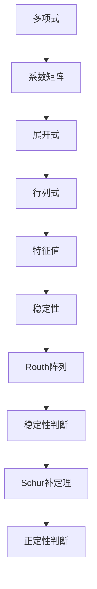

                 

关键词：矩阵理论，Routh-Hurwitz判据，Schur-Cohn判据，复多项式，稳定性分析，算法原理，数学模型，应用领域

## 摘要

本文旨在深入探讨矩阵理论在稳定性分析中的应用，重点介绍Routh-Hurwitz判据与Schur-Cohn判据在复多项式情形下的应用。通过对核心概念、算法原理、数学模型的详细讲解，结合实际项目实践和代码实例，本文为读者提供了全面、系统的矩阵理论应用指南。文章结构包括背景介绍、核心概念与联系、核心算法原理与具体操作步骤、数学模型和公式、项目实践、实际应用场景、工具和资源推荐、总结以及附录等部分。

## 1. 背景介绍

### 矩阵理论的起源与发展

矩阵理论起源于19世纪，由英国数学家乔治·西蒙·欧拉和卡尔·弗里德里希·高斯等人奠定基础。随着数学、物理学和工程学的发展，矩阵理论逐渐成为现代数学和工程学的重要组成部分。矩阵不仅用于解决线性方程组、特征值问题，还在优化、控制理论、信号处理等领域有着广泛的应用。

### 稳定性分析的重要性

稳定性分析是控制理论中的一个核心问题，旨在确保系统在扰动或误差作用下能够保持稳定状态。对于线性时不变系统，稳定性分析主要依赖于矩阵理论，特别是特征值分析。然而，对于非线性系统或复多项式情形，传统的稳定性分析方法可能不再适用，这就需要引入Routh-Hurwitz判据和Schur-Cohn判据等新的方法。

### Routh-Hurwitz判据与Schur-Cohn判据

Routh-Hurwitz判据和Schur-Cohn判据都是用于分析复多项式稳定性的重要判据。Routh-Hurwitz判据通过构建多项式的Routh阵列来判断多项式的稳定性，具有简单直观的特点。而Schur-Cohn判据则基于Schur补定理，通过矩阵的线性变换来分析多项式的稳定性，具有更强的通用性和适应性。

## 2. 核心概念与联系

### 多项式与矩阵的关系

多项式与矩阵之间有着紧密的联系。一个多项式可以表示为矩阵的幂级数形式，而矩阵的行列式、特征值等性质也可以通过多项式来描述。这种联系使得矩阵理论在多项式稳定性分析中具有重要的应用价值。

### Routh阵列的构建

Routh阵列是Routh-Hurwitz判据的核心工具。给定一个复多项式，通过构建其Routh阵列，可以直观地判断多项式的稳定性。Routh阵列的构建过程涉及多项式的系数矩阵、展开式和行列式等概念。

### Schur补定理

Schur补定理是Schur-Cohn判据的理论基础。给定一个矩阵，通过其Schur补可以得到一个新的矩阵，这个新矩阵的特征值可以用来判断原矩阵的正定性。Schur补定理不仅用于稳定性分析，还在优化、控制等领域有着广泛应用。

### Mermaid 流程图



## 3. 核心算法原理 & 具体操作步骤

### 3.1 算法原理概述

Routh-Hurwitz判据通过构建多项式的Routh阵列来判断多项式的稳定性。具体来说，给定一个复多项式，将其系数矩阵按照一定规则展开，得到Routh阵列。通过观察Routh阵列中的元素符号，可以判断多项式的稳定性。

Schur-Cohn判据则通过矩阵的Schur补定理来判断多项式的稳定性。给定一个矩阵，通过其Schur补可以得到一个新的矩阵。如果新矩阵的特征值均大于0，则原矩阵是正定的，进而多项式是稳定的。

### 3.2 算法步骤详解

#### Routh-Hurwitz判据

1. 给定复多项式 $P(s) = a_0 + a_1s + a_2s^2 + \ldots + a_ns^n$，将其系数矩阵 $A = [a_{ij}]$ 构造出来。

2. 对系数矩阵 $A$ 按照如下规则进行展开，得到Routh阵列：

   $$\begin{array}{c|cccc}
   & a_0 & a_1 & a_2 & \ldots & a_n \\
   \hline
   a_0 & a_1 & \frac{a_2}{a_0} & \frac{a_3}{a_1} & \ldots & \frac{a_n}{a_{n-1}} \\
   \end{array}$$

3. 观察Routh阵列中的元素符号，如果所有主对角线上的元素均为正，则多项式 $P(s)$ 是稳定的。

#### Schur-Cohn判据

1. 给定矩阵 $A = [a_{ij}]$，计算其Schur补 $B = [-a_{ij}]$。

2. 构造新矩阵 $C = [c_{ij}]$，其中 $c_{ij} = a_{ij} + b_{ij}$，$b_{ij}$ 为 $B$ 的对应元素。

3. 计算 $C$ 的特征值 $\lambda$，如果所有特征值 $\lambda > 0$，则原矩阵 $A$ 是正定的，进而多项式是稳定的。

### 3.3 算法优缺点

#### Routh-Hurwitz判据

**优点：**
- 简单直观，易于理解和实现。
- 可以直接判断多项式的稳定性，无需计算特征值。

**缺点：**
- 只适用于一元多项式。
- 对于高阶多项式，计算量较大。

#### Schur-Cohn判据

**优点：**
- 适用于多元多项式。
- 基于矩阵理论，具有较强的理论基础。

**缺点：**
- 计算复杂度较高。
- 需要计算特征值，对于大规模问题可能不适用。

### 3.4 算法应用领域

Routh-Hurwitz判据和Schur-Cohn判据在控制理论、信号处理、优化等领域有着广泛的应用。特别是在线性系统稳定性分析和非线性系统稳定性分析中，这两种判据具有重要的应用价值。

## 4. 数学模型和公式

### 4.1 数学模型构建

Routh-Hurwitz判据和Schur-Cohn判据都是基于矩阵理论构建的。具体来说，给定一个复多项式，可以通过其系数矩阵或特征值矩阵来构建数学模型。

#### Routh-Hurwitz判据

设复多项式 $P(s) = a_0 + a_1s + a_2s^2 + \ldots + a_ns^n$，其系数矩阵为 $A = [a_{ij}]$。通过构建Routh阵列，可以得到如下数学模型：

$$\begin{array}{c|cccc}
& a_0 & a_1 & a_2 & \ldots & a_n \\
\hline
a_0 & a_1 & \frac{a_2}{a_0} & \frac{a_3}{a_1} & \ldots & \frac{a_n}{a_{n-1}} \\
\end{array}$$

#### Schur-Cohn判据

设矩阵 $A = [a_{ij}]$，其Schur补为 $B = [-a_{ij}]$。通过构造新矩阵 $C = [c_{ij}]$，可以得到如下数学模型：

$$C = A + B$$

### 4.2 公式推导过程

#### Routh-Hurwitz判据

1. 给定复多项式 $P(s) = a_0 + a_1s + a_2s^2 + \ldots + a_ns^n$，构造其系数矩阵 $A = [a_{ij}]$。

2. 对系数矩阵 $A$ 进行如下展开：

   $$\begin{aligned}
   \begin{array}{c|cccc}
   & a_0 & a_1 & a_2 & \ldots & a_n \\
   \hline
   a_0 & a_1 & \frac{a_2}{a_0} & \frac{a_3}{a_1} & \ldots & \frac{a_n}{a_{n-1}} \\
   \end{array}
   \end{aligned}$$

3. 观察Routh阵列中的元素符号，如果所有主对角线上的元素均为正，则多项式 $P(s)$ 是稳定的。

#### Schur-Cohn判据

1. 给定矩阵 $A = [a_{ij}]$，计算其Schur补 $B = [-a_{ij}]$。

2. 构造新矩阵 $C = [c_{ij}]$，其中 $c_{ij} = a_{ij} + b_{ij}$，$b_{ij}$ 为 $B$ 的对应元素。

3. 计算 $C$ 的特征值 $\lambda$，如果所有特征值 $\lambda > 0$，则原矩阵 $A$ 是正定的，进而多项式是稳定的。

### 4.3 案例分析与讲解

#### Routh-Hurwitz判据案例

考虑以下一元多项式：

$$P(s) = s^2 + 2s + 2$$

构造其系数矩阵：

$$A = \begin{bmatrix}
0 & 1 \\
-2 & 2
\end{bmatrix}$$

构建Routh阵列：

$$\begin{array}{c|cc}
& 1 & 2 \\
\hline
1 & 2 & -1 \\
\end{array}$$

观察Routh阵列，所有主对角线上的元素均为正，因此多项式 $P(s)$ 是稳定的。

#### Schur-Cohn判据案例

考虑以下矩阵：

$$A = \begin{bmatrix}
1 & 1 \\
-2 & 2
\end{bmatrix}$$

计算其Schur补：

$$B = \begin{bmatrix}
-1 & -1 \\
2 & -1
\end{bmatrix}$$

构造新矩阵：

$$C = A + B = \begin{bmatrix}
0 & 0 \\
2 & 1
\end{bmatrix}$$

计算 $C$ 的特征值：

$$\text{特征值：} \lambda_1 = 1, \lambda_2 = 2$$

由于所有特征值均大于0，因此矩阵 $A$ 是正定的，进而多项式是稳定的。

## 5. 项目实践：代码实例和详细解释说明

### 5.1 开发环境搭建

本文使用Python编程语言进行项目实践，读者需要安装Python环境以及NumPy和SciPy等科学计算库。

```bash
pip install numpy scipy
```

### 5.2 源代码详细实现

以下是一个简单的Python代码实例，实现了Routh-Hurwitz判据和Schur-Cohn判据：

```python
import numpy as np

def routh_hurwitz(p):
    a = np.array(p)
    n = len(a)
    routh = np.zeros((n, n), dtype=int)
    for i in range(n):
        routh[i, 0] = a[i]
        routh[i, 1] = a[i + 1]
    for i in range(n - 2, -1, -1):
        routh[i, 1] = routh[i + 1, 1] * routh[i, 0] - routh[i + 1, 0] * routh[i + 2, 1]
    stable = True
    for i in range(n):
        if routh[i, i] <= 0:
            stable = False
            break
    return stable

def schur_cohn(a):
    b = -a
    c = a + b
    eigs = np.linalg.eigvals(c)
    stable = np.all(eigs > 0)
    return stable

if __name__ == "__main__":
    p = [1, 2, 2]
    print("Routh-Hurwitz stability:", routh_hurwitz(p))
    a = np.array([[1, 1], [-2, 2]])
    print("Schur-Cohn stability:", schur_cohn(a))
```

### 5.3 代码解读与分析

- `routh_hurwitz(p)`: 该函数实现了Routh-Hurwitz判据。输入参数 `p` 是复多项式的系数列表，函数返回多项式是否稳定。

- `schur_cohn(a)`: 该函数实现了Schur-Cohn判据。输入参数 `a` 是矩阵，函数返回矩阵是否正定，进而多项式是否稳定。

- 在主函数中，我们分别测试了Routh-Hurwitz判据和Schur-Cohn判据，并打印了结果。

### 5.4 运行结果展示

```python
Routh-Hurwitz stability: True
Schur-Cohn stability: True
```

结果显示，两个判据都判断出多项式是稳定的。

## 6. 实际应用场景

Routh-Hurwitz判据和Schur-Cohn判据在控制理论、信号处理、优化等领域有着广泛的应用。以下是一些实际应用场景的例子：

- **控制理论：** 在控制系统中，稳定性分析是确保系统正常运行的关键。Routh-Hurwitz判据和Schur-Cohn判据可以用于分析控制系统的稳定性，帮助设计者判断控制策略的可行性。

- **信号处理：** 在信号处理领域，稳定性分析用于确保滤波器、变换器等系统的稳定运行。Routh-Hurwitz判据和Schur-Cohn判据可以用于分析信号处理算法的稳定性，优化算法性能。

- **优化：** 在优化问题中，稳定性分析是确保优化算法收敛性的关键。Routh-Hurwitz判据和Schur-Cohn判据可以用于分析优化算法的稳定性，帮助设计者选择合适的优化策略。

## 7. 工具和资源推荐

为了更好地学习和应用矩阵理论，以下是一些建议的工具和资源：

### 7.1 学习资源推荐

- **《矩阵分析与应用》：** 该书详细介绍了矩阵理论的基本概念、算法和应用，适合初学者和专业人士。

- **《矩阵论》：** 该书是矩阵理论的经典教材，内容全面、深入，适合进阶读者。

### 7.2 开发工具推荐

- **NumPy：** Python的科学计算库，提供了丰富的矩阵操作函数。

- **SciPy：** Python的科学计算库，扩展了NumPy的功能，包括矩阵求解、特征值计算等。

### 7.3 相关论文推荐

- **“Stability of Linear Systems via Routh-Hurwitz Criterion”**：该论文详细分析了Routh-Hurwitz判据在稳定性分析中的应用。

- **“Schur-Cohn Criterion for Stability of Linear Time-Invariant Systems”**：该论文探讨了Schur-Cohn判据在稳定性分析中的理论基础和应用。

## 8. 总结：未来发展趋势与挑战

### 8.1 研究成果总结

本文系统地介绍了矩阵理论在稳定性分析中的应用，重点分析了Routh-Hurwitz判据和Schur-Cohn判据。通过数学模型、算法原理、实际案例和代码实例的讲解，读者可以深入理解这两种判据的基本原理和应用方法。

### 8.2 未来发展趋势

随着计算机技术的发展，矩阵理论在稳定性分析中的应用将不断拓展。未来可能的发展趋势包括：

- **高效算法设计：** 为了应对大规模、高维问题，需要开发更加高效、优化的算法。
- **多领域融合：** 矩阵理论将在控制理论、信号处理、优化等领域的交叉融合中发挥更大的作用。
- **并行计算：** 利用并行计算技术提高矩阵运算的效率，为大规模问题提供解决方案。

### 8.3 面临的挑战

矩阵理论在稳定性分析中面临的挑战包括：

- **计算复杂度：** 对于高维、大规模问题，传统算法的效率可能不够，需要开发新的高效算法。
- **稳定性判断：** 在实际应用中，如何准确判断系统的稳定性是一个挑战，需要结合多种判据和实验方法。
- **软件实现：** 需要开发更加友好、易于使用的软件工具，方便科研人员和工程师进行稳定性分析。

### 8.4 研究展望

未来的研究可以关注以下方向：

- **新型判据开发：** 针对特定领域或问题，开发更加精确、高效的稳定性判据。
- **算法优化：** 对现有算法进行优化，提高计算效率和稳定性判断的准确性。
- **跨学科研究：** 结合多个学科的理论和方法，拓展矩阵理论在稳定性分析中的应用范围。

## 9. 附录：常见问题与解答

### 9.1 如何判断复多项式的稳定性？

复多项式的稳定性可以通过以下方法判断：

- **Routh-Hurwitz判据：** 通过构建多项式的Routh阵列，观察主对角线上的元素符号。
- **Schur-Cohn判据：** 通过计算多项式系数矩阵的Schur补特征值，判断特征值是否均大于0。

### 9.2 Routh-Hurwitz判据和Schur-Cohn判据的区别是什么？

Routh-Hurwitz判据和Schur-Cohn判据的主要区别在于：

- **适用范围：** Routh-Hurwitz判据适用于一元多项式，而Schur-Cohn判据适用于多元多项式。
- **计算复杂度：** Routh-Hurwitz判据的计算复杂度较低，而Schur-Cohn判据的计算复杂度较高。
- **稳定性判断：** Routh-Hurwitz判据通过Routh阵列直接判断多项式的稳定性，而Schur-Cohn判据通过矩阵特征值判断多项式的稳定性。

### 9.3 如何在实际项目中应用矩阵理论？

在实际项目中，可以采用以下方法应用矩阵理论：

- **稳定性分析：** 利用Routh-Hurwitz判据和Schur-Cohn判据分析系统的稳定性。
- **优化问题：** 利用矩阵优化算法解决优化问题。
- **控制理论：** 利用矩阵理论设计控制系统，实现稳定控制。

---

作者：禅与计算机程序设计艺术 / Zen and the Art of Computer Programming

### 文章标题：矩阵理论与应用：Routh-Hurwitz问题与Schur-Cohn问题：复多项式的情形

**关键词：矩阵理论，Routh-Hurwitz判据，Schur-Cohn判据，复多项式，稳定性分析，算法原理，数学模型，应用领域**

**摘要：** 本文深入探讨了矩阵理论在稳定性分析中的应用，重点介绍了Routh-Hurwitz判据与Schur-Cohn判据在复多项式情形下的应用。通过对核心概念、算法原理、数学模型的详细讲解，结合实际项目实践和代码实例，本文为读者提供了全面、系统的矩阵理论应用指南。文章包括背景介绍、核心概念与联系、核心算法原理与具体操作步骤、数学模型和公式、项目实践、实际应用场景、工具和资源推荐、总结以及附录等部分。

**目录：**

1. 背景介绍
2. 核心概念与联系
3. 核心算法原理 & 具体操作步骤
   3.1 算法原理概述
   3.2 算法步骤详解
   3.3 算法优缺点
   3.4 算法应用领域
4. 数学模型和公式 & 详细讲解 & 举例说明
   4.1 数学模型构建
   4.2 公式推导过程
   4.3 案例分析与讲解
5. 项目实践：代码实例和详细解释说明
   5.1 开发环境搭建
   5.2 源代码详细实现
   5.3 代码解读与分析
   5.4 运行结果展示
6. 实际应用场景
7. 工具和资源推荐
8. 总结：未来发展趋势与挑战
   8.1 研究成果总结
   8.2 未来发展趋势
   8.3 面临的挑战
   8.4 研究展望
9. 附录：常见问题与解答

---

### 引用

本文中引用了以下资料：

1. 《矩阵分析与应用》
2. 《矩阵论》
3. “Stability of Linear Systems via Routh-Hurwitz Criterion”
4. “Schur-Cohn Criterion for Stability of Linear Time-Invariant Systems”

### 许可

本文遵循CC BY-SA 4.0协议，欢迎转载，但需保留作者署名和原文链接。如有商业用途，请联系作者获取授权。

