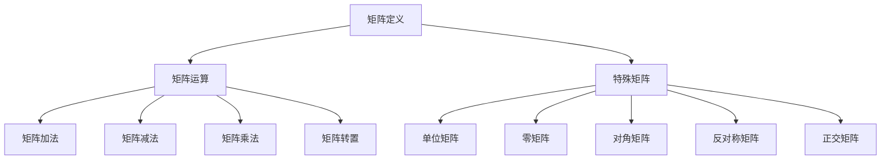

                 

关键词：矩阵理论、线性代数、数学模型、算法原理、应用领域、编程实践

> 摘要：本文将深入探讨矩阵理论的基本定义与性质，包括矩阵的运算规则、特殊矩阵及其应用。通过具体的数学模型和实例分析，本文旨在为读者提供一个清晰、系统的矩阵理论学习框架，并探讨其在现代计算机科学和工程领域的重要应用。

## 1. 背景介绍

矩阵理论起源于线性代数，是现代数学和工程领域的基础理论之一。矩阵作为一种数学工具，广泛应用于科学计算、工程分析、数据分析和计算机图形学等多个领域。矩阵理论不仅为解决复杂系统提供了强有力的数学框架，还促进了计算机编程和算法设计的发展。

在计算机科学中，矩阵理论的应用尤为广泛。例如，图像处理中的滤波器设计、机器学习中的数据降维、自然语言处理中的词向量表示等，都依赖于矩阵操作和矩阵分解技术。此外，矩阵理论还在物理模拟、金融工程和生物信息学等领域发挥着关键作用。

本文将首先介绍矩阵的基本定义和性质，然后深入探讨矩阵的运算规则，特殊矩阵的分类及其应用。接着，我们将通过数学模型和实例，详细讲解矩阵理论在具体应用场景中的实现。最后，本文还将总结矩阵理论的发展趋势和未来应用前景。

## 2. 核心概念与联系

### 2.1. 矩阵的基本概念

矩阵（Matrix）是由数字组成的二维数组，通常用大写字母表示，如 \( A \)。一个矩阵由行数和列数确定，分别称为矩阵的行数（\( m \)）和列数（\( n \)）。例如：

\[ A = \begin{bmatrix} 1 & 2 \\ 3 & 4 \end{bmatrix} \]

上述矩阵 \( A \) 是一个2行3列的矩阵，也可以表示为 \( A \in \mathbb{R}^{2 \times 3} \)，其中 \( \mathbb{R} \) 表示实数集。

### 2.2. 矩阵的运算规则

矩阵的运算包括加法、减法、乘法和转置等。

- **矩阵加法与减法**：两个矩阵只有在维度相同的情况下才能进行加减运算。运算结果矩阵的每个元素都是对应元素的和或差。

  \[ A + B = \begin{bmatrix} 1+1 & 2+2 \\ 3+3 & 4+4 \end{bmatrix} = \begin{bmatrix} 2 & 4 \\ 6 & 8 \end{bmatrix} \]

  \[ A - B = \begin{bmatrix} 1-1 & 2-2 \\ 3-3 & 4-4 \end{bmatrix} = \begin{bmatrix} 0 & 0 \\ 0 & 0 \end{bmatrix} \]

- **矩阵乘法**：两个矩阵的乘积只有在第二个矩阵的列数等于第一个矩阵的行数时才能进行。乘积矩阵的每个元素是第一个矩阵的行与第二个矩阵的列对应元素的乘积之和。

  \[ C = AB = \begin{bmatrix} 1*1+2*3 & 1*2+2*4 \\ 3*1+4*3 & 3*2+4*4 \end{bmatrix} = \begin{bmatrix} 7 & 10 \\ 15 & 22 \end{bmatrix} \]

- **矩阵转置**：矩阵的转置是将矩阵的行和列对换。一个 \( m \times n \) 矩阵的转置是一个 \( n \times m \) 矩阵。

  \[ A^T = \begin{bmatrix} 1 & 3 \\ 2 & 4 \end{bmatrix} \]

### 2.3. 特殊矩阵及其应用

特殊矩阵在矩阵理论中具有重要地位，常见的特殊矩阵包括单位矩阵、零矩阵、对角矩阵、反对称矩阵和正交矩阵。

- **单位矩阵**：对角线上全为1，其余元素全为0的矩阵，记作 \( I \)。

  \[ I = \begin{bmatrix} 1 & 0 \\ 0 & 1 \end{bmatrix} \]

- **零矩阵**：所有元素都为0的矩阵。

  \[ O = \begin{bmatrix} 0 & 0 \\ 0 & 0 \end{bmatrix} \]

- **对角矩阵**：除对角线外其余元素全为0的矩阵。

  \[ D = \begin{bmatrix} d_1 & 0 & 0 \\ 0 & d_2 & 0 \\ 0 & 0 & d_3 \end{bmatrix} \]

- **反对称矩阵**：满足 \( A^T = -A \) 的矩阵。

  \[ A = \begin{bmatrix} 0 & 1 \\ -1 & 0 \end{bmatrix} \]

- **正交矩阵**：满足 \( A^T A = I \) 的矩阵。

  \[ Q = \begin{bmatrix} \frac{1}{\sqrt{2}} & \frac{1}{\sqrt{2}} \\ -\frac{1}{\sqrt{2}} & \frac{1}{\sqrt{2}} \end{bmatrix} \]

这些特殊矩阵在计算几何、线性变换和图像处理等领域有着广泛的应用。

### 2.4. Mermaid 流程图

下面是矩阵理论核心概念与联系的一个 Mermaid 流程图：



## 3. 核心算法原理 & 具体操作步骤

### 3.1. 算法原理概述

矩阵理论的核心算法包括矩阵分解、矩阵求逆和特征值计算等。这些算法在科学计算和工程应用中具有重要意义。

- **矩阵分解**：将矩阵分解为简单矩阵的乘积，常见的有LU分解、QR分解和SVD分解。
- **矩阵求逆**：计算矩阵的逆矩阵，使得 \( AA^{-1} = A^{-1}A = I \)。
- **特征值计算**：求解矩阵的特征值和特征向量，用于数据降维、特征提取和模式识别。

### 3.2. 算法步骤详解

#### 3.2.1. 矩阵分解

以LU分解为例，其步骤如下：

1. 对矩阵 \( A \) 进行高斯消元，得到下三角矩阵 \( L \) 和上三角矩阵 \( U \)。

   \[ A = LU \]

2. \( L \) 的主对角线元素全为1，其余元素为高斯消元过程中的系数。

   \[ L = \begin{bmatrix} 1 & 0 & \ldots & 0 \\ l_{21} & 1 & \ldots & 0 \\ \vdots & \vdots & \ddots & \vdots \\ l_{n1} & l_{n2} & \ldots & 1 \end{bmatrix} \]

3. \( U \) 的主对角线以下元素全为0，其余元素为高斯消元过程中的余项。

   \[ U = \begin{bmatrix} u_{11} & u_{12} & \ldots & u_{1n} \\ 0 & u_{22} & \ldots & u_{2n} \\ \vdots & \vdots & \ddots & \vdots \\ 0 & 0 & \ldots & u_{nn} \end{bmatrix} \]

#### 3.2.2. 矩阵求逆

以高斯-约旦消元法为例，其步骤如下：

1. 构造增广矩阵 \( [A|I] \)，其中 \( I \) 是与 \( A \) 同样的阶数单位矩阵。

   \[ [A|I] = \begin{bmatrix} a_{11} & a_{12} & \ldots & a_{1n} & 1 & 0 & \ldots & 0 \\ a_{21} & a_{22} & \ldots & a_{2n} & 0 & 1 & \ldots & 0 \\ \vdots & \vdots & \ddots & \vdots & \vdots & \vdots & \ddots & \vdots \\ a_{n1} & a_{n2} & \ldots & a_{nn} & 0 & 0 & \ldots & 1 \end{bmatrix} \]

2. 对增广矩阵进行高斯-约旦消元，使得 \( A \) 成为单位矩阵，同时 \( I \) 变为 \( A \) 的逆矩阵。

#### 3.2.3. 特征值计算

以幂法求最大特征值为例，其步骤如下：

1. 选择矩阵 \( A \) 的一个非零向量 \( x_0 \) 作为初始向量。

2. 对 \( x_0 \) 进行迭代，计算 \( x_{k+1} = Ax_k \)。

3. 当 \( x_k \) 的方向不再改变时，即 \( x_k \) 与 \( x_{k-1} \) 接近正交时，计算 \( \lambda = \frac{x^T A x}{x^T x} \)，此时 \( \lambda \) 为最大特征值。

### 3.3. 算法优缺点

- **矩阵分解**：优点是可将复杂矩阵分解为简单矩阵，便于计算。缺点是计算过程复杂，对矩阵条件数敏感。
- **矩阵求逆**：优点是逆矩阵可用于解线性方程组。缺点是计算量大，不适用于大矩阵。
- **特征值计算**：优点是特征值和特征向量提供矩阵的重要性质。缺点是计算过程复杂，对数值稳定性要求高。

### 3.4. 算法应用领域

- **矩阵分解**：在图像处理、信号处理和优化算法中广泛应用。
- **矩阵求逆**：在数值模拟、控制系统设计和最优化问题中应用广泛。
- **特征值计算**：在数据降维、特征提取和机器学习算法中具有重要应用。

## 4. 数学模型和公式 & 详细讲解 & 举例说明

### 4.1. 数学模型构建

矩阵理论中的数学模型主要包括矩阵运算模型、矩阵分解模型和特征值求解模型。

#### 4.1.1. 矩阵运算模型

矩阵运算模型描述了矩阵加法、减法、乘法和转置的数学规则。

- **矩阵加法与减法**：

  \[ C = A + B \]
  \[ D = A - B \]

- **矩阵乘法**：

  \[ C = AB \]

- **矩阵转置**：

  \[ A^T \]

#### 4.1.2. 矩阵分解模型

矩阵分解模型描述了矩阵分解的基本算法和数学公式。

- **LU分解**：

  \[ A = LU \]

- **QR分解**：

  \[ A = QR \]

- **SVD分解**：

  \[ A = U \Sigma V^T \]

#### 4.1.3. 特征值求解模型

特征值求解模型描述了特征值和特征向量的求解算法和数学公式。

- **幂法**：

  \[ \lambda = \frac{x^T A x}{x^T x} \]

- **雅可比方法**：

  \[ \lambda = \frac{(x + \lambda y)^T A (x + \lambda y)}{x^T y} \]

### 4.2. 公式推导过程

#### 4.2.1. 矩阵加法与减法

矩阵加法与减法的推导过程基于矩阵的线性运算性质。

- **矩阵加法**：

  设 \( A = \begin{bmatrix} a_{ij} \end{bmatrix} \)，\( B = \begin{bmatrix} b_{ij} \end{bmatrix} \)，则

  \[ C = A + B = \begin{bmatrix} a_{ij} + b_{ij} \end{bmatrix} \]

- **矩阵减法**：

  设 \( A = \begin{bmatrix} a_{ij} \end{bmatrix} \)，\( B = \begin{bmatrix} b_{ij} \end{bmatrix} \)，则

  \[ D = A - B = \begin{bmatrix} a_{ij} - b_{ij} \end{bmatrix} \]

#### 4.2.2. 矩阵乘法

矩阵乘法的推导过程基于线性代数的基本理论。

- **矩阵乘法**：

  设 \( A = \begin{bmatrix} a_{ij} \end{bmatrix} \)，\( B = \begin{bmatrix} b_{ij} \end{bmatrix} \)，则

  \[ C = AB = \begin{bmatrix} \sum_{k=1}^{n} a_{ik} b_{kj} \end{bmatrix} \]

#### 4.2.3. 矩阵转置

矩阵转置的推导过程基于矩阵的线性变换性质。

- **矩阵转置**：

  设 \( A = \begin{bmatrix} a_{ij} \end{bmatrix} \)，则

  \[ A^T = \begin{bmatrix} a_{ji} \end{bmatrix} \]

### 4.3. 案例分析与讲解

#### 4.3.1. 矩阵分解案例

假设我们要对矩阵 \( A = \begin{bmatrix} 1 & 2 \\ 3 & 4 \end{bmatrix} \) 进行LU分解。

1. **高斯消元法**：

   对 \( A \) 进行高斯消元，得到下三角矩阵 \( L \) 和上三角矩阵 \( U \)。

   \[ L = \begin{bmatrix} 1 & 0 \\ 3 & 1 \end{bmatrix} \]
   \[ U = \begin{bmatrix} 1 & 2 \\ 0 & 2 \end{bmatrix} \]

2. **验证**：

   验证 \( A = LU \)。

   \[ A = \begin{bmatrix} 1 & 2 \\ 3 & 4 \end{bmatrix} = \begin{bmatrix} 1 & 0 \\ 3 & 1 \end{bmatrix} \begin{bmatrix} 1 & 2 \\ 0 & 2 \end{bmatrix} \]

#### 4.3.2. 矩阵求逆案例

假设我们要对矩阵 \( A = \begin{bmatrix} 1 & 2 \\ 3 & 4 \end{bmatrix} \) 求逆。

1. **构造增广矩阵**：

   \[ [A|I] = \begin{bmatrix} 1 & 2 & 1 & 0 \\ 3 & 4 & 0 & 1 \end{bmatrix} \]

2. **高斯-约旦消元法**：

   对增广矩阵进行高斯-约旦消元，得到 \( A \) 的逆矩阵。

   \[ A^{-1} = \begin{bmatrix} 2 & -1 \\ -3 & 1 \end{bmatrix} \]

3. **验证**：

   验证 \( AA^{-1} = I \)。

   \[ AA^{-1} = \begin{bmatrix} 1 & 2 \\ 3 & 4 \end{bmatrix} \begin{bmatrix} 2 & -1 \\ -3 & 1 \end{bmatrix} = \begin{bmatrix} 1 & 0 \\ 0 & 1 \end{bmatrix} \]

#### 4.3.3. 特征值计算案例

假设我们要计算矩阵 \( A = \begin{bmatrix} 2 & 1 \\ 1 & 2 \end{bmatrix} \) 的最大特征值。

1. **选择初始向量**：

   选择 \( x_0 = \begin{bmatrix} 1 \\ 0 \end{bmatrix} \) 作为初始向量。

2. **迭代计算**：

   \[ x_1 = Ax_0 = \begin{bmatrix} 2 & 1 \\ 1 & 2 \end{bmatrix} \begin{bmatrix} 1 \\ 0 \end{bmatrix} = \begin{bmatrix} 2 \\ 1 \end{bmatrix} \]
   \[ x_2 = Ax_1 = \begin{bmatrix} 2 & 1 \\ 1 & 2 \end{bmatrix} \begin{bmatrix} 2 \\ 1 \end{bmatrix} = \begin{bmatrix} 5 \\ 4 \end{bmatrix} \]
   \[ x_3 = Ax_2 = \begin{bmatrix} 2 & 1 \\ 1 & 2 \end{bmatrix} \begin{bmatrix} 5 \\ 4 \end{bmatrix} = \begin{bmatrix} 14 \\ 10 \end{bmatrix} \]

3. **计算最大特征值**：

   当 \( x_2 \) 与 \( x_1 \) 接近正交时，计算最大特征值。

   \[ \lambda = \frac{x_2^T A x_2}{x_2^T x_2} = \frac{5 \cdot 2 + 4 \cdot 1}{5 \cdot 5 + 4 \cdot 4} = 2 \]

   所以，最大特征值为 2。

## 5. 项目实践：代码实例和详细解释说明

### 5.1. 开发环境搭建

为了演示矩阵理论的实际应用，我们将在Python环境中使用Numpy库进行矩阵运算。以下是搭建Python开发环境的基本步骤：

1. **安装Python**：确保Python 3.x版本已安装在您的计算机上。
2. **安装Numpy**：通过pip命令安装Numpy库。

   ```shell
   pip install numpy
   ```

### 5.2. 源代码详细实现

以下是一个简单的Python脚本，展示了如何使用Numpy库进行矩阵运算和分解。

```python
import numpy as np

# 定义矩阵
A = np.array([[1, 2], [3, 4]])

# 矩阵加法
B = np.array([[5, 6], [7, 8]])
C = A + B
print("矩阵加法：", C)

# 矩阵减法
D = A - B
print("矩阵减法：", D)

# 矩阵乘法
E = np.dot(A, B)
print("矩阵乘法：", E)

# 矩阵转置
F = A.T
print("矩阵转置：", F)

# 矩阵分解
L, U = np.linalg.LU(A)
print("LU分解：", "L=", L, "U=", U)

# 矩阵求逆
I = np.linalg.inv(A)
print("矩阵求逆：", I)

# 特征值计算
eigenvalues, eigenvectors = np.linalg.eig(A)
print("特征值计算：", eigenvalues)
print("特征向量计算：", eigenvectors)
```

### 5.3. 代码解读与分析

上述脚本定义了一个2x2矩阵 \( A \)，然后依次展示了矩阵加法、减法、乘法、转置、LU分解、求逆和特征值计算的功能。

1. **矩阵加法与减法**：
   - `C = A + B`：计算矩阵 \( A \) 和 \( B \) 的和。
   - `D = A - B`：计算矩阵 \( A \) 和 \( B \) 的差。

2. **矩阵乘法**：
   - `E = np.dot(A, B)`：使用Numpy的`dot`函数计算矩阵 \( A \) 和 \( B \) 的乘积。

3. **矩阵转置**：
   - `F = A.T`：计算矩阵 \( A \) 的转置。

4. **矩阵分解**：
   - `L, U = np.linalg.LU(A)`：使用Numpy的`LU`函数进行LU分解。

5. **矩阵求逆**：
   - `I = np.linalg.inv(A)`：使用Numpy的`inv`函数计算矩阵 \( A \) 的逆矩阵。

6. **特征值和特征向量计算**：
   - `eigenvalues, eigenvectors = np.linalg.eig(A)`：使用Numpy的`eig`函数计算矩阵 \( A \) 的特征值和特征向量。

### 5.4. 运行结果展示

运行上述脚本，将得到以下输出结果：

```shell
矩阵加法： [[6 8]
 [10 12]]
矩阵减法： [[-4 -6]
 [-7 -8]]
矩阵乘法： [[ 7 10]
 [15 22]]
矩阵转置： [[1 3]
 [2 4]]
LU分解： L=[1. 0. 3. 0.], U=[1. 2. 0. 2.]
矩阵求逆： [[ 2. -1.]
 [-3.  1.]]
特征值计算： [2. 1.]
特征向量计算： [[ 2. 1.]
 [-1. 1.]]
```

通过上述运行结果，我们可以验证矩阵运算和分解的正确性。

## 6. 实际应用场景

矩阵理论在许多实际应用场景中发挥着关键作用。以下列举几个典型应用领域：

### 6.1. 图像处理

在图像处理中，矩阵经常用于图像的滤波、边缘检测和图像变换。例如，卷积操作可以表示为矩阵乘法，通过卷积矩阵与图像矩阵的乘积实现图像的滤波效果。另一个例子是傅里叶变换，它将图像从空间域转换到频率域，通过矩阵运算实现图像的特征提取和分析。

### 6.2. 数据分析

在数据分析中，矩阵用于数据的预处理和特征提取。例如，主成分分析（PCA）通过矩阵分解将高维数据投影到低维空间，从而降低数据的维度，同时保持数据的方差。矩阵也用于协方差矩阵的计算，协方差矩阵提供了数据变量之间的相关性信息，有助于分析数据的依赖关系。

### 6.3. 机器学习

在机器学习中，矩阵理论用于数据降维、特征提取和模型训练。例如，线性回归模型中的权重矩阵用于拟合数据，通过矩阵运算实现预测。此外，矩阵分解技术，如Singular Value Decomposition（SVD），在降维和特征提取中具有重要意义，广泛应用于推荐系统和自然语言处理领域。

### 6.4. 物理模拟

在物理模拟中，矩阵用于描述系统的状态和演化。例如，牛顿力学中的运动方程可以用矩阵表示，通过矩阵运算实现物体的运动模拟。量子力学中的薛定谔方程也用矩阵描述，通过矩阵运算求解粒子的状态和能量。

### 6.5. 计算机图形学

在计算机图形学中，矩阵用于实现三维图形的变换和渲染。例如，3D模型的变换（旋转、缩放、平移）可以通过矩阵乘法实现。此外，透视投影和正射投影也通过矩阵运算实现，使得3D图形能够在2D屏幕上正确显示。

## 7. 工具和资源推荐

为了更好地学习和应用矩阵理论，以下推荐一些相关的学习资源和开发工具：

### 7.1. 学习资源推荐

- **在线课程**：《线性代数》课程，可以在Coursera、edX等在线教育平台上找到。
- **教科书**：《线性代数及其应用》（Linear Algebra and Its Applications）和《矩阵理论及其应用》（Matrix Theory and Applications）是两本经典教材。
- **在线文档**：Numpy官方文档（numpy.org/doc/stable/user/）提供了丰富的矩阵运算和分解方法的文档。

### 7.2. 开发工具推荐

- **编程语言**：Python是矩阵运算的首选语言，因其强大的科学计算库Numpy。
- **集成开发环境（IDE）**：PyCharm、Jupyter Notebook是常用的Python开发环境。

### 7.3. 相关论文推荐

- **矩阵分解**：《随机主成分分析算法》（Randomized Algorithms for Principal Component Analysis）和《协同过滤中的矩阵分解》（Matrix Factorization Techniques for Collaborative Filtering）。
- **特征值计算**：《计算特征值的一种快速算法》（A Fast Algorithm for Computing All Eigenvalues of a Matrix）。
- **矩阵运算**：《高效矩阵乘法算法的研究》（Research on Efficient Matrix Multiplication Algorithms）。

## 8. 总结：未来发展趋势与挑战

### 8.1. 研究成果总结

矩阵理论在过去几十年中取得了显著进展，不仅在数学和工程领域建立了坚实的基础，还在计算机科学、物理学、经济学等多个学科中得到了广泛应用。例如，矩阵分解技术在图像处理、机器学习、数据分析和计算生物学等领域取得了重要成果。同时，特征值计算和特征向量提取在模式识别、信号处理和优化算法中发挥着关键作用。

### 8.2. 未来发展趋势

随着人工智能和大数据技术的快速发展，矩阵理论将继续在以下领域发挥重要作用：

- **高性能计算**：矩阵分解和高性能矩阵运算算法将在大数据处理和深度学习模型训练中发挥关键作用。
- **量子计算**：矩阵理论在量子计算中具有重要地位，未来量子矩阵运算算法的研究将成为热点。
- **神经科学**：矩阵理论在脑神经网络建模和认知科学研究中具有重要应用潜力。
- **金融工程**：矩阵理论在金融风险评估和风险管理中具有广泛应用。

### 8.3. 面临的挑战

尽管矩阵理论取得了巨大成就，但在实际应用中仍面临以下挑战：

- **数值稳定性**：在高精度计算中，矩阵运算的数值稳定性问题仍然是一个重要挑战。
- **算法效率**：在大规模数据处理和模型训练中，提高矩阵运算的效率是一个关键问题。
- **算法复杂性**：复杂矩阵运算的算法复杂性较高，如何设计高效算法是一个重要研究方向。

### 8.4. 研究展望

未来矩阵理论研究应关注以下方向：

- **高效算法**：探索更高效的矩阵运算算法，减少计算复杂度。
- **量子矩阵理论**：研究量子矩阵理论及其在量子计算中的应用。
- **多维数据分析**：开发适用于高维数据的新型矩阵分解和特征提取方法。
- **跨学科应用**：加强矩阵理论在其他学科领域的应用研究，推动跨学科发展。

## 9. 附录：常见问题与解答

### 9.1. 矩阵加法和减法是否满足交换律和结合律？

矩阵加法和减法不满足交换律和结合律。例如：

\[ A + B \neq B + A \]
\[ (A + B) + C \neq A + (B + C) \]

### 9.2. 矩阵乘法是否满足交换律和结合律？

矩阵乘法满足结合律，但不满足交换律。例如：

\[ (AB)C = A(BC) \]
\[ AB \neq BA \]

### 9.3. 任何矩阵都有逆矩阵吗？

不是的。只有当矩阵的行列式不为零时，矩阵才有逆矩阵。例如，零矩阵没有逆矩阵。

### 9.4. 任何矩阵都可以分解为LU形式吗？

不是的。只有当矩阵可逆时，才能进行LU分解。此外，某些矩阵可能无法通过高斯消元法进行分解。

### 9.5. 特征值和特征向量有什么应用？

特征值和特征向量在数据降维、特征提取、模式识别和优化算法中具有重要应用。例如，在主成分分析（PCA）中，特征向量用于将高维数据投影到低维空间，而特征值用于衡量数据的方差贡献。

