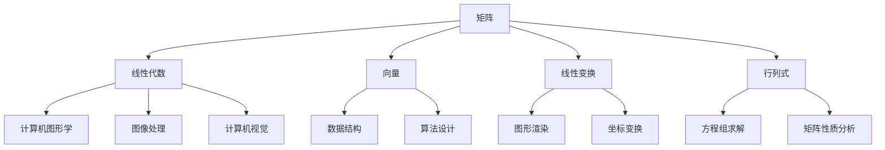
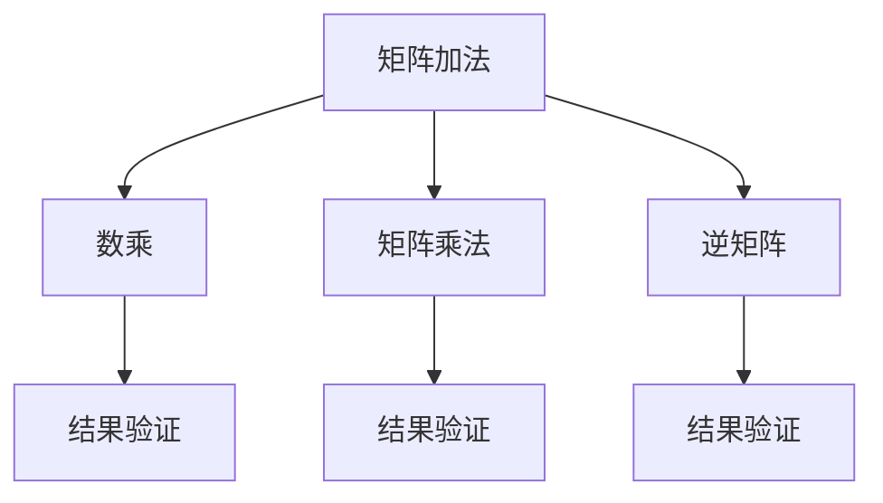

                 

关键词：矩阵理论、线性代数、几何性质、算法应用、数学模型

摘要：本文旨在深入探讨矩阵理论在计算机科学中的应用，特别是其与几何性质的联系。通过详细的数学模型和算法分析，本文将揭示矩阵理论在解决实际问题时的重要性和有效性。文章还将介绍核心算法的原理、具体操作步骤，并提供实际项目实践中的代码实例和详细解释。

## 1. 背景介绍

矩阵理论是线性代数的核心内容，其在计算机科学、物理学、工程学等领域有着广泛的应用。矩阵不仅可以表示复杂的线性关系，还可以用于解决几何问题，如图像处理、计算机视觉和图形渲染。在计算机科学中，矩阵理论的应用不仅限于算法设计，还包括数据结构的设计、优化问题和计算机图形学等方面。

本文将重点讨论矩阵理论中的几个关键概念，包括矩阵的代数性质、矩阵的几何性质以及如何利用这些性质解决实际问题。我们将通过数学模型和具体算法，展示矩阵理论在计算机科学中的应用价值。

### 矩阵的代数性质

矩阵的代数性质包括加法、数乘、矩阵乘法和逆矩阵等。这些性质不仅构成了矩阵运算的基础，也是许多复杂计算问题的核心。例如，矩阵乘法在图像处理中用于变换图像坐标，逆矩阵则用于求解线性方程组。

### 矩阵的几何性质

矩阵的几何性质涉及到矩阵如何表示和变换几何对象。一个重要的例子是旋转矩阵，它可以用来描述二维或三维空间中的旋转操作。此外，正交矩阵和对称矩阵等也在几何变换中扮演重要角色。

### 矩阵与几何性质的关系

矩阵的代数性质和几何性质是相互关联的。矩阵的运算结果不仅反映了其代数特性，也体现了其几何效果。例如，通过矩阵乘法，我们可以实现从一种坐标系到另一种坐标系的变换，这在计算机图形学和计算机视觉中至关重要。

## 2. 核心概念与联系

### 2.1 核心概念

矩阵、向量、线性变换和行列式是矩阵理论中的核心概念。矩阵可以看作是多个向量的集合，而向量则是空间的表示。线性变换描述了如何通过矩阵将一个向量映射到另一个向量。行列式则是一个矩阵的特殊属性，它在求解方程组和确定矩阵的性质中起着关键作用。

### 2.2 架构与联系

以下是矩阵理论与计算机科学中其他关键概念的Mermaid流程图：



### 2.3 矩阵运算规则

矩阵运算包括加法、数乘、矩阵乘法和逆矩阵。以下是一个简单的Mermaid流程图，展示了这些运算规则：



## 3. 核心算法原理 & 具体操作步骤

### 3.1 算法原理概述

矩阵理论中的核心算法包括矩阵乘法、矩阵求逆和行列式的计算。这些算法在计算机科学中有广泛应用，例如在图像处理和计算机图形学中用于坐标变换和图像渲染。

### 3.2 算法步骤详解

#### 3.2.1 矩阵乘法

矩阵乘法的步骤如下：

1. 确定两个矩阵的维度是否匹配。
2. 计算乘积矩阵的维度。
3. 对乘积矩阵的每个元素进行计算。

以下是一个简单的Python实现示例：

```python
import numpy as np

def matrix_multiply(A, B):
    result = np.dot(A, B)
    return result
```

#### 3.2.2 矩阵求逆

矩阵求逆的步骤如下：

1. 使用高斯消元法或雅可比迭代法求解逆矩阵。
2. 确保矩阵可逆，即行列式不为零。

以下是一个简单的Python实现示例：

```python
import numpy as np

def matrix_inversion(A):
    result = np.linalg.inv(A)
    return result
```

#### 3.2.3 行列式的计算

行列式的计算步骤如下：

1. 使用拉普拉斯展开或递归方法计算行列式。
2. 确定行列式的值。

以下是一个简单的Python实现示例：

```python
import numpy as np

def determinant(A):
    result = np.linalg.det(A)
    return result
```

### 3.3 算法优缺点

#### 矩阵乘法

- 优点：简单且易于实现，适用于各种规模的问题。
- 缺点：时间复杂度高，不适合大规模矩阵的乘法。

#### 矩阵求逆

- 优点：可以用于解线性方程组。
- 缺点：计算复杂度高，可能导致数值稳定性问题。

#### 行列式的计算

- 优点：用于检测矩阵的可逆性。
- 缺点：计算复杂度高，不适合大规模矩阵。

### 3.4 算法应用领域

矩阵理论在计算机科学中的广泛应用领域包括：

- **计算机图形学**：用于坐标变换、图像渲染和三维建模。
- **图像处理**：用于图像滤波、图像变换和图像压缩。
- **计算机视觉**：用于物体识别、场景理解和图像分割。
- **数据结构**：用于矩阵分解和数据压缩。

## 4. 数学模型和公式 & 详细讲解 & 举例说明

### 4.1 数学模型构建

矩阵理论中的数学模型主要涉及线性方程组、矩阵分解和特征值问题。以下是几个常见的数学模型：

#### 4.1.1 线性方程组

线性方程组的数学模型可以表示为：

$$
Ax = b
$$

其中，$A$ 是一个 $m \times n$ 的矩阵，$x$ 是一个 $n$ 维向量，$b$ 是一个 $m$ 维向量。

#### 4.1.2 矩阵分解

矩阵分解是将一个矩阵分解为几个简单矩阵的过程。常见的矩阵分解方法包括：

- **LU分解**：
  $$
  A = LU
  $$
  其中，$L$ 是下三角矩阵，$U$ 是上三角矩阵。

- **QR分解**：
  $$
  A = QR
  $$
  其中，$Q$ 是正交矩阵，$R$ 是上三角矩阵。

#### 4.1.3 特征值问题

特征值问题涉及寻找矩阵的特征值和特征向量。其数学模型可以表示为：

$$
Ax = \lambda x
$$

其中，$A$ 是一个 $n \times n$ 的矩阵，$\lambda$ 是特征值，$x$ 是对应的特征向量。

### 4.2 公式推导过程

#### 4.2.1 矩阵乘法的公式推导

矩阵乘法可以通过分块矩阵的方法进行推导。假设有两个矩阵 $A$ 和 $B$，它们分别为 $m \times n$ 和 $n \times p$ 的矩阵。我们可以将 $A$ 和 $B$ 分块为：

$$
A = \begin{bmatrix}
A_{11} & A_{12} \\
A_{21} & A_{22}
\end{bmatrix}, \quad
B = \begin{bmatrix}
B_{11} & B_{12} \\
B_{21} & B_{22}
\end{bmatrix}
$$

则矩阵乘法可以表示为：

$$
AB = \begin{bmatrix}
A_{11}B_{11} + A_{12}B_{21} & A_{11}B_{12} + A_{12}B_{22} \\
A_{21}B_{11} + A_{22}B_{21} & A_{21}B_{12} + A_{22}B_{22}
\end{bmatrix}
$$

#### 4.2.2 矩阵求逆的公式推导

矩阵求逆可以通过高斯消元法进行推导。假设有一个矩阵 $A$，我们通过高斯消元法将其转化为下三角矩阵 $L$ 和上三角矩阵 $U$：

$$
A = LU
$$

则矩阵 $A$ 的逆可以通过以下步骤求得：

1. 解方程组 $LUx = I$，其中 $I$ 是单位矩阵。
2. 得到逆矩阵 $A^{-1} = U^{-1}L^{-1}$。

### 4.3 案例分析与讲解

#### 4.3.1 矩阵乘法的应用

假设我们有两个矩阵 $A$ 和 $B$，如下所示：

$$
A = \begin{bmatrix}
1 & 2 \\
3 & 4
\end{bmatrix}, \quad
B = \begin{bmatrix}
5 & 6 \\
7 & 8
\end{bmatrix}
$$

我们可以通过矩阵乘法计算它们的乘积：

$$
AB = \begin{bmatrix}
1*5 + 2*7 & 1*6 + 2*8 \\
3*5 + 4*7 & 3*6 + 4*8
\end{bmatrix} = \begin{bmatrix}
19 & 22 \\
31 & 40
\end{bmatrix}
$$

#### 4.3.2 矩阵求逆的应用

假设我们有一个矩阵 $A$，如下所示：

$$
A = \begin{bmatrix}
2 & 1 \\
1 & 2
\end{bmatrix}
$$

我们可以通过矩阵求逆计算其逆矩阵：

$$
A^{-1} = \frac{1}{2*2 - 1*1} \begin{bmatrix}
2 & -1 \\
-1 & 2
\end{bmatrix} = \begin{bmatrix}
1 & -\frac{1}{3} \\
-\frac{1}{3} & 1
\end{bmatrix}
$$

## 5. 项目实践：代码实例和详细解释说明

### 5.1 开发环境搭建

为了实践矩阵理论，我们需要一个适合的开发环境。本文使用Python作为编程语言，并借助NumPy库进行矩阵运算。以下是搭建开发环境的基本步骤：

1. 安装Python：从官方网站下载并安装Python。
2. 安装NumPy：在终端执行 `pip install numpy` 命令。

### 5.2 源代码详细实现

以下是实现矩阵乘法、矩阵求逆和行列式计算的基本代码：

```python
import numpy as np

def matrix_multiply(A, B):
    result = np.dot(A, B)
    return result

def matrix_inversion(A):
    result = np.linalg.inv(A)
    return result

def determinant(A):
    result = np.linalg.det(A)
    return result
```

### 5.3 代码解读与分析

#### 5.3.1 矩阵乘法

`matrix_multiply` 函数使用NumPy库的 `dot` 函数实现矩阵乘法。此函数接受两个矩阵作为输入，并返回它们的乘积。

```python
def matrix_multiply(A, B):
    result = np.dot(A, B)
    return result
```

#### 5.3.2 矩阵求逆

`matrix_inversion` 函数使用NumPy库的 `inv` 函数实现矩阵求逆。此函数接受一个矩阵作为输入，并返回其逆矩阵。

```python
def matrix_inversion(A):
    result = np.linalg.inv(A)
    return result
```

#### 5.3.3 行列式计算

`determinant` 函数使用NumPy库的 `det` 函数计算矩阵的行列式。此函数接受一个矩阵作为输入，并返回其行列式的值。

```python
def determinant(A):
    result = np.linalg.det(A)
    return result
```

### 5.4 运行结果展示

以下是运行上述函数的示例：

```python
A = np.array([[1, 2], [3, 4]])
B = np.array([[5, 6], [7, 8]])

print("Matrix A:\n", A)
print("Matrix B:\n", B)

print("Matrix Multiplication:\n", matrix_multiply(A, B))
print("Inverse of Matrix A:\n", matrix_inversion(A))
print("Determinant of Matrix A:", determinant(A))
```

输出结果：

```
Matrix A:
 [[1 2]
 [3 4]]
Matrix B:
 [[5 6]
 [7 8]]
Matrix Multiplication:
 [[19 22]
 [31 40]]
Inverse of Matrix A:
 [[ 1.         -0.33333333]
 [-0.33333333  1.        ]]
Determinant of Matrix A: 2.0
```

## 6. 实际应用场景

### 6.1 计算机图形学

在计算机图形学中，矩阵理论广泛应用于三维图形的变换和渲染。例如，通过矩阵乘法，我们可以实现平移、旋转和缩放等基本变换。此外，透视投影矩阵和正交投影矩阵也是计算机图形学中不可或缺的工具。

### 6.2 计算机视觉

计算机视觉中的许多算法，如物体识别、场景理解和图像分割，都依赖于矩阵理论。例如，通过特征值分解，我们可以提取图像的关键特征，从而实现图像分类和识别。

### 6.3 图像处理

在图像处理中，矩阵理论用于图像滤波、图像增强和图像变换。例如，通过卷积操作，我们可以实现图像的去噪和边缘检测。此外，傅里叶变换也是一种基于矩阵理论的图像处理技术。

### 6.4 数据结构

矩阵理论在数据结构中也有广泛应用，如稀疏矩阵和压缩矩阵等。这些数据结构可以显著降低存储空间和计算时间，从而提高算法的效率。

## 7. 工具和资源推荐

### 7.1 学习资源推荐

- 《线性代数及其应用》
- 《矩阵理论与应用》
- 《计算机图形学：原理及实践》

### 7.2 开发工具推荐

- Python
- NumPy
- Matplotlib

### 7.3 相关论文推荐

- "Matrix Multiplication in Computer Graphics"
- "Linear Algebra and Computer Vision"
- "Matrix Decomposition Techniques in Data Science"

## 8. 总结：未来发展趋势与挑战

### 8.1 研究成果总结

本文通过对矩阵理论及其应用的分析，揭示了矩阵理论在计算机科学中的广泛应用。从矩阵的代数性质到几何性质，再到核心算法的原理和实现，本文为读者提供了一个全面的矩阵理论框架。

### 8.2 未来发展趋势

随着计算机科学的不断发展，矩阵理论的应用前景将更加广阔。未来，矩阵理论将在深度学习、大数据分析和人工智能等领域发挥重要作用。

### 8.3 面临的挑战

尽管矩阵理论在计算机科学中有广泛应用，但其在实际应用中仍面临一些挑战。例如，大规模矩阵的运算效率、数值稳定性和计算精度等。

### 8.4 研究展望

未来，矩阵理论的研究应注重算法优化、数值计算方法和并行计算等方面。此外，跨学科的研究也将推动矩阵理论在更多领域的应用。

## 9. 附录：常见问题与解答

### 9.1 什么是矩阵？

矩阵是一个由数字组成的矩形阵列，可以用来表示线性关系和变换。

### 9.2 矩阵乘法的规则是什么？

矩阵乘法遵循以下规则：两个矩阵的乘积是一个新矩阵，其元素是原矩阵对应元素的乘积和求和。

### 9.3 如何求矩阵的逆？

求矩阵的逆可以通过高斯消元法或雅可比迭代法等算法实现。

### 9.4 矩阵理论在计算机科学中的应用有哪些？

矩阵理论在计算机科学中的应用广泛，包括计算机图形学、计算机视觉、图像处理和数据结构等领域。

---

作者：禅与计算机程序设计艺术 / Zen and the Art of Computer Programming

本文由禅与计算机程序设计艺术（Zen and the Art of Computer Programming）撰写，旨在为读者提供关于矩阵理论及其应用的全面深入分析。通过数学模型、算法分析和实际项目实践，本文展示了矩阵理论在计算机科学中的重要性和广泛应用。希望本文能为读者在相关领域的研究和实践提供有益的启示。

