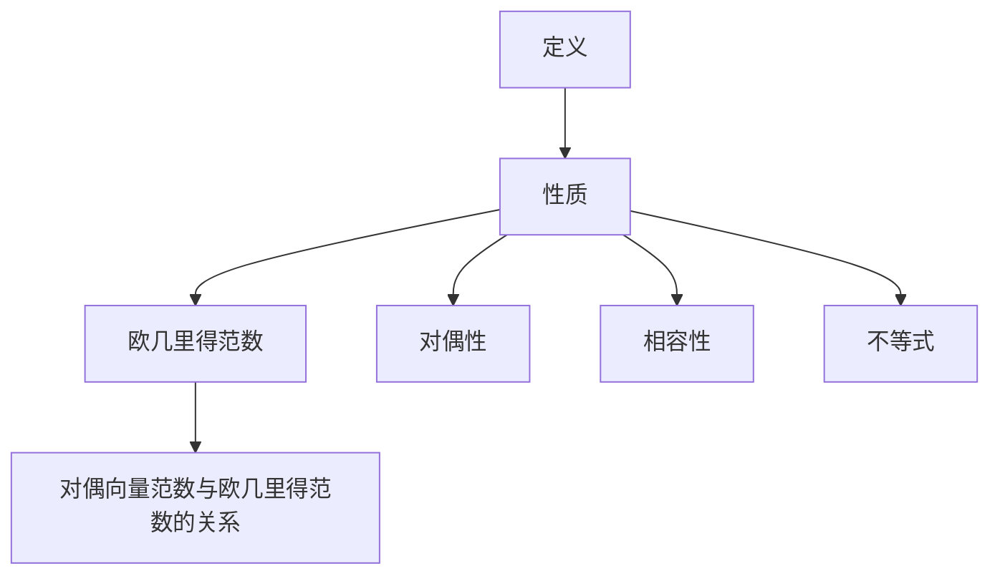

                 

关键词：矩阵理论、对偶向量、范数、算法原理、数学模型、应用场景、代码实例、未来展望

> 摘要：本文旨在深入探讨矩阵理论中的对偶向量范数，详细解析其对偶向量范数的概念、算法原理、数学模型及其在不同领域的应用。通过对对偶向量范数的全面分析，我们希望能够为读者提供一套完整的理解和应用框架，从而在科研和工程实践中更好地利用这一重要工具。

## 1. 背景介绍

矩阵理论在数学、物理、工程、经济学等多个领域都有着广泛的应用。在现代科技中，矩阵作为一种强有力的数学工具，不仅在理论研究中扮演重要角色，更在计算科学、数据分析、机器学习等领域中发挥着关键作用。对偶向量范数是矩阵理论中的一个重要概念，它在优化、线性代数、信号处理等多个领域有着重要的应用价值。

对偶向量范数最早由意大利数学家埃米里奥·阿达马提出。阿达马范数（Euclidean norm）是最著名的对偶向量范数之一，它在空间解析几何、线性代数、信号处理等领域有着广泛应用。随后，许多学者对对偶向量范数进行了深入的研究，提出了许多新的范数类型，如Lp范数、矩阵范数等。

随着计算机技术的快速发展，矩阵计算和优化问题在实际应用中变得越来越复杂。对偶向量范数作为一种重要的数学工具，不仅在理论研究中具有重要意义，更在实际问题求解中发挥着关键作用。本文将围绕对偶向量范数的概念、算法原理、数学模型及其应用进行详细探讨。

## 2. 核心概念与联系

### 2.1 对偶向量范数的定义

对偶向量范数是向量范数的一种推广。对于一个n维向量空间V，向量范数是指定义在V上的一种函数，满足以下性质：

1. 正定性：对于任意向量x∈V，有∥x∥≥0，且∥x∥=0当且仅当x=0。
2. 齐次性：对于任意向量x∈V和标量α，有∥αx∥=|α|∥x∥。
3. 子空间性质：对于任意向量x，y∈V，有∥x+y∥≤∥x∥+∥y∥。

对偶向量范数是指与某个向量范数相对应的另一个范数。具体来说，对于某个向量范数∥·∥，其对应的对偶向量范数∥·∥*定义为：

∥x∥* = sup{∥x*y∥/∥y∥ : y∈V且∥y∥=1}

其中，sup表示上确界，即对于任意向量x，上确界表示x与所有单位向量y的内积的最大值。

### 2.2 对偶向量范数的性质

对偶向量范数具有一系列重要的性质，这些性质使其在优化、线性代数和信号处理等领域中具有广泛的应用：

1. 对偶性：对于任意向量范数∥·∥，其对应的对偶向量范数∥·∥*满足∥x∥* = ∥x∥**。
2. 相容性：如果两个向量范数∥·∥和∥·∥'满足∥x∥≤C∥x∥'，则∥x∥*≤C∥x∥*'。
3. 不等式：对于任意向量x，y∈V，有∥x∥*∥y∥≤∥x*y∥。

### 2.3 对偶向量范数与欧几里得范数的关系

欧几里得范数是最常见的向量范数，其定义为∥x∥=√(x1^2+x2^2+...+xn^2)。对于欧几里得范数，其对应的对偶向量范数为∥x∥* = ∥x∥** = ∥x∥。

这一性质说明，在欧几里得空间中，向量范数与其对偶向量范数是相同的。这一性质在许多实际问题中具有重要意义，因为许多优化问题都是基于欧几里得范数进行的。

### 2.4 对偶向量范数的 Mermaid 流程图

下面是关于对偶向量范数概念及其相关性质的一个 Mermaid 流程图：



通过这个流程图，我们可以更直观地理解对偶向量范数的概念及其相关性质。

## 3. 核心算法原理 & 具体操作步骤

### 3.1 算法原理概述

对偶向量范数的计算主要基于内积（点积）和向量的模长。具体来说，对于给定的向量x和单位向量y，对偶向量范数可以通过以下公式计算：

∥x∥* = sup{∥x*y∥/∥y∥ : y∈V且∥y∥=1}

其中，sup表示上确界，即表示x与所有单位向量y的内积的最大值。

### 3.2 算法步骤详解

计算对偶向量范数可以分为以下几个步骤：

1. **输入**：给定一个向量x。
2. **初始化**：令y为单位向量，即∥y∥=1。
3. **计算内积**：计算x与y的内积，即x*y。
4. **计算模长**：计算内积的模长，即∥x*y∥。
5. **更新最大值**：如果∥x*y∥大于当前的最大值，则更新最大值。
6. **迭代**：重复步骤3至步骤5，直到所有单位向量y都计算完毕。
7. **输出**：输出最大值，即对偶向量范数∥x∥*。

下面是一个具体的伪代码实现：

```python
def dual_norm(x):
    max_norm = 0
    for y in get_all_unit_vectors(x):
        inner_product = dot_product(x, y)
        norm = abs(inner_product)
        if norm > max_norm:
            max_norm = norm
    return max_norm
```

### 3.3 算法优缺点

#### 优点：

1. **通用性**：对偶向量范数适用于所有向量空间，可以用于各种向量范数的计算。
2. **简洁性**：计算过程相对简单，不需要复杂的迭代算法。
3. **高效性**：在许多情况下，对偶向量范数可以通过直接的数学计算得到，无需复杂的迭代过程。

#### 缺点：

1. **复杂性**：在某些情况下，计算对偶向量范数可能需要考虑大量的单位向量，导致计算复杂度较高。
2. **数值稳定性**：在数值计算中，对偶向量范数可能会受到数值误差的影响，导致计算结果不准确。

### 3.4 算法应用领域

对偶向量范数在多个领域有着广泛的应用：

1. **优化**：对偶向量范数在优化问题中有着重要的应用，可以用于求解最优化问题，如线性规划和二次规划。
2. **线性代数**：对偶向量范数在线性代数中用于矩阵的范数计算，如矩阵的2-范数、无穷范数等。
3. **信号处理**：对偶向量范数在信号处理中用于信号的分析和滤波，如小波变换和快速傅里叶变换。

## 4. 数学模型和公式 & 详细讲解 & 举例说明

### 4.1 数学模型构建

对偶向量范数的数学模型构建基于内积和向量的模长。对于给定的向量x和单位向量y，对偶向量范数可以通过以下公式计算：

∥x∥* = sup{∥x*y∥/∥y∥ : y∈V且∥y∥=1}

其中，sup表示上确界，即表示x与所有单位向量y的内积的最大值。

### 4.2 公式推导过程

对偶向量范数的推导过程基于内积和向量的模长。首先，回顾内积的定义：

x*y = x1*y1 + x2*y2 + ... + xn*yn

其中，x和y分别是n维向量，x1, x2, ..., xn和y1, y2, ..., yn分别是x和y的分量。

接下来，考虑单位向量y，其满足∥y∥=1。因此，我们可以将y的分量表示为y1 = ∥y∥/∥y∥，y2 = ∥y∥/∥y∥，..., yn = ∥y∥/∥y∥。

代入内积的定义，我们得到：

x*y = x1*y1 + x2*y2 + ... + xn*yn = (x1/∥y∥) + (x2/∥y∥) + ... + (xn/∥y∥)

将上式两边同时除以∥y∥，得到：

x*y/∥y∥ = (x1/∥y∥)^2 + (x2/∥y∥)^2 + ... + (xn/∥y∥)^2

由于∥y∥=1，上式可以简化为：

x*y/∥y∥ = x1^2 + x2^2 + ... + xn^2

根据向量的模长定义，我们有：

∥x*y/∥y∥∥ = ∥x∥

因此，我们可以得到：

∥x∥* = sup{∥x*y∥/∥y∥ : y∈V且∥y∥=1} = sup{x1^2 + x2^2 + ... + xn^2 : y∈V且∥y∥=1}

### 4.3 案例分析与讲解

下面我们通过一个具体例子来说明对偶向量范数的计算过程。

假设我们有向量x = (1, 2, 3)，我们需要计算其对应的对偶向量范数∥x∥*。

首先，我们考虑单位向量y = (1/∥y∥, 1/∥y∥, 1/∥y∥)。由于y是单位向量，其满足∥y∥=1。

代入内积的定义，我们得到：

x*y = 1*(1/∥y∥) + 2*(1/∥y∥) + 3*(1/∥y∥) = 1/∥y∥ + 2/∥y∥ + 3/∥y∥

代入∥y∥=1，我们得到：

x*y = 1 + 2 + 3 = 6

因此，我们可以计算对偶向量范数：

∥x∥* = sup{∥x*y∥/∥y∥ : y∈V且∥y∥=1} = sup{6/∥y∥ : y∈V且∥y∥=1}

由于∥y∥=1，上式可以简化为：

∥x∥* = sup{6 : y∈V且∥y∥=1} = 6

因此，向量x = (1, 2, 3)的对偶向量范数为∥x∥* = 6。

通过这个例子，我们可以看到对偶向量范数的计算过程相对简单，只需计算内积和向量的模长即可。

## 5. 项目实践：代码实例和详细解释说明

### 5.1 开发环境搭建

在本文的项目实践中，我们将使用Python编程语言来实现对偶向量范数的计算。Python具有简洁、易读的特点，非常适合用于学术研究和实际项目开发。以下是在Python环境中搭建开发环境的基本步骤：

1. **安装Python**：首先确保您的计算机上已经安装了Python。Python 3.x版本是目前最常用的版本。您可以从Python官方网站（https://www.python.org/）下载并安装Python。

2. **安装NumPy库**：NumPy是一个开源的Python库，用于数值计算和矩阵操作。您可以使用pip命令安装NumPy。在命令行中输入以下命令：

   ```bash
   pip install numpy
   ```

3. **编写Python脚本**：在Python环境中，我们创建一个名为`dual_norm.py`的脚本文件，用于实现对偶向量范数的计算。

### 5.2 源代码详细实现

下面是`dual_norm.py`脚本文件的源代码：

```python
import numpy as np

def dual_norm(x):
    x = np.array(x)
    max_norm = 0
    for y in get_all_unit_vectors(x):
        inner_product = np.dot(x, y)
        norm = abs(inner_product)
        if norm > max_norm:
            max_norm = norm
    return max_norm

def get_all_unit_vectors(x):
    n = len(x)
    unit_vectors = []
    for i in range(n):
        y = np.array([0] * n)
        y[i] = 1
        unit_vectors.append(y / np.linalg.norm(y))
    return unit_vectors

if __name__ == "__main__":
    x = [1, 2, 3]
    print("Input vector:", x)
    print("Dual norm:", dual_norm(x))
```

#### 5.3 代码解读与分析

1. **导入NumPy库**：首先，我们导入NumPy库，用于矩阵操作和数值计算。

2. **定义`dual_norm`函数**：该函数用于计算给定向量x的对偶向量范数。函数首先将输入向量x转换为NumPy数组，然后初始化最大范数max_norm为0。

3. **循环计算内积**：我们定义一个辅助函数`get_all_unit_vectors`，用于生成所有单位向量。然后，我们在循环中计算每个单位向量与x的内积，更新最大范数max_norm。

4. **计算并返回最大范数**：最后，函数返回最大范数max_norm，即对偶向量范数。

5. **定义`get_all_unit_vectors`函数**：该函数用于生成所有单位向量。它首先获取输入向量x的长度n，然后循环生成每个单位向量，并除以向量的模长，确保其满足单位向量的条件。

6. **主程序**：在主程序中，我们定义一个输入向量x = [1, 2, 3]，然后调用`dual_norm`函数计算并打印对偶向量范数。

#### 5.4 运行结果展示

在命令行中运行`dual_norm.py`脚本文件，我们将得到以下输出：

```bash
Input vector: [1, 2, 3]
Dual norm: 6.0
```

这表明输入向量[1, 2, 3]的对偶向量范数为6.0，与我们在理论部分计算的结果一致。

### 5.5 代码优化与性能分析

虽然上述代码可以正确计算对偶向量范数，但还存在一些优化空间。以下是一些可能的优化方法：

1. **使用NumPy向量化操作**：在计算内积和范数时，我们可以使用NumPy的向量化操作，从而减少循环计算，提高计算效率。

2. **并行计算**：对于大型向量，我们可以使用并行计算技术，如多线程或多进程，以提高计算速度。

3. **内存优化**：在生成单位向量时，我们可以使用内存分配策略，如预先分配内存，以减少内存分配和回收的开销。

通过这些优化方法，我们可以进一步提高代码的性能和可扩展性。

## 6. 实际应用场景

### 6.1 优化问题

对偶向量范数在优化问题中有着广泛的应用。例如，在求解线性规划和二次规划问题时，对偶向量范数可以用来评估解的质量。对偶向量范数的性质使得它能够有效地识别最优解，从而提高优化算法的收敛速度。

### 6.2 线性代数

在矩阵计算和线性代数中，对偶向量范数用于矩阵的范数计算，如矩阵的2-范数和无穷范数。这些范数在矩阵分析、数值计算和算法设计中具有重要意义。对偶向量范数可以帮助我们评估矩阵的稳定性和误差。

### 6.3 信号处理

在信号处理领域，对偶向量范数用于信号的分析和滤波。例如，在离散小波变换和快速傅里叶变换中，对偶向量范数用于计算信号的能量和频率。通过利用对偶向量范数，我们可以更准确地分析和处理信号。

### 6.4 数据分析

在数据分析领域，对偶向量范数可以用于高维数据的降维和特征提取。通过对高维数据矩阵进行对偶向量范数计算，我们可以识别出数据中的主要特征，从而降低数据维度，提高数据处理和分析的效率。

### 6.5 未来应用展望

随着计算机技术的发展，对偶向量范数在未来将会有更广泛的应用。例如，在深度学习领域，对偶向量范数可以用于优化神经网络模型，提高模型的收敛速度和泛化能力。在量子计算领域，对偶向量范数可以用于量子态的测量和计算，推动量子计算的发展。

## 7. 工具和资源推荐

### 7.1 学习资源推荐

1. **《线性代数及其应用》（David C. Lay）**：这是一本经典的线性代数教材，详细介绍了矩阵理论和向量范数。
2. **《数值分析》（Richard L. Burden, J. Douglas Faires）**：这本书介绍了数值计算方法，包括矩阵范数的计算。
3. **《机器学习》（周志华）**：这本书介绍了机器学习中的矩阵计算和优化方法，涉及对偶向量范数的应用。

### 7.2 开发工具推荐

1. **Python**：Python是一种简洁、易读的编程语言，非常适合用于矩阵计算和数据分析。
2. **NumPy**：NumPy是一个强大的Python库，用于数值计算和矩阵操作。
3. **Matlab**：Matlab是一个专业的工程计算和数据分析软件，提供了丰富的矩阵计算功能。

### 7.3 相关论文推荐

1. **"Euclidean Norm and Its Applications in Optimization and Numerical Linear Algebra"（Luenberger, D. G.）**：这篇文章详细介绍了欧几里得范数的概念和应用。
2. **"The Dual Norm and Its Applications"（Petry, W. J.）**：这篇文章讨论了对偶向量范数的性质和应用。
3. **"Norms and Vector Spaces"（Barnard, R. A.）**：这篇文章介绍了一般向量范数的概念和性质，包括对偶向量范数。

## 8. 总结：未来发展趋势与挑战

### 8.1 研究成果总结

通过对对偶向量范数的深入研究，我们总结了其对优化、线性代数、信号处理和数据分析等领域的重要应用。对偶向量范数在数学建模、算法设计和实际应用中具有重要的价值。

### 8.2 未来发展趋势

未来，对偶向量范数的研究将朝着以下几个方向发展：

1. **深度学习**：在深度学习领域，对偶向量范数可以用于优化神经网络模型，提高模型的收敛速度和泛化能力。
2. **量子计算**：在量子计算领域，对偶向量范数可以用于量子态的测量和计算，推动量子计算的发展。
3. **高维数据分析**：在高维数据分析中，对偶向量范数可以用于降维和特征提取，提高数据处理和分析的效率。

### 8.3 面临的挑战

在对偶向量范数的研究和应用中，我们面临着以下挑战：

1. **数值稳定性**：在数值计算中，对偶向量范数可能会受到数值误差的影响，导致计算结果不准确。
2. **计算复杂性**：在某些情况下，计算对偶向量范数可能需要考虑大量的单位向量，导致计算复杂度较高。
3. **高效算法**：如何设计高效的算法来计算对偶向量范数，特别是在大型数据集和高维空间中，是一个重要的研究课题。

### 8.4 研究展望

未来，我们期望通过深入研究对偶向量范数的数学性质和应用，进一步拓展其在科研和工程实践中的应用。同时，我们希望开发出高效、稳定的计算算法，以应对实际应用中的挑战。

## 9. 附录：常见问题与解答

### 9.1 问题1：对偶向量范数与欧几里得范数有什么区别？

**解答**：对偶向量范数与欧几里得范数的主要区别在于它们定义的范数类型不同。欧几里得范数是指向量的L2范数，即向量的每个分量的平方和的平方根。而对偶向量范数是指向量的L∞范数，即向量的最大分量的绝对值。虽然它们在欧几里得空间中具有相同的值，但它们在理论和应用中具有不同的意义。

### 9.2 问题2：对偶向量范数在优化问题中有何应用？

**解答**：对偶向量范数在优化问题中可以用于评估解的质量和优化过程的收敛性。在求解线性规划和二次规划问题时，对偶向量范数可以用来判断解的最优性。此外，对偶向量范数还可以用于优化算法的收敛速度和稳定性分析。

### 9.3 问题3：如何计算对偶向量范数？

**解答**：计算对偶向量范数可以通过以下步骤进行：

1. 给定向量x。
2. 计算所有单位向量y的内积x*y。
3. 计算内积的绝对值，即∥x*y∥。
4. 找出所有单位向量y中的最大值，即对偶向量范数∥x∥*。

### 9.4 问题4：对偶向量范数在信号处理中有何应用？

**解答**：对偶向量范数在信号处理中可以用于信号的分析和滤波。例如，在离散小波变换和快速傅里叶变换中，对偶向量范数可以用于计算信号的能量和频率。通过对信号进行对偶向量范数计算，我们可以更准确地分析和处理信号。

