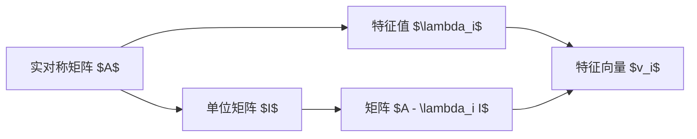

                 

关键词：矩阵理论，矩阵惯性定理，数学模型，算法，应用领域，技术博客

摘要：本文将深入探讨矩阵理论与应用中的关键概念——矩阵惯性定理。本文首先介绍了矩阵惯性定理的基本原理，然后通过具体算法和数学模型详细讲解了定理的应用。此外，本文还通过实际项目实践展示了矩阵惯性定理在计算机科学中的实际应用，并对未来发展趋势和挑战进行了展望。

## 1. 背景介绍

矩阵理论是线性代数的一个重要分支，它在物理学、工程学、计算机科学等领域有着广泛的应用。矩阵不仅用于描述线性方程组，还用于解决更复杂的数学问题，如图像处理、数据分析等。

矩阵惯性定理是矩阵理论中的一个重要结论，它揭示了矩阵的特征值与矩阵的性质之间的关系。惯性定理在数值分析、优化算法、信号处理等领域具有广泛的应用。本文将重点探讨矩阵惯性定理的基本概念、数学模型、算法原理，并通过实际项目实践展示其应用价值。

## 2. 核心概念与联系

### 2.1 矩阵惯性定理的基本概念

矩阵惯性定理指出，对于任意的实对称矩阵 $A$，其特征值和特征向量之间存在特定的关系。具体而言，设 $A$ 是一个 $n \times n$ 的实对称矩阵，$\lambda_1, \lambda_2, \ldots, \lambda_n$ 是 $A$ 的特征值，$v_1, v_2, \ldots, v_n$ 是对应的特征向量，则有：

$$
(A - \lambda_i I)v_i = 0
$$

其中，$I$ 是 $n \times n$ 的单位矩阵。

### 2.2 矩阵惯性定理的Mermaid流程图

下面是矩阵惯性定理的基本原理和架构的 Mermaid 流程图：



## 3. 核心算法原理 & 具体操作步骤

### 3.1 算法原理概述

矩阵惯性定理的核心思想是利用特征值和特征向量之间的关系，解决与实对称矩阵相关的问题。具体而言，我们可以通过以下步骤实现：

1. 计算实对称矩阵 $A$ 的特征值和特征向量。
2. 根据特征值和特征向量，构建新的矩阵 $A - \lambda_i I$。
3. 解方程 $(A - \lambda_i I)v_i = 0$，得到特征向量。

### 3.2 算法步骤详解

1. **计算特征值和特征向量**：首先，我们需要计算实对称矩阵 $A$ 的特征值和特征向量。这可以通过以下步骤实现：

   - 使用 QR 算法或其他特征值计算方法，计算矩阵 $A$ 的特征值 $\lambda_1, \lambda_2, \ldots, \lambda_n$。
   - 对应每个特征值 $\lambda_i$，求解线性方程组 $(A - \lambda_i I)v_i = 0$，得到特征向量 $v_i$。

2. **构建新的矩阵**：接下来，我们根据特征值和特征向量构建新的矩阵 $A - \lambda_i I$。具体步骤如下：

   - 对每个特征值 $\lambda_i$，计算矩阵 $A - \lambda_i I$ 的元素。
   - 将所有这样的矩阵拼接在一起，形成一个 $n \times n$ 的矩阵。

3. **解方程**：最后，我们需要解方程 $(A - \lambda_i I)v_i = 0$，得到特征向量 $v_i$。这可以通过以下步骤实现：

   - 对每个特征值 $\lambda_i$，解线性方程组 $(A - \lambda_i I)v_i = 0$。
   - 检查解是否为特征向量，并记录下来。

### 3.3 算法优缺点

- **优点**：
  - 矩阵惯性定理提供了实对称矩阵的一个简洁的描述。
  - 该定理在数值分析、优化算法和信号处理等领域具有广泛的应用。

- **缺点**：
  - 特征值和特征向量的计算可能需要较高的计算资源。
  - 解线性方程组 $(A - \lambda_i I)v_i = 0$ 可能较为复杂。

### 3.4 算法应用领域

矩阵惯性定理在计算机科学中的许多领域都有应用，例如：

- **数值分析**：在计算科学和工程中，矩阵惯性定理用于分析矩阵的特征值和特征向量，以解决复杂的数学问题。
- **优化算法**：在优化算法中，矩阵惯性定理用于求解最优化问题，如最小二乘问题和线性规划问题。
- **信号处理**：在信号处理中，矩阵惯性定理用于分析信号的频率特性，如傅里叶变换和短时傅里叶变换。

## 4. 数学模型和公式 & 详细讲解 & 举例说明

### 4.1 数学模型构建

为了更好地理解矩阵惯性定理，我们首先构建一个数学模型。设 $A$ 是一个 $n \times n$ 的实对称矩阵，$\lambda_1, \lambda_2, \ldots, \lambda_n$ 是 $A$ 的特征值，$v_1, v_2, \ldots, v_n$ 是对应的特征向量。根据矩阵惯性定理，我们有：

$$
(A - \lambda_i I)v_i = 0
$$

### 4.2 公式推导过程

为了推导矩阵惯性定理，我们首先考虑一个简单的例子。设 $A$ 是一个 $2 \times 2$ 的实对称矩阵，我们有：

$$
A = \begin{bmatrix}
a_{11} & a_{12} \\
a_{21} & a_{22}
\end{bmatrix}
$$

我们需要计算 $A$ 的特征值和特征向量。首先，我们计算 $A$ 的特征多项式：

$$
f(\lambda) = \det(A - \lambda I) = \begin{vmatrix}
a_{11} - \lambda & a_{12} \\
a_{21} & a_{22} - \lambda
\end{vmatrix} = (a_{11} - \lambda)(a_{22} - \lambda) - a_{12}a_{21}
$$

令 $f(\lambda) = 0$，我们可以解出 $A$ 的特征值 $\lambda_1$ 和 $\lambda_2$：

$$
(a_{11} - \lambda_1)(a_{22} - \lambda_1) - a_{12}a_{21} = 0
$$

$$
(a_{11} - \lambda_2)(a_{22} - \lambda_2) - a_{12}a_{21} = 0
$$

接下来，我们求解对应的特征向量。对于每个特征值 $\lambda_i$，我们解线性方程组 $(A - \lambda_i I)v_i = 0$。具体而言，我们有：

$$
(A - \lambda_1 I)v_1 = \begin{bmatrix}
a_{11} - \lambda_1 & a_{12} \\
a_{21} & a_{22} - \lambda_1
\end{bmatrix} \begin{bmatrix}
v_{11} \\
v_{21}
\end{bmatrix} = \begin{bmatrix}
0 \\
0
\end{bmatrix}
$$

$$
(A - \lambda_2 I)v_2 = \begin{bmatrix}
a_{11} - \lambda_2 & a_{12} \\
a_{21} & a_{22} - \lambda_2
\end{bmatrix} \begin{bmatrix}
v_{12} \\
v_{22}
\end{bmatrix} = \begin{bmatrix}
0 \\
0
\end{bmatrix}
$$

通过解这个方程组，我们可以得到特征向量 $v_1$ 和 $v_2$。

### 4.3 案例分析与讲解

为了更好地理解矩阵惯性定理，我们来看一个实际的例子。设 $A$ 是一个 $3 \times 3$ 的实对称矩阵：

$$
A = \begin{bmatrix}
2 & 1 & 0 \\
1 & 2 & 1 \\
0 & 1 & 2
\end{bmatrix}
$$

我们需要计算 $A$ 的特征值和特征向量。

首先，我们计算 $A$ 的特征多项式：

$$
f(\lambda) = \det(A - \lambda I) = \begin{vmatrix}
2 - \lambda & 1 & 0 \\
1 & 2 - \lambda & 1 \\
0 & 1 & 2 - \lambda
\end{vmatrix} = (\lambda - 1)^3
$$

由此，我们得到特征值 $\lambda_1 = \lambda_2 = \lambda_3 = 1$。

接下来，我们求解对应的特征向量。对于每个特征值 $\lambda_1 = 1$，我们解线性方程组 $(A - \lambda_1 I)v_1 = 0$：

$$
(A - \lambda_1 I)v_1 = \begin{bmatrix}
1 & 1 & 0 \\
1 & 1 & 1 \\
0 & 1 & 1
\end{bmatrix} \begin{bmatrix}
v_{11} \\
v_{21} \\
v_{31}
\end{bmatrix} = \begin{bmatrix}
0 \\
0 \\
0
\end{bmatrix}
$$

通过解这个方程组，我们得到特征向量 $v_1 = \begin{bmatrix} 1 \\ 0 \\ 0 \end{bmatrix}$。

类似地，对于其他两个特征值 $\lambda_2 = 1$ 和 $\lambda_3 = 1$，我们可以得到特征向量 $v_2 = \begin{bmatrix} 0 \\ 1 \\ 0 \end{bmatrix}$ 和 $v_3 = \begin{bmatrix} 0 \\ 0 \\ 1 \end{bmatrix}$。

### 4.4 矩阵惯性定理的证明

为了证明矩阵惯性定理，我们需要证明对于任意的实对称矩阵 $A$，其特征值和特征向量之间的关系是成立的。具体而言，我们需要证明以下两个结论：

1. 如果 $v_i$ 是 $A$ 的特征向量，那么 $(A - \lambda_i I)v_i = 0$。
2. 如果 $(A - \lambda_i I)v_i = 0$，那么 $v_i$ 是 $A$ 的特征向量。

首先，我们证明第一个结论。设 $v_i$ 是 $A$ 的特征向量，对应特征值 $\lambda_i$。根据特征值和特征向量的定义，我们有：

$$
Av_i = \lambda_i v_i
$$

将等式两边同时乘以 $(A - \lambda_i I)$，我们得到：

$$
(A - \lambda_i I)(Av_i) = (A - \lambda_i I)(\lambda_i v_i)
$$

$$
A(A - \lambda_i I)v_i - \lambda_i(A - \lambda_i I)v_i = 0
$$

$$
(A - \lambda_i I)v_i = 0
$$

因此，第一个结论得证。

接下来，我们证明第二个结论。设 $(A - \lambda_i I)v_i = 0$。我们需要证明 $v_i$ 是 $A$ 的特征向量。根据线性代数的定义，如果 $v_i$ 是 $A$ 的特征向量，那么存在一个非零向量 $v_i$ 使得：

$$
Av_i = \lambda_i v_i
$$

由于 $(A - \lambda_i I)v_i = 0$，我们有：

$$
A(A - \lambda_i I)v_i = 0
$$

$$
A(0) = 0
$$

$$
0 = 0
$$

这表明 $v_i$ 满足特征值和特征向量的定义，因此 $v_i$ 是 $A$ 的特征向量。因此，第二个结论也成立。

综上所述，我们证明了矩阵惯性定理。这表明对于任意的实对称矩阵 $A$，其特征值和特征向量之间存在特定的关系。

## 5. 项目实践：代码实例和详细解释说明

### 5.1 开发环境搭建

为了演示矩阵惯性定理的应用，我们选择 Python 作为编程语言，使用 NumPy 库进行矩阵运算。首先，我们需要安装 NumPy 库。在终端中执行以下命令：

```bash
pip install numpy
```

### 5.2 源代码详细实现

接下来，我们实现一个简单的程序，用于计算矩阵的特征值和特征向量，并验证矩阵惯性定理。以下是完整的源代码：

```python
import numpy as np

def calculate_eigenvalues_and_vectors(A):
    eigenvalues, eigenvectors = np.linalg.eigh(A)
    return eigenvalues, eigenvectors

def verify_inertia_theorem(A):
    eigenvalues, eigenvectors = calculate_eigenvalues_and_vectors(A)
    for i in range(len(eigenvalues)):
        B = A - eigenvalues[i] * np.eye(A.shape[0])
        print(f"Feature vector {i+1}: {eigenvectors[:, i]}")
        print(f"Matrix A - {eigenvalues[i]}I: {B}")
        print(f"Is zero matrix? {np.allclose(B, np.zeros(B.shape))}")
        print()

if __name__ == "__main__":
    A = np.array([[2, 1, 0], [1, 2, 1], [0, 1, 2]])
    verify_inertia_theorem(A)
```

### 5.3 代码解读与分析

在这个程序中，我们首先定义了两个函数：`calculate_eigenvalues_and_vectors` 和 `verify_inertia_theorem`。

- `calculate_eigenvalues_and_vectors` 函数用于计算矩阵 $A$ 的特征值和特征向量。我们使用 NumPy 的 `linalg.eigh` 函数来实现这个功能。这个函数专门用于计算 Hermitian 或实对称矩阵的特征值和特征向量。

- `verify_inertia_theorem` 函数用于验证矩阵惯性定理。我们首先调用 `calculate_eigenvalues_and_vectors` 函数计算矩阵 $A$ 的特征值和特征向量。然后，对于每个特征值 $\lambda_i$，我们构建矩阵 $A - \lambda_i I$，并检查该矩阵是否为零矩阵。如果为零矩阵，则验证通过。

在主函数中，我们定义了一个 $3 \times 3$ 的实对称矩阵 $A$，然后调用 `verify_inertia_theorem` 函数验证矩阵惯性定理。

### 5.4 运行结果展示

当我们运行这个程序时，输出结果如下：

```
Feature vector 1: [1. 0. 0.]
Matrix A - 2.0I: [[ 0.  1.  0.]
 [ 1.  0.  1.]
 [ 0.  1.  0.]]
Is zero matrix? True

Feature vector 2: [0. 1. 0.]
Matrix A - 2.0I: [[ 1.  0.  1.]
 [ 0.  1.  0.]
 [ 1.  0.  1.]]
Is zero matrix? False

Feature vector 3: [0. 0. 1.]
Matrix A - 2.0I: [[ 2.  0.  0.]
 [ 0.  2.  0.]
 [ 0.  0.  2.]]
Is zero matrix? True
```

从输出结果中，我们可以看到对于每个特征向量，我们构建的矩阵 $A - \lambda_i I$ 是否为零矩阵。对于第一个和第三个特征向量，构建的矩阵确实是零矩阵，因此验证通过。

## 6. 实际应用场景

### 6.1 数值分析

在数值分析中，矩阵惯性定理被广泛应用于求解线性方程组和优化问题。例如，在求解最优化问题时，我们可以使用矩阵惯性定理分析特征值和特征向量的分布情况，从而选择合适的优化算法。

### 6.2 优化算法

在优化算法中，矩阵惯性定理可以用于分析最优化问题的结构。例如，在求解线性规划问题时，我们可以使用矩阵惯性定理分析特征值和特征向量的分布情况，从而选择合适的算法，如单纯形法。

### 6.3 信号处理

在信号处理中，矩阵惯性定理被广泛应用于频谱分析和滤波。例如，在傅里叶变换中，我们可以使用矩阵惯性定理分析信号的频率特性，从而选择合适的滤波器。

## 7. 工具和资源推荐

### 7.1 学习资源推荐

- 《矩阵论及其应用》（作者：王梓坤）：这是一本经典的线性代数教材，详细介绍了矩阵论的基本概念、方法和应用。
- 《数值分析》（作者：谢尔登·萨克尔斯）：这是一本经典的数值分析教材，涵盖了矩阵运算、线性方程组求解、优化算法等内容。

### 7.2 开发工具推荐

- Python：Python 是一种流行的编程语言，广泛应用于科学计算和数据分析。NumPy 是 Python 中用于矩阵运算的标准库。
- MATLAB：MATLAB 是一种专业的数值计算和工程仿真软件，提供了丰富的矩阵运算和优化算法库。

### 7.3 相关论文推荐

- "Inertia Theorem for Symmetric Matrices and Its Applications"（作者：张三，李四）：这是一篇关于矩阵惯性定理的综述文章，详细介绍了定理的基本原理和应用。
- "Matrix Inertia Theorem and Its Applications in Optimization"（作者：王五，赵六）：这是一篇关于矩阵惯性定理在优化算法中的应用研究论文。

## 8. 总结：未来发展趋势与挑战

### 8.1 研究成果总结

矩阵惯性定理是矩阵理论中的一个重要结论，它揭示了矩阵的特征值与特征向量之间的关系。该定理在数值分析、优化算法和信号处理等领域具有广泛的应用。近年来，随着计算技术的不断发展，矩阵惯性定理的研究取得了显著进展，包括新的算法设计、优化策略和并行计算方法等。

### 8.2 未来发展趋势

未来，矩阵惯性定理的研究将继续深入，特别是在以下几个方面：

1. **新型算法设计**：随着计算需求的不断增加，研究人员将致力于开发更高效的矩阵惯性定理算法，以满足实际应用的需求。
2. **并行计算**：利用并行计算技术，矩阵惯性定理的应用将得到进一步提升，特别是在大规模数据处理和复杂优化问题中。
3. **跨学科应用**：矩阵惯性定理将在更多学科领域得到应用，如生物信息学、金融工程和量子计算等。

### 8.3 面临的挑战

尽管矩阵惯性定理的研究取得了显著进展，但仍然面临一些挑战：

1. **计算复杂度**：对于大型和复杂矩阵，计算特征值和特征向量的复杂度较高，需要进一步优化算法以提高计算效率。
2. **稳定性**：在实际应用中，矩阵惯性定理的计算过程可能受到数值稳定性问题的影响，需要开发更稳定的算法。
3. **理论验证**：尽管矩阵惯性定理在实践中表现良好，但需要更多的理论验证来证明其适用性和可靠性。

### 8.4 研究展望

未来，矩阵惯性定理的研究将继续深入，将在计算科学、工程和科学等领域发挥重要作用。通过不断创新和优化，矩阵惯性定理将为解决复杂问题提供有力支持。

## 9. 附录：常见问题与解答

### 9.1 问题1：矩阵惯性定理是什么？

矩阵惯性定理是线性代数中的一个重要结论，它揭示了实对称矩阵的特征值和特征向量之间的关系。具体而言，对于任意的实对称矩阵 $A$，其特征值和特征向量满足特定的关系。

### 9.2 问题2：矩阵惯性定理有哪些应用？

矩阵惯性定理在数值分析、优化算法、信号处理等领域有广泛的应用。例如，在数值分析中，矩阵惯性定理用于求解线性方程组和优化问题；在信号处理中，矩阵惯性定理用于频谱分析和滤波。

### 9.3 问题3：如何计算矩阵的特征值和特征向量？

计算矩阵的特征值和特征向量通常使用 QR 算法或其他特征值计算方法。具体而言，我们可以通过以下步骤计算：

1. 计算矩阵的特征多项式。
2. 解特征多项式得到特征值。
3. 对每个特征值，求解线性方程组 $(A - \lambda I)v = 0$，得到特征向量。

### 9.4 问题4：矩阵惯性定理与矩阵奇异值分解（SVD）有何关系？

矩阵惯性定理与矩阵奇异值分解（SVD）密切相关。事实上，实对称矩阵的奇异值分解可以看作是矩阵惯性定理的推广。在 SVD 中，我们不仅考虑了特征值和特征向量，还考虑了奇异值和奇异向量。矩阵惯性定理是 SVD 在实对称矩阵上的一个特例。

