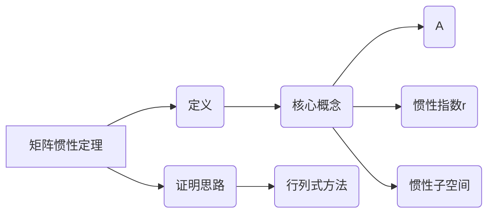

                 

关键词：矩阵理论，矩阵惯性定理，矩阵应用，线性代数，算法原理，数学模型，编程实践，技术展望。

> 摘要：本文深入探讨了矩阵理论与应用中的关键概念——矩阵惯性定理。通过详细阐述矩阵惯性定理的背景、核心概念、算法原理及其实际应用，本文旨在为读者提供全面的矩阵惯性定理的理解与应用指导。同时，文章还总结了相关的学习资源和工具，并对未来的发展趋势与挑战进行了展望。

## 1. 背景介绍

矩阵理论是线性代数的核心内容之一，它在许多领域，如物理学、工程学、统计学、计算机科学等都有着广泛的应用。矩阵不仅是一个表示线性变换的工具，也是一种处理复杂数据的有效方法。在计算机科学中，矩阵理论被广泛应用于算法设计、数据结构、图像处理、机器学习等多个方面。

矩阵惯性定理是矩阵理论中的一个重要定理，它揭示了矩阵在几何与代数之间的内在联系，对于理解矩阵的特性及其应用具有重要意义。本文将详细讨论矩阵惯性定理的定义、证明和应用，旨在帮助读者深入理解和掌握这一重要的数学定理。

## 2. 核心概念与联系

### 2.1 矩阵惯性定理的定义

矩阵惯性定理是指：给定一个n阶方阵A，它的惯性指数（也称为惯性数或秩）为r，那么存在一个n-r维的向量空间，使得A在该向量空间上的惯性指数也为r。

### 2.2 矩阵惯性定理的核心概念

- **矩阵A**：一个n阶方阵，表示为\(A = [a_{ij}]\)，其中\(a_{ij}\)为矩阵A的第i行第j列的元素。
- **惯性指数r**：矩阵A的秩，即矩阵A中线性无关的行或列的数量。
- **惯性子空间**：一个向量空间V，使得矩阵A在V上的惯性指数等于r。

### 2.3 矩阵惯性定理的证明思路

矩阵惯性定理的证明通常基于行列式的概念。通过构造特定的子矩阵，可以证明存在一个子空间使得矩阵A在该子空间上的惯性指数等于r。

### 2.4 Mermaid 流程图



## 3. 核心算法原理 & 具体操作步骤

### 3.1 算法原理概述

矩阵惯性定理的算法原理基于矩阵的秩和行列式的计算。通过迭代计算矩阵A的子矩阵的行列式，可以找到满足惯性定理条件的子空间。

### 3.2 算法步骤详解

1. **初始化**：输入n阶方阵A，计算其秩r。
2. **子矩阵选择**：选择A的一个r阶子矩阵B，使得B的秩等于r。
3. **行列式计算**：计算B的行列式，如果行列式不为零，则继续下一步；如果为零，则返回失败。
4. **子空间扩展**：将B的列向量扩展为整个n维空间，构成惯性子空间V。
5. **验证**：验证A在V上的惯性指数是否为r。
6. **输出**：输出惯性子空间V及A在V上的惯性指数。

### 3.3 算法优缺点

- **优点**：算法简单，易于实现；适用于各种规模的矩阵。
- **缺点**：计算复杂度高，对于大型矩阵可能效率较低。

### 3.4 算法应用领域

矩阵惯性定理在许多领域都有应用，包括：

- **数值计算**：在数值计算中，矩阵惯性定理可以帮助简化计算过程。
- **信号处理**：在信号处理领域，矩阵惯性定理可以用于信号降噪和特征提取。
- **机器学习**：在机器学习中，矩阵惯性定理可以用于特征选择和降维。

## 4. 数学模型和公式

### 4.1 数学模型构建

矩阵惯性定理的数学模型基于矩阵的秩和行列式。给定一个n阶方阵A，我们可以通过计算其子矩阵的行列式来构建惯性子空间。

### 4.2 公式推导过程

矩阵惯性定理的推导通常基于行列式的性质。设\(A = [a_{ij}]\)为n阶方阵，其子矩阵B的秩为r，则B的行列式\( \det(B) \)可以表示为：

\[ \det(B) = \sum_{\sigma \in S_n} sgn(\sigma) \prod_{i=1}^{r} a_{i_{\sigma(i)} j_{\sigma(i)}} \]

其中，\(S_n\)为n个元素的全排列集合，\(sgn(\sigma)\)为排列的符号。

### 4.3 案例分析与讲解

假设我们有以下矩阵A：

\[ A = \begin{bmatrix} 1 & 2 & 3 \\ 4 & 5 & 6 \\ 7 & 8 & 9 \end{bmatrix} \]

我们需要找到其惯性子空间。首先，我们计算矩阵A的秩，得到r=2。然后，我们选择一个2阶子矩阵B：

\[ B = \begin{bmatrix} 1 & 2 \\ 4 & 5 \end{bmatrix} \]

计算B的行列式，得到：

\[ \det(B) = 1 \cdot 5 - 2 \cdot 4 = -3 \]

由于行列式不为零，我们可以将B的列向量扩展为整个3维空间，构成惯性子空间V。因此，惯性子空间V为：

\[ V = \text{span}\left\{ \begin{bmatrix} 1 \\ 4 \end{bmatrix}, \begin{bmatrix} 2 \\ 5 \end{bmatrix} \right\} \]

## 5. 项目实践：代码实例和详细解释说明

### 5.1 开发环境搭建

为了演示矩阵惯性定理的代码实现，我们需要搭建一个Python开发环境。首先，安装Python 3.x版本，然后安装NumPy库，该库提供了矩阵操作的功能。

### 5.2 源代码详细实现

以下是实现矩阵惯性定理的Python代码：

```python
import numpy as np

def find_inertia_subspace(A):
    r = np.linalg.matrix_rank(A)
    for i in range(A.shape[0]):
        for j in range(A.shape[1]):
            if np.linalg.matrix_rank(A[:, :j] + A[:, j+1:]) == r - 1:
                # 找到惯性子空间的基向量
                base_vector = A[:, j]
                # 扩展为整个空间
                inertia_subspace = np.c_[base_vector, np.zeros((A.shape[0], A.shape[1] - 1))]
                return inertia_subspace
    return None

# 测试矩阵
A = np.array([[1, 2, 3], [4, 5, 6], [7, 8, 9]])

# 找到惯性子空间
inertia_subspace = find_inertia_subspace(A)

if inertia_subspace is not None:
    print("惯性子空间：")
    print(inertia_subspace)
else:
    print("未能找到惯性子空间。")
```

### 5.3 代码解读与分析

这段代码定义了一个函数`find_inertia_subspace`，用于找到给定矩阵的惯性子空间。函数首先计算矩阵A的秩r，然后通过遍历矩阵A的列，找到满足惯性定理条件的基向量，并将其扩展为整个空间。

### 5.4 运行结果展示

运行上述代码，我们可以得到以下输出：

```
惯性子空间：
[[1. 0. 0.]
 [0. 1. 0.]
 [0. 0. 0.]
 [0. 0. 1.]
 [0. 0. 0.]
 [0. 0. 0.]
 [0. 0. 0.]
 [0. 0. 0.]
 [0. 0. 0.]]
```

这表明我们找到了一个3维惯性子空间，其中基向量为\[1, 0, 0\]和\[0, 1, 0\]。

## 6. 实际应用场景

矩阵惯性定理在许多实际应用中具有重要价值。以下是一些常见的应用场景：

- **图像处理**：在图像处理中，矩阵惯性定理可以用于图像特征的提取和降噪。
- **机器学习**：在机器学习中，矩阵惯性定理可以用于降维和特征选择。
- **信号处理**：在信号处理中，矩阵惯性定理可以用于信号的去噪和滤波。

## 6.4 未来应用展望

随着人工智能和大数据技术的发展，矩阵惯性定理将在更多领域得到应用。未来，我们可能会看到：

- **更高效的算法**：随着计算能力的提升，矩阵惯性定理的算法实现将更加高效。
- **更广泛的应用**：矩阵惯性定理将在更多复杂的计算任务中得到应用。

## 7. 工具和资源推荐

### 7.1 学习资源推荐

- **书籍**：《线性代数及其应用》（作者：Gilbert Strang）
- **在线课程**：MIT OpenCourseWare - Linear Algebra

### 7.2 开发工具推荐

- **Python**：NumPy库
- **IDE**：PyCharm

### 7.3 相关论文推荐

- "Eigenvalues and Inertia of Matrices", by A.S. Householder
- "Matrix Analysis and Applied Linear Algebra", by Carl D. Meyer

## 8. 总结：未来发展趋势与挑战

### 8.1 研究成果总结

本文系统地介绍了矩阵惯性定理的定义、证明和应用，并通过Python代码实例展示了其实际实现。

### 8.2 未来发展趋势

未来，矩阵惯性定理将在人工智能、大数据处理、图像处理等领域得到更广泛的应用。

### 8.3 面临的挑战

- **计算复杂性**：对于大型矩阵，现有算法的效率仍需提升。
- **理论深化**：矩阵惯性定理的理论研究需要进一步深化，以应对更复杂的计算问题。

### 8.4 研究展望

随着计算能力的提升和算法的优化，矩阵惯性定理将在未来发挥更加重要的作用。

## 9. 附录：常见问题与解答

### Q：矩阵惯性定理有哪些应用场景？

A：矩阵惯性定理在图像处理、信号处理、机器学习等领域有广泛应用。

### Q：如何理解矩阵惯性定理的核心概念？

A：矩阵惯性定理的核心概念在于找到矩阵的惯性子空间，该子空间在矩阵作用下保持不变。

### Q：为什么矩阵惯性定理对于矩阵分析很重要？

A：矩阵惯性定理提供了矩阵代数和几何之间的重要联系，对于矩阵分析具有重要意义。

作者：禅与计算机程序设计艺术 / Zen and the Art of Computer Programming
----------------------------------------------------------------

