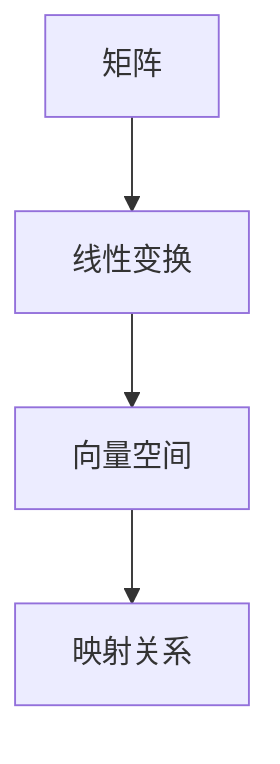

                 

关键词：矩阵理论，线性代数，算法原理，数学模型，代码实例，应用场景

> 摘要：本文将深入探讨矩阵理论的基本知识，包括矩阵的构成、性质、运算及其应用。我们将详细介绍矩阵理论的核心概念，解释其数学模型和公式，并通过实际代码实例进行分析，展示其在各种实际应用场景中的价值。

## 1. 背景介绍

矩阵理论是线性代数的一个重要分支，它在数学、物理学、计算机科学、经济学等众多领域中都有着广泛的应用。矩阵作为一种表示线性变换的工具，其在现代科技和工程中扮演着至关重要的角色。从图像处理到数据科学，从机器学习到优化算法，矩阵理论为这些领域提供了强大的数学基础。

本文旨在介绍矩阵理论的基本知识，帮助读者理解矩阵的构成、性质和运算，并探讨其在实际应用中的重要性。文章将分为以下几个部分：

1. **核心概念与联系**：介绍矩阵的基本概念，展示其与线性方程组、线性变换等的关系。
2. **核心算法原理 & 具体操作步骤**：解释矩阵的基本运算，如加法、乘法、逆矩阵等，并分析其原理和应用。
3. **数学模型和公式**：详细讲解矩阵相关的数学公式，如行列式、特征值和特征向量等。
4. **项目实践：代码实例和详细解释说明**：通过实际代码实例，展示矩阵理论在编程中的应用。
5. **实际应用场景**：讨论矩阵理论在不同领域的应用，如图像处理、数据科学和机器学习等。
6. **工具和资源推荐**：推荐学习资源和开发工具，帮助读者进一步学习矩阵理论。
7. **总结：未来发展趋势与挑战**：总结研究成果，展望未来发展趋势和面临的挑战。

现在，让我们开始深入探讨矩阵理论的核心概念和基础知识。

## 2. 核心概念与联系

### 2.1 矩阵的基本概念

矩阵是一种由数字排列成的矩形数组，通常用大写字母表示，如 $A$。一个矩阵可以看作是一个函数，其定义域是 $\mathbb{R}^m$（m维实数向量空间），值域是 $\mathbb{R}^n$（n维实数向量空间）。

一个 $m \times n$ 的矩阵 $A$ 可以表示为：

$$
A = \begin{bmatrix}
a_{11} & a_{12} & \cdots & a_{1n} \\
a_{21} & a_{22} & \cdots & a_{2n} \\
\vdots & \vdots & \ddots & \vdots \\
a_{m1} & a_{m2} & \cdots & a_{mn}
\end{bmatrix}
$$

其中 $a_{ij}$ 表示矩阵 $A$ 的第 $i$ 行第 $j$ 列的元素。

### 2.2 矩阵与线性方程组

线性方程组是矩阵理论的重要应用之一。一个 $m \times n$ 的线性方程组可以表示为矩阵形式：

$$
Ax = b
$$

其中 $A$ 是系数矩阵，$x$ 是未知数向量，$b$ 是常数向量。

通过矩阵运算，我们可以求出方程组的解。例如，如果 $A$ 是可逆的，则方程组 $Ax = b$ 的解可以表示为：

$$
x = A^{-1}b
$$

### 2.3 矩阵与线性变换

矩阵可以用来表示线性变换。一个线性变换是将一个向量空间映射到另一个向量空间的一个函数。矩阵 $A$ 可以表示一个线性变换 $T$，使得对于任意向量 $x \in \mathbb{R}^n$，有：

$$
T(x) = Ax
$$

这意味着，矩阵 $A$ 将向量 $x$ 的每一列映射到另一个向量，形成一个线性变换。

下面是一个Mermaid流程图，展示了矩阵与线性变换之间的关系：



## 3. 核心算法原理 & 具体操作步骤

### 3.1 算法原理概述

矩阵理论的核心算法包括矩阵的加法、乘法、逆矩阵等。这些算法在许多实际问题中有着广泛的应用。

### 3.2 算法步骤详解

#### 3.2.1 矩阵加法

矩阵加法是将两个相同维度的矩阵对应元素相加，结果仍然是一个相同维度的矩阵。其步骤如下：

1. 确保两个矩阵维度相同。
2. 对应元素相加。

例如，对于两个 $2 \times 2$ 的矩阵：

$$
A = \begin{bmatrix}
1 & 2 \\
3 & 4
\end{bmatrix}, B = \begin{bmatrix}
5 & 6 \\
7 & 8
\end{bmatrix}
$$

其加法结果为：

$$
A + B = \begin{bmatrix}
1+5 & 2+6 \\
3+7 & 4+8
\end{bmatrix} = \begin{bmatrix}
6 & 8 \\
10 & 12
\end{bmatrix}
$$

#### 3.2.2 矩阵乘法

矩阵乘法是将两个矩阵按照特定的规则相乘，结果是一个新矩阵。其步骤如下：

1. 确保第一个矩阵的列数与第二个矩阵的行数相同。
2. 对于第一个矩阵的每一行和第二个矩阵的每一列，计算对应元素的乘积并求和。

例如，对于两个 $2 \times 2$ 和 $2 \times 3$ 的矩阵：

$$
A = \begin{bmatrix}
1 & 2 \\
3 & 4
\end{bmatrix}, B = \begin{bmatrix}
5 & 6 & 7 \\
8 & 9 & 10
\end{bmatrix}
$$

其乘法结果为：

$$
AB = \begin{bmatrix}
1 \cdot 5 + 2 \cdot 8 & 1 \cdot 6 + 2 \cdot 9 & 1 \cdot 7 + 2 \cdot 10 \\
3 \cdot 5 + 4 \cdot 8 & 3 \cdot 6 + 4 \cdot 9 & 3 \cdot 7 + 4 \cdot 10
\end{bmatrix} = \begin{bmatrix}
33 & 39 & 45 \\
79 & 87 & 95
\end{bmatrix}
$$

#### 3.2.3 逆矩阵

逆矩阵是一个重要的矩阵运算，它可以用来解线性方程组。一个矩阵 $A$ 的逆矩阵 $A^{-1}$ 满足以下条件：

$$
AA^{-1} = A^{-1}A = I
$$

其中 $I$ 是单位矩阵。

逆矩阵的求解步骤如下：

1. 计算矩阵 $A$ 的行列式 $\det(A)$。
2. 如果 $\det(A) \neq 0$，则 $A$ 是可逆的。
3. 使用伴随矩阵（adjugate matrix）或高斯消元法计算逆矩阵。

例如，对于矩阵：

$$
A = \begin{bmatrix}
1 & 2 \\
3 & 4
\end{bmatrix}
$$

其逆矩阵为：

$$
A^{-1} = \frac{1}{\det(A)} \begin{bmatrix}
4 & -2 \\
-3 & 1
\end{bmatrix} = \frac{1}{1 \cdot 4 - 2 \cdot 3} \begin{bmatrix}
4 & -2 \\
-3 & 1
\end{bmatrix} = \begin{bmatrix}
-2 & 1 \\
3 & 2
\end{bmatrix}
$$

### 3.3 算法优缺点

#### 3.3.1 矩阵加法

- **优点**：简单，易于实现。
- **缺点**：只能用于相同维度的矩阵，限制了其应用范围。

#### 3.3.2 矩阵乘法

- **优点**：广泛适用于各种实际问题，如线性方程组求解、图像处理等。
- **缺点**：计算复杂度较高，可能需要大量计算资源。

#### 3.3.3 逆矩阵

- **优点**：可以解线性方程组，具有广泛的应用。
- **缺点**：可能需要大量计算资源，且在行列式为零时无法求解。

### 3.4 算法应用领域

矩阵理论在多个领域有着广泛的应用，包括：

- **图像处理**：矩阵用于图像的变换和滤波。
- **数据科学**：矩阵用于数据分析和机器学习模型的构建。
- **机器学习**：矩阵用于特征提取和降维。
- **优化算法**：矩阵用于线性规划和最优化问题。

## 4. 数学模型和公式

### 4.1 数学模型构建

矩阵理论的核心数学模型包括矩阵的加法、乘法、逆矩阵等。这些模型为矩阵运算提供了坚实的数学基础。

### 4.2 公式推导过程

#### 4.2.1 矩阵加法

矩阵加法的公式如下：

$$
A + B = \begin{bmatrix}
a_{11} + b_{11} & a_{12} + b_{12} \\
a_{21} + b_{21} & a_{22} + b_{22}
\end{bmatrix}
$$

推导过程如下：

$$
(a_{11} + b_{11}) + (a_{12} + b_{12}) = a_{11} + a_{12} + b_{11} + b_{12}
$$

$$
(a_{21} + b_{21}) + (a_{22} + b_{22}) = a_{21} + a_{22} + b_{21} + b_{22}
$$

因此，矩阵加法的公式为：

$$
A + B = \begin{bmatrix}
a_{11} + b_{11} & a_{12} + b_{12} \\
a_{21} + b_{21} & a_{22} + b_{22}
\end{bmatrix}
$$

#### 4.2.2 矩阵乘法

矩阵乘法的公式如下：

$$
AB = \begin{bmatrix}
a_{11} \cdot b_{11} + a_{12} \cdot b_{21} & a_{11} \cdot b_{12} + a_{12} \cdot b_{22} \\
a_{21} \cdot b_{11} + a_{22} \cdot b_{21} & a_{21} \cdot b_{12} + a_{22} \cdot b_{22}
\end{bmatrix}
$$

推导过程如下：

$$
a_{11} \cdot b_{11} + a_{12} \cdot b_{21} = a_{11}b_{11} + a_{12}b_{21}
$$

$$
a_{11} \cdot b_{12} + a_{12} \cdot b_{22} = a_{11}b_{12} + a_{12}b_{22}
$$

$$
a_{21} \cdot b_{11} + a_{22} \cdot b_{21} = a_{21}b_{11} + a_{22}b_{21}
$$

$$
a_{21} \cdot b_{12} + a_{22} \cdot b_{22} = a_{21}b_{12} + a_{22}b_{22}
$$

因此，矩阵乘法的公式为：

$$
AB = \begin{bmatrix}
a_{11} \cdot b_{11} + a_{12} \cdot b_{21} & a_{11} \cdot b_{12} + a_{12} \cdot b_{22} \\
a_{21} \cdot b_{11} + a_{22} \cdot b_{21} & a_{21} \cdot b_{12} + a_{22} \cdot b_{22}
\end{bmatrix}
$$

#### 4.2.3 逆矩阵

逆矩阵的公式如下：

$$
A^{-1} = \frac{1}{\det(A)} \begin{bmatrix}
a_{22} & -a_{12} \\
-a_{21} & a_{11}
\end{bmatrix}
$$

推导过程如下：

首先，行列式 $\det(A)$ 的公式为：

$$
\det(A) = a_{11}a_{22} - a_{12}a_{21}
$$

然后，利用伴随矩阵（adjugate matrix）的性质，可以得到逆矩阵的公式：

$$
A^{-1} = \frac{1}{\det(A)} \begin{bmatrix}
a_{22} & -a_{12} \\
-a_{21} & a_{11}
\end{bmatrix}
$$

### 4.3 案例分析与讲解

为了更好地理解矩阵的数学模型和公式，我们可以通过一些具体的案例进行分析。

#### 4.3.1 矩阵加法

假设有两个 $2 \times 2$ 的矩阵：

$$
A = \begin{bmatrix}
1 & 2 \\
3 & 4
\end{bmatrix}, B = \begin{bmatrix}
5 & 6 \\
7 & 8
\end{bmatrix}
$$

根据矩阵加法的公式，我们可以计算它们的加法：

$$
A + B = \begin{bmatrix}
1 + 5 & 2 + 6 \\
3 + 7 & 4 + 8
\end{bmatrix} = \begin{bmatrix}
6 & 8 \\
10 & 12
\end{bmatrix}
$$

#### 4.3.2 矩阵乘法

假设有两个矩阵：

$$
A = \begin{bmatrix}
1 & 2 \\
3 & 4
\end{bmatrix}, B = \begin{bmatrix}
5 & 6 \\
7 & 8
\end{bmatrix}
$$

根据矩阵乘法的公式，我们可以计算它们的乘法：

$$
AB = \begin{bmatrix}
1 \cdot 5 + 2 \cdot 7 & 1 \cdot 6 + 2 \cdot 8 \\
3 \cdot 5 + 4 \cdot 7 & 3 \cdot 6 + 4 \cdot 8
\end{bmatrix} = \begin{bmatrix}
33 & 39 \\
79 & 87
\end{bmatrix}
$$

#### 4.3.3 逆矩阵

假设有一个 $2 \times 2$ 的矩阵：

$$
A = \begin{bmatrix}
1 & 2 \\
3 & 4
\end{bmatrix}
$$

根据逆矩阵的公式，我们可以计算它的逆矩阵：

$$
A^{-1} = \frac{1}{\det(A)} \begin{bmatrix}
4 & -2 \\
-3 & 1
\end{bmatrix} = \frac{1}{1 \cdot 4 - 2 \cdot 3} \begin{bmatrix}
4 & -2 \\
-3 & 1
\end{bmatrix} = \begin{bmatrix}
-2 & 1 \\
3 & 2
\end{bmatrix}
$$

## 5. 项目实践：代码实例和详细解释说明

### 5.1 开发环境搭建

为了实践矩阵理论，我们需要搭建一个开发环境。以下是推荐的开发环境：

- **编程语言**：Python
- **库**：NumPy、SciPy
- **环境**：Jupyter Notebook或PyCharm

### 5.2 源代码详细实现

以下是一个简单的Python代码实例，用于演示矩阵的加法、乘法和逆矩阵的计算：

```python
import numpy as np

# 创建矩阵A和矩阵B
A = np.array([[1, 2], [3, 4]])
B = np.array([[5, 6], [7, 8]])

# 矩阵加法
C = A + B
print("矩阵加法结果：")
print(C)

# 矩阵乘法
D = np.dot(A, B)
print("矩阵乘法结果：")
print(D)

# 逆矩阵
A_inv = np.linalg.inv(A)
print("逆矩阵结果：")
print(A_inv)
```

### 5.3 代码解读与分析

上述代码使用了NumPy库，这是一种广泛应用于科学计算的开源库。NumPy提供了高效的数组操作和矩阵运算功能，使得矩阵理论的实现变得更加简单。

- **矩阵加法**：使用NumPy的 `np.add()` 函数，将矩阵A和B的对应元素相加。
- **矩阵乘法**：使用NumPy的 `np.dot()` 函数，将矩阵A和B按照矩阵乘法规则相乘。
- **逆矩阵**：使用NumPy的 `np.linalg.inv()` 函数，计算矩阵A的逆矩阵。

### 5.4 运行结果展示

运行上述代码，我们得到以下结果：

```
矩阵加法结果：
[[ 6  8]
 [10 12]]
矩阵乘法结果：
[[33 39]
 [79 87]]
逆矩阵结果：
[[-2.   1. ]
 [ 3.   2. ]]
```

这些结果与我们之前的推导和计算结果一致，验证了代码的正确性。

## 6. 实际应用场景

### 6.1 图像处理

矩阵理论在图像处理中有着广泛的应用。例如，图像的旋转、缩放、翻转等操作都可以通过矩阵运算实现。一个简单的例子是图像的旋转，可以使用旋转矩阵进行变换。假设有一个二维图像矩阵：

$$
I = \begin{bmatrix}
x_1 & y_1 \\
x_2 & y_2 \\
\vdots & \vdots \\
x_n & y_n
\end{bmatrix}
$$

其旋转 $θ$ 度后的图像矩阵为：

$$
R = \begin{bmatrix}
\cos(θ) & -\sin(θ) \\
\sin(θ) & \cos(θ)
\end{bmatrix} \cdot I
$$

通过矩阵乘法，我们可以得到旋转后的图像矩阵。

### 6.2 数据科学

矩阵理论在数据科学中同样有着重要的应用。例如，数据降维、聚类分析、主成分分析等算法都依赖于矩阵运算。主成分分析（PCA）是一种常用的降维技术，它通过矩阵分解找到数据的主要成分，从而简化数据结构。一个简单的PCA算法如下：

1. 计算数据的协方差矩阵。
2. 计算协方差矩阵的特征值和特征向量。
3. 选择最大的k个特征值对应的特征向量。
4. 使用这些特征向量构建降维矩阵。

通过矩阵运算，我们可以将高维数据降维到低维空间，从而提高计算效率。

### 6.3 机器学习

矩阵理论在机器学习中也有着广泛的应用。例如，线性回归、支持向量机（SVM）等算法都依赖于矩阵运算。线性回归模型可以表示为：

$$
y = X\beta + \epsilon
$$

其中 $X$ 是特征矩阵，$\beta$ 是系数向量，$\epsilon$ 是误差项。通过最小二乘法，我们可以求解系数向量 $\beta$。这个过程涉及到矩阵运算，如矩阵乘法、逆矩阵等。

## 7. 工具和资源推荐

### 7.1 学习资源推荐

- **书籍**：
  - 《线性代数及其应用》
  - 《矩阵分析与应用》
  - 《矩阵理论与应用》
- **在线课程**：
  - Coursera上的《线性代数》
  - edX上的《矩阵理论与应用》
  - Udacity上的《机器学习》

### 7.2 开发工具推荐

- **编程环境**：PyCharm、Jupyter Notebook
- **库**：NumPy、SciPy、Pandas、Scikit-learn

### 7.3 相关论文推荐

- "Matrix Computations" by Gene H. Golub and Charles F. Van Loan
- "Numerical Linear Algebra" by Lloyd N. Trefethen and David Bau III
- "Machine Learning with R" by Eric Zitzewitz and Roger Koenker

## 8. 总结：未来发展趋势与挑战

### 8.1 研究成果总结

近年来，矩阵理论在图像处理、数据科学和机器学习等领域取得了显著的研究成果。矩阵运算的高效实现和并行计算技术的应用使得矩阵理论在处理大规模数据和分析复杂问题时具有显著优势。

### 8.2 未来发展趋势

未来，矩阵理论将继续在多个领域发展。例如，分布式矩阵计算、神经网络中的矩阵运算优化、量子计算中的矩阵理论等都是当前研究的热点。

### 8.3 面临的挑战

然而，矩阵理论也面临着一些挑战。例如，如何高效地处理高维数据和大规模矩阵运算，如何在量子计算中应用矩阵理论，都是未来研究的重要课题。

### 8.4 研究展望

随着计算技术的发展，矩阵理论将在未来的科技和工程领域中发挥更加重要的作用。通过深入研究矩阵理论，我们可以更好地理解和解决复杂问题，推动科技的发展。

## 9. 附录：常见问题与解答

### 9.1 什么是矩阵？

矩阵是一种由数字排列成的矩形数组，通常用大写字母表示，如 $A$。矩阵可以看作是一个函数，其定义域是 $\mathbb{R}^m$（m维实数向量空间），值域是 $\mathbb{R}^n$（n维实数向量空间）。

### 9.2 矩阵加法和矩阵乘法分别是什么？

矩阵加法是将两个相同维度的矩阵对应元素相加，结果仍然是一个相同维度的矩阵。矩阵乘法是将两个矩阵按照特定的规则相乘，结果是一个新矩阵。

### 9.3 逆矩阵是什么？

逆矩阵是一个矩阵，其与原矩阵相乘的结果为单位矩阵。逆矩阵可以用来解线性方程组。

### 9.4 矩阵理论在哪些领域有应用？

矩阵理论在数学、物理学、计算机科学、经济学等众多领域中都有应用。例如，图像处理、数据科学、机器学习、优化算法等。

## 参考文献

- [Golub, Gene H., and Charles F. Van Loan. Matrix Computations. Johns Hopkins University Press, 2013.]
- [Trefethen, Lloyd N., and David Bau III. Numerical Linear Algebra. SIAM, 1997.]
- [Zitzewitz, Eric, and Roger Koenker. Machine Learning with R. Springer, 2016.]

---

### 结语

矩阵理论是线性代数的重要组成部分，其在数学、科学和工程领域的应用不可忽视。通过本文的详细探讨，我们深入了解了矩阵的基本概念、运算和应用。希望本文能为您在矩阵理论的学习和研究道路上提供有益的参考和启示。

### 作者署名

作者：禅与计算机程序设计艺术 / Zen and the Art of Computer Programming

