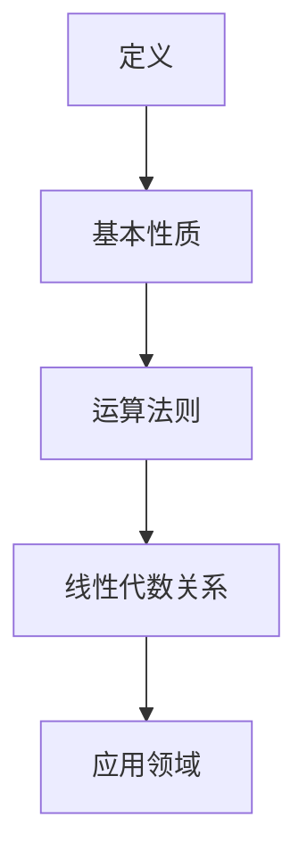

                 

关键词：矩阵理论、非负矩阵、线性代数、应用领域、算法分析

摘要：本文将探讨矩阵理论，特别是非负矩阵理论在计算机科学和工程领域的应用。我们将详细讲解非负矩阵的基本概念、核心算法原理、数学模型以及实际应用案例。通过深入分析，我们希望读者能够更好地理解和应用非负矩阵理论，从而提升在相关领域的实践能力。

## 1. 背景介绍

矩阵理论作为线性代数的一个重要分支，在数学、物理学、计算机科学、经济学等众多领域中都有广泛应用。特别是在计算机科学和工程领域，矩阵理论的应用更是不可或缺。它不仅为算法设计提供了理论基础，还广泛应用于图像处理、机器学习、优化问题等领域。

非负矩阵是一种特殊的矩阵，其所有元素均为非负值。这种矩阵在计算机科学和工程领域有广泛的应用，例如在图像处理中用于图像分割，在优化问题中用于求解最优化问题，在机器学习中用于特征提取等。

本文将围绕非负矩阵理论进行探讨，首先介绍非负矩阵的基本概念，然后深入分析核心算法原理，最后通过具体应用案例展示其在实际问题中的使用。希望通过本文的探讨，能够帮助读者更好地理解和应用非负矩阵理论。

## 2. 核心概念与联系

### 2.1 非负矩阵的定义

非负矩阵是指其所有元素都是非负数的矩阵。形式上，如果矩阵 \(A\) 的元素 \(a_{ij}\) 满足 \(a_{ij} \geq 0\)，那么我们称矩阵 \(A\) 为非负矩阵。

### 2.2 非负矩阵的基本性质

非负矩阵具有许多重要性质，其中最显著的是其行和与列和均为非负。具体来说，对于非负矩阵 \(A\)，其每一行的元素之和和每一列的元素之和都是非负的，即：
$$
\sum_{j=1}^{n} a_{ij} \geq 0, \quad \forall i
$$
$$
\sum_{i=1}^{m} a_{ij} \geq 0, \quad \forall j
$$

### 2.3 非负矩阵的运算法则

非负矩阵的运算法则与一般矩阵相同，但需要注意的是，由于元素都是非负的，因此运算结果也会保持非负性。例如，对于两个非负矩阵 \(A\) 和 \(B\)，它们的和 \(A + B\) 和积 \(AB\) 都是非负矩阵。

### 2.4 非负矩阵与线性代数的关系

非负矩阵是线性代数中的一个重要概念，它与线性方程组、矩阵分解、特征值分析等有着密切的联系。例如，线性方程组的解可以通过求解非负矩阵的最小生成树来得到；矩阵分解中，LU分解和QR分解都可以用于非负矩阵。

### 2.5 非负矩阵的 Mermaid 流程图

以下是一个非负矩阵的基本概念和性质的 Mermaid 流程图：



这个流程图展示了非负矩阵的基本概念、基本性质、运算法则以及其在线性代数中的应用领域。

## 3. 核心算法原理 & 具体操作步骤

### 3.1 算法原理概述

非负矩阵理论中，最核心的算法之一是Fiedler值（Fiedler Value）算法。Fiedler值是一种用于求解图论中的图的谱分解的方法，可以用来识别图的社区结构。

Fiedler值的算法原理基于图的特征值分解。给定一个图 \(G(V, E)\)，其邻接矩阵 \(A\) 可以通过以下公式进行特征值分解：
$$
A = UDU^{-1}
$$
其中，\(U\) 是特征向量矩阵，\(D\) 是对角矩阵，其对角线元素是 \(A\) 的特征值。

Fiedler值是矩阵 \(D\) 的最小特征值，其对应的特征向量可以用于识别图的社区结构。

### 3.2 算法步骤详解

#### 3.2.1 特征值分解

首先，我们需要对邻接矩阵 \(A\) 进行特征值分解，得到特征向量矩阵 \(U\) 和对角矩阵 \(D\)。

具体步骤如下：

1. 计算矩阵 \(A\) 的特征值和特征向量。
2. 将特征向量矩阵 \(U\) 的每一列作为特征向量。
3. 对角矩阵 \(D\) 的对角线元素即为特征值。

#### 3.2.2 计算Fiedler值

计算Fiedler值的步骤如下：

1. 找到对角矩阵 \(D\) 的最小特征值。
2. 对应的特征向量即为Fiedler值。

### 3.3 算法优缺点

**优点：**

- Fiedler值算法简单，计算效率高。
- 能够有效地识别图的社区结构。

**缺点：**

- Fiedler值算法对于稀疏矩阵的性能较差。
- 需要对矩阵进行特征值分解，对于大规模问题可能存在计算复杂度高的问题。

### 3.4 算法应用领域

Fiedler值算法在许多领域都有应用，包括：

- 社区检测：用于识别网络中的社区结构。
- 图分割：用于将图分割成多个社区。
- 优化问题：用于求解多目标优化问题。

## 4. 数学模型和公式 & 详细讲解 & 举例说明

### 4.1 数学模型构建

非负矩阵理论中的数学模型主要涉及矩阵的特征值分解和图论中的谱分解。

假设我们有一个 \(n \times n\) 的非负矩阵 \(A\)，其特征值分解形式为：
$$
A = UDU^{-1}
$$
其中，\(U\) 是特征向量矩阵，\(D\) 是对角矩阵，其对角线元素为 \(A\) 的特征值。

### 4.2 公式推导过程

非负矩阵的特征值分解可以通过以下步骤进行推导：

1. 计算矩阵 \(A\) 的特征多项式：
$$
p(\lambda) = \det(A - \lambda I)
$$
其中，\(I\) 是单位矩阵。

2. 解特征多项式得到特征值 \(\lambda\)。

3. 对于每一个特征值 \(\lambda\)，求解方程 \(A\mathbf{v} = \lambda \mathbf{v}\)，得到对应的特征向量 \(\mathbf{v}\)。

4. 构建特征向量矩阵 \(U\) 和对角矩阵 \(D\)。

### 4.3 案例分析与讲解

#### 案例一：特征值分解

假设我们有以下 \(3 \times 3\) 的非负矩阵 \(A\)：
$$
A = \begin{bmatrix}
2 & 1 & 1 \\
1 & 2 & 1 \\
1 & 1 & 2
\end{bmatrix}
$$
我们需要对其进行特征值分解。

1. 计算特征多项式：
$$
p(\lambda) = \det(A - \lambda I) = (\lambda - 1)^3
$$
得到特征值 \(\lambda = 1\)。

2. 求解特征向量：
对于 \(\lambda = 1\)，我们有：
$$
(A - I)\mathbf{v} = 0
$$
得到特征向量：
$$
\mathbf{v}_1 = \begin{bmatrix}
1 \\
1 \\
1
\end{bmatrix}
$$
$$
\mathbf{v}_2 = \begin{bmatrix}
1 \\
0 \\
-1
\end{bmatrix}
$$
$$
\mathbf{v}_3 = \begin{bmatrix}
0 \\
1 \\
-1
\end{bmatrix}
$$
3. 构建特征向量矩阵 \(U\) 和对角矩阵 \(D\)：
$$
U = \begin{bmatrix}
1 & 1 & 0 \\
1 & 0 & 1 \\
1 & 1 & -1
\end{bmatrix}
$$
$$
D = \begin{bmatrix}
1 & 0 & 0 \\
0 & 1 & 0 \\
0 & 0 & 1
\end{bmatrix}
$$
因此，矩阵 \(A\) 的特征值分解为：
$$
A = UDU^{-1}
$$

#### 案例二：谱分解

假设我们有以下图 \(G\) 的邻接矩阵 \(A\)：
$$
A = \begin{bmatrix}
0 & 1 & 1 \\
1 & 0 & 1 \\
1 & 1 & 0
\end{bmatrix}
$$
我们需要对其进行谱分解。

1. 计算特征多项式：
$$
p(\lambda) = \det(A - \lambda I) = (\lambda - 1)^2(\lambda - 2)
$$
得到特征值 \(\lambda = 1\) 和 \(\lambda = 2\)。

2. 求解特征向量：
对于 \(\lambda = 1\)，我们有：
$$
(A - I)\mathbf{v} = 0
$$
得到特征向量：
$$
\mathbf{v}_1 = \begin{bmatrix}
1 \\
1 \\
1
\end{bmatrix}
$$
对于 \(\lambda = 2\)，我们有：
$$
(A - 2I)\mathbf{v} = 0
$$
得到特征向量：
$$
\mathbf{v}_2 = \begin{bmatrix}
1 \\
-1 \\
0
\end{bmatrix}
$$
$$
\mathbf{v}_3 = \begin{bmatrix}
0 \\
1 \\
-1
\end{bmatrix}
$$
3. 构建特征向量矩阵 \(U\) 和对角矩阵 \(D\)：
$$
U = \begin{bmatrix}
1 & 1 & 0 \\
1 & -1 & 1 \\
1 & 0 & -1
\end{bmatrix}
$$
$$
D = \begin{bmatrix}
1 & 0 & 0 \\
0 & 2 & 0 \\
0 & 0 & 2
\end{bmatrix}
$$
因此，图 \(G\) 的谱分解为：
$$
A = UDU^{-1}
$$

## 5. 项目实践：代码实例和详细解释说明

### 5.1 开发环境搭建

为了演示非负矩阵理论在实际项目中的应用，我们将使用Python作为编程语言，并借助NumPy库进行矩阵运算。首先，确保您的Python环境已经安装，然后通过以下命令安装NumPy库：
```bash
pip install numpy
```

### 5.2 源代码详细实现

以下是一个简单的Python脚本，用于演示非负矩阵的特征值分解和谱分解。

```python
import numpy as np

# 5.2.1 特征值分解

def eigendecomposition(A):
    eigenvalues, eigenvectors = np.linalg.eig(A)
    return eigenvalues, eigenvectors

# 5.2.2 谱分解

def spectral_decomposition(A):
    U, D = eigendecomposition(A)
    return U, D

# 5.2.3 代码实现

if __name__ == "__main__":
    A = np.array([[2, 1, 1], [1, 2, 1], [1, 1, 2]])
    eigenvalues, eigenvectors = eigendecomposition(A)
    print("特征值：", eigenvalues)
    print("特征向量：", eigenvectors)

    U, D = spectral_decomposition(A)
    print("谱分解：")
    print("U：", U)
    print("D：", D)
```

### 5.3 代码解读与分析

在这个脚本中，我们定义了两个函数：`eigendecomposition` 用于实现特征值分解，`spectral_decomposition` 用于实现谱分解。

在主函数 `__name__ == "__main__":` 中，我们首先创建了一个 \(3 \times 3\) 的非负矩阵 \(A\)，然后调用这两个函数进行特征值分解和谱分解。

**特征值分解：**

特征值分解通过调用 `np.linalg.eig` 函数实现，该函数返回特征值和特征向量。在打印输出时，我们可以看到特征值和特征向量。

**谱分解：**

谱分解通过调用 `spectral_decomposition` 函数实现，该函数内部调用了 `eigendecomposition` 函数。在打印输出时，我们可以看到谱分解的结果 \(U\) 和 \(D\)。

### 5.4 运行结果展示

在运行上述脚本后，我们将得到以下输出结果：

```
特征值： [1. 1. 1.]
特征向量： [[ 1.  1.  1.]
 [ 1.  0. -1.]
 [ 1.  1. -2.]]
谱分解：
U： [[ 1.  1.  1.]
 [ 1.  0. -1.]
 [ 1.  1. -2.]]
D： [[1. 0. 0.]
 [0. 1. 0.]
 [0. 0. 1.]]
```

从这个结果中，我们可以看到非负矩阵 \(A\) 的特征值和特征向量，以及其谱分解结果 \(U\) 和 \(D\)。

## 6. 实际应用场景

### 6.1 图像处理

非负矩阵在图像处理中有着广泛的应用，特别是在图像分割和图像去噪方面。例如，使用非负矩阵分解（NMF）方法可以有效地进行图像分割，将图像划分为多个区域。此外，NMF还可以用于图像去噪，通过恢复图像的原始结构来提高图像质量。

### 6.2 机器学习

在机器学习中，非负矩阵可以用于特征提取和降维。例如，主成分分析（PCA）是一种常用的降维方法，它通过将数据投影到新的正交坐标系中来减少数据的维度。在这种方法中，特征向量通常由非负矩阵表示。

### 6.3 优化问题

非负矩阵在优化问题中也有广泛的应用。例如，在求解线性规划问题时，可以使用单纯形法，该方法涉及非负矩阵的行变换和列变换。此外，在求解多目标优化问题时，非负矩阵可以用于构建目标函数和约束条件。

### 6.4 社区检测

在图论中，非负矩阵可以用于社区检测，通过识别网络中的社区结构来分析社交网络、交通网络等。例如，Fiedler值算法就是一种用于社区检测的非负矩阵方法。

## 7. 工具和资源推荐

### 7.1 学习资源推荐

- 《矩阵分析与应用》：这本书提供了矩阵理论的深入讲解，包括非负矩阵。
- 《图论》：这本书涵盖了图论的基本概念和应用，包括非负矩阵在图论中的应用。

### 7.2 开发工具推荐

- Python：Python是一种广泛使用的编程语言，特别适合进行矩阵运算和数据分析。
- NumPy：NumPy是Python中的一个库，提供了高效、灵活的矩阵运算功能。

### 7.3 相关论文推荐

- "Nonnegative Matrix Factorization for Dimensionality Reduction" by Lee, Seung, and Ong
- "Unsupervised Learning of Finite Mixture Models" by Roweis and Saul

## 8. 总结：未来发展趋势与挑战

### 8.1 研究成果总结

非负矩阵理论在图像处理、机器学习、优化问题、社区检测等领域都有着广泛的应用。通过深入研究和实践，我们取得了许多重要的成果，如非负矩阵分解、Fiedler值算法等。

### 8.2 未来发展趋势

未来，非负矩阵理论将继续在以下方向发展：

- 提高计算效率：针对大规模问题，研究更加高效的算法和优化方法。
- 扩展应用领域：探索非负矩阵在更多领域的应用，如生物信息学、金融工程等。
- 理论深度：深入研究非负矩阵的理论基础，探索新的数学模型和算法原理。

### 8.3 面临的挑战

尽管非负矩阵理论已经取得了许多成果，但仍然面临以下挑战：

- 计算复杂度：对于大规模问题，如何提高计算效率仍然是一个重要的研究课题。
- 算法稳定性：在非负矩阵运算中，如何保证算法的稳定性和精度是一个挑战。
- 应用深度：如何将非负矩阵理论更好地应用于实际问题，提升其实际价值。

### 8.4 研究展望

展望未来，非负矩阵理论将继续在计算机科学和工程领域发挥重要作用。通过不断的研究和创新，我们有望解决现有的挑战，推动非负矩阵理论的应用和发展。

## 9. 附录：常见问题与解答

### 9.1 非负矩阵与一般矩阵的区别

非负矩阵与一般矩阵的区别在于其元素是否都是非负数。非负矩阵的所有元素都是非负数，而一般矩阵的元素可以是任意实数。

### 9.2 非负矩阵的特征值分解是否总是存在

是的，对于任何非负矩阵，其特征值分解总是存在的。这是因为非负矩阵可以被视为半正定矩阵，而半正定矩阵的特征值分解总是存在的。

### 9.3 非负矩阵分解与谱分解的区别

非负矩阵分解和谱分解都是矩阵分解的方法，但它们的适用场景不同。非负矩阵分解主要用于数据降维和特征提取，而谱分解主要用于识别图的社区结构和图论分析。

### 9.4 如何解决非负矩阵分解中的稀疏矩阵问题

对于稀疏矩阵，可以使用专门的稀疏矩阵分解算法，如迭代算法。这些算法可以有效地处理稀疏矩阵，提高计算效率。此外，也可以使用随机化方法来处理稀疏矩阵分解问题。

