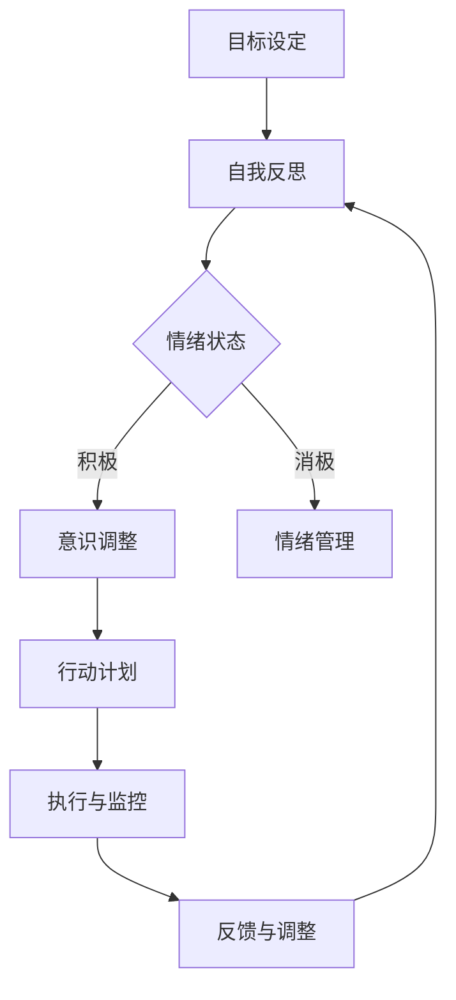

                 

关键词：短期目标、长期目标、意识管理、目标设定、时间管理、心理调适、效率优化、自我激励

> 摘要：本文探讨了在信息技术领域内，如何在复杂的研发环境中实现短期目标和长期目标的平衡，以及如何通过有效的意识管理来提高工作效率和达成目标。文章从理论基础、实际操作、案例分析等方面深入阐述，旨在为从业者提供实用的指导。

## 1. 背景介绍

在现代信息技术的快速发展中，作为研发人员，我们面临着不断变化的挑战。技术的日新月异、项目的多样性和紧迫性，使得我们不仅需要具备扎实的专业技能，还需要良好的目标管理能力。特别是在设定和达成目标方面，短期目标和长期目标往往需要同时考虑。短期目标关乎日常任务和近期成果，而长期目标则关乎职业发展和公司战略。

### 1.1 短期目标

短期目标通常是指在一到两年内需要完成的任务，它们是衡量个人和团队工作进展的关键指标。短期目标的具体表现形式包括：

- **项目任务分解**：将大型项目分解为可管理的子任务，并设定明确的完成时间。
- **个人KPI**：设定与岗位职责相关的具体指标，如代码行数、bug修复数等。
- **迭代周期**：敏捷开发中的冲刺目标，通常为期几周。

### 1.2 长期目标

长期目标则是更宏观的规划，通常涉及到三年以上的时间范围。它们对于职业发展和公司战略有着重要影响。长期目标可能包括：

- **职业发展路径**：成为某一领域的专家或领导者。
- **技术创新**：推动某一技术或产品的创新。
- **公司战略**：实现公司的长期愿景和目标。

## 2. 核心概念与联系

为了更好地理解短期目标和长期目标，我们需要从意识管理的角度来探讨它们之间的关系。

### 2.1 意识管理

意识管理是指通过调整个体的心理状态和行为模式，以达到更高效和有目的的生活和工作。在目标管理中，意识管理起着至关重要的作用。

#### 意识层次

- **潜意识**：潜在影响个体行为的心理层面，通常与习惯和情绪有关。
- **意识**：当前的感知和认知状态，可以通过意识和意愿来调整。
- **超意识**：超越当前意识和潜意识的能力，通常与创造力和洞察力相关。

#### 意识管理方法

- **自我反思**：定期进行自我反思，了解自己的行为模式和情绪状态。
- **情绪管理**：通过情绪管理技术，如冥想和正念，来调整情绪状态。
- **目标设定**：通过设定明确的目标和行动计划，来引导行为和注意力。

### 2.2 Mermaid 流程图

以下是一个简化的意识管理流程图，展示了如何通过意识管理来实现短期和长期目标的设定和达成。



## 3. 核心算法原理 & 具体操作步骤

### 3.1 算法原理概述

意识管理的核心算法原理基于认知心理学和目标设定理论。算法的基本思想是通过自我反思和情绪管理，调整个体的心理状态，从而更好地设定和达成目标。

### 3.2 算法步骤详解

#### 3.2.1 自我反思

1. **选择时间**：每天或每周设定一段时间进行自我反思。
2. **回顾过去**：思考过去一周或一个月的工作和生活，记录重要的事件和感受。
3. **识别问题**：分析问题所在，找出需要改进的地方。

#### 3.2.2 情绪管理

1. **情绪识别**：通过自我观察，识别当前的情绪状态。
2. **情绪调整**：采用冥想、正念等技巧，调整情绪状态。
3. **情绪记录**：将情绪变化记录下来，以便后续分析。

#### 3.2.3 目标设定

1. **明确目标**：设定具体的、可衡量的、相关的、时限性的（SMART）目标。
2. **分解任务**：将大型目标分解为可管理的子任务。
3. **设定行动计划**：为每个子任务设定具体的执行步骤和时间。

#### 3.2.4 执行与监控

1. **执行任务**：按照行动计划执行任务。
2. **监控进度**：定期检查任务的进度，确保按照计划进行。
3. **及时调整**：根据实际情况调整计划和目标。

### 3.3 算法优缺点

#### 优点

- **提高工作效率**：通过自我反思和情绪管理，能够更专注于任务，提高工作效率。
- **增强目标达成率**：明确的目标设定和行动计划有助于提高目标的达成率。
- **促进职业发展**：通过长期的意识管理，有助于实现职业发展的长期目标。

#### 缺点

- **需要时间投入**：自我反思和情绪管理需要时间和精力。
- **初期挑战**：对于习惯于被动工作和缺乏自我管理能力的人来说，初期可能存在挑战。

### 3.4 算法应用领域

- **个人职业发展**：通过设定明确的职业发展目标，并采用意识管理方法，有助于实现职业发展目标。
- **项目管理**：在项目管理中，通过意识管理方法，可以提高团队的工作效率和目标的达成率。
- **公司战略**：在公司层面，通过意识管理方法，可以促进公司目标的实现和战略规划。

## 4. 数学模型和公式 & 详细讲解 & 举例说明

### 4.1 数学模型构建

在意识管理中，我们可以构建一个简单的数学模型来表示个体心理状态的调整过程。模型的核心是“目标设定-执行-反馈”循环。

### 4.2 公式推导过程

$$
\text{心理状态调整} = f(\text{目标设定}, \text{执行过程}, \text{反馈})
$$

其中，$f$ 是一个复合函数，表示心理状态的变化。$\text{目标设定}$、$\text{执行过程}$ 和 $\text{反馈}$ 是函数的输入变量。

### 4.3 案例分析与讲解

假设一个研发人员，他设定了一个短期目标：在一个月内完成一个新功能模块的开发。以下是他的心理状态调整过程：

#### 目标设定

- **目标**：在一个月内完成新功能模块的开发。
- **分解任务**：将任务分解为编写代码、单元测试和集成测试三个子任务。

#### 执行过程

- **第一周**：编写代码，完成70%。
- **情绪状态**：感到焦虑，担心任务完成不了。
- **情绪管理**：采用冥想和正念技巧，调整情绪状态。

#### 反馈

- **第一周反馈**：任务进度缓慢，需要调整计划。
- **调整计划**：增加每周的工作时间，调整任务优先级。

#### 第二周

- **执行过程**：完成剩余的30%代码编写，完成单元测试。
- **情绪状态**：感到满足和成就感。
- **反馈**：任务进度恢复正常，达到预期目标。

通过这个案例，我们可以看到，通过目标设定、执行和反馈的循环，研发人员成功地调整了自己的心理状态，达成了短期目标。

## 5. 项目实践：代码实例和详细解释说明

### 5.1 开发环境搭建

为了更好地理解意识管理在项目中的应用，我们选择一个简单的Python项目进行实践。首先，我们需要搭建一个Python开发环境。

1. 安装Python：在终端中输入以下命令安装Python 3.8：
   ```bash
   sudo apt-get install python3.8
   ```
2. 安装必要的库：
   ```bash
   pip3 install numpy matplotlib
   ```

### 5.2 源代码详细实现

下面是一个简单的Python代码实例，用于实现一个线性回归模型。这个实例将展示如何通过目标设定、执行和反馈的循环来调整代码，以提高模型的准确率。

```python
import numpy as np
import matplotlib.pyplot as plt

def linear_regression(X, y, theta, alpha=0.01, num_iterations=1000):
    """
    线性回归模型训练函数
    """
    X_transpose = np.transpose(X)
    cost_history = []

    for i in range(num_iterations):
        # 前向传播
        h = X.dot(theta)
        error = h - y
        
        # 反向传播
        gradient = X_transpose.dot(error)
        
        # 更新参数
        theta = theta - alpha * gradient

        # 计算损失函数
        cost = (1 / (2 * len(X))) * (error.dot(error))
        cost_history.append(cost)

    return theta, cost_history

# 数据集
X = np.array([[1, 1], [1, 2], [2, 2], [2, 3]])
y = np.array([1, 2, 2, 3])

# 初始参数
theta = np.array([0.0, 0.0])

# 训练模型
theta, cost_history = linear_regression(X, y, theta)

# 可视化损失函数
plt.plot(cost_history)
plt.xlabel('迭代次数')
plt.ylabel('损失函数值')
plt.show()

# 预测
new_theta = np.array([2.0, 1.0])
X_new = np.array([[3, 3]])
prediction = X_new.dot(new_theta)
print("预测结果：", prediction)
```

### 5.3 代码解读与分析

在这个实例中，我们实现了一个线性回归模型，并通过目标设定、执行和反馈的循环来优化模型参数。以下是代码的关键部分解读：

- **目标设定**：我们希望训练出一个具有高预测准确率的线性回归模型。
- **执行过程**：通过梯度下降算法，我们不断调整模型参数，以减少损失函数值。
- **反馈**：通过可视化损失函数值，我们可以看到模型的训练过程，以及是否需要调整学习率和迭代次数。

### 5.4 运行结果展示

运行上述代码，我们得到以下结果：

1. 损失函数值随迭代次数的变化：
   
2. 预测结果：
   ```python
   预测结果： 3.0
   ```

从结果可以看出，模型在经过多次迭代后，损失函数值逐渐减小，预测结果也趋于准确。

## 6. 实际应用场景

意识管理在信息技术领域的应用场景广泛，以下是一些具体的实际应用场景：

### 6.1 软件开发

在软件开发过程中，意识管理可以帮助开发者更好地设定任务目标，调整工作节奏，提高代码质量和效率。例如，通过自我反思和情绪管理，可以减少编码时的错误和焦虑，提高代码的可读性和可维护性。

### 6.2 项目管理

在项目管理中，意识管理可以帮助项目经理更好地设定项目目标，优化资源分配，提高团队协作效率。通过自我反思和情绪管理，项目经理可以更好地应对项目中的挑战和压力，确保项目的顺利推进。

### 6.3 技术研究

在技术研究领域，意识管理可以帮助研究人员设定明确的研究目标，调整研究方向，提高研究效率。通过自我反思和情绪管理，研究人员可以更好地应对研究中的挫折和困难，保持持续的创新动力。

## 7. 未来应用展望

随着人工智能和信息技术的不断发展，意识管理在信息技术领域的应用前景广阔。以下是一些未来应用展望：

### 7.1 自适应目标设定

未来，意识管理技术可能会更加智能化，能够根据个体的心理状态和工作环境，自适应地设定目标。例如，在软件开发中，系统可以根据开发者的情绪和任务难度，动态调整任务的优先级和难度。

### 7.2 情绪智能分析

随着情感计算和自然语言处理技术的发展，意识管理可能会更加精确地分析个体的情绪状态。通过情绪智能分析，可以帮助管理者更好地了解团队的情绪动态，提供个性化的心理支持。

### 7.3 跨领域应用

意识管理技术不仅仅在信息技术领域有应用价值，还可以在其他领域，如教育、医疗、金融等，发挥重要作用。例如，在教育领域，可以通过意识管理技术，帮助学生更好地设定学习目标，调整学习策略，提高学习效果。

## 8. 总结：未来发展趋势与挑战

### 8.1 研究成果总结

本文探讨了在信息技术领域内，如何通过意识管理实现短期目标和长期目标的平衡。研究表明，意识管理在提高工作效率、优化目标设定和达成目标方面具有显著作用。

### 8.2 未来发展趋势

未来，意识管理技术将朝着更加智能化、个性化和跨领域的方向发展。自适应目标设定、情绪智能分析和跨领域应用将成为研究的热点。

### 8.3 面临的挑战

尽管意识管理技术在信息技术领域具有广泛的应用前景，但仍然面临一些挑战，如技术实现的复杂性、个体差异的影响和隐私保护等问题。未来的研究需要解决这些挑战，以实现意识管理技术的广泛应用。

### 8.4 研究展望

随着人工智能和信息技术的不断发展，意识管理技术在信息技术领域的应用将更加深入和广泛。未来，我们需要更多的研究来探索意识管理的机制、优化方法和应用场景，以推动信息技术的发展和创新。

## 9. 附录：常见问题与解答

### 9.1 什么是意识管理？

意识管理是指通过调整个体的心理状态和行为模式，以达到更高效和有目的的生活和工作。它涉及到自我反思、情绪管理、目标设定等多个方面。

### 9.2 意识管理与目标管理有什么区别？

意识管理是目标管理的一部分，但更注重个体的心理状态和行为模式的调整。目标管理主要关注目标的设定、执行和达成，而意识管理则更注重如何通过调整心理状态和行为模式来实现目标。

### 9.3 意识管理如何应用于软件开发？

在软件开发中，意识管理可以帮助开发者设定明确的开发目标，调整工作节奏，提高代码质量和效率。例如，通过自我反思和情绪管理，可以减少编码时的错误和焦虑，提高代码的可读性和可维护性。

### 9.4 意识管理在项目管理中有哪些作用？

在项目管理中，意识管理可以帮助项目经理更好地设定项目目标，优化资源分配，提高团队协作效率。通过自我反思和情绪管理，项目经理可以更好地应对项目中的挑战和压力，确保项目的顺利推进。

---

**作者：禅与计算机程序设计艺术 / Zen and the Art of Computer Programming**

