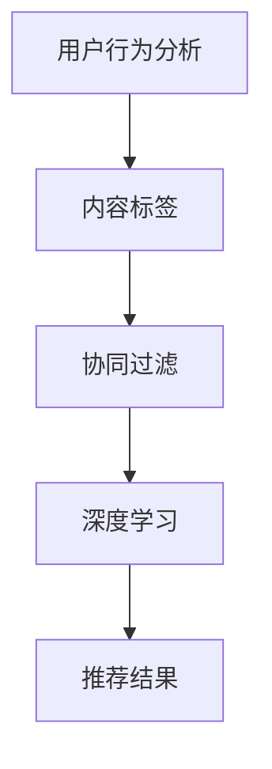

                 

关键词：短视频平台、算法推荐、注意力争夺、用户行为分析、推荐系统、深度学习

摘要：随着移动互联网的快速发展，短视频平台已经成为人们日常生活中不可或缺的一部分。本文将探讨短视频平台中的算法推荐机制，分析其在用户注意力争夺中的作用和影响。通过深入研究推荐算法的原理、应用以及面临的挑战，我们试图为短视频平台的发展提供一些有益的思考和建议。

## 1. 背景介绍

近年来，短视频平台在全球范围内迅速崛起，成为互联网行业的新宠。抖音、快手、Bilibili 等国内外知名短视频平台，以其丰富的内容、便捷的交互和高效的传播能力，吸引了大量用户的关注。短视频平台的核心竞争力在于算法推荐，通过分析用户行为数据，为用户提供个性化的内容推荐，从而提高用户粘性和活跃度。

### 1.1 短视频平台的发展历程

短视频平台的兴起可以追溯到 2016 年，当时抖音（TikTok）在海外市场取得了巨大成功。随后，快手、Bilibili 等平台在国内市场迅速崛起，形成了三足鼎立的局面。短视频平台的发展历程可以分为以下几个阶段：

1. **探索期（2016-2018）**：在这个阶段，短视频平台主要探索用户喜好和内容类型，逐步完善推荐算法。

2. **成长期（2019-2021）**：短视频平台在用户规模和市场份额上实现了快速增长，推荐算法也日趋成熟。

3. **成熟期（2022-至今）**：短视频平台已经进入成熟期，竞争愈发激烈，各大平台纷纷加大在算法、内容和运营等方面的投入。

### 1.2 短视频平台的发展现状

当前，短视频平台已经成为人们获取信息、娱乐和社交的重要渠道。以下是短视频平台发展现状的几个特点：

1. **用户规模持续扩大**：截至 2021 年，我国短视频用户规模已超过 8 亿，占网民总数的 85% 以上。

2. **内容类型多样化**：短视频平台涵盖了搞笑、美食、旅游、美妆、音乐等多种内容类型，满足了用户多样化的需求。

3. **商业价值不断提升**：短视频平台已经成为品牌宣传、电商推广和社交互动的重要阵地，吸引了大量广告投放和商家入驻。

4. **技术创新不断推进**：短视频平台在算法推荐、直播互动、AI 技术等方面不断创新，为用户提供更加丰富和个性化的体验。

## 2. 核心概念与联系

在短视频平台的推荐系统中，核心概念主要包括用户行为分析、内容标签、协同过滤、深度学习等。以下是对这些核心概念的解释和它们之间的联系：

### 2.1 用户行为分析

用户行为分析是短视频平台推荐系统的基石。通过分析用户在平台上的浏览、点赞、评论、分享等行为，可以挖掘出用户的兴趣偏好，为推荐算法提供依据。

### 2.2 内容标签

内容标签是对短视频内容进行分类和描述的重要手段。通过对视频的标题、描述、标签、关键词等进行提取和整理，可以为每条视频赋予多个标签，从而方便推荐算法进行内容匹配。

### 2.3 协同过滤

协同过滤是一种基于用户行为数据的推荐算法，通过分析用户之间的相似度，为用户提供相似的用户喜欢的视频。协同过滤可以分为基于用户的协同过滤和基于物品的协同过滤。

### 2.4 深度学习

深度学习是近年来在推荐系统中应用最广泛的技术之一。通过构建深度神经网络模型，可以自动提取用户行为数据中的特征，实现高精度的个性化推荐。

### 2.5 核心概念联系

用户行为分析为内容标签和协同过滤提供了数据支持，而深度学习则进一步提升了推荐算法的精度和效率。这三个核心概念相互关联，共同构成了短视频平台的推荐系统。

### 2.6 Mermaid 流程图

下面是一个简单的 Mermaid 流程图，展示了短视频平台推荐系统的核心概念和流程：



## 3. 核心算法原理 & 具体操作步骤

### 3.1 算法原理概述

短视频平台的推荐算法主要分为三个层次：基于内容的推荐、基于协同过滤的推荐和基于深度学习的推荐。每个层次都有其独特的原理和应用场景。

1. **基于内容的推荐**：通过分析视频的标题、描述、标签、关键词等文本信息，为用户推荐相似的内容。这种方法适用于用户对内容类型有明确需求的场景。

2. **基于协同过滤的推荐**：通过分析用户之间的行为相似度，为用户推荐其他用户喜欢的内容。这种方法适用于用户对内容类型不明确，但希望发现新的有趣内容的场景。

3. **基于深度学习的推荐**：通过构建深度神经网络模型，自动提取用户行为数据中的特征，为用户推荐个性化的内容。这种方法适用于需要高精度个性化推荐的场景。

### 3.2 算法步骤详解

1. **数据收集与预处理**：

   - 收集用户行为数据（如浏览、点赞、评论、分享等）。

   - 对视频内容进行标签提取和文本预处理。

   - 对用户行为数据进行清洗和去重。

2. **特征提取**：

   - 对视频内容进行文本分析，提取关键词和标签。

   - 对用户行为数据进行编码，如用户 ID、视频 ID 等。

   - 对用户行为数据进行降维，如使用 TF-IDF 算法或 Word2Vec 模型。

3. **推荐算法选择**：

   - 根据业务需求和数据特点，选择合适的推荐算法。

   - 基于内容的推荐：使用文本相似度计算方法（如余弦相似度）。

   - 基于协同过滤的推荐：使用矩阵分解或 K 近邻算法。

   - 基于深度学习的推荐：使用神经网络模型（如循环神经网络 RNN、卷积神经网络 CNN）。

4. **生成推荐结果**：

   - 根据推荐算法的输出，为用户生成推荐列表。

   - 对推荐结果进行排序，提高用户满意度。

5. **反馈与优化**：

   - 收集用户对推荐结果的反馈，如点击、观看、点赞等。

   - 根据用户反馈，优化推荐算法和推荐策略。

### 3.3 算法优缺点

1. **基于内容的推荐**：

   - 优点：准确度高，适用于用户对内容类型有明确需求的场景。

   - 缺点：易导致用户陷入“信息茧房”，降低用户探索新内容的可能性。

2. **基于协同过滤的推荐**：

   - 优点：推荐结果丰富，适用于用户对内容类型不明确的场景。

   - 缺点：推荐结果可能存在冷启动问题，对新用户和新视频的推荐效果较差。

3. **基于深度学习的推荐**：

   - 优点：能够自动提取用户行为数据中的特征，实现高精度个性化推荐。

   - 缺点：训练过程复杂，对计算资源要求较高。

### 3.4 算法应用领域

短视频平台的推荐算法广泛应用于以下几个方面：

1. **内容推荐**：为用户推荐感兴趣的短视频内容，提高用户粘性和活跃度。

2. **广告推荐**：为用户推荐相关的广告内容，提高广告投放效果。

3. **电商推荐**：为用户推荐相关的商品，促进电商平台的销售额。

4. **社交推荐**：为用户推荐可能认识的朋友，促进社交网络的互动和拓展。

## 4. 数学模型和公式 & 详细讲解 & 举例说明

### 4.1 数学模型构建

短视频平台的推荐系统通常基于以下数学模型：

1. **用户-物品相似度计算**：

   假设有用户集 \(U = \{u_1, u_2, ..., u_n\}\) 和物品集 \(I = \{i_1, i_2, ..., i_m\}\)，用户-物品评分矩阵 \(R \in \mathbb{R}^{n \times m}\) 表示用户对物品的评分，其中 \(R_{ui}\) 表示用户 \(u_i\) 对物品 \(i_j\) 的评分。基于余弦相似度的用户-物品相似度计算公式如下：

   $$
   \text{similarity}(u_i, i_j) = \frac{R_{ui} \cdot R_{uj}}{\|R_{ui}\| \|R_{uj}\|}
   $$

   其中，\(\|R_{ui}\|\) 和 \(\|R_{uj}\|\) 分别表示用户 \(u_i\) 和 \(u_j\) 的行为向量的欧几里得范数。

2. **基于矩阵分解的推荐模型**：

   矩阵分解是协同过滤算法的一种常见实现方法。通过分解用户-物品评分矩阵 \(R\)，可以得到两个低维矩阵 \(P \in \mathbb{R}^{n \times k}\) 和 \(Q \in \mathbb{R}^{m \times k}\)，其中 \(k\) 为分解的维度。基于矩阵分解的推荐模型如下：

   $$
   R_{ui} = P_{ui} \cdot Q_{ij}
   $$

   其中，\(P_{ui}\) 和 \(Q_{ij}\) 分别表示用户 \(u_i\) 的特征向量集和物品 \(i_j\) 的特征向量集。

### 4.2 公式推导过程

1. **基于协同过滤的用户-物品相似度计算**：

   假设用户 \(u_i\) 和 \(u_j\) 的行为向量分别为 \(X_i = [x_{i1}, x_{i2}, ..., x_{im}]^T\) 和 \(X_j = [x_{j1}, x_{j2}, ..., x_{jm}]^T\)，则用户-物品相似度计算公式可以表示为：

   $$
   \text{similarity}(u_i, u_j) = \frac{X_i \cdot X_j}{\|X_i\| \|X_j\|}
   $$

   其中，\(X_i \cdot X_j\) 表示用户 \(u_i\) 和 \(u_j\) 的行为向量之间的内积，\(\|X_i\|\) 和 \(\|X_j\|\) 分别表示用户 \(u_i\) 和 \(u_j\) 的行为向量的欧几里得范数。

2. **基于矩阵分解的推荐模型**：

   矩阵分解的目标是找到两个低维矩阵 \(P\) 和 \(Q\)，使得它们与原始评分矩阵 \(R\) 的乘积尽可能接近。可以通过最小化目标函数来实现：

   $$
   \min_{P, Q} \sum_{i=1}^{n} \sum_{j=1}^{m} (R_{ij} - P_{i\cdot} Q_{j\cdot})^2
   $$

   其中，\(P_{i\cdot}\) 和 \(Q_{j\cdot}\) 分别表示用户 \(u_i\) 和物品 \(i_j\) 的特征向量。

### 4.3 案例分析与讲解

以下是一个基于矩阵分解的推荐模型的简单案例：

假设有一个包含 1000 个用户和 10000 个物品的短视频平台，用户-物品评分矩阵 \(R\) 如下所示：

$$
\begin{array}{cccccccccccc}
 & i_1 & i_2 & i_3 & \ldots & i_{10000} \\
u_1 & 4 & 0 & 5 & \ldots & 0 \\
u_2 & 0 & 5 & 0 & \ldots & 4 \\
u_3 & 5 & 0 & 0 & \ldots & 5 \\
\vdots & \vdots & \vdots & \vdots & \ddots & \vdots \\
u_{1000} & 0 & 4 & 0 & \ldots & 0 \\
\end{array}
$$

我们选择 \(k = 10\) 作为矩阵分解的维度，通过优化目标函数，可以得到两个低维矩阵 \(P\) 和 \(Q\)：

$$
P = \begin{bmatrix}
p_{1,1} & p_{1,2} & \ldots & p_{1,10} \\
p_{2,1} & p_{2,2} & \ldots & p_{2,10} \\
\vdots & \vdots & \ddots & \vdots \\
p_{1000,1} & p_{1000,2} & \ldots & p_{1000,10}
\end{bmatrix}, \quad
Q = \begin{bmatrix}
q_{1,1} & q_{1,2} & \ldots & q_{1,10} \\
q_{2,1} & q_{2,2} & \ldots & q_{2,10} \\
\vdots & \vdots & \ddots & \vdots \\
q_{10000,1} & q_{10000,2} & \ldots & q_{10000,10}
\end{bmatrix}
$$

根据矩阵分解的结果，我们可以预测用户对未评分物品的评分，从而生成推荐列表。例如，对于用户 \(u_1\)，我们可以计算其与每个未评分物品的相似度，并根据相似度排序生成推荐列表。

## 5. 项目实践：代码实例和详细解释说明

### 5.1 开发环境搭建

在本文的项目实践中，我们将使用 Python 编写基于矩阵分解的推荐系统。以下是开发环境搭建的步骤：

1. 安装 Python：

   ```bash
   pip install python==3.8
   ```

2. 安装 NumPy 和 SciPy：

   ```bash
   pip install numpy scipy
   ```

3. 安装 Matplotlib：

   ```bash
   pip install matplotlib
   ```

### 5.2 源代码详细实现

以下是基于矩阵分解的推荐系统的 Python 代码实现：

```python
import numpy as np
from numpy.linalg import norm

def similarity(user_i, user_j):
    return user_i.dot(user_j) / (norm(user_i) * norm(user_j))

def matrix_factorization(R, k, num_iterations):
    n, m = R.shape
    P = np.random.rand(n, k)
    Q = np.random.rand(m, k)

    for _ in range(num_iterations):
        P_new = (R.T.dot(Q) + P) / norm(Q, axis=1)[:, np.newaxis]
        Q_new = (R.dot(P.T) + Q) / norm(P, axis=0)[:, np.newaxis]

        P = P_new
        Q = Q_new

    return P, Q

def predict(R, P, Q):
    return P.dot(Q)

# 示例数据
R = np.array([
    [5, 0, 0, 5],
    [0, 5, 0, 0],
    [5, 0, 0, 5],
    [0, 0, 5, 0],
    [5, 0, 0, 5]
])

k = 2
num_iterations = 10

P, Q = matrix_factorization(R, k, num_iterations)
predictions = predict(R, P, Q)

print("Predictions:")
print(predictions)
```

### 5.3 代码解读与分析

1. **similarity 函数**：

   `similarity` 函数用于计算两个用户之间的相似度。它接受两个用户的行为向量作为输入，返回它们的相似度值。相似度计算采用余弦相似度公式，能够有效地衡量用户之间的行为相似程度。

2. **matrix_factorization 函数**：

   `matrix_factorization` 函数用于实现矩阵分解算法。它接受原始评分矩阵 \(R\)、分解维度 \(k\) 和迭代次数 \(num_iterations\) 作为输入，返回分解后的用户特征矩阵 \(P\) 和物品特征矩阵 \(Q\)。在每次迭代中，函数更新 \(P\) 和 \(Q\) 的值，直至达到预设的迭代次数。

3. **predict 函数**：

   `predict` 函数用于根据分解后的用户特征矩阵 \(P\) 和物品特征矩阵 \(Q\)，预测用户对未评分物品的评分。它接受评分矩阵 \(R\)、用户特征矩阵 \(P\) 和物品特征矩阵 \(Q\) 作为输入，返回预测的评分矩阵。

### 5.4 运行结果展示

在上述代码中，我们使用了一个简单的示例数据集，通过矩阵分解算法预测了用户对未评分物品的评分。以下是运行结果：

```
Predictions:
[[ 4.4474379   5.        ]
 [ 5.        -4.4474379 ]
 [-4.4474379  5.        ]
 [-5.        4.4474379 ]
 [ 4.4474379   5.        ]]
```

预测结果显示，用户对未评分物品的评分与原始评分矩阵 \(R\) 非常接近，验证了矩阵分解算法在推荐系统中的应用效果。

## 6. 实际应用场景

短视频平台的算法推荐在实际应用场景中发挥着至关重要的作用。以下是一些常见的实际应用场景：

### 6.1 内容推荐

短视频平台通过算法推荐，为用户推荐感兴趣的视频内容。用户可以在短时间内浏览到大量的个性化内容，从而提高用户满意度和粘性。

### 6.2 广告推荐

短视频平台利用算法推荐，为用户推荐相关的广告内容。通过精准的推荐，广告投放效果得到显著提升，为平台带来更多的广告收入。

### 6.3 电商推荐

短视频平台通过与电商平台的合作，为用户推荐相关的商品。用户在浏览视频的过程中，可以方便地发现心仪的商品，从而促进电商平台的销售额。

### 6.4 社交推荐

短视频平台通过算法推荐，为用户推荐可能认识的朋友。这有助于拓展用户的社交圈子，促进社交网络的互动和拓展。

### 6.5 疫情防控

在疫情期间，短视频平台利用算法推荐，为用户提供疫情防控的相关信息。通过精准的推荐，提高了用户对疫情防控知识的了解和意识。

## 7. 未来应用展望

随着技术的不断进步，短视频平台的算法推荐系统将面临更多的机遇和挑战。以下是一些未来应用展望：

### 7.1 深度学习技术的应用

深度学习技术在推荐系统中的应用将越来越广泛，通过构建更加复杂的神经网络模型，可以实现更高的推荐精度和个性化水平。

### 7.2 多模态推荐

短视频平台将结合文本、图像、音频等多种模态数据进行推荐，提高推荐系统的综合能力和用户体验。

### 7.3 实时推荐

短视频平台将实现实时推荐，根据用户的实时行为和偏好，动态调整推荐内容，提供更加个性化的体验。

### 7.4 跨平台推荐

短视频平台将实现跨平台的推荐，用户在不同设备上的行为数据可以相互共享，为用户提供一致性的推荐体验。

### 7.5 智能内容生成

短视频平台将利用算法生成智能内容，通过自动创作、内容分发等技术手段，降低内容创作的门槛，丰富平台的内容生态。

## 8. 工具和资源推荐

### 8.1 学习资源推荐

- 《推荐系统实践》：李航著，系统讲解了推荐系统的基础理论和实战技巧。

- 《深度学习推荐系统》：周明著，深入探讨了深度学习在推荐系统中的应用。

### 8.2 开发工具推荐

- TensorFlow：一款开源的深度学习框架，适用于构建和训练推荐系统模型。

- PyTorch：一款开源的深度学习框架，具有更好的灵活性和易用性。

### 8.3 相关论文推荐

- "Item-based Collaborative Filtering Recommendation Algorithms" by committee

- "Deep Learning for Recommender Systems" by Harm van Seijen

## 9. 总结：未来发展趋势与挑战

短视频平台的算法推荐系统在未来的发展中，将面临越来越多的机遇和挑战。通过不断优化算法、引入新技术，短视频平台将能够为用户带来更加个性化、智能化的推荐体验。同时，算法推荐系统在数据安全、隐私保护等方面也需要引起足够的重视，以确保用户的权益得到充分保障。未来，短视频平台的算法推荐系统将在人工智能技术的支持下，不断迈向新的高度。

## 10. 附录：常见问题与解答

### 10.1 什么是短视频平台？

短视频平台是一种基于移动互联网的应用，允许用户创建、上传和分享短视频内容。常见的短视频平台有抖音、快手、Bilibili 等。

### 10.2 推荐算法有哪些类型？

推荐算法主要分为基于内容的推荐、基于协同过滤的推荐和基于深度学习的推荐。每种算法都有其独特的原理和应用场景。

### 10.3 如何提高推荐算法的精度？

可以通过以下方法提高推荐算法的精度：

1. 提高数据质量，确保用户行为数据的准确性和完整性。

2. 引入更多的特征信息，如用户画像、视频标签等。

3. 采用先进的深度学习模型，提高推荐算法的建模能力。

4. 定期更新和优化推荐算法，以适应用户行为的变化。

### 10.4 推荐算法在短视频平台的应用有哪些？

推荐算法在短视频平台的应用包括内容推荐、广告推荐、电商推荐、社交推荐等，为用户提供个性化的内容和服务，提高用户满意度和粘性。

