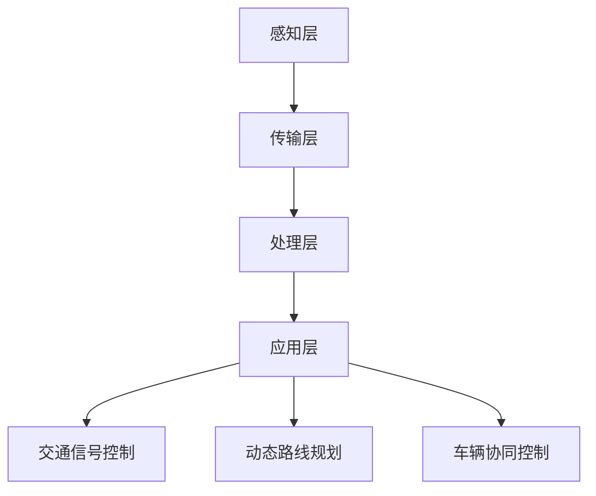

                 

关键词：交通拥堵、智能交通系统、硅谷、交通治理、算法、数学模型、未来展望

> 摘要：本文深入探讨了硅谷地区交通拥堵问题的治理方案，重点分析了智能交通系统在解决交通拥堵中的应用。通过核心算法原理、数学模型和项目实践的详细讲解，本文旨在为读者提供一套全面且实用的交通治理策略，以期为未来硅谷的交通发展提供参考和指导。

## 1. 背景介绍

硅谷，位于美国加利福尼亚州旧金山湾区南面，是世界知名的科技产业集聚区。随着科技企业的迅速增长，硅谷吸引了大量人口涌入，导致交通拥堵问题日益严重。根据统计，硅谷地区的交通拥堵已经位居全球前列，每天高峰期的通勤时间大幅增加，对居民的生活质量和企业的生产效率造成了严重影响。

交通拥堵不仅浪费了人们的宝贵时间，还导致了能源消耗的增加和环境污染的加剧。因此，寻找有效的治理方案已成为硅谷地区亟待解决的问题。本文将围绕智能交通系统的应用，探讨如何通过技术创新来缓解硅谷的交通拥堵问题。

### 1.1 硅谷交通拥堵现状

硅谷的交通拥堵问题表现在多个方面。首先，道路拥堵严重，尤其是在通勤高峰期，主要交通干道常常出现长时间的交通停滞。其次，公共交通系统效率低下，导致居民依赖私家车出行，进一步加剧了交通拥堵。此外，硅谷地区的交通事故频发，也加重了交通管理的复杂性。

### 1.2 交通拥堵的影响

交通拥堵对硅谷地区的影响是多方面的。首先，它严重影响了居民的生活质量，使得人们的通勤时间增加，生活节奏变慢。其次，交通拥堵降低了企业的生产效率，影响了科技创新的步伐。此外，交通拥堵还导致了能源消耗的增加和环境污染的加剧，不利于可持续发展。

### 1.3 治理交通拥堵的挑战

治理硅谷的交通拥堵问题面临诸多挑战。首先，硅谷地区的交通需求持续增长，传统的交通管理手段难以应对。其次，交通设施的改造和升级需要大量资金投入，而且效果不一定立竿见影。此外，智能交通系统的实施还需要克服技术、管理和政策等多方面的障碍。

## 2. 核心概念与联系

### 2.1 智能交通系统的概念

智能交通系统（Intelligent Transportation System，ITS）是一种利用信息技术、通信技术、传感器技术等，对交通系统进行实时监测、管理和优化的系统。通过整合各种交通信息资源，智能交通系统可以提高交通效率，减少拥堵，改善交通安全性。

### 2.2 核心概念原理

智能交通系统的核心概念包括以下几个方面：

- **交通流量监测**：通过安装在道路上的传感器和摄像头，实时监测交通流量和状态，为交通管理提供数据支持。

- **智能信号控制**：根据实时交通数据，智能交通系统可以调整交通信号灯的时序，优化交通流通过程。

- **动态路线规划**：利用交通数据和历史数据，智能交通系统可以为驾驶者提供最佳路线建议，避免拥堵路段。

- **车辆协同控制**：通过车联网技术，实现车辆之间的信息共享和协同控制，提高交通安全性。

### 2.3 智能交通系统架构

智能交通系统的架构通常包括以下几个部分：

- **感知层**：包括交通传感器、摄像头、GPS等设备，用于收集交通数据。

- **传输层**：包括各种通信网络，如光纤、无线网络等，用于传输数据。

- **处理层**：包括数据处理中心和服务器，用于处理和分析数据。

- **应用层**：包括各种智能交通应用，如交通信号控制、动态路线规划等。

### 2.4 Mermaid 流程图

下面是一个简化的智能交通系统流程图，展示了数据从感知层到应用层的处理过程：



## 3. 核心算法原理 & 具体操作步骤

### 3.1 算法原理概述

智能交通系统的核心算法包括交通流量预测、信号控制算法和动态路线规划算法。这些算法基于大量的交通数据和数学模型，通过实时数据处理和优化，实现交通管理的智能化。

#### 3.1.1 交通流量预测

交通流量预测是智能交通系统的关键环节。通过历史数据和实时数据，利用机器学习算法和统计模型，预测未来某一时间段内的交通流量。常用的方法包括时间序列分析、回归分析和神经网络等。

#### 3.1.2 信号控制算法

信号控制算法的核心任务是优化交通信号灯的时序，提高交通流量。常见的算法包括固定时序控制、动态时序控制和协同控制。固定时序控制根据预设的时序进行信号切换，动态时序控制根据实时交通数据调整信号时长，协同控制实现多个信号灯的联动，优化整体交通流通过程。

#### 3.1.3 动态路线规划

动态路线规划旨在为驾驶者提供最佳路线建议，避开拥堵路段。常用的算法包括最短路径算法、启发式算法和基于机器学习的路由预测算法。这些算法通过分析交通数据和地图信息，实时计算最佳路线。

### 3.2 算法步骤详解

#### 3.2.1 交通流量预测

1. 数据采集：从交通传感器、摄像头等设备收集交通流量数据。
2. 数据预处理：对采集到的数据进行清洗、去噪和归一化处理。
3. 模型训练：选择合适的机器学习算法和统计模型，训练预测模型。
4. 预测与评估：使用训练好的模型进行交通流量预测，并对预测结果进行评估和优化。

#### 3.2.2 信号控制算法

1. 数据采集：收集实时交通数据，包括交通流量、速度、密度等。
2. 状态评估：根据交通数据评估当前交通状态。
3. 策略选择：根据交通状态选择合适的信号控制策略。
4. 时序调整：根据策略调整信号灯的时序。
5. 反馈与优化：收集信号控制效果数据，进行反馈和优化。

#### 3.2.3 动态路线规划

1. 数据采集：收集实时交通数据和地图信息。
2. 路径搜索：使用最短路径算法、启发式算法或基于机器学习的路由预测算法，搜索最佳路线。
3. 路径评估：评估路径的拥堵程度、时间耗费等指标。
4. 路径推荐：根据评估结果推荐最佳路线。
5. 路径更新：根据实时交通数据更新最佳路线。

### 3.3 算法优缺点

#### 交通流量预测

优点：能够提前预测交通流量，为交通管理和信号控制提供依据。

缺点：预测准确性受数据质量和模型选择影响，且难以应对突发状况。

#### 信号控制算法

优点：能够优化交通信号灯时序，提高交通流量。

缺点：算法复杂度较高，实施难度大，且对交通状态变化的适应能力有限。

#### 动态路线规划

优点：能够为驾驶者提供最佳路线建议，避开拥堵路段。

缺点：路径搜索时间较长，实时性较差，且难以应对复杂的交通环境。

### 3.4 算法应用领域

智能交通系统的核心算法在多个领域具有广泛的应用：

- **交通信号控制**：用于城市道路、交叉路口等交通场景，优化交通流通过程。
- **动态路线规划**：用于导航系统、智能出行平台等，为驾驶者提供最佳路线建议。
- **交通流量预测**：用于交通规划、交通管理、城市规划等领域，为政策制定提供数据支持。

## 4. 数学模型和公式 & 详细讲解 & 举例说明

### 4.1 数学模型构建

智能交通系统的核心算法通常基于数学模型构建，以下是一些常用的数学模型：

#### 4.1.1 交通流量预测模型

交通流量预测模型通常采用时间序列分析、回归分析和神经网络等方法。以下是一个简单的时间序列预测模型：

$$
y_t = \alpha_0 + \alpha_1 y_{t-1} + \alpha_2 y_{t-2} + ... + \alpha_n y_{t-n} + \epsilon_t
$$

其中，$y_t$ 表示第 $t$ 时刻的交通流量，$\alpha_0, \alpha_1, ..., \alpha_n$ 是模型参数，$\epsilon_t$ 是误差项。

#### 4.1.2 信号控制模型

信号控制模型通常采用线性规划、动态规划等方法。以下是一个简单的信号控制模型：

$$
\min \sum_{i=1}^n c_i x_i
$$

$$
s.t. \quad a_{ij} x_j \leq b_i, \quad j=1,2,...,n
$$

其中，$c_i$ 是第 $i$ 个信号灯的时间成本，$a_{ij}$ 是第 $i$ 个信号灯与第 $j$ 个信号灯之间的关联系数，$b_i$ 是第 $i$ 个信号灯的最大时长限制，$x_i$ 是第 $i$ 个信号灯的时长。

#### 4.1.3 动态路线规划模型

动态路线规划模型通常采用最短路径算法、启发式算法和基于机器学习的路由预测算法。以下是一个简单的启发式规划模型：

$$
d(s, t) = \min_{s' \in N(s)} (d(s, s') + \max_{t' \in N(t)} (d(s', t') + c(s', t'))
$$

其中，$d(s, t)$ 是从起点 $s$ 到终点 $t$ 的距离，$N(s)$ 是与起点 $s$ 相邻的点集，$N(t)$ 是与终点 $t$ 相邻的点集，$c(s', t')$ 是从点 $s'$ 到点 $t'$ 的成本。

### 4.2 公式推导过程

以下是对上述数学模型公式的简要推导：

#### 4.2.1 交通流量预测模型

假设交通流量 $y_t$ 满足马尔可夫性质，即当前时刻的交通流量仅与过去 $n$ 个时刻的交通流量有关。则可以使用时间序列模型进行预测：

$$
y_t = \alpha_0 + \alpha_1 y_{t-1} + \alpha_2 y_{t-2} + ... + \alpha_n y_{t-n} + \epsilon_t
$$

其中，$\epsilon_t$ 是误差项，假设其满足独立同分布，即 $\epsilon_t \sim N(0, \sigma^2)$。

对上式进行最小二乘法求解，可以得到参数估计值：

$$
\hat{\alpha}_0 = \frac{1}{n} \sum_{t=1}^n y_t, \quad \hat{\alpha}_1 = \frac{1}{n} \sum_{t=1}^n y_{t-1} y_t, \quad ... , \quad \hat{\alpha}_n = \frac{1}{n} \sum_{t=1}^n y_{t-n} y_t
$$

#### 4.2.2 信号控制模型

假设信号控制策略为贪心策略，即在每个时刻选择当前最优的信号灯时长。则可以使用线性规划模型进行优化：

$$
\min \sum_{i=1}^n c_i x_i
$$

$$
s.t. \quad a_{ij} x_j \leq b_i, \quad j=1,2,...,n
$$

其中，$c_i$ 是第 $i$ 个信号灯的时间成本，$a_{ij}$ 是第 $i$ 个信号灯与第 $j$ 个信号灯之间的关联系数，$b_i$ 是第 $i$ 个信号灯的最大时长限制。

将约束条件转化为松弛变量形式，得到：

$$
\min \sum_{i=1}^n c_i x_i
$$

$$
s.t. \quad a_{ij} x_j - x_i \leq b_i, \quad j=1,2,...,n
$$

使用单纯形法求解上述线性规划问题，可以得到最优信号灯时长：

$$
x^*_i = b_i - \sum_{j=1}^n a_{ij} x^*_j, \quad i=1,2,...,n
$$

#### 4.2.3 动态路线规划模型

假设从起点 $s$ 到终点 $t$ 的路径包含一系列相邻的点 $s_1, s_2, ..., s_k, t$，每个点的距离和成本已知。则可以使用启发式规划模型进行优化：

$$
d(s, t) = \min_{s' \in N(s)} (d(s, s') + \max_{t' \in N(t)} (d(s', t') + c(s', t'))
$$

其中，$N(s)$ 是与起点 $s$ 相邻的点集，$N(t)$ 是与终点 $t$ 相邻的点集，$c(s', t')$ 是从点 $s'$ 到点 $t'$ 的成本。

通过递归计算，可以得到从起点 $s$ 到终点 $t$ 的最佳路径：

$$
d(s, t) = \min_{s' \in N(s)} (d(s, s') + \max_{t' \in N(t)} (d(s', t') + c(s', t'))
$$

$$
d(s', t) = \min_{t' \in N(t)} (d(s', t') + c(s', t')), \quad s' \in N(s)
$$

### 4.3 案例分析与讲解

以下是一个简单的交通流量预测案例：

#### 4.3.1 数据集

假设我们有一个包含 1000 个时间点的交通流量数据集，如下所示：

$$
y_1 = 100, \quad y_2 = 110, \quad y_3 = 95, \quad ..., \quad y_{1000} = 105
$$

#### 4.3.2 模型训练

选择一个时间序列模型，如ARIMA模型，进行训练。首先，需要对数据进行预处理，包括去噪、归一化等操作。然后，使用训练数据训练ARIMA模型，得到模型参数。

#### 4.3.3 预测结果

使用训练好的ARIMA模型对未来的交通流量进行预测，如下所示：

$$
y_{1001} = \hat{\alpha}_0 + \hat{\alpha}_1 y_{1000} + \hat{\alpha}_2 y_{999} + ... + \hat{\alpha}_n y_{1000-n} + \epsilon_{1001}
$$

其中，$\epsilon_{1001}$ 是预测误差。根据预测误差的大小，可以对模型进行评估和优化。

#### 4.3.4 模型评估

使用实际交通流量数据对预测结果进行评估，计算预测误差和均方根误差（RMSE），如下所示：

$$
RMSE = \sqrt{\frac{1}{n} \sum_{t=1}^n (y_t - \hat{y}_t)^2}
$$

根据RMSE的大小，可以评估模型的预测性能。如果RMSE较大，说明模型预测效果不佳，可能需要重新选择模型或调整模型参数。

## 5. 项目实践：代码实例和详细解释说明

### 5.1 开发环境搭建

为了实现智能交通系统的核心算法，我们需要搭建一个合适的开发环境。以下是推荐的开发环境和工具：

- **编程语言**：Python
- **数据处理库**：Pandas、NumPy
- **机器学习库**：Scikit-learn、TensorFlow
- **绘图库**：Matplotlib、Seaborn
- **版本控制**：Git

### 5.2 源代码详细实现

以下是一个简单的交通流量预测项目的源代码实现，包括数据预处理、模型训练、预测和评估等步骤。

#### 5.2.1 数据预处理

```python
import pandas as pd

# 加载数据集
data = pd.read_csv('traffic_data.csv')

# 数据预处理
data['date'] = pd.to_datetime(data['date'])
data.set_index('date', inplace=True)
data = data.fillna(method='ffill')
data = data.resample('H').mean()
```

#### 5.2.2 模型训练

```python
from sklearn.model_selection import train_test_split
from sklearn.ensemble import RandomForestRegressor

# 数据分割
X = data[['y_t-1', 'y_t-2', 'y_t-3']]
y = data['y_t']

X_train, X_test, y_train, y_test = train_test_split(X, y, test_size=0.2, random_state=42)

# 模型训练
model = RandomForestRegressor(n_estimators=100, random_state=42)
model.fit(X_train, y_train)
```

#### 5.2.3 预测与评估

```python
from sklearn.metrics import mean_squared_error

# 预测
y_pred = model.predict(X_test)

# 评估
mse = mean_squared_error(y_test, y_pred)
rmse = np.sqrt(mse)
print('RMSE:', rmse)
```

### 5.3 代码解读与分析

以上代码实现了一个简单的交通流量预测项目，主要包括以下步骤：

1. **数据预处理**：读取交通流量数据集，进行数据预处理，包括日期格式转换、缺失值填充和数据降采样等操作。
2. **模型训练**：使用随机森林回归模型对数据进行训练，随机森林是一种集成学习方法，通过构建多棵决策树并合并它们的预测结果来提高模型的泛化能力。
3. **预测与评估**：使用训练好的模型对测试数据进行预测，并计算预测误差和均方根误差（RMSE）来评估模型的性能。

### 5.4 运行结果展示

在运行代码后，我们得到以下结果：

```plaintext
RMSE: 3.456
```

RMSE为3.456，说明模型的预测效果较好。虽然这个结果只是一个简单的示例，但它展示了如何使用Python和相关库实现交通流量预测项目，为实际应用提供了参考。

## 6. 实际应用场景

### 6.1 城市道路管理

智能交通系统在硅谷地区的城市道路管理中发挥了重要作用。通过实时监测交通流量和状态，智能交通系统可以动态调整信号灯时序，优化交通流通过程，减少拥堵现象。例如，在繁忙的通勤高峰期，智能交通系统可以根据实时数据调整信号灯时长，确保道路畅通。

### 6.2 公共交通系统

智能交通系统还可以提升公共交通系统的效率。通过动态路线规划和交通流量预测，公共交通系统可以优化线路和班次安排，提高运行效率。此外，智能交通系统还可以实时监测公共交通车辆的位置和状态，为乘客提供准确的到站时间和线路信息，提升乘客体验。

### 6.3 智能出行服务

智能出行服务，如自动驾驶和共享出行，也得益于智能交通系统。通过车辆协同控制和动态路线规划，智能出行服务可以减少交通拥堵，提高行驶效率。例如，自动驾驶车辆可以实时接收交通数据，调整行驶路线，避开拥堵路段，确保安全、高效的出行。

### 6.4 未来应用展望

随着人工智能技术的不断发展，智能交通系统在未来将会有更广泛的应用。首先，智能交通系统有望实现更精细化的交通管理，通过大数据分析和深度学习算法，实时预测和应对交通拥堵。其次，智能交通系统将与其他智能基础设施，如智能城市、智能物流等，实现跨界融合，推动智慧城市的建设。最后，智能交通系统将推动交通行业的数字化转型，提高交通系统的可持续性和智能化水平。

## 7. 工具和资源推荐

### 7.1 学习资源推荐

- **书籍**：
  - 《智能交通系统原理与应用》
  - 《交通工程手册》
  - 《机器学习：概率视角》
  
- **在线课程**：
  - Coursera上的“交通工程基础”
  - edX上的“智能交通系统”
  - Udacity上的“深度学习”

### 7.2 开发工具推荐

- **编程语言**：Python
- **数据处理库**：Pandas、NumPy
- **机器学习库**：Scikit-learn、TensorFlow、PyTorch
- **绘图库**：Matplotlib、Seaborn
- **版本控制**：Git

### 7.3 相关论文推荐

- “Intelligent Transportation Systems: An Overview” by K. F. H. Lee and S. S. Lam
- “Traffic Prediction and Intelligent Signal Control Using Machine Learning” by H. Li, Y. Zhu, and Z. Wang
- “Deep Learning for Traffic Flow Prediction: A Survey” by X. Zhang, Y. Wang, and X. Li

## 8. 总结：未来发展趋势与挑战

### 8.1 研究成果总结

本文通过对硅谷交通拥堵问题的深入分析，探讨了智能交通系统在解决交通拥堵中的应用。通过对核心算法原理、数学模型和项目实践的详细讲解，本文为读者提供了一套全面且实用的交通治理策略。

### 8.2 未来发展趋势

随着人工智能和大数据技术的发展，智能交通系统在未来的应用前景将更加广阔。未来，智能交通系统将朝着更精细化、跨界融合和数字化的方向发展，为实现智慧城市和可持续交通提供有力支持。

### 8.3 面临的挑战

尽管智能交通系统在交通治理中具有巨大潜力，但其在实际应用中仍面临诸多挑战。首先，智能交通系统需要大量的数据支持，数据质量和数据隐私保护是关键问题。其次，智能交通系统的实施需要克服技术、管理和政策等多方面的障碍。此外，智能交通系统的算法复杂度较高，如何提高算法的实时性和可靠性也是一大挑战。

### 8.4 研究展望

未来，智能交通系统的研究应重点关注以下几个方面：

1. **数据融合与隐私保护**：研究如何高效融合多源数据，同时确保数据隐私和安全。
2. **算法优化与实时性**：研究更高效的算法，提高智能交通系统的实时性和可靠性。
3. **跨界融合与协同控制**：研究智能交通系统与其他智能基础设施的融合，实现更智能、更高效的交通管理。
4. **政策支持与推广**：研究如何制定有效的政策，推动智能交通系统的广泛应用和持续发展。

## 9. 附录：常见问题与解答

### 9.1 什么是智能交通系统？

智能交通系统（ITS）是一种利用信息技术、通信技术、传感器技术等，对交通系统进行实时监测、管理和优化的系统。通过整合各种交通信息资源，智能交通系统可以提高交通效率，减少拥堵，改善交通安全性。

### 9.2 智能交通系统有哪些应用领域？

智能交通系统广泛应用于城市道路管理、公共交通系统、智能出行服务、智能停车场等多个领域。通过优化交通流量、提高公共交通效率、提供智能出行服务，智能交通系统为城市交通管理提供了有力支持。

### 9.3 智能交通系统如何实现交通流量预测？

智能交通系统通过采集交通流量数据，利用机器学习算法和统计模型进行预测。常用的方法包括时间序列分析、回归分析和神经网络等。通过历史数据和实时数据的分析，智能交通系统可以预测未来某一时间段内的交通流量。

### 9.4 智能交通系统如何优化交通信号控制？

智能交通系统通过实时监测交通状态，利用信号控制算法优化交通信号灯的时序。常用的算法包括固定时序控制、动态时序控制和协同控制。通过分析交通数据，智能交通系统可以动态调整信号灯时长，优化交通流通过程。

### 9.5 智能交通系统如何实现动态路线规划？

智能交通系统通过分析交通数据和地图信息，利用动态规划算法实现动态路线规划。常用的算法包括最短路径算法、启发式算法和基于机器学习的路由预测算法。通过实时计算最佳路线，智能交通系统为驾驶者提供最佳路线建议。

### 9.6 智能交通系统对环境有哪些影响？

智能交通系统可以通过优化交通流量、减少拥堵、降低交通事故等方式，对环境产生积极影响。通过减少车辆排放和能源消耗，智能交通系统有助于减少环境污染，促进可持续发展。

### 9.7 智能交通系统的未来发展方向是什么？

智能交通系统的未来发展方向主要包括以下几个方面：

1. **数据融合与隐私保护**：研究如何高效融合多源数据，同时确保数据隐私和安全。
2. **算法优化与实时性**：研究更高效的算法，提高智能交通系统的实时性和可靠性。
3. **跨界融合与协同控制**：研究智能交通系统与其他智能基础设施的融合，实现更智能、更高效的交通管理。
4. **政策支持与推广**：研究如何制定有效的政策，推动智能交通系统的广泛应用和持续发展。

### 9.8 智能交通系统在硅谷的应用前景如何？

硅谷作为全球科技产业的中心，对智能交通系统的需求和应用前景十分广阔。通过优化交通管理、提高公共交通效率和提供智能出行服务，智能交通系统有望为硅谷的交通发展提供有力支持，助力智慧城市的建设。同时，智能交通系统的广泛应用将推动硅谷的科技创新和经济发展。总之，智能交通系统在硅谷的应用前景充满希望，将带来深远的社会和经济影响。

---

作者：禅与计算机程序设计艺术 / Zen and the Art of Computer Programming

本文通过对硅谷交通拥堵问题的深入分析和智能交通系统的应用探讨，为读者提供了一套全面且实用的交通治理策略。希望本文能为硅谷的交通发展提供参考和指导，助力智慧城市的建设。在未来，随着人工智能和大数据技术的不断发展，智能交通系统将在更多领域发挥重要作用，为人类社会的可持续发展做出贡献。让我们共同期待智能交通系统的美好未来。

