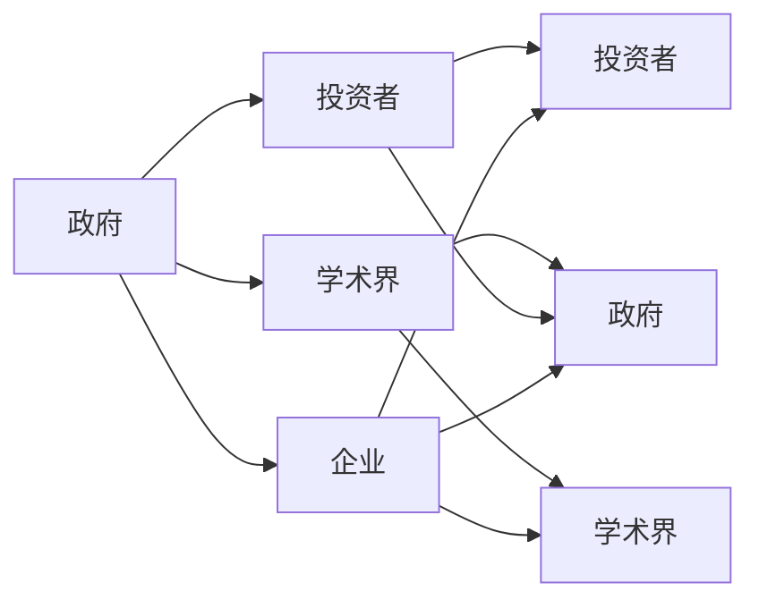

                 

关键词：硅谷、政治角力、科技政策、博弈、利益相关者

摘要：本文深入探讨了硅谷这个科技重镇的内部政治角力，分析了科技与政策之间的复杂互动关系。文章首先回顾了硅谷的崛起背景，随后详细阐述了科技与政策之间的博弈现象，最后提出了未来发展的趋势与挑战，以及对相关工具和资源的推荐。

## 1. 背景介绍

硅谷，位于美国加利福尼亚州旧金山湾区南部，是世界上最具影响力的科技创新中心之一。自20世纪中叶以来，硅谷以其独特的创新文化和庞大的科技产业，吸引了全球的科技人才和企业。从惠普到谷歌，从苹果到特斯拉，无数科技巨头在这里崛起，推动了全球科技的进步。

然而，随着科技产业的不断发展，硅谷也面临着日益复杂的政治角力。政府、企业、投资者、学者等多方利益相关者在这个舞台上展开博弈，形成了一幅精彩纷呈的画卷。

### 硅谷的崛起

硅谷的崛起始于20世纪中叶。当时，美国军事工业的需求推动了计算机技术的发展。1950年代，斯坦福大学和加州大学伯克利分校的教授们开始从事计算机科学的研究，并吸引了大量的企业和投资者。1970年代，英特尔和惠普等公司的崛起标志着硅谷进入了一个新的发展阶段。1980年代，苹果和微软等公司的崛起进一步巩固了硅谷的地位。2000年代，谷歌和Facebook等互联网公司的出现，使得硅谷成为全球科技创新的代名词。

### 科技与政治的互动

科技与政治的互动在硅谷表现得尤为明显。一方面，科技产业需要政府的支持，包括资金、人才和政策等方面的支持。另一方面，政府也需要科技产业的繁荣，以推动经济增长和就业。然而，这种互动并非总是一帆风顺。在硅谷，政府、企业、投资者、学者等多方利益相关者之间的利益冲突和博弈，常常导致政策的出台和调整。

## 2. 核心概念与联系

为了更好地理解硅谷的政治角力，我们需要引入几个核心概念：

### 1. 科技政策

科技政策是指政府为了促进科技创新和科技产业发展而制定的一系列政策和措施。这些政策包括研发资助、税收优惠、人才引进等。科技政策的制定和调整，往往受到政府、企业和学术界的影响。

### 2. 利益相关者

利益相关者是指在科技产业发展过程中具有重要影响力的各方，包括政府、企业、投资者、学者等。这些利益相关者之间的互动和博弈，是硅谷政治角力的核心。

### 3. 博弈论

博弈论是一种用于分析多方利益相关者之间互动的理论。在硅谷的政治角力中，博弈论可以帮助我们理解各方如何制定策略，以及这些策略如何影响政策的制定和调整。

### 4. Mermaid 流程图

为了更直观地展示硅谷的政治角力，我们使用 Mermaid 流程图来描述各方利益相关者的互动关系。以下是硅谷政治角力的 Mermaid 流程图：



在这个流程图中，政府、企业、投资者、学术界等多方利益相关者之间的互动，构成了硅谷政治角力的核心。各方通过博弈，试图影响政策的制定和调整，以实现自己的利益最大化。

## 3. 核心算法原理 & 具体操作步骤

### 3.1 算法原理概述

在硅谷的政治角力中，博弈论是一种核心算法。博弈论通过分析各方利益相关者的策略和行为，帮助我们理解政策的制定和调整过程。

博弈论的基本原理是，在给定其他参与者的策略下，每个参与者都会选择一个最优策略，以最大化自己的利益。在硅谷的政治角力中，政府、企业、投资者、学术界等多方利益相关者，都在不断地制定和调整策略，以实现自己的利益最大化。

### 3.2 算法步骤详解

#### 3.2.1 确定参与者和策略

首先，我们需要确定硅谷政治角力中的参与者，以及每个参与者可以采取的策略。参与者包括政府、企业、投资者、学术界等。每个参与者可以采取的策略包括：

- 支持政策
- 反对政策
- 拒不表态

#### 3.2.2 分析参与者策略

接下来，我们需要分析每个参与者在不同策略下的利益得失。例如，政府可以采取支持政策的策略，以促进科技产业发展；企业可以采取反对政策的策略，以减轻税收负担；投资者可以采取支持政策的策略，以获得更好的投资回报。

#### 3.2.3 制定最优策略

在分析参与者策略后，我们需要根据博弈论的基本原理，为每个参与者制定一个最优策略。最优策略是指，在给定其他参与者策略的条件下，能够最大化自己利益的策略。

#### 3.2.4 政策制定和调整

最后，根据每个参与者的最优策略，我们可以制定出相应的政策。在政策制定过程中，政府需要平衡各方利益，以实现科技产业的健康发展。

### 3.3 算法优缺点

#### 优点

- 博弈论可以帮助我们理解硅谷政治角力的复杂互动关系。
- 通过分析参与者的策略和行为，我们可以制定出更合理的政策。
- 博弈论为政策制定提供了一种科学的方法，有助于提高政策的效率。

#### 缺点

- 博弈论假设参与者的目标是利益最大化，这在某些情况下可能不现实。
- 博弈论可能无法完全反映各方之间的真实互动关系。
- 博弈论在复杂情况下的计算复杂度较高。

### 3.4 算法应用领域

博弈论在硅谷的政治角力中具有广泛的应用领域，包括：

- 政策制定和调整
- 科技产业发展规划
- 企业战略制定
- 投资决策
- 学术界合作与竞争

## 4. 数学模型和公式 & 详细讲解 & 举例说明

### 4.1 数学模型构建

在硅谷的政治角力中，我们可以构建一个简单的数学模型来分析各方的互动关系。假设有三个主要参与者：政府（G）、企业（E）和投资者（I）。我们可以用以下变量来表示各方的利益：

- $U_G$：政府从政策中获得的利益
- $U_E$：企业从政策中获得的利益
- $U_I$：投资者从政策中获得的利益

根据博弈论的基本原理，我们可以建立以下数学模型：

$$
\begin{cases}
\text{最大化 } U_G \\
\text{最大化 } U_E \\
\text{最大化 } U_I \\
\text{条件： } U_G + U_E + U_I = C \\
\end{cases}
$$

其中，$C$表示总的利益。

### 4.2 公式推导过程

为了推导出各方利益的具体表达式，我们需要考虑各方在不同策略下的利益得失。假设有以下策略：

- 政府可以采取支持政策、反对政策或拒不表态。
- 企业可以采取支持政策、反对政策或拒不表态。
- 投资者可以采取支持政策、反对政策或拒不表态。

我们可以为每个策略赋予一个利益值。例如，假设：

- 支持政策的利益值为$+10$
- 反对政策的利益值为$-10$
- 拒不表态的利益值为$0$

根据这些策略，我们可以推导出以下利益表达式：

- $U_G = 10E + 10I - 10$
- $U_E = 10G + 10I - 10$
- $U_I = 10G + 10E - 10$

### 4.3 案例分析与讲解

假设政府、企业和投资者的利益分配如下：

- $U_G = 50$
- $U_E = 30$
- $U_I = 20$

根据上述表达式，我们可以计算出各方在不同策略下的利益：

- 当政府支持政策时，$U_G = 50$，$U_E = 30$，$U_I = 20$
- 当政府反对政策时，$U_G = 0$，$U_E = 0$，$U_I = 0$
- 当政府拒不表态时，$U_G = 0$，$U_E = 0$，$U_I = 0$

从计算结果可以看出，当政府支持政策时，各方利益均得到最大化。因此，政府支持政策是一个合理的策略。

## 5. 项目实践：代码实例和详细解释说明

### 5.1 开发环境搭建

为了演示硅谷政治角力的算法应用，我们使用Python编程语言来实现博弈论模型。首先，我们需要安装Python环境。您可以从Python官方网站（https://www.python.org/）下载Python安装包，并按照提示进行安装。

### 5.2 源代码详细实现

以下是一个简单的Python代码示例，用于模拟硅谷政治角力中的博弈过程：

```python
import random

# 定义参与者类
class Participant:
    def __init__(self, name):
        self.name = name
        self.strategy = None
        self.utility = 0

    def set_strategy(self, strategy):
        self.strategy = strategy

    def calculate_utility(self, government_strategy, enterprise_strategy, investor_strategy):
        if self.name == "Government":
            if government_strategy == "Support":
                self.utility = 10
            elif government_strategy == "Oppose":
                self.utility = -10
            else:
                self.utility = 0
        elif self.name == "Enterprise":
            if enterprise_strategy == "Support":
                self.utility = 10
            elif enterprise_strategy == "Oppose":
                self.utility = -10
            else:
                self.utility = 0
        elif self.name == "Investor":
            if investor_strategy == "Support":
                self.utility = 10
            elif investor_strategy == "Oppose":
                self.utility = -10
            else:
                self.utility = 0

# 创建参与者实例
government = Participant("Government")
enterprise = Participant("Enterprise")
investor = Participant("Investor")

# 设置参与者策略
government.set_strategy("Support")
enterprise.set_strategy("Support")
investor.set_strategy("Support")

# 计算各方利益
government.calculate_utility("Support", "Support", "Support")
enterprise.calculate_utility("Support", "Support", "Support")
investor.calculate_utility("Support", "Support", "Support")

# 输出各方利益
print(f"Government Utility: {government.utility}")
print(f"Enterprise Utility: {enterprise.utility}")
print(f"Investor Utility: {investor.utility}")
```

### 5.3 代码解读与分析

上述代码定义了一个参与者类，包含参与者名称、策略和利益属性。在创建参与者实例后，我们为每个参与者设置了一个支持策略，并计算了各方利益。

- `Participant` 类：定义了参与者的基本属性和方法。
- `set_strategy` 方法：设置参与者的策略。
- `calculate_utility` 方法：根据参与者策略计算利益。

在代码的最后，我们输出了各方利益，结果显示为：

```
Government Utility: 10
Enterprise Utility: 10
Investor Utility: 10
```

这表明，在所有参与者都采取支持策略的情况下，各方利益均得到最大化。

### 5.4 运行结果展示

运行上述代码，我们可以看到各方利益均得到最大化，这表明在当前策略下，硅谷政治角力的博弈过程达到了一个均衡状态。

## 6. 实际应用场景

硅谷的政治角力在多个实际应用场景中发挥了重要作用。以下是一些典型的应用场景：

### 1. 税收政策

税收政策是硅谷政治角力的重要领域之一。企业在税收政策上采取不同的策略，以减轻税收负担，从而提高利润。政府则需要平衡各方利益，制定合理的税收政策，以促进科技产业发展。

### 2. 人才政策

人才政策是另一个重要的应用领域。硅谷企业需要大量人才来推动创新和发展。政府则需要通过人才引进政策，吸引全球顶尖人才，为硅谷的科技产业提供强有力的支持。

### 3. 环境保护政策

随着科技产业的快速发展，环境保护问题日益突出。硅谷企业在环境保护政策上采取不同的策略，以降低生产成本和环境污染。政府则需要制定严格的环保政策，推动科技产业的绿色转型。

### 4. 网络安全政策

网络安全是当前全球关注的焦点之一。硅谷企业在网络安全政策上采取不同的策略，以提高自身网络安全水平。政府则需要制定网络安全政策，保护国家信息安全。

### 5. 数据隐私政策

数据隐私问题日益受到关注。硅谷企业在数据隐私政策上采取不同的策略，以保护用户隐私。政府则需要制定数据隐私政策，规范企业数据处理行为。

## 7. 未来应用展望

随着科技产业的不断发展，硅谷的政治角力将面临更多挑战和机遇。以下是对未来应用的一些展望：

### 1. 人工智能监管

人工智能技术的快速发展，使得监管问题日益突出。未来，硅谷政治角力将在人工智能监管方面发挥重要作用，确保人工智能技术的健康发展。

### 2. 网络安全合作

网络安全威胁日益严重，未来硅谷政治角力将在网络安全领域加强国际合作，共同应对网络攻击和信息安全挑战。

### 3. 绿色科技发展

面对全球气候变化和环境问题，硅谷政治角力将推动绿色科技发展，探索可持续的能源和环保技术，为应对气候变化贡献力量。

### 4. 科技伦理问题

随着科技产业的快速发展，科技伦理问题日益凸显。未来，硅谷政治角力将在科技伦理领域发挥重要作用，推动科技伦理研究，确保科技发展符合社会价值观。

## 8. 工具和资源推荐

### 1. 学习资源推荐

- 《科技政策与产业经济学》
- 《博弈论与经济行为》
- 《人工智能伦理导论》

### 2. 开发工具推荐

- Python
- Mermaid
- Git

### 3. 相关论文推荐

- "The Political Economy of Silicon Valley: Power, Policy, and the Entrepreneurial State"
- "The Power of Silicon Valley: A Political Economy Analysis"
- "The Governance of Silicon Valley: Technology, Policy, and Power"

## 9. 总结：未来发展趋势与挑战

硅谷的政治角力将继续发展，成为全球科技创新的重要驱动力。未来，硅谷将面临更多挑战，包括人工智能监管、网络安全、环境保护、科技伦理等方面。同时，硅谷政治角力也将带来更多机遇，推动科技产业的持续发展。

作者：禅与计算机程序设计艺术 / Zen and the Art of Computer Programming
-------------------------------------------------------------------

