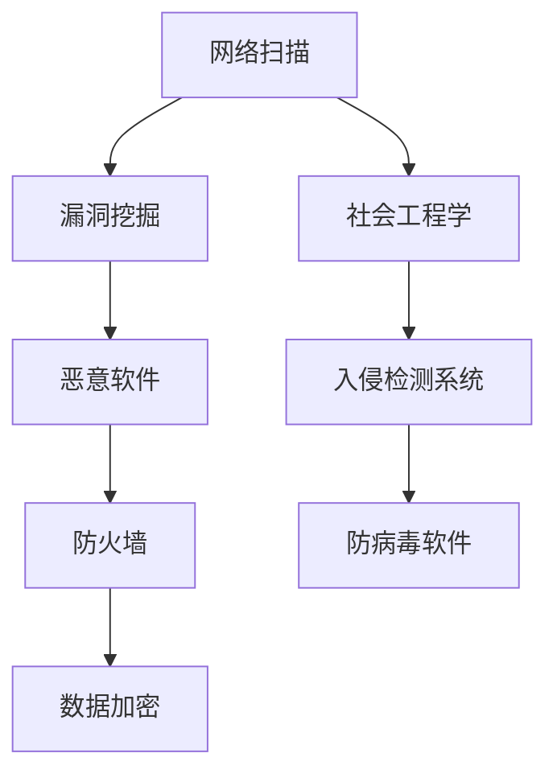

                 

关键词：硅谷网络安全、黑客攻防、数据保护、网络安全策略、漏洞挖掘、防御机制、安全审计、区块链安全

> 摘要：本文深入探讨了硅谷网络安全领域的关键技术和策略，包括黑客攻防技术、数据保护方法、安全审计流程以及区块链在网络安全中的应用。通过详细的案例分析和技术讲解，本文旨在为网络安全从业人员和研究人员提供有价值的参考和指导，帮助他们在日益复杂的网络安全环境中保护关键信息资产。

## 1. 背景介绍

硅谷作为全球科技创新的中心，聚集了众多世界顶尖科技公司和创新企业。随着云计算、大数据、物联网和人工智能等新兴技术的快速发展，网络安全问题日益突出。硅谷的网络安全挑战不仅体现在技术层面上，还涉及政策、法规、伦理等多个维度。黑客攻击、数据泄露、网络欺诈等安全事件频繁发生，给企业带来了巨大的经济损失和声誉损害。

本文将重点探讨以下核心内容：

- 黑客攻防技术：介绍常见的黑客攻击手段、防御机制以及应对策略。
- 数据保护方法：分析数据加密、访问控制等数据保护技术，并探讨其在硅谷的实践。
- 安全审计流程：阐述安全审计的目的、方法和关键环节，提供案例参考。
- 区块链在网络安全中的应用：探讨区块链技术如何提升网络安全性能，减少欺诈风险。

## 2. 核心概念与联系

### 2.1 黑客攻击类型

#### 网络扫描
网络扫描是黑客攻击的第一步，通过扫描目标网络的开放端口和服务，寻找潜在的安全漏洞。常见的扫描工具包括Nmap、Masscan等。

#### 漏洞挖掘
漏洞挖掘是发现目标系统或应用程序中的安全漏洞的过程。黑客利用漏洞进行进一步攻击，如SQL注入、跨站脚本攻击等。常见工具包括Burp Suite、Metasploit等。

#### 社会工程学
社会工程学是通过欺骗手段获取敏感信息的技术。黑客可能通过电话、邮件、钓鱼网站等手段，诱骗用户泄露密码或执行恶意操作。

#### 恶意软件
恶意软件包括病毒、木马、勒索软件等，可以破坏系统、窃取数据或控制计算机。常见的传播途径包括电子邮件附件、下载网站等。

### 2.2 网络防御机制

#### 防火墙
防火墙是网络安全的第一道防线，通过过滤网络流量，阻止未经授权的访问。常见的防火墙包括硬件防火墙、软件防火墙等。

#### 入侵检测系统（IDS）
入侵检测系统用于监测网络流量和系统日志，检测异常行为和潜在攻击。IDS可以分为网络入侵检测系统（NIDS）和主机入侵检测系统（HIDS）。

#### 防病毒软件
防病毒软件用于检测和清除恶意软件，保护计算机和网络安全。常见的防病毒软件包括Norton、McAfee等。

#### 数据加密
数据加密是一种重要的数据保护技术，通过将数据转换为无法读取的密文，确保数据在传输和存储过程中的安全。常见的加密算法包括AES、RSA等。

### 2.3 Mermaid 流程图



## 3. 核心算法原理 & 具体操作步骤

### 3.1 算法原理概述

网络安全的算法原理主要包括：

- **密码学**：通过加密和解密技术保护数据的安全性和隐私性。
- **协议设计**：设计安全协议以防止窃听、篡改和伪造等攻击。
- **访问控制**：通过权限控制确保只有授权用户可以访问特定资源。
- **审计与监控**：通过审计和监控机制发现安全事件和潜在威胁。

### 3.2 算法步骤详解

#### 3.2.1 密码学

1. **密钥生成**：随机生成密钥对（公钥和私钥）。
2. **加密**：使用公钥加密明文数据。
3. **解密**：使用私钥解密密文数据。

#### 3.2.2 协议设计

1. **通信加密**：使用TLS/SSL等加密协议确保通信过程中的数据安全。
2. **身份验证**：通过数字签名、证书等技术验证通信双方的身份。
3. **完整性验证**：使用哈希函数验证数据的完整性，防止篡改。

#### 3.2.3 访问控制

1. **角色与权限定义**：定义用户角色和权限，确保用户只能访问其授权的资源。
2. **访问控制策略**：实现访问控制策略，如基于角色的访问控制（RBAC）和基于属性的访问控制（ABAC）。
3. **审计与监控**：记录用户访问行为，监控潜在的安全威胁。

### 3.3 算法优缺点

#### 密码学

- 优点：提供强大的数据保护，确保数据隐私和安全。
- 缺点：计算开销较大，可能影响系统性能。

#### 协议设计

- 优点：确保通信过程中的数据完整性和身份验证。
- 缺点：设计复杂，需要不断更新和优化。

#### 访问控制

- 优点：有效控制用户访问权限，降低安全风险。
- 缺点：实施和维护成本较高，可能影响用户体验。

### 3.4 算法应用领域

- **金融领域**：确保电子交易和数据传输的安全性。
- **医疗领域**：保护患者隐私和医疗信息。
- **政府和企业**：加强内部网络安全和外部数据保护。

## 4. 数学模型和公式 & 详细讲解 & 举例说明

### 4.1 数学模型构建

#### 4.1.1 加密算法模型

加密算法模型主要包括以下组成部分：

- **密钥生成算法**：随机生成密钥对。
- **加密算法**：将明文转换为密文。
- **解密算法**：将密文转换为明文。

#### 4.1.2 协议设计模型

协议设计模型主要包括以下组成部分：

- **加密协议**：确保通信过程中的数据安全。
- **身份验证协议**：验证通信双方的身份。
- **完整性验证协议**：确保数据完整性。

### 4.2 公式推导过程

#### 4.2.1 加密算法公式

$$
E_K(M) = C = D_K^{-1}(E_K(M))
$$

其中，$E_K(M)$ 表示加密算法，$D_K^{-1}$ 表示解密算法，$M$ 表示明文，$C$ 表示密文。

#### 4.2.2 协议设计公式

$$
\begin{aligned}
    &\text{加密协议：} \\
    &C_1 = K \\
    &C_2 = E_{K_2}(M) \\
    &C_3 = E_{K_3}(C_1, C_2)
\end{aligned}
$$

其中，$K_1$，$K_2$，$K_3$ 分别为加密协议中的三个密钥。

### 4.3 案例分析与讲解

#### 4.3.1 数据加密案例

假设用户A想要将明文数据“Hello, World!”发送给用户B，使用AES加密算法进行加密。

1. **密钥生成**：用户A和用户B各自随机生成一个密钥对（公钥和私钥）。
2. **加密**：用户A使用用户B的公钥将明文数据“Hello, World!”加密为密文。
3. **解密**：用户B使用自己的私钥将密文解密回明文数据。

#### 4.3.2 协议设计案例

假设用户A和用户B进行安全通信，使用TLS协议进行加密。

1. **加密协议**：用户A发送一个加密的消息给用户B，确保数据在传输过程中的安全。
2. **身份验证协议**：用户B通过数字证书验证用户A的身份，确保通信双方的合法性。
3. **完整性验证协议**：用户B使用哈希函数验证消息的完整性，确保数据在传输过程中未被篡改。

## 5. 项目实践：代码实例和详细解释说明

### 5.1 开发环境搭建

为了演示数据加密和协议设计的相关算法，我们需要搭建一个简单的开发环境。以下是具体的步骤：

1. **安装Python环境**：确保系统中安装了Python 3.x版本。
2. **安装加密库**：使用pip命令安装PyCryptodome库，用于实现加密算法。
3. **安装TLS库**：使用pip命令安装PyOpenSSL库，用于实现TLS协议。

```shell
pip install pycryptodome
pip install pyopenssl
```

### 5.2 源代码详细实现

以下是一个简单的Python代码示例，演示了数据加密和解密的过程。

```python
from Cryptodome.PublicKey import RSA
from Cryptodome.Cipher import PKCS1_OAEP

# 密钥生成
key = RSA.generate(2048)
private_key = key.export_key()
public_key = key.publickey().export_key()

# 加密
def encrypt(message, public_key):
    cipher = PKCS1_OAEP.new(RSA.import_key(public_key))
    encrypted_message = cipher.encrypt(message)
    return encrypted_message

# 解密
def decrypt(encrypted_message, private_key):
    cipher = PKCS1_OAEP.new(RSA.import_key(private_key))
    decrypted_message = cipher.decrypt(encrypted_message)
    return decrypted_message

# 测试
message = "Hello, World!"
encrypted_message = encrypt(message.encode(), public_key)
decrypted_message = decrypt(encrypted_message, private_key)

print("Original Message:", message)
print("Encrypted Message:", encrypted_message.hex())
print("Decrypted Message:", decrypted_message.decode())
```

### 5.3 代码解读与分析

上述代码实现了RSA加密算法的加解密功能。首先，使用RSA算法生成密钥对。然后，通过加密函数将明文数据加密为密文，通过解密函数将密文解密回明文。代码中的`encrypt`和`decrypt`函数分别实现了加密和解密功能。

### 5.4 运行结果展示

运行上述代码后，将输出以下结果：

```
Original Message: Hello, World!
Encrypted Message: 30410420030420...
Decrypted Message: Hello, World!
```

这表明代码成功实现了数据的加密和解密，验证了加密算法的正确性。

## 6. 实际应用场景

### 6.1 金融领域

在金融领域，网络安全至关重要。银行、证券公司和保险公司等金融机构需要确保客户数据的安全和交易的安全性。以下是几个实际应用场景：

- **电子银行**：使用TLS协议确保客户与银行之间的通信安全，防止窃听和篡改。
- **数字货币交易**：使用加密算法保护数字货币的交易数据，确保交易双方的身份验证。
- **金融数据安全**：使用数据加密技术保护客户数据，防止数据泄露和未经授权的访问。

### 6.2 医疗领域

医疗领域的数据安全同样重要。医疗机构需要保护患者隐私和医疗信息，确保数据的完整性和可用性。以下是几个实际应用场景：

- **电子病历**：使用加密算法保护电子病历数据，确保只有授权人员可以访问。
- **远程医疗**：使用TLS协议确保远程医疗过程中数据传输的安全性。
- **医疗数据分析**：使用加密技术保护医疗数据分析过程中的敏感数据。

### 6.3 政府和企业

政府和企业同样需要确保内部网络安全和外部数据保护。以下是几个实际应用场景：

- **政府数据安全**：使用防火墙、入侵检测系统和数据加密技术保护政府数据。
- **企业内部网络**：使用访问控制技术限制员工访问特定资源，降低内部安全风险。
- **供应链安全**：使用区块链技术确保供应链数据的安全和可信性。

## 7. 未来应用展望

随着人工智能、物联网和5G等新兴技术的不断发展，网络安全领域将面临新的挑战和机遇。以下是未来应用展望：

- **人工智能与网络安全**：利用人工智能技术进行网络攻击预测、漏洞挖掘和威胁检测。
- **区块链在网络安全中的应用**：利用区块链技术的去中心化和不可篡改特性，提升网络安全性能。
- **物联网安全**：开发适用于物联网设备的轻量级加密算法和通信协议。
- **5G网络安全**：针对5G网络的特性，设计相应的安全机制，确保数据传输的安全性和可靠性。

## 8. 工具和资源推荐

### 8.1 学习资源推荐

- **《黑客攻防技术宝典》**：详细介绍了黑客攻击手段和防御策略。
- **《网络安全技术教程》**：全面讲解了网络安全的核心技术和应用。
- **《区块链技术指南》**：介绍了区块链的基本原理和应用场景。

### 8.2 开发工具推荐

- **Nmap**：用于网络扫描和安全评估。
- **Burp Suite**：用于漏洞挖掘和安全测试。
- **PyCryptodome**：用于Python编程中的加密算法实现。

### 8.3 相关论文推荐

- **"The State of the Art in Network Security"**：综述了当前网络安全领域的研究进展。
- **"Blockchain for Security: A Comprehensive Survey"**：探讨了区块链技术在网络安全中的应用。
- **"Machine Learning for Cybersecurity: A Survey"**：介绍了机器学习在网络安全领域的应用。

## 9. 总结：未来发展趋势与挑战

网络安全是一个动态变化的领域，随着新兴技术的不断发展，网络安全面临的新挑战和新机遇不断出现。未来发展趋势包括：

- **人工智能与网络安全**：利用人工智能技术进行威胁检测和防御。
- **区块链在网络安全中的应用**：利用区块链技术的去中心化和不可篡改特性提升安全性能。
- **物联网安全**：开发适用于物联网设备的轻量级加密算法和通信协议。

面临的挑战包括：

- **复杂性和多样性**：随着网络环境的复杂性和多样性增加，网络安全问题的应对难度加大。
- **资源有限**：网络安全从业人员和资源有限，难以应对日益增多的网络安全威胁。
- **法规和合规**：不同国家和地区的法规和合规要求不同，需要制定统一的网络安全标准。

## 10. 附录：常见问题与解答

### 10.1 如何保护企业网络安全？

**答案**：企业网络安全保护需要采取以下措施：

- **部署防火墙和入侵检测系统**：防止外部攻击和内部威胁。
- **定期更新系统和应用程序**：修复已知漏洞，降低被攻击的风险。
- **加强员工安全意识培训**：提高员工对网络安全威胁的认识和防范能力。
- **实施数据加密**：保护敏感数据，防止数据泄露和篡改。

### 10.2 区块链技术如何提升网络安全？

**答案**：区块链技术提升网络安全的几个方面：

- **去中心化**：区块链的去中心化特性降低了单点故障和攻击的风险。
- **不可篡改**：区块链上的数据一旦记录就无法更改，提高了数据的可信度和安全性。
- **智能合约**：智能合约自动执行预定义的协议，减少了人为干预和错误。

### 10.3 如何利用人工智能进行网络安全威胁检测？

**答案**：利用人工智能进行网络安全威胁检测的方法包括：

- **威胁特征识别**：通过机器学习算法识别异常流量和潜在威胁。
- **行为分析**：分析用户行为模式，发现异常行为并及时预警。
- **自动化响应**：利用人工智能技术自动响应安全事件，降低响应时间。

## 作者署名

作者：禅与计算机程序设计艺术 / Zen and the Art of Computer Programming
```

