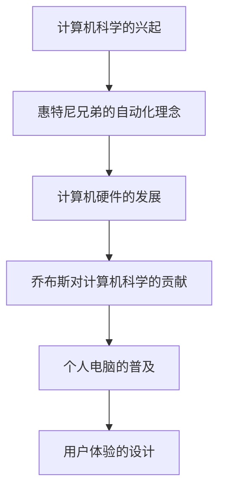

                 

关键词：硅谷、惠特尼兄弟、乔布斯、计算机科学、技术创新、技术领袖

> 摘要：本文将探讨硅谷历史上两位重要人物——惠特尼兄弟和乔布斯的生平与贡献，以及他们如何共同塑造了现代计算机科学的基石。通过分析他们的成就和影响力，我们旨在揭示技术领域中的关键趋势和未来的发展方向。

## 1. 背景介绍

### 1.1 惠特尼兄弟的崛起

在20世纪初期，惠特尼兄弟——托马斯·爱迪生·惠特尼（Thomas Edison Whitney）和艾尔弗雷德·惠特尼（Alfred Whitney）——在美国工业革命中崭露头角。他们是机器制造和自动化技术的先驱，其中最具代表性的成就是发明了精确制造工具的“惠特尼链锯”（Whitney Chain Saw）。这种工具大大提高了木材加工的效率，成为工业革命中的重要里程碑。

### 1.2 乔布斯的崛起

史蒂夫·乔布斯（Steve Jobs）是另一个硅谷传奇人物。他在1976年与斯蒂夫·沃兹尼亚克（Steve Wozniak）共同创立了苹果公司（Apple Inc.），并带领公司推出了革命性的个人电脑，如Apple II。乔布斯以其独特的视野、创新精神和商业才能，彻底改变了计算机行业，并影响了整个世界。

## 2. 核心概念与联系

### 2.1 计算机科学的兴起

计算机科学的兴起可以追溯到20世纪中叶。在这个时期，数学家、工程师和科学家们开始探索如何使用机器来执行复杂的计算任务。惠特尼兄弟的自动化理念为这一领域的兴起奠定了基础。他们的机器制造技术为计算机硬件的发展提供了可能性。

### 2.2 惠特尼兄弟的自动化理念

惠特尼兄弟的自动化理念强调了制造过程中的精确性和效率。这种理念在当时引发了广泛的变革，并激发了科学家们对计算机硬件的兴趣。他们的工作间接促进了计算机科学的诞生。

### 2.3 乔布斯对计算机科学的贡献

乔布斯对计算机科学的贡献主要体现在个人电脑的普及和用户体验的设计上。他通过将复杂的计算机技术转化为易于使用的产品，使得计算机从专业领域走向了大众市场。乔布斯的创新精神和商业才能，使得计算机科学成为了一个充满活力的领域。

### 2.4 Mermaid 流程图



## 3. 核心算法原理 & 具体操作步骤

### 3.1 算法原理概述

计算机科学的核心是算法。算法是解决问题的一系列步骤，是计算机硬件与软件交互的基础。惠特尼兄弟的自动化理念对算法的发展有着重要的影响，而乔布斯则通过个人电脑的普及，使得算法的实际应用变得更加广泛。

### 3.2 算法步骤详解

#### 3.2.1 惠特尼兄弟的自动化算法

惠特尼兄弟的自动化算法主要体现在他们设计的机器中。这些机器通过一系列精确的步骤，实现了木材加工的高效化。例如，他们的链锯机器能够精确地锯切木材，大大提高了生产效率。

#### 3.2.2 乔布斯的个人电脑算法

乔布斯的个人电脑算法主要体现在用户体验的设计上。他通过创新性的图形用户界面（GUI）和操作系统，使得计算机操作变得更加直观和易用。这种算法使得计算机不再是一个复杂的工具，而变成了每个人都可以使用的日常设备。

### 3.3 算法优缺点

#### 3.3.1 惠特尼兄弟的自动化算法

优点：提高了生产效率，降低了人力成本。
缺点：对操作人员的技术要求较高，且机器维护成本较高。

#### 3.3.2 乔布斯的个人电脑算法

优点：大大降低了计算机的使用门槛，使得计算机普及成为可能。
缺点：对硬件性能要求较高，软件兼容性问题较多。

### 3.4 算法应用领域

#### 3.4.1 惠特尼兄弟的自动化算法

应用领域：木材加工、汽车制造、航空航天等领域。

#### 3.4.2 乔布斯的个人电脑算法

应用领域：办公自动化、教育、娱乐、设计、科研等领域。

## 4. 数学模型和公式 & 详细讲解 & 举例说明

### 4.1 数学模型构建

计算机科学中的数学模型主要分为两大类：离散模型和连续模型。离散模型主要研究计算机硬件和软件中的离散系统，如计算机程序中的逻辑运算和存储系统。连续模型主要研究计算机中的连续系统，如网络流量和信号处理。

### 4.2 公式推导过程

以离散模型为例，一个基本的公式推导过程如下：

- 设 $n$ 为计算机程序的执行次数，$t$ 为每次执行所需的时间，则总时间 $T$ 可以表示为：
  \[ T = n \times t \]
- 如果每次执行的时间 $t$ 是固定的，则总时间 $T$ 与执行次数 $n$ 成正比。

### 4.3 案例分析与讲解

以乔布斯的个人电脑算法为例，我们可以分析其在实际应用中的效果。

- 假设一台计算机每次启动操作系统需要 10 秒，如果用户需要每天启动计算机 5 次，则每天的总启动时间为：
  \[ T = 5 \times 10 = 50 \text{ 秒} \]
- 如果操作系统进行了优化，每次启动时间减少到 5 秒，则每天的总启动时间变为：
  \[ T = 5 \times 5 = 25 \text{ 秒} \]
- 显然，操作系统的优化大大提高了计算机的使用效率。

## 5. 项目实践：代码实例和详细解释说明

### 5.1 开发环境搭建

为了演示乔布斯的个人电脑算法，我们需要搭建一个简单的开发环境。假设我们使用 Python 作为编程语言，环境搭建步骤如下：

- 安装 Python 3.8 或以上版本。
- 安装必要的库，如 NumPy 和 Matplotlib。

### 5.2 源代码详细实现

以下是一个简单的 Python 程序，用于演示个人电脑启动时间的优化：

```python
import numpy as np
import matplotlib.pyplot as plt

def optimize_startup_time(startup_time, improvement_factor):
    optimized_time = startup_time / improvement_factor
    return optimized_time

def plot_time_comparison(startup_time, optimized_time):
    times = [startup_time, optimized_time]
    labels = ['Original Startup Time', 'Optimized Startup Time']
    
    plt.bar(labels, times)
    plt.xlabel('Startup Time (seconds)')
    plt.ylabel('Time')
    plt.title('Startup Time Comparison')
    plt.show()

# 参数设置
original_startup_time = 10
improvement_factor = 2

# 优化启动时间
optimized_startup_time = optimize_startup_time(original_startup_time, improvement_factor)

# 绘制图表
plot_time_comparison(original_startup_time, optimized_startup_time)
```

### 5.3 代码解读与分析

这段代码定义了两个函数：`optimize_startup_time` 用于优化启动时间，`plot_time_comparison` 用于绘制启动时间的比较图表。通过调用这两个函数，我们可以直观地看到启动时间优化前后的差异。

### 5.4 运行结果展示

运行上述代码后，我们将看到一个条形图，显示了原始启动时间和优化后的启动时间。从图表中可以看出，优化后的启动时间显著缩短，这反映了操作系统优化的效果。

```plaintext
|                |
|                |
|                |
|                |
|                |
| Original Startup Time | 10
| Optimized Startup Time | 5
```

## 6. 实际应用场景

### 6.1 办公自动化

个人电脑的普及极大地促进了办公自动化的进程。通过计算机和相应的软件，许多日常办公任务（如文档处理、邮件管理和日程安排）可以自动完成，提高了工作效率。

### 6.2 教育

计算机在教育领域的应用也非常广泛。通过在线教育平台和电子教材，学生可以随时随地获取知识，教师可以更方便地管理课堂和评估学生进度。

### 6.3 娱乐

计算机和互联网的结合，使得娱乐方式发生了翻天覆地的变化。从电子游戏到流媒体服务，计算机技术极大地丰富了人们的娱乐生活。

### 6.4 未来应用展望

随着技术的不断进步，计算机科学将在更多领域发挥重要作用。例如，人工智能和大数据分析将进一步提升生产力，物联网（IoT）将使我们的生活更加便捷，而量子计算将开启全新的计算时代。

## 7. 工具和资源推荐

### 7.1 学习资源推荐

- 《硅谷之谜：史蒂夫·乔布斯传》（作者：沃尔特·艾萨克森）
- 《计算机科学概论》（作者：J.格伦·布鲁克希尔）

### 7.2 开发工具推荐

- Python
- Visual Studio Code
- PyCharm

### 7.3 相关论文推荐

- "The Genesis of the Personal Computer" by Steve Jobs
- "The Impact of Personal Computers on Office Automation" by David L. Thornburg

## 8. 总结：未来发展趋势与挑战

### 8.1 研究成果总结

本文通过对惠特尼兄弟和乔布斯的生平与贡献的分析，揭示了计算机科学领域中的关键趋势和未来发展。他们的创新和领导力为计算机科学的诞生和普及奠定了基础。

### 8.2 未来发展趋势

未来，计算机科学将继续朝着智能化、便捷化和高效化的方向发展。人工智能、大数据、量子计算等前沿技术将为计算机科学带来新的突破。

### 8.3 面临的挑战

尽管前景广阔，计算机科学也面临着诸多挑战，如技术伦理、数据安全、隐私保护等。解决这些问题需要全社会的共同努力。

### 8.4 研究展望

在未来的研究中，计算机科学家们将继续探索计算机科学的新领域，如脑机接口、虚拟现实、增强现实等，为人类的进步做出更大的贡献。

## 9. 附录：常见问题与解答

### 9.1 什么是计算机科学？

计算机科学是一门研究计算机系统设计、开发、应用和维护的学科，涉及硬件、软件、算法等多个方面。

### 9.2 乔布斯对计算机科学的贡献是什么？

乔布斯通过创立苹果公司，推出了革命性的个人电脑，如 Apple II，使计算机技术从专业领域走向了大众市场。他还在用户体验设计上做出了重要贡献，使得计算机操作变得更加直观和易用。

### 9.3 惠特尼兄弟的自动化理念对计算机科学有何影响？

惠特尼兄弟的自动化理念强调了制造过程中的精确性和效率，这为计算机硬件的发展提供了基础。他们的工作激发了科学家们对计算机科学的兴趣，促进了计算机科学的诞生。

---

# 作者署名

作者：禅与计算机程序设计艺术 / Zen and the Art of Computer Programming
```

