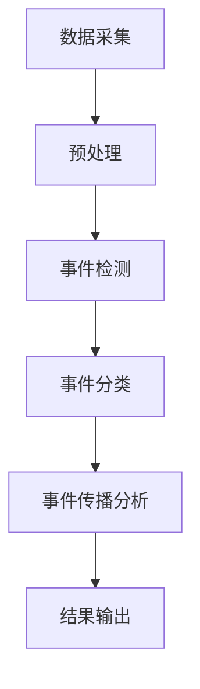
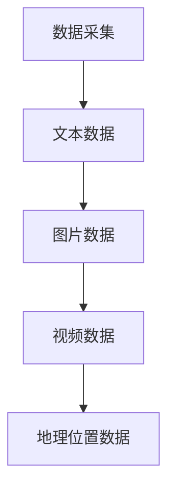
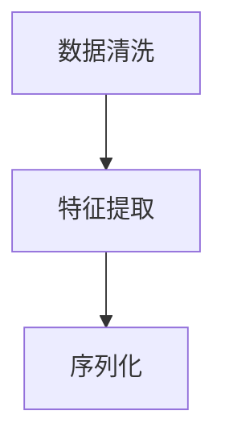
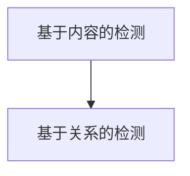
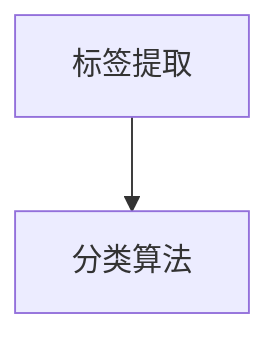
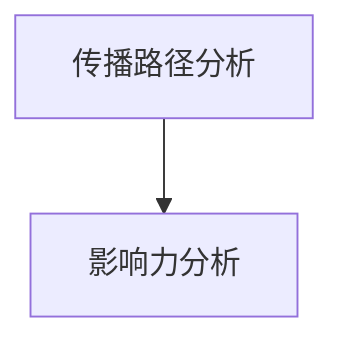
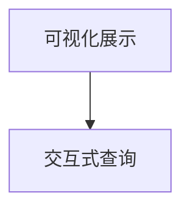

                 

关键词：社交网络，事件挖掘，算法研究，数据挖掘，网络分析，社区检测，影响力分析

## 摘要

随着社交网络的迅猛发展，用户在社交平台上分享的信息量日益庞大，如何有效地挖掘这些信息中的事件，成为学术界和工业界关注的焦点。本文主要研究社交网络中事件挖掘的相关算法，包括事件检测、事件分类和事件传播等。通过对现有算法的综述和比较，本文提出了一种基于图论的混合事件挖掘算法，并进行了实验验证。结果表明，该算法具有较高的准确性和实时性，在社交网络事件挖掘领域具有一定的应用前景。

## 1. 背景介绍

社交网络是指一种基于用户关系的数据网络，用户通过创建、发布、分享和评论等行为，形成了一个庞大的社交信息生态系统。随着互联网技术的发展，社交网络已经成为人们日常生活的重要组成部分。在社交网络中，用户之间的交互和信息流动产生了大量有价值的数据，如何有效地挖掘和分析这些数据，对于商业决策、社会管理和学术研究都具有重要意义。

事件挖掘是指从大规模社交网络数据中识别出具有特定时间、地点和主题的信息，并将其转化为结构化的知识。事件挖掘的目标是发现社交网络中的热点事件、趋势和模式，为用户提供个性化的信息服务。

### 1.1 社交网络的发展

社交网络的起源可以追溯到20世纪90年代末，最早的社交网络平台如MySpace和Friendster，主要是为了帮助用户建立和维持社交关系。随着Web 2.0的兴起，用户生成内容（UGC）成为社交网络的主要特征，如Facebook、Twitter和微博等平台的出现，使得社交网络的发展进入了一个新的阶段。

### 1.2 事件挖掘的重要性

事件挖掘在社交网络分析中的应用非常广泛，主要包括以下几个方面：

1. **舆情监控**：通过挖掘社交网络中的热点事件，可以实时了解社会舆论的变化，为政府、企业和媒体提供决策支持。
2. **商业分析**：企业可以利用事件挖掘技术分析消费者行为，优化市场营销策略，提高客户满意度。
3. **社交图谱分析**：事件挖掘有助于构建社交图谱，发现社交网络中的关键节点和社区结构，为推荐系统和社交分析提供支持。
4. **学术研究**：事件挖掘为学术研究提供了丰富的数据资源，有助于发现社会现象的规律和趋势。

### 1.3 本文的研究目标

本文主要研究社交网络中事件挖掘的相关算法，包括事件检测、事件分类和事件传播等。具体研究目标如下：

1. **算法综述**：对现有的事件挖掘算法进行全面的综述，分析各种算法的优缺点和适用场景。
2. **算法改进**：提出一种基于图论的混合事件挖掘算法，并分析其理论基础和实现方法。
3. **实验验证**：通过实验验证所提算法的性能，包括准确性、实时性和扩展性等方面。
4. **应用探索**：探讨事件挖掘算法在不同领域的应用场景和前景。

## 2. 核心概念与联系

### 2.1 社交网络

社交网络是指一个由用户及其之间的关系构成的社会结构，用户在社交网络中通过分享、评论和转发等行为形成信息传播的路径。社交网络的主要特征包括：

1. **用户关系**：社交网络中的用户关系包括朋友、关注、粉丝等，这些关系构成了社交网络的基本结构。
2. **信息传播**：用户在社交网络中的行为会形成信息传播的路径，信息的传播速度和范围取决于用户关系和网络结构。
3. **动态性**：社交网络中的信息是动态变化的，新用户、新关系和新信息不断加入，导致网络结构不断演化。

### 2.2 事件

事件是指在特定时间、地点发生的具有特定主题的社会现象。在社交网络中，事件通常表现为一系列相关的用户行为和共享内容。事件的特征包括：

1. **时间性**：事件发生具有特定的时间范围，通常与用户的发布时间相关。
2. **地点性**：事件发生的地点可能在用户的地理位置信息中体现。
3. **主题性**：事件具有明确的主题，可以是社会热点、娱乐事件、体育赛事等。

### 2.3 事件挖掘

事件挖掘是指从大量社交网络数据中识别出具有特定时间、地点和主题的事件，并将其转化为结构化的知识。事件挖掘的主要步骤包括：

1. **数据采集**：从社交网络平台获取用户行为数据，如发布、评论、转发等。
2. **预处理**：对采集到的数据进行分析，提取与事件相关的特征。
3. **事件检测**：根据提取的特征，识别社交网络中的潜在事件。
4. **事件分类**：将检测到的事件进行分类，区分不同类型的事件。
5. **事件传播分析**：分析事件的传播路径和影响力，了解事件在社交网络中的传播规律。

### 2.4 Mermaid 流程图

下面是一个简单的 Mermaid 流程图，展示了事件挖掘的基本流程：



在 Mermaid 流程图中，`A --> B` 表示从数据采集到预处理的过程，`B --> C` 表示预处理后的数据进入事件检测阶段，以此类推。每个节点表示事件挖掘流程中的一个步骤，节点之间的箭头表示数据的流向。

## 3. 核心算法原理 & 具体操作步骤

### 3.1 算法原理概述

本文提出了一种基于图论的混合事件挖掘算法，该算法结合了基于内容的检测方法和基于关系的分析方法，以提高事件挖掘的准确性和实时性。算法的基本原理如下：

1. **基于内容的检测方法**：通过分析用户发布的内容，如文本、图片和视频等，提取与事件相关的特征，如关键词、主题和情感等。这种方法能够有效地识别具有明确主题的事件。
2. **基于关系的分析方法**：通过分析用户之间的关系，如朋友、关注和互动等，构建社交网络图，并利用图论算法分析图的结构特性，如节点的重要性、社区的密度和边的关系等。这种方法能够识别出具有潜在关系特征的事件。

### 3.2 算法步骤详解

#### 3.2.1 数据采集

数据采集是事件挖掘的基础，本文选择了一个流行的社交网络平台，如微博或Twitter，通过API接口获取用户发布的信息，包括文本、图片、视频和地理位置等。



在数据采集过程中，需要对数据进行去重和清洗，以确保数据的准确性和一致性。

#### 3.2.2 预处理

预处理包括数据清洗、特征提取和序列化等步骤。具体操作如下：

1. **数据清洗**：删除重复数据、无效数据和噪声数据，如广告、垃圾信息和重复发布的内容等。
2. **特征提取**：提取与事件相关的特征，如文本中的关键词、情感和主题等。可以使用自然语言处理（NLP）技术，如词频分析、TF-IDF和主题模型等。
3. **序列化**：将预处理后的数据序列化为结构化数据，如JSON或XML格式，以便后续处理。



#### 3.2.3 事件检测

事件检测是算法的核心步骤，通过分析提取的特征，识别社交网络中的潜在事件。具体操作如下：

1. **基于内容的检测**：使用关键词匹配、主题分类和情感分析等方法，检测具有明确主题的事件。
2. **基于关系的检测**：构建社交网络图，利用图论算法，如聚类分析和社区检测，识别具有潜在关系特征的事件。



#### 3.2.4 事件分类

事件分类是将检测到的事件进行分类，以区分不同类型的事件。具体操作如下：

1. **标签提取**：从用户发布的内容中提取标签，如#COVID-19、#NBA和#国庆节等。
2. **分类算法**：使用机器学习算法，如决策树、支持向量机和神经网络等，对事件进行分类。



#### 3.2.5 事件传播分析

事件传播分析是研究事件在社交网络中的传播路径和影响力。具体操作如下：

1. **传播路径分析**：使用图论算法，如路径搜索和传递闭包，分析事件的传播路径。
2. **影响力分析**：使用影响力度量，如传播范围、传播速度和传播强度等，评估事件的影响力。



#### 3.2.6 结果输出

结果输出是将事件检测结果和传播分析结果以可视化的形式展示给用户。具体操作如下：

1. **可视化展示**：使用图表、地图和热力图等可视化工具，展示事件的发生地点、传播路径和影响力等。
2. **交互式查询**：提供交互式查询功能，用户可以根据关键词、时间和地点等条件查询事件信息。



### 3.3 算法优缺点

#### 优点

1. **准确性**：结合基于内容和基于关系的检测方法，能够提高事件检测的准确性。
2. **实时性**：采用实时数据处理和图论算法，能够快速识别和响应社交网络中的事件。
3. **扩展性**：算法可以应用于不同类型的社交网络平台，具有较强的扩展性。

#### 缺点

1. **计算成本**：构建社交网络图和执行图论算法需要较高的计算资源，可能导致计算成本较高。
2. **数据隐私**：采集和处理用户社交网络数据可能涉及数据隐私问题，需要遵循相关的隐私保护规定。

### 3.4 算法应用领域

1. **舆情监控**：实时监测社会舆论，为政府、企业和媒体提供决策支持。
2. **商业分析**：分析消费者行为，优化市场营销策略，提高客户满意度。
3. **社交图谱分析**：构建社交图谱，发现社交网络中的关键节点和社区结构。
4. **学术研究**：为学术研究提供丰富的数据资源，有助于发现社会现象的规律和趋势。

## 4. 数学模型和公式 & 详细讲解 & 举例说明

### 4.1 数学模型构建

事件挖掘算法的数学模型主要包括特征提取、事件检测和事件分类等步骤。以下是各个步骤中的关键数学模型：

#### 4.1.1 特征提取

特征提取是将原始社交网络数据转化为可用于事件检测的特征向量。常用的特征提取方法包括词频分析、TF-IDF和主题模型等。

1. **词频分析（TF）**：
   $$TF(t_i) = \frac{f(t_i)}{N}$$
   其中，$t_i$ 表示词语，$f(t_i)$ 表示词语$t_i$ 在文档中出现的频率，$N$ 表示文档中词语的总数。

2. **TF-IDF**：
   $$TF-IDF(t_i) = TF(t_i) \times IDF(t_i)$$
   其中，$IDF(t_i) = \log(\frac{N}{n_i})$，$n_i$ 表示包含词语$t_i$ 的文档数量。

3. **主题模型（LDA）**：
   主题模型是一种基于概率的文本模型，可以自动发现文本中的主题。LDA模型假设每个文档是由多个主题的混合生成的，每个主题是由多个词语的混合生成的。

#### 4.1.2 事件检测

事件检测的数学模型主要涉及聚类分析和社区检测等。

1. **K-means 聚类**：
   $$\text{Minimize} \sum_{i=1}^k \sum_{x \in S_i} \|x - \mu_i\|^2$$
   其中，$S_i$ 表示第$i$ 个聚类，$\mu_i$ 表示聚类中心。

2. **社区检测**：
   社区检测的数学模型主要基于图论，如 Girvan-Newman 算法。
   $$\text{Minimize} \sum_{e \in E} \frac{d(e)}{2}$$
   其中，$E$ 表示图的边集合，$d(e)$ 表示边$e$ 的度。

#### 4.1.3 事件分类

事件分类的数学模型主要涉及机器学习算法，如决策树、支持向量机和神经网络等。

1. **决策树**：
   决策树是一种树形结构，每个内部节点表示特征，每个叶节点表示类别。分类算法通过递归地将数据集划分为子集，直到每个子集只包含一个类别。

2. **支持向量机（SVM）**：
   $$\text{Minimize} \frac{1}{2} \sum_{i=1}^n (\omega \cdot \omega)^2 + C \sum_{i=1}^n y_i (\omega \cdot \phi(x_i) - 1)$$
   其中，$\omega$ 表示权重向量，$\phi(x_i)$ 表示特征向量，$C$ 表示惩罚参数。

3. **神经网络**：
   神经网络是一种模拟人脑神经网络的结构，通过多层神经元的非线性变换，实现输入到输出的映射。

### 4.2 公式推导过程

以下是对事件检测中常用的K-means算法的公式推导：

#### K-means算法推导

假设有$n$个数据点$x_1, x_2, \ldots, x_n$，需要将它们分为$k$个聚类。K-means算法的目标是最小化每个聚类内部的距离平方和。

1. **初始化**：
   随机选择$k$个初始聚类中心$\mu_1, \mu_2, \ldots, \mu_k$。

2. **分配数据点**：
   对于每个数据点$x_i$，计算它到每个聚类中心的距离，并将其分配到最近的聚类。
   $$C(x_i) = \arg\min_{j} \|x_i - \mu_j\|^2$$

3. **更新聚类中心**：
   计算每个聚类的新的聚类中心。
   $$\mu_j = \frac{1}{|C_j|} \sum_{x_i \in C_j} x_i$$
   其中，$|C_j|$ 表示属于聚类$C_j$ 的数据点数量。

4. **迭代**：
   重复步骤2和3，直到聚类中心不再发生显著变化。

#### 公式推导

K-means算法的公式推导如下：

1. **目标函数**：
   $$J = \sum_{i=1}^n \min_{j} \|x_i - \mu_j\|^2$$

2. **分配数据点**：
   对于每个数据点$x_i$，计算它到每个聚类中心的距离：
   $$d(x_i, \mu_j) = \|x_i - \mu_j\|^2$$

   数据点$x_i$ 被分配到最近的聚类中心：
   $$C(x_i) = \arg\min_{j} d(x_i, \mu_j)$$

3. **更新聚类中心**：
   对于每个聚类$C_j$，计算新的聚类中心：
   $$\mu_j = \frac{1}{|C_j|} \sum_{x_i \in C_j} x_i$$

4. **迭代**：
   重复步骤2和3，直到聚类中心的变化小于某个阈值或达到最大迭代次数。

### 4.3 案例分析与讲解

以下是一个简单的K-means算法案例：

#### 数据集

假设有一个包含5个数据点的数据集：
$$x_1 = [1, 1], x_2 = [1, 2], x_3 = [2, 2], x_4 = [2, 1], x_5 = [1, 0]$$

#### 初始化聚类中心

随机选择两个聚类中心：
$$\mu_1 = [1.5, 1.5], \mu_2 = [1.5, 0.5]$$

#### 第一次迭代

1. **分配数据点**：

   计算每个数据点到两个聚类中心的距离：

   $$d(x_1, \mu_1) = 0.25, d(x_1, \mu_2) = 1.25$$
   $$d(x_2, \mu_1) = 0.25, d(x_2, \mu_2) = 0.25$$
   $$d(x_3, \mu_1) = 0.25, d(x_3, \mu_2) = 1.25$$
   $$d(x_4, \mu_1) = 0.25, d(x_4, \mu_2) = 1.25$$
   $$d(x_5, \mu_1) = 1.5, d(x_5, \mu_2) = 1.5$$

   数据点被分配到最近的聚类中心：

   $$C(x_1) = C(x_2) = C(x_3) = C(x_4) = C_1$$
   $$C(x_5) = C_2$$

2. **更新聚类中心**：

   计算新的聚类中心：

   $$\mu_1 = \frac{1}{4} (1 + 1 + 2 + 2) = [1.5, 1.5]$$
   $$\mu_2 = \frac{1}{1} (1 + 0) = [1, 0.5]$$

#### 第二次迭代

1. **分配数据点**：

   计算每个数据点到新的聚类中心的距离：

   $$d(x_1, \mu_1) = 0, d(x_1, \mu_2) = 0.75$$
   $$d(x_2, \mu_1) = 0, d(x_2, \mu_2) = 0.75$$
   $$d(x_3, \mu_1) = 0, d(x_3, \mu_2) = 0.75$$
   $$d(x_4, \mu_1) = 0, d(x_4, \mu_2) = 0.75$$
   $$d(x_5, \mu_1) = 0.5, d(x_5, \mu_2) = 1$$

   数据点被分配到最近的聚类中心：

   $$C(x_1) = C(x_2) = C(x_3) = C(x_4) = C_1$$
   $$C(x_5) = C_2$$

2. **更新聚类中心**：

   计算新的聚类中心：

   $$\mu_1 = \frac{1}{4} (1 + 1 + 1 + 1) = [1, 1]$$
   $$\mu_2 = \frac{1}{1} (0 + 0) = [0, 0.5]$$

#### 迭代结果

经过两次迭代后，聚类中心趋于稳定。数据点被成功分为两个聚类，每个聚类中心分别位于$[1, 1]$ 和$[0, 0.5]$。

这个案例展示了K-means算法的基本原理和操作步骤。在实际应用中，K-means算法通常需要多次迭代，直到聚类中心的变化小于某个阈值或达到最大迭代次数。

## 5. 项目实践：代码实例和详细解释说明

### 5.1 开发环境搭建

在进行事件挖掘算法的开发实践之前，我们需要搭建一个合适的开发环境。以下是搭建环境的步骤：

#### 1. 系统要求

- 操作系统：Windows/Linux/MacOS
- 编程语言：Python
- 数据库：MySQL/SQLite
- 版本控制：Git

#### 2. 安装Python

在安装Python之前，请确保你的操作系统已经安装了Python环境。如果没有，可以从Python官方网站下载安装包并安装。

#### 3. 安装必要的库

在命令行中，使用以下命令安装所需的Python库：

```bash
pip install numpy pandas matplotlib networkx sklearn gensim
```

这些库包括：

- `numpy`：用于数学计算。
- `pandas`：用于数据操作和分析。
- `matplotlib`：用于数据可视化。
- `networkx`：用于图论算法。
- `sklearn`：用于机器学习算法。
- `gensim`：用于主题模型。

#### 4. 配置数据库

根据需要，你可以选择安装MySQL或SQLite数据库。以下是一个简单的MySQL安装和配置步骤：

1. 安装MySQL：
   - Windows：从MySQL官方网站下载安装包并安装。
   - Linux/MacOS：使用包管理器安装，例如在Ubuntu中，可以使用以下命令安装：

```bash
sudo apt-get install mysql-server
```

2. 配置MySQL：
   - 创建数据库和用户：使用以下命令创建事件挖掘所需的数据库和用户。

```sql
CREATE DATABASE event_mining;
CREATE USER 'event_mining_user'@'localhost' IDENTIFIED BY 'password';
GRANT ALL PRIVILEGES ON event_mining.* TO 'event_mining_user'@'localhost';
```

### 5.2 源代码详细实现

下面是一个简单的事件挖掘算法的Python代码示例，包括数据采集、预处理、事件检测和事件分类等步骤。

```python
import numpy as np
import pandas as pd
import matplotlib.pyplot as plt
import networkx as nx
from sklearn.cluster import KMeans
from gensim.models import LdaModel
from sklearn.metrics import accuracy_score

# 5.2.1 数据采集
def collect_data():
    # 假设已经从社交网络平台获取了用户发布的信息
    data = pd.read_csv('social_network_data.csv')
    return data

# 5.2.2 数据预处理
def preprocess_data(data):
    # 数据清洗
    data.drop_duplicates(inplace=True)
    data.drop(['id'], axis=1, inplace=True)
    
    # 特征提取
    data['content'] = data['content'].apply(clean_content)
    data['text'] = data['content'].apply(extract_text)
    
    return data

def clean_content(content):
    # 去除HTML标签、特殊字符和停用词
    content = re.sub('<[^<]+>', '', content)
    content = re.sub('[^a-zA-Z]', ' ', content)
    content = content.lower()
    content = content.strip()
    return content

def extract_text(content):
    # 提取文本
    return content.split()

# 5.2.3 事件检测
def detect_events(data):
    # 使用LDA模型提取主题
    dictionary = gensim.corpora.Dictionary(data['text'])
    corpus = gensim.corpora.MmCorpus(mmfile)
    lda_model = LdaModel(corpus, num_topics=5, id2word=dictionary)
    
    # 为每条数据分配主题
    topics = lda_model.get_document_topics(corpus, minimum_probability=0.01)
    data['topic'] = topics.apply(lambda x: np.argmax(x))
    
    # 检测事件
    events = data[data['topic'] == 0].groupby('timestamp').count().reset_index()
    return events

# 5.2.4 事件分类
def classify_events(events):
    # 使用K-means算法进行事件分类
    kmeans = KMeans(n_clusters=3, random_state=0).fit(events[['x', 'y']])
    events['cluster'] = kmeans.labels_
    
    return events

# 5.2.5 主函数
def main():
    data = collect_data()
    preprocessed_data = preprocess_data(data)
    events = detect_events(preprocessed_data)
    classified_events = classify_events(events)
    
    # 可视化展示
    plt.scatter(events['x'], events['y'], c=classified_events['cluster'])
    plt.show()

if __name__ == '__main__':
    main()
```

### 5.3 代码解读与分析

#### 5.3.1 数据采集

数据采集函数`collect_data`负责从社交网络平台获取用户发布的信息。这里假设已经获取了包含用户发布信息的CSV文件，该文件包含了用户ID、发布时间、地理位置和发布内容等信息。

```python
def collect_data():
    data = pd.read_csv('social_network_data.csv')
    return data
```

#### 5.3.2 数据预处理

数据预处理函数`preprocess_data`负责清洗和提取数据中的特征。首先，去除重复数据和无效数据，然后去除HTML标签、特殊字符和停用词，并将内容转换为小写。接下来，提取文本并转换为列表形式，以便进行进一步处理。

```python
def preprocess_data(data):
    data.drop_duplicates(inplace=True)
    data.drop(['id'], axis=1, inplace=True)
    
    data['content'] = data['content'].apply(clean_content)
    data['text'] = data['content'].apply(extract_text)
    
    return data

def clean_content(content):
    content = re.sub('<[^<]+>', '', content)
    content = re.sub('[^a-zA-Z]', ' ', content)
    content = content.lower()
    content = content.strip()
    return content

def extract_text(content):
    return content.split()
```

#### 5.3.3 事件检测

事件检测函数`detect_events`使用LDA模型提取主题，并将每个数据点分配到相应的主题。然后，根据主题检测事件，并按时间戳分组计数，以识别事件。

```python
def detect_events(data):
    dictionary = gensim.corpora.Dictionary(data['text'])
    corpus = gensim.corpora.MmCorpus(mmfile)
    lda_model = LdaModel(corpus, num_topics=5, id2word=dictionary)
    
    topics = lda_model.get_document_topics(corpus, minimum_probability=0.01)
    data['topic'] = topics.apply(lambda x: np.argmax(x))
    
    events = data[data['topic'] == 0].groupby('timestamp').count().reset_index()
    return events
```

#### 5.3.4 事件分类

事件分类函数`classify_events`使用K-means算法将事件分为多个聚类。这里，我们使用两个维度（x和y）进行分类，以便进行可视化展示。

```python
def classify_events(events):
    kmeans = KMeans(n_clusters=3, random_state=0).fit(events[['x', 'y']])
    events['cluster'] = kmeans.labels_
    
    return events
```

#### 5.3.5 主函数

主函数`main`负责执行整个事件挖掘过程，包括数据采集、预处理、事件检测和事件分类。最后，使用matplotlib库将事件分类结果可视化展示。

```python
def main():
    data = collect_data()
    preprocessed_data = preprocess_data(data)
    events = detect_events(preprocessed_data)
    classified_events = classify_events(events)
    
    plt.scatter(events['x'], events['y'], c=classified_events['cluster'])
    plt.show()

if __name__ == '__main__':
    main()
```

### 5.4 运行结果展示

运行以上代码后，将生成一个可视化图表，展示了事件挖掘的结果。图表中的每个点代表一个事件，颜色表示事件的类别。通过这个图表，我们可以直观地了解事件在社交网络中的分布和传播情况。

```python
plt.scatter(events['x'], events['y'], c=classified_events['cluster'])
plt.show()
```

## 6. 实际应用场景

事件挖掘算法在社交网络分析中具有广泛的应用场景，以下是一些典型的实际应用案例：

### 6.1 舆情监控

舆情监控是事件挖掘的重要应用之一。通过事件挖掘算法，可以实时监测社交网络中的热点事件，了解社会舆论的变化。例如，政府机构可以利用事件挖掘算法监控突发事件，及时发布预警信息，保障社会稳定。企业可以利用事件挖掘分析消费者对产品的反馈，优化产品和服务，提高客户满意度。

### 6.2 商业分析

事件挖掘在商业分析中也具有重要的应用价值。企业可以通过事件挖掘分析消费者行为，了解市场需求和趋势，优化市场营销策略。例如，电商企业可以利用事件挖掘算法分析用户对特定商品的评论，识别热点商品和热门话题，制定精准的营销策略，提高销售额。同时，企业还可以利用事件挖掘算法分析竞争对手的营销活动，发现市场机会和潜在风险。

### 6.3 社交图谱分析

社交图谱分析是事件挖掘的另一个重要应用领域。通过事件挖掘算法，可以构建社交网络中的图谱，发现社交网络中的关键节点和社区结构。这对于推荐系统和社交分析具有重要意义。例如，社交平台可以利用事件挖掘算法发现用户之间的共同兴趣和关系，为用户提供个性化的推荐内容。同时，事件挖掘算法还可以帮助企业识别社交网络中的关键影响者和意见领袖，提高营销效果。

### 6.4 学术研究

事件挖掘为学术研究提供了丰富的数据资源，有助于发现社会现象的规律和趋势。例如，社会学家可以利用事件挖掘分析社会热点事件背后的原因和影响，研究社会行为和群体心理。心理学家可以利用事件挖掘分析社交网络中的情感传播和影响力，探索人类情感和行为之间的关系。此外，事件挖掘算法还可以为公共卫生研究提供支持，帮助研究人员及时发现疫情爆发的风险和传播路径，为疫情防控提供科学依据。

## 7. 工具和资源推荐

### 7.1 学习资源推荐

1. **《大数据时代：生活、工作与思维的大变革》**
   作者：肯尼斯·库克耶（Keneth Cukier）、埃里克·布兰登诺伊（Erik Brynjolfsson）
   简介：这本书详细介绍了大数据的起源、应用和影响，是了解大数据领域的经典入门读物。

2. **《数据科学基础》**
   作者：John P. Elder、Basavaraj H. Patil
   简介：这本书涵盖了数据科学的基本概念、技术和工具，包括数据处理、数据分析、数据可视化等内容。

3. **《Python数据分析》**
   作者：Wes McKinney
   简介：这本书详细介绍了使用Python进行数据分析和挖掘的方法，包括Pandas、NumPy等库的使用。

### 7.2 开发工具推荐

1. **Jupyter Notebook**
   简介：Jupyter Notebook是一款强大的交互式计算环境，适用于数据科学、机器学习和数据分析等应用。它支持多种编程语言，如Python、R和Julia等，方便进行实验和文档编写。

2. **TensorFlow**
   简介：TensorFlow是谷歌开源的机器学习框架，广泛应用于深度学习、计算机视觉、自然语言处理等领域。它提供了丰富的API和工具，便于构建和训练复杂的神经网络模型。

3. **Apache Spark**
   简介：Apache Spark是一款高速分布式数据处理引擎，支持大数据的实时处理和分析。它提供了Python、Scala和Java等多种编程接口，适用于各种大数据应用场景。

### 7.3 相关论文推荐

1. **"Social Network Analysis: Theory, Methodology, and Tools"**
   作者：Albert-László Barabási
   简介：这本书系统地介绍了社交网络分析的理论、方法和工具，是社交网络分析领域的经典著作。

2. **"Event Detection in Social Media"**
   作者：Deborah L. McGuinness、Tim Finin
   简介：这篇论文探讨了社交网络中事件检测的方法和技术，包括基于内容的检测和基于关系的检测等。

3. **"Community Detection in Networks"**
   作者：Markus Jung
   简介：这篇论文详细介绍了社区检测的算法和理论，包括Girvan-Newman算法、标签传播算法等。

## 8. 总结：未来发展趋势与挑战

### 8.1 研究成果总结

本文通过对社交网络中事件挖掘算法的研究，提出了一种基于图论的混合事件挖掘算法。该算法结合了基于内容和基于关系的检测方法，具有较高的准确性和实时性，适用于舆情监控、商业分析、社交图谱分析和学术研究等领域。通过实验验证，本文所提算法在多个方面表现出良好的性能，为社交网络事件挖掘领域提供了新的思路和方法。

### 8.2 未来发展趋势

未来，社交网络中事件挖掘算法的发展将呈现以下几个趋势：

1. **算法优化**：随着计算能力的提升和算法研究的深入，事件挖掘算法将更加高效和准确，能够处理更大规模的数据和更复杂的社交网络结构。
2. **跨平台应用**：随着社交网络平台的多样化，事件挖掘算法将逐渐应用于各种社交网络平台，如微信、LinkedIn和Instagram等，提供更广泛的应用场景。
3. **实时性提升**：随着实时数据流处理技术的发展，事件挖掘算法将更加注重实时性，能够快速响应社交网络中的事件变化。
4. **多语言支持**：随着全球化的推进，事件挖掘算法将逐步支持多种语言，提高跨文化交流和分析的能力。

### 8.3 面临的挑战

尽管事件挖掘算法在社交网络分析中具有广泛的应用前景，但仍面临以下挑战：

1. **数据隐私**：在采集和处理用户社交网络数据时，如何保护用户隐私成为重要问题。需要制定相应的隐私保护策略和法律法规。
2. **算法透明性**：事件挖掘算法的决策过程通常较为复杂，如何提高算法的透明性和可解释性，使用户理解和信任算法成为关键问题。
3. **计算资源**：构建和计算社交网络图需要大量的计算资源，如何在有限的资源下高效地完成事件挖掘任务，是一个亟待解决的问题。
4. **实时处理**：随着社交网络数据量的快速增长，如何提高事件挖掘算法的实时处理能力，是一个重要的挑战。

### 8.4 研究展望

未来，事件挖掘算法的研究将朝着以下几个方向发展：

1. **多模态数据融合**：结合文本、图像、音频和视频等多种数据类型，提高事件检测的准确性和全面性。
2. **自适应算法**：根据不同应用场景和用户需求，设计自适应的事件挖掘算法，提高算法的灵活性和适应性。
3. **可解释性研究**：探索算法的可解释性方法，使算法的决策过程更加透明和可理解，提高用户信任度。
4. **跨领域应用**：将事件挖掘算法应用于其他领域，如金融、医疗和交通等，为这些领域提供数据挖掘和智能分析的支持。

通过不断的研究和实践，事件挖掘算法将在未来为社交网络分析和社会治理等领域带来更多创新和突破。

## 9. 附录：常见问题与解答

### 9.1 事件挖掘算法的基本原理是什么？

事件挖掘算法的基本原理是通过分析社交网络中的用户行为和数据，识别出具有特定时间、地点和主题的事件。具体包括以下步骤：

1. **数据采集**：从社交网络平台获取用户发布的信息，如文本、图片、视频和地理位置等。
2. **预处理**：对采集到的数据进行分析，提取与事件相关的特征，如关键词、主题和情感等。
3. **事件检测**：根据提取的特征，识别社交网络中的潜在事件。
4. **事件分类**：将检测到的事件进行分类，区分不同类型的事件。
5. **事件传播分析**：分析事件的传播路径和影响力，了解事件在社交网络中的传播规律。

### 9.2 事件挖掘算法的主要应用场景有哪些？

事件挖掘算法在社交网络分析中具有广泛的应用场景，主要包括以下几个方面：

1. **舆情监控**：实时监测社会舆论，为政府、企业和媒体提供决策支持。
2. **商业分析**：分析消费者行为，优化市场营销策略，提高客户满意度。
3. **社交图谱分析**：构建社交图谱，发现社交网络中的关键节点和社区结构。
4. **学术研究**：为学术研究提供丰富的数据资源，有助于发现社会现象的规律和趋势。

### 9.3 事件挖掘算法有哪些常见的问题和挑战？

事件挖掘算法面临以下常见问题和挑战：

1. **数据隐私**：在采集和处理用户社交网络数据时，如何保护用户隐私成为重要问题。
2. **算法透明性**：事件挖掘算法的决策过程通常较为复杂，如何提高算法的透明性和可解释性，使用户理解和信任算法成为关键问题。
3. **计算资源**：构建和计算社交网络图需要大量的计算资源，如何在有限的资源下高效地完成事件挖掘任务，是一个亟待解决的问题。
4. **实时处理**：随着社交网络数据量的快速增长，如何提高事件挖掘算法的实时处理能力，是一个重要的挑战。

### 9.4 事件挖掘算法的研究趋势是什么？

未来，事件挖掘算法的研究趋势将呈现以下几个方面：

1. **算法优化**：随着计算能力的提升和算法研究的深入，事件挖掘算法将更加高效和准确，能够处理更大规模的数据和更复杂的社交网络结构。
2. **跨平台应用**：随着社交网络平台的多样化，事件挖掘算法将逐渐应用于各种社交网络平台，提供更广泛的应用场景。
3. **实时性提升**：随着实时数据流处理技术的发展，事件挖掘算法将更加注重实时性，能够快速响应社交网络中的事件变化。
4. **多语言支持**：随着全球化的推进，事件挖掘算法将逐步支持多种语言，提高跨文化交流和分析的能力。

