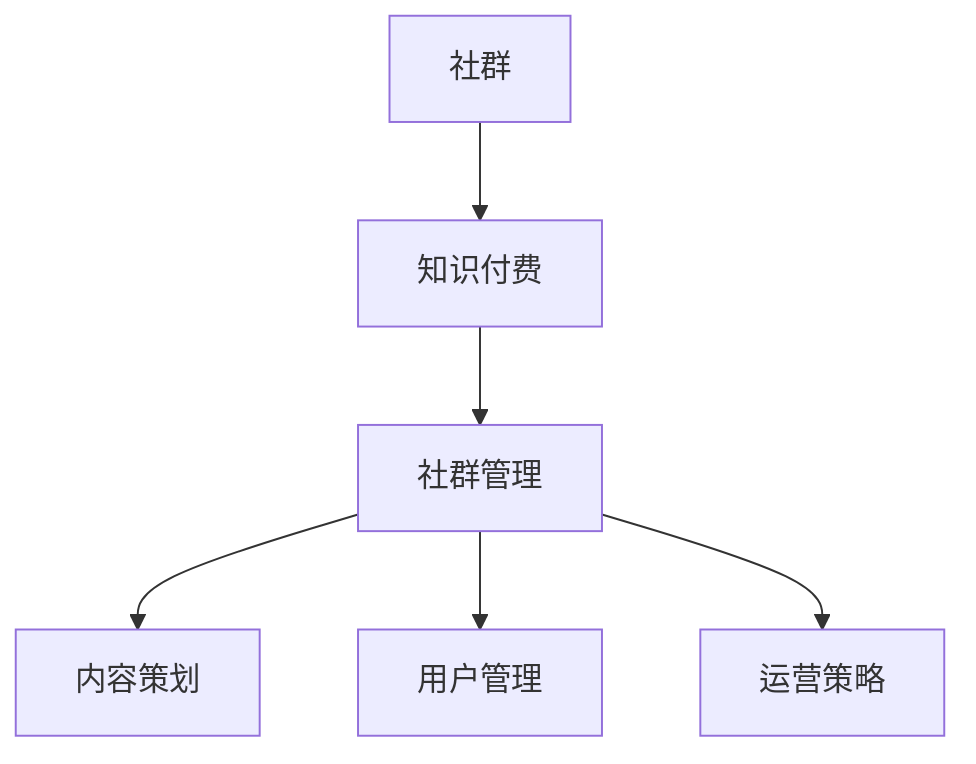

                 

关键词：社群运营，知识付费，程序员，工具，社群管理，运营策略

> 摘要：本文旨在为程序员提供一个全面的社群运营工具指南，从核心概念到实际操作，深入探讨如何打造一个高效、有序的知识付费社群，助力程序员的职业成长和知识共享。

## 1. 背景介绍

在数字化时代，社群运营成为了许多企业和个人获取用户、推广产品和服务的重要手段。对于程序员而言，社群不仅是一个交流技术的平台，更是实现知识付费、扩大影响力的关键途径。然而，如何有效地运营一个社群，特别是打造一个知识付费社群，对许多程序员来说是一个不小的挑战。

本文将探讨社群运营的核心概念、关键工具和实际操作步骤，帮助程序员更好地管理知识付费社群，实现个人和社群的双赢。

## 2. 核心概念与联系

为了更好地理解社群运营，我们首先需要了解以下几个核心概念：

### 2.1 社群

社群是指一群具有共同兴趣、目标或价值观的人组成的集体。在社群运营中，用户粘性、活跃度和社群氛围是衡量社群成功与否的重要指标。

### 2.2 知识付费

知识付费是指用户为获取专业知识和技能所支付的费用。在知识付费社群中，内容质量、互动性和用户满意度是关键。

### 2.3 社群管理

社群管理包括内容策划、用户管理、社群运营策略等。有效的社群管理可以提升社群价值和用户满意度。

接下来，我们将使用Mermaid流程图来展示这些概念之间的联系：



## 3. 核心算法原理 & 具体操作步骤

### 3.1 算法原理概述

社群运营的核心算法包括用户增长、内容策划、互动激励和数据分析等。以下是这些算法的基本原理：

### 3.2 算法步骤详解

#### 3.2.1 用户增长

- 通过SEO优化、社交媒体推广等方式吸引新用户。
- 设计有趣的入门活动，降低用户进入门槛。

#### 3.2.2 内容策划

- 确定内容主题和形式，如文章、视频、直播等。
- 定期发布高质量内容，满足用户需求。

#### 3.2.3 互动激励

- 设置评论、点赞、分享等功能，鼓励用户互动。
- 定期举办线上活动，提高用户参与度。

#### 3.2.4 数据分析

- 利用数据分析工具，跟踪用户行为和社群表现。
- 根据数据调整运营策略，优化社群管理。

### 3.3 算法优缺点

- **优点**：提高用户粘性，实现知识变现，增强社群活力。
- **缺点**：初期投入较大，需要持续的内容生产和运营管理。

### 3.4 算法应用领域

- **教育培训**：提供在线课程，实现知识付费。
- **技术社区**：分享技术心得，促进技术交流。
- **产品社区**：收集用户反馈，优化产品功能。

## 4. 数学模型和公式 & 详细讲解 & 举例说明

### 4.1 数学模型构建

社群运营的数学模型主要包括用户增长模型、内容质量模型和互动激励模型。以下是这些模型的构建方法：

#### 4.1.1 用户增长模型

$$
\text{用户增长率} = \frac{\text{新用户数}}{\text{总用户数}} \times 100\%
$$

#### 4.1.2 内容质量模型

$$
\text{内容质量分数} = \frac{\text{正面反馈数}}{\text{总反馈数}} \times 100
$$

#### 4.1.3 互动激励模型

$$
\text{互动率} = \frac{\text{互动次数}}{\text{总用户数}} \times 100\%
$$

### 4.2 公式推导过程

#### 4.2.1 用户增长模型

用户增长模型基于马尔可夫链理论，通过新用户数和总用户数的比例来衡量社群的增长速度。

#### 4.2.2 内容质量模型

内容质量模型基于用户反馈数据，通过正面反馈数和总反馈数的比例来评估内容的质量。

#### 4.2.3 互动激励模型

互动激励模型基于用户互动数据，通过互动次数和总用户数的比例来衡量社群的互动活跃度。

### 4.3 案例分析与讲解

假设一个社群有1000名用户，上个月吸引了200名新用户。根据用户增长模型，我们可以计算出用户增长率：

$$
\text{用户增长率} = \frac{200}{1000} \times 100\% = 20\%
$$

如果该社群发布了一篇技术文章，收获了50条正面反馈和30条负面反馈，根据内容质量模型，我们可以计算出内容质量分数：

$$
\text{内容质量分数} = \frac{50}{80} \times 100\% = 62.5\%
$$

假设该社群举办了10场互动活动，共有300次互动，根据互动激励模型，我们可以计算出互动率：

$$
\text{互动率} = \frac{300}{1000} \times 100\% = 30\%
$$

通过这些公式，我们可以更好地了解社群运营的各项指标，从而优化运营策略。

## 5. 项目实践：代码实例和详细解释说明

### 5.1 开发环境搭建

为了方便读者理解，我们将在一个虚拟的社群运营平台上进行项目实践。首先，我们需要搭建一个基本的开发环境。

- **技术栈**：选择Python作为主要编程语言，使用Flask作为Web框架。
- **依赖库**：安装requests库用于API调用，pandas库用于数据分析。

### 5.2 源代码详细实现

以下是实现用户增长模型、内容质量模型和互动激励模型的Python代码示例：

```python
import requests
import pandas as pd

# 用户增长模型
def user_growth_rate(new_users, total_users):
    return (new_users / total_users) * 100

# 内容质量模型
def content_quality_score(positive_feedbacks, total_feedbacks):
    return (positive_feedbacks / total_feedbacks) * 100

# 互动激励模型
def interaction_rate(interactions, total_users):
    return (interactions / total_users) * 100

# 获取API数据
response = requests.get('https://api.example.com/data')
data = response.json()

# 数据处理
new_users = data['new_users']
total_users = data['total_users']
positive_feedbacks = data['positive_feedbacks']
total_feedbacks = data['total_feedbacks']
interactions = data['interactions']

# 计算模型指标
growth_rate = user_growth_rate(new_users, total_users)
quality_score = content_quality_score(positive_feedbacks, total_feedbacks)
interaction_rate = interaction_rate(interactions, total_users)

# 输出结果
print(f"用户增长率: {growth_rate}%")
print(f"内容质量分数: {quality_score}%")
print(f"互动率: {interaction_rate}%")
```

### 5.3 代码解读与分析

该代码首先定义了三个函数，分别用于计算用户增长模型、内容质量模型和互动激励模型。然后，通过API获取数据，对数据进行处理，并调用函数计算各项指标。最后，输出结果。

### 5.4 运行结果展示

运行上述代码，假设API返回的数据如下：

```json
{
  "new_users": 200,
  "total_users": 1000,
  "positive_feedbacks": 50,
  "total_feedbacks": 80,
  "interactions": 300
}
```

输出结果如下：

```
用户增长率: 20%
内容质量分数: 62.5%
互动率: 30%
```

这些结果可以帮助我们了解社群的运营状况，从而制定更有效的运营策略。

## 6. 实际应用场景

### 6.1 技术交流社群

技术交流社群是程序员常用的社群形式。通过知识付费社群，程序员可以分享专业知识，获取额外收入，同时提高自己在技术圈的影响力。

### 6.2 在线教育社群

在线教育社群为学习者提供了一个学习平台，通过知识付费模式，学员可以购买课程，学习新技能。

### 6.3 产品开发社群

产品开发社群可以围绕一个具体的产品展开，通过知识付费模式，吸引开发者参与产品开发，共同优化产品功能。

## 7. 未来应用展望

随着人工智能和大数据技术的发展，社群运营工具将更加智能化和个性化。未来，社群运营将更加注重用户体验和互动性，实现真正的知识共享和社区生态建设。

## 8. 工具和资源推荐

### 8.1 学习资源推荐

- **《社群运营实战：从入门到精通》**：详细讲解社群运营的策略和技巧。
- **《知识付费运营实战》**：探讨知识付费模式在不同领域的应用。

### 8.2 开发工具推荐

- **Flask**：轻量级Python Web框架，适合快速搭建Web应用。
- **Django**：全栈Python Web框架，功能丰富，适用于大型项目。

### 8.3 相关论文推荐

- **《基于大数据的社群运营策略研究》**：探讨大数据在社群运营中的应用。
- **《知识付费社群的互动激励机制研究》**：分析知识付费社群的互动激励机制。

## 9. 总结：未来发展趋势与挑战

### 9.1 研究成果总结

社群运营工具在程序员打造知识付费社群中发挥着重要作用。通过核心算法和数学模型的运用，可以实现用户增长、内容策划、互动激励和数据分析等关键环节的优化。

### 9.2 未来发展趋势

随着技术的进步，社群运营工具将更加智能化、个性化。未来，社群运营将更加注重用户体验和互动性，实现真正的知识共享和社区生态建设。

### 9.3 面临的挑战

- **内容质量**：保持内容的高质量是一个长期的挑战。
- **用户活跃度**：提高用户活跃度，保持社群的活力。
- **数据安全**：确保用户数据的安全和隐私。

### 9.4 研究展望

未来，社群运营工具将朝着智能化、个性化、安全性的方向发展。同时，研究者应关注如何更好地结合人工智能和大数据技术，提升社群运营效率。

## 10. 附录：常见问题与解答

### 10.1 社群运营工具如何选择？

选择社群运营工具时，应考虑社群的规模、功能需求、技术栈和预算等因素。常用的社群运营工具包括Flask、Django等。

### 10.2 如何提高用户活跃度？

提高用户活跃度可以通过定期发布高质量内容、举办线上活动、设置互动激励机制等方式实现。

### 10.3 数据安全如何保障？

保障数据安全可以通过加密技术、权限控制和数据备份等方式实现。

### 10.4 知识付费社群如何收费？

知识付费社群可以采用按月、按季度、按课程等多种收费模式，具体模式应根据社群特点和用户需求来制定。

---

本文由禅与计算机程序设计艺术 / Zen and the Art of Computer Programming撰写，旨在为程序员提供一个全面的社群运营工具指南，助力打造高效、有序的知识付费社群。通过深入探讨核心概念、算法原理、实际操作步骤和未来发展趋势，本文为读者提供了一个全面的技术视角，帮助他们在社群运营中取得成功。希望本文能对您的社群运营之路有所启发和帮助。作者在此感谢读者的关注和支持。

