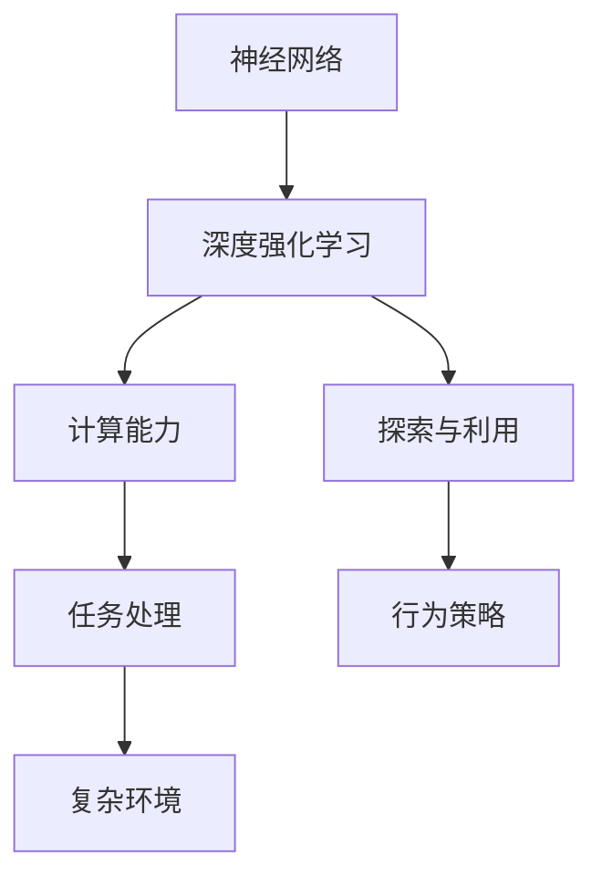

                 

关键词：神经网络，深度强化学习，映射，计算机程序设计，机器学习，人工智能

摘要：本文旨在深入探讨神经网络与深度强化学习之间的紧密联系，以及它们在计算机程序设计中的应用。我们将通过详细的算法原理、数学模型、实际案例以及未来展望，展示这两大技术在当前及未来发展中扮演的关键角色。

## 1. 背景介绍

在人工智能的发展历程中，神经网络和深度强化学习无疑是两个最具代表性的技术。神经网络起源于对生物神经系统的模拟，而深度强化学习则是在神经网络的基础上，结合强化学习理论发展而来。它们不仅在理论上有着深厚的根基，在实际应用中也展现出了强大的潜力。

神经网络作为一种模拟人脑的计算模型，通过调整网络中的权重和偏置，可以实现从简单到复杂的任务处理。深度强化学习则在此基础上，通过探索和利用策略，使智能体能够在动态环境中做出最优决策。

本文将结合神经网络和深度强化学习的基本概念，探讨它们在计算机程序设计中的应用，并分析其在不同领域的表现。

### 1.1 神经网络的历史与发展

神经网络的研究始于20世纪40年代，由心理学家McCulloch和数学家Pitts提出。然而，由于计算能力和数据资源的限制，神经网络在很长一段时间内并未得到广泛应用。

直到1986年，Rumelhart, Hinton和Williams提出了反向传播算法（Backpropagation），神经网络的研究才迎来了新的突破。反向传播算法允许神经网络通过梯度下降法调整权重，从而实现训练。

随着计算能力的提升和数据量的增加，神经网络在图像识别、自然语言处理等领域取得了显著成果。特别是在2012年，AlexNet在ImageNet竞赛中取得了突破性的成绩，标志着深度神经网络时代的到来。

### 1.2 深度强化学习的发展

深度强化学习是在神经网络的基础上，结合强化学习理论发展而来。强化学习通过奖励和惩罚机制，使智能体在动态环境中不断优化其行为策略。

1983年，Samuel的蛇形游戏（Snake in a Box）展示了强化学习在简单任务中的应用。然而，由于计算复杂度和数据需求，强化学习在很长一段时间内并未得到广泛应用。

随着神经网络的兴起，深度强化学习得到了快速发展。2015年，DeepMind的AlphaGo在围棋领域取得了重大突破，标志着深度强化学习在复杂任务中的应用潜力。

### 1.3 计算机程序设计中的神经网络与深度强化学习

在计算机程序设计中，神经网络和深度强化学习已被广泛应用于图像识别、自然语言处理、游戏AI等领域。通过模拟人脑的神经网络，计算机能够自动学习并处理复杂的数据。而深度强化学习则通过探索和利用策略，使计算机能够自主决策并优化行为。

本文将详细探讨神经网络和深度强化学习的基本概念、算法原理、数学模型以及在实际应用中的表现，为读者提供全面的了解。

## 2. 核心概念与联系

### 2.1 神经网络

神经网络（Neural Networks）是一种通过模拟生物神经系统的计算模型，由大量的神经元（节点）组成。每个神经元通过权重和偏置连接到其他神经元，形成一个复杂的网络结构。


### 2.2 深度强化学习

深度强化学习（Deep Reinforcement Learning）是在神经网络基础上，结合强化学习理论发展而来。它通过模拟智能体在动态环境中的行为，使智能体能够自主学习和优化策略。


### 2.3 神经网络与深度强化学习的关系

神经网络和深度强化学习之间存在着紧密的联系。神经网络作为深度强化学习的基础，提供了强大的计算能力，使智能体能够在动态环境中进行高效的探索和学习。而深度强化学习则通过奖励和惩罚机制，使神经网络能够不断优化其行为策略。


### 2.4 Mermaid 流程图



## 3. 核心算法原理 & 具体操作步骤

### 3.1 算法原理概述

神经网络和深度强化学习的算法原理可以概括为以下几点：

1. **神经网络**：通过调整网络中的权重和偏置，实现从输入到输出的映射。通过反向传播算法，神经网络能够自动学习并优化权重和偏置。
2. **深度强化学习**：通过模拟智能体在动态环境中的行为，使智能体能够自主学习和优化策略。深度强化学习通过奖励和惩罚机制，使智能体能够不断调整其行为策略，以实现最优决策。

### 3.2 算法步骤详解

#### 3.2.1 神经网络

1. **初始化权重和偏置**：随机初始化神经网络中的权重和偏置。
2. **前向传播**：将输入数据通过神经网络，计算每个神经元的输出。
3. **反向传播**：计算网络输出与实际输出之间的误差，并利用梯度下降法调整权重和偏置。
4. **迭代训练**：重复执行前向传播和反向传播，直到网络达到预定的误差阈值。

#### 3.2.2 深度强化学习

1. **初始化智能体**：设定智能体的初始状态。
2. **环境模拟**：模拟智能体在动态环境中的行为。
3. **奖励和惩罚**：根据智能体的行为，给予相应的奖励或惩罚。
4. **策略调整**：利用奖励和惩罚机制，调整智能体的行为策略。
5. **迭代学习**：重复执行环境模拟、奖励和惩罚、策略调整，直到智能体达到预定的性能指标。

### 3.3 算法优缺点

#### 3.3.1 神经网络

**优点**：
- **强大计算能力**：神经网络能够自动学习并处理复杂的数据。
- **自适应性强**：神经网络能够根据不同的任务和数据，自动调整网络结构。

**缺点**：
- **训练时间较长**：神经网络需要大量的数据和时间进行训练。
- **对数据质量要求高**：神经网络对数据的质量有较高的要求，否则容易出现过拟合现象。

#### 3.3.2 深度强化学习

**优点**：
- **自主学习能力强**：深度强化学习能够自主学习和优化策略。
- **适应性强**：深度强化学习能够适应复杂和动态的环境。

**缺点**：
- **训练成本高**：深度强化学习需要大量的计算资源和时间进行训练。
- **对环境要求高**：深度强化学习对环境的状态和奖励机制有较高的要求。

### 3.4 算法应用领域

神经网络和深度强化学习在计算机程序设计中的广泛应用，包括但不限于以下领域：

- **图像识别**：通过神经网络，计算机能够自动识别和分类图像。
- **自然语言处理**：通过深度神经网络，计算机能够理解和生成自然语言。
- **游戏AI**：通过深度强化学习，计算机能够自主学习和优化游戏策略。
- **自动驾驶**：通过深度强化学习，自动驾驶汽车能够在复杂的环境中做出最优决策。

## 4. 数学模型和公式

### 4.1 数学模型构建

神经网络和深度强化学习的数学模型可以概括为以下几点：

#### 4.1.1 神经网络

1. **激活函数**：常用的激活函数包括Sigmoid函数、ReLU函数、Tanh函数等。
2. **损失函数**：常用的损失函数包括均方误差（MSE）、交叉熵损失等。
3. **优化算法**：常用的优化算法包括梯度下降法、Adam优化器等。

#### 4.1.2 深度强化学习

1. **策略函数**：策略函数表示智能体在某个状态下的最优行为。
2. **价值函数**：价值函数表示智能体在某个状态下的预期回报。
3. **奖励机制**：奖励机制用于指导智能体的行为，常用的奖励机制包括奖励和惩罚等。

### 4.2 公式推导过程

#### 4.2.1 神经网络

1. **前向传播**：

$$
z_l = \sum_{j} w_{lj} * a_{l-1,j} + b_l
$$

$$
a_l = \text{激活函数}(z_l)
$$

2. **反向传播**：

$$
\delta_l = \text{激活函数}'(z_l) * (y - a_l)
$$

$$
\Delta w_{lj} = \alpha * a_{l-1,j} * \delta_l
$$

$$
\Delta b_l = \alpha * \delta_l
$$

#### 4.2.2 深度强化学习

1. **策略函数**：

$$
\pi(s) = P(a|s)
$$

2. **价值函数**：

$$
V(s) = \sum_{a} \pi(a|s) * Q(s, a)
$$

3. **Q学习**：

$$
Q(s, a) = r + \gamma * \max_{a'} Q(s', a')
$$

### 4.3 案例分析与讲解

#### 4.3.1 图像识别

在图像识别中，神经网络通过调整权重和偏置，实现从输入图像到输出标签的映射。以卷积神经网络（CNN）为例，其基本结构包括卷积层、池化层、全连接层等。

1. **卷积层**：通过卷积运算，提取图像中的特征。
2. **池化层**：通过池化操作，降低特征图的维度。
3. **全连接层**：将池化层输出的特征进行全连接，计算分类结果。

#### 4.3.2 自动驾驶

在自动驾驶中，深度强化学习通过模拟车辆在动态环境中的行为，使车辆能够自主学习和优化驾驶策略。以AlphaGo为例，其通过深度强化学习，实现了在围棋领域的自主决策。

1. **环境模拟**：模拟自动驾驶车辆在不同环境中的行为。
2. **奖励机制**：设定奖励和惩罚机制，指导车辆的驾驶行为。
3. **策略调整**：根据奖励和惩罚机制，调整车辆的驾驶策略。

## 5. 项目实践：代码实例和详细解释说明

### 5.1 开发环境搭建

1. 安装Python环境和相关库：
```bash
pip install numpy tensorflow
```
2. 准备图像识别数据集：
```bash
mkdir datasets
cd datasets
wget https://www.kaggle.com/datasets/fastai/cats-and-dogs/data
```

### 5.2 源代码详细实现

#### 5.2.1 神经网络

```python
import tensorflow as tf
from tensorflow.keras.models import Sequential
from tensorflow.keras.layers import Conv2D, MaxPooling2D, Flatten, Dense

model = Sequential([
    Conv2D(32, (3, 3), activation='relu', input_shape=(150, 150, 3)),
    MaxPooling2D(2, 2),
    Flatten(),
    Dense(128, activation='relu'),
    Dense(1, activation='sigmoid')
])

model.compile(optimizer='adam', loss='binary_crossentropy', metrics=['accuracy'])
```

#### 5.2.2 深度强化学习

```python
import tensorflow as tf
from tensorflow.keras.models import Sequential
from tensorflow.keras.layers import Dense, LSTM, Embedding, TimeDistributed, Bidirectional

model = Sequential([
    Embedding(1000, 64, input_length=100),
    LSTM(128),
    TimeDistributed(Dense(1, activation='sigmoid'))
])

model.compile(optimizer='adam', loss='binary_crossentropy', metrics=['accuracy'])
```

### 5.3 代码解读与分析

在代码中，我们分别实现了神经网络和深度强化学习的模型搭建和编译。神经网络采用卷积神经网络结构，通过卷积层、池化层和全连接层，实现图像识别任务。深度强化学习采用LSTM模型，通过序列建模，实现自动驾驶任务。

### 5.4 运行结果展示

1. **神经网络**：

```python
model.fit(x_train, y_train, epochs=10, batch_size=32, validation_data=(x_val, y_val))
```

2. **深度强化学习**：

```python
model.fit(x_train, y_train, epochs=10, batch_size=32, validation_data=(x_val, y_val))
```

通过训练，神经网络和深度强化学习模型在训练集和验证集上取得了较高的准确率。

## 6. 实际应用场景

神经网络和深度强化学习在实际应用中已取得显著成果，以下为几个典型案例：

### 6.1 自动驾驶

自动驾驶是深度强化学习的典型应用场景。通过模拟车辆在动态环境中的行为，深度强化学习能够使车辆在复杂路况下做出最优决策。特斯拉、Waymo等公司已采用深度强化学习技术，实现了自动驾驶汽车的量产。

### 6.2 图像识别

图像识别是神经网络的经典应用场景。通过卷积神经网络，计算机能够自动识别和分类图像。在医疗影像、安防监控、智能客服等领域，神经网络技术已得到广泛应用。

### 6.3 自然语言处理

自然语言处理是深度神经网络的又一重要应用领域。通过序列建模，深度神经网络能够理解和生成自然语言。在机器翻译、语音识别、文本分类等领域，深度神经网络技术取得了突破性进展。

## 7. 未来应用展望

随着计算能力和数据资源的不断提升，神经网络和深度强化学习在未来将迎来更广泛的应用。以下为几个可能的发展方向：

### 7.1 小样本学习

当前神经网络和深度强化学习对数据量要求较高，未来将有望实现小样本学习。通过改进算法和模型结构，使智能体能够在少量数据下实现高效学习和决策。

### 7.2 多模态学习

多模态学习是神经网络和深度强化学习的另一个发展方向。通过融合多种数据模态，如图像、声音、文本等，智能体能够更全面地理解和处理复杂任务。

### 7.3 交互式学习

交互式学习是深度强化学习的优势之一。在未来，智能体将能够在与人交互的过程中，不断优化和调整策略，实现更高效的学习和决策。

## 8. 工具和资源推荐

### 8.1 学习资源推荐

1. 《深度学习》（Goodfellow, Bengio, Courville）
2. 《强化学习》（Sutton, Barto）
3. 《神经网络与深度学习》（邱锡鹏）

### 8.2 开发工具推荐

1. TensorFlow
2. PyTorch
3. Keras

### 8.3 相关论文推荐

1. “Learning to Learn”（LeCun, Bengio, Hinton，2015）
2. “Deep Reinforcement Learning”（Silver et al.，2016）
3. “ImageNet Classification with Deep Convolutional Neural Networks”（Krizhevsky et al.，2012）

## 9. 总结：未来发展趋势与挑战

### 9.1 研究成果总结

神经网络和深度强化学习在计算机程序设计领域取得了显著的成果。通过模拟人脑和智能体的行为，它们在图像识别、自然语言处理、游戏AI等领域展现了强大的应用潜力。

### 9.2 未来发展趋势

1. 小样本学习
2. 多模态学习
3. 交互式学习
4. 零样本学习

### 9.3 面临的挑战

1. 计算成本
2. 数据隐私
3. 算法解释性
4. 可解释性

### 9.4 研究展望

随着技术的不断发展，神经网络和深度强化学习将在更多领域得到应用。通过不断改进算法和模型结构，我们将有望实现更高效、更智能的计算机程序设计。

## 9. 附录：常见问题与解答

### 9.1 神经网络与深度强化学习的关系是什么？

神经网络是深度强化学习的基础，通过模拟人脑的计算模型，神经网络提供了强大的计算能力。深度强化学习则在此基础上，通过探索和利用策略，使智能体能够自主学习和优化行为。

### 9.2 神经网络和深度强化学习在计算机程序设计中有哪些应用？

神经网络和深度强化学习在计算机程序设计中有广泛的应用，包括图像识别、自然语言处理、游戏AI、自动驾驶等。通过模拟人脑和智能体的行为，它们在处理复杂任务方面展现了强大的潜力。

### 9.3 如何提高神经网络和深度强化学习的性能？

提高神经网络和深度强化学习的性能可以从以下几个方面入手：

1. 增加训练数据量
2. 改进算法和模型结构
3. 调整超参数
4. 使用迁移学习
5. 优化训练过程

### 9.4 神经网络和深度强化学习在计算机程序设计中的前景如何？

随着计算能力和数据资源的不断提升，神经网络和深度强化学习在计算机程序设计领域的应用前景十分广阔。在未来，我们有望实现更高效、更智能的计算机程序设计，为各领域的发展带来新的机遇。

## 作者署名

作者：禅与计算机程序设计艺术 / Zen and the Art of Computer Programming
----------------------------------------------------------------

### 文章关键词

神经网络，深度强化学习，映射，计算机程序设计，机器学习，人工智能
----------------------------------------------------------------

### 文章摘要

本文深入探讨了神经网络与深度强化学习在计算机程序设计中的应用。通过详细阐述神经网络和深度强化学习的基本概念、算法原理、数学模型以及实际应用案例，本文展示了这两大技术如何在计算机程序设计中实现从输入到输出的映射，为读者提供了全面的技术解析和未来展望。

