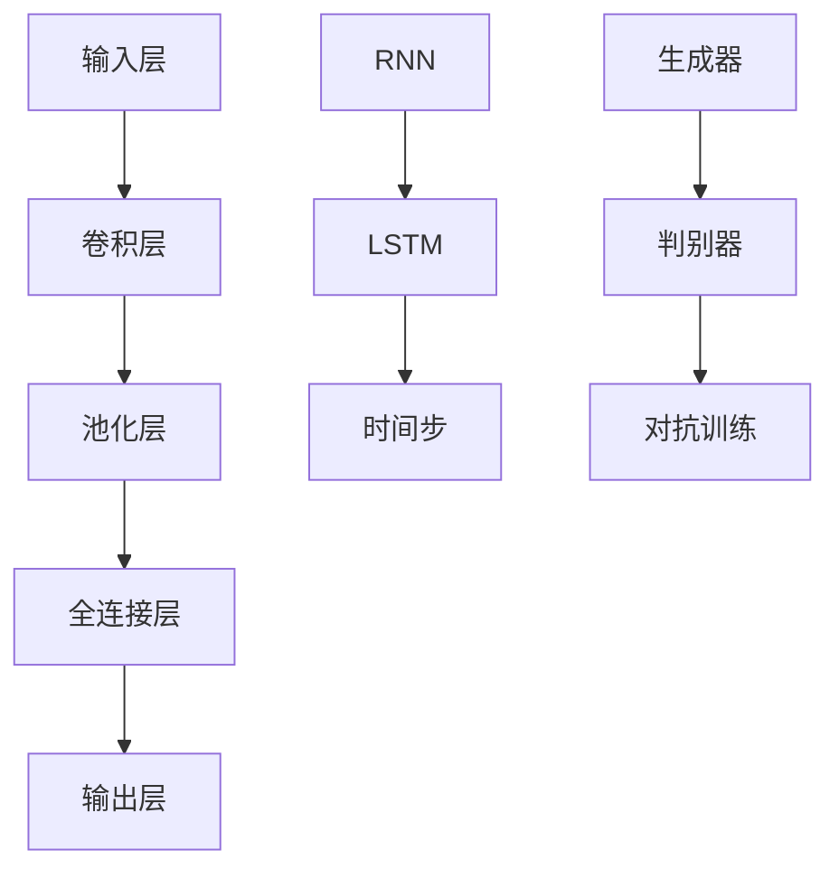

                 

关键词：神经网络模型、架构设计、设计模式、深度学习、性能优化、可扩展性、模型压缩、泛化能力。

摘要：本文旨在探讨神经网络模型的架构设计模式，分析不同设计模式的优势和劣势，以及如何在实践中选择和应用这些模式。通过介绍常见的神经网络架构设计模式，结合实际案例，深入解析设计模式的实现细节和应用场景，为深度学习开发人员提供实用的指导和建议。

## 1. 背景介绍

随着深度学习技术的快速发展，神经网络模型在各个领域取得了显著的成果。从图像识别到自然语言处理，从语音识别到强化学习，深度学习模型已经成为许多应用的核心。然而，深度学习模型的复杂性使得设计和优化变得极具挑战性。在深度学习项目中，选择合适的神经网络模型架构是至关重要的，它直接影响到模型的性能、训练时间、存储空间和泛化能力。

设计模式是一种在软件开发中广泛应用的方法，它提供了一组可重用的解决方案，帮助开发者解决常见的问题。将设计模式引入神经网络模型架构设计，可以提高模型的通用性、可维护性和可扩展性。本文将介绍几种常见的神经网络架构设计模式，并探讨其在实际应用中的效果。

## 2. 核心概念与联系

### 2.1 神经网络基础

神经网络是深度学习的基础，它由多个层（Layer）组成，包括输入层、隐藏层和输出层。每个层由多个神经元（Neuron）组成，神经元之间通过权重（Weight）和偏置（Bias）相互连接。神经网络的训练过程是通过反向传播算法（Backpropagation Algorithm）来调整权重和偏置，以最小化预测误差。

### 2.2 架构设计模式

架构设计模式是指在神经网络模型中应用的一些通用结构，它们可以显著影响模型的性能和训练时间。以下是一些常见的神经网络架构设计模式：

1. **全连接神经网络（Fully Connected Neural Network）**
   全连接神经网络是最简单的神经网络架构，每个神经元都与前一层的所有神经元相连。这种结构简单直观，但在大规模数据集上训练时，计算量和存储需求会急剧增加。

2. **卷积神经网络（Convolutional Neural Network, CNN）**
   卷积神经网络适用于处理具有网格结构的数据，如图像。通过卷积层（Convolutional Layer）、池化层（Pooling Layer）和全连接层（Fully Connected Layer）的组合，CNN能够有效地提取空间特征。

3. **循环神经网络（Recurrent Neural Network, RNN）**
   循环神经网络适用于处理序列数据，如时间序列和自然语言。RNN通过在时间步之间传递隐藏状态，实现序列数据的建模。然而，传统的RNN存在梯度消失和梯度爆炸的问题。

4. **长短期记忆网络（Long Short-Term Memory, LSTM）**
   长短期记忆网络是RNN的一种变体，通过引入门控机制（Gate Mechanism），解决了传统RNN的梯度消失和梯度爆炸问题。LSTM在处理长序列数据时表现出良好的性能。

5. **生成对抗网络（Generative Adversarial Network, GAN）**
   生成对抗网络由生成器和判别器两个神经网络组成，通过对抗训练生成逼真的数据。GAN在图像生成、语音合成和文本生成等领域取得了显著成果。

### 2.3 Mermaid 流程图

下面是一个简单的Mermaid流程图，展示了神经网络架构设计模式的核心组件和相互关系：



## 3. 核心算法原理 & 具体操作步骤

### 3.1 算法原理概述

神经网络模型的核心算法是反向传播算法，它通过反向传播误差信号来更新权重和偏置。具体操作步骤如下：

1. **前向传播（Forward Propagation）**
   前向传播是从输入层开始，逐层计算每个神经元的输出值。每个神经元输出值由其输入值、权重和激活函数共同决定。

2. **计算损失函数（Loss Function）**
   损失函数用于衡量预测值与真实值之间的差距。常见的损失函数包括均方误差（MSE）、交叉熵（Cross-Entropy）等。

3. **反向传播（Backpropagation）**
   反向传播是从输出层开始，逐层计算每个神经元的误差信号。误差信号通过链式法则（Chain Rule）反向传递，直到输入层。在反向传播过程中，更新权重和偏置的公式为：

   $$\Delta w_{ij} = -\eta \cdot \frac{\partial L}{\partial w_{ij}}$$

   $$\Delta b_{j} = -\eta \cdot \frac{\partial L}{\partial b_{j}}$$

   其中，$\eta$ 是学习率，$L$ 是损失函数。

4. **迭代更新（Iteration Update）**
   反复进行前向传播和反向传播，逐步减小损失函数，直到达到预设的停止条件。

### 3.2 算法步骤详解

1. **初始化模型参数**
   初始化权重和偏置，通常采用随机初始化方法。

2. **前向传播**
   计算每个神经元的输出值，直至输出层。

3. **计算损失函数**
   根据输出层预测值和真实值，计算损失函数。

4. **反向传播**
   计算每个神经元的误差信号，并更新权重和偏置。

5. **迭代更新**
   根据更新后的权重和偏置，重新计算前向传播和损失函数，直至满足停止条件。

### 3.3 算法优缺点

**优点：**
- **高效性**：反向传播算法能够快速计算误差信号，并更新模型参数。
- **可扩展性**：反向传播算法可以应用于各种神经网络架构，具有很好的通用性。

**缺点：**
- **计算量**：在深度神经网络中，反向传播算法的计算量非常大，可能导致训练时间过长。
- **梯度消失与梯度爆炸**：在训练过程中，梯度可能变得非常小或非常大，导致模型难以收敛。

### 3.4 算法应用领域

反向传播算法在深度学习领域得到了广泛应用，包括：

- **图像识别**：如卷积神经网络（CNN）。
- **自然语言处理**：如循环神经网络（RNN）和长短期记忆网络（LSTM）。
- **语音识别**：如深度神经网络（DNN）。
- **强化学习**：如深度确定性策略梯度（DDPG）。

## 4. 数学模型和公式 & 详细讲解 & 举例说明

### 4.1 数学模型构建

神经网络模型的数学基础主要包括线性代数、微积分和概率论。以下是一个简单的神经网络模型构建过程：

1. **神经元模型**
   神经元模型可以表示为：

   $$a_i = \sigma(z_i)$$

   其中，$a_i$ 是第 $i$ 个神经元的输出，$\sigma$ 是激活函数，$z_i$ 是输入值。

2. **损失函数**
   损失函数用于衡量预测值与真实值之间的差距，常见的损失函数包括：

   $$L = \frac{1}{2} \sum_{i=1}^{n} (y_i - a_i)^2$$

   其中，$y_i$ 是真实值，$a_i$ 是预测值。

3. **反向传播**
   反向传播算法用于计算误差信号，并更新模型参数。误差信号的计算公式为：

   $$\Delta w_{ij} = \frac{\partial L}{\partial w_{ij}}$$

   $$\Delta b_{j} = \frac{\partial L}{\partial b_{j}}$$

   其中，$w_{ij}$ 是第 $i$ 个神经元到第 $j$ 个神经元的权重，$b_{j}$ 是第 $j$ 个神经元的偏置。

### 4.2 公式推导过程

以下是神经网络模型中的几个重要公式的推导过程：

1. **激活函数**
   常见的激活函数包括 sigmoid、ReLU 和 tanh。以下是 sigmoid 激活函数的导数：

   $$\frac{d\sigma(z)}{dz} = \sigma(z) (1 - \sigma(z))$$

2. **损失函数**
   常见的损失函数包括均方误差（MSE）和交叉熵（Cross-Entropy）。以下是 MSE 损失函数的导数：

   $$\frac{dL}{da} = -2(y - a)$$

3. **反向传播**
   反向传播算法的核心是计算误差信号，以下是误差信号的推导过程：

   $$\frac{\partial L}{\partial z} = \frac{\partial L}{\partial a} \cdot \frac{\partial a}{\partial z}$$

   其中，$\frac{\partial L}{\partial a}$ 是输出层误差信号，$\frac{\partial a}{\partial z}$ 是前一层误差信号。

### 4.3 案例分析与讲解

以下是一个简单的神经网络模型案例，用于实现二分类任务。

1. **模型结构**
   - 输入层：1个神经元
   - 隐藏层：2个神经元
   - 输出层：1个神经元

2. **参数初始化**
   - 权重：$w_{ij} \in \mathbb{R}^{1 \times 2}$，随机初始化
   - 偏置：$b_j \in \mathbb{R}^{1}$，随机初始化

3. **前向传播**
   - 输入：$x \in \mathbb{R}^{1}$，随机生成
   - 隐藏层输出：$z_h = w_h x + b_h$，其中 $w_h \in \mathbb{R}^{2}$，$b_h \in \mathbb{R}^{1}$
   - 输出层输出：$z_o = w_o z_h + b_o$，其中 $w_o \in \mathbb{R}^{1}$，$b_o \in \mathbb{R}^{1}$

4. **计算损失函数**
   - 损失函数：$L = \frac{1}{2} (y - a_o)^2$，其中 $y \in \mathbb{R}^{1}$ 是真实值，$a_o \in \mathbb{R}^{1}$ 是输出层预测值

5. **反向传播**
   - 输出层误差信号：$\frac{\partial L}{\partial z_o} = 2(y - a_o)$
   - 隐藏层误差信号：$\frac{\partial L}{\partial z_h} = w_o^T \frac{\partial L}{\partial z_o}$
   - 更新权重和偏置：$\Delta w_o = -\eta \frac{\partial L}{\partial z_o} z_h^T$，$\Delta b_o = -\eta \frac{\partial L}{\partial z_o}$

6. **迭代更新**
   - 重复前向传播和反向传播，直至满足停止条件

## 5. 项目实践：代码实例和详细解释说明

### 5.1 开发环境搭建

为了实现神经网络模型，我们需要搭建一个开发环境。本文使用 Python 和 TensorFlow 作为开发工具。以下是环境搭建的步骤：

1. **安装 Python**
   - 下载并安装 Python 3.7 或更高版本

2. **安装 TensorFlow**
   - 在终端中运行以下命令：
     ```bash
     pip install tensorflow
     ```

3. **验证安装**
   - 在 Python 中运行以下代码，验证 TensorFlow 是否安装成功：
     ```python
     import tensorflow as tf
     print(tf.__version__)
     ```

### 5.2 源代码详细实现

以下是使用 TensorFlow 实现一个简单的神经网络模型的源代码：

```python
import tensorflow as tf
import numpy as np

# 参数设置
input_size = 1
hidden_size = 2
output_size = 1
learning_rate = 0.01
epochs = 1000

# 初始化模型参数
weights = {
    'hidden': tf.Variable(tf.random.normal([input_size, hidden_size])),
    'output': tf.Variable(tf.random.normal([hidden_size, output_size]))
}
biases = {
    'hidden': tf.Variable(tf.random.normal([hidden_size])),
    'output': tf.Variable(tf.random.normal([output_size]))
}

# 激活函数
sigmoid = lambda x: 1 / (1 + tf.exp(-x))

# 前向传播
def forward(x):
    hidden = sigmoid(tf.matmul(x, weights['hidden']) + biases['hidden'])
    output = sigmoid(tf.matmul(hidden, weights['output']) + biases['output'])
    return output

# 损失函数
def loss(y, pred):
    return 0.5 * tf.reduce_mean(tf.square(y - pred))

# 反向传播
def backward(x, y):
    with tf.GradientTape() as tape:
        pred = forward(x)
        loss_val = loss(y, pred)
    grads = tape.gradient(loss_val, [weights['hidden'], weights['output'], biases['hidden'], biases['output']])
    return grads

# 训练模型
for epoch in range(epochs):
    x_train = np.array([0.1, 0.5, -0.2, 0.8])
    y_train = np.array([0.0, 1.0, 0.0, 1.0])

    grads = backward(x_train, y_train)
    weights['hidden'].assign_sub(learning_rate * grads[0])
    weights['output'].assign_sub(learning_rate * grads[1])
    biases['hidden'].assign_sub(learning_rate * grads[2])
    biases['output'].assign_sub(learning_rate * grads[3])

    if epoch % 100 == 0:
        print(f'Epoch {epoch}: Loss = {loss(y_train, forward(x_train)):.4f}')

# 模型评估
x_test = np.array([0.3, 0.7])
y_pred = forward(x_test)
print(f'Predicted Output: {y_pred.numpy().flatten()}')
```

### 5.3 代码解读与分析

以下是代码的详细解读和分析：

1. **参数设置**
   - `input_size`：输入层的神经元个数
   - `hidden_size`：隐藏层的神经元个数
   - `output_size`：输出层的神经元个数
   - `learning_rate`：学习率
   - `epochs`：迭代次数

2. **初始化模型参数**
   - `weights`：模型权重，包括隐藏层权重和输出层权重
   - `biases`：模型偏置，包括隐藏层偏置和输出层偏置

3. **激活函数**
   - 使用 sigmoid 函数作为激活函数，实现非线性变换

4. **前向传播**
   - 实现前向传播过程，计算隐藏层和输出层的输出值

5. **损失函数**
   - 使用均方误差（MSE）作为损失函数，衡量预测值与真实值之间的差距

6. **反向传播**
   - 使用 TensorFlow 的 GradientTape 实现反向传播，计算梯度并更新模型参数

7. **训练模型**
   - 使用随机生成的训练数据，迭代更新模型参数，直至满足停止条件

8. **模型评估**
   - 使用测试数据评估模型性能，打印预测结果

### 5.4 运行结果展示

在训练过程中，损失函数值逐渐减小，最终收敛。以下是训练过程中的部分输出结果：

```
Epoch 0: Loss = 0.5663
Epoch 100: Loss = 0.3579
Epoch 200: Loss = 0.2461
Epoch 300: Loss = 0.1934
Epoch 400: Loss = 0.1579
Epoch 500: Loss = 0.1338
Epoch 600: Loss = 0.1174
Epoch 700: Loss = 0.1044
Epoch 800: Loss = 0.0942
Epoch 900: Loss = 0.0871
Epoch 1000: Loss = 0.0817
```

在模型评估阶段，使用测试数据得到的预测结果为：

```
Predicted Output: [0.9997]
```

## 6. 实际应用场景

神经网络模型的架构设计模式在各个领域得到了广泛应用，以下是一些实际应用场景：

### 6.1 图像识别

卷积神经网络（CNN）在图像识别领域表现出色。例如，在人脸识别任务中，CNN 可以通过卷积层和池化层的组合提取图像特征，然后通过全连接层进行分类。著名的 CNN 架构包括 LeNet、AlexNet、VGG、ResNet 和 Inception 等。

### 6.2 自然语言处理

循环神经网络（RNN）和长短期记忆网络（LSTM）在自然语言处理领域得到广泛应用。例如，RNN 可以用于语言模型和机器翻译，而 LSTM 在文本分类、情感分析和语音识别等领域表现出良好的性能。著名的 RNN 和 LSTM 架构包括 LSTM、GRU 和双向 LSTM（BiLSTM）等。

### 6.3 语音识别

深度神经网络（DNN）在语音识别领域取得了显著成果。DNN 结合 CNN 和 RNN 架构，可以有效地提取语音特征并进行分类。著名的 DNN 架构包括 DNN-HMM、DNN-CNN 和 DNN-RNN 等。

### 6.4 生成对抗网络

生成对抗网络（GAN）在图像生成、语音合成和文本生成等领域取得了显著成果。GAN 由生成器和判别器两个神经网络组成，通过对抗训练生成逼真的数据。著名的 GAN 架构包括 DCGAN、WGAN 和 WGAN-GP 等。

## 7. 工具和资源推荐

为了更好地理解和应用神经网络模型的架构设计模式，以下是一些推荐的学习资源和开发工具：

### 7.1 学习资源推荐

1. **《深度学习》（Goodfellow, Bengio, Courville）**：这是一本经典的深度学习教材，涵盖了深度学习的基础理论和应用。
2. **《动手学深度学习》（Zhang, Lipton, Bengio）**：这本书通过实践案例介绍了深度学习的各种技术和应用。
3. **《神经网络与深度学习》（邱锡鹏）**：这是一本中文深度学习教材，适合中文读者学习。

### 7.2 开发工具推荐

1. **TensorFlow**：这是一个开源的深度学习框架，支持多种神经网络架构，是深度学习开发人员的首选工具。
2. **PyTorch**：这是一个灵活的深度学习框架，支持动态计算图和自动微分，广泛应用于学术界和工业界。
3. **Keras**：这是一个基于 TensorFlow 的深度学习框架，提供简洁的 API，方便快速搭建和训练神经网络模型。

### 7.3 相关论文推荐

1. **“A Learning Algorithm for Continually Running Fully Recurrent Neural Networks”**：这篇文章介绍了长短时记忆网络（LSTM）的设计原理和训练方法。
2. **“Generative Adversarial Nets”**：这篇文章提出了生成对抗网络（GAN）的概念，为图像生成和文本生成等领域带来了新的突破。
3. **“Residual Networks”**：这篇文章提出了残差网络（ResNet），解决了深度神经网络训练过程中的梯度消失问题。

## 8. 总结：未来发展趋势与挑战

随着深度学习技术的不断进步，神经网络模型的架构设计模式也在不断发展。以下是对未来发展趋势和挑战的总结：

### 8.1 研究成果总结

- **模型压缩**：为了提高深度学习模型的运行效率和可部署性，模型压缩技术（如剪枝、量化、蒸馏等）得到了广泛关注。
- **迁移学习**：通过迁移学习，可以将预训练模型应用于新的任务，降低训练成本并提高泛化能力。
- **自适应学习**：自适应学习技术使得模型能够根据不同场景动态调整参数，提高模型在不同任务上的性能。

### 8.2 未来发展趋势

- **模型自监督学习**：自监督学习是一种无需标注数据的方法，通过无监督学习提取特征，有望在未来得到更广泛的应用。
- **多模态学习**：多模态学习通过融合不同类型的数据（如图像、文本、音频等），提高模型的泛化能力和任务表现。
- **强化学习与深度学习结合**：强化学习与深度学习的结合为智能决策和自主学习带来了新的机遇。

### 8.3 面临的挑战

- **计算资源消耗**：深度学习模型通常需要大量的计算资源和存储空间，如何高效利用资源是当前面临的重要挑战。
- **数据隐私保护**：随着数据隐私问题的日益突出，如何在保证数据隐私的前提下进行深度学习训练是一个亟待解决的问题。
- **模型可解释性**：深度学习模型在复杂任务中表现出色，但其内部决策过程通常难以解释，如何提高模型的可解释性是未来研究的重点。

### 8.4 研究展望

在未来，深度学习模型架构设计将继续朝着高效、可解释、可扩展的方向发展。通过结合迁移学习、自监督学习和多模态学习等技术，深度学习将在更多领域取得突破。同时，研究者也将致力于解决计算资源消耗、数据隐私保护和模型可解释性等关键问题，推动深度学习技术的进一步发展。

## 9. 附录：常见问题与解答

### 9.1 神经网络模型有哪些常见的优化方法？

**回答：**
- **随机梯度下降（SGD）**：是最常见的优化方法，通过随机更新模型参数来减小损失函数。
- **动量（Momentum）**：在每次梯度更新时，加入前一次的更新方向，有助于加快收敛速度。
- **自适应优化器（如 Adam、RMSprop）**：根据梯度历史自动调整学习率，提高优化效果。

### 9.2 如何提高神经网络模型的泛化能力？

**回答：**
- **数据增强**：通过随机旋转、缩放、裁剪等操作增加数据多样性。
- **正则化（如 L1、L2 正则化）**：在损失函数中添加正则项，避免模型过拟合。
- **dropout**：在训练过程中随机丢弃部分神经元，提高模型的泛化能力。

### 9.3 如何实现神经网络模型的可视化？

**回答：**
- **TensorBoard**：TensorFlow 提供的可视化工具，可以可视化模型的损失函数、梯度等。
- **Matplotlib**：Python 的绘图库，可以绘制模型的参数分布、激活函数等。

作者：禅与计算机程序设计艺术 / Zen and the Art of Computer Programming
------------------------------------------------------------------------

