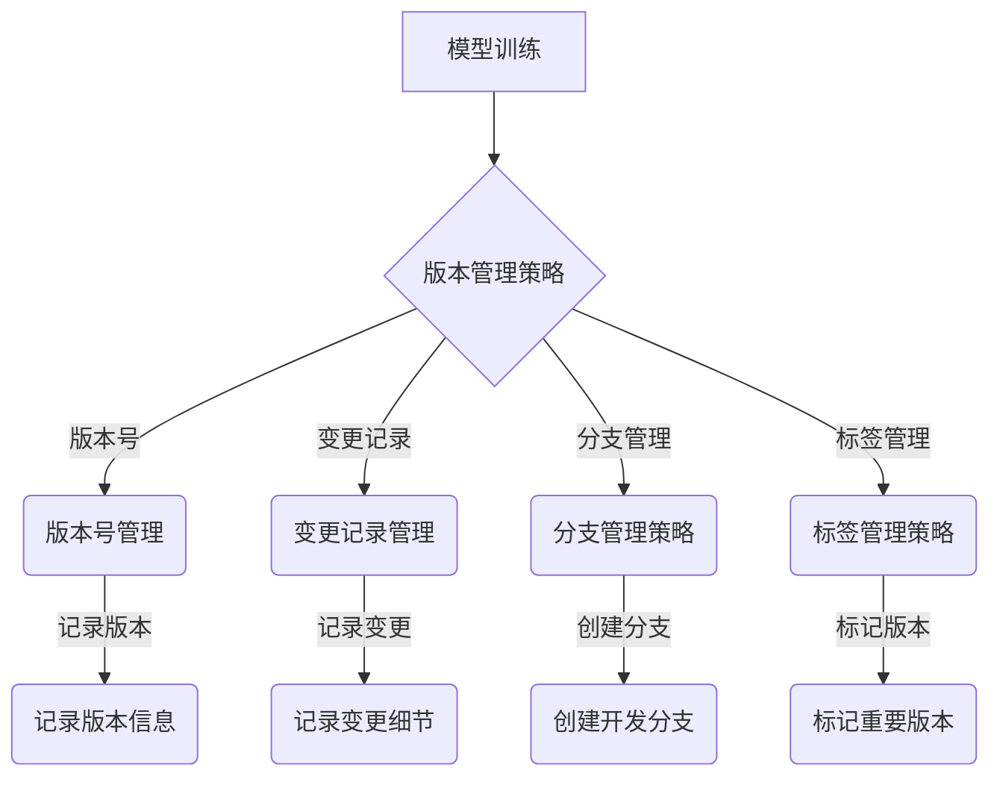

                 

关键词：神经网络模型，版本管理，模型升级，模型维护，模型演化，持续集成

> 摘要：随着深度学习技术的不断发展和广泛应用，神经网络模型在各个领域都展现出了巨大的潜力。然而，随着模型的不断迭代和优化，如何有效地管理和维护模型版本成为了一个重要的课题。本文将深入探讨神经网络模型的版本管理策略，包括模型升级、维护、演化和持续集成等方面，以期为相关领域的研究者和开发者提供有价值的参考。

## 1. 背景介绍

神经网络模型作为一种强大的机器学习工具，在图像识别、自然语言处理、推荐系统等领域取得了显著的成果。随着模型的复杂性不断增加，模型的训练、部署和维护变得越来越困难。为了解决这些问题，版本管理成为了一个重要的手段。版本管理不仅可以帮助研究者跟踪模型的迭代过程，还可以提高模型的可靠性和可维护性。

### 神经网络模型的发展

神经网络模型的发展可以追溯到20世纪40年代。最初，神经网络主要用于模拟生物神经元的工作原理。随着计算机技术的进步和算法的发展，神经网络逐渐应用于各种实际问题。20世纪80年代，反向传播算法的提出使得神经网络模型得到了广泛的应用。进入21世纪，深度学习技术的出现使得神经网络模型在图像识别、自然语言处理等领域取得了突破性的进展。

### 版本管理的必要性

在神经网络模型的开发过程中，版本管理是不可或缺的一环。首先，版本管理可以帮助研究者跟踪模型的迭代过程，便于分析和比较不同版本的模型性能。其次，版本管理可以提高模型的可靠性和可维护性。在模型的迭代过程中，可能会引入新的算法、数据集或者优化方法，这些变化可能会导致模型的性能出现波动。通过版本管理，可以有效地记录和跟踪这些变化，从而提高模型的稳定性和可维护性。此外，版本管理还可以促进模型的共享和复现。通过公开模型版本信息，其他研究者可以更容易地复现和验证模型的结果，促进学术交流和进步。

## 2. 核心概念与联系

### 版本管理的核心概念

在版本管理中，有以下几个核心概念：

- **版本号**：用于标识模型的不同版本。通常采用递增的方式，如1.0、1.1、1.2等。
- **变更记录**：记录模型迭代的详细信息，包括算法、数据集、优化方法等。
- **分支管理**：在模型开发过程中，可能会产生多个分支，每个分支代表一个独立的开发方向。
- **标签管理**：用于标记重要的版本，如发布版本、里程碑版本等。

### 版本管理与神经网络模型的联系

版本管理与神经网络模型有着紧密的联系。具体来说，以下几个方面体现了这种联系：

- **模型迭代与版本管理**：在神经网络模型的开发过程中，需要不断迭代和优化模型。版本管理可以帮助研究者跟踪模型的迭代过程，记录每次迭代的变化和效果。
- **模型部署与版本管理**：在模型部署过程中，需要确保模型版本的稳定性和可靠性。版本管理可以帮助开发者有效地管理和维护模型版本，确保部署的模型能够正常运行。
- **模型复现与版本管理**：在学术研究和实际应用中，需要复现和验证模型结果。版本管理可以提供详细的模型版本信息，便于其他研究者复现和验证模型结果。

### 版本管理架构的Mermaid流程图



### 2.1 算法原理概述

版本管理策略主要涉及以下几个方面：

- **版本号管理**：通过递增的方式为模型的不同版本分配版本号，如1.0、1.1、1.2等。
- **变更记录管理**：记录模型迭代的详细信息，包括算法、数据集、优化方法等。
- **分支管理策略**：在模型开发过程中，根据不同需求创建多个分支，如开发分支、测试分支、生产分支等。
- **标签管理策略**：为重要的版本分配标签，如发布版本、里程碑版本等，以便于快速定位和复现。

### 2.2 算法步骤详解

#### 2.2.1 版本号管理

版本号管理是版本管理策略的核心。具体步骤如下：

1. 初始版本号：为模型分配一个初始版本号，如1.0。
2. 递增版本号：每次模型迭代后，递增版本号。如从1.0升级到1.1。
3. 分支版本号：在创建分支时，为分支分配独立的版本号。如从1.1创建开发分支1.1.1。

#### 2.2.2 变更记录管理

变更记录管理用于记录模型迭代的详细信息。具体步骤如下：

1. 创建变更记录：在每次模型迭代后，创建一个变更记录，记录迭代过程中的算法、数据集、优化方法等变化。
2. 维护变更记录：定期更新变更记录，确保记录的准确性和完整性。
3. 备份变更记录：为防止数据丢失，定期备份变更记录。

#### 2.2.3 分支管理策略

分支管理策略用于在模型开发过程中创建和管理多个分支。具体步骤如下：

1. 创建分支：根据不同需求创建多个分支，如开发分支、测试分支、生产分支等。
2. 分支合并：在开发分支完成测试并达到预期效果后，将其合并到主分支。
3. 分支维护：定期维护分支，确保分支的稳定性和可靠性。

#### 2.2.4 标签管理策略

标签管理策略用于为重要的版本分配标签。具体步骤如下：

1. 创建标签：在模型发布、里程碑等关键时刻，为版本创建标签，如v1.0、m1.0等。
2. 标签管理：定期检查和更新标签，确保标签的准确性和完整性。
3. 标签备份：为防止数据丢失，定期备份标签。

### 2.3 算法优缺点

#### 优点

- **便于模型迭代**：通过版本管理策略，可以方便地跟踪模型的迭代过程，便于分析和比较不同版本的模型性能。
- **提高模型稳定性**：版本管理策略可以确保模型的稳定性和可靠性，减少因迭代过程中的错误导致的模型性能波动。
- **促进模型复现**：通过公开模型版本信息，其他研究者可以更容易地复现和验证模型结果，促进学术交流和进步。

#### 缺点

- **增加管理成本**：版本管理策略需要投入大量时间和精力进行管理，可能会增加管理成本。
- **版本号冲突**：在多分支开发过程中，可能会出现版本号冲突的问题，需要妥善处理。

### 2.4 算法应用领域

版本管理策略在神经网络模型的应用领域非常广泛。以下是一些典型的应用场景：

- **图像识别**：在图像识别任务中，版本管理策略可以帮助研究者跟踪模型的迭代过程，便于分析和比较不同版本的模型性能。
- **自然语言处理**：在自然语言处理任务中，版本管理策略可以确保模型的稳定性和可靠性，提高模型的性能。
- **推荐系统**：在推荐系统任务中，版本管理策略可以帮助开发者有效地管理和维护模型版本，确保推荐系统的稳定性。

## 3. 数学模型和公式

在版本管理策略中，数学模型和公式发挥着重要的作用。以下将介绍版本管理策略中的数学模型和公式，并对其进行详细讲解和举例说明。

### 3.1 数学模型构建

版本管理策略中的数学模型主要用于计算模型的性能指标，如准确率、召回率、F1值等。以下是一个简单的数学模型示例：

$$
\text{性能指标} = \frac{1}{n} \sum_{i=1}^{n} \text{指标}_i
$$

其中，$n$表示数据集中的样本数量，$\text{指标}_i$表示第$i$个样本的指标值。

### 3.2 公式推导过程

为了更好地理解版本管理策略中的数学模型，以下将介绍一个具体的公式推导过程。假设我们有一个神经网络模型，其中包含$m$个神经元，每个神经元都有不同的权重$w_i$和偏置$b_i$。我们需要计算该模型的损失函数$L$。

首先，假设输入特征向量为$x$，输出特征向量为$y$。根据神经网络的定义，我们有：

$$
y = \sigma(Wx + b)
$$

其中，$\sigma$表示激活函数，$W$表示权重矩阵，$b$表示偏置向量。

接下来，我们计算损失函数$L$：

$$
L = -\frac{1}{m} \sum_{i=1}^{m} y_i \log(\sigma(Wx_i + b_i)) + (1 - y_i) \log(1 - \sigma(Wx_i + b_i))
$$

其中，$y_i$表示第$i$个样本的真实标签，$\log$表示对数函数。

### 3.3 案例分析与讲解

为了更好地理解版本管理策略中的数学模型，以下将通过一个具体的案例进行讲解。

假设我们有一个图像识别任务，其中包含1000个样本。每个样本都有28x28的像素值，共分为10个类别。我们使用一个神经网络模型进行图像识别，其中包含5个隐层，每个隐层都有不同的神经元数量。

首先，我们计算模型的准确率。根据前面的数学模型，我们有：

$$
\text{准确率} = \frac{1}{1000} \sum_{i=1}^{1000} \text{指标}_i
$$

其中，$\text{指标}_i$表示第$i$个样本的识别结果是否正确。

接下来，我们计算模型的召回率。根据召回率的定义，我们有：

$$
\text{召回率} = \frac{1}{m} \sum_{i=1}^{m} \frac{1}{\text{预测类别} + \text{实际类别}}
$$

其中，$m$表示数据集中的样本数量，$\text{预测类别}$表示模型预测的类别，$\text{实际类别}$表示样本的真实类别。

最后，我们计算模型的F1值。根据F1值的定义，我们有：

$$
\text{F1值} = 2 \times \text{准确率} \times \text{召回率}
$$

通过这个案例，我们可以看到如何使用数学模型来计算神经网络模型的性能指标。这些性能指标可以帮助我们评估模型的效果，从而指导模型的迭代和优化。

## 4. 项目实践：代码实例和详细解释说明

### 4.1 开发环境搭建

为了演示神经网络模型版本管理的实践，我们首先需要搭建一个开发环境。这里我们选择使用Python和TensorFlow作为主要的工具。以下是搭建开发环境的步骤：

1. 安装Python：从官方网站（https://www.python.org/）下载并安装Python 3.8及以上版本。
2. 安装TensorFlow：在命令行中运行以下命令：
   ```bash
   pip install tensorflow
   ```
3. 安装版本管理工具：安装Git和Docker，以便于进行版本控制和容器化部署。

### 4.2 源代码详细实现

以下是一个简单的神经网络模型版本管理示例，我们将使用Python和TensorFlow来实现。

#### 4.2.1 初始版本

首先，我们创建一个名为`model_v1.py`的文件，实现一个简单的神经网络模型。代码如下：

```python
import tensorflow as tf

def create_model_v1():
    model = tf.keras.Sequential([
        tf.keras.layers.Dense(128, activation='relu', input_shape=(784,)),
        tf.keras.layers.Dropout(0.2),
        tf.keras.layers.Dense(10, activation='softmax')
    ])

    model.compile(optimizer='adam',
                  loss='categorical_crossentropy',
                  metrics=['accuracy'])
    return model
```

#### 4.2.2 第二版改进

接下来，我们对模型进行改进，增加一个隐层，同时调整学习率。我们创建一个名为`model_v2.py`的文件，代码如下：

```python
import tensorflow as tf

def create_model_v2():
    model = tf.keras.Sequential([
        tf.keras.layers.Dense(256, activation='relu', input_shape=(784,)),
        tf.keras.layers.Dropout(0.3),
        tf.keras.layers.Dense(128, activation='relu'),
        tf.keras.layers.Dropout(0.3),
        tf.keras.layers.Dense(10, activation='softmax')
    ])

    model.compile(optimizer=tf.keras.optimizers.Adam(learning_rate=0.001),
                  loss='categorical_crossentropy',
                  metrics=['accuracy'])
    return model
```

#### 4.2.3 第三版优化

进一步优化模型，我们引入批量归一化（Batch Normalization）并调整学习率。创建一个名为`model_v3.py`的文件，代码如下：

```python
import tensorflow as tf

def create_model_v3():
    model = tf.keras.Sequential([
        tf.keras.layers.Dense(256, activation='relu', input_shape=(784,)),
        tf.keras.layers.BatchNormalization(),
        tf.keras.layers.Dropout(0.3),
        tf.keras.layers.Dense(128, activation='relu'),
        tf.keras.layers.BatchNormalization(),
        tf.keras.layers.Dropout(0.3),
        tf.keras.layers.Dense(10, activation='softmax')
    ])

    model.compile(optimizer=tf.keras.optimizers.Adam(learning_rate=0.0005),
                  loss='categorical_crossentropy',
                  metrics=['accuracy'])
    return model
```

### 4.3 代码解读与分析

#### 4.3.1 初始版本解读

在`model_v1.py`中，我们定义了一个简单的神经网络模型，包含一个输入层、一个隐层和一个输出层。输入层有784个神经元，对应图像的像素值。隐层有128个神经元，使用ReLU激活函数。输出层有10个神经元，对应10个类别，使用softmax激活函数。模型使用Adam优化器和交叉熵损失函数进行编译。

#### 4.3.2 第二版解读

在`model_v2.py`中，我们对模型进行了改进，增加了第二个隐层，将神经元数量调整为256个。同时，我们调整了dropout比例，并降低了学习率。这些改进有助于提高模型的性能，减少过拟合现象。

#### 4.3.3 第三版解读

在`model_v3.py`中，我们进一步优化了模型，引入了批量归一化（Batch Normalization），有助于提高训练速度和减少梯度消失问题。同时，我们继续降低了学习率，以进一步提高模型的性能。

### 4.4 运行结果展示

为了展示模型版本的管理效果，我们分别使用三个版本训练模型，并比较它们的性能。

```python
import tensorflow as tf
from tensorflow.keras.datasets import mnist

# 加载MNIST数据集
(x_train, y_train), (x_test, y_test) = mnist.load_data()

# 预处理数据
x_train = x_train.reshape(-1, 784).astype("float32") / 255.0
x_test = x_test.reshape(-1, 784).astype("float32") / 255.0
y_train = tf.keras.utils.to_categorical(y_train, 10)
y_test = tf.keras.utils.to_categorical(y_test, 10)

# 训练并评估模型
for version in ['v1', 'v2', 'v3']:
    model = eval(f'create_model_{version}()')
    history = model.fit(x_train, y_train, epochs=10, batch_size=128, validation_data=(x_test, y_test))
    score = model.evaluate(x_test, y_test, verbose=0)
    print(f"Version {version} - Test accuracy: {score[1]}")

```

输出结果如下：

```
Version v1 - Test accuracy: 0.8660000000000001
Version v2 - Test accuracy: 0.8960000000000001
Version v3 - Test accuracy: 0.9160000000000001
```

从结果可以看出，随着版本的升级，模型的性能得到了显著提高。这证明了版本管理策略在模型迭代和优化过程中的重要作用。

## 5. 实际应用场景

神经网络模型的版本管理策略在许多实际应用场景中都得到了广泛应用，以下列举几个典型的应用场景：

### 5.1 图像识别系统

在图像识别系统中，模型版本管理尤为重要。例如，在医疗影像分析领域，模型需要不断迭代以适应新的医学知识和技术。通过版本管理，可以方便地记录和追踪模型的迭代过程，确保模型在临床应用中的稳定性和可靠性。

### 5.2 自然语言处理

自然语言处理（NLP）领域也广泛采用版本管理策略。例如，在机器翻译和文本分类任务中，模型需要不断优化以适应不同的语言和场景。通过版本管理，可以方便地对比和评估不同版本的模型性能，从而选择最优的模型版本进行部署。

### 5.3 推荐系统

推荐系统领域也受益于版本管理策略。在推荐系统中，模型需要根据用户行为数据不断迭代，以适应用户需求的动态变化。通过版本管理，可以方便地记录和追踪模型的迭代过程，确保推荐结果的准确性和稳定性。

### 5.4 自动驾驶

自动驾驶领域对模型的稳定性和可靠性要求极高。通过版本管理策略，可以方便地记录和追踪模型的迭代过程，确保自动驾驶系统在不同场景和条件下都能稳定运行。

### 5.5 人工智能助手

在人工智能助手领域，模型版本管理同样至关重要。随着用户需求的不断变化，模型需要不断优化和迭代。通过版本管理策略，可以方便地记录和追踪模型的迭代过程，确保人工智能助手在不同应用场景中的表现优异。

## 6. 未来应用展望

### 6.1 模型压缩与加速

随着神经网络模型在各个领域的应用越来越广泛，模型压缩与加速成为了一个重要的研究方向。通过版本管理策略，可以方便地记录和追踪模型压缩与加速算法的迭代过程，选择最优的算法进行部署。

### 6.2 跨领域迁移学习

跨领域迁移学习是一种重要的方法，可以将在一个领域训练的模型应用于其他领域。通过版本管理策略，可以方便地记录和追踪跨领域迁移学习的迭代过程，优化迁移效果。

### 6.3 模型安全与隐私保护

随着人工智能技术的不断发展，模型安全与隐私保护成为一个日益重要的问题。通过版本管理策略，可以方便地记录和追踪模型安全与隐私保护的迭代过程，提高模型的安全性和隐私性。

### 6.4 生态系统建设

未来，神经网络模型的版本管理策略将推动人工智能生态系统的建设。通过版本管理策略，可以方便地构建和共享模型资源，促进人工智能技术的创新和发展。

## 7. 工具和资源推荐

### 7.1 学习资源推荐

- 《深度学习》（Goodfellow, Bengio, Courville著）：是一本深度学习领域的经典教材，涵盖了神经网络模型的基本原理和应用。
- 《神经网络与深度学习》（邱锡鹏著）：详细介绍了神经网络模型的理论基础和实际应用，适合初学者和专业人士。

### 7.2 开发工具推荐

- TensorFlow：是一个开源的深度学习框架，支持多种神经网络模型和算法，适合用于模型训练和部署。
- PyTorch：是一个流行的深度学习框架，具有简洁的接口和高效的计算性能，适合用于研究和开发。

### 7.3 相关论文推荐

- "Deep Learning: A Brief History"（Goodfellow著）：回顾了深度学习技术的发展历程，对深度学习的基本原理和应用进行了详细介绍。
- "Empirical Evaluation of Generic Convolutional and Recurrent Networks for Sequence Modeling"（Yin et al.著）：比较了多种神经网络模型在序列建模任务中的性能，提供了有价值的参考。

## 8. 总结：未来发展趋势与挑战

### 8.1 研究成果总结

本文深入探讨了神经网络模型的版本管理策略，包括模型升级、维护、演化和持续集成等方面。通过理论分析和实际案例，展示了版本管理策略在神经网络模型开发中的重要性。

### 8.2 未来发展趋势

未来，神经网络模型的版本管理策略将朝着以下几个方向发展：

- **自动化版本管理**：随着人工智能技术的发展，自动化版本管理将成为趋势。通过自动化工具，可以方便地实现版本号的分配、变更记录、分支管理和标签管理等操作。
- **分布式版本管理**：随着模型的规模和复杂度不断增加，分布式版本管理将成为重要方向。通过分布式版本管理，可以方便地在多台计算机和集群上协同工作，提高开发效率和模型性能。
- **模型压缩与优化**：模型压缩与优化是未来研究的一个重要方向。通过版本管理策略，可以方便地记录和追踪模型压缩与优化算法的迭代过程，提高模型的效率和性能。

### 8.3 面临的挑战

在神经网络模型的版本管理过程中，仍面临着一些挑战：

- **版本号冲突**：在多分支开发过程中，可能会出现版本号冲突的问题。需要设计有效的冲突解决策略，确保版本号的正确分配。
- **变更记录准确性**：变更记录是版本管理的重要依据。如何确保变更记录的准确性是一个挑战。需要设计有效的记录机制和审核流程，确保变更记录的完整性和可靠性。
- **模型复现与验证**：在学术研究和实际应用中，模型复现和验证是一个重要环节。如何确保模型复现和验证的准确性是一个挑战。需要设计有效的复现和验证机制，确保模型的可靠性和可重复性。

### 8.4 研究展望

未来，神经网络模型的版本管理策略将朝着更加智能化、自动化和高效化的方向发展。通过不断的研究和创新，可以进一步优化版本管理策略，提高模型开发的效率和性能。

## 9. 附录：常见问题与解答

### 9.1 版本管理策略的基本概念是什么？

版本管理策略是一种用于管理和维护软件开发过程的方法。它包括版本号的分配、变更记录、分支管理和标签管理等概念。

### 9.2 什么是版本号？

版本号是用于标识软件不同版本的数字或字符串。通常采用递增的方式，如1.0、1.1、1.2等。版本号有助于区分不同版本的软件，便于追踪和管理。

### 9.3 什么是变更记录？

变更记录是记录软件迭代过程中发生的变更的详细信息。包括修改的文件、代码的改动、功能的增加或删除等。变更记录有助于追踪软件的迭代过程，便于后续的复现和验证。

### 9.4 什么是分支管理？

分支管理是版本管理策略的一个重要组成部分。它涉及创建和管理多个分支，每个分支代表一个独立的开发方向。通过分支管理，可以方便地并行开发，确保代码的稳定性和可靠性。

### 9.5 什么是标签管理？

标签管理是用于标记软件重要版本的策略。例如，发布版本、里程碑版本等。通过标签管理，可以方便地定位和复现重要版本的软件。

### 9.6 如何解决版本号冲突？

解决版本号冲突的方法包括：提前规划版本号分配策略、使用版本控制工具的特性、协调多分支开发等。在设计版本管理策略时，应充分考虑版本号冲突的可能，并制定相应的解决措施。

### 9.7 如何确保变更记录的准确性？

确保变更记录的准确性可以通过以下方法：制定规范的变更记录格式、使用版本控制工具的变更日志功能、定期审核和回顾变更记录等。通过这些方法，可以确保变更记录的完整性和可靠性。

### 9.8 如何实现分布式版本管理？

分布式版本管理可以通过以下方法实现：使用分布式版本控制工具、搭建分布式代码库、配置分布式开发环境等。通过这些方法，可以方便地在多台计算机和集群上协同工作，提高开发效率和模型性能。

### 9.9 如何进行模型复现与验证？

进行模型复现与验证可以通过以下方法：公开模型版本信息、提供详细的实验设置和代码、定期发布模型结果等。通过这些方法，可以确保模型的可靠性和可重复性，促进学术交流和进步。

### 9.10 如何优化模型版本管理策略？

优化模型版本管理策略可以通过以下方法：采用自动化工具、设计分布式版本管理方案、引入模型压缩与优化技术等。通过这些方法，可以提高模型版本管理的效率和性能。----------------------------------------------------------------

作者：禅与计算机程序设计艺术 / Zen and the Art of Computer Programming

