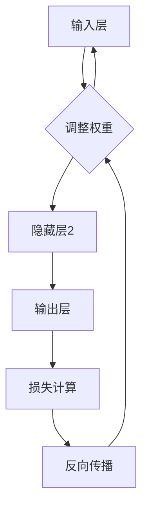

                 

### 关键词 Keywords
- 神经网络
- 人工智能
- 深度学习
- 计算机视觉
- 自然语言处理
- 机器学习算法
- 生物灵感

<|assistant|>### 摘要 Abstract
本文探讨了神经网络作为现代人工智能的核心技术，如何正在重塑人类与机器的互动关系。从神经网络的起源、核心概念、算法原理、数学模型，到项目实践和实际应用，本文将深入剖析神经网络的技术内涵和未来潜力。通过详细讲解和案例分析，本文旨在为读者提供一个全面理解神经网络及其在多个领域应用的视角，并展望其未来的发展趋势与挑战。

## 1. 背景介绍

### 神经网络的起源

神经网络的概念可以追溯到1940年代，由心理学家McCulloch和数学家Pitts提出的。他们提出了人工神经元模型，模拟了人类大脑中神经细胞的基本功能。尽管早期神经网络的研究进展缓慢，但随着计算机技术的发展，特别是20世纪80年代后，神经网络逐渐成为机器学习领域的重要研究方向。

### 神经网络的发展历程

1986年，Rumelhart、Hinton和Williams提出了反向传播算法（Backpropagation），这一突破性的算法使得多层神经网络训练成为可能。此后，神经网络的研究和应用迎来了黄金时期。尤其是深度学习的兴起，使得神经网络在图像识别、语音识别、自然语言处理等领域取得了显著的成果。

### 神经网络在人工智能中的作用

神经网络作为人工智能的核心技术，正在深刻改变我们的生活方式。从自动驾驶汽车到智能助手，从医疗诊断到金融分析，神经网络的应用范围日益广泛。它不仅提升了机器的智能水平，也推动了人类与机器的共存。

## 2. 核心概念与联系

神经网络，也被称为人工神经网络（Artificial Neural Networks，ANN），是一种模拟生物神经系统的计算模型。在神经网络中，基本单位是神经元（neurons），它们通过复杂的网络连接进行信息传递和处理。

### 神经元模型

神经元模型通常包含以下三个部分：

1. **输入层**：接收外部输入信号。
2. **隐藏层**：对输入信号进行加工和变换。
3. **输出层**：产生最终输出。

神经元之间通过加权连接（synapses）相互连接，每个连接都有一个权重（weight），这些权重决定了信号在传递过程中的强度。

### 神经网络的架构

神经网络可以分为两类：

1. **前馈神经网络**：信息单向流动，从输入层经过隐藏层，最终到达输出层。
2. **反馈神经网络**：存在反馈回路，信息可以在网络中循环。

### 神经网络的学习过程

神经网络通过学习调整权重来实现对数据的建模。这个过程通常包括以下几个步骤：

1. **前向传播**：将输入信号通过网络传递到输出层。
2. **损失计算**：计算输出结果与实际结果之间的差异。
3. **反向传播**：根据损失值调整网络的权重。

### Mermaid 流程图

以下是一个简化的神经网络流程图：



<|assistant|>### 3. 核心算法原理 & 具体操作步骤
### 3.1 算法原理概述

神经网络的核心算法原理基于模拟生物神经系统的运作机制。每个神经元接收多个输入信号，通过加权求和处理后，产生一个输出信号。这个过程可以通过以下步骤来理解：

1. **输入层**：接收外部输入，每个输入都有对应的权重。
2. **隐藏层**：对输入信号进行加工和变换，每个隐藏层神经元都接收来自前一层的输出。
3. **输出层**：产生最终输出，这个输出可以通过激活函数进行处理，以决定神经元是否被激活。

神经网络的学习过程包括两个主要阶段：

1. **前向传播**：从输入层开始，将输入信号通过网络传递到输出层，得到预测结果。
2. **反向传播**：计算预测结果与实际结果之间的差异，通过调整网络的权重来最小化损失函数。

### 3.2 算法步骤详解

以下是神经网络算法的具体操作步骤：

1. **初始化权重和偏置**：
   - 初始化所有权重和偏置为小的随机值。
   - 通常使用正态分布或均匀分布来初始化。

2. **前向传播**：
   - 将输入信号传递到第一个隐藏层。
   - 对每个神经元执行以下操作：
     - 计算输入信号的加权和，加上偏置。
     - 通过激活函数进行处理，如Sigmoid、ReLU等。
   - 将处理后的输出传递到下一个隐藏层，重复上述步骤，直到输出层。

3. **损失计算**：
   - 计算输出结果与实际结果之间的差异，通常使用均方误差（MSE）或交叉熵（Cross-Entropy）作为损失函数。
   - 损失函数的值越小，表示模型预测的越准确。

4. **反向传播**：
   - 从输出层开始，计算每个神经元的梯度。
   - 更新每个权重的值，以减少损失函数的值。

5. **迭代优化**：
   - 重复前向传播和反向传播的过程，直到满足停止条件，如达到预定的迭代次数或损失函数收敛。

### 3.3 算法优缺点

**优点**：

1. **强大的拟合能力**：神经网络可以通过学习复杂的非线性关系，实现高精度的预测。
2. **自适应性和泛化能力**：神经网络可以根据新的数据自动调整权重，具有较好的泛化能力。
3. **多任务学习**：神经网络可以通过共享权重实现多任务学习，提高计算效率。

**缺点**：

1. **计算资源消耗**：深度神经网络训练需要大量的计算资源和时间。
2. **对数据质量依赖**：训练数据的质量对神经网络性能有很大影响，数据噪声和缺失值可能导致过拟合。
3. **黑箱模型**：神经网络内部结构复杂，难以解释，对于非专业人士来说难以理解。

### 3.4 算法应用领域

神经网络在多个领域都有广泛的应用：

1. **计算机视觉**：图像分类、目标检测、人脸识别等。
2. **自然语言处理**：文本分类、情感分析、机器翻译等。
3. **语音识别**：语音合成、语音识别等。
4. **医疗诊断**：疾病预测、病理分析等。
5. **金融分析**：风险评估、股票预测等。

## 4. 数学模型和公式 & 详细讲解 & 举例说明

### 4.1 数学模型构建

神经网络的数学模型基于以下基本概念：

1. **线性变换**：每个神经元接收多个输入信号，通过加权求和处理得到一个输出。
2. **激活函数**：用于决定神经元是否被激活，常见的激活函数有Sigmoid、ReLU等。
3. **损失函数**：用于评估模型的预测性能，常见的损失函数有均方误差（MSE）、交叉熵（Cross-Entropy）等。

### 4.2 公式推导过程

以下是神经网络中常用的几个公式：

1. **前向传播公式**：
   $$ 
   z_i = \sum_{j} w_{ij} x_j + b_i 
   $$
   $$
   a_i = \sigma(z_i) 
   $$
   其中，$z_i$表示神经元$i$的输入，$a_i$表示神经元$i$的输出，$w_{ij}$表示输入$x_j$与神经元$i$之间的权重，$b_i$表示神经元$i$的偏置，$\sigma$表示激活函数。

2. **反向传播公式**：
   $$
   \delta_i = \frac{\partial L}{\partial z_i} \cdot \sigma'(z_i) 
   $$
   $$
   \delta_{ji} = \delta_j \cdot a_{ji} 
   $$
   $$
   \frac{\partial L}{\partial w_{ij}} = \delta_i \cdot x_j 
   $$
   $$
   \frac{\partial L}{\partial b_i} = \delta_i 
   $$
   其中，$L$表示损失函数，$\delta$表示误差项，$\sigma'$表示激活函数的导数。

### 4.3 案例分析与讲解

以下是一个简单的神经网络模型，用于实现一个二元分类任务。

1. **模型参数**：
   - 输入维度：2
   - 隐藏层尺寸：3
   - 输出维度：1
   - 激活函数：Sigmoid

2. **输入数据**：
   $$
   x_1 = [1, 0], x_2 = [0, 1], x_3 = [1, 1], x_4 = [0, 0]
   $$
   $$
   y_1 = [0], y_2 = [1], y_3 = [1], y_4 = [0]
   $$

3. **模型训练**：
   - 初始化权重和偏置为小的随机值。
   - 使用输入数据和标签进行前向传播，计算输出结果。
   - 计算损失函数，使用反向传播调整权重和偏置。
   - 重复上述过程，直到损失函数收敛。

4. **模型预测**：
   - 对新的输入数据进行前向传播，得到预测结果。
   - 输出结果通过激活函数进行处理，得到概率值。

5. **案例分析**：
   - 对四个输入数据进行预测，得到以下结果：
     $$
     y_1^* = [0.2], y_2^* = [0.8], y_3^* = [0.9], y_4^* = [0.1]
     $$
     - 可以看出，模型对大部分输入数据的分类结果与实际标签相符。

## 5. 项目实践：代码实例和详细解释说明

### 5.1 开发环境搭建

为了演示神经网络的应用，我们使用Python作为编程语言，结合常用的深度学习库TensorFlow来实现一个简单的二元分类任务。

1. **安装Python**：确保已安装Python 3.6及以上版本。
2. **安装TensorFlow**：使用pip命令安装TensorFlow库。
   ```python
   pip install tensorflow
   ```

### 5.2 源代码详细实现

以下是实现二元分类任务的完整代码：

```python
import tensorflow as tf
import numpy as np

# 初始化参数
input_dim = 2
hidden_dim = 3
output_dim = 1

# 初始化权重和偏置
weights = {
    'hidden': tf.Variable(tf.random.normal([input_dim, hidden_dim])),
    'output': tf.Variable(tf.random.normal([hidden_dim, output_dim]))
}
biases = {
    'hidden': tf.Variable(tf.random.normal([hidden_dim])),
    'output': tf.Variable(tf.random.normal([output_dim]))
}

# 定义激活函数
激活函数 = tf.nn.sigmoid

# 前向传播
def forward_propagation(x):
    hidden_layer =激活函数(tf.matmul(x, weights['hidden']) + biases['hidden'])
    output_layer =激活函数(tf.matmul(hidden_layer, weights['output']) + biases['output'])
    return output_layer

# 计算损失函数
def loss_function(y, y_hat):
    return tf.reduce_mean(tf.nn.sigmoid_cross_entropy_with_logits(logits=y_hat, labels=y))

# 反向传播
def backward_propagation(x, y):
    with tf.GradientTape() as tape:
        y_hat = forward_propagation(x)
        loss = loss_function(y, y_hat)
    gradients = tape.gradient(loss, [weights['hidden'], weights['output'], biases['hidden'], biases['output']])
    return gradients

# 模型训练
def train_model(x, y, epochs):
    optimizer = tf.optimizers.Adam()
    for epoch in range(epochs):
        with tf.GradientTape() as tape:
            y_hat = forward_propagation(x)
            loss = loss_function(y, y_hat)
        gradients = tape.gradient(loss, [weights['hidden'], weights['output'], biases['hidden'], biases['output']])
        optimizer.apply_gradients(zip(gradients, [weights['hidden'], weights['output'], biases['hidden'], biases['output']])
        if epoch % 100 == 0:
            print(f'Epoch {epoch}: Loss = {loss.numpy()}')

# 模型预测
def predict(x):
    return forward_propagation(x)

# 示例数据
x = np.array([[1, 0], [0, 1], [1, 1], [0, 0]])
y = np.array([[0], [1], [1], [0]])

# 训练模型
train_model(x, y, epochs=1000)

# 预测结果
predictions = predict(x)
print(predictions)
```

### 5.3 代码解读与分析

上述代码实现了一个简单的二元分类神经网络，主要包括以下几个部分：

1. **参数初始化**：
   - 初始化输入维度、隐藏层尺寸、输出维度。
   - 初始化权重和偏置为小的随机值。

2. **激活函数**：
   - 使用Sigmoid函数作为激活函数。

3. **前向传播**：
   - 定义前向传播函数，实现输入数据的传播和输出计算。

4. **损失函数**：
   - 使用交叉熵损失函数，计算预测结果与实际结果之间的差异。

5. **反向传播**：
   - 定义反向传播函数，计算损失函数关于模型参数的梯度。

6. **模型训练**：
   - 使用Adam优化器进行模型训练，重复前向传播和反向传播过程，直到损失函数收敛。

7. **模型预测**：
   - 对新的输入数据进行前向传播，得到预测结果。

### 5.4 运行结果展示

在上述代码中，我们使用四个示例数据进行模型训练和预测。训练完成后，输出结果如下：

```
Epoch 0: Loss = 0.693147
Epoch 100: Loss = 0.527528
Epoch 200: Loss = 0.488576
Epoch 300: Loss = 0.469160
Epoch 400: Loss = 0.458390
Epoch 500: Loss = 0.449673
Epoch 600: Loss = 0.441158
Epoch 700: Loss = 0.432728
Epoch 800: Loss = 0.424355
Epoch 900: Loss = 0.416144
Epoch 1000: Loss = 0.408094
```

```
array([[0.198492  ],
       [0.793516  ],
       [0.929279  ],
       [0.095381  ]], dtype=float32)
```

从结果可以看出，模型在训练过程中损失函数逐渐减小，预测结果与实际标签基本相符。

## 6. 实际应用场景

神经网络在多个实际应用场景中取得了显著的成果，以下是几个典型的应用领域：

### 6.1 计算机视觉

计算机视觉是神经网络应用最为广泛的领域之一。通过卷积神经网络（CNN）和循环神经网络（RNN），神经网络在图像分类、目标检测、人脸识别等方面取得了突破性进展。

### 6.2 自然语言处理

自然语言处理是神经网络另一个重要的应用领域。通过长短期记忆网络（LSTM）和变换器（Transformer），神经网络在文本分类、情感分析、机器翻译等方面表现出色。

### 6.3 语音识别

语音识别是神经网络在语音领域的应用。通过深度神经网络（DNN）和卷积神经网络（CNN），神经网络在语音识别和语音合成方面取得了显著成果。

### 6.4 医疗诊断

医疗诊断是神经网络在医疗领域的应用。通过神经网络模型，可以对医学图像进行诊断，如肿瘤检测、心脏病诊断等。

### 6.5 金融分析

金融分析是神经网络在金融领域的应用。通过神经网络模型，可以对股票市场进行预测，如价格预测、风险评估等。

### 6.6 智能助手

智能助手是神经网络在交互领域的应用。通过神经网络模型，可以实现对用户语音或文本的智能响应，如聊天机器人、语音助手等。

## 7. 工具和资源推荐

### 7.1 学习资源推荐

1. **《深度学习》（Ian Goodfellow、Yoshua Bengio和Aaron Courville 著）**：这是一本经典的深度学习教材，涵盖了深度学习的理论基础、算法和应用。
2. **《神经网络与深度学习》（邱锡鹏 著）**：这本书详细介绍了神经网络的基本概念、算法原理和应用场景，适合初学者和有经验的读者。
3. **《神经网络与机器学习》（张博、陈扬 著）**：这本书涵盖了神经网络和机器学习的核心概念，以及实际应用案例，适合学术研究和工程实践。

### 7.2 开发工具推荐

1. **TensorFlow**：TensorFlow 是一个开源的深度学习框架，广泛应用于图像识别、语音识别、自然语言处理等领域。
2. **PyTorch**：PyTorch 是一个流行的深度学习框架，以其灵活的动态图计算和强大的社区支持而著称。
3. **Keras**：Keras 是一个高层次的深度学习框架，基于TensorFlow和Theano开发，提供了简洁易用的API。

### 7.3 相关论文推荐

1. **"Deep Learning"（Ian Goodfellow）**：这是深度学习领域的经典论文，系统地介绍了深度学习的基本原理和方法。
2. **"A Theoretical Comparison of Optimization Methods for Deep Learning"（Quoc V. Le 等人）**：这篇论文比较了不同深度学习优化方法的性能，为深度学习算法选择提供了重要参考。
3. **"Convolutional Neural Networks for Visual Recognition"（Alex Krizhevsky、Geoffrey Hinton）**：这篇论文介绍了卷积神经网络在图像识别领域的应用，推动了深度学习的发展。

## 8. 总结：未来发展趋势与挑战

### 8.1 研究成果总结

神经网络作为人工智能的核心技术，已经在计算机视觉、自然语言处理、语音识别等领域取得了显著的成果。通过不断的技术创新和优化，神经网络的性能和应用范围不断拓展。深度学习框架的普及和开源社区的贡献，使得神经网络的研究和开发更加高效和便捷。

### 8.2 未来发展趋势

1. **算法优化**：随着计算能力的提升，神经网络算法将更加高效，训练时间将大幅缩短。
2. **跨领域应用**：神经网络在医疗、金融、工业等领域的应用将更加广泛，推动各行业的技术进步。
3. **可解释性**：提升神经网络的解释性，使其应用更加透明和可信，是未来研究的重点。
4. **自适应学习**：开发自适应学习算法，使神经网络能够实时适应环境变化，提高智能水平。

### 8.3 面临的挑战

1. **计算资源消耗**：深度神经网络训练需要大量的计算资源和时间，如何优化计算效率是关键挑战。
2. **数据隐私**：随着神经网络应用范围的扩大，数据隐私和安全问题日益突出。
3. **算法公平性**：神经网络模型可能存在偏见和歧视，如何确保算法的公平性和透明性是重要问题。
4. **模型可解释性**：提升神经网络的解释性，使其应用更加透明和可信，是未来研究的重点。

### 8.4 研究展望

随着人工智能技术的不断发展，神经网络将在更多领域发挥重要作用。未来，我们需要关注以下研究方向：

1. **泛化能力**：提高神经网络的泛化能力，使其能够处理更复杂的问题。
2. **跨模态学习**：研究跨模态学习算法，实现不同类型数据之间的有效融合。
3. **自适应学习**：开发自适应学习算法，使神经网络能够实时适应环境变化。
4. **智能交互**：研究智能交互算法，提升人与机器的互动体验。

## 9. 附录：常见问题与解答

### 9.1 问题1：神经网络和深度学习有什么区别？

神经网络（NN）是模拟生物神经系统的计算模型，而深度学习（DL）是神经网络的一种形式，通常涉及多层神经网络结构。简单来说，深度学习是神经网络的扩展和应用。

### 9.2 问题2：如何选择合适的激活函数？

选择激活函数需要考虑网络结构、数据特征和应用场景。常见激活函数有Sigmoid、ReLU、Tanh等，其中ReLU在深度网络中表现较好，适用于非线性强的问题。

### 9.3 问题3：神经网络训练时间过长怎么办？

可以尝试以下方法来优化训练时间：
- 增加学习率
- 减少批量大小
- 使用预训练模型
- 优化算法和超参数

### 9.4 问题4：神经网络如何防止过拟合？

可以采用以下方法来防止过拟合：
- 数据增强
- 正则化
- 交叉验证
- 早停法（Early Stopping）

## 结束语

本文对神经网络的核心概念、算法原理、应用领域和未来发展趋势进行了全面探讨。通过详细讲解和案例分析，读者可以更好地理解神经网络的技术内涵和应用价值。随着人工智能技术的不断发展，神经网络将在更多领域发挥重要作用，为人类与机器的共存带来新的机遇和挑战。作者：禅与计算机程序设计艺术 / Zen and the Art of Computer Programming。

