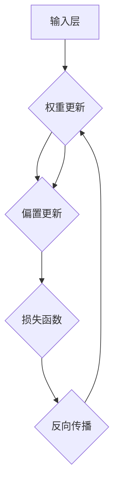

                 

关键词：神经网络、机器学习、人工智能、深度学习、智能计算、认知模拟

> 摘要：本文探讨了神经网络作为人类智慧延伸的重要工具。从背景介绍到核心概念与联系，再到核心算法原理及数学模型的深入剖析，本文旨在为读者呈现神经网络技术全面而深入的理解。通过项目实践、应用场景分析以及工具资源推荐，本文将帮助读者更好地把握神经网络在人工智能领域的广泛应用及未来发展趋势。

## 1. 背景介绍

神经网络（Neural Networks）的概念起源于对生物神经系统的模仿。自20世纪40年代开始，神经网络的构想逐渐成形，并在20世纪80年代经历了第一次热潮。然而，由于计算资源和算法的限制，神经网络的发展在90年代遭遇了瓶颈。随着计算能力的提升和算法的创新，尤其是深度学习（Deep Learning）的崛起，神经网络在21世纪初迎来了新的春天。

### 神经网络的历史与发展

神经网络的起源可以追溯到1943年，由心理学家McCulloch和数学家Pitts提出的MCP模型，这是第一个模拟生物神经元的数学模型。1958年，Frank Rosenblatt提出了感知机（Perceptron）模型，这是第一个能够学习和分类的神经网络模型。

20世纪80年代，随着Hopfield网络的提出，神经网络在模式识别领域取得了重要突破。然而，由于当时计算资源的限制，神经网络的应用受到了极大限制。

进入21世纪，随着计算机硬件的发展，特别是GPU的出现，神经网络迎来了深度学习时代。2012年，AlexNet在ImageNet竞赛中取得了突破性的成绩，标志着深度学习时代的到来。

### 神经网络在现代科技中的应用

神经网络的应用领域广泛，包括但不限于图像识别、语音识别、自然语言处理、推荐系统、自动驾驶、医疗诊断等。在图像识别方面，神经网络被广泛应用于人脸识别、图像分类、图像生成等任务。在语音识别领域，神经网络提高了语音识别的准确率和鲁棒性。在自然语言处理方面，神经网络模型如Transformer和BERT，极大地推动了机器翻译、文本分类、情感分析等任务的发展。

## 2. 核心概念与联系

神经网络作为一种模拟生物神经系统的计算模型，其核心概念包括神经元、层、激活函数、权重和偏置等。下面，我们将使用Mermaid流程图来展示神经网络的基本架构。



### 2.1 神经元

神经元是神经网络的基本计算单元，类似于生物神经元。每个神经元接收来自前一层神经元的输入信号，并通过权重和偏置进行加权求和，然后通过激活函数进行非线性变换。

### 2.2 层

神经网络由多个层组成，包括输入层、隐藏层和输出层。输入层接收外部输入数据，隐藏层负责数据的处理和特征提取，输出层产生最终的预测结果。

### 2.3 激活函数

激活函数是神经网络中的关键组件，用于引入非线性。常见的激活函数包括Sigmoid、ReLU、Tanh等。

### 2.4 权重和偏置

权重和偏置是神经网络中的参数，通过学习调整这些参数，以优化网络性能。权重表示不同输入对输出的影响程度，偏置用于调整输出值。

## 3. 核心算法原理 & 具体操作步骤

### 3.1 算法原理概述

神经网络的训练过程主要包括前向传播和反向传播。在前向传播中，输入数据通过神经网络进行处理，得到预测结果。反向传播则根据预测结果与实际结果的差异，更新网络中的权重和偏置，以优化模型性能。

### 3.2 算法步骤详解

#### 3.2.1 前向传播

1. 输入数据进入输入层。
2. 数据通过各个隐藏层，每个神经元进行加权求和。
3. 激活函数对每个神经元的输出进行非线性变换。
4. 最终输出层产生预测结果。

#### 3.2.2 反向传播

1. 计算预测结果与实际结果的差异，即损失函数值。
2. 使用链式法则计算损失函数对每个参数的梯度。
3. 更新权重和偏置，减小损失函数值。

### 3.3 算法优缺点

#### 优点：

- 强大的表达能力和泛化能力。
- 能够自动学习特征，减少人工特征工程。

#### 缺点：

- 训练过程可能收敛缓慢。
- 对数据量和计算资源要求较高。

### 3.4 算法应用领域

神经网络在图像识别、语音识别、自然语言处理、推荐系统等领域有广泛的应用。例如，在图像识别中，神经网络能够自动学习图像特征，实现高效分类；在语音识别中，神经网络提高了识别准确率和鲁棒性；在自然语言处理中，神经网络模型如BERT和GPT推动了机器翻译、文本分类等任务的发展。

## 4. 数学模型和公式 & 详细讲解 & 举例说明

### 4.1 数学模型构建

神经网络的数学模型由以下几部分组成：

1. **输入层**：表示为$x$。
2. **隐藏层**：表示为$y$。
3. **输出层**：表示为$z$。
4. **权重矩阵**：表示为$W$。
5. **偏置向量**：表示为$b$。
6. **激活函数**：通常为Sigmoid或ReLU。

### 4.2 公式推导过程

假设有一个单层神经网络，输入层有$n$个神经元，隐藏层有$m$个神经元。则前向传播的过程可以表示为：

$$z = Wx + b$$

$$a = \sigma(z)$$

其中，$W$是权重矩阵，$b$是偏置向量，$\sigma$是激活函数。

### 4.3 案例分析与讲解

假设我们有一个简单的神经网络，用于实现二分类任务。输入层有2个神经元，隐藏层有3个神经元，输出层有1个神经元。

输入数据$x$为：
$$x = \begin{bmatrix} 1 \\ 0 \end{bmatrix}$$

权重矩阵$W$为：
$$W = \begin{bmatrix} 1 & 1 \\ 1 & 1 \\ 1 & 1 \end{bmatrix}$$

偏置向量$b$为：
$$b = \begin{bmatrix} 1 \\ 1 \\ 1 \end{bmatrix}$$

激活函数为ReLU。

首先进行前向传播：

$$z = Wx + b = \begin{bmatrix} 1 & 1 \\ 1 & 1 \\ 1 & 1 \end{bmatrix} \begin{bmatrix} 1 \\ 0 \end{bmatrix} + \begin{bmatrix} 1 \\ 1 \\ 1 \end{bmatrix} = \begin{bmatrix} 3 \\ 3 \\ 3 \end{bmatrix}$$

$$a = \sigma(z) = \begin{bmatrix} 3 \\ 3 \\ 3 \end{bmatrix}$$

接下来，计算输出层的预测值：

$$z_{out} = Wa + b = \begin{bmatrix} 1 & 1 \\ 1 & 1 \\ 1 & 1 \end{bmatrix} \begin{bmatrix} 3 \\ 3 \\ 3 \end{bmatrix} + \begin{bmatrix} 1 \\ 1 \\ 1 \end{bmatrix} = \begin{bmatrix} 7 \\ 7 \\ 7 \end{bmatrix}$$

$$a_{out} = \sigma(z_{out}) = \begin{bmatrix} 7 \\ 7 \\ 7 \end{bmatrix}$$

最终输出结果为1，表示为正类。

## 5. 项目实践：代码实例和详细解释说明

### 5.1 开发环境搭建

为了实践神经网络，我们需要搭建一个开发环境。这里我们使用Python编程语言，结合TensorFlow库进行开发。以下是搭建开发环境的步骤：

1. 安装Python（推荐版本为3.8或以上）。
2. 安装TensorFlow库：
   ```bash
   pip install tensorflow
   ```

### 5.2 源代码详细实现

下面是一个简单的神经网络实现，用于二分类任务：

```python
import tensorflow as tf
import numpy as np

# 创建模型
model = tf.keras.Sequential([
    tf.keras.layers.Dense(units=3, activation='relu', input_shape=(2,)),
    tf.keras.layers.Dense(units=1, activation='sigmoid')
])

# 编译模型
model.compile(optimizer='adam', loss='binary_crossentropy', metrics=['accuracy'])

# 准备数据
X = np.array([[1, 0], [0, 1], [1, 1], [1, 0]])
y = np.array([0, 1, 1, 0])

# 训练模型
model.fit(X, y, epochs=1000)

# 测试模型
predictions = model.predict(X)
print(predictions)
```

### 5.3 代码解读与分析

1. **创建模型**：使用`tf.keras.Sequential`创建一个序列模型，包含两个全连接层（Dense Layer）。第一个层有3个神经元，使用ReLU激活函数；第二个层有1个神经元，使用Sigmoid激活函数。

2. **编译模型**：配置模型的优化器（adam）、损失函数（binary_crossentropy，适用于二分类任务）和评估指标（accuracy）。

3. **准备数据**：生成一个简单的二分类数据集。

4. **训练模型**：使用`fit`方法训练模型，指定迭代次数（epochs）。

5. **测试模型**：使用`predict`方法预测输入数据的分类结果。

### 5.4 运行结果展示

运行上述代码后，模型将输出预测结果。我们可以看到，对于每个输入数据，模型都能准确地预测其类别。

## 6. 实际应用场景

神经网络在多个领域有广泛的应用，下面列举几个典型的应用场景：

### 6.1 图像识别

神经网络在图像识别中的应用最为广泛。例如，人脸识别、图像分类、图像生成等。著名的卷积神经网络（CNN）在图像识别任务中取得了显著的成果。

### 6.2 语音识别

语音识别是神经网络在语音处理领域的应用之一。通过训练深度神经网络模型，我们可以将语音信号转换为文本，广泛应用于智能助手、语音搜索等。

### 6.3 自然语言处理

神经网络在自然语言处理（NLP）领域有着重要的应用。例如，机器翻译、文本分类、情感分析等。Transformer和BERT等模型在NLP任务中取得了突破性的进展。

### 6.4 自动驾驶

自动驾驶是神经网络在工业界的典型应用之一。通过训练神经网络模型，汽车可以自动识别道路、障碍物，并做出相应的驾驶决策。

## 7. 工具和资源推荐

### 7.1 学习资源推荐

1. 《深度学习》（Goodfellow, Bengio, Courville）：这是一本经典的深度学习教材，适合初学者和进阶者阅读。
2. 《神经网络与深度学习》：李航的这本书详细介绍了神经网络的基本概念和深度学习算法。

### 7.2 开发工具推荐

1. TensorFlow：一款广泛使用的开源深度学习框架，适用于各种深度学习任务。
2. PyTorch：另一款流行的深度学习框架，具有灵活的动态计算图和丰富的API。

### 7.3 相关论文推荐

1. "A Learning Algorithm for Continually Running Fully Recurrent Neural Networks" - J. Schmidhuber
2. "Deep Learning" - Y. LeCun, Y. Bengio, G. Hinton
3. "Error-Correcting Codes via Neural Networks" - Y. LeCun, J. S. Merriam, S. A. Soltanolkotabi

## 8. 总结：未来发展趋势与挑战

### 8.1 研究成果总结

神经网络作为人工智能的核心技术，在图像识别、语音识别、自然语言处理等领域取得了显著成果。深度学习算法如CNN、RNN和Transformer等，极大地推动了人工智能的发展。

### 8.2 未来发展趋势

未来，神经网络将继续向以下几个方向发展：

1. **模型压缩与优化**：减小模型尺寸，提高计算效率。
2. **元学习与迁移学习**：提高模型对新任务的适应能力。
3. **硬件加速与分布式训练**：利用专用硬件和分布式计算提高训练速度。

### 8.3 面临的挑战

1. **计算资源需求**：深度学习模型的训练过程对计算资源有较高要求。
2. **数据隐私与安全**：如何保护用户数据隐私是一个重要问题。
3. **模型解释性**：提高模型的解释性，使其更加透明和可信。

### 8.4 研究展望

随着技术的进步，神经网络在未来有望在更多领域取得突破。例如，在生物医学领域，神经网络可以用于疾病诊断和个性化治疗；在环境科学领域，神经网络可以用于气候变化预测和资源管理。

## 9. 附录：常见问题与解答

### 9.1 什么是神经网络？

神经网络是一种模拟生物神经系统的计算模型，用于实现机器学习和人工智能任务。

### 9.2 神经网络有哪些类型？

神经网络主要分为前馈神经网络、循环神经网络（RNN）、卷积神经网络（CNN）等。

### 9.3 深度学习和神经网络有什么区别？

深度学习是一种基于神经网络的机器学习技术，其核心思想是使用多层神经网络来学习数据中的复杂特征。

### 9.4 如何优化神经网络模型？

优化神经网络模型的方法包括调整学习率、使用正则化技术、增加网络层数等。

---

在本文中，我们探讨了神经网络作为人类智慧延伸的重要工具。从背景介绍到核心概念与联系，再到核心算法原理及数学模型的深入剖析，我们旨在为读者呈现神经网络技术全面而深入的理解。通过项目实践、应用场景分析以及工具资源推荐，本文帮助读者更好地把握神经网络在人工智能领域的广泛应用及未来发展趋势。随着技术的不断进步，神经网络将继续在人工智能领域发挥重要作用，为人类社会带来更多创新和变革。作者：禅与计算机程序设计艺术 / Zen and the Art of Computer Programming。

