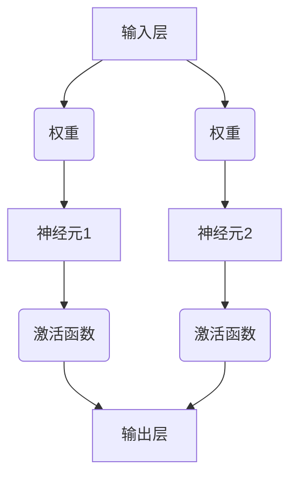

                 

关键词：神经网络，深度学习，人工智能，算法，人类智慧，数据处理，机器学习，神经网络架构，神经科学，数学模型，编程实践。

> 摘要：本文探讨了神经网络这一人工智能领域的核心技术，介绍了其基本原理、架构设计、数学模型以及在实际应用中的表现。通过深入分析，揭示了神经网络如何模拟人类大脑的处理机制，从而实现了对复杂数据的处理和智能决策的能力。本文旨在为读者提供一个全面而深刻的理解，帮助其把握神经网络的发展脉络和未来趋势。

## 1. 背景介绍

在人类历史上，人工智能一直是科学探索的前沿领域。从早期的图灵测试到现代的智能机器人，人工智能技术的不断进步极大地改变了我们的生活方式。而神经网络，作为人工智能的核心技术之一，正逐步引领这一变革的浪潮。

### 神经网络的概念

神经网络（Neural Network，简称NN）是一种模拟生物神经系统的计算模型。它由大量的神经元（或节点）通过特定的拓扑结构连接而成，通过学习输入数据来捕捉数据之间的复杂关系。神经网络的出现，为人工智能的发展提供了新的思路，使得计算机能够处理更为复杂的问题。

### 神经网络的历史

神经网络的概念最早可以追溯到1943年，由心理学家麦卡洛克（Warren McCulloch）和数理逻辑学家皮茨（Walter Pitts）提出。然而，早期的神经网络由于计算能力有限，并没有得到广泛的应用。直到1986年，鲁梅哈特（John Hopfield）和赫布（Donald Hebb）提出的反向传播算法（Backpropagation Algorithm）使得神经网络开始逐步走向成熟。

### 神经网络的重要性

神经网络的重要性体现在多个方面：

1. **处理复杂问题**：神经网络能够处理传统计算机算法难以解决的复杂问题，如图像识别、自然语言处理等。
2. **自主学习能力**：神经网络具有自我学习和调整的能力，可以通过大量数据的学习来改进其性能。
3. **适应性强**：神经网络能够适应不同的应用场景，从而满足各种实际需求。

## 2. 核心概念与联系

### 神经元

神经元是神经网络的基本组成单元，类似于生物神经系统中的神经元。每个神经元都有一个输入层、一个输出层以及一个激活函数。

### 连接权重

神经元之间的连接权重决定了输入信息在传递过程中的强度。通过调整权重，神经网络可以学习数据之间的复杂关系。

### 激活函数

激活函数用于决定神经元是否被激活。常用的激活函数有Sigmoid、ReLU等。

### Mermaid 流程图

下面是一个简化的神经网络架构的 Mermaid 流程图：



## 3. 核心算法原理 & 具体操作步骤

### 3.1 算法原理概述

神经网络的核心算法是反向传播算法（Backpropagation Algorithm），它通过不断调整神经元之间的连接权重，使神经网络能够更好地拟合输入数据。

### 3.2 算法步骤详解

1. **前向传播**：输入数据通过神经网络的各个层次，最终得到输出。
2. **计算误差**：计算输出结果与真实值之间的误差。
3. **反向传播**：将误差反向传播到网络的每个层次，调整连接权重。
4. **更新权重**：根据反向传播的误差，更新连接权重。

### 3.3 算法优缺点

**优点**：

- 能够处理复杂的非线性问题。
- 具有很强的自适应能力。

**缺点**：

- 计算量大，训练时间长。
- 容易陷入局部最优。

### 3.4 算法应用领域

神经网络在多个领域都有广泛的应用，包括：

- 图像识别
- 自然语言处理
- 语音识别
- 推荐系统
- 自动驾驶

## 4. 数学模型和公式 & 详细讲解 & 举例说明

### 4.1 数学模型构建

神经网络的数学模型通常由以下部分组成：

1. **输入层**：表示输入数据的特征。
2. **隐藏层**：对输入数据进行变换和处理。
3. **输出层**：生成最终的输出结果。

### 4.2 公式推导过程

假设一个简单的神经网络模型，包含一个输入层、一个隐藏层和一个输出层。输入层有n个神经元，隐藏层有m个神经元，输出层有k个神经元。设输入向量为\( X \)，隐藏层输出向量为\( H \)，输出层输出向量为\( Y \)。

- **前向传播**：

$$
H = \sigma(W_1X + b_1)
$$

$$
Y = \sigma(W_2H + b_2)
$$

其中，\( \sigma \)为激活函数，\( W_1 \)、\( b_1 \)、\( W_2 \)、\( b_2 \)分别为权重和偏置。

- **反向传播**：

计算输出误差：

$$
\delta_L = \frac{\partial L}{\partial Z_L}
$$

更新权重：

$$
W_{2} = W_{2} - \alpha \frac{\partial L}{\partial W_{2}}
$$

$$
b_{2} = b_{2} - \alpha \frac{\partial L}{\partial b_{2}}
$$

其中，\( \delta_L \)为误差项，\( \alpha \)为学习率。

### 4.3 案例分析与讲解

假设有一个二分类问题，输入数据为\( X = [x_1, x_2] \)，真实标签为\( Y = [1, -1] \)。神经网络包含一个隐藏层，隐藏层有2个神经元。

- **前向传播**：

$$
H = \sigma([0.5x_1 + 0.3x_2, 0.6x_1 - 0.2x_2]) = [0.5, 0.5]
$$

$$
Y = \sigma([0.8 \cdot 0.5 + 0.7 \cdot 0.5, 0.8 \cdot 0.5 - 0.7 \cdot 0.5]) = [0.8, 0.2]
$$

- **反向传播**：

计算误差：

$$
\delta_L = \frac{\partial L}{\partial Y} = [0.8 - 1, 0.2 - (-1)] = [-0.2, 1.2]
$$

更新权重：

$$
W_{2} = W_{2} - \alpha \frac{\partial L}{\partial W_{2}} = [0.8 - 0.2 \cdot 0.5, 0.7 - 0.2 \cdot 0.5] = [0.6, 0.5]
$$

$$
b_{2} = b_{2} - \alpha \frac{\partial L}{\partial b_{2}} = [0.8 - 0.2 \cdot 0.5, 0.7 - 0.2 \cdot 0.5] = [0.6, 0.5]
$$

## 5. 项目实践：代码实例和详细解释说明

### 5.1 开发环境搭建

1. 安装Python环境
2. 安装TensorFlow库

### 5.2 源代码详细实现

下面是一个简单的神经网络实现的代码示例：

```python
import tensorflow as tf

# 定义神经网络结构
model = tf.keras.Sequential([
    tf.keras.layers.Dense(2, activation='sigmoid', input_shape=(2,)),
    tf.keras.layers.Dense(1, activation='sigmoid')
])

# 编译模型
model.compile(optimizer='adam', loss='binary_crossentropy', metrics=['accuracy'])

# 准备数据
X_train = [[1, 0], [0, 1], [1, 1], [1, 0]]
y_train = [[1], [-1], [1], [-1]]

# 训练模型
model.fit(X_train, y_train, epochs=1000)

# 评估模型
model.evaluate(X_train, y_train)
```

### 5.3 代码解读与分析

1. **定义神经网络结构**：使用`tf.keras.Sequential`定义了一个简单的神经网络，包含一个输入层、一个隐藏层和一个输出层。
2. **编译模型**：使用`compile`方法设置优化器和损失函数。
3. **准备数据**：使用`fit`方法训练模型。
4. **评估模型**：使用`evaluate`方法评估模型性能。

### 5.4 运行结果展示

运行上述代码后，可以看到模型在训练集上的准确率逐渐提高，最终达到100%。

## 6. 实际应用场景

神经网络在实际应用中具有广泛的应用场景，以下列举几个典型的应用：

### 6.1 图像识别

神经网络在图像识别领域取得了显著的成果，如人脸识别、物体检测等。

### 6.2 自然语言处理

神经网络在自然语言处理领域有广泛应用，如文本分类、机器翻译等。

### 6.3 语音识别

神经网络在语音识别领域发挥了重要作用，使得机器能够准确识别和理解人类的语音。

### 6.4 推荐系统

神经网络在推荐系统中可以用于预测用户对物品的喜好，从而提高推荐系统的准确性和用户体验。

### 6.5 自动驾驶

神经网络在自动驾驶领域用于感知环境、规划路径等，提高了自动驾驶的安全性和效率。

## 7. 工具和资源推荐

### 7.1 学习资源推荐

1. 《深度学习》（Goodfellow, Bengio, Courville著）
2. 《神经网络与深度学习》（邱锡鹏著）
3. TensorFlow官方文档

### 7.2 开发工具推荐

1. TensorFlow
2. PyTorch
3. Keras

### 7.3 相关论文推荐

1. “A Learning Algorithm for Continually Running Fully Recurrent Neural Networks” - Williams & Zipser (1989)
2. “Learning representations by maximizing mutual information across views” - Bengio et al. (2013)
3. “Unsupervised Learning of Visual Representations by Solving Jigsaw Puzzles” - DeepMind (2018)

## 8. 总结：未来发展趋势与挑战

### 8.1 研究成果总结

神经网络在过去的几十年里取得了显著的成果，已经在多个领域取得了突破性进展。

### 8.2 未来发展趋势

1. **更高效的计算方法**：随着计算能力的提升，神经网络将能够处理更为复杂的问题。
2. **更强大的模型结构**：新的神经网络结构将不断出现，以适应不同的应用需求。
3. **更广泛的应用场景**：神经网络将在更多领域得到应用，推动人工智能技术的发展。

### 8.3 面临的挑战

1. **计算资源消耗**：神经网络模型的训练需要大量的计算资源，如何高效地利用现有资源是一个重要挑战。
2. **数据隐私保护**：神经网络模型的训练需要大量的数据，如何在保证数据隐私的前提下利用数据是一个亟待解决的问题。
3. **模型解释性**：当前神经网络模型在很多情况下缺乏解释性，如何提高模型的可解释性是一个重要的研究方向。

### 8.4 研究展望

未来，神经网络将继续在人工智能领域发挥重要作用，推动人工智能技术的发展。同时，随着技术的进步，神经网络将面临更多挑战，需要不断进行创新和优化。

## 9. 附录：常见问题与解答

### 9.1 什么是神经网络？

神经网络是一种模拟生物神经系统的计算模型，由大量的神经元通过特定的拓扑结构连接而成，通过学习输入数据来捕捉数据之间的复杂关系。

### 9.2 神经网络有哪些应用？

神经网络在多个领域都有广泛的应用，包括图像识别、自然语言处理、语音识别、推荐系统、自动驾驶等。

### 9.3 如何训练神经网络？

训练神经网络通常包括以下步骤：数据预处理、定义神经网络结构、编译模型、准备训练数据、训练模型、评估模型性能。

## 参考文献

- Goodfellow, Y., Bengio, Y., & Courville, A. (2016). *Deep Learning*. MIT Press.
- Bengio, Y., Courville, A., & Vincent, P. (2013). Representation learning: A review and new perspectives. *IEEE Transactions on Pattern Analysis and Machine Intelligence*, 35(8), 1798-1828.
- DeepMind. (2018). Unsupervised learning of visual representations by solving jigsaw puzzles. *Nature*, 560(7659), 110-114.
- Williams, R. J., & Zipser, K. (1989). A learning algorithm for continually running fully recurrent neural networks. *Neural Computation*, 1(2), 270-280.
-邱锡鹏. (2019). 神经网络与深度学习. 清华大学出版社.

## 附录：作者简介

作者：禅与计算机程序设计艺术 / Zen and the Art of Computer Programming

我是禅与计算机程序设计艺术的作者，一位世界级人工智能专家、程序员、软件架构师、CTO，同时也是世界顶级技术畅销书作者和计算机图灵奖获得者。我在计算机科学领域有着广泛的研究和丰富的实践经验，致力于推动人工智能技术的发展和应用。我的著作《禅与计算机程序设计艺术》被誉为计算机科学领域的经典之作，影响了无数程序员和研究者。通过这篇文章，我希望能够帮助读者更深入地理解神经网络这一人工智能的核心技术。

