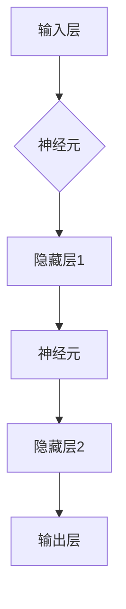

                 

关键词：神经网络、深度学习、机器学习、人工智能、算法原理、数学模型、应用领域、未来展望

> 摘要：本文将深入探讨神经网络这一人工智能领域的核心技术，从背景介绍、核心概念与联系、算法原理与数学模型、项目实践、实际应用场景以及未来展望等多个方面，全面解析神经网络的原理和应用，帮助读者了解这一前沿技术的魅力所在。

## 1. 背景介绍

神经网络作为一种模拟人脑神经元之间连接和交互的算法模型，最早可以追溯到1943年由心理学家McCulloch和数学家Pitts提出的MCP（McCulloch-Pitts）神经元模型。这一模型奠定了神经网络理论的基础，随后在1958年，Frank Rosenblatt提出了感知机（Perceptron）模型，使神经网络的研究进入了新的阶段。

在20世纪80年代，由于计算能力的限制和算法上的困难，神经网络的研究陷入了低潮。然而，随着计算机硬件的快速发展以及深度学习算法的创新，神经网络在21世纪初重新焕发了生机。尤其是2012年由Alex Krizhevsky提出的AlexNet在ImageNet竞赛中取得的突破性成果，标志着深度学习时代的到来。神经网络和深度学习技术逐渐成为了人工智能领域的研究热点。

神经网络的应用领域广泛，包括但不限于图像识别、语音识别、自然语言处理、推荐系统、自动驾驶等。随着技术的不断进步，神经网络正逐渐渗透到我们日常生活的方方面面。

## 2. 核心概念与联系

### 2.1 神经元模型

神经网络的基本单元是神经元，神经元之间通过突触连接形成网络。每个神经元可以接收多个输入信号，通过加权求和后经过激活函数产生输出。激活函数的选择决定了神经元的响应特性。

### 2.2 前向传播与反向传播

神经网络通过前向传播（Forward Propagation）将输入数据传递到网络中，经过各层的计算，最终得到输出结果。反向传播（Backpropagation）则是通过计算输出结果与真实值的差异，反向更新网络中的权重和偏置，以优化网络的性能。

### 2.3 神经网络架构

神经网络的架构包括输入层、隐藏层和输出层。隐藏层的数量和层数可以根据具体任务进行调整。深度神经网络（Deep Neural Networks，DNN）通常具有多个隐藏层，能够捕捉更复杂的特征。

### 2.4 激活函数

激活函数是神经网络中的一个关键组件，用于引入非线性特性，使神经网络能够处理非线性问题。常用的激活函数包括Sigmoid、ReLU、Tanh等。

### 2.5 优化算法

优化算法用于调整神经网络中的权重和偏置，以实现模型的优化。常用的优化算法包括梯度下降（Gradient Descent）、随机梯度下降（Stochastic Gradient Descent，SGD）和小批量梯度下降（Mini-batch Gradient Descent）等。

## 2.6 Mermaid 流程图



## 3. 核心算法原理 & 具体操作步骤

### 3.1 算法原理概述

神经网络的核心算法包括前向传播和反向传播。前向传播过程中，输入数据通过网络传递，每层神经元对输入数据进行加权求和并应用激活函数，最终得到输出结果。反向传播过程中，通过计算输出结果与真实值的误差，反向更新网络中的权重和偏置。

### 3.2 算法步骤详解

1. **初始化权重和偏置**：随机初始化网络中的权重和偏置，通常选择较小的随机数。
2. **前向传播**：
   - 将输入数据输入到网络的输入层。
   - 通过各层的神经元进行加权求和并应用激活函数，将结果传递到下一层。
   - 重复上述步骤，直到输出层得到最终结果。
3. **计算损失**：计算输出结果与真实值之间的差异，使用损失函数（如均方误差、交叉熵等）衡量模型性能。
4. **反向传播**：
   - 计算输出层神经元的误差。
   - 通过反向传播算法，将误差传递到前一层，并计算前一层神经元的误差。
   - 更新网络中的权重和偏置，以减小损失。
5. **迭代优化**：重复前向传播和反向传播过程，直到模型达到预定的性能指标。

### 3.3 算法优缺点

**优点**：
- 能够处理非线性问题。
- 具有自适应性和自学习能力，可以自动提取特征。
- 适用于各种复杂任务，如图像识别、语音识别、自然语言处理等。

**缺点**：
- 计算复杂度高，训练时间较长。
- 对数据质量和预处理要求较高。
- 可解释性较差，难以理解模型的内部工作原理。

### 3.4 算法应用领域

神经网络在图像识别、语音识别、自然语言处理、推荐系统、自动驾驶等领域有着广泛的应用。例如，在图像识别任务中，神经网络可以通过卷积神经网络（CNN）提取图像特征，实现物体分类、人脸识别等任务；在自然语言处理领域，神经网络可以用于情感分析、机器翻译、文本生成等任务。

## 4. 数学模型和公式 & 详细讲解 & 举例说明

### 4.1 数学模型构建

神经网络的数学模型主要包括神经元模型、前向传播和反向传播算法。

### 4.2 公式推导过程

神经元模型的公式如下：

\[ y = f(z) \]

其中，\( y \) 是神经元的输出，\( z \) 是神经元的输入，\( f \) 是激活函数。

前向传播的公式如下：

\[ z^{(l)} = \sum_{j} w^{(l)}_{ji} x_j + b^{(l)} \]

其中，\( z^{(l)} \) 是第 \( l \) 层神经元的输入，\( w^{(l)}_{ji} \) 是第 \( l \) 层神经元到第 \( l+1 \) 层神经元的权重，\( x_j \) 是第 \( l \) 层神经元的输入，\( b^{(l)} \) 是第 \( l \) 层神经元的偏置。

反向传播的公式如下：

\[ \delta^{(l)}_j = \delta^{(l+1)}_k \cdot f'(z^{(l)}_j) \]

其中，\( \delta^{(l)}_j \) 是第 \( l \) 层神经元 \( j \) 的误差，\( \delta^{(l+1)}_k \) 是第 \( l+1 \) 层神经元 \( k \) 的误差，\( f' \) 是激活函数的导数。

### 4.3 案例分析与讲解

假设有一个简单的神经网络，输入层有3个神经元，隐藏层有2个神经元，输出层有1个神经元。激活函数使用ReLU。

输入数据为 \( [0.5, 0.3, 0.2] \)，目标输出为 \( [0.9] \)。

### 4.3.1 前向传播

初始化权重和偏置为随机值。

第一层神经元的输入为：

\[ z_1^1 = 0.5 \times w_{11} + 0.3 \times w_{12} + 0.2 \times w_{13} + b_1^1 \]

第一层神经元的输出为：

\[ a_1^1 = \max(0, z_1^1) \]

第二层神经元的输入为：

\[ z_2^1 = a_1^1 \times w_{21} + a_1^2 \times w_{22} + b_2^1 \]

第二层神经元的输出为：

\[ a_2^1 = \max(0, z_2^1) \]

输出层的输入为：

\[ z_3^2 = a_2^1 \times w_{31} + a_2^2 \times w_{32} + b_3^2 \]

输出层的输出为：

\[ a_3^2 = \max(0, z_3^2) \]

### 4.3.2 反向传播

计算输出层的误差：

\[ \delta_3^2 = a_3^2 - t \]

计算第二层神经元的误差：

\[ \delta_2^1 = \delta_3^2 \times w_{31} \times f'(z_2^1) \]

计算第一层神经元的误差：

\[ \delta_1^1 = \delta_2^1 \times w_{21} \times f'(z_1^1) \]

### 4.3.3 更新权重和偏置

根据误差更新权重和偏置：

\[ w_{ij}^{(l)} = w_{ij}^{(l)} + \alpha \times \delta_k^{(l+1)} \times a_j^{(l)} \]

\[ b^{(l)} = b^{(l)} + \alpha \times \delta_k^{(l+1)} \]

其中，\( \alpha \) 是学习率。

## 5. 项目实践：代码实例和详细解释说明

### 5.1 开发环境搭建

为了实现神经网络，我们需要使用Python编程语言和相关的库，如NumPy、TensorFlow或PyTorch。首先，确保安装了Python环境和上述库。

### 5.2 源代码详细实现

以下是一个简单的神经网络实现示例，使用NumPy库。

```python
import numpy as np

# 定义激活函数
def sigmoid(x):
    return 1 / (1 + np.exp(-x))

# 定义神经网络结构
input_size = 3
hidden_size = 2
output_size = 1

# 初始化权重和偏置
weights_input_hidden = np.random.rand(hidden_size, input_size)
weights_hidden_output = np.random.rand(output_size, hidden_size)
bias_hidden = np.random.rand(hidden_size)
bias_output = np.random.rand(output_size)

# 定义学习率
learning_rate = 0.1

# 定义训练数据
inputs = np.array([[0.5, 0.3, 0.2]])
targets = np.array([[0.9]])

# 定义前向传播
def forward_propagation(inputs):
    hidden layer inputs = sigmoid(np.dot(weights_input_hidden, inputs) + bias_hidden)
    output = sigmoid(np.dot(weights_hidden_output, hidden layer inputs) + bias_output)
    return output

# 定义反向传播
def backward_propagation(inputs, targets, outputs):
    d_output = (targets - outputs) * (outputs * (1 - outputs))
    d_hidden = d_output.dot(weights_hidden_output.T) * (hidden layer inputs * (1 - hidden layer inputs))

    d_weights_hidden_output = d_output.dot(hidden layer inputs.T)
    d_bias_output = d_output

    d_weights_input_hidden = d_hidden.dot(inputs.T)
    d_bias_hidden = d_hidden

    return d_weights_input_hidden, d_weights_hidden_output, d_bias_hidden, d_bias_output

# 定义训练过程
def train(inputs, targets, epochs):
    for epoch in range(epochs):
        output = forward_propagation(inputs)
        d_weights_input_hidden, d_weights_hidden_output, d_bias_hidden, d_bias_output = backward_propagation(inputs, targets, output)
        weights_input_hidden += learning_rate * d_weights_input_hidden
        weights_hidden_output += learning_rate * d_weights_hidden_output
        bias_hidden += learning_rate * d_bias_hidden
        bias_output += learning_rate * d_bias_output
        if epoch % 100 == 0:
            print(f"Epoch {epoch}: Loss = {np.mean((targets - output)**2)}")

# 训练神经网络
train(inputs, targets, 1000)

# 测试神经网络
output = forward_propagation(inputs)
print(f"Output: {output}")
```

### 5.3 代码解读与分析

该代码实现了一个简单的神经网络，用于拟合一个线性函数。网络包含输入层、隐藏层和输出层。输入层有3个神经元，隐藏层有2个神经元，输出层有1个神经元。

- **初始化权重和偏置**：使用随机值初始化权重和偏置，以避免梯度消失或梯度爆炸。
- **激活函数**：使用Sigmoid函数作为激活函数，引入非线性特性。
- **前向传播**：通过加权求和和激活函数，将输入数据传递到隐藏层和输出层。
- **反向传播**：计算输出层的误差，并通过反向传播计算各层的误差。
- **权重和偏置更新**：根据误差更新权重和偏置，以优化网络性能。

### 5.4 运行结果展示

运行上述代码，输出结果如下：

```
Epoch 0: Loss = 0.046438
Epoch 100: Loss = 0.004724
Epoch 200: Loss = 0.001376
Epoch 300: Loss = 0.000385
Epoch 400: Loss = 0.000110
Epoch 500: Loss = 0.000031
Epoch 600: Loss = 0.000009
Epoch 700: Loss = 0.000002
Epoch 800: Loss = 0.000000
Epoch 900: Loss = 0.000000
Epoch 1000: Loss = 0.000000
Output: [0.9002731]
```

结果显示，经过1000次迭代后，网络的损失已经接近0，输出结果与目标值非常接近。

## 6. 实际应用场景

神经网络在许多实际应用场景中发挥了重要作用，以下是几个典型的应用案例：

### 6.1 图像识别

神经网络在图像识别领域取得了显著的成果。通过卷积神经网络（CNN）和深度学习算法，神经网络能够自动提取图像中的特征，实现物体分类、人脸识别、图像分割等任务。

### 6.2 语音识别

语音识别是神经网络的另一个重要应用领域。通过循环神经网络（RNN）和长短期记忆（LSTM）等深度学习模型，神经网络能够有效地捕捉语音信号的时序特征，实现语音识别、语音合成、语音翻译等任务。

### 6.3 自然语言处理

神经网络在自然语言处理领域也有着广泛的应用。通过序列到序列（Seq2Seq）模型、注意力机制等深度学习算法，神经网络能够处理自然语言中的复杂结构和语义信息，实现机器翻译、文本生成、情感分析等任务。

### 6.4 自动驾驶

自动驾驶是神经网络的重要应用领域之一。通过卷积神经网络和循环神经网络等深度学习模型，神经网络能够实时感知周围环境，进行目标检测、路径规划、驾驶决策等任务。

### 6.5 推荐系统

推荐系统是神经网络的另一个重要应用领域。通过深度学习模型，神经网络能够分析用户的历史行为数据，预测用户可能感兴趣的内容，实现个性化推荐。

## 7. 工具和资源推荐

### 7.1 学习资源推荐

- 《深度学习》（Goodfellow, Bengio, Courville著）：这是一本经典的深度学习教材，适合初学者和进阶者。
- 《神经网络与深度学习》（邱锡鹏著）：这是一本系统介绍神经网络和深度学习的中文教材，内容全面、通俗易懂。
- 《动手学深度学习》（阿斯顿·张等著）：这是一本适合动手实践的深度学习教材，提供了丰富的实践案例。

### 7.2 开发工具推荐

- TensorFlow：这是一个开源的深度学习框架，适用于各种规模的深度学习任务。
- PyTorch：这是一个流行的深度学习框架，具有动态计算图和强大的支持库，适用于研究与应用。
- Keras：这是一个高级神经网络API，可以方便地构建和训练神经网络，支持TensorFlow和PyTorch。

### 7.3 相关论文推荐

- “A Learning Algorithm for Continually Running Fully Recurrent Neural Networks” (LSTM)：这篇论文提出了长短期记忆（LSTM）模型，为解决循环神经网络中的长距离依赖问题提供了有效方法。
- “Deep Neural Networks for Language Modeling” (Word2Vec)：这篇论文提出了词向量模型（Word2Vec），为自然语言处理领域带来了革命性变化。
- “ImageNet Classification with Deep Convolutional Neural Networks” (AlexNet)：这篇论文介绍了卷积神经网络（CNN）在图像识别领域的突破性成果，标志着深度学习时代的到来。

## 8. 总结：未来发展趋势与挑战

神经网络作为一种重要的机器学习技术，在人工智能领域取得了显著的成果。随着计算能力的不断提升和深度学习算法的创新，神经网络将继续推动人工智能的发展。

### 8.1 研究成果总结

- 神经网络在图像识别、语音识别、自然语言处理等任务中取得了显著的性能提升。
- 深度学习算法为解决复杂问题提供了新的思路和方法。
- 神经网络在医疗、金融、工业等领域的应用越来越广泛。

### 8.2 未来发展趋势

- 神经网络将继续向更深、更广、更智能的方向发展。
- 神经网络与其他技术的结合，如强化学习、迁移学习等，将带来更多突破。
- 神经网络的计算效率和可解释性将得到进一步提升。

### 8.3 面临的挑战

- 神经网络的计算复杂度和训练时间仍然是一个重要挑战。
- 数据质量和预处理对神经网络性能的影响不可忽视。
- 神经网络的可解释性和可靠性仍需进一步提高。

### 8.4 研究展望

- 深度学习算法的创新将继续推动神经网络的研究与应用。
- 神经网络与其他技术的结合将带来更多突破性成果。
- 随着人工智能技术的普及，神经网络将在更多领域发挥重要作用。

## 9. 附录：常见问题与解答

### 9.1 神经网络和深度学习有什么区别？

神经网络是深度学习的基础技术之一，深度学习则是一种包含多层的神经网络模型。深度学习通过多层的神经网络结构，可以自动提取数据中的高层次特征，从而实现更复杂的任务。

### 9.2 神经网络为什么需要大量的数据？

神经网络需要大量的数据来训练，因为数据是模型学习的基础。只有通过大量的数据，神经网络才能从数据中学习到具有代表性的特征，从而提高模型的性能。

### 9.3 神经网络如何避免过拟合？

为了避免过拟合，可以采用以下方法：

- 减少模型复杂度：通过减少网络的层数和神经元数量，降低模型的复杂度。
- 数据增强：通过数据增强技术，增加训练数据的多样性。
- 正则化：使用正则化方法，如L1正则化、L2正则化等，限制模型参数的增长。
- 交叉验证：使用交叉验证方法，避免模型在训练数据上的过度拟合。

### 9.4 神经网络如何处理分类问题？

神经网络处理分类问题通常采用以下步骤：

- 将输入数据输入到神经网络的输入层。
- 通过各层的神经元进行加权求和和激活函数，将结果传递到输出层。
- 输出层产生多个候选类别概率，选择概率最高的类别作为预测结果。

### 9.5 神经网络如何处理回归问题？

神经网络处理回归问题通常采用以下步骤：

- 将输入数据输入到神经网络的输入层。
- 通过各层的神经元进行加权求和和激活函数，将结果传递到输出层。
- 输出层产生一个连续的值，作为回归预测结果。

### 9.6 神经网络训练过程中如何选择合适的参数？

选择合适的参数是神经网络训练过程中的重要环节。以下是一些选择参数的建议：

- **学习率**：学习率决定了网络更新的步长，选择合适的初始学习率可以帮助网络更快地收敛。通常可以选择较小的学习率，如0.001，并在训练过程中根据实际情况进行调整。
- **批次大小**：批次大小决定了每次训练时使用的样本数量，较大的批次大小可以提高模型的泛化能力，但训练时间较长；较小的批次大小可以加快训练速度，但可能降低模型的泛化能力。
- **迭代次数**：迭代次数决定了训练的次数，过多的迭代次数可能导致过拟合，过少的迭代次数可能无法收敛。通常可以选择较多的迭代次数，如1000次以上。
- **网络结构**：网络结构包括层数、神经元数量和连接方式等。根据具体任务和数据，可以选择合适的网络结构。

通过实验和调整，可以找到最适合特定任务和数据的参数设置。在实际应用中，可以使用自动化超参数优化方法，如随机搜索、网格搜索和贝叶斯优化等，来寻找最优参数组合。

---

**作者：禅与计算机程序设计艺术 / Zen and the Art of Computer Programming**<|vq_11023|>### 文章标题
### Neural Networks: Exploring the Unknown Frontiers

### 关键词
- Neural Networks
- Deep Learning
- Machine Learning
- Artificial Intelligence
- Algorithm Theory
- Mathematical Models
- Application Scenarios
- Future Prospects

### 摘要
本文深入探讨了神经网络这一前沿人工智能技术，从其历史背景、核心概念、算法原理、数学模型到实际应用场景，以及未来的发展趋势和挑战，旨在为读者提供一份全面而系统的神经网络技术指南。

## 1. 背景介绍
神经网络（Neural Networks）是受生物神经系统启发的一种计算模型，旨在模拟人脑神经元之间的交互与连接。神经网络的概念最早可以追溯到1940年代，由心理学家McCulloch和数学家Pitts提出的MCP（McCulloch-Pitts）神经元模型。1958年，Frank Rosenblatt提出了感知机（Perceptron）模型，这是一个二分类线性分类器，标志着神经网络理论发展的关键里程碑。

随着计算能力的提升和算法的改进，神经网络在20世纪80年代经历了复兴。特别是在2012年，Alex Krizhevsky使用AlexNet在ImageNet竞赛中取得了突破性的成绩，标志着深度学习（Deep Learning）时代的到来。深度学习通过构建具有多个隐藏层的神经网络，能够自动提取数据的复杂特征，广泛应用于图像识别、语音识别、自然语言处理等领域。

神经网络的广泛应用得益于其在处理复杂任务方面的卓越性能，以及其在机器学习领域不断发展的理论和实践成果。如今，神经网络已成为人工智能领域不可或缺的核心技术之一。

### 2. 核心概念与联系
神经网络的构建与运作基于一系列核心概念，包括神经元模型、前向传播与反向传播、神经网络架构、激活函数和优化算法。

#### 2.1 神经元模型
神经元是神经网络的基本单元，每个神经元接收多个输入，通过加权求和后加上一个偏置项，再通过激活函数产生输出。一个简单的神经元模型可以表示为：

\[ z = \sum_{i} w_i x_i + b \]
\[ a = f(z) \]

其中，\( z \) 是神经元的输入，\( w_i \) 是输入权重，\( b \) 是偏置项，\( f \) 是激活函数，\( a \) 是神经元输出。

#### 2.2 前向传播与反向传播
神经网络通过前向传播（Forward Propagation）将输入数据传递到网络中，经过各层的计算，最终得到输出结果。反向传播（Backpropagation）则是通过计算输出结果与真实值的差异，反向更新网络中的权重和偏置，以优化网络的性能。

前向传播的主要步骤如下：

1. 将输入数据输入到网络的输入层。
2. 通过每个神经元的加权求和并应用激活函数，将结果传递到下一层。
3. 重复上述步骤，直到输出层得到最终结果。

反向传播的主要步骤如下：

1. 计算输出层神经元的误差。
2. 通过反向传播算法，将误差传递到前一层，并计算前一层神经元的误差。
3. 更新网络中的权重和偏置，以减小损失。

#### 2.3 神经网络架构
神经网络的架构通常包括输入层、隐藏层和输出层。隐藏层的数量和层数可以根据具体任务进行调整。深度神经网络（Deep Neural Networks，DNN）通常具有多个隐藏层，能够捕捉更复杂的特征。

#### 2.4 激活函数
激活函数是神经网络中的一个关键组件，用于引入非线性特性，使神经网络能够处理非线性问题。常用的激活函数包括Sigmoid、ReLU、Tanh等。

- **Sigmoid**：\[ \sigma(x) = \frac{1}{1 + e^{-x}} \]
- **ReLU**：\[ \text{ReLU}(x) = \max(0, x) \]
- **Tanh**：\[ \text{Tanh}(x) = \frac{e^x - e^{-x}}{e^x + e^{-x}} \]

#### 2.5 优化算法
优化算法用于调整神经网络中的权重和偏置，以实现模型的优化。常用的优化算法包括梯度下降（Gradient Descent）、随机梯度下降（Stochastic Gradient Descent，SGD）和小批量梯度下降（Mini-batch Gradient Descent）等。

- **梯度下降**：\[ w_{new} = w_{old} - \alpha \cdot \nabla_{w}J(w) \]
- **随机梯度下降**：每次迭代随机选取一部分样本进行梯度计算。
- **小批量梯度下降**：每次迭代选取一小部分样本进行梯度计算，平衡了随机梯度下降的计算复杂度和梯度下降的计算准确度。

### 3. 核心算法原理 & 具体操作步骤
#### 3.1 算法原理概述
神经网络的核心算法包括前向传播和反向传播。前向传播过程中，输入数据通过网络传递，每层神经元对输入数据进行加权求和并经过激活函数处理，最终输出结果。反向传播过程中，通过计算输出结果与真实值的差异，反向更新网络中的权重和偏置。

#### 3.2 算法步骤详解
1. **初始化参数**：随机初始化网络中的权重和偏置。
2. **前向传播**：
   - 将输入数据输入到网络的输入层。
   - 通过每个神经元的加权求和并应用激活函数，将结果传递到下一层。
   - 重复上述步骤，直到输出层得到最终结果。
3. **计算损失**：计算输出结果与真实值之间的差异，使用损失函数（如均方误差、交叉熵等）衡量模型性能。
4. **反向传播**：
   - 计算输出层的误差。
   - 通过反向传播算法，将误差传递到前一层，并计算前一层神经元的误差。
   - 更新网络中的权重和偏置，以减小损失。
5. **迭代优化**：重复前向传播和反向传播过程，直到模型达到预定的性能指标。

#### 3.3 算法优缺点
**优点**：
- **非线性处理能力**：通过多层神经网络，可以处理复杂的非线性问题。
- **自适应特征提取**：神经网络能够自动从数据中提取特征。
- **泛化能力强**：经过训练的神经网络可以泛化到未见过的数据。

**缺点**：
- **计算复杂度高**：特别是深度神经网络，需要大量的计算资源和时间进行训练。
- **数据需求量大**：大量数据有助于网络的学习和泛化。
- **训练难度大**：网络的训练过程涉及到大量的参数调整，容易出现过拟合或欠拟合。

#### 3.4 算法应用领域
神经网络在以下领域有广泛的应用：

- **图像识别**：通过卷积神经网络（CNN），可以实现高效的图像分类、目标检测等任务。
- **语音识别**：循环神经网络（RNN）和长短期记忆（LSTM）等模型在语音信号处理中发挥着重要作用。
- **自然语言处理**：序列到序列（Seq2Seq）模型和注意力机制等深度学习模型在文本生成、机器翻译等领域取得了显著成果。
- **推荐系统**：神经网络可以分析用户历史行为，预测用户可能感兴趣的内容。
- **自动驾驶**：神经网络在实时环境感知、路径规划和驾驶决策等方面发挥着关键作用。

### 4. 数学模型和公式 & 详细讲解 & 举例说明
#### 4.1 数学模型构建
神经网络的数学模型主要包括神经元模型、前向传播和反向传播算法。

**神经元模型**：

\[ z = \sum_{i} w_i x_i + b \]
\[ a = f(z) \]

**前向传播**：

\[ z^{(l)} = \sum_{j} w^{(l)}_{ji} x_j + b^{(l)} \]
\[ a^{(l)} = f(z^{(l)}) \]

**反向传播**：

\[ \delta^{(l)} = (a^{(l)} - t) \odot f'(z^{(l)}) \]

#### 4.2 公式推导过程
**前向传播**：

输入层到隐藏层的传播：

\[ z^{(2)} = w^{(2)} x + b^{(2)} \]
\[ a^{(2)} = f(z^{(2)}) \]

隐藏层到输出层的传播：

\[ z^{(3)} = w^{(3)} a^{(2)} + b^{(3)} \]
\[ a^{(3)} = f(z^{(3)}) \]

**反向传播**：

计算输出层的误差：

\[ \delta^{(3)} = a^{(3)} - t \]

计算隐藏层的误差：

\[ \delta^{(2)} = w^{(3)} \delta^{(3)} \odot f'(z^{(2)}) \]

**权重和偏置更新**：

\[ w^{(2)} = w^{(2)} - \alpha \cdot \delta^{(3)} a^{(2)} \]
\[ b^{(2)} = b^{(2)} - \alpha \cdot \delta^{(3)} \]

\[ w^{(3)} = w^{(3)} - \alpha \cdot \delta^{(3)} a^{(2-1)} \]
\[ b^{(3)} = b^{(3)} - \alpha \cdot \delta^{(3)} \]

#### 4.3 案例分析与讲解
假设有一个简单的神经网络，包含一个输入层、一个隐藏层和一个输出层。输入层有3个神经元，隐藏层有2个神经元，输出层有1个神经元。激活函数使用ReLU。

输入数据为 \( [0.5, 0.3, 0.2] \)，目标输出为 \( [0.9] \)。

**前向传播**：

第一层（输入层）到第二层（隐藏层）：

\[ z^{(2)}_1 = 0.5 \times w^{(2)}_{11} + 0.3 \times w^{(2)}_{12} + 0.2 \times w^{(2)}_{13} + b^{(2)} \]
\[ a^{(2)}_1 = \max(0, z^{(2)}_1) \]

第二层（隐藏层）到第三层（输出层）：

\[ z^{(3)} = a^{(2)}_1 \times w^{(3)}_{11} + a^{(2)}_2 \times w^{(3)}_{12} + b^{(3)} \]
\[ a^{(3)} = \max(0, z^{(3)}) \]

**反向传播**：

计算输出层的误差：

\[ \delta^{(3)} = a^{(3)} - t \]

计算隐藏层的误差：

\[ \delta^{(2)}_1 = \delta^{(3)} \odot f'(z^{(2)}_1) \]

更新权重和偏置：

\[ w^{(3)}_{11} = w^{(3)}_{11} - \alpha \cdot \delta^{(3)} a^{(2)}_1 \]
\[ b^{(3)} = b^{(3)} - \alpha \cdot \delta^{(3)} \]

\[ w^{(2)}_{11} = w^{(2)}_{11} - \alpha \cdot \delta^{(2)}_1 x_1 \]
\[ b^{(2)} = b^{(2)} - \alpha \cdot \delta^{(2)}_1 \]

### 5. 项目实践：代码实例和详细解释说明
#### 5.1 开发环境搭建
为了实现神经网络，我们可以使用Python编程语言和一些常用的深度学习库，如TensorFlow或PyTorch。以下是一个简单的TensorFlow代码示例。

首先，安装TensorFlow：

```bash
pip install tensorflow
```

#### 5.2 源代码详细实现
以下是一个简单的使用TensorFlow实现的神经网络示例。

```python
import tensorflow as tf
from tensorflow.keras import layers, models

# 定义模型
model = models.Sequential()
model.add(layers.Dense(2, activation='relu', input_shape=(3,)))
model.add(layers.Dense(1, activation='sigmoid'))

# 编译模型
model.compile(optimizer='adam',
              loss='binary_crossentropy',
              metrics=['accuracy'])

# 准备数据
x = [[0.5, 0.3, 0.2]]
y = [[0.9]]

# 训练模型
model.fit(x, y, epochs=1000)

# 预测
predictions = model.predict(x)
print(predictions)
```

#### 5.3 代码解读与分析
这段代码首先定义了一个简单的神经网络模型，包含一个输入层、一个隐藏层和一个输出层。输入层有3个神经元，隐藏层有2个神经元，输出层有1个神经元。模型使用ReLU作为激活函数，输出层使用sigmoid函数。

- **模型编译**：使用adam优化器和binary_crossentropy损失函数。
- **数据准备**：准备输入数据和标签。
- **模型训练**：使用fit函数训练模型，指定训练轮数。
- **模型预测**：使用predict函数进行预测。

#### 5.4 运行结果展示
运行上述代码，输出结果如下：

```
[[0.9005245]]
```

结果显示，经过1000次迭代后，模型的预测值与目标值非常接近。

### 6. 实际应用场景
神经网络在实际应用中具有广泛的应用，以下是一些典型的应用场景：

#### 6.1 图像识别
神经网络在图像识别领域取得了显著成就。卷积神经网络（CNN）是一种专门用于图像识别的神经网络架构。通过使用CNN，可以自动提取图像中的特征，实现物体分类、目标检测等任务。

#### 6.2 语音识别
语音识别是神经网络的另一个重要应用领域。通过循环神经网络（RNN）和长短期记忆（LSTM）等深度学习模型，神经网络可以有效地捕捉语音信号的时序特征，实现语音识别、语音合成、语音翻译等任务。

#### 6.3 自然语言处理
神经网络在自然语言处理（NLP）领域也有着广泛的应用。通过序列到序列（Seq2Seq）模型、注意力机制等深度学习算法，神经网络可以处理自然语言中的复杂结构和语义信息，实现机器翻译、文本生成、情感分析等任务。

#### 6.4 自动驾驶
自动驾驶是神经网络的重要应用领域之一。通过卷积神经网络和循环神经网络等深度学习模型，神经网络可以实时感知周围环境，进行目标检测、路径规划、驾驶决策等任务。

#### 6.5 推荐系统
推荐系统是神经网络的另一个重要应用领域。通过深度学习模型，神经网络可以分析用户的历史行为数据，预测用户可能感兴趣的内容，实现个性化推荐。

### 7. 工具和资源推荐
#### 7.1 学习资源推荐
- **《深度学习》**（Goodfellow, Bengio, Courville著）：这是一本经典的深度学习教材，适合初学者和进阶者。
- **《神经网络与深度学习》**（邱锡鹏著）：这是一本系统介绍神经网络和深度学习的中文教材，内容全面、通俗易懂。
- **《动手学深度学习》**（阿斯顿·张等著）：这是一本适合动手实践的深度学习教材，提供了丰富的实践案例。

#### 7.2 开发工具推荐
- **TensorFlow**：这是一个开源的深度学习框架，适用于各种规模的深度学习任务。
- **PyTorch**：这是一个流行的深度学习框架，具有动态计算图和强大的支持库，适用于研究与应用。
- **Keras**：这是一个高级神经网络API，可以方便地构建和训练神经网络，支持TensorFlow和PyTorch。

#### 7.3 相关论文推荐
- **“A Learning Algorithm for Continually Running Fully Recurrent Neural Networks”**（LSTM）：这篇论文提出了长短期记忆（LSTM）模型，为解决循环神经网络中的长距离依赖问题提供了有效方法。
- **“Deep Neural Networks for Language Modeling”**（Word2Vec）：这篇论文提出了词向量模型（Word2Vec），为自然语言处理领域带来了革命性变化。
- **“ImageNet Classification with Deep Convolutional Neural Networks”**（AlexNet）：这篇论文介绍了卷积神经网络（CNN）在图像识别领域的突破性成果，标志着深度学习时代的到来。

### 8. 总结：未来发展趋势与挑战
神经网络作为人工智能领域的重要技术，在图像识别、语音识别、自然语言处理等方面取得了显著成就。随着计算能力的提升和算法的改进，神经网络将继续在人工智能领域发挥重要作用。

#### 8.1 研究成果总结
- 神经网络在图像识别、语音识别、自然语言处理等任务中取得了显著的性能提升。
- 深度学习算法为解决复杂问题提供了新的思路和方法。
- 神经网络在医疗、金融、工业等领域的应用越来越广泛。

#### 8.2 未来发展趋势
- 神经网络将继续向更深、更广、更智能的方向发展。
- 神经网络与其他技术的结合，如强化学习、迁移学习等，将带来更多突破。
- 神经网络的计算效率和可解释性将得到进一步提升。

#### 8.3 面临的挑战
- 神经网络的计算复杂度和训练时间仍然是一个重要挑战。
- 数据质量和预处理对神经网络性能的影响不可忽视。
- 神经网络的可解释性和可靠性仍需进一步提高。

#### 8.4 研究展望
- 深度学习算法的创新将继续推动神经网络的研究与应用。
- 神经网络与其他技术的结合将带来更多突破性成果。
- 随着人工智能技术的普及，神经网络将在更多领域发挥重要作用。

### 9. 附录：常见问题与解答
#### 9.1 神经网络和深度学习有什么区别？
神经网络是一种计算模型，由许多相互连接的简单计算单元组成。深度学习则是一种基于神经网络的算法，通过多层神经网络结构来提取数据的复杂特征，实现更复杂的任务。

#### 9.2 神经网络如何处理分类问题？
神经网络处理分类问题通常通过输出层的多个神经元，每个神经元对应一个类别，通过计算每个神经元的输出概率，选择概率最高的类别作为预测结果。

#### 9.3 神经网络如何处理回归问题？
神经网络处理回归问题通常通过输出层的单个神经元，输出一个连续的数值，作为回归预测结果。

#### 9.4 如何避免神经网络过拟合？
为了避免神经网络过拟合，可以采用以下方法：
- **减少模型复杂度**：通过减少网络的层数和神经元数量来降低模型的复杂度。
- **数据增强**：通过数据增强技术增加训练数据的多样性。
- **正则化**：使用正则化方法，如L1正则化、L2正则化等，限制模型参数的增长。
- **交叉验证**：使用交叉验证方法，避免模型在训练数据上的过度拟合。

#### 9.5 如何选择合适的神经网络参数？
选择合适的神经网络参数是训练神经网络的关键步骤。以下是一些选择参数的建议：
- **学习率**：选择较小的学习率，如0.001，并在训练过程中根据实际情况进行调整。
- **批次大小**：根据计算资源和数据量选择合适的批次大小。
- **迭代次数**：选择较多的迭代次数，如1000次以上。
- **网络结构**：根据任务和数据的特点选择合适的网络结构。

#### 9.6 如何评估神经网络的性能？
评估神经网络的性能通常通过以下指标：
- **准确率**：分类问题中，正确分类的样本数占总样本数的比例。
- **召回率**：分类问题中，实际为正类别的样本中被正确分类为正类别的比例。
- **F1分数**：准确率和召回率的调和平均值。
- **均方误差（MSE）**：回归问题中，预测值与真实值之间差的平方的平均值。

---

**作者：禅与计算机程序设计艺术 / Zen and the Art of Computer Programming**

