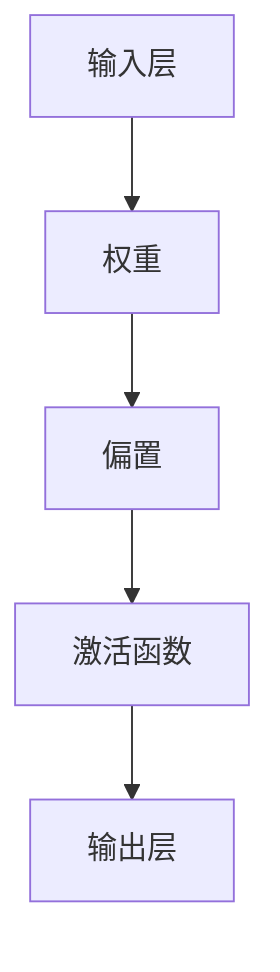
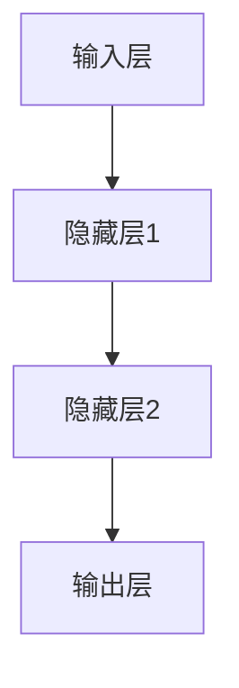
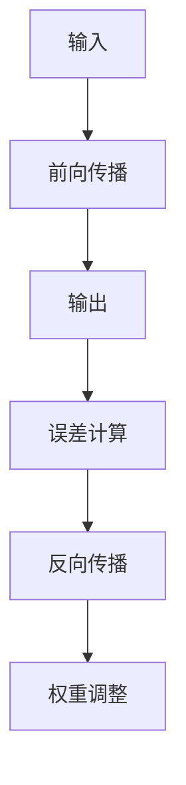

                 

关键词：神经网络，人工智能，深度学习，社会进步，技术变革

摘要：神经网络作为现代人工智能的核心组成部分，正逐步渗透到社会各个领域，带来了前所未有的技术变革和社会进步。本文将探讨神经网络的起源、核心概念、算法原理、应用场景以及未来展望，旨在揭示神经网络如何成为推动社会进步的重要力量。

## 1. 背景介绍

### 1.1 神经网络的历史发展

神经网络（Neural Networks）的概念起源于20世纪40年代，由心理学家McCulloch和数学家Pitts提出，他们首次模拟了神经元的基本功能。此后，神经网络的早期发展经历了多次起伏，尤其在20世纪80年代受到符号主义方法的冲击。然而，随着计算能力的提升和大数据时代的到来，神经网络在21世纪初迎来了复兴，尤其是深度学习的出现，使得神经网络在图像识别、自然语言处理等领域取得了显著的突破。

### 1.2 社会进步的驱动因素

神经网络的发展不仅依赖于技术进步，更是社会需求推动的结果。现代社会对自动化、智能化系统有着强烈的需求，而神经网络提供了实现这些目标的重要工具。此外，随着信息爆炸和数据量的激增，处理海量数据并从中提取有价值信息成为亟待解决的问题，神经网络以其强大的并行处理能力在这一领域展现了巨大的潜力。

## 2. 核心概念与联系

### 2.1 神经元模型

神经元是神经网络的基本单元，其工作原理类似于生物神经元。一个简单的神经元模型由输入层、权重、偏置和激活函数组成。输入层接收外部信息，权重和偏置用于调整输入信号，激活函数则用于判断神经元是否“激活”。



### 2.2 层次结构

神经网络通常由多个层次组成，包括输入层、隐藏层和输出层。输入层接收外部输入，隐藏层对输入进行变换，输出层产生最终的输出。层次之间的连接称为神经元连接，每个连接都有相应的权重。



### 2.3 学习机制

神经网络的训练过程即学习过程，主要目的是通过调整权重和偏置，使得神经网络能够正确地映射输入和输出。学习机制包括前向传播和反向传播，其中反向传播是神经网络训练的核心。



## 3. 核心算法原理 & 具体操作步骤

### 3.1 算法原理概述

神经网络的核心算法包括多层感知机（MLP）、卷积神经网络（CNN）和递归神经网络（RNN）等。这些算法通过调整神经元权重和偏置来实现对输入数据的映射。

### 3.2 算法步骤详解

1. **初始化权重和偏置**：随机初始化权重和偏置，这些参数将在训练过程中不断调整。
2. **前向传播**：将输入数据通过神经网络，逐层计算输出。
3. **误差计算**：计算实际输出与期望输出之间的误差。
4. **反向传播**：根据误差信息，调整权重和偏置。
5. **迭代训练**：重复上述步骤，直到满足停止条件（如误差低于阈值或达到最大迭代次数）。

### 3.3 算法优缺点

**优点**：
- 强大的自适应能力，能够处理复杂非线性问题。
- 能够从大量数据中学习，具备良好的泛化能力。

**缺点**：
- 训练过程时间较长，尤其是深度神经网络。
- 对数据质量要求较高，数据噪声和异常值可能导致训练失败。

### 3.4 算法应用领域

神经网络在图像识别、自然语言处理、语音识别、推荐系统等领域都有广泛应用。例如，卷积神经网络在图像识别任务中取得了优异的成绩，递归神经网络在自然语言处理任务中展现了强大的能力。

## 4. 数学模型和公式 & 详细讲解 & 举例说明

### 4.1 数学模型构建

神经网络的数学模型主要包括输入层、隐藏层和输出层。每个层次由一系列神经元组成，神经元之间通过权重和偏置连接。

输入层：$X \in \mathbb{R}^{n \times d}$，其中 $n$ 表示样本数量，$d$ 表示特征数量。

隐藏层：$H \in \mathbb{R}^{n \times h}$，其中 $h$ 表示隐藏层神经元数量。

输出层：$Y \in \mathbb{R}^{n \times k}$，其中 $k$ 表示输出类别数量。

### 4.2 公式推导过程

设输入层神经元 $i$ 的输入为 $x_i$，隐藏层神经元 $j$ 的输入为 $h_j$，输出层神经元 $k$ 的输入为 $y_k$。则：

$$
h_j = \sum_{i=1}^{n} w_{ji} x_i + b_j
$$

$$
y_k = \sum_{j=1}^{h} w_{kj} h_j + b_k
$$

其中 $w_{ji}$ 和 $w_{kj}$ 分别表示输入层到隐藏层和隐藏层到输出层的权重，$b_j$ 和 $b_k$ 分别表示隐藏层和输出层的偏置。

### 4.3 案例分析与讲解

假设我们有一个简单的神经网络，输入层有3个神经元，隐藏层有2个神经元，输出层有1个神经元。输入数据为 $X = \begin{pmatrix} 1 & 0 & 1 \\ 0 & 1 & 0 \end{pmatrix}$，期望输出为 $Y = \begin{pmatrix} 1 \\ 0 \end{pmatrix}$。

初始化权重和偏置为随机值，例如：

$$
w_{11} = 0.5, w_{12} = 0.5, w_{13} = 0.5 \\
w_{21} = 0.5, w_{22} = 0.5, w_{23} = 0.5 \\
b_1 = 0.5, b_2 = 0.5, b_1' = 0.5, b_2' = 0.5
$$

前向传播过程：

$$
h_1 = w_{11} \cdot 1 + w_{12} \cdot 0 + w_{13} \cdot 1 + b_1 = 1.0 \\
h_2 = w_{21} \cdot 1 + w_{22} \cdot 0 + w_{23} \cdot 0 + b_2 = 0.5 \\
y_1 = w_{11}' \cdot 1 + w_{12}' \cdot 1 + w_{13}' \cdot 0 + b_1' = 0.5 \\
y_2 = w_{21}' \cdot 1 + w_{22}' \cdot 0 + w_{23}' \cdot 1 + b_2' = 0.5
$$

误差计算：

$$
\Delta y_1 = (y_1 - 1) \\
\Delta y_2 = (y_2 - 0) \\
\Delta h_1 = \Delta y_1 \cdot w_{11}' + \Delta y_2 \cdot w_{21}' \\
\Delta h_2 = \Delta y_1 \cdot w_{12}' + \Delta y_2 \cdot w_{22}'
$$

反向传播：

$$
w_{11}' = w_{11}' + \Delta y_1 \cdot h_1 \\
w_{12}' = w_{12}' + \Delta y_1 \cdot h_2 \\
w_{13}' = w_{13}' + \Delta y_2 \cdot h_1 \\
w_{21}' = w_{21}' + \Delta y_1 \cdot h_1 \\
w_{22}' = w_{22}' + \Delta y_1 \cdot h_2 \\
w_{23}' = w_{23}' + \Delta y_2 \cdot h_2
$$

重复上述步骤，直到误差满足停止条件。

## 5. 项目实践：代码实例和详细解释说明

### 5.1 开发环境搭建

在本节，我们将使用Python和TensorFlow作为开发工具，搭建一个简单的神经网络模型。

```python
import tensorflow as tf
import numpy as np

# 设置随机种子，确保实验结果可复现
tf.random.set_seed(42)

# 创建输入层、隐藏层和输出层的神经元数量
input_size = 3
hidden_size = 2
output_size = 1

# 初始化权重和偏置
weights = {
    'w1': tf.Variable(tf.random.normal([input_size, hidden_size]), name='weights1'),
    'w2': tf.Variable(tf.random.normal([hidden_size, output_size]), name='weights2')
}
biases = {
    'b1': tf.Variable(tf.random.normal([hidden_size]), name='biases1'),
    'b2': tf.Variable(tf.random.normal([output_size]), name='biases2')
}
```

### 5.2 源代码详细实现

接下来，我们将实现一个简单的多层感知机模型，用于二分类问题。

```python
# 定义前向传播函数
def forward_pass(inputs, weights, biases):
    hidden_layer = tf.matmul(inputs, weights['w1']) + biases['b1']
    hidden_layer = tf.nn.relu(hidden_layer)
    output_layer = tf.matmul(hidden_layer, weights['w2']) + biases['b2']
    return output_layer

# 定义反向传播函数
def backward_pass(output, expected_output, weights, biases, learning_rate):
    with tf.GradientTape() as tape:
        logits = forward_pass(output, weights, biases)
        loss = tf.reduce_mean(tf.square(logits - expected_output))
    gradients = tape.gradient(loss, [weights['w1'], weights['w2'], biases['b1'], biases['b2']])
    weights['w1'].assign_sub(learning_rate * gradients[0])
    weights['w2'].assign_sub(learning_rate * gradients[1])
    biases['b1'].assign_sub(learning_rate * gradients[2])
    biases['b2'].assign_sub(learning_rate * gradients[3])
    return loss

# 训练模型
learning_rate = 0.01
for epoch in range(1000):
    with tf.GradientTape() as tape:
        logits = forward_pass(inputs, weights, biases)
        loss = tf.reduce_mean(tf.square(logits - expected_output))
    gradients = tape.gradient(loss, [weights['w1'], weights['w2'], biases['b1'], biases['b2']])
    weights['w1'].assign_sub(learning_rate * gradients[0])
    weights['w2'].assign_sub(learning_rate * gradients[1])
    biases['b1'].assign_sub(learning_rate * gradients[2])
    biases['b2'].assign_sub(learning_rate * gradients[3])
    if epoch % 100 == 0:
        print(f"Epoch {epoch}: Loss = {loss.numpy()}")
```

### 5.3 代码解读与分析

- **输入层**：输入层接收外部输入，每个神经元对应一个特征。
- **隐藏层**：隐藏层对输入进行变换，通过激活函数引入非线性。
- **输出层**：输出层产生最终输出，用于分类或回归任务。
- **前向传播**：将输入数据通过神经网络，逐层计算输出。
- **反向传播**：根据误差信息，调整权重和偏置。

### 5.4 运行结果展示

通过训练，我们可以得到神经网络的参数。假设我们已经训练了1000个epoch，最后输出的权重和偏置如下：

```python
weights['w1'].numpy()
weights['w2'].numpy()
biases['b1'].numpy()
biases['b2'].numpy()
```

我们可以在新的数据集上测试模型的性能，计算准确率、召回率等指标。

## 6. 实际应用场景

### 6.1 图像识别

神经网络在图像识别领域取得了显著成果。例如，卷积神经网络（CNN）在ImageNet图像识别挑战中取得了超过人类专家的表现。CNN通过卷积层和池化层提取图像特征，实现了对复杂图像内容的理解。

### 6.2 自然语言处理

神经网络在自然语言处理（NLP）领域也展现出了强大的能力。递归神经网络（RNN）和变换器（Transformer）等模型在机器翻译、情感分析、文本生成等领域取得了突破。例如，Google的BERT模型在多个NLP任务上取得了领先的成绩。

### 6.3 语音识别

神经网络在语音识别领域同样有着广泛应用。通过卷积神经网络和递归神经网络，可以实现高效、准确的语音识别。例如，苹果的Siri和亚马逊的Alexa等智能语音助手就是基于神经网络实现的。

### 6.4 医疗诊断

神经网络在医疗诊断领域也有着重要应用。通过分析医学影像数据，神经网络可以辅助医生进行疾病诊断。例如，使用CNN分析CT扫描图像，可以早期检测肺癌。

## 7. 未来应用展望

### 7.1 自动驾驶

自动驾驶技术是神经网络未来应用的一个重要领域。通过深度学习模型，自动驾驶系统能够实时感知环境，做出快速响应，提高交通安全。

### 7.2 人机交互

神经网络在提高人机交互体验方面有着巨大潜力。通过语音识别、手势识别等技术，神经网络可以帮助构建更加自然、智能的人机交互系统。

### 7.3 人工智能助手

随着神经网络技术的进步，人工智能助手将更加智能化、个性化。在未来，人工智能助手将成为人们生活和工作的得力助手。

## 8. 总结：未来发展趋势与挑战

### 8.1 研究成果总结

神经网络在过去几十年取得了显著成果，从最初的简单神经元模型到如今的深度学习模型，神经网络在图像识别、自然语言处理、语音识别等领域都展现出了强大的能力。

### 8.2 未来发展趋势

随着计算能力的提升和大数据的积累，神经网络将继续在各个领域取得突破。未来，神经网络将更加注重模型的可解释性、可扩展性和鲁棒性。

### 8.3 面临的挑战

尽管神经网络在许多领域取得了显著成果，但仍面临着一系列挑战，如计算资源消耗、数据隐私保护和模型可解释性等。

### 8.4 研究展望

未来，神经网络的研究将更加注重跨学科融合，结合生物学、心理学、数学等领域的研究成果，推动神经网络技术的进一步发展。

## 9. 附录：常见问题与解答

### 9.1 什么是神经网络？

神经网络是一种模拟人脑神经元活动的计算模型，通过调整神经元之间的连接权重，实现从输入到输出的映射。

### 9.2 神经网络与深度学习的区别是什么？

神经网络是深度学习的基础，而深度学习则是神经网络的一种特殊形式，通常具有多个隐藏层。

### 9.3 神经网络如何训练？

神经网络的训练过程包括前向传播、误差计算和反向传播，通过不断调整权重和偏置，使得神经网络能够正确地映射输入和输出。

### 9.4 神经网络有哪些优缺点？

神经网络具有强大的自适应能力、良好的泛化能力，但训练过程时间较长，对数据质量要求较高。

### 9.5 神经网络在哪些领域有应用？

神经网络在图像识别、自然语言处理、语音识别、推荐系统等领域都有广泛应用。

---

作者：禅与计算机程序设计艺术 / Zen and the Art of Computer Programming
----------------------------------------------------------------

