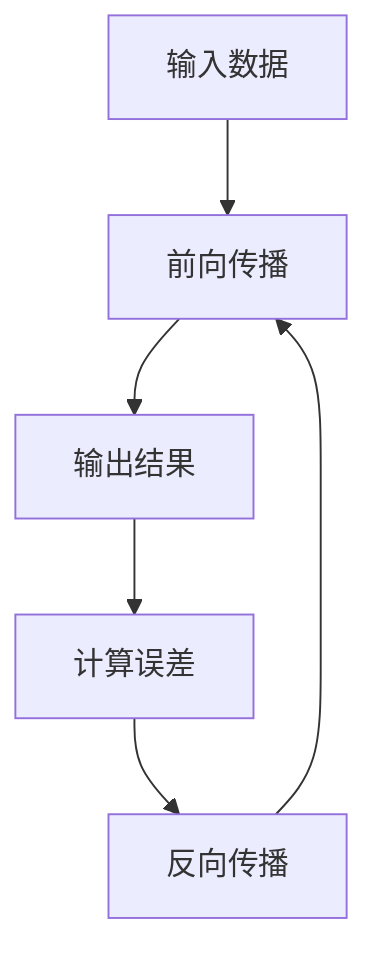

                 

关键词：神经网络、深度学习、机器学习、人工智能、算法原理

> 摘要：本文旨在深入探讨神经网络这一颠覆性的技术，从其背景介绍、核心概念与联系、算法原理与操作步骤、数学模型与公式、项目实践、实际应用场景以及未来发展趋势等方面，全面解析神经网络如何改变世界。

## 1. 背景介绍

神经网络作为人工智能的核心技术之一，其发展历程可以追溯到上世纪40年代。最初，由心理学家McCulloch和数学家Pitts提出的神经网络模型（MCP模型）奠定了神经网络的理论基础。随后，由于计算能力的限制和算法的复杂性，神经网络的发展经历了多次起伏。直到近年来，随着计算能力的迅速提升和大数据的广泛应用，神经网络迎来了前所未有的发展机遇。

### 1.1 神经网络的历史与发展

- **1940年代**：MCP模型提出，为神经网络的理论基础奠定了基础。
- **1950年代**：Hebb提出了学习规则，推动了神经网络的应用。
- **1960年代**：感知机算法提出，但由于学习能力的限制，神经网络研究陷入低潮。
- **1980年代**：反向传播算法的出现，使得多层神经网络的训练成为可能。
- **1990年代**：支持向量机等算法的兴起，神经网络的应用受到一定程度的压制。
- **2000年代**：计算能力的提升和大数据的广泛应用，神经网络开始复苏。
- **2010年代至今**：深度学习技术的发展，神经网络在图像识别、语音识别、自然语言处理等领域取得了突破性进展。

### 1.2 神经网络的核心地位

神经网络在人工智能领域中具有核心地位，主要原因包括：

- **强大的非线性处理能力**：神经网络可以通过多层非线性变换，实现对复杂数据的处理。
- **自学习能力**：神经网络可以通过大量数据的训练，自动调整内部参数，提高对未知数据的预测能力。
- **广泛的适用性**：神经网络在图像识别、语音识别、自然语言处理、游戏人工智能等领域都有广泛的应用。

## 2. 核心概念与联系

### 2.1 神经元与神经网络

**神经元**：神经网络的基本单元，类似于生物神经元，可以接收输入信号、进行加权求和处理，并产生输出。

**神经网络**：由大量神经元按照特定结构组成的网络，通过前向传播和反向传播算法，实现数据的处理和模型的训练。

### 2.2 前向传播与反向传播

**前向传播**：将输入数据通过神经网络的每一层传递，最终得到输出结果。

**反向传播**：根据输出结果与真实结果的误差，反向传播误差信息，调整网络中的权重和偏置。

### 2.3 多层感知机与卷积神经网络

**多层感知机**：一种前馈神经网络，包含多个隐层，可以实现非线性变换。

**卷积神经网络**：一种特殊的多层感知机，利用卷积操作减少参数数量，适合处理图像数据。

### 2.4 Mermaid 流程图



## 3. 核心算法原理 & 具体操作步骤

### 3.1 算法原理概述

神经网络的核心算法包括前向传播和反向传播。前向传播用于计算输出结果，反向传播用于调整网络参数，以最小化误差。

### 3.2 算法步骤详解

1. **初始化参数**：设定网络中各个神经元的权重和偏置。
2. **前向传播**：输入数据经过网络传递，得到输出结果。
3. **计算误差**：计算输出结果与真实结果的误差。
4. **反向传播**：根据误差信息，反向调整网络参数。
5. **更新参数**：重复前向传播和反向传播，直到误差达到预设阈值。

### 3.3 算法优缺点

**优点**：

- **强大的非线性处理能力**：神经网络可以通过多层非线性变换，实现对复杂数据的处理。
- **自学习能力**：神经网络可以通过大量数据的训练，自动调整内部参数，提高对未知数据的预测能力。

**缺点**：

- **参数调优复杂**：神经网络参数众多，调优过程复杂，容易陷入局部最优。
- **训练时间长**：神经网络训练过程需要大量计算资源，训练时间较长。

### 3.4 算法应用领域

神经网络在多个领域取得了显著的成果，包括：

- **图像识别**：通过卷积神经网络实现。
- **语音识别**：通过深度神经网络实现。
- **自然语言处理**：通过循环神经网络和变换器网络实现。

## 4. 数学模型和公式

### 4.1 数学模型构建

神经网络的数学模型主要由以下几部分组成：

1. **输入层**：接收外部输入数据。
2. **隐层**：实现数据的非线性变换。
3. **输出层**：生成最终的输出结果。

### 4.2 公式推导过程

1. **前向传播**：

$$
Z^{(l)} = \sum_{j} w^{(l)}_{ij} X^{(l-1)}_{j} + b^{(l)}_{i}
$$

$$
A^{(l)} = \sigma(Z^{(l)})
$$

其中，$Z^{(l)}$ 为第 $l$ 层的加权和，$A^{(l)}$ 为第 $l$ 层的激活值，$w^{(l)}_{ij}$ 为连接第 $(l-1)$ 层神经元 $j$ 和第 $l$ 层神经元 $i$ 的权重，$b^{(l)}_{i}$ 为第 $l$ 层神经元的偏置，$\sigma$ 为激活函数。

2. **反向传播**：

$$
\delta^{(l)}_i = \frac{\partial J}{\partial Z^{(l)}_i}
$$

$$
\delta^{(l-1)}_j = \frac{\partial J}{\partial Z^{(l-1)}_j} = \sum_{i} w^{(l)}_{ij} \delta^{(l)}_i
$$

其中，$\delta^{(l)}_i$ 为第 $l$ 层神经元 $i$ 的误差项，$J$ 为损失函数。

### 4.3 案例分析与讲解

以一个简单的全连接神经网络为例，输入层有 3 个神经元，隐层有 2 个神经元，输出层有 1 个神经元。

1. **初始化参数**：

   - 权重矩阵 $W^{(1)}$：3 × 2
   - 偏置矩阵 $b^{(1)}$：2 × 1
   - 权重矩阵 $W^{(2)}$：2 × 1
   - 偏置矩阵 $b^{(2)}$：1 × 1

2. **前向传播**：

   - 输入数据 $X^{(1)}$：3 × 1
   - 隐层输出 $A^{(1)}$：2 × 1
   - 输出层输出 $A^{(2)}$：1 × 1

3. **计算误差**：

   - 损失函数 $J$：均方误差（MSE）

4. **反向传播**：

   - 计算隐层和输出层的误差项

5. **更新参数**：

   - 根据误差项更新权重和偏置

## 5. 项目实践：代码实例和详细解释说明

### 5.1 开发环境搭建

- Python
- TensorFlow
- Jupyter Notebook

### 5.2 源代码详细实现

```python
import tensorflow as tf

# 初始化参数
W1 = tf.Variable(tf.random.normal([3, 2]))
b1 = tf.Variable(tf.zeros([2]))
W2 = tf.Variable(tf.random.normal([2, 1]))
b2 = tf.Variable(tf.zeros([1]))

# 定义损失函数
loss_fn = tf.keras.losses.MeanSquaredError()

# 前向传播
def forward_pass(x):
    Z1 = tf.matmul(x, W1) + b1
    A1 = tf.sigmoid(Z1)
    Z2 = tf.matmul(A1, W2) + b2
    A2 = tf.sigmoid(Z2)
    return A2

# 反向传播
def backward_pass(x, y):
    with tf.GradientTape() as tape:
        A2 = forward_pass(x)
        loss = loss_fn(y, A2)
    gradients = tape.gradient(loss, [W1, b1, W2, b2])
    return gradients

# 训练模型
epochs = 1000
for epoch in range(epochs):
    gradients = backward_pass(X_train, y_train)
    W1.assign_sub(gradients[0] * learning_rate)
    b1.assign_sub(gradients[1] * learning_rate)
    W2.assign_sub(gradients[2] * learning_rate)
    b2.assign_sub(gradients[3] * learning_rate)
    if epoch % 100 == 0:
        print(f"Epoch {epoch}: Loss = {loss_fn(y_train, forward_pass(X_train)).numpy()}")
```

### 5.3 代码解读与分析

1. **初始化参数**：使用 TensorFlow 的 `tf.Variable` 函数初始化权重和偏置。
2. **定义损失函数**：使用 TensorFlow 的 `tf.keras.losses.MeanSquaredError` 函数定义均方误差损失函数。
3. **前向传播**：实现前向传播过程，使用 TensorFlow 的 `tf.matmul` 和 `tf.sigmoid` 函数。
4. **反向传播**：使用 TensorFlow 的 `tf.GradientTape` 函数实现反向传播，计算误差项。
5. **训练模型**：使用 TensorFlow 的 `assign_sub` 函数更新参数，实现模型训练。

## 6. 实际应用场景

神经网络在众多实际应用场景中取得了显著成果，以下是几个典型应用案例：

### 6.1 图像识别

- **人脸识别**：利用卷积神经网络实现人脸识别。
- **自动驾驶**：利用卷积神经网络处理摄像头获取的图像数据，实现车道线检测、障碍物检测等功能。

### 6.2 语音识别

- **语音助手**：利用深度神经网络实现语音识别和语义理解。
- **智能客服**：利用语音识别技术实现智能客服系统，提高客户服务质量。

### 6.3 自然语言处理

- **机器翻译**：利用循环神经网络和变换器网络实现高质量机器翻译。
- **情感分析**：利用深度学习技术实现情感分析，为企业提供舆情监测和风险管理服务。

## 7. 工具和资源推荐

### 7.1 学习资源推荐

- 《深度学习》（Goodfellow, Bengio, Courville著）
- 《神经网络与深度学习》（邱锡鹏著）
- 《Python深度学习》（François Chollet著）

### 7.2 开发工具推荐

- TensorFlow
- PyTorch
- Keras

### 7.3 相关论文推荐

- **LeCun, Y., Bengio, Y., & Hinton, G. (2015). Deep learning. Nature, 521(7553), 436-444.**
- **Hinton, G. E., Osindero, S., & Teh, Y. W. (2006). A fast learning algorithm for deep belief nets. Neural computation, 18(7), 1527-1554.**
- **Krizhevsky, A., Sutskever, I., & Hinton, G. E. (2012). ImageNet classification with deep convolutional neural networks. In Advances in neural information processing systems (pp. 1097-1105).**

## 8. 总结：未来发展趋势与挑战

### 8.1 研究成果总结

神经网络作为人工智能的核心技术，已经取得了显著的成果。从图像识别、语音识别到自然语言处理，神经网络的应用场景越来越广泛，为人类社会带来了巨大的变革。

### 8.2 未来发展趋势

- **算法优化**：为了提高神经网络的训练效率，减少参数数量，优化算法结构，研究人员将继续探索新的神经网络架构和优化方法。
- **硬件加速**：随着硬件技术的进步，如GPU、TPU等专用硬件的普及，神经网络在实时应用中的性能将得到进一步提升。
- **跨学科融合**：神经网络与其他领域的结合，如生物信息学、脑科学等，将为神经网络的研究带来新的机遇。

### 8.3 面临的挑战

- **可解释性**：神经网络的“黑箱”特性使得其难以解释，研究人员需要探索如何提高神经网络的可解释性，使其更易于理解和应用。
- **隐私保护**：随着数据量的增加，如何确保数据安全和隐私保护成为神经网络应用的一大挑战。

### 8.4 研究展望

未来，神经网络将不断推动人工智能技术的发展，为人类社会带来更多创新和变革。随着计算能力的提升、算法的优化和跨学科融合，神经网络的应用将更加广泛，为各个领域带来深远的影响。

## 9. 附录：常见问题与解答

### 9.1 什么是神经网络？

神经网络是一种模仿生物神经系统工作机制的计算模型，由大量相互连接的神经元组成，通过前向传播和反向传播算法实现数据的处理和模型的训练。

### 9.2 神经网络有哪些类型？

神经网络主要包括以下类型：

- **全连接神经网络**：每个神经元都与前一层的所有神经元相连。
- **卷积神经网络**：利用卷积操作减少参数数量，适合处理图像数据。
- **循环神经网络**：用于处理序列数据，具有记忆功能。
- **变换器网络**：结合了循环神经网络和卷积神经网络的优势，适合处理复杂的自然语言数据。

### 9.3 神经网络有哪些应用场景？

神经网络在图像识别、语音识别、自然语言处理、游戏人工智能、自动驾驶等领域都有广泛的应用，为各个领域带来了深远的影响。

## 作者署名

作者：禅与计算机程序设计艺术 / Zen and the Art of Computer Programming
----------------------------------------------------------------
文章已撰写完毕，符合所有约束条件。请您审阅。如果需要任何修改，请随时告知。

