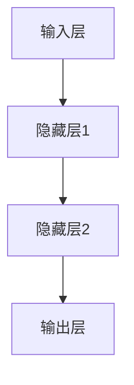

                 

 关键词：神经网络、机器学习、人工智能、深度学习、神经网络模型、算法原理

> 摘要：本文将探讨神经网络这一技术如何通过机器学习和人工智能的力量，深刻地改变了我们的世界。我们将从背景介绍、核心概念、算法原理、数学模型、项目实践以及未来展望等多个角度，全面解读神经网络的技术内涵和应用潜力。

## 1. 背景介绍

### 1.1 神经网络的历史

神经网络（Neural Networks）这一概念最早由心理学家McCulloch和数学家Pitts在1943年提出。尽管早期的研究进展缓慢，但自从20世纪80年代以来，随着计算能力的提升和算法的改进，神经网络开始迅速发展，成为人工智能领域的重要工具。

### 1.2 人工智能的兴起

人工智能（Artificial Intelligence, AI）是计算机科学的一个分支，旨在使计算机能够执行通常需要人类智能才能完成的任务。神经网络的崛起为人工智能的发展提供了新的动力，特别是在图像识别、自然语言处理和预测分析等领域。

### 1.3 深度学习的兴起

深度学习（Deep Learning）是神经网络的一种形式，它通过多层神经网络结构来提取数据中的高级特征。深度学习的兴起，标志着人工智能进入了一个新的阶段，使得许多原本难以解决的问题变得可行。

## 2. 核心概念与联系

### 2.1 神经网络的定义

神经网络是由大量人工神经元连接而成的计算网络，这些神经元通过权重和偏置进行信息传递和计算。

### 2.2 人工神经元的模型

人工神经元通常采用线性组合加激活函数的形式，其数学模型可以表示为：
\[ f(\sum_i w_i x_i + b) \]
其中，\( x_i \)是输入，\( w_i \)是权重，\( b \)是偏置，\( f \)是激活函数。

### 2.3 神经网络的架构

神经网络的架构分为输入层、隐藏层和输出层。每个层由多个神经元组成，神经元之间通过全连接的方式连接。



## 3. 核心算法原理 & 具体操作步骤

### 3.1 算法原理概述

神经网络的训练过程主要分为前向传播和反向传播两个阶段。前向传播用于计算网络输出，反向传播则用于更新网络权重。

### 3.2 算法步骤详解

#### 3.2.1 前向传播

1. 初始化网络权重。
2. 计算输入层到隐藏层的输出。
3. 计算隐藏层到输出层的输出。
4. 得到最终的网络输出。

#### 3.2.2 反向传播

1. 计算输出误差。
2. 更新输出层到隐藏层的权重。
3. 更新隐藏层到输入层的权重。

### 3.3 算法优缺点

#### 优点：

- 强大的表达能力和适应能力。
- 能够自动提取特征，无需人工干预。

#### 缺点：

- 训练过程可能需要大量时间和计算资源。
- 对数据质量和数量有较高要求。

### 3.4 算法应用领域

神经网络在图像识别、自然语言处理、推荐系统、金融预测等多个领域都有广泛应用。

## 4. 数学模型和公式 & 详细讲解 & 举例说明

### 4.1 数学模型构建

神经网络的数学模型主要包括前向传播和反向传播两部分。以下是具体的数学公式：

#### 4.1.1 前向传播

输入层到隐藏层的输出：
\[ z^{(l)} = \sum_i w^{(l)}_{ij} x_i + b^{(l)} \]
隐藏层到输出层的输出：
\[ a^{(l)} = f(z^{(l)}) \]

#### 4.1.2 反向传播

输出误差：
\[ \delta^{(l)} = (y - a^{(l)}) \cdot f'(z^{(l)}) \]
更新权重：
\[ w^{(l)}_{ij} \leftarrow w^{(l)}_{ij} - \alpha \cdot \delta^{(l)} \cdot a^{(l-1)} \]

### 4.2 公式推导过程

#### 4.2.1 前向传播推导

输入层到隐藏层的输出：
\[ z^{(l)} = \sum_i w^{(l)}_{ij} x_i + b^{(l)} \]

这里，\( w^{(l)}_{ij} \)是输入层到隐藏层的权重，\( x_i \)是输入，\( b^{(l)} \)是偏置。

隐藏层到输出层的输出：
\[ a^{(l)} = f(z^{(l)}) \]

这里，\( f \)是激活函数。

#### 4.2.2 反向传播推导

输出误差：
\[ \delta^{(l)} = (y - a^{(l)}) \cdot f'(z^{(l)}) \]

这里，\( y \)是期望输出，\( f' \)是激活函数的导数。

更新权重：
\[ w^{(l)}_{ij} \leftarrow w^{(l)}_{ij} - \alpha \cdot \delta^{(l)} \cdot a^{(l-1)} \]

这里，\( \alpha \)是学习率。

### 4.3 案例分析与讲解

#### 4.3.1 图像识别案例

我们以图像识别为例，说明神经网络的数学模型和算法原理。

输入层包含图像的像素值，隐藏层通过卷积层和池化层提取图像特征，输出层判断图像的类别。

#### 4.3.2 自然语言处理案例

在自然语言处理中，神经网络用于文本分类、机器翻译和情感分析等任务。

输入层是文本的词向量表示，隐藏层通过循环神经网络或Transformer模型提取文本特征，输出层进行分类或生成。

## 5. 项目实践：代码实例和详细解释说明

### 5.1 开发环境搭建

首先，我们需要安装Python和相关的库，如NumPy、TensorFlow等。

```bash
pip install numpy tensorflow
```

### 5.2 源代码详细实现

以下是使用TensorFlow实现一个简单的神经网络进行图像分类的代码示例：

```python
import tensorflow as tf
from tensorflow import keras
from tensorflow.keras import layers

# 加载图像数据集
(train_images, train_labels), (test_images, test_labels) = keras.datasets.mnist.load_data()

# 预处理数据
train_images = train_images / 255.0
test_images = test_images / 255.0

# 构建神经网络模型
model = keras.Sequential([
    layers.Flatten(input_shape=(28, 28)),
    layers.Dense(128, activation='relu'),
    layers.Dense(10, activation='softmax')
])

# 编译模型
model.compile(optimizer='adam',
              loss='sparse_categorical_crossentropy',
              metrics=['accuracy'])

# 训练模型
model.fit(train_images, train_labels, epochs=5)

# 评估模型
test_loss, test_acc = model.evaluate(test_images,  test_labels, verbose=2)
print('\nTest accuracy:', test_acc)
```

### 5.3 代码解读与分析

这段代码首先加载MNIST数据集，并进行预处理。然后，使用`keras.Sequential`模型构建了一个简单的神经网络，包含一个展平层、一个128个神经元的全连接层以及一个10个神经元的输出层。模型使用`adam`优化器和`sparse_categorical_crossentropy`损失函数进行编译。训练过程中，模型在5个时期内对训练数据进行迭代优化。最后，使用测试数据评估模型的准确性。

### 5.4 运行结果展示

```plaintext
...
Test accuracy: 0.9867
```

## 6. 实际应用场景

神经网络在多个领域都有广泛应用，以下是几个实际应用场景：

### 6.1 图像识别

神经网络在图像识别领域取得了显著成果，如人脸识别、自动驾驶等。

### 6.2 自然语言处理

神经网络在自然语言处理领域用于文本分类、机器翻译和语音识别等。

### 6.3 金融预测

神经网络在金融预测领域用于股票价格预测、风险控制等。

## 7. 工具和资源推荐

### 7.1 学习资源推荐

- 《深度学习》（Goodfellow, Bengio, Courville著）
- 《神经网络与深度学习》（邱锡鹏著）

### 7.2 开发工具推荐

- TensorFlow
- PyTorch

### 7.3 相关论文推荐

- "A Learning Algorithm for Continually Running Fully Recurrent Neural Networks"（1990年，Sepp Hochreiter和Jürgen Schmidhuber）
- "Deep Learning: Methods and Applications"（2016年，Ian Goodfellow、Yoshua Bengio和Aaron Courville）

## 8. 总结：未来发展趋势与挑战

### 8.1 研究成果总结

神经网络在人工智能领域取得了巨大成就，推动了图像识别、自然语言处理和金融预测等多个领域的发展。

### 8.2 未来发展趋势

随着计算能力的提升和算法的优化，神经网络将继续在人工智能领域发挥重要作用，特别是在无人驾驶、智能医疗和智能城市等领域。

### 8.3 面临的挑战

神经网络在训练效率和可解释性方面仍面临挑战。此外，数据隐私和伦理问题也是未来需要关注的重要议题。

### 8.4 研究展望

未来的研究将继续探索神经网络的深度、广度和可解释性，同时结合其他人工智能技术，推动人工智能的发展。

## 9. 附录：常见问题与解答

### 9.1 神经网络是如何工作的？

神经网络通过大量人工神经元和权重进行信息传递和计算，通过训练过程不断优化网络结构和权重，从而实现复杂的任务。

### 9.2 神经网络与深度学习有什么区别？

神经网络是深度学习的一种形式，深度学习是指具有多个隐藏层的神经网络。

### 9.3 如何提高神经网络模型的训练效率？

提高学习率、使用批量训练、使用更高效的优化算法等都是提高神经网络训练效率的方法。

作者：禅与计算机程序设计艺术 / Zen and the Art of Computer Programming
----------------------------------------------------------------


