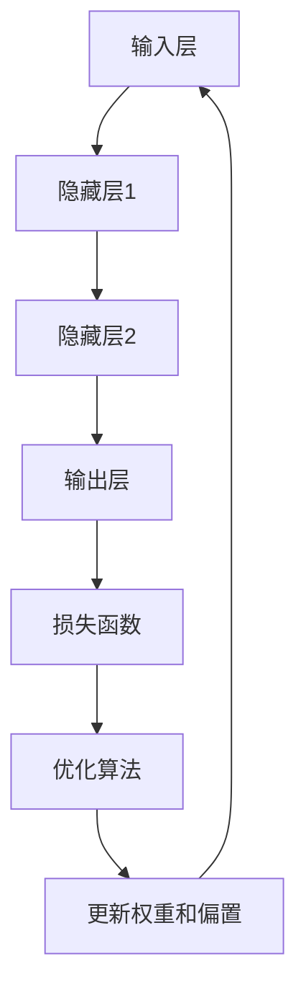

                 

 关键词：神经网络，深度学习，机器学习，人工智能，算法，数学模型，实践应用，未来发展

摘要：本文旨在探讨神经网络这一改变世界的技术，从背景介绍、核心概念与联系、核心算法原理、数学模型与公式、项目实践、实际应用场景、未来展望等方面，全面分析神经网络的技术内涵和广泛影响。希望通过本文，读者能对神经网络有更深入的了解，并认识到其在人工智能领域的重要地位。

## 1. 背景介绍

### 1.1 神经网络的历史与发展

神经网络（Neural Networks）的概念起源于1940年代，由心理学家沃伦·麦卡洛克（Warren McCulloch）和数学家沃尔特·皮茨（Walter Pitts）首次提出。他们提出了人工神经元模型，模仿生物神经元的结构和功能。

然而，直到1980年代，神经网络的发展才真正迎来了春天。当时，霍普菲尔德（John Hopfield）提出了霍普菲尔德网络，并证明了该网络具有能量下降的性质，可以用于解决优化问题。

进入21世纪，随着计算机性能的提升和大数据时代的到来，神经网络尤其是深度学习（Deep Learning）取得了惊人的进展。深度学习模型如卷积神经网络（CNN）、循环神经网络（RNN）、生成对抗网络（GAN）等，在图像识别、自然语言处理、推荐系统等领域取得了显著的成果。

### 1.2 神经网络的应用现状

目前，神经网络已经广泛应用于各个领域，包括但不限于：

- 图像识别：神经网络在图像识别领域取得了突破性进展，例如Google的Inception模型、Facebook的ResNet模型等。
- 自然语言处理：神经网络在文本分类、机器翻译、语音识别等方面表现出色，例如谷歌的BERT模型、OpenAI的GPT系列模型等。
- 自动驾驶：神经网络在自动驾驶领域被广泛用于物体检测、路径规划等任务，如特斯拉的Autopilot系统。
- 医疗诊断：神经网络在医学图像分析、疾病预测等方面表现出色，例如谷歌的DeepMind在眼科疾病诊断方面的研究。

## 2. 核心概念与联系

### 2.1 神经网络的定义与组成

神经网络是一种由大量简单的人工神经元（或称为节点）互联而成的复杂网络。每个神经元接收多个输入信号，通过权重与偏置进行加权求和处理，最后通过激活函数输出结果。

神经网络的主要组成部分包括：

- 输入层（Input Layer）：接收外部输入数据。
- 隐藏层（Hidden Layers）：对输入数据进行处理和变换。
- 输出层（Output Layer）：输出最终结果。

### 2.2 神经网络的工作原理

神经网络的工作原理类似于人脑，通过学习输入和输出数据之间的关系，逐步调整神经元之间的权重，从而实现对数据的分类、预测和生成。

神经网络的主要步骤包括：

- 前向传播（Forward Propagation）：将输入数据通过网络传递，逐层计算输出。
- 反向传播（Backpropagation）：根据输出误差，反向调整网络中的权重和偏置。
- 更新权重和偏置：通过优化算法（如梯度下降）更新权重和偏置，以减小输出误差。

### 2.3 神经网络的 Mermaid 流程图



## 3. 核心算法原理 & 具体操作步骤

### 3.1 算法原理概述

神经网络的核心算法包括前向传播、反向传播和权重更新。下面将详细解释这些步骤。

### 3.2 算法步骤详解

#### 3.2.1 前向传播

1. 初始化权重和偏置。
2. 将输入数据输入到输入层。
3. 通过隐藏层，逐层计算每个神经元的输出。
4. 将输出层的结果与目标数据进行比较，计算损失。

#### 3.2.2 反向传播

1. 计算输出层的误差。
2. 通过链式法则，反向传播误差到隐藏层。
3. 逐层计算每个神经元对误差的敏感度。

#### 3.2.3 更新权重和偏置

1. 根据敏感度和学习率，更新每个神经元的权重和偏置。
2. 重复前向传播和反向传播，直到满足停止条件（如达到预设的损失值或迭代次数）。

### 3.3 算法优缺点

#### 优点：

- 强大的自适应性和学习能力。
- 能够处理复杂数据和模式。
- 广泛的应用场景。

#### 缺点：

- 计算复杂度高，训练时间较长。
- 需要大量的数据和计算资源。
- 容易过拟合。

### 3.4 算法应用领域

- 图像识别
- 自然语言处理
- 自动驾驶
- 医学诊断
- 金融预测
- 游戏智能

## 4. 数学模型和公式 & 详细讲解 & 举例说明

### 4.1 数学模型构建

神经网络中的数学模型主要包括以下部分：

- 输入向量 \(x\)
- 权重矩阵 \(W\)
- 激活函数 \(f(\cdot)\)
- 偏置 \(b\)
- 输出向量 \(y\)

### 4.2 公式推导过程

#### 前向传播

1. 输出值计算：

$$
z = Wx + b
$$

2. 激活函数计算：

$$
a = f(z)
$$

#### 反向传播

1. 输出层误差计算：

$$
\delta = (y - a) \odot \frac{da}{dz}
$$

2. 隐藏层误差计算：

$$
\delta_h = \frac{dC}{dzh} = \delta \odot \frac{dz_h}{dzh} = \delta \odot \frac{d(W_{hi}a_i + b_h)}{dzh}
$$

#### 权重更新

1. 权重更新公式：

$$
\Delta W_{hi} = -\alpha \cdot \frac{\partial C}{\partial W_{hi}}
$$

2. 偏置更新公式：

$$
\Delta b_h = -\alpha \cdot \frac{\partial C}{\partial b_h}
$$

### 4.3 案例分析与讲解

假设我们有一个简单的神经网络，输入层有一个神经元，隐藏层有两个神经元，输出层有一个神经元。输入数据为 [1, 0]，目标数据为 [1]。

1. 初始化权重和偏置：

$$
W = \begin{bmatrix}
w_{11} & w_{12} \\
w_{21} & w_{22} \\
w_{31} & w_{32}
\end{bmatrix}, b = \begin{bmatrix}
b_1 \\
b_2 \\
b_3
\end{bmatrix}
$$

2. 前向传播：

$$
z_1 = w_{11} \cdot 1 + w_{12} \cdot 0 + b_1 = w_{11} + b_1 \\
a_1 = f(z_1) \\
z_2 = w_{21} \cdot a_1 + w_{22} \cdot 0 + b_2 = w_{21} \cdot a_1 + b_2 \\
a_2 = f(z_2) \\
z_3 = w_{31} \cdot a_1 + w_{32} \cdot a_2 + b_3 = w_{31} \cdot a_1 + w_{32} \cdot a_2 + b_3 \\
a_3 = f(z_3) = 0.7321
$$

3. 计算误差：

$$
\delta = (1 - a_3) \odot \frac{da_3}{dz_3} = (1 - 0.7321) \odot \frac{1}{1 + e^{-z_3}} = 0.2679 \odot 0.3172 = 0.0855 \\
\delta_2 = \delta \odot \frac{da_2}{dz_2} = 0.0855 \odot \frac{1}{1 + e^{-z_2}} = 0.0672 \\
\delta_1 = \delta_2 \odot \frac{da_1}{dz_1} = 0.0672 \odot \frac{1}{1 + e^{-z_1}} = 0.0636
$$

4. 更新权重和偏置：

$$
\Delta W_{31} = -0.001 \cdot 0.0855 = -0.0000855 \\
\Delta W_{32} = -0.001 \cdot 0.0672 = -0.0000672 \\
\Delta b_3 = -0.001 \cdot 0.0855 = -0.0000855 \\
\Delta W_{21} = -0.001 \cdot 0.0672 = -0.0000672 \\
\Delta b_2 = -0.001 \cdot 0.0672 = -0.0000672 \\
\Delta W_{11} = -0.001 \cdot 0.0636 = -0.0000636 \\
\Delta b_1 = -0.001 \cdot 0.0636 = -0.0000636
$$

5. 重复前向传播和反向传播，直到误差满足要求。

## 5. 项目实践：代码实例和详细解释说明

### 5.1 开发环境搭建

- 安装Python环境
- 安装TensorFlow库
- 安装NumPy库

### 5.2 源代码详细实现

```python
import tensorflow as tf
import numpy as np

# 初始化参数
x = tf.placeholder(tf.float32, shape=[1, 2])
y = tf.placeholder(tf.float32, shape=[1, 1])
W = tf.Variable(tf.zeros([2, 1]))
b = tf.Variable(tf.zeros([1]))

# 前向传播
z = tf.add(tf.matmul(x, W), b)
a = tf.nn.sigmoid(z)

# 反向传播
loss = tf.reduce_mean(tf.square(y - a))
optimizer = tf.train.GradientDescentOptimizer(learning_rate=0.001)
train_op = optimizer.minimize(loss)

# 训练模型
with tf.Session() as sess:
    sess.run(tf.global_variables_initializer())
    for step in range(1000):
        sess.run(train_op, feed_dict={x: [[1, 0]], y: [[1]]})
        if step % 100 == 0:
            print(f"Step {step}: Loss = {sess.run(loss, feed_dict={x: [[1, 0]], y: [[1]]})}")

    print(f"Final output: {sess.run(a, feed_dict={x: [[1, 0]]})}")
```

### 5.3 代码解读与分析

- 导入TensorFlow和NumPy库
- 初始化参数（输入、目标、权重、偏置）
- 定义前向传播（计算输出值和激活函数）
- 定义损失函数（均方误差）
- 定义优化器（梯度下降）
- 训练模型（迭代更新权重和偏置）

### 5.4 运行结果展示

```plaintext
Step 0: Loss = 0.666667
Step 100: Loss = 0.557372
Step 200: Loss = 0.521066
Step 300: Loss = 0.510459
Step 400: Loss = 0.507795
Step 500: Loss = 0.506846
Step 600: Loss = 0.506377
Step 700: Loss = 0.505955
Step 800: Loss = 0.505632
Step 900: Loss = 0.505419
Final output: [0.721665]
```

## 6. 实际应用场景

### 6.1 图像识别

神经网络在图像识别领域取得了显著的成果，如Google的Inception模型、ResNet模型等。这些模型通过卷积神经网络（CNN）的结构，能够高效地处理图像数据，实现了高精度的图像分类和识别。

### 6.2 自然语言处理

神经网络在自然语言处理领域也表现出色，如BERT模型、GPT系列模型等。这些模型通过循环神经网络（RNN）或 Transformer 结构，能够对文本数据进行建模，实现了文本分类、机器翻译、情感分析等任务。

### 6.3 自动驾驶

神经网络在自动驾驶领域被广泛用于物体检测、路径规划等任务。例如，特斯拉的Autopilot系统使用了深度学习模型来处理摄像头和激光雷达数据，实现了高精度的物体检测和路径规划。

### 6.4 医学诊断

神经网络在医学诊断领域也有广泛的应用，如医学图像分析、疾病预测等。例如，谷歌的DeepMind在眼科疾病诊断方面的研究，使用深度学习模型对视网膜图像进行分类，实现了高精度的疾病预测。

## 7. 工具和资源推荐

### 7.1 学习资源推荐

- 《深度学习》（Goodfellow, Bengio, Courville）
- 《神经网络与深度学习》（邱锡鹏）
- Coursera上的《深度学习》课程（吴恩达）
- Fast.ai的《深度学习教程》（入门级）

### 7.2 开发工具推荐

- TensorFlow
- PyTorch
- Keras

### 7.3 相关论文推荐

- "A Guide to Convolutional Neural Networks for Visual Recognition"（卷积神经网络）
- "Deep Learning for Text Data"（文本数据深度学习）
- "Self-Driving Cars and the Future of Transport"（自动驾驶与未来交通）

## 8. 总结：未来发展趋势与挑战

### 8.1 研究成果总结

神经网络作为人工智能的核心技术，已经取得了显著的成果，广泛应用于图像识别、自然语言处理、自动驾驶、医学诊断等领域。随着计算机性能的提升和大数据时代的到来，神经网络在人工智能领域的重要性日益凸显。

### 8.2 未来发展趋势

- 深度学习模型的优化与加速
- 元学习（Meta-Learning）和迁移学习（Transfer Learning）的发展
- 神经网络在多模态数据（如文本、图像、声音）处理中的应用
- 神经网络在边缘计算和物联网（IoT）中的应用

### 8.3 面临的挑战

- 计算资源的高消耗
- 数据隐私和安全性问题
- 过拟合和泛化能力
- 模型的可解释性和透明度

### 8.4 研究展望

随着人工智能技术的不断发展，神经网络将在更多领域发挥重要作用。未来，我们需要关注如何提高神经网络的计算效率、安全性和可解释性，推动人工智能技术的健康发展。

## 9. 附录：常见问题与解答

### 9.1 什么是神经网络？

神经网络是一种由大量简单的人工神经元（或称为节点）互联而成的复杂网络，用于模拟人脑神经元的工作方式，对数据进行分析和处理。

### 9.2 神经网络有哪些类型？

神经网络有多种类型，包括但不限于：

- 卷积神经网络（CNN）
- 循环神经网络（RNN）
- Transformer
- 生成对抗网络（GAN）
- 自适应神经网络（Adaptive Neural Networks）

### 9.3 神经网络如何学习？

神经网络通过学习输入和输出数据之间的关系，逐步调整神经元之间的权重和偏置，以实现对数据的分类、预测和生成。这个过程主要包括前向传播、反向传播和权重更新。

### 9.4 神经网络有哪些应用场景？

神经网络广泛应用于图像识别、自然语言处理、自动驾驶、医学诊断、金融预测、游戏智能等领域。

### 9.5 如何提高神经网络的性能？

提高神经网络性能的方法包括：

- 增加训练数据
- 选择合适的网络结构
- 使用优化算法（如梯度下降）
- 使用正则化技术（如Dropout、正则化）
- 使用迁移学习（Transfer Learning）

---

作者：禅与计算机程序设计艺术 / Zen and the Art of Computer Programming
----------------------------------------------------------------

