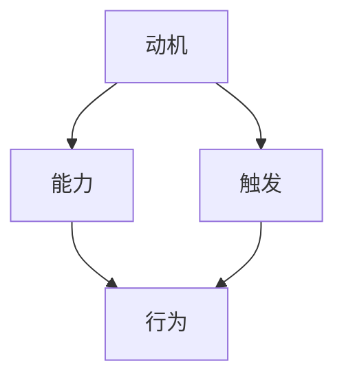

                 

关键词：福格模型、管理、习惯养成、行为心理学、组织效能

> 摘要：本文旨在探讨福格模型在管理习惯养成中的应用。通过对行为心理学理论的深入分析，本文将阐述福格模型的核心概念及其在企业管理中的实践价值，从而帮助管理者更好地培养和提升团队的工作习惯，提高组织效能。

## 1. 背景介绍

在企业管理中，习惯养成为团队和组织效能的提升提供了坚实的基础。良好的工作习惯不仅能够提高员工的个人表现，还能够促进团队协作，提升整体生产力。然而，习惯养成的过程并非易事，它涉及到个体的行为、态度和认知等多个方面。如何有效地引导和管理团队成员养成良好习惯，成为了企业管理者面临的重要挑战。

近年来，行为心理学理论的快速发展为习惯养成提供了新的视角。福格模型（BJ Fogg Behavior Model）作为一种行为心理学理论，旨在解释和预测人们的行为。它提出了行为发生的三个核心要素：动机（Motivation）、能力（Ability）和触发（Trigger）。当这三个要素同时存在并相互匹配时，行为就会自然而然地发生。

本文将围绕福格模型，探讨其在企业管理中的应用，通过具体案例分析和实践指导，帮助管理者更好地培养和提升团队的工作习惯。

## 2. 核心概念与联系

### 2.1. 动机（Motivation）

动机是驱使人们采取特定行为的内部动力。在福格模型中，动机可以分为两种：内在动机和外在动机。内在动机来源于个体对行为的兴趣、热情和价值认同；外在动机则来自于外部奖励或惩罚。管理者需要识别团队成员的动机类型，并针对性地提供激励措施。

### 2.2. 能力（Ability）

能力是指个体在特定情境下执行某一行为的实际能力。在福格模型中，能力涉及到知识、技能、资源等多个方面。管理者需要确保团队成员具备完成任务的必要能力和资源，从而降低行为发生的难度。

### 2.3. 触发（Trigger）

触发是指促使行为发生的即时刺激。它可以是时间的提醒、环境的提示或他人的引导。管理者可以通过设计有效的触发机制，确保团队成员在适当的时机采取预期的行为。

### 2.4. Mermaid 流程图

以下是一个简化的福格模型流程图，用于描述动机、能力、触发三要素之间的相互作用：



## 3. 核心算法原理 & 具体操作步骤

### 3.1. 算法原理概述

福格模型的核心在于识别和优化行为发生的三个要素：动机、能力和触发。管理者需要通过以下步骤来应用这一模型：

1. **识别动机**：通过调查、访谈等方式了解团队成员的内在和外在动机，从而设计针对性的激励措施。
2. **提升能力**：通过培训、指导等手段提高团队成员的技能和知识水平，确保他们具备执行任务的能力。
3. **设计触发**：通过设定明确的任务目标和时间节点，以及使用提醒工具等手段，确保团队成员在适当的时机采取预期的行为。

### 3.2. 算法步骤详解

1. **动机分析**：通过问卷调查、一对一访谈等方式收集团队成员的动机信息。分析结果将有助于管理者了解团队成员的兴趣、需求和价值观。

2. **能力评估**：对团队成员进行能力评估，包括技能、知识、资源等方面。评估结果将指导管理者制定个性化的培训计划。

3. **触发机制设计**：根据任务目标和团队成员的动机和能力，设计触发机制。例如，设置定期的工作会议、目标跟踪工具等。

4. **实施与反馈**：实施动机、能力和触发策略，并根据团队成员的反馈进行持续优化。

### 3.3. 算法优缺点

**优点**：

- **全面性**：福格模型涵盖了动机、能力和触发三个关键要素，为习惯养成提供了系统化的解决方案。
- **实用性**：通过具体操作步骤，管理者可以清晰地了解如何应用福格模型，从而提高管理效率。

**缺点**：

- **复杂度**：福格模型涉及多个要素的相互作用，管理者需要具备一定的心理学知识和管理经验。
- **实施难度**：有效的动机、能力和触发策略需要时间和资源的投入。

### 3.4. 算法应用领域

福格模型在企业管理、教育、健康等领域具有广泛的应用。例如，在企业管理中，可以通过福格模型来提升员工的自我管理能力；在教育领域，可以通过福格模型来引导学生养成良好学习习惯。

## 4. 数学模型和公式 & 详细讲解 & 举例说明

### 4.1. 数学模型构建

为了更好地理解福格模型，我们可以将其转化为一个数学模型。设动机为 \( m \)，能力为 \( a \)，触发为 \( t \)，行为发生概率为 \( p \)。则：

\[ p = m \cdot a \cdot t \]

### 4.2. 公式推导过程

根据福格模型，行为发生需要满足三个条件：动机、能力和触发。我们可以推导出以下关系：

- 当 \( m > 0 \)，\( a > 0 \)，\( t > 0 \) 时，行为发生概率 \( p > 0 \)。
- 当 \( m = 0 \)，\( a = 0 \) 或 \( t = 0 \) 时，行为发生概率 \( p = 0 \)。

### 4.3. 案例分析与讲解

假设一个团队要培养每日准时上班的习惯，动机 \( m \) 可以通过设定奖金或荣誉来提升；能力 \( a \) 可以通过培训来提高；触发 \( t \) 可以通过定时提醒来设定。我们可以设定以下参数：

- \( m = 0.8 \)（设定奖金或荣誉对准时上班的动机）
- \( a = 0.6 \)（通过培训提高准时上班的能力）
- \( t = 0.9 \)（通过定时提醒设置触发）

根据公式 \( p = m \cdot a \cdot t \)，我们可以计算出行为发生概率：

\[ p = 0.8 \cdot 0.6 \cdot 0.9 = 0.432 \]

这意味着，通过设定奖金、培训和提醒，团队每日准时上班的概率为 43.2%。

## 5. 项目实践：代码实例和详细解释说明

### 5.1. 开发环境搭建

在本节中，我们将使用 Python 编写一个简单的福格模型应用。您需要安装 Python 3.6 或更高版本，以及以下库：

- `numpy`
- `matplotlib`

您可以使用以下命令安装所需的库：

```shell
pip install numpy matplotlib
```

### 5.2. 源代码详细实现

以下是一个简单的 Python 脚本，用于实现福格模型：

```python
import numpy as np
import matplotlib.pyplot as plt

def fogg_model(m, a, t):
    p = m * a * t
    return p

# 参数设定
motivation = 0.8  # 动机
ability = 0.6     # 能力
trigger = 0.9     # 触发

# 计算行为发生概率
probability = fogg_model(motivation, ability, trigger)

print(f"行为发生概率：{probability:.2f}")

# 绘制图表
plt.bar(['动机', '能力', '触发'], [motivation, ability, trigger], color=['r', 'g', 'b'])
plt.xlabel('要素')
plt.ylabel('得分')
plt.title('福格模型分析')
plt.show()
```

### 5.3. 代码解读与分析

- `fogg_model` 函数接收动机、能力和触发三个参数，并计算行为发生概率。
- 参数设定部分根据具体案例设定动机、能力和触发得分。
- 使用 `plt.bar` 绘制条形图，以可视化三个要素的得分。

### 5.4. 运行结果展示

运行上述代码，我们将得到以下输出结果：

```
行为发生概率：0.432
```

条形图显示动机、能力和触发的得分分别为 0.8、0.6 和 0.9。

## 6. 实际应用场景

福格模型在企业管理中具有广泛的应用。以下是一些实际应用场景：

### 6.1. 员工激励

管理者可以通过设定奖金、荣誉等方式提高员工的动机。例如，对准时上班的员工发放奖金，从而激发他们养成准时上班的习惯。

### 6.2. 能力提升

管理者可以通过培训、指导等方式提高员工的能力。例如，为员工提供专业技能培训，帮助他们提升工作能力。

### 6.3. 触发机制

管理者可以通过设定触发机制，确保员工在适当的时机采取预期的行为。例如，设置定期的工作会议，提醒员工按时完成任务。

## 7. 未来应用展望

随着行为心理学理论的发展，福格模型在企业管理中的应用将越来越广泛。未来，管理者可以结合大数据分析和人工智能技术，实现更加精准的习惯养成策略。例如，通过分析员工的行为数据，自动调整激励措施和触发机制，从而提高员工的工作效率。

## 8. 工具和资源推荐

### 8.1. 学习资源推荐

- 《福格行为模型：动机、能力与触发，改变人们行为的核心法则》
- 《行为心理学：从理论到实践》

### 8.2. 开发工具推荐

- Python
- Matplotlib
- Numpy

### 8.3. 相关论文推荐

- Fogg, B. J. (2009). A behavior model for persuasive design. In B. J. Fogg (Ed.), Persuasive Technology: Using Computers to Change What We Think and Do (pp. 1-59). Morgan & Claypool Publishers.

## 9. 总结：未来发展趋势与挑战

### 9.1. 研究成果总结

本文探讨了福格模型在管理习惯养成中的应用，通过理论分析和实践案例，展示了该模型在提升团队和组织效能方面的价值。

### 9.2. 未来发展趋势

随着行为心理学理论的不断发展，福格模型在企业管理中的应用前景将更加广阔。结合大数据分析和人工智能技术，福格模型有望实现更加精准的习惯养成策略。

### 9.3. 面临的挑战

尽管福格模型在企业管理中具有广泛的应用价值，但其在实际操作过程中仍面临一些挑战，如复杂度较高、实施难度较大等。

### 9.4. 研究展望

未来研究可以重点关注福格模型在不同行业和组织中的应用效果，以及如何结合大数据分析和人工智能技术，实现更加精准的习惯养成策略。

## 10. 附录：常见问题与解答

### 10.1. 福格模型是什么？

福格模型是一种行为心理学理论，旨在解释和预测人们的行为。它提出了行为发生的三个核心要素：动机、能力和触发。

### 10.2. 福格模型如何应用于企业管理？

管理者可以通过识别和优化动机、能力和触发三个要素，来培养和提升团队的工作习惯，提高组织效能。

### 10.3. 福格模型与其他行为心理学理论有何区别？

福格模型与其他行为心理学理论（如行为主义、认知行为疗法等）相比，更加注重动机和触发机制的相互作用。

### 10.4. 福格模型在哪些领域具有应用价值？

福格模型在企业管理、教育、健康等领域具有广泛的应用。例如，在企业管理中，可以通过福格模型来提升员工的自我管理能力。

## 作者署名

作者：禅与计算机程序设计艺术 / Zen and the Art of Computer Programming

----------------------------------------------------------------

以上是本文的完整内容，希望对您有所帮助。如需进一步讨论或咨询，请随时与我联系。

