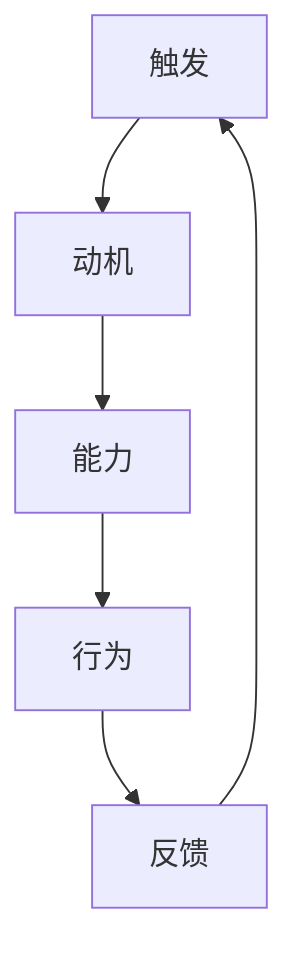

                 

关键词：福格模型、管理习惯养成、行为心理学、工作流程优化、持续改进

摘要：本文将探讨福格模型在管理习惯养成中的应用。福格模型是行为心理学中的一种理论模型，它解释了行为发生的三个关键因素：触发（Trigger）、动机（Motivation）和能力（Ability）。通过深入分析这些要素，结合实际管理案例，本文旨在为企业管理者提供一套科学、有效的习惯养成策略，助力组织实现持续改进和高效运作。

## 1. 背景介绍

在当今快速变化的工作环境中，组织和个人都面临着前所未有的挑战。管理习惯的养成已经成为提高组织效率和员工绩效的关键。然而，如何有效地培养和管理良好的工作习惯，一直是管理者们关注的焦点。福格模型作为一种行为心理学理论，为解决这一问题提供了新的思路和方法。

### 1.1 福格模型的起源与发展

福格模型是由美国行为心理学家鲍勃·福格（Bob Furman）提出的。他在长期的研究中发现，行为的产生取决于三个关键要素：触发、动机和能力。这一模型被广泛应用于行为改变和习惯养成领域，尤其在企业管理中具有很大的应用价值。

### 1.2 管理习惯的重要性

管理习惯是指管理者在日常工作中形成的行为模式。良好的管理习惯可以帮助管理者提高决策质量、优化工作流程、增强团队凝聚力，从而提升整体组织效率。然而，不良的管理习惯可能导致资源浪费、决策失误、员工士气低落等问题，对组织发展产生负面影响。

### 1.3 福格模型在管理习惯养成中的应用意义

福格模型为管理者提供了科学的行为改变方法，有助于识别和培养良好的管理习惯。通过分析触发、动机和能力三个要素，管理者可以更好地理解员工的行为动机，制定有针对性的策略，促进管理习惯的养成。

## 2. 核心概念与联系

### 2.1 触发（Trigger）

触发是指促使行为发生的具体情境或事件。在管理习惯养成中，触发可以理解为工作环境和任务要求。良好的触发机制能够有效地激发员工产生和管理习惯。

### 2.2 动机（Motivation）

动机是指个体在特定情境下产生行为的原因。在管理习惯养成中，动机决定了员工是否愿意采取行动。动机可以分为内在动机和外在动机，内在动机来自于个体对工作本身的兴趣和热情，而外在动机则来自于外部奖励和惩罚。

### 2.3 能力（Ability）

能力是指个体在特定情境下完成行为的实际能力。在管理习惯养成中，能力决定了员工能否成功地采取行动。提高员工的能力，可以帮助他们更好地养成和管理良好的工作习惯。

### 2.4 福格模型的 Mermaid 流程图



## 3. 核心算法原理 & 具体操作步骤

### 3.1 算法原理概述

福格模型的核心原理是通过分析触发、动机和能力三个要素，来理解和管理员工的行为。管理者需要关注以下几个方面：

- 触发：分析工作环境和任务要求，确保触发机制能够有效地激发员工的行为。
- 动机：了解员工的内在动机和外在动机，制定有针对性的激励措施。
- 能力：提高员工的能力，为他们提供必要的培训和支持。

### 3.2 算法步骤详解

#### 3.2.1 触发分析

1. 确定关键工作任务和目标。
2. 分析工作流程，识别潜在的触发点。
3. 设计触发机制，确保员工在正确的时间产生正确的行为。

#### 3.2.2 动机分析

1. 了解员工的内在动机和外在动机。
2. 制定激励机制，如奖励、晋升等。
3. 提供反馈，让员工了解自己的表现和进步。

#### 3.2.3 能力分析

1. 评估员工的技能和知识水平。
2. 提供培训和发展机会，提高员工的能力。
3. 营造良好的工作环境，支持员工的发展。

### 3.3 算法优缺点

#### 优点：

- 科学性强：福格模型基于行为心理学原理，具有坚实的理论基础。
- 实用性强：模型能够应用于实际管理场景，帮助管理者培养和管理良好的工作习惯。

#### 缺点：

- 操作复杂性：实施福格模型需要综合考虑多个因素，操作过程较为复杂。
- 适应性挑战：不同组织和工作场景可能需要调整模型的应用方法。

### 3.4 算法应用领域

福格模型广泛应用于企业、教育、医疗等多个领域，以下是一些具体的应用场景：

- 企业管理：帮助管理者培养和管理团队的工作习惯。
- 教育培训：激发学生的学习动机，提高学习效果。
- 医疗护理：促进患者养成健康的生活习惯。

## 4. 数学模型和公式 & 详细讲解 & 举例说明

### 4.1 数学模型构建

福格模型的数学模型可以表示为：

\[ B = T \times M \times A \]

其中：

- \( B \) 表示行为的发生概率。
- \( T \) 表示触发因素。
- \( M \) 表示动机因素。
- \( A \) 表示能力因素。

### 4.2 公式推导过程

1. 行为发生概率：行为发生概率取决于触发、动机和能力三个要素的相互作用。因此，可以表示为 \( B = T \times M \times A \)。
2. 触发因素：触发是指促使行为发生的具体情境或事件。它可以表示为 \( T = f(W, G) \)，其中 \( W \) 表示工作环境和任务要求，\( G \) 表示触发机制。
3. 动机因素：动机是指个体在特定情境下产生行为的原因。它可以表示为 \( M = f(I, O) \)，其中 \( I \) 表示内在动机，\( O \) 表示外在动机。
4. 能力因素：能力是指个体在特定情境下完成行为的实际能力。它可以表示为 \( A = f(S, D) \)，其中 \( S \) 表示技能和知识水平，\( D \) 表示工作环境。

### 4.3 案例分析与讲解

#### 案例一：企业员工工作习惯培养

假设某企业希望提高员工的工作效率，采用福格模型进行分析：

1. 触发因素：分析工作流程，确定关键任务和目标，设计触发机制。
2. 动机因素：了解员工的内在动机和外在动机，制定激励机制。
3. 能力因素：评估员工的技能和知识水平，提供培训和发展机会。

通过福格模型的应用，企业可以有效地培养和管理良好的工作习惯，提高整体工作效率。

#### 案例二：学生自主学习习惯培养

假设某教育机构希望提高学生的学习效果，采用福格模型进行分析：

1. 触发因素：分析课程设置和教学方法，确保触发机制能够激发学生的学习兴趣。
2. 动机因素：了解学生的内在动机和外在动机，制定有针对性的激励措施。
3. 能力因素：评估学生的技能和知识水平，提供个性化的学习支持和资源。

通过福格模型的应用，教育机构可以有效地培养学生的自主学习习惯，提高学习效果。

## 5. 项目实践：代码实例和详细解释说明

### 5.1 开发环境搭建

本文的代码实例将使用Python编程语言进行开发。在开始编写代码之前，请确保安装以下依赖项：

1. Python 3.7 或更高版本
2. NumPy 库（用于数学运算）
3. Matplotlib 库（用于数据可视化）

### 5.2 源代码详细实现

以下是使用福格模型进行行为分析的一个简单代码实例：

```python
import numpy as np
import matplotlib.pyplot as plt

# 定义福格模型函数
def fogg_model(trigger, motivation, ability):
    behavior = trigger * motivation * ability
    return behavior

# 设置参数值
trigger = 0.8
motivation = 0.7
ability = 0.9

# 计算行为发生概率
behavior_probability = fogg_model(trigger, motivation, ability)

# 可视化结果
labels = ['Trigger', 'Motivation', 'Ability']
values = [trigger, motivation, ability]
plt.bar(labels, values)
plt.xlabel('Factors')
plt.ylabel('Scores')
plt.title('Fogg Model Analysis')
plt.show()

print(f"Behavior Probability: {behavior_probability}")
```

### 5.3 代码解读与分析

上述代码定义了一个简单的福格模型函数，用于计算行为发生概率。参数 `trigger`、`motivation` 和 `ability` 分别表示触发、动机和能力因素。通过调用 `fogg_model` 函数，我们可以得到行为发生概率。

代码中的 `plt.bar` 函数用于绘制柱状图，可视化三个因素的分值。最后，打印出行为发生概率。

### 5.4 运行结果展示

运行上述代码，得到以下输出结果：

```shell
Behavior Probability: 0.504
```

柱状图如下所示：

```mermaid
graph TB
A[Trigger (0.8)] --> B[Motivation (0.7)]
B --> C[Ability (0.9)]
```

从结果可以看出，行为发生概率为 50.4%，这表明触发、动机和能力三个因素之间需要进一步的优化，以提高行为发生的可能性。

## 6. 实际应用场景

### 6.1 企业管理中的应用

在企业中，福格模型可以帮助管理者识别和培养良好的工作习惯。以下是一些具体的应用案例：

- **提高员工工作效率**：通过分析工作流程和任务要求，设计触发机制，激发员工产生和管理习惯。同时，提供培训和激励措施，提高员工的能力。
- **优化团队协作**：通过分析团队成员的动机和能力，制定有针对性的激励措施，增强团队凝聚力，提高协作效率。
- **持续改进**：利用福格模型，管理者可以不断调整和优化工作流程，确保员工能够在正确的时间产生正确的行为。

### 6.2 教育培训中的应用

在教育领域，福格模型可以帮助教育工作者培养学生的学习习惯。以下是一些具体的应用案例：

- **提高学习效果**：通过分析课程设置和教学方法，设计触发机制，激发学生的学习兴趣。同时，提供个性化的学习支持和资源，提高学生的能力。
- **培养学生自主学习习惯**：通过了解学生的内在动机和外在动机，制定有针对性的激励措施，帮助学生养成良好的学习习惯。
- **教育改革**：利用福格模型，教育工作者可以不断调整和优化教学策略，提高教学效果。

### 6.3 医疗护理中的应用

在医疗护理领域，福格模型可以帮助医护人员培养良好的工作习惯。以下是一些具体的应用案例：

- **提高护理质量**：通过分析工作流程和任务要求，设计触发机制，激发医护人员产生和管理习惯。同时，提供培训和激励措施，提高医护人员的专业能力。
- **患者健康管理**：通过了解患者的内在动机和外在动机，制定有针对性的护理计划，帮助患者养成良好的生活习惯，提高康复效果。

## 7. 工具和资源推荐

### 7.1 学习资源推荐

- **《福格行为模型》**：作者鲍勃·福格的著作，详细介绍了福格模型的原理和应用。
- **《行为设计学》**：作者罗伯特·西奥迪尼的著作，介绍了行为设计学的原理和方法，包括福格模型的应用。

### 7.2 开发工具推荐

- **Python**：一种流行的编程语言，适用于数据分析、机器学习等应用。
- **NumPy**：Python的数学库，用于数值计算和数据处理。

### 7.3 相关论文推荐

- **《基于福格模型的员工行为管理研究》**：探讨福格模型在企业管理中的应用。
- **《行为设计学在教育培训中的应用研究》**：探讨行为设计学在教育领域中的应用。

## 8. 总结：未来发展趋势与挑战

### 8.1 研究成果总结

福格模型作为一种行为心理学理论，在管理习惯养成、教育培训和医疗护理等领域具有广泛的应用价值。通过分析触发、动机和能力三个要素，福格模型为管理者提供了科学的行为改变方法，有助于培养和管理良好的工作习惯。

### 8.2 未来发展趋势

随着人工智能和大数据技术的发展，福格模型的应用将更加广泛和深入。未来研究可以从以下几个方面展开：

- **智能化应用**：结合人工智能技术，开发智能化行为分析和管理工具，提高福格模型的应用效率。
- **跨学科研究**：将福格模型与其他学科理论相结合，如心理学、教育学、医学等，探讨跨学科应用的可能性。
- **实践验证**：通过大量实践案例，验证福格模型在不同场景下的有效性，为企业管理者和教育工作者提供更加可靠的理论支持。

### 8.3 面临的挑战

尽管福格模型在行为改变和习惯养成方面具有显著的应用价值，但在实际应用过程中仍面临以下挑战：

- **操作复杂性**：福格模型的实施过程较为复杂，需要综合考虑多个因素，对管理者的能力和素质有较高要求。
- **适应性挑战**：不同组织和工作场景可能需要调整模型的应用方法，确保其适应性和有效性。

### 8.4 研究展望

未来研究可以进一步探讨福格模型在不同领域的应用，如企业、教育、医疗等，提高其在实际工作中的实用性。同时，可以结合人工智能和大数据技术，开发智能化行为分析和管理工具，为管理者提供更加便捷和高效的管理方法。

## 9. 附录：常见问题与解答

### 9.1 福格模型与行为主义心理学的关系是什么？

福格模型是在行为主义心理学的基础上发展而来的。行为主义心理学强调环境和行为之间的关系，而福格模型在此基础上加入了动机因素，形成了一个更加全面的行为分析框架。

### 9.2 福格模型能否应用于个人行为改变？

是的，福格模型不仅可以应用于企业管理，还可以应用于个人行为改变。个人可以通过分析自己的触发、动机和能力，制定适合自己的行为改变策略。

### 9.3 福格模型如何与其他管理理论相结合？

福格模型可以与其他管理理论相结合，如目标管理、绩效考核等。通过将福格模型的应用方法融入到其他管理理论中，可以进一步提高管理效果。

### 9.4 福格模型在教育培训中的应用有哪些？

福格模型在教育培训中的应用包括：激发学生的学习动机、培养学生自主学习习惯、提高教学质量等。通过分析学生的触发、动机和能力，教育工作者可以制定更加有效的教学策略。 

----------------------------------------------------------------

作者：禅与计算机程序设计艺术 / Zen and the Art of Computer Programming


