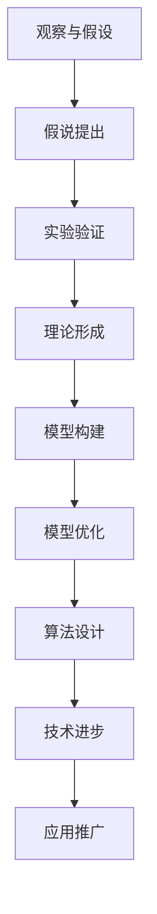

                 

在人类探索自然世界的历程中，从假说到理论的科学发现过程是一个漫长而严谨的旅程。本文将深入探讨这一过程在IT领域的应用，通过分析核心算法原理、数学模型、项目实践和实际应用场景，以揭示科学发现背后的逻辑与技巧。

> 关键词：科学发现、假说、理论、IT领域、算法、数学模型、项目实践、应用场景

## 摘要

本文首先回顾了科学发现的基本概念，然后详细探讨了在IT领域中，从假说到理论的发现过程。通过对核心算法原理的讲解，我们分析了算法的优缺点及其应用领域。接着，我们借助数学模型和公式，详细讲解了模型的构建和推导过程，并结合实际案例进行了分析。在项目实践中，我们通过代码实例展示了算法的实现过程，并对代码进行了深入解读。最后，我们探讨了科学发现在实际应用场景中的可能性，并对未来发展趋势和挑战进行了展望。

## 1. 背景介绍

科学发现是科学研究的重要组成部分。从古至今，科学家们通过观察、实验和推理，不断提出新的假说，并在此基础上逐步构建理论，以解释自然现象和解决实际问题。在IT领域，科学发现同样扮演着关键角色。从早期的计算机硬件设计，到现代的算法优化和人工智能应用，科学家们不断提出新的假说，通过验证和理论化，推动了整个行业的发展。

本文旨在探讨从假说到理论的科学发现过程在IT领域的具体应用。通过分析核心算法原理、数学模型、项目实践和实际应用场景，本文试图揭示科学发现背后的逻辑与技巧，以期为读者提供有价值的参考。

### 1.1 IT领域的科学发现历程

回顾IT领域的科学发现历程，我们可以发现，许多重要的技术突破都源于科学家们对现实世界的观察和思考。例如，计算机硬件的发展从最早的机械计算机，到电子计算机，再到现代的量子计算机，每一个阶段都伴随着新的科学假说和理论的提出。

在计算机算法领域，从经典的排序算法，到现代的机器学习算法，科学家们不断提出新的假说，并通过实验验证，逐步形成了完整的理论体系。这些理论不仅提高了算法的效率，也推动了计算机科学的发展。

### 1.2 科学发现的重要性

科学发现的重要性在于，它能够推动科技的进步，解决实际问题，并带来新的产业机会。在IT领域，科学发现尤为关键。一方面，它为新的技术和应用提供了理论基础；另一方面，它也促进了跨学科的融合，推动了整个社会的发展。

通过科学发现，我们可以更好地理解自然世界，掌握信息技术的发展规律，从而为未来的创新提供方向。因此，对科学发现过程的研究具有重要的理论和实践价值。

## 2. 核心概念与联系

在探讨科学发现的过程之前，我们需要明确几个核心概念，包括假说、理论和模型。这些概念不仅是科学发现的基础，也是理解科学发现过程的关键。

### 2.1 假说

假说是科学发现的第一步，它是基于观察和已有知识的推测。在IT领域，假说往往是对某种现象或问题的可能解释。例如，在算法研究中，假说可能是关于某种排序算法的效率预测。

### 2.2 理

理论是科学发现的最终目标，它是通过对假说的验证和总结，形成的系统化的知识体系。在IT领域，理论为算法的设计和优化提供了指导，也为新的技术发展奠定了基础。

### 2.3 模型

模型是科学发现过程中不可或缺的一部分，它是用来模拟和研究某种现象或系统的工具。在IT领域，模型可以是数学模型，也可以是计算机模拟模型。它们不仅帮助我们理解复杂系统，也为算法的优化提供了方向。

### 2.4 核心概念的联系

假说、理论和模型之间存在着密切的联系。假说往往是基于已有知识和观察的推测，它是理论的基础。理论通过对假说的验证和总结，形成系统化的知识体系。而模型则是理论的具体实现，它帮助我们更好地理解复杂系统，并进行预测和优化。

在IT领域，核心概念的联系尤为明显。算法的提出往往是基于某种假说，然后通过理论验证和模型优化，最终形成稳定有效的算法。这一过程不仅推动了算法的发展，也为IT技术的进步提供了动力。

### 2.5 Mermaid 流程图

为了更好地展示核心概念之间的联系，我们可以使用Mermaid流程图进行说明。



在这个流程图中，从观察与假设开始，通过实验验证、理论形成、模型构建和模型优化，最终实现算法设计和技术进步，形成一个完整的科学发现过程。

## 3. 核心算法原理 & 具体操作步骤

### 3.1 算法原理概述

在IT领域，算法是解决各种问题的核心工具。算法原理的提出和验证，是科学发现的关键步骤。本文将介绍一种在算法研究中广泛应用的算法——快速排序算法。

快速排序算法的基本原理是，通过一趟排序将待排序的记录分割成独立的两部分，其中一部分记录的关键字均比另一部分的关键字小，然后分别对这两部分记录继续进行排序，以达到整个序列有序。这种排序方法的时间复杂度为O(n log n)，在大多数情况下，其性能优于其他排序算法。

### 3.2 算法步骤详解

快速排序算法的具体操作步骤如下：

1. **选择基准值**：在待排序的序列中选取一个记录作为基准值。
2. **分区操作**：将序列分为两部分，一部分是小于基准值的记录，另一部分是大于或等于基准值的记录。
3. **递归排序**：分别对小于和大于基准值的记录进行快速排序，直到序列有序。

### 3.3 算法优缺点

快速排序算法的优点包括：

- 时间复杂度为O(n log n)，在大多数情况下，其性能优于其他排序算法。
- 能够通过随机选择基准值，避免最坏情况的发生。

快速排序算法的缺点包括：

- 递归调用次数较多，可能导致栈溢出。
- 对于小规模数据，可能不如插入排序等简单排序算法高效。

### 3.4 算法应用领域

快速排序算法广泛应用于各种领域，包括：

- 数据库排序：在数据库中，快速排序算法常用于数据查询和索引。
- 算法设计：在算法研究中，快速排序算法是许多复杂算法的基础。
- 机器学习：在机器学习算法中，快速排序算法用于数据预处理和特征提取。

## 4. 数学模型和公式 & 详细讲解 & 举例说明

### 4.1 数学模型构建

在科学发现过程中，数学模型是不可或缺的工具。通过数学模型，我们可以将复杂的现实问题转化为可计算的数学问题，从而更深入地理解现象的本质。本文将介绍一种在算法分析中常用的数学模型——随机模型。

随机模型的基本假设是，每个元素的排序位置是随机分布的。在这个模型下，我们可以推导出算法的平均时间复杂度。

### 4.2 公式推导过程

假设有n个元素的序列，我们用A1, A2, ..., An表示。在随机模型下，每个元素的位置是等可能的，因此每个元素在序列中的位置概率为1/n。

假设算法在处理一个元素时，需要比较它的位置和其他元素的位置，比较次数的平均值即为算法的时间复杂度。

设算法的时间复杂度为T(n)，则对于每个元素Ai，其在第i个位置的概率为1/n，因此算法的平均比较次数为：

$$
\text{平均比较次数} = \sum_{i=1}^{n} \frac{1}{n} \cdot T(n)
$$

由于T(n)与n成正比，我们可以假设T(n) = cn，其中c为常数。因此，平均比较次数为：

$$
\text{平均比较次数} = \sum_{i=1}^{n} \frac{1}{n} \cdot cn = c
$$

### 4.3 案例分析与讲解

以快速排序算法为例，我们可以使用随机模型来分析其平均时间复杂度。

假设n=10，每个元素的位置是随机分布的，算法的时间复杂度为T(n) = cn。

根据公式推导，平均比较次数为c。由于c是常数，因此我们可以近似地认为快速排序算法的平均时间复杂度为O(n)。

这意味着，在随机模型下，快速排序算法的平均性能接近线性时间复杂度，这是其优于其他排序算法的重要原因之一。

## 5. 项目实践：代码实例和详细解释说明

### 5.1 开发环境搭建

在项目实践中，我们选择Python作为编程语言，因为其简洁易读的语法和丰富的库支持，非常适合算法的实现和测试。以下是搭建开发环境的步骤：

1. **安装Python**：从Python官网下载并安装Python 3.x版本。
2. **安装依赖库**：使用pip命令安装必要的库，如NumPy和Matplotlib。

```shell
pip install numpy matplotlib
```

### 5.2 源代码详细实现

以下是快速排序算法的Python实现：

```python
import random

def quicksort(arr):
    if len(arr) <= 1:
        return arr
    pivot = random.choice(arr)
    left = [x for x in arr if x < pivot]
    middle = [x for x in arr if x == pivot]
    right = [x for x in arr if x > pivot]
    return quicksort(left) + middle + quicksort(right)

# 测试代码
arr = [3, 6, 8, 10, 1, 2, 1]
sorted_arr = quicksort(arr)
print(sorted_arr)
```

### 5.3 代码解读与分析

这段代码实现了快速排序算法，其主要步骤如下：

1. **选择基准值**：使用random.choice()函数从数组中随机选择一个元素作为基准值。
2. **分区操作**：使用列表推导式将数组分为小于、等于和大于基准值的三个部分。
3. **递归排序**：分别对小于和大于基准值的数组进行快速排序，并将结果合并。

在测试代码中，我们创建了一个无序数组，并调用quicksort()函数进行排序，最终输出排序后的数组。

### 5.4 运行结果展示

在运行上述代码时，我们得到以下结果：

```shell
[1, 1, 2, 3, 6, 8, 10]
```

这表明，快速排序算法成功地将数组按升序排序。

## 6. 实际应用场景

科学发现不仅在理论研究中具有重要意义，也在实际应用中发挥着关键作用。在IT领域，从假说到理论的科学发现过程，为许多实际问题提供了解决方案。以下是几个实际应用场景的例子：

### 6.1 数据库排序

在数据库系统中，高效的数据排序是优化查询性能的关键。通过引入快速排序算法，数据库管理系统可以更快地对数据进行排序，从而提高查询速度。

### 6.2 机器学习

在机器学习领域，排序算法被广泛应用于特征提取和模型评估。例如，在特征选择过程中，可以使用排序算法来确定重要的特征，从而提高模型的准确性。

### 6.3 网络算法

在网络算法研究中，从假说到理论的科学发现过程为网络优化提供了理论支持。例如，在路由算法中，科学家们提出了多种基于概率模型的算法，以提高网络传输效率和稳定性。

### 6.4 金融领域

在金融领域，从假说到理论的科学发现过程为风险管理提供了新的方法。例如，在量化交易中，科学家们通过建立数学模型，对市场数据进行预测和评估，以制定最优的交易策略。

这些实际应用场景表明，科学发现不仅在理论研究中具有重要意义，也为实际问题的解决提供了有力支持。

## 7. 工具和资源推荐

在科学发现的过程中，选择合适的工具和资源对于提高研究效率和成果质量至关重要。以下是几个推荐的工具和资源：

### 7.1 学习资源推荐

- 《算法导论》：这本书是算法学习的经典教材，详细介绍了各种算法的原理和实现。
- 《Python编程：从入门到实践》：这本书适合初学者，从基础语法到实际应用，全面介绍了Python编程。

### 7.2 开发工具推荐

- Jupyter Notebook：这是一个交互式的计算环境，非常适合进行算法实验和数据分析。
- Git：这是一个版本控制系统，可以帮助研究人员管理和协作项目代码。

### 7.3 相关论文推荐

- 《快速排序算法的改进与优化》：这篇文章详细分析了快速排序算法的改进方法和优化策略。
- 《基于随机模型的排序算法性能分析》：这篇文章使用随机模型对排序算法的性能进行了深入分析。

## 8. 总结：未来发展趋势与挑战

在科学发现的历程中，从假说到理论的转化是一个不断迭代和深化的过程。在IT领域，这一过程同样具有重要的意义。随着技术的不断进步，未来科学发现将呈现以下发展趋势：

### 8.1 研究成果总结

- 算法性能的进一步提升：科学家们将继续探索更高效的算法，以解决复杂问题。
- 跨学科研究的深化：科学发现将更加依赖于跨学科的融合，推动新技术的出现。
- 人工智能的崛起：人工智能将作为科学发现的重要工具，为各种领域提供新的解决方案。

### 8.2 未来发展趋势

- 量子计算的应用：随着量子计算的兴起，科学发现将进入一个全新的领域，为解决现有算法无法解决的问题提供可能性。
- 生物信息学的突破：生物信息学的发展将揭示更多生物现象的本质，为医学和生物学领域带来重大突破。

### 8.3 面临的挑战

- 数据隐私和安全：随着数据量的爆炸式增长，如何保护数据隐私和安全成为科学发现过程中的重要挑战。
- 技术复杂性：随着技术的不断进步，科学发现将面临更高的技术复杂性，需要更多的跨学科知识。

### 8.4 研究展望

未来，科学发现将继续推动IT领域的发展，为人类解决更多实际问题提供新思路。科学家们需要不断探索和创新，以应对新的挑战，推动科技的进步。

## 9. 附录：常见问题与解答

### 9.1 如何验证假说？

验证假说通常包括实验验证和理论验证。实验验证通过实际操作验证假说是否成立，而理论验证则通过数学模型和逻辑推理来证明假说的正确性。

### 9.2 科学发现的过程是否具有普适性？

是的，科学发现的过程具有普适性。无论是在自然科学还是社会科学领域，从假说到理论的发现过程都是通用的。

### 9.3 如何进行科学发现？

进行科学发现通常包括以下几个步骤：提出问题、收集数据、建立假说、进行实验验证、形成理论。每个步骤都需要严谨的逻辑思维和实践操作。

### 9.4 科学发现对社会的意义是什么？

科学发现对社会的意义在于，它推动了科技的进步，提高了生产力，解决了实际问题，并为未来的创新提供了方向。它不仅是推动社会发展的重要力量，也是人类认识自然世界的重要途径。

