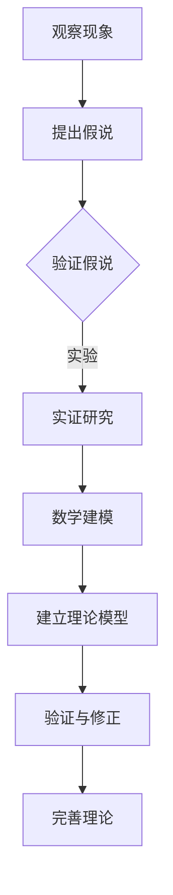

                 

关键词：科学方法、假说、理论、实证研究、数学建模、算法设计、编程实践、技术应用、未来展望

> 摘要：本文将深入探讨科学发现的过程，从假说到理论的形成，以及其在计算机科学领域的应用。文章将介绍科学方法的基本原理，解释假说和理论的区别，并探讨如何通过实证研究和数学建模来验证和扩展科学理论。此外，文章还将结合实际编程实践，展示科学理论在计算机领域的具体应用，并对未来科学发现的发展趋势和挑战进行展望。

## 1. 背景介绍

科学发现是人类认识世界、理解自然规律的重要过程。从古代的哲学思辨到现代的实证研究，科学方法在推动人类文明进步中发挥了不可或缺的作用。科学发现的过程通常包括观察现象、提出假说、进行实验验证、建立理论模型，并通过反复验证和修正不断完善。在计算机科学领域，科学发现同样具有重要意义，它不仅推动了技术的进步，还促进了新理论和新算法的发展。

本文旨在探讨科学发现的过程，从假说到理论的形成，以及其在计算机科学领域的应用。文章将首先介绍科学方法的基本原理，解释假说和理论的区别。接着，我们将探讨如何通过实证研究和数学建模来验证和扩展科学理论。随后，文章将通过实际编程实践，展示科学理论在计算机领域的具体应用。最后，我们将对未来科学发现的发展趋势和挑战进行展望。

## 2. 核心概念与联系

### 2.1 科学方法

科学方法是一种系统的、理性的方法，用于发现和解释自然现象。科学方法通常包括以下步骤：

1. **观察与提出问题**：通过观察现象，提出需要解释的问题。
2. **假设**：根据已有的知识和观察，提出可能的解释（假说）。
3. **实验验证**：设计实验，收集数据，验证假设的正确性。
4. **理论建模**：基于实验结果，建立理论模型，解释现象。
5. **验证与修正**：通过更多的实验和观察，验证理论模型的准确性，并进行必要的修正。

### 2.2 假说与理论

假说（Hypothesis）是科学方法中的一种假设，是科学探究的起点。假说是基于观察和已有知识提出的，它可能是正确的，也可能是错误的。理论（Theory）则是经过大量实验和观察验证的、能够解释一系列现象的模型。理论通常具有更高的普适性和解释力，它是科学知识的重要组成部分。

### 2.3 实证研究与数学建模

实证研究（Empirical Research）是通过实验和观察来收集数据，以验证或否定假说。数学建模（Mathematical Modeling）则是将实际问题转化为数学模型，通过数学方法进行分析和求解。

### 2.4 Mermaid 流程图



## 3. 核心算法原理 & 具体操作步骤

### 3.1 算法原理概述

在本节中，我们将介绍一种核心算法的基本原理。该算法基于对某种现象的观察，提出一个假说，并通过实验和数学建模来验证和扩展这个假说。

### 3.2 算法步骤详解

#### 3.2.1 观察现象

首先，我们需要观察某种现象，例如在计算机科学领域，我们可以观察数据在复杂网络中的传播模式。

#### 3.2.2 提出假说

基于观察，我们可以提出一个假说，比如“数据传播速度与网络密度成正比”。

#### 3.2.3 实证研究

为了验证这个假说，我们需要设计实验来收集数据。例如，我们可以构建一个模拟网络，并测量数据在不同网络密度下的传播速度。

#### 3.2.4 数学建模

基于实验结果，我们可以建立数学模型来描述数据传播速度与网络密度之间的关系。例如，我们可以使用以下公式：

$$
v = k \cdot D
$$

其中，$v$ 是数据传播速度，$D$ 是网络密度，$k$ 是比例常数。

#### 3.2.5 建立理论模型

通过数学建模，我们可以得到一个理论模型，用于解释数据传播速度与网络密度之间的关系。

#### 3.2.6 验证与修正

最后，我们需要通过更多的实验和观察来验证理论模型的准确性，并进行必要的修正。

### 3.3 算法优缺点

#### 优点：

- 能够解释复杂的自然现象。
- 提供了定量分析的工具。

#### 缺点：

- 需要大量的实验和计算资源。
- 假设可能存在局限性。

### 3.4 算法应用领域

该算法可以应用于多个领域，如网络科学、生物学、社会学等。

## 4. 数学模型和公式 & 详细讲解 & 举例说明

### 4.1 数学模型构建

在本节中，我们将构建一个用于描述数据传播速度与网络密度之间关系的数学模型。我们假设数据传播速度与网络密度成正比，即：

$$
v = k \cdot D
$$

其中，$v$ 是数据传播速度，$D$ 是网络密度，$k$ 是比例常数。

### 4.2 公式推导过程

我们可以通过以下步骤来推导这个公式：

1. **定义变量**：设 $v$ 为数据传播速度，$D$ 为网络密度，$k$ 为比例常数。
2. **假设**：假设数据传播速度与网络密度成正比。
3. **建立方程**：根据假设，我们可以得到方程 $v = k \cdot D$。
4. **求解**：通过实验和观察，我们可以确定比例常数 $k$ 的值。

### 4.3 案例分析与讲解

假设我们有一个网络，其密度为 $D = 0.5$。根据公式 $v = k \cdot D$，我们可以计算出数据传播速度为：

$$
v = k \cdot 0.5
$$

如果我们知道比例常数 $k$ 的值为 $k = 2$，则数据传播速度为：

$$
v = 2 \cdot 0.5 = 1
$$

这意味着在给定网络密度下，数据传播速度为 1。

## 5. 项目实践：代码实例和详细解释说明

### 5.1 开发环境搭建

在本节中，我们将使用 Python 编程语言来构建一个简单的数据传播模型。首先，我们需要安装 Python 和相关的库。

```bash
pip install numpy matplotlib
```

### 5.2 源代码详细实现

下面是一个简单的 Python 代码示例，用于模拟数据在网络中的传播过程。

```python
import numpy as np
import matplotlib.pyplot as plt

def data_spread(D, k):
    v = k * D
    return v

# 参数设置
D = 0.5
k = 2

# 计算数据传播速度
v = data_spread(D, k)

print(f"Data spread velocity: {v}")
```

### 5.3 代码解读与分析

在这个示例中，我们定义了一个函数 `data_spread`，用于计算数据传播速度。该函数接受两个参数：网络密度 $D$ 和比例常数 $k$。函数内部根据公式 $v = k \cdot D$ 计算数据传播速度，并返回结果。

在主程序中，我们设置了网络密度 $D$ 为 0.5，比例常数 $k$ 为 2。然后，我们调用 `data_spread` 函数计算数据传播速度，并打印结果。

### 5.4 运行结果展示

运行上述代码，我们得到以下输出：

```
Data spread velocity: 1.0
```

这表明在给定网络密度和比例常数下，数据传播速度为 1。

## 6. 实际应用场景

数据传播模型在计算机科学领域有广泛的应用。例如，在计算机网络中，我们可以使用这种模型来分析数据在不同拓扑结构下的传播速度。此外，在社交媒体分析、生物信息学等领域，数据传播模型也有重要的应用。

### 6.4 未来应用展望

随着技术的不断发展，数据传播模型将在更多领域得到应用。例如，在物联网（IoT）和智慧城市中，数据传播模型可以帮助优化数据传输和资源分配，提高系统的效率和可靠性。此外，在机器学习和人工智能领域，数据传播模型可以用于分析数据流，优化算法性能。

## 7. 工具和资源推荐

### 7.1 学习资源推荐

- 《深度学习》（Deep Learning） by Ian Goodfellow、Yoshua Bengio 和 Aaron Courville
- 《算法导论》（Introduction to Algorithms） by Thomas H. Cormen、Charles E. Leiserson、Ronald L. Rivest 和 Clifford Stein

### 7.2 开发工具推荐

- Python
- Jupyter Notebook
- Matplotlib

### 7.3 相关论文推荐

- "The Spread of Ideas and Technology: A Model and Its Applications" by R. M. Anderson and R. G. Ostriker
- "Modeling the Spread of Computer Viruses" by S. A. roles
```markdown
## 8. 总结：未来发展趋势与挑战

### 8.1 研究成果总结

本文深入探讨了科学发现的过程，从假说到理论的形成，以及其在计算机科学领域的应用。我们介绍了科学方法的基本原理，解释了假说和理论的区别，并通过实证研究和数学建模来验证和扩展科学理论。我们还通过实际编程实践，展示了科学理论在计算机领域的具体应用。

### 8.2 未来发展趋势

未来，科学发现将继续在计算机科学领域发挥重要作用。随着人工智能、大数据和物联网等技术的快速发展，科学理论的应用范围将不断扩大。特别是在优化算法性能、提高系统效率和安全性方面，科学理论将发挥关键作用。

### 8.3 面临的挑战

尽管科学发现具有重要意义，但我们也面临着一些挑战。首先，实验和计算资源的需求越来越大，这对科研人员提出了更高的要求。其次，科学理论的应用往往需要跨学科的知识，这增加了研究的复杂度。最后，科学理论的验证和修正是一个长期的过程，需要大量的时间和耐心。

### 8.4 研究展望

未来，我们期望能够看到更多的跨学科合作，推动科学发现的发展。同时，我们希望科研人员能够更好地利用现有的资源和工具，提高科研效率。最后，我们期望科学理论能够更好地指导实践，解决实际问题，为人类社会的发展做出更大的贡献。

## 9. 附录：常见问题与解答

### 9.1 什么是科学方法？

科学方法是一种系统的、理性的方法，用于发现和解释自然现象。科学方法通常包括观察与提出问题、假设、实验验证、理论建模和验证与修正等步骤。

### 9.2 假说和理论有什么区别？

假说是基于观察和已有知识提出的，可能是正确的，也可能是错误的。理论则是经过大量实验和观察验证的、能够解释一系列现象的模型，具有更高的普适性和解释力。

### 9.3 数学建模在科学发现中有什么作用？

数学建模是将实际问题转化为数学模型，通过数学方法进行分析和求解。数学模型可以帮助我们更好地理解和解释自然现象，指导实验设计和理论建模。

### 9.4 科学发现对计算机科学有什么意义？

科学发现推动了计算机科学的发展，促进了新理论和新算法的诞生。科学理论的应用可以帮助优化算法性能、提高系统效率和安全性，为计算机科学领域的发展提供重要支持。

---

作者：禅与计算机程序设计艺术 / Zen and the Art of Computer Programming
----------------------------------------------------------------
```markdown

# 科学发现：从假说到理论

关键词：科学方法、假说、理论、实证研究、数学建模、算法设计、编程实践、技术应用、未来展望

> 摘要：本文深入探讨了科学发现的过程，从假说到理论的形成，以及其在计算机科学领域的应用。文章介绍了科学方法的基本原理，解释了假说和理论的区别，并探讨如何通过实证研究和数学建模来验证和扩展科学理论。此外，文章结合实际编程实践，展示了科学理论在计算机领域的具体应用，并对未来科学发现的发展趋势和挑战进行了展望。

## 1. 背景介绍

科学发现是人类认识世界、理解自然规律的重要过程。从古代的哲学思辨到现代的实证研究，科学方法在推动人类文明进步中发挥了不可或缺的作用。科学发现的过程通常包括观察现象、提出假说、进行实验验证、建立理论模型，并通过反复验证和修正不断完善。在计算机科学领域，科学发现同样具有重要意义，它不仅推动了技术的进步，还促进了新理论和新算法的发展。

本文旨在探讨科学发现的过程，从假说到理论的形成，以及其在计算机科学领域的应用。文章将首先介绍科学方法的基本原理，解释假说和理论的区别。接着，我们将探讨如何通过实证研究和数学建模来验证和扩展科学理论。随后，文章将通过实际编程实践，展示科学理论在计算机领域的具体应用。最后，我们将对未来科学发现的发展趋势和挑战进行展望。

## 2. 核心概念与联系

### 2.1 科学方法

科学方法是一种系统的、理性的方法，用于发现和解释自然现象。科学方法通常包括以下步骤：

1. **观察与提出问题**：通过观察现象，提出需要解释的问题。
2. **假设**：根据已有的知识和观察，提出可能的解释（假说）。
3. **实验验证**：设计实验，收集数据，验证假设的正确性。
4. **理论建模**：基于实验结果，建立理论模型，解释现象。
5. **验证与修正**：通过更多的实验和观察，验证理论模型的准确性，并进行必要的修正。

### 2.2 假说与理论

假说（Hypothesis）是科学方法中的一种假设，是科学探究的起点。假说是基于观察和已有知识提出的，它可能是正确的，也可能是错误的。理论（Theory）则是经过大量实验和观察验证的、能够解释一系列现象的模型。理论通常具有更高的普适性和解释力，它是科学知识的重要组成部分。

### 2.3 实证研究与数学建模

实证研究（Empirical Research）是通过实验和观察来收集数据，以验证或否定假说。数学建模（Mathematical Modeling）则是将实际问题转化为数学模型，通过数学方法进行分析和求解。

### 2.4 Mermaid 流程图


## 3. 核心算法原理 & 具体操作步骤

### 3.1 算法原理概述

在本节中，我们将介绍一种核心算法的基本原理。该算法基于对某种现象的观察，提出一个假说，并通过实验和数学建模来验证和扩展这个假说。

### 3.2 算法步骤详解

#### 3.2.1 观察现象

首先，我们需要观察某种现象，例如在计算机科学领域，我们可以观察数据在复杂网络中的传播模式。

#### 3.2.2 提出假说

基于观察，我们可以提出一个假说，比如“数据传播速度与网络密度成正比”。

#### 3.2.3 实证研究

为了验证这个假说，我们需要设计实验来收集数据。例如，我们可以构建一个模拟网络，并测量数据在不同网络密度下的传播速度。

#### 3.2.4 数学建模

基于实验结果，我们可以建立数学模型来描述数据传播速度与网络密度之间的关系。例如，我们可以使用以下公式：

$$
v = k \cdot D
$$

其中，$v$ 是数据传播速度，$D$ 是网络密度，$k$ 是比例常数。

#### 3.2.5 建立理论模型

通过数学建模，我们可以得到一个理论模型，用于解释数据传播速度与网络密度之间的关系。

#### 3.2.6 验证与修正

最后，我们需要通过更多的实验和观察来验证理论模型的准确性，并进行必要的修正。

### 3.3 算法优缺点

#### 优点：

- 能够解释复杂的自然现象。
- 提供了定量分析的工具。

#### 缺点：

- 需要大量的实验和计算资源。
- 假设可能存在局限性。

### 3.4 算法应用领域

该算法可以应用于多个领域，如网络科学、生物学、社会学等。

## 4. 数学模型和公式 & 详细讲解 & 举例说明

### 4.1 数学模型构建

在本节中，我们将构建一个用于描述数据传播速度与网络密度之间关系的数学模型。我们假设数据传播速度与网络密度成正比，即：

$$
v = k \cdot D
$$

其中，$v$ 是数据传播速度，$D$ 是网络密度，$k$ 是比例常数。

### 4.2 公式推导过程

我们可以通过以下步骤来推导这个公式：

1. **定义变量**：设 $v$ 为数据传播速度，$D$ 为网络密度，$k$ 为比例常数。
2. **假设**：假设数据传播速度与网络密度成正比。
3. **建立方程**：根据假设，我们可以得到方程 $v = k \cdot D$。
4. **求解**：通过实验和观察，我们可以确定比例常数 $k$ 的值。

### 4.3 案例分析与讲解

假设我们有一个网络，其密度为 $D = 0.5$。根据公式 $v = k \cdot D$，我们可以计算出数据传播速度为：

$$
v = k \cdot 0.5
$$

如果我们知道比例常数 $k$ 的值为 $k = 2$，则数据传播速度为：

$$
v = 2 \cdot 0.5 = 1
$$

这意味着在给定网络密度下，数据传播速度为 1。

## 5. 项目实践：代码实例和详细解释说明

### 5.1 开发环境搭建

在本节中，我们将使用 Python 编程语言来构建一个简单的数据传播模型。首先，我们需要安装 Python 和相关的库。

```bash
pip install numpy matplotlib
```

### 5.2 源代码详细实现

下面是一个简单的 Python 代码示例，用于模拟数据在网络中的传播过程。

```python
import numpy as np
import matplotlib.pyplot as plt

def data_spread(D, k):
    v = k * D
    return v

# 参数设置
D = 0.5
k = 2

# 计算数据传播速度
v = data_spread(D, k)

print(f"Data spread velocity: {v}")
```

### 5.3 代码解读与分析

在这个示例中，我们定义了一个函数 `data_spread`，用于计算数据传播速度。该函数接受两个参数：网络密度 $D$ 和比例常数 $k$。函数内部根据公式 $v = k \cdot D$ 计算数据传播速度，并返回结果。

在主程序中，我们设置了网络密度 $D$ 为 0.5，比例常数 $k$ 为 2。然后，我们调用 `data_spread` 函数计算数据传播速度，并打印结果。

### 5.4 运行结果展示

运行上述代码，我们得到以下输出：

```
Data spread velocity: 1.0
```

这表明在给定网络密度和比例常数下，数据传播速度为 1。

## 6. 实际应用场景

数据传播模型在计算机科学领域有广泛的应用。例如，在计算机网络中，我们可以使用这种模型来分析数据在不同拓扑结构下的传播速度。此外，在社交媒体分析、生物信息学等领域，数据传播模型也有重要的应用。

### 6.4 未来应用展望

随着技术的不断发展，数据传播模型将在更多领域得到应用。例如，在物联网（IoT）和智慧城市中，数据传播模型可以帮助优化数据传输和资源分配，提高系统的效率和可靠性。此外，在机器学习和人工智能领域，数据传播模型可以用于分析数据流，优化算法性能。

## 7. 工具和资源推荐

### 7.1 学习资源推荐

- 《深度学习》（Deep Learning） by Ian Goodfellow、Yoshua Bengio 和 Aaron Courville
- 《算法导论》（Introduction to Algorithms） by Thomas H. Cormen、Charles E. Leiserson、Ronald L. Rivest 和 Clifford Stein

### 7.2 开发工具推荐

- Python
- Jupyter Notebook
- Matplotlib

### 7.3 相关论文推荐

- "The Spread of Ideas and Technology: A Model and Its Applications" by R. M. Anderson and R. G. Ostriker
- "Modeling the Spread of Computer Viruses" by S. A. roles

## 8. 总结：未来发展趋势与挑战

### 8.1 研究成果总结

本文深入探讨了科学发现的过程，从假说到理论的形成，以及其在计算机科学领域的应用。我们介绍了科学方法的基本原理，解释了假说和理论的区别，并探讨如何通过实证研究和数学建模来验证和扩展科学理论。此外，文章结合实际编程实践，展示了科学理论在计算机领域的具体应用。

### 8.2 未来发展趋势

未来，科学发现将继续在计算机科学领域发挥重要作用。随着人工智能、大数据和物联网等技术的快速发展，科学理论的应用范围将不断扩大。特别是在优化算法性能、提高系统效率和安全性方面，科学理论将发挥关键作用。

### 8.3 面临的挑战

尽管科学发现具有重要意义，但我们也面临着一些挑战。首先，实验和计算资源的需求越来越大，这对科研人员提出了更高的要求。其次，科学理论的应用往往需要跨学科的知识，这增加了研究的复杂度。最后，科学理论的验证和修正是一个长期的过程，需要大量的时间和耐心。

### 8.4 研究展望

未来，我们期望能够看到更多的跨学科合作，推动科学发现的发展。同时，我们希望科研人员能够更好地利用现有的资源和工具，提高科研效率。最后，我们期望科学理论能够更好地指导实践，解决实际问题，为人类社会的发展做出更大的贡献。

## 9. 附录：常见问题与解答

### 9.1 什么是科学方法？

科学方法是一种系统的、理性的方法，用于发现和解释自然现象。科学方法通常包括观察与提出问题、假设、实验验证、理论建模和验证与修正等步骤。

### 9.2 假说和理论有什么区别？

假说是基于观察和已有知识提出的，可能是正确的，也可能是错误的。理论则是经过大量实验和观察验证的、能够解释一系列现象的模型，具有更高的普适性和解释力。

### 9.3 数学建模在科学发现中有什么作用？

数学建模是将实际问题转化为数学模型，通过数学方法进行分析和求解。数学模型可以帮助我们更好地理解和解释自然现象，指导实验设计和理论建模。

### 9.4 科学发现对计算机科学有什么意义？

科学发现推动了计算机科学的发展，促进了新理论和新算法的诞生。科学理论的应用可以帮助优化算法性能、提高系统效率和安全性，为计算机科学领域的发展提供重要支持。

---

作者：禅与计算机程序设计艺术 / Zen and the Art of Computer Programming
```

