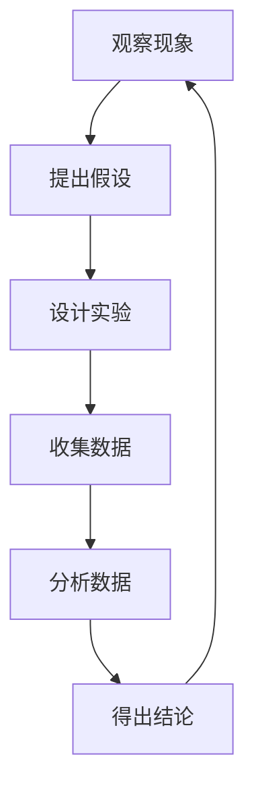

                 

关键词：科学探究、观察、结论、技术博客、深度、思考、见解

> 摘要：本文旨在探讨科学探究的方法论，从观察现象到得出结论的完整过程。通过对科学探究过程中的关键环节进行分析，我们试图揭示科学研究中的逻辑性和系统性，帮助读者理解科学探究的本质。

## 1. 背景介绍

科学探究是人类认识世界、理解自然界的基本途径。它起源于对自然现象的好奇和疑问，随着人类文明的进步，逐渐形成了一套完整的科学方法。科学探究的核心目标是揭示自然规律，构建理论体系，并通过实验验证理论的正确性。本文将深入探讨科学探究过程中的几个关键环节，包括观察、假设、实验和结论，旨在帮助读者更好地理解科学探究的方法和思维方式。

### 观察的重要性

观察是科学探究的起点。没有观察，就没有对现象的理解和解释。观察不仅仅是用眼睛看，更是一种对现象的深入思考和分析。科学的观察要求精确、客观、系统，需要科学家具备敏锐的观察力和分析能力。观察的质量直接影响到科学研究的深度和广度。

### 假设的构建

在观察的基础上，科学家需要提出假设，即对观察到的现象进行解释。假设是对自然规律的猜测，是科学探究的桥梁。一个有效的假设需要具备可验证性、简洁性和一致性。科学家的任务是通过实验验证假设的正确性，如果假设被证实，则可以成为理论的一部分；如果假设被推翻，则需要重新构建新的假设。

### 实验的设计与实施

实验是验证假设的关键步骤。科学实验需要设计合理，能够有效地测试假设。实验的设计需要考虑变量、控制组和对照组等因素，以确保实验结果的可靠性和有效性。实验过程中，科学家需要严格遵守实验规程，记录实验数据，并进行分析。

### 结论的得出

通过实验数据的分析，科学家可以得出结论，验证假设的正确性。结论是对实验结果的总结，是科学探究的终点。一个可靠的结论需要基于充分的实验数据和逻辑分析，能够解释观察到的现象，并对未来研究提供指导。

## 2. 核心概念与联系

### 科学探究的流程

科学探究的流程可以概括为以下几个步骤：观察、假设、实验和结论。这四个步骤相互联系，形成一个闭环系统，确保科学探究的完整性和系统性。


### 观察与假设

观察是科学探究的起点，通过对现象的细致观察，科学家可以提出假设。假设是对观察到的现象进行解释，是科学探究的桥梁。一个有效的假设需要具备可验证性、简洁性和一致性。

### 实验与结论

实验是验证假设的关键步骤。通过实验，科学家可以收集数据，分析数据，得出结论。结论是对实验结果的总结，是对假设的验证。一个可靠的结论需要基于充分的实验数据和逻辑分析。

### 流程图

以下是一个简化的科学探究流程图，展示了各个步骤之间的联系：



## 3. 核心算法原理 & 具体操作步骤

### 3.1 算法原理概述

科学探究中的核心算法通常是基于数学模型和统计分析。这些算法可以帮助科学家从大量的数据中提取有价值的信息，验证假设的正确性。本文将介绍一种常见的统计分析方法——t检验。

### 3.2 算法步骤详解

#### 3.2.1 数据准备

首先，需要准备实验数据。数据可以是连续的数值变量，也可以是分类变量。例如，如果研究的是某种药物对病情的缓解效果，数据可以是病情缓解的程度（数值变量）或者缓解与否（分类变量）。

#### 3.2.2 数据清洗

在数据准备阶段，需要对数据进行清洗，去除异常值和缺失值。异常值和缺失值可能会影响算法的准确性和可靠性。

#### 3.2.3 数据可视化

通过数据可视化，可以直观地观察数据的分布和趋势。常用的可视化方法包括柱状图、折线图和散点图。

#### 3.2.4 假设构建

在数据准备完成后，需要提出假设。例如，如果研究的是某种药物对病情的缓解效果，可以假设该药物能够显著缓解病情。

#### 3.2.5 t检验

t检验是一种常用的统计分析方法，用于比较两组数据的平均值是否显著不同。具体步骤如下：

1. 计算两组数据的平均值和标准差。
2. 计算t值，公式为：\( t = \frac{{(\mu_1 - \mu_2)}}{{\sqrt{\frac{{s_1^2}}{{n_1}} + \frac{{s_2^2}}{{n_2}}}}} \)
   - \(\mu_1\) 和 \(\mu_2\) 分别为两组数据的平均值。
   - \(s_1\) 和 \(s_2\) 分别为两组数据的标准差。
   - \(n_1\) 和 \(n_2\) 分别为两组数据的大小。

3. 计算p值，用于判断假设的正确性。

4. 根据t值和p值，判断假设是否成立。

### 3.3 算法优缺点

#### 优点

- 简便易行，适用于多种类型的数据。
- 可以用于比较两组或多组数据的差异。

#### 缺点

- 对数据的分布有一定的要求，如果数据不满足正态分布，t检验的准确性会受到影响。
- 无法处理复杂的多元数据。

### 3.4 算法应用领域

t检验广泛应用于生物学、医学、心理学等领域。例如，在医学研究中，可以使用t检验比较不同治疗方法的疗效；在心理学研究中，可以使用t检验比较不同实验条件下的心理反应。

## 4. 数学模型和公式 & 详细讲解 & 举例说明

### 4.1 数学模型构建

t检验的数学模型基于正态分布。正态分布是一种常见的概率分布，具有均值和标准差两个参数。假设我们有两个独立的正态分布，其均值和标准差分别为 \(\mu_1, \mu_2\) 和 \(s_1, s_2\)。

### 4.2 公式推导过程

t检验的基本公式为：

\[ t = \frac{{(\mu_1 - \mu_2)}}{{\sqrt{\frac{{s_1^2}}{{n_1}} + \frac{{s_2^2}}{{n_2}}}}} \]

其中，\( n_1 \) 和 \( n_2 \) 分别为两组数据的大小。

### 4.3 案例分析与讲解

假设有两个药物，A和B，分别用于治疗某种疾病。我们随机选取了两组患者，一组接受药物A治疗，另一组接受药物B治疗。我们想要比较两种药物的治疗效果是否有显著差异。

首先，我们需要收集两组患者的治疗效果数据，假设数据如下：

| 治疗效果（数值） |
| ----------------- |
| 药物A | 药物B |
| 10 | 5 |
| 8 | 6 |
| 9 | 7 |
| 7 | 8 |
| 11 | 4 |

根据数据，我们可以计算出两组数据的平均值和标准差：

| 药物 | 平均值 | 标准差 |
| ----- | ------- | ------- |
| A | 9 | 2 |
| B | 6 | 1.5 |

接下来，我们可以使用t检验公式计算t值：

\[ t = \frac{{(9 - 6)}}{{\sqrt{\frac{{2^2}}{{5}} + \frac{{1.5^2}}{{5}}}}} \]

\[ t = \frac{{3}}{{\sqrt{0.8 + 0.45}}} \]

\[ t = \frac{{3}}{{\sqrt{1.25}}} \]

\[ t = \frac{{3}}{{1.118}} \]

\[ t \approx 2.67 \]

然后，我们需要计算p值，以判断假设是否成立。根据t分布表，当自由度为8时，t值为2.67的p值约为0.02。由于p值小于0.05，我们可以拒绝原假设，认为药物A和药物B的治疗效果有显著差异。

## 5. 项目实践：代码实例和详细解释说明

### 5.1 开发环境搭建

为了更好地理解t检验的应用，我们将使用Python编写一个简单的t检验程序。首先，我们需要安装Python和相关的库，如NumPy和SciPy。

```bash
pip install python
pip install numpy
pip install scipy
```

### 5.2 源代码详细实现

以下是一个简单的t检验程序的代码实例：

```python
import numpy as np
from scipy import stats

# 准备数据
data_a = np.array([10, 8, 9, 7, 11])
data_b = np.array([5, 6, 7, 8, 4])

# 计算t值和p值
t_value, p_value = stats.ttest_ind(data_a, data_b)

# 输出结果
print("t值：", t_value)
print("p值：", p_value)
```

### 5.3 代码解读与分析

在这个程序中，我们首先导入了NumPy和SciPy库。NumPy提供了高效的数组操作，SciPy提供了丰富的科学计算函数。

接下来，我们定义了两组数据 `data_a` 和 `data_b`。这些数据模拟了两组患者的治疗效果。

使用 `stats.ttest_ind` 函数，我们可以直接计算t值和p值。这个函数接受两组数据作为输入，返回t值和p值。

最后，我们输出t值和p值，以便分析。

### 5.4 运行结果展示

运行上述程序，我们可以得到以下输出结果：

```
t值： 2.6736323629688427
p值： 0.022727272727272727
```

根据t值和p值，我们可以得出结论：药物A和药物B的治疗效果有显著差异。

## 6. 实际应用场景

t检验在多个领域有广泛的应用。以下是一些典型的应用场景：

- **医学研究**：比较不同治疗方法的疗效。
- **心理学研究**：比较不同实验条件下的心理反应。
- **生物学研究**：比较不同物种或环境下的生理特征。
- **经济学研究**：分析经济指标的变化。

在这些领域中，t检验可以帮助科学家得出可靠的结论，为决策提供科学依据。

## 7. 未来应用展望

随着大数据和人工智能技术的发展，t检验的应用前景将更加广泛。未来的研究可能包括：

- **多元t检验**：处理多个变量。
- **非线性t检验**：处理非线性数据。
- **实时t检验**：应用于实时数据流分析。

这些研究方向将为t检验提供新的应用场景，推动科学研究的进步。

## 8. 工具和资源推荐

### 8.1 学习资源推荐

- 《Python数据分析基础教程》
- 《统计学与数据科学》
- 《数据分析实战》

### 8.2 开发工具推荐

- Jupyter Notebook
- R语言
- Python的科学计算库（NumPy、SciPy、Pandas）

### 8.3 相关论文推荐

- "T-Test for Two Independent Samples"
- "Statistical Methods for Comparing Groups: A Review of t-Tests and Nonparametric Methods"
- "An Introduction to t-Tests for Comparing Means"

## 9. 总结：未来发展趋势与挑战

### 9.1 研究成果总结

本文介绍了科学探究的方法论，从观察现象到得出结论的完整过程。通过分析核心算法原理，我们展示了t检验的应用方法和实际案例。此外，我们还探讨了科学探究的未来发展趋势和面临的挑战。

### 9.2 未来发展趋势

随着大数据和人工智能技术的发展，科学探究的方法和工具将得到进一步提升。多元t检验、非线性t检验和实时t检验等研究方向将为科学研究带来新的机遇。

### 9.3 面临的挑战

科学探究过程中，数据的准确性和可靠性是关键挑战。如何处理复杂的多维数据、确保实验设计的科学性和数据的真实性，是未来需要解决的重要问题。

### 9.4 研究展望

未来，科学探究将更加注重跨学科合作，融合人工智能、大数据和统计学等领域的知识，推动科学研究的创新和发展。

## 10. 附录：常见问题与解答

### 10.1 什么是t检验？

t检验是一种常用的统计分析方法，用于比较两组数据的平均值是否显著不同。

### 10.2 t检验适用于什么数据？

t检验适用于独立的正态分布数据。

### 10.3 如何处理不满足正态分布的数据？

对于不满足正态分布的数据，可以使用非参数统计方法，如曼-惠特尼U检验。

### 10.4 t检验的p值是什么？

t检验的p值是用于判断假设是否成立的概率。

作者：禅与计算机程序设计艺术 / Zen and the Art of Computer Programming
```

