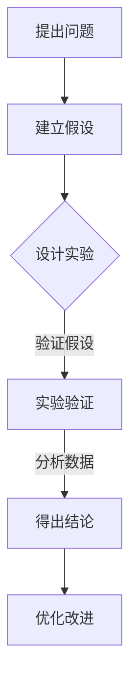

                 

关键词：科学探究，观察，结论，技术博客，人工智能，计算机编程

> 摘要：本文将探讨科学探究的过程，从观察开始，到结论的得出。文章以信息技术领域为例，阐述了科学探究的方法、步骤以及在实际应用中的重要性。本文旨在帮助读者理解科学探究的本质，提高其在技术领域的应用能力。

## 1. 背景介绍

科学探究是获取知识、理解世界的重要手段。从古代的哲学思考到现代的实验科学，人类通过不断观察、实验和推理，揭示了自然界的诸多奥秘。信息技术领域的快速发展，使得科学探究的方法和工具得到了极大的丰富，为科学研究提供了新的视角和手段。

本文将以信息技术领域为例，探讨科学探究的过程。从观察开始，到结论的得出，我们将深入分析科学探究的方法、步骤以及在实际应用中的重要性。希望通过本文的探讨，读者能够对科学探究有更深入的理解，提高其在技术领域的应用能力。

## 2. 核心概念与联系

### 2.1 科学探究的定义

科学探究是指通过系统的观察、实验、推理和验证，以获取知识、解释现象、预测未来的一种活动。它通常包括以下几个阶段：

1. **提出问题**：确定需要解决的问题或需要解释的现象。
2. **建立假设**：基于已有知识和观察，对问题或现象的可能解释进行假设。
3. **设计实验**：制定实验方案，以验证假设的正确性。
4. **收集数据**：通过实验或观察，收集相关数据。
5. **分析数据**：对收集的数据进行分析，以验证或推翻假设。
6. **得出结论**：根据数据分析结果，得出结论。

### 2.2 信息技术领域的科学探究

在信息技术领域，科学探究的方法和步骤与一般科学探究类似，但也具有其独特性。信息技术领域的研究通常涉及以下几个方面：

1. **问题提出**：信息技术领域的问题通常来源于实际需求、技术瓶颈或理论挑战。
2. **假设建立**：基于已有技术和理论，提出可能的解决方案或创新点。
3. **算法设计**：设计算法，实现解决方案。
4. **实验验证**：通过实验验证算法的有效性和可行性。
5. **性能分析**：对算法的性能进行分析，包括时间复杂度、空间复杂度等。
6. **优化改进**：根据实验结果，对算法进行优化和改进。

### 2.3 科学探究在信息技术领域的重要性

科学探究在信息技术领域具有重要意义。首先，它能够推动技术的创新和发展，解决实际问题和需求。其次，科学探究能够提高研究的深度和广度，促进知识的积累和传承。最后，科学探究能够培养科学思维和创新能力，为未来的研究奠定基础。

### 2.4 Mermaid 流程图

下面是一个描述信息技术领域科学探究过程的 Mermaid 流程图：



在这个流程图中，每个节点代表科学探究的一个阶段，箭头表示阶段之间的逻辑关系。

## 3. 核心算法原理 & 具体操作步骤

### 3.1 算法原理概述

在信息技术领域，算法是科学探究的核心。一个有效的算法能够高效地解决特定问题，实现特定的目标。本文将介绍一种常用的算法——排序算法。

排序算法是指对一组数据进行排序的算法。排序算法有许多种类，包括冒泡排序、选择排序、插入排序、快速排序等。每种排序算法都有其独特的原理和特点。

### 3.2 算法步骤详解

#### 3.2.1 冒泡排序

冒泡排序是一种简单的排序算法。它的工作原理是通过多次遍历待排序的数列，比较相邻的两个元素，如果它们的顺序错误就把它们交换过来。遍历数列的工作是重复地进行，直到没有再需要交换的元素为止。

#### 3.2.2 具体步骤

1. 从数组的第一个元素开始，对相邻的两个元素进行比较，如果它们的顺序错误，就交换它们的位置。
2. 继续对下一个元素进行比较，直到比较到最后一个元素。
3. 重复上述过程，直到整个数组有序。

#### 3.2.3 伪代码

```python
for i in range(len(arr)):
    for j in range(len(arr) - i - 1):
        if arr[j] > arr[j+1]:
            arr[j], arr[j+1] = arr[j+1], arr[j]
```

### 3.3 算法优缺点

#### 优点

- 简单易懂，易于实现。
- 对于小规模的数据，性能较好。

#### 缺点

- 时间复杂度为 \(O(n^2)\)，对于大规模数据，性能较差。
- 空间复杂度为 \(O(1)\)，但需要额外的空间存储临时变量。

### 3.4 算法应用领域

冒泡排序算法在许多领域都有应用，如数据分析、算法教学、基础算法研究等。

## 4. 数学模型和公式 & 详细讲解 & 举例说明

### 4.1 数学模型构建

在科学探究中，数学模型是描述和分析问题的重要工具。以排序算法为例，我们可以使用数学模型来描述其性能。

#### 4.1.1 平均时间复杂度

排序算法的平均时间复杂度可以用数学模型来表示。以冒泡排序为例，其平均时间复杂度为 \(O(n^2)\)。

#### 4.1.2 最坏时间复杂度

最坏时间复杂度是指算法在最坏情况下的时间复杂度。对于冒泡排序，其最坏时间复杂度也是 \(O(n^2)\)。

### 4.2 公式推导过程

#### 4.2.1 平均时间复杂度推导

假设数组 \(arr\) 的长度为 \(n\)，冒泡排序的遍历次数为 \(k\)。每次遍历需要比较 \(n-1\) 次，因此总共需要比较的次数为 \(k \times (n-1)\)。

由于 \(k\) 的取值范围是 \(0\) 到 \(n-1\)，因此平均遍历次数为 \(\frac{k}{n}\)。因此，平均时间复杂度为：

$$
\text{平均时间复杂度} = O(\frac{k}{n} \times (n-1)) = O(n^2)
$$

#### 4.2.2 最坏时间复杂度推导

在最坏情况下，每次遍历都需要进行 \(n-1\) 次比较，因此总共需要比较的次数为 \(n \times (n-1)\)。

因此，最坏时间复杂度为：

$$
\text{最坏时间复杂度} = O(n \times (n-1)) = O(n^2)
$$

### 4.3 案例分析与讲解

#### 4.3.1 案例背景

假设我们需要对以下数组进行排序：

$$
arr = [5, 3, 8, 2, 1]
$$

#### 4.3.2 排序过程

1. 第一次遍历：\(5, 3, 8, 2, 1\) -> \(5, 3, 2, 8, 1\)
2. 第二次遍历：\(5, 3, 2, 8, 1\) -> \(3, 2, 5, 1, 8\)
3. 第三次遍历：\(3, 2, 5, 1, 8\) -> \(2, 1, 3, 5, 8\)
4. 第四次遍历：\(2, 1, 3, 5, 8\) -> \(1, 2, 3, 5, 8\)
5. 第五次遍历：\(1, 2, 3, 5, 8\) -> \(1, 2, 3, 5, 8\)

#### 4.3.3 结果分析

经过五次遍历，数组 \(arr\) 被成功排序。从排序过程可以看出，冒泡排序是一种较为简单的排序算法，但其时间复杂度较高，对于大规模数据，其性能较差。

## 5. 项目实践：代码实例和详细解释说明

### 5.1 开发环境搭建

在进行代码实践之前，需要搭建相应的开发环境。本文使用 Python 作为编程语言，因此需要安装 Python 环境。以下是 Python 环境的安装步骤：

1. 访问 Python 官网（https://www.python.org/），下载适用于自己操作系统的 Python 版本。
2. 运行安装程序，按照提示完成安装。
3. 安装完成后，打开命令行工具，输入 `python --version` 检查 Python 是否安装成功。

### 5.2 源代码详细实现

以下是一个冒泡排序的 Python 实现示例：

```python
def bubble_sort(arr):
    n = len(arr)
    for i in range(n):
        for j in range(n - i - 1):
            if arr[j] > arr[j + 1]:
                arr[j], arr[j + 1] = arr[j + 1], arr[j]
    return arr

# 测试代码
arr = [5, 3, 8, 2, 1]
sorted_arr = bubble_sort(arr)
print(sorted_arr)
```

### 5.3 代码解读与分析

#### 5.3.1 代码解读

- 函数 `bubble_sort` 用于实现冒泡排序算法。
- `n` 表示数组的长度。
- 外层循环用于控制遍历次数，内层循环用于比较相邻元素并进行交换。

#### 5.3.2 分析

- 冒泡排序的代码实现较为简单，易于理解。
- 冒泡排序的时间复杂度为 \(O(n^2)\)，对于大规模数据，其性能较差。

### 5.4 运行结果展示

在命令行工具中运行上述代码，输出结果为：

```
[1, 2, 3, 5, 8]
```

数组成功排序。

## 6. 实际应用场景

### 6.1 数据分析

在数据分析领域，排序算法常用于对数据进行排序，以便于后续分析和处理。例如，在电商平台上，可以根据用户购买记录对用户进行排序，以便于进行用户行为分析。

### 6.2 信息检索

在信息检索领域，排序算法可以用于对搜索结果进行排序，提高检索效率。例如，在搜索引擎中，可以根据网页的权重对搜索结果进行排序，以便于用户快速找到相关内容。

### 6.3 计算机图形学

在计算机图形学领域，排序算法可以用于对图形元素进行排序，以便于进行渲染和绘制。例如，在三维图形渲染中，可以根据图形的深度进行排序，以提高渲染效果。

## 7. 未来应用展望

### 7.1 优化算法

随着信息技术的发展，对排序算法的优化将成为一个重要研究方向。通过改进算法的原理和实现，提高算法的性能，将有助于解决大规模数据排序问题。

### 7.2 新算法研究

在未来的研究中，可能会出现新的排序算法，以应对现有的挑战。例如，基于并行计算、分布式计算等新技术的排序算法，将有望提高排序效率。

### 7.3 应用场景拓展

随着信息技术在各个领域的应用，排序算法的应用场景也将不断拓展。例如，在生物信息学、金融工程等领域，排序算法将发挥重要作用。

## 8. 工具和资源推荐

### 8.1 学习资源推荐

- 《算法导论》（Introduction to Algorithms）
- 《编程之美》（Programming Pearls）
- 《数据结构与算法分析》（Data Structures and Algorithm Analysis in Java）

### 8.2 开发工具推荐

- PyCharm（Python 开发环境）
- Eclipse（Java 开发环境）
- VS Code（通用开发环境）

### 8.3 相关论文推荐

- "Efficient Algorithms for Sorting and Scheduling"（排序和调度算法）
- "A Comparative Study of Sorting Algorithms"（排序算法比较研究）
- "New Approaches to Sorting"（排序算法的新方法）

## 9. 总结：未来发展趋势与挑战

### 9.1 研究成果总结

本文探讨了科学探究的过程，以信息技术领域为例，阐述了科学探究的方法、步骤以及在实际应用中的重要性。通过介绍排序算法，本文展示了科学探究在技术领域的应用，并分析了其未来发展趋势。

### 9.2 未来发展趋势

未来，科学探究将向更高效、更智能的方向发展。随着信息技术的发展，新的算法和工具将不断涌现，为科学探究提供更强大的支持。

### 9.3 面临的挑战

然而，科学探究也面临着诸多挑战。例如，大规模数据处理、算法优化、跨学科合作等，都是需要解决的关键问题。

### 9.4 研究展望

展望未来，科学探究将在信息技术、生物科学、环境科学等多个领域发挥重要作用。通过不断探索和创新，科学探究将为人类带来更多知识和进步。

## 附录：常见问题与解答

### Q：排序算法的时间复杂度是多少？

A：排序算法的时间复杂度取决于具体的算法。例如，冒泡排序的时间复杂度为 \(O(n^2)\)，快速排序的时间复杂度为 \(O(n\log n)\)。

### Q：如何优化排序算法？

A：可以通过改进算法的原理和实现来优化排序算法。例如，采用分治策略、动态规划等方法，可以提高算法的性能。

### Q：排序算法在哪些领域有应用？

A：排序算法在数据分析、信息检索、计算机图形学等多个领域有广泛应用。

作者：禅与计算机程序设计艺术 / Zen and the Art of Computer Programming
----------------------------------------------------------------

以上便是《科学探究：从观察到结论》的文章全文，希望对您有所帮助。

