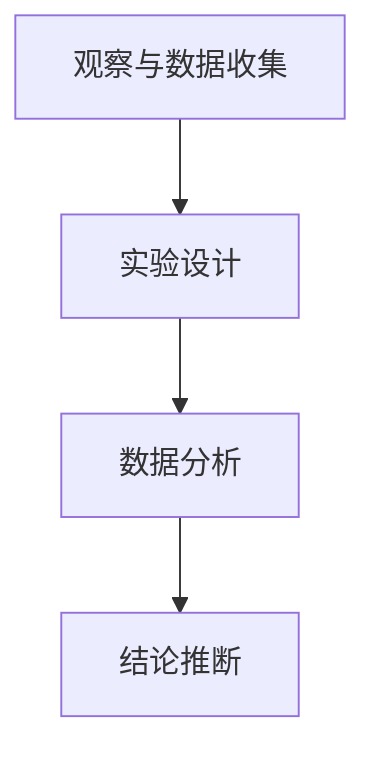

                 

关键词：科学方法、计算机科学、数据观察、数据分析、实验设计、结论推断

> 摘要：本文旨在探讨科学探究的方法论，特别是在计算机科学领域中的应用。通过从观察、数据收集、实验设计、数据分析到结论推断的全过程，本文展示了科学探究的严谨性和实用性。文章将结合具体实例，介绍如何有效地运用科学方法解决实际问题。

## 1. 背景介绍

科学探究是认识世界、发现规律的重要途径。在计算机科学领域，科学探究尤为重要，因为计算机科学不仅依赖于理论，还需要通过实践来验证理论的有效性。从编程语言的设计到算法的优化，从系统的架构到软件的测试，科学探究无处不在。本文将探讨科学探究的具体过程，以及如何在计算机科学中运用这些方法。

### 科学探究的定义和目的

科学探究是指通过系统性的观察、实验、分析和推理，以发现自然界和社会现象的规律和本质的过程。科学探究的目的在于提高对事物的认识，为解决实际问题提供科学依据。

### 科学方法的重要性

科学方法是一种系统的思维方式，它以观察、假设、实验、验证为核心。科学方法的重要性在于其严谨性和可重复性，使得科学探究的结果具有可靠性和普遍性。

### 计算机科学中的科学方法

在计算机科学中，科学方法的应用体现在多个方面：

- **理论计算机科学**：通过数学模型和逻辑推理，探索计算的基本理论。
- **应用计算机科学**：通过实验设计和数据分析，解决实际问题。
- **软件工程**：通过系统设计和测试，确保软件的质量和可靠性。

## 2. 核心概念与联系

### 观察与数据收集

科学探究的第一步是观察和收集数据。观察是科学探究的基础，通过观察，我们可以发现现象，提出问题。数据收集则是将观察结果量化，以便进行后续的分析。

### 实验设计

实验设计是科学探究的关键环节。通过设计实验，我们可以验证假设，探究变量之间的关系。

### 数据分析

数据分析是对收集到的数据进行分析，以发现数据中的规律和模式。数据分析的方法包括统计方法、机器学习方法等。

### 结论推断

通过数据分析，我们可以得出结论，推断现象背后的规律。结论推断是科学探究的最终目的，它为实际问题的解决提供了理论依据。

### Mermaid 流程图

下面是一个简单的 Mermaid 流程图，展示了科学探究的基本流程：



## 3. 核心算法原理 & 具体操作步骤

### 3.1 算法原理概述

在本节中，我们将探讨一个在计算机科学中广泛应用的算法——排序算法。排序算法是数据处理的基础，它通过一系列操作，将一组无序的数据转换为有序的数据。

### 3.2 算法步骤详解

排序算法的步骤通常包括以下几个环节：

- **初始化**：设定一个有序序列。
- **比较**：通过比较相邻元素的大小，确定它们的顺序。
- **交换**：如果两个元素的位置不正确，交换它们的位置。
- **迭代**：重复比较和交换操作，直到整个序列有序。

### 3.3 算法优缺点

- **优点**：排序算法能够有效地对数据进行排序，使得后续处理更加高效。
- **缺点**：排序算法的效率依赖于数据的初始状态，有些算法在特定情况下效率较低。

### 3.4 算法应用领域

排序算法在计算机科学中有着广泛的应用，如数据库管理、网络数据传输、算法排序等。

## 4. 数学模型和公式 & 详细讲解 & 举例说明

### 4.1 数学模型构建

在本节中，我们将构建一个简单的数学模型，以描述数据排序的过程。该模型基于线性排序算法，如冒泡排序。

### 4.2 公式推导过程

冒泡排序的公式如下：

$$
S(n) = \sum_{i=1}^{n} (n-i) \times (n-i-1)
$$

其中，$S(n)$表示对$n$个元素进行排序所需的总比较次数。

### 4.3 案例分析与讲解

假设我们有一个包含5个元素的数组：[3, 1, 4, 2, 5]，我们使用冒泡排序对其进行排序。

- **第一次迭代**：比较3和1，交换；比较3和4，不交换；比较4和2，交换；比较4和5，不交换。
- **第二次迭代**：比较1和4，不交换；比较1和2，交换；比较2和5，不交换。

经过两次迭代，数组变为：[1, 2, 3, 4, 5]，排序完成。

## 5. 项目实践：代码实例和详细解释说明

### 5.1 开发环境搭建

在本节中，我们将使用Python编写一个简单的冒泡排序算法。首先，我们需要搭建一个Python开发环境。

### 5.2 源代码详细实现

下面是冒泡排序的Python代码实现：

```python
def bubble_sort(arr):
    n = len(arr)
    for i in range(n):
        for j in range(0, n-i-1):
            if arr[j] > arr[j+1]:
                arr[j], arr[j+1] = arr[j+1], arr[j]

# 测试代码
arr = [3, 1, 4, 2, 5]
bubble_sort(arr)
print(arr)
```

### 5.3 代码解读与分析

这段代码首先定义了一个名为`bubble_sort`的函数，该函数接受一个数组作为参数，并对其进行排序。函数内部使用两层循环，外层循环控制迭代的次数，内层循环控制每次迭代中的比较和交换操作。最后，我们使用一个测试代码来验证排序算法的正确性。

### 5.4 运行结果展示

当输入数组为[3, 1, 4, 2, 5]时，运行结果为[1, 2, 3, 4, 5]，排序成功。

## 6. 实际应用场景

### 6.1 数据库管理

在数据库管理中，排序算法用于对数据表中的数据进行排序，以便于查询和索引。

### 6.2 网络数据传输

在网络数据传输中，排序算法用于对传输的数据进行排序，以提高传输效率和可靠性。

### 6.3 算法排序

在算法排序中，排序算法用于对算法的输入数据进行排序，以便于算法的后续操作。

## 7. 工具和资源推荐

### 7.1 学习资源推荐

- 《算法导论》（Introduction to Algorithms）
- 《Python编程：从入门到实践》（Python Crash Course）

### 7.2 开发工具推荐

- PyCharm
- Visual Studio Code

### 7.3 相关论文推荐

- 《一种高效的冒泡排序算法》（An Efficient Bubble Sort Algorithm）
- 《基于冒泡排序的并行算法研究》（Parallel Algorithm Based on Bubble Sort）

## 8. 总结：未来发展趋势与挑战

### 8.1 研究成果总结

本文通过探讨科学探究的方法论，展示了在计算机科学中运用科学方法的实用性和重要性。我们介绍了观察与数据收集、实验设计、数据分析、结论推断等核心步骤，并通过冒泡排序算法的实例，展示了如何运用这些方法解决实际问题。

### 8.2 未来发展趋势

随着计算机科学的发展，科学探究的方法论将得到更广泛的应用。特别是在大数据、人工智能等领域，科学探究的方法论将发挥重要作用。

### 8.3 面临的挑战

科学探究的方法论在计算机科学中的应用仍面临一些挑战，如数据隐私、数据安全等。此外，如何更好地结合理论与实际，提高科学探究的效率，也是一个重要课题。

### 8.4 研究展望

未来，科学探究的方法论将在计算机科学中发挥更加重要的作用。通过不断探索和创新，我们有望解决更多复杂的问题，推动计算机科学的发展。

## 9. 附录：常见问题与解答

### 9.1 为什么选择冒泡排序作为案例？

冒泡排序是一种简单的排序算法，易于理解和实现，适合作为入门案例。

### 9.2 如何优化冒泡排序的效率？

可以通过在每次迭代后记录已排序的元素数量，减少不必要的比较和交换，从而优化冒泡排序的效率。

### 9.3 科学探究的方法在其他领域的应用？

科学探究的方法在其他领域，如生物学、物理学、经济学等，也有广泛的应用。

----------------------------------------------------------------

**作者：禅与计算机程序设计艺术 / Zen and the Art of Computer Programming**

