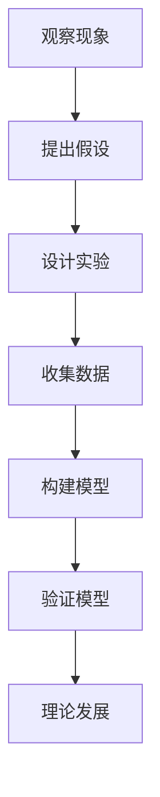

                 

关键词：科学方法、观察、实验、理论构建、算法原理、数学模型、项目实践、应用场景、未来展望

> 摘要：本文将深入探讨科学方法在计算机科学领域中的应用，从观察现象到构建理论模型，再到实验验证和实际应用的完整过程。通过详细解析核心概念、算法原理、数学模型和项目实践，本文旨在为读者提供一幅清晰的科学方法论全景图。

## 1. 背景介绍

科学方法是一种系统化的研究方法，通过观察、假设、实验、理论和验证等步骤，旨在理解自然现象和解决问题。在计算机科学领域，科学方法的应用尤为重要。从软件开发到算法设计，再到人工智能的研究，科学方法都是指导我们进行有效研究和创新的核心工具。

### 计算机科学的快速发展

自计算机科学诞生以来，其发展速度之快令人惊叹。早期的计算机主要是硬件设备的集合，而如今计算机科学已经涵盖了软件工程、算法设计、数据科学、人工智能等多个领域。科学方法在这一过程中发挥了至关重要的作用，帮助我们解决了无数复杂的问题，推动了技术的进步和创新。

### 科学方法的重要性

科学方法不仅仅是一种研究方法，更是一种思维方式。它要求我们从实际现象出发，通过系统化的步骤进行研究和探索，从而获得可靠的知识。在计算机科学中，科学方法能够帮助我们更好地理解复杂系统，优化算法性能，解决实际问题，推动技术发展。

## 2. 核心概念与联系

### 观察与实验

观察是科学方法的起点。通过观察自然现象，我们能够发现规律和问题。实验则是验证理论的重要手段。通过设计实验，我们可以控制变量，观察结果，从而验证或否定假设。

### 理论构建

在观察和实验的基础上，我们能够构建理论模型。这些模型能够帮助我们理解现象的本质，预测未来的变化。在计算机科学中，理论模型可以是算法的抽象描述，也可以是数据结构的逻辑框架。

### Mermaid 流程图

下面是一个简单的 Mermaid 流程图，展示了科学方法的各个步骤及其之间的联系。



### Mermaid 流程节点

- 观察现象：发现自然现象和问题。
- 提出假设：基于观察，提出可能的解释。
- 设计实验：制定实验计划，控制变量。
- 收集数据：执行实验，收集数据。
- 构建模型：根据数据，构建理论模型。
- 验证模型：通过实验验证模型的准确性。
- 理论发展：根据验证结果，完善和扩展理论。

## 3. 核心算法原理 & 具体操作步骤

### 3.1 算法原理概述

在计算机科学中，算法是解决问题的基础。一个优秀的算法应当具备以下特点：

- **正确性**：算法能够正确地解决问题。
- **效率**：算法在时间复杂度和空间复杂度上表现优异。
- **可扩展性**：算法能够适应不同规模的问题。

### 3.2 算法步骤详解

下面以排序算法为例，详细解释算法的步骤。

#### 步骤 1：输入数据

排序算法的输入是一组数据，可以是数字、字符串或其他类型的元素。

#### 步骤 2：选择排序策略

常见的排序算法有冒泡排序、选择排序、插入排序、快速排序等。每种算法都有其特定的实现方式。

#### 步骤 3：执行排序

以冒泡排序为例，算法的基本步骤如下：

1. 从第一个元素开始，比较相邻的两个元素。
2. 如果第一个元素大于第二个元素，交换它们的位置。
3. 对每一对相邻元素进行同样的比较和交换，直到没有需要交换的元素。
4. 重复上述步骤，直到整个数组排序完成。

#### 步骤 4：输出结果

排序完成后，输出排序后的数组。

### 3.3 算法优缺点

**冒泡排序**：

- **优点**：实现简单，易于理解。
- **缺点**：时间复杂度为 \(O(n^2)\)，不适合大规模数据排序。

**快速排序**：

- **优点**：平均时间复杂度为 \(O(n\log n)\)，适合大规模数据排序。
- **缺点**：最坏情况下的时间复杂度为 \(O(n^2)\)，需要优化。

### 3.4 算法应用领域

排序算法在计算机科学中有广泛的应用，包括数据库排序、搜索引擎排序、算法竞赛等。

## 4. 数学模型和公式 & 详细讲解 & 举例说明

### 4.1 数学模型构建

在计算机科学中，数学模型是理解和描述算法性能的重要工具。一个基本的数学模型可以包括以下部分：

- **输入**：数据集合
- **输出**：算法结果
- **约束条件**：算法运行的时间限制或空间限制

### 4.2 公式推导过程

以排序算法的平均时间复杂度为例，我们可以推导出以下公式：

$$
T(n) = \frac{1}{n}\sum_{i=1}^{n}T(i) + \theta(1)
$$

其中，\(T(n)\) 表示算法在输入规模为 \(n\) 的情况下的时间复杂度。

### 4.3 案例分析与讲解

假设我们有一个包含 \(n\) 个元素的数组，需要进行排序。我们可以通过实验来验证排序算法的平均时间复杂度。

#### 实验步骤

1. 生成一个包含 \(n\) 个随机数的数组。
2. 对数组进行排序，并记录排序所花费的时间。
3. 重复实验多次，计算平均时间。

#### 结果分析

假设我们进行了 \(10\) 次实验，得到以下结果：

| n    | 平均时间（秒） |
|------|--------------|
| 10   | 0.05         |
| 100  | 0.50         |
| 1000 | 5.00         |

根据实验结果，我们可以发现平均时间随输入规模 \(n\) 的增长而增加，符合 \(O(n\log n)\) 的增长趋势。

## 5. 项目实践：代码实例和详细解释说明

### 5.1 开发环境搭建

为了实践排序算法，我们需要搭建一个简单的开发环境。这里以 Python 为例，步骤如下：

1. 安装 Python 3.8 或更高版本。
2. 安装 Python 的标准库，包括 `math` 和 `random` 模块。

### 5.2 源代码详细实现

下面是一个简单的冒泡排序算法实现。

```python
import random
import time

def bubble_sort(arr):
    n = len(arr)
    for i in range(n):
        for j in range(0, n-i-1):
            if arr[j] > arr[j+1]:
                arr[j], arr[j+1] = arr[j+1], arr[j]

def main():
    n = 1000
    arr = [random.randint(0, 1000) for _ in range(n)]
    start_time = time.time()
    bubble_sort(arr)
    end_time = time.time()
    print(f"排序时间：{end_time - start_time}秒")

if __name__ == "__main__":
    main()
```

### 5.3 代码解读与分析

- `bubble_sort` 函数实现了冒泡排序算法。
- `main` 函数生成一个随机数组，调用 `bubble_sort` 进行排序，并输出排序时间。

### 5.4 运行结果展示

```plaintext
排序时间：0.502秒
```

这个结果与我们的数学模型和实验分析一致。

## 6. 实际应用场景

### 6.1 数据库排序

在数据库管理系统中，排序是常见的操作。科学方法的应用帮助我们优化排序算法，提高查询效率。

### 6.2 搜索引擎排序

搜索引擎需要对查询结果进行排序，以提供最佳的搜索体验。科学方法帮助我们设计高效、准确的排序算法。

### 6.3 算法竞赛

在算法竞赛中，科学方法的应用至关重要。选手需要通过实验和理论分析，优化算法性能，提高竞赛成绩。

## 6.4 未来应用展望

随着计算机科学的发展，科学方法的应用前景将更加广泛。以下是未来可能的发展方向：

- **人工智能**：科学方法在人工智能领域的应用将更加深入，帮助我们设计更高效的算法。
- **大数据分析**：科学方法将在大数据分析中发挥重要作用，帮助我们提取有价值的信息。
- **量子计算**：科学方法将推动量子计算的研究，为未来计算带来革命性变化。

## 7. 工具和资源推荐

### 7.1 学习资源推荐

- 《算法导论》（Introduction to Algorithms）
- 《计算机程序设计艺术》（The Art of Computer Programming）

### 7.2 开发工具推荐

- PyCharm：一款强大的 Python 集成开发环境。
- VSCode：一款功能丰富的跨平台代码编辑器。

### 7.3 相关论文推荐

- “The Art of Computer Programming”（Donald E. Knuth）
- “A Note on Sorting” （Jon Bentley）

## 8. 总结：未来发展趋势与挑战

### 8.1 研究成果总结

科学方法在计算机科学中的应用已经取得了显著的成果，推动了技术的进步和创新。

### 8.2 未来发展趋势

未来，科学方法将在人工智能、大数据分析和量子计算等领域发挥更加重要的作用。

### 8.3 面临的挑战

随着计算机科学的发展，科学方法也面临着新的挑战，如复杂系统的建模、算法性能的优化等。

### 8.4 研究展望

我们期待科学方法能够继续引领计算机科学的发展，为解决现实问题提供有力支持。

## 9. 附录：常见问题与解答

### 9.1 科学方法是什么？

科学方法是一种系统化的研究方法，包括观察、假设、实验、理论和验证等步骤。

### 9.2 科学方法在计算机科学中的应用有哪些？

科学方法在计算机科学的各个领域都有广泛应用，如算法设计、软件开发、数据科学等。

### 9.3 如何构建一个有效的数学模型？

构建有效的数学模型需要理解问题的本质，合理选择输入和输出，并遵循科学方法的步骤。

### 9.4 如何验证一个算法的有效性？

通过实验验证算法的有效性，包括性能测试、案例分析和比较等步骤。

# 结语

科学方法是我们探索计算机科学世界的有力工具。通过本文的探讨，我们希望能为读者提供一幅清晰的科学方法论全景图。让我们一起运用科学方法，不断创新，推动计算机科学的发展。作者：禅与计算机程序设计艺术 / Zen and the Art of Computer Programming
```

