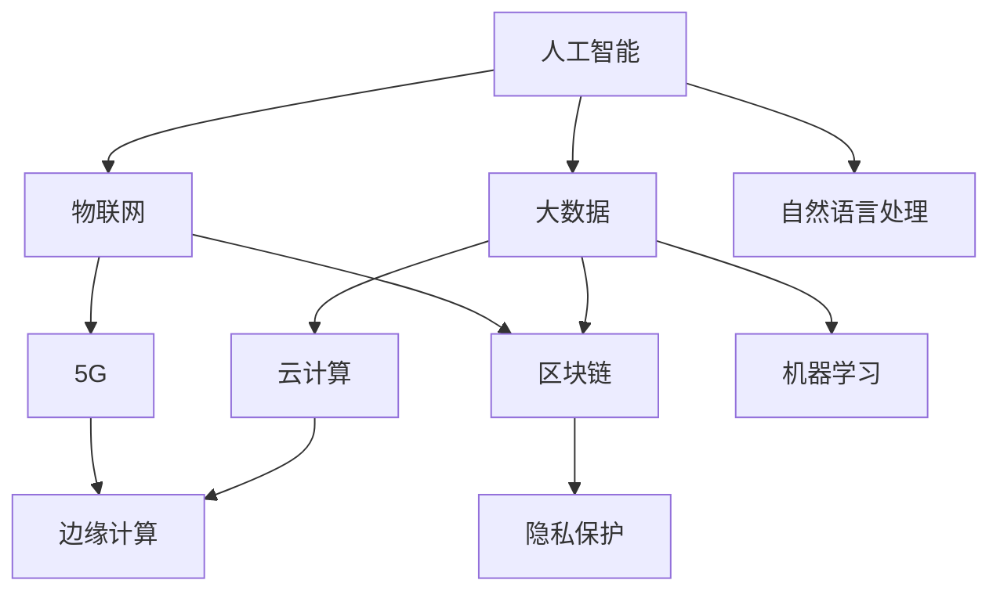

                 

科技创新，一个看似简单，却又内涵深远的词语。它不仅涵盖了最新的技术突破，还涉及了对传统行业模式的颠覆，对人类生活方式的革新。本篇文章将深入探讨科技创新对社会进步的深远影响，以及未来可能面临的挑战。

## 关键词
- 科技创新
- 社会进步
- 数字化转型
- 人工智能
- 可持续发展

## 摘要
本文将从多角度分析科技创新如何成为社会进步的阶梯。首先，我们将回顾科技发展的重要里程碑，接着深入探讨核心概念及其应用，然后通过数学模型和具体案例来阐明科技创新的实际影响。最后，我们将展望未来，提出应对挑战的策略。

### 1. 背景介绍

#### 科技创新的定义

科技创新是指通过科学发现和技术创新，推动现有产品和服务的改进，或者创造全新的产品和市场。科技创新不仅仅局限于技术本身，更涉及到经济、社会和环境等多个层面。

#### 科技对社会的影响

科技发展不仅改变了我们的生活方式，还推动了社会结构和经济模式的变革。例如，工业革命带来的机械化生产，极大地提高了生产效率，改变了劳动力的分布。而互联网和人工智能的崛起，则进一步加速了信息传播和知识共享，使得社会更加开放和互联。

### 2. 核心概念与联系

科技创新的核心概念包括但不限于人工智能、大数据、物联网、区块链等。这些技术之间并非孤立存在，而是相互联系，共同构建了一个复杂的科技创新生态系统。

#### Mermaid 流程图


### 3. 核心算法原理 & 具体操作步骤

#### 3.1 算法原理概述

核心算法包括深度学习、图论算法、优化算法等。这些算法通过数学模型和编程实现，用于解决各种实际问题。

#### 3.2 算法步骤详解

以深度学习算法为例，其基本步骤包括：

1. 数据预处理：清洗和归一化输入数据。
2. 模型构建：选择合适的神经网络架构。
3. 模型训练：使用梯度下降等优化算法进行训练。
4. 模型评估：使用验证集和测试集评估模型性能。
5. 模型部署：将训练好的模型部署到生产环境中。

#### 3.3 算法优缺点

深度学习算法具有强大的特征提取能力，但在数据需求和计算资源方面有较高要求。此外，模型的可解释性也是一个待解决的问题。

#### 3.4 算法应用领域

深度学习算法在图像识别、自然语言处理、推荐系统等领域有广泛应用。例如，在医疗领域，深度学习算法可以用于疾病诊断和药物研发。

### 4. 数学模型和公式 & 详细讲解 & 举例说明

#### 4.1 数学模型构建

以线性回归模型为例，其数学模型为：

$$
y = \beta_0 + \beta_1 \cdot x
$$

其中，$y$ 是预测值，$x$ 是自变量，$\beta_0$ 和 $\beta_1$ 是模型参数。

#### 4.2 公式推导过程

线性回归模型的推导过程包括最小二乘法、梯度下降法等。

#### 4.3 案例分析与讲解

假设我们有一个简单的房屋售价预测问题，通过收集房屋面积和售价数据，我们可以构建线性回归模型来预测新的房屋售价。

### 5. 项目实践：代码实例和详细解释说明

#### 5.1 开发环境搭建

使用 Python 编写代码，需要安装 Scikit-learn、NumPy 等库。

```python
!pip install scikit-learn numpy
```

#### 5.2 源代码详细实现

以下是一个简单的线性回归模型实现：

```python
import numpy as np
from sklearn.linear_model import LinearRegression

# 数据加载和预处理
X = np.array([[1], [2], [3], [4], [5]])
y = np.array([1, 2, 2.5, 4, 5])

# 模型训练
model = LinearRegression()
model.fit(X, y)

# 模型预测
predictions = model.predict(X)

# 模型评估
print("Model coefficients:", model.coef_)
print("Model intercept:", model.intercept_)
print("Predictions:", predictions)
```

#### 5.3 代码解读与分析

代码首先导入必要的库，然后加载并预处理数据，接着使用线性回归模型进行训练和预测，最后评估模型性能。

#### 5.4 运行结果展示

运行上述代码，我们可以得到模型参数和预测结果，进一步验证模型的有效性。

### 6. 实际应用场景

#### 6.1 产业升级

科技创新推动了传统产业的转型升级。例如，制造业的智能化改造，通过引入机器人、自动化生产线等，大大提高了生产效率和产品质量。

#### 6.2 公共服务优化

人工智能在医疗、教育、交通等公共服务领域有广泛应用。例如，智能医疗系统可以通过大数据和机器学习技术，辅助医生进行疾病诊断和治疗。

#### 6.3 可持续发展

科技创新为可持续发展提供了新的路径。例如，可再生能源技术的突破，使得清洁能源逐渐成为主流。

### 6.4 未来应用展望

随着科技的不断发展，我们有望看到更多创新应用的出现。例如，量子计算、区块链等技术的成熟，将进一步推动社会进步。

### 7. 工具和资源推荐

#### 7.1 学习资源推荐

- 《深度学习》 - Goodfellow、Bengio、Courville 著
- 《Python数据科学手册》 - Wes McKinney 著

#### 7.2 开发工具推荐

- Jupyter Notebook：用于数据分析和建模。
- TensorFlow：用于深度学习开发。

#### 7.3 相关论文推荐

- "Deep Learning" - Goodfellow、Bengio、Courville
- "The China Miracle: Development from the Inside Out" - Louis W. Pauly

### 8. 总结：未来发展趋势与挑战

#### 8.1 研究成果总结

过去几十年，科技创新取得了显著的成果，不仅推动了经济增长，还改善了人类生活质量。

#### 8.2 未来发展趋势

未来，科技创新将继续深入各行各业，推动社会全面数字化和智能化。

#### 8.3 面临的挑战

科技伦理、数据隐私、数字鸿沟等问题仍是我们需要面对的挑战。

#### 8.4 研究展望

我们应该继续投入研发，推动科技创新，为人类社会的可持续发展贡献力量。

### 9. 附录：常见问题与解答

#### 问题1：什么是科技创新？

答：科技创新是指通过科学发现和技术创新，推动现有产品和服务的改进，或者创造全新的产品和市场。

#### 问题2：科技创新对社会有哪些影响？

答：科技创新可以推动产业升级、优化公共服务、促进可持续发展，从而提高社会整体福利。

---

以上便是《科技创新：社会进步的阶梯》的全文。希望通过这篇文章，您能够更好地理解科技创新的重要性和影响。未来，让我们共同期待更多创新成果的出现，为社会的进步贡献力量。

## 作者署名
作者：禅与计算机程序设计艺术 / Zen and the Art of Computer Programming

