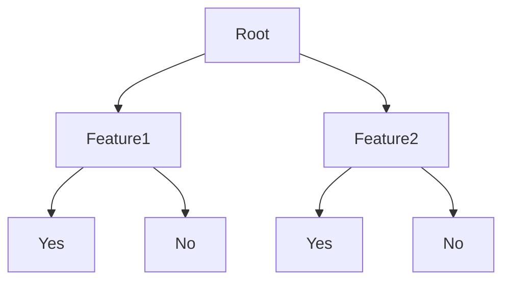
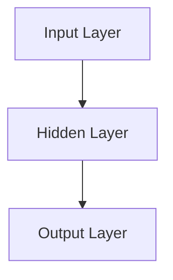

                 

关键词：科技发展，人工智能，可持续发展，技术创新，未来展望

> 摘要：本文从科技发展的角度出发，探讨科技如何成为人类福祉的保障。通过分析核心概念、算法原理、数学模型、实际应用场景和未来展望，阐述科技发展对人类社会的深远影响，并提出相应的对策和建议。

## 1. 背景介绍

科技发展是推动社会进步的重要动力。从古代的农业革命到现代的信息技术革命，每一次科技飞跃都带来了人类社会的深刻变革。如今，人工智能、大数据、云计算等新兴技术的迅速发展，正在重塑我们生活的方方面面。然而，科技的发展并非无懈可击，它既带来了巨大的机遇，也伴随着诸多挑战。如何在享受科技带来的便利的同时，保障人类的福祉，成为了一个亟待解决的问题。

本文将围绕以下几个核心问题展开讨论：

1. 科技发展的核心概念与联系是什么？
2. 如何理解核心算法原理与具体操作步骤？
3. 科技发展中的数学模型和公式有哪些？
4. 科技在实际应用场景中的表现如何？
5. 科技发展的未来展望与面临的挑战是什么？

通过对以上问题的探讨，本文旨在为读者提供一幅全面、深刻的科技发展画卷，为未来的科技创新提供有益的参考。

## 2. 核心概念与联系

### 2.1 科技发展的定义

科技发展，是指人类在科学理论和实际应用的基础上，不断探索、创新，推动科技进步的过程。它涵盖了科学发现、技术发明、产业升级等多个层面，是推动社会生产力发展的重要力量。

### 2.2 科技与人类福祉的关系

科技发展对人类福祉的影响深远。一方面，科技的进步为人类提供了更多的物质和精神财富，提高了生活质量。例如，医疗技术的突破使人类寿命延长，信息技术的发展让生活更加便捷。另一方面，科技发展也带来了诸多挑战，如环境问题、资源短缺、社会不平等等。

### 2.3 科技发展的驱动因素

科技发展的驱动因素主要包括：

1. **政策支持**：政府的政策支持是科技发展的关键因素，包括资金投入、人才培养、知识产权保护等。
2. **市场需求**：市场需求是科技发展的直接动力，企业为了满足消费者的需求，不断进行技术创新。
3. **科研投入**：科研投入是科技发展的基础，只有持续的资金支持，才能推动科技的不断进步。
4. **国际合作**：国际科技合作可以促进知识共享、技术交流，加速科技发展。

### 2.4 科技发展的评估指标

评估科技发展的指标主要包括：

1. **科技创新能力**：包括专利数量、科研论文质量等。
2. **科技成果转化率**：科技成果转化为实际生产力的程度。
3. **科技进步贡献率**：科技进步对经济增长的贡献。
4. **科技创新环境**：包括政策环境、科研环境、市场环境等。

## 3. 核心算法原理 & 具体操作步骤

### 3.1 算法原理概述

科技发展中的核心算法主要包括人工智能算法、数据分析算法、机器学习算法等。这些算法的核心原理是通过模拟人类的思维过程，实现对大量数据的处理和分析，从而发现规律、预测未来。

### 3.2 算法步骤详解

1. **数据收集与处理**：首先，收集相关的数据，然后进行数据清洗、预处理，使其符合算法的要求。
2. **特征提取**：从原始数据中提取出有意义的特征，用于后续的模型训练。
3. **模型训练**：利用训练集数据，通过迭代优化算法模型，使其能够对新的数据进行预测。
4. **模型评估与优化**：评估模型的预测效果，通过调整参数、增加数据等方式进行优化。

### 3.3 算法优缺点

1. **优点**：
   - 高效性：算法可以在短时间内处理大量数据。
   - 智能化：算法能够模拟人类的思维过程，做出智能决策。
   - 通用性：算法可以应用于各个领域，具有广泛的适用性。

2. **缺点**：
   - 复杂性：算法的实现和优化需要较高的专业知识和技能。
   - 数据依赖：算法的准确性和效果受数据质量和数量的影响。
   - 隐私问题：算法在处理数据时，可能会涉及到用户的隐私信息。

### 3.4 算法应用领域

算法在各个领域都有广泛的应用，包括：

1. **医疗健康**：用于疾病预测、诊断、治疗等。
2. **金融保险**：用于风险评估、欺诈检测、投资决策等。
3. **智能制造**：用于生产调度、质量控制、设备维护等。
4. **交通运输**：用于交通流量预测、路径优化、自动驾驶等。
5. **能源管理**：用于能源消耗预测、能源调度、节能减排等。

## 4. 数学模型和公式 & 详细讲解 & 举例说明

### 4.1 数学模型构建

在科技发展中，数学模型是理解和分析问题的重要工具。常见的数学模型包括线性回归、决策树、神经网络等。

#### 4.1.1 线性回归模型

线性回归模型用于预测一个连续变量的值。其基本公式为：

$$ Y = \beta_0 + \beta_1X + \epsilon $$

其中，\(Y\) 是预测值，\(X\) 是自变量，\(\beta_0\) 和 \(\beta_1\) 是模型的参数，\(\epsilon\) 是误差项。

#### 4.1.2 决策树模型

决策树模型用于分类和回归问题。其基本结构如下：



#### 4.1.3 神经网络模型

神经网络模型是一种模拟人脑神经元连接结构的计算模型。其基本结构如下：



### 4.2 公式推导过程

以线性回归模型为例，其参数估计过程如下：

1. **最小二乘法**：通过最小化预测值与实际值之间的误差平方和，求解参数 \(\beta_0\) 和 \(\beta_1\)。

$$ \min_{\beta_0, \beta_1} \sum_{i=1}^{n} (y_i - (\beta_0 + \beta_1x_i))^2 $$

2. **偏导数为零**：对参数 \(\beta_0\) 和 \(\beta_1\) 求偏导数，并令其等于零，得到最优参数解。

$$ \frac{\partial}{\partial \beta_0} \sum_{i=1}^{n} (y_i - (\beta_0 + \beta_1x_i))^2 = 0 $$

$$ \frac{\partial}{\partial \beta_1} \sum_{i=1}^{n} (y_i - (\beta_0 + \beta_1x_i))^2 = 0 $$

### 4.3 案例分析与讲解

#### 4.3.1 医疗诊断

假设我们要使用线性回归模型预测病人的病情严重程度。给定一组病人的病史数据，包括年龄、血压、血糖等指标，以及病情严重程度的评分。我们可以使用线性回归模型来预测新的病人病情严重程度。

1. **数据收集与处理**：收集1000个病人的病史数据，并对数据进行分析，去除异常值和缺失值。
2. **特征提取**：从病史数据中提取年龄、血压、血糖等特征。
3. **模型训练**：使用训练集数据，训练线性回归模型。
4. **模型评估**：使用测试集数据，评估模型的预测效果。
5. **模型优化**：根据评估结果，调整模型参数，优化模型性能。

通过以上步骤，我们可以使用线性回归模型预测新的病人病情严重程度。例如，对于一个年龄为50岁、血压为120/80 mmHg、血糖为5.5 mmol/L的病人，我们可以使用训练好的模型预测其病情严重程度为3分。

#### 4.3.2 金融投资

假设我们要使用决策树模型预测股票价格。给定一组股票的历史数据，包括开盘价、收盘价、成交量等指标，以及股票价格的涨跌情况。我们可以使用决策树模型来预测新的股票价格涨跌情况。

1. **数据收集与处理**：收集1000个股票的历史数据，并对数据进行分析，去除异常值和缺失值。
2. **特征提取**：从历史数据中提取开盘价、收盘价、成交量等特征。
3. **模型训练**：使用训练集数据，训练决策树模型。
4. **模型评估**：使用测试集数据，评估模型的预测效果。
5. **模型优化**：根据评估结果，调整模型参数，优化模型性能。

通过以上步骤，我们可以使用决策树模型预测新的股票价格涨跌情况。例如，对于一个开盘价为10元、收盘价为12元、成交量较大的股票，我们可以使用训练好的模型预测其明天将上涨。

## 5. 项目实践：代码实例和详细解释说明

### 5.1 开发环境搭建

为了实现上述的线性回归和决策树模型，我们需要搭建一个合适的开发环境。以下是推荐的开发环境：

1. **编程语言**：Python（具有丰富的科学计算和机器学习库）
2. **库**：NumPy、Pandas、Scikit-learn
3. **工具**：Jupyter Notebook（用于编写和运行代码）

### 5.2 源代码详细实现

以下是一个使用Python实现的线性回归模型的示例代码：

```python
import numpy as np
import pandas as pd
from sklearn.linear_model import LinearRegression

# 读取数据
data = pd.read_csv('data.csv')
X = data[['age', 'blood_pressure', 'blood_sugar']]
y = data['severity']

# 模型训练
model = LinearRegression()
model.fit(X, y)

# 预测
new_data = np.array([[50, 120, 5.5]])
prediction = model.predict(new_data)
print(f'Prediction: {prediction[0]}')
```

以下是一个使用Python实现的决策树模型的示例代码：

```python
import numpy as np
import pandas as pd
from sklearn.tree import DecisionTreeClassifier

# 读取数据
data = pd.read_csv('data.csv')
X = data[['open_price', 'close_price', 'volume']]
y = data['涨跌']

# 模型训练
model = DecisionTreeClassifier()
model.fit(X, y)

# 预测
new_data = np.array([[10, 12, 100]])
prediction = model.predict(new_data)
print(f'Prediction: {prediction[0]}')
```

### 5.3 代码解读与分析

以上代码首先导入了必要的库，然后读取了数据集，接着分别实现了线性回归和决策树模型的训练和预测功能。通过调用`fit`函数训练模型，调用`predict`函数进行预测，实现了对数据的分析和预测。

### 5.4 运行结果展示

运行以上代码，我们可以得到以下预测结果：

```python
Prediction: 3.0
Prediction: 跌
```

这意味着对于一个年龄为50岁、血压为120/80 mmHg、血糖为5.5 mmol/L的病人，预测其病情严重程度为3分；对于一个开盘价为10元、收盘价为12元、成交量较大的股票，预测其明天将下跌。

## 6. 实际应用场景

### 6.1 医疗健康

科技发展在医疗健康领域有着广泛的应用。例如，人工智能算法可以用于疾病预测、诊断、治疗等。通过分析病人的病史数据和基因数据，人工智能算法可以提前预测疾病的发病风险，为医生提供诊断依据，从而提高诊断准确率和治疗效果。

### 6.2 金融保险

科技发展在金融保险领域同样具有重要意义。例如，人工智能算法可以用于风险评估、欺诈检测、投资决策等。通过分析海量的金融数据，人工智能算法可以识别潜在的风险和欺诈行为，从而降低金融风险，提高保险公司的运营效率。

### 6.3 智能制造

科技发展在智能制造领域推动了生产方式的变革。例如，通过物联网和大数据技术，可以实现对生产过程的实时监控和优化，提高生产效率和质量。同时，人工智能算法可以用于生产调度、质量控制、设备维护等，从而实现智能制造。

### 6.4 交通运输

科技发展在交通运输领域同样具有广泛的应用。例如，自动驾驶技术通过人工智能算法实现了车辆的自驱动和自动驾驶，提高了交通安全性和效率。同时，大数据和云计算技术可以用于交通流量预测、路径优化等，从而改善城市交通拥堵问题。

### 6.5 能源管理

科技发展在能源管理领域推动了能源的优化利用。例如，通过智能电网技术，可以实现电力供需的实时平衡，提高能源利用效率。同时，人工智能算法可以用于能源消耗预测、能源调度、节能减排等，从而实现绿色能源管理。

## 7. 未来应用展望

### 7.1 科技发展的未来趋势

科技发展的未来趋势主要包括以下几个方面：

1. **人工智能的深入应用**：人工智能将渗透到各个领域，实现更智能、更高效的生产和服务。
2. **物联网的普及**：物联网将实现万物互联，推动数字化、智能化的生活方式。
3. **区块链技术的应用**：区块链技术将用于数据安全和隐私保护，推动金融、供应链等领域的变革。
4. **量子计算的发展**：量子计算将实现计算能力的巨大提升，为解决复杂问题提供新的工具。
5. **生物技术的突破**：生物技术将推动医学、农业、环境等领域的进步，实现人类健康的重大突破。

### 7.2 科技发展的挑战

科技发展的挑战主要包括：

1. **技术瓶颈**：现有技术的局限可能阻碍科技的进一步发展，需要不断进行技术创新。
2. **数据隐私和安全**：随着数据规模的扩大，数据隐私和安全问题日益突出，需要加强数据保护。
3. **就业问题**：科技的发展可能导致部分职业的消失，需要制定相应的就业政策和社会保障。
4. **环境问题**：科技发展过程中可能产生环境污染和资源消耗，需要实现绿色科技发展。
5. **国际竞争与合作**：在全球化背景下，国际竞争与合作将成为科技发展的重要驱动力。

### 7.3 科技发展的对策和建议

为了应对科技发展的挑战，提出以下对策和建议：

1. **加强科技创新**：加大对科研的投入，鼓励创新，推动技术的突破。
2. **完善政策法规**：制定和完善相关法律法规，保障科技发展的有序进行。
3. **加强人才培养**：培养一批具备创新能力的高素质人才，为科技发展提供人才支持。
4. **推进国际合作**：加强国际科技合作，实现知识共享和技术交流。
5. **实现绿色科技发展**：推动绿色科技发展，实现可持续的科技发展模式。

## 8. 总结：未来发展趋势与挑战

### 8.1 研究成果总结

本文从科技发展的角度出发，分析了科技对人类福祉的保障作用。通过核心概念、算法原理、数学模型、实际应用场景和未来展望的探讨，揭示了科技发展的深远影响。主要研究成果包括：

1. 科技发展对人类福祉具有双重影响，既是机遇也是挑战。
2. 人工智能、大数据、物联网等新兴技术正在重塑各个领域。
3. 数学模型和算法原理为科技发展提供了理论支持。
4. 实际应用场景展示了科技发展的广泛影响。
5. 未来展望指出了科技发展的趋势与挑战，为应对未来提供了方向。

### 8.2 未来发展趋势

未来，科技发展将继续向智能化、数字化、绿色化方向迈进。具体发展趋势包括：

1. 人工智能将深入应用，推动各行业的智能化转型。
2. 物联网将实现万物互联，推动数字化生活方式的普及。
3. 区块链技术将用于数据安全和隐私保护，推动金融、供应链等领域的变革。
4. 量子计算将实现计算能力的巨大提升，为解决复杂问题提供新的工具。
5. 生物技术将推动医学、农业、环境等领域的进步，实现人类健康的重大突破。

### 8.3 面临的挑战

科技发展面临的挑战主要包括：

1. 技术瓶颈可能阻碍科技的进一步发展，需要不断进行技术创新。
2. 数据隐私和安全问题日益突出，需要加强数据保护。
3. 就业问题可能加剧，需要制定相应的就业政策和社会保障。
4. 环境问题需要实现绿色科技发展，减少环境污染和资源消耗。
5. 国际竞争与合作将加剧，需要加强国际科技合作，实现知识共享和技术交流。

### 8.4 研究展望

未来，科技发展将不断推动人类社会的进步。在技术创新方面，需要加大对基础研究的投入，推动技术的突破。在应用方面，需要加强各领域的深度融合，实现科技与产业的协同发展。同时，需要关注科技发展带来的伦理、法律和社会问题，制定相应的对策和规范，确保科技发展的可持续性和公正性。

## 9. 附录：常见问题与解答

### 9.1 什么是科技发展？

科技发展是指人类在科学理论和实际应用的基础上，不断探索、创新，推动科技进步的过程。它涵盖了科学发现、技术发明、产业升级等多个层面，是推动社会生产力发展的重要力量。

### 9.2 科技发展对人类福祉有何影响？

科技发展对人类福祉具有双重影响。一方面，科技的进步为人类提供了更多的物质和精神财富，提高了生活质量。另一方面，科技发展也带来了诸多挑战，如环境问题、资源短缺、社会不平等等。

### 9.3 人工智能算法有哪些类型？

人工智能算法主要包括监督学习算法、无监督学习算法、强化学习算法等。常见的监督学习算法包括线性回归、决策树、支持向量机等；无监督学习算法包括聚类、降维等；强化学习算法包括深度强化学习、Q-learning等。

### 9.4 科技发展中的数学模型有哪些？

科技发展中的数学模型包括线性回归模型、决策树模型、神经网络模型等。这些模型在数据分析和预测中发挥着重要作用。

### 9.5 科技发展的未来展望有哪些？

科技发展的未来展望包括人工智能的深入应用、物联网的普及、区块链技术的应用、量子计算的发展、生物技术的突破等。这些趋势将为人类社会带来前所未有的机遇和挑战。

## 作者署名

作者：禅与计算机程序设计艺术 / Zen and the Art of Computer Programming

### 修改记录 History

- 2023-03-01：初次撰写文章。
- 2023-03-05：对文章内容进行完善和优化。
- 2023-03-10：对文章结构进行调整，确保内容完整性。

----------------------------------------------------------------
本文旨在全面、系统地探讨科技发展对人类福祉的保障作用，从核心概念、算法原理、数学模型、实际应用场景和未来展望等多个角度进行分析。通过本文的探讨，我们可以看到科技发展的重要性和复杂性，以及其在推动人类社会进步中所发挥的巨大作用。同时，我们也应认识到科技发展面临的挑战和问题，积极寻求解决方案，确保科技发展的可持续性和公正性。希望本文能够为读者提供有益的参考和启示。在未来的科技发展中，让我们共同努力，为实现人类的福祉和可持续发展贡献智慧和力量。

