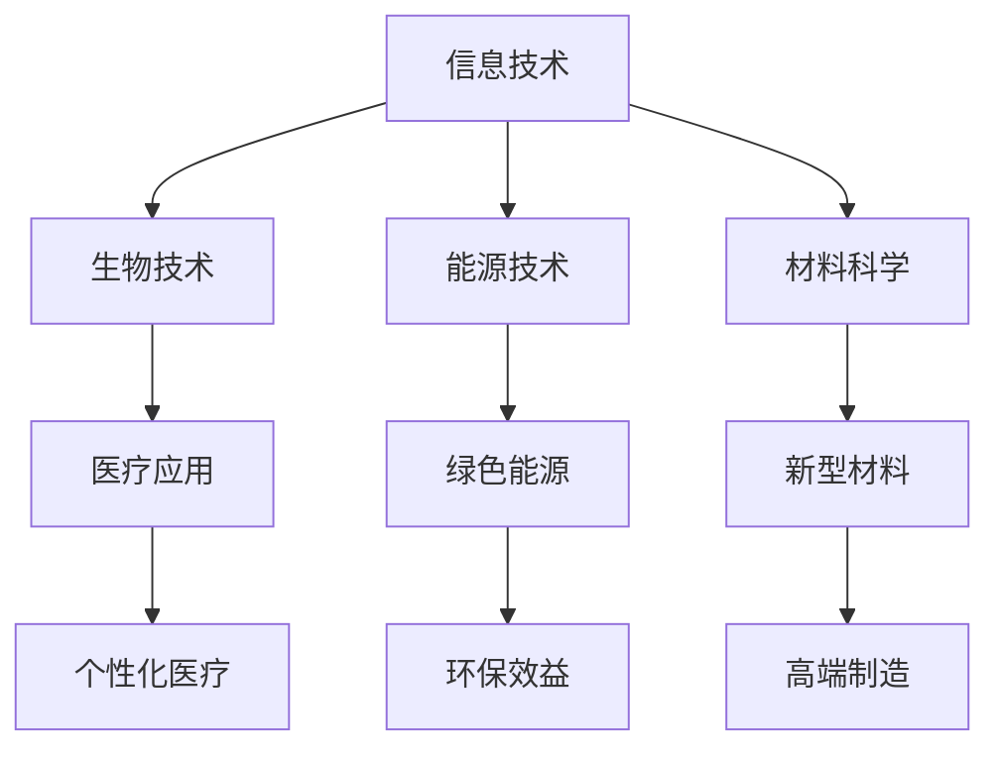

                 

科技发展一直是推动社会进步的重要力量。从蒸汽机时代到信息技术革命，每一次科技飞跃都深刻改变了人类的生活方式。本文将探讨科技发展对人类福祉的深远影响，分析其在不同领域的应用，并提出未来可能面临的挑战与机遇。

## 文章关键词
- 科技发展
- 人类福祉
- 应用领域
- 未来挑战

## 文章摘要
本文首先概述了科技发展对人类福祉的重要性，随后详细分析了科技在不同领域的应用，如医疗、教育、交通和能源。接着，讨论了科技发展可能带来的社会挑战，并提出了未来发展的方向和前景。文章最后总结了科技发展对人类福祉的保障作用，并呼吁各界共同努力，促进科技与社会和谐发展。

## 1. 背景介绍
科技发展起源于人类对未知世界的探索和需求。自古以来，人类不断通过实践和思考，积累经验，发明创造，推动了科技的发展。从农业革命到工业革命，再到信息革命，每一次革命都标志着科技的巨大进步。如今，我们正处于一个高度信息化、全球化的时代，科技发展已经成为推动社会进步的主要动力。

### 1.1 科技发展的历史背景
- **农业革命**：约1万年前，人类开始从狩猎采集转向农业生活，大大提高了粮食产量，促进了人口增长和社会结构的变化。
- **工业革命**：18世纪末至19世纪初，蒸汽机、纺织机等机械化设备的发明，使生产效率大幅提升，推动了工业化进程。
- **信息技术革命**：20世纪末，互联网和计算机技术的快速发展，改变了信息传播和交流的方式，为全球化和数字经济奠定了基础。

### 1.2 科技发展的重要性
科技发展不仅提升了生产效率，还极大地改善了人们的生活质量。医疗技术的进步使疾病得到更有效的治疗，教育技术的普及使得知识传播更加便捷，交通和通信的快速发展缩短了人们之间的距离，能源技术的革新减少了环境污染。

## 2. 核心概念与联系
科技发展涉及多个核心概念和领域，这些概念相互联系，共同推动了科技的进步。

### 2.1 核心概念
- **信息技术**：包括计算机科学、网络技术、数据科学等。
- **生物技术**：涉及基因工程、细胞工程等。
- **能源技术**：包括可再生能源、核能等。
- **材料科学**：研究新型材料的设计、合成和应用。

### 2.2 Mermaid 流程图

### 2.3 科技与社会的相互作用
科技发展不仅推动了社会的进步，也受到社会环境的制约。社会的需求、政策支持、资金投入等因素都会影响科技的发展。同时，科技的进步又对社会产生深远影响，形成良性循环。

## 3. 核心算法原理 & 具体操作步骤
科技发展离不开核心算法的支撑，以下将介绍几个关键算法的原理和操作步骤。

### 3.1 算法原理概述
- **深度学习**：通过模拟人脑神经网络，实现复杂模式识别和学习。
- **量子计算**：利用量子叠加和纠缠现象，实现超高速计算。
- **分布式计算**：将计算任务分布到多个节点上，提高计算效率和容错能力。

### 3.2 算法步骤详解
- **深度学习**：
  1. 数据预处理：归一化、去噪等。
  2. 构建神经网络模型：选择合适的网络结构。
  3. 训练模型：通过反向传播算法优化模型参数。
  4. 测试模型：评估模型性能。
  
- **量子计算**：
  1. 构建量子电路：根据计算任务设计量子算法。
  2. 实现量子纠缠：利用量子比特的叠加和纠缠状态。
  3. 运行量子算法：在量子计算机上执行计算任务。
  4. 量子测量：获取计算结果。

- **分布式计算**：
  1. 任务划分：将大任务分解为小任务。
  2. 数据分配：将数据分发给不同的计算节点。
  3. 并行计算：多个节点同时执行任务。
  4. 结果合并：汇总各节点的计算结果。

### 3.3 算法优缺点
- **深度学习**：优点在于强大的模式识别和学习能力，但缺点是训练过程复杂，对数据和计算资源要求较高。
- **量子计算**：优点是计算速度极快，但缺点是当前量子计算机仍处于实验阶段，实际应用受限。
- **分布式计算**：优点是提高了计算效率和容错能力，但缺点是系统复杂度高，需要协调多个节点之间的通信。

### 3.4 算法应用领域
- **深度学习**：广泛应用于图像识别、自然语言处理、推荐系统等领域。
- **量子计算**：有望在密码学、优化问题、量子模拟等领域取得突破。
- **分布式计算**：广泛应用于大数据处理、云计算、物联网等领域。

## 4. 数学模型和公式 & 详细讲解 & 举例说明
科技发展中的许多算法都基于数学模型和公式，以下将介绍几个关键模型和公式的构建、推导过程及实际应用。

### 4.1 数学模型构建
- **线性回归模型**：
  $$ y = wx + b $$
  其中，$y$ 是因变量，$x$ 是自变量，$w$ 是权重，$b$ 是偏置。

- **SVM（支持向量机）模型**：
  $$ \min_{w,b} \frac{1}{2} ||w||^2 + C \sum_{i=1}^{n} \max(0, 1 - y_i (wx + b)) $$
  其中，$C$ 是惩罚参数，$y_i$ 是样本标签。

### 4.2 公式推导过程
- **线性回归模型**的推导：
  1. 假设存在一个线性关系 $y = wx + b$。
  2. 定义均方误差损失函数 $L = \frac{1}{2} \sum_{i=1}^{n} (y_i - wx_i - b)^2$。
  3. 对 $w$ 和 $b$ 分别求偏导，并令偏导数为零，解得最佳权重和偏置。

- **SVM 模型的推导**：
  1. 目标是找到最大化分类间隔的超平面。
  2. 引入松弛变量 $\xi_i$，构建拉格朗日函数 $L(w,b,\xi) = \frac{1}{2} ||w||^2 - \sum_{i=1}^{n} y_i (wx_i + b) + \sum_{i=1}^{n} \xi_i$。
  3. 对 $w$、$b$ 和 $\xi$ 分别求偏导，并令偏导数为零，解得最优解。

### 4.3 案例分析与讲解
- **线性回归模型**应用案例：
  - 数据集：包含 $n$ 个样本，每个样本由特征向量 $x_i$ 和标签 $y_i$ 组成。
  - 模型训练：通过最小二乘法求解最佳权重和偏置。
  - 模型评估：计算预测值与真实值之间的均方误差。

- **SVM 模型**应用案例：
  - 数据集：包含 $n$ 个样本，每个样本由特征向量 $x_i$ 和标签 $y_i$ 组成。
  - 模型训练：通过求解拉格朗日方程，找到最佳权重和偏置。
  - 模型评估：计算分类准确率。

## 5. 项目实践：代码实例和详细解释说明
以下将通过一个具体的项目实例，展示如何利用深度学习算法实现图像分类。

### 5.1 开发环境搭建
- 硬件环境：NVIDIA 显卡（支持CUDA）
- 软件环境：Python 3.x、TensorFlow 2.x

### 5.2 源代码详细实现
```python
import tensorflow as tf

# 加载数据集
(x_train, y_train), (x_test, y_test) = tf.keras.datasets.cifar10.load_data()

# 数据预处理
x_train = x_train.astype('float32') / 255.0
x_test = x_test.astype('float32') / 255.0

# 构建深度神经网络模型
model = tf.keras.Sequential([
    tf.keras.layers.Conv2D(32, (3, 3), activation='relu', input_shape=(32, 32, 3)),
    tf.keras.layers.MaxPooling2D((2, 2)),
    tf.keras.layers.Conv2D(64, (3, 3), activation='relu'),
    tf.keras.layers.MaxPooling2D((2, 2)),
    tf.keras.layers.Conv2D(64, (3, 3), activation='relu'),
    tf.keras.layers.Flatten(),
    tf.keras.layers.Dense(64, activation='relu'),
    tf.keras.layers.Dense(10, activation='softmax')
])

# 编译模型
model.compile(optimizer='adam',
              loss='sparse_categorical_crossentropy',
              metrics=['accuracy'])

# 训练模型
model.fit(x_train, y_train, epochs=10, validation_data=(x_test, y_test))

# 评估模型
test_loss, test_acc = model.evaluate(x_test, y_test, verbose=2)
print('\nTest accuracy:', test_acc)
```

### 5.3 代码解读与分析
- 加载数据集：使用 TensorFlow 提供的内置数据集。
- 数据预处理：将图像数据归一化，以便模型更好地学习。
- 构建模型：使用卷积神经网络实现图像分类。
- 编译模型：指定优化器和损失函数。
- 训练模型：使用训练数据训练模型，并验证模型性能。
- 评估模型：使用测试数据评估模型性能。

## 6. 实际应用场景
科技发展已经深刻影响了各个领域，以下将探讨科技在医疗、教育、交通和能源等领域的实际应用。

### 6.1 医疗领域
- **远程医疗**：利用互联网和视频通信技术，实现医生与患者之间的远程诊断和治疗。
- **精准医疗**：通过基因测序和大数据分析，为患者提供个性化的治疗方案。

### 6.2 教育领域
- **在线教育**：利用互联网和在线平台，实现教育资源的大规模共享和普及。
- **智能教育**：通过人工智能技术，实现个性化教学和智能辅导。

### 6.3 交通领域
- **智能交通**：利用物联网和大数据分析，实现交通流量优化和智能导航。
- **无人驾驶**：利用计算机视觉和深度学习技术，实现无人驾驶汽车的自动驾驶。

### 6.4 能源领域
- **可再生能源**：利用太阳能、风能等可再生能源技术，实现能源的可持续利用。
- **智能电网**：利用物联网和大数据技术，实现电网的智能化和高效管理。

## 7. 工具和资源推荐
为了更好地进行科技研究和开发，以下推荐一些常用的工具和资源。

### 7.1 学习资源推荐
- **在线课程**：Coursera、edX、Udacity 提供大量免费和付费的在线课程。
- **书籍**：《深度学习》、《Python编程：从入门到实践》等。

### 7.2 开发工具推荐
- **编程环境**：Jupyter Notebook、Visual Studio Code。
- **框架和库**：TensorFlow、PyTorch、Scikit-learn。

### 7.3 相关论文推荐
- **顶级会议**：NeurIPS、ICML、ACL。
- **顶级期刊**：《自然》、《科学》、《计算机研究与发展》。

## 8. 总结：未来发展趋势与挑战
### 8.1 研究成果总结
科技发展已经取得了显著的成果，如人工智能、量子计算、大数据分析等领域的突破，极大地提升了社会生产力和生活质量。

### 8.2 未来发展趋势
未来，科技发展将继续向更智能、更高效、更可持续的方向发展。人工智能、物联网、区块链等新兴技术将发挥更加重要的作用。

### 8.3 面临的挑战
- **数据安全和隐私**：随着数据规模的不断扩大，数据安全和隐私保护成为一个严峻的挑战。
- **伦理和道德**：人工智能等技术的快速发展引发了一系列伦理和道德问题，需要全社会共同探讨和解决。

### 8.4 研究展望
未来，科技发展需要更加关注人本主义，注重科技与社会、自然和谐发展，为人类的福祉做出更大贡献。

## 9. 附录：常见问题与解答
### 9.1 什么是人工智能？
人工智能（AI）是指通过计算机模拟人类智能行为，实现智能决策、问题解决、知识理解等能力的科学技术。

### 9.2 量子计算与经典计算有什么区别？
量子计算利用量子比特的叠加和纠缠现象，实现超高速计算。而经典计算则基于二进制位进行计算，速度相对较慢。

### 9.3 科技发展对环境有哪些影响？
科技发展带来了许多环境问题，如能源消耗、碳排放、电子废弃物等。未来需要通过技术创新和环保政策，实现可持续发展。

### 9.4 如何确保人工智能的公平性和透明性？
为确保人工智能的公平性和透明性，需要建立完善的法律和道德规范，加强监管和审计，提高算法的可解释性。

---

作者：禅与计算机程序设计艺术 / Zen and the Art of Computer Programming

