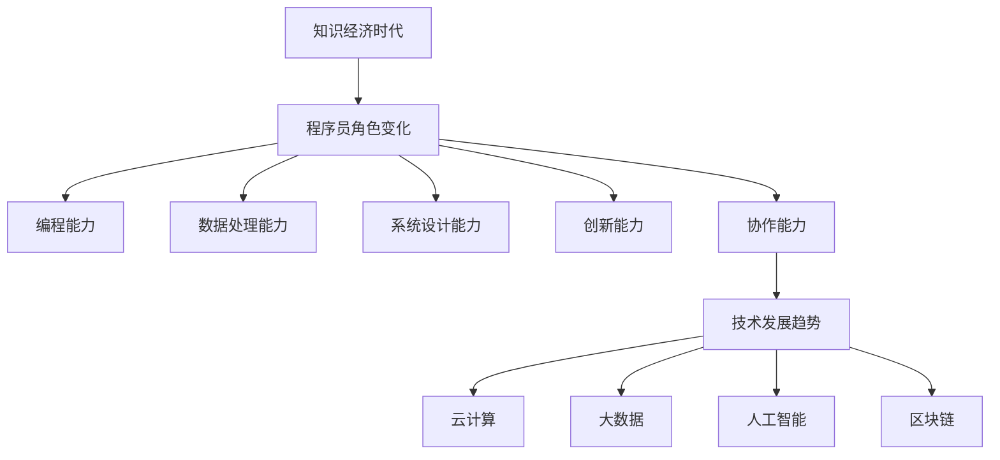

                 

关键词：程序员，知识经济，发展，技能需求，技术趋势，职业规划

> 摘要：本文深入探讨了知识经济时代程序员的发展趋势，分析了这一时代的特征、程序员的核心技能需求、技术发展方向以及如何进行职业规划。通过详细的案例分析、数学模型解释和实际应用场景描述，为程序员提供了有价值的参考和指导。

## 1. 背景介绍

在知识经济时代，信息和技术成为驱动经济发展的核心力量。随着互联网、大数据、人工智能等新兴技术的快速发展，程序员的角色和职责也在不断演变。程序员不再仅仅是编写代码、解决技术问题的专家，而是成为创新驱动的核心力量，承担着推动社会进步的重要使命。

知识经济的特征主要体现在以下几个方面：

- **信息爆炸**：大量的信息以数字化的形式不断产生，程序员需要处理和分析这些信息。
- **知识共享**：互联网使得知识和信息可以在全球范围内共享，程序员需要具备快速学习和适应的能力。
- **创新驱动**：知识经济依赖创新，程序员需要不断地学习和掌握新技术，推动技术创新。
- **协作模式**：在知识经济中，协作成为关键，程序员需要与不同领域的专家合作，共同解决复杂问题。

## 2. 核心概念与联系

### 2.1 知识经济的定义

知识经济是基于知识和信息的经济形态，其主要特征是知识的生产、传播和应用。知识经济的核心是知识，而知识的载体是信息，信息的载体是数据。

### 2.2 程序员的角色

在知识经济时代，程序员的角色发生了根本性的变化。程序员不仅是编写代码的技术专家，更是知识的创造者、传播者和应用者。程序员需要具备以下核心技能：

- **编程能力**：掌握多种编程语言和开发工具，能够编写高效、可维护的代码。
- **数据处理能力**：能够处理和分析大数据，提取有价值的信息。
- **系统设计能力**：能够设计复杂系统，满足业务需求。
- **创新能力**：能够提出新的解决方案，推动技术进步。
- **协作能力**：能够与团队成员有效沟通，共同完成项目。

### 2.3 技术发展趋势

在知识经济时代，技术发展趋势呈现出以下特点：

- **云计算**：云计算提供了强大的计算能力和存储能力，程序员需要掌握云计算技术和架构设计。
- **大数据**：大数据技术使得程序员能够处理和分析海量数据，提取有价值的信息。
- **人工智能**：人工智能技术正在改变各行各业，程序员需要掌握人工智能相关技术，如机器学习、深度学习等。
- **区块链**：区块链技术提供了去中心化的数据存储和传输方式，程序员需要了解区块链的基本原理和应用。

下面是知识经济时代程序员角色和技术发展趋势的 Mermaid 流程图：



## 3. 核心算法原理 & 具体操作步骤

### 3.1 算法原理概述

在知识经济时代，程序员需要掌握的核心算法包括但不限于：

- **排序算法**：如快速排序、归并排序等，用于对数据进行排序。
- **查找算法**：如二分查找、哈希查找等，用于在数据中查找特定信息。
- **图算法**：如最短路径算法、最小生成树算法等，用于处理复杂网络问题。
- **机器学习算法**：如决策树、神经网络等，用于数据分析和预测。

### 3.2 算法步骤详解

以快速排序算法为例，其基本步骤如下：

1. **选择基准**：从数组中选出一个元素作为基准。
2. **分区**：将数组分成两部分，小于基准的放在基准的左边，大于基准的放在基准的右边。
3. **递归排序**：递归地对小于基准和大于基准的两部分进行快速排序。

### 3.3 算法优缺点

快速排序算法的优点是时间复杂度较低，平均情况下为 \(O(n\log n)\)，且递归实现简单。其缺点是空间复杂度较高，为 \(O(n)\)，且在最坏情况下可能退化成 \(O(n^2)\)。

### 3.4 算法应用领域

快速排序算法广泛应用于各种数据处理和排序场景，如数据库索引、搜索引擎排序等。

## 4. 数学模型和公式 & 详细讲解 & 举例说明

### 4.1 数学模型构建

在知识经济时代，程序员需要掌握的数学模型包括但不限于：

- **线性回归**：用于分析变量之间的关系。
- **决策树**：用于分类和回归问题。
- **神经网络**：用于复杂的数据分析和预测。

### 4.2 公式推导过程

以线性回归为例，其公式推导过程如下：

假设我们有两个变量 \(x\) 和 \(y\)，其中 \(y\) 是 \(x\) 的线性函数，可以表示为：

\[ y = wx + b \]

其中 \(w\) 是斜率，\(b\) 是截距。

为了找到 \(w\) 和 \(b\)，我们可以使用最小二乘法：

\[ \min_{w,b} \sum_{i=1}^{n} (wx_i + b - y_i)^2 \]

通过求导和求解，可以得到：

\[ w = \frac{\sum_{i=1}^{n} x_iy_i - n\bar{x}\bar{y}}{\sum_{i=1}^{n} x_i^2 - n\bar{x}^2} \]

\[ b = \bar{y} - w\bar{x} \]

其中 \(\bar{x}\) 和 \(\bar{y}\) 分别是 \(x\) 和 \(y\) 的平均值。

### 4.3 案例分析与讲解

假设我们有一个数据集，其中 \(x\) 代表销售额，\(y\) 代表广告费用。通过线性回归模型，我们可以分析广告费用对销售额的影响。

使用 Python 编写代码实现线性回归模型，如下：

```python
import numpy as np
import matplotlib.pyplot as plt

# 数据集
x = np.array([100, 200, 300, 400, 500])
y = np.array([200, 400, 600, 800, 1000])

# 求解斜率和截距
w = (np.sum(x*y) - len(x)*np.mean(x)*np.mean(y)) / (np.sum(x**2) - len(x)*np.mean(x)**2)
b = np.mean(y) - w*np.mean(x)

# 可视化
plt.scatter(x, y)
plt.plot(x, w*x + b)
plt.xlabel('广告费用')
plt.ylabel('销售额')
plt.show()
```

通过可视化，我们可以看到广告费用与销售额之间的线性关系。

## 5. 项目实践：代码实例和详细解释说明

### 5.1 开发环境搭建

为了进行项目实践，我们需要搭建一个开发环境。以下是搭建环境的步骤：

1. 安装 Python
2. 安装 numpy、matplotlib 等库
3. 创建一个虚拟环境

### 5.2 源代码详细实现

以下是实现线性回归模型的源代码：

```python
import numpy as np
import matplotlib.pyplot as plt

# 数据集
x = np.array([100, 200, 300, 400, 500])
y = np.array([200, 400, 600, 800, 1000])

# 求解斜率和截距
w = (np.sum(x*y) - len(x)*np.mean(x)*np.mean(y)) / (np.sum(x**2) - len(x)*np.mean(x)**2)
b = np.mean(y) - w*np.mean(x)

# 可视化
plt.scatter(x, y)
plt.plot(x, w*x + b)
plt.xlabel('广告费用')
plt.ylabel('销售额')
plt.show()
```

### 5.3 代码解读与分析

- 第一行和第二行导入了必要的库。
- 第三行和第四行定义了数据集。
- 第五行和第六行计算了斜率和截距。
- 第七行到第十行实现了数据可视化。

### 5.4 运行结果展示

运行上述代码后，我们将看到一个散点图，其中每个点代表数据集中的销售额和广告费用。我们还绘制了一条直线，这条直线代表了广告费用对销售额的影响。

## 6. 实际应用场景

### 6.1 数据分析

在数据分析领域，程序员可以利用线性回归模型分析不同变量之间的关系。例如，分析广告费用对销售额的影响，帮助企业制定更有效的营销策略。

### 6.2 机器学习

在机器学习领域，程序员需要掌握各种算法，如线性回归、决策树、神经网络等。这些算法可以用于数据分析和预测，为人工智能应用提供基础。

### 6.3 区块链

在区块链领域，程序员需要掌握区块链的基本原理和应用。例如，编写智能合约、进行区块链网络分析等。

## 7. 未来应用展望

### 7.1 大数据分析

随着大数据技术的发展，程序员将能够在更广泛的领域应用数据分析技术。例如，在金融、医疗、电商等领域，数据分析将帮助企业做出更明智的决策。

### 7.2 人工智能

人工智能技术的快速发展将使得程序员在各个领域都有广泛的应用。例如，自动驾驶、智能家居、智能医疗等。

### 7.3 区块链

区块链技术的应用将越来越广泛，程序员需要掌握区块链技术，参与构建去中心化的应用。

## 8. 工具和资源推荐

### 8.1 学习资源推荐

- 《深度学习》
- 《编程珠玑》
- 《Python数据分析基础教程》

### 8.2 开发工具推荐

- PyCharm
- Visual Studio Code
- Jupyter Notebook

### 8.3 相关论文推荐

- 《深度学习：原理及实践》
- 《区块链技术指南》
- 《大数据之路》

## 9. 总结：未来发展趋势与挑战

### 9.1 研究成果总结

在知识经济时代，程序员的角色和职责发生了巨大变化。他们不再仅仅是编写代码的技术专家，更是知识的创造者、传播者和应用者。随着大数据、人工智能、区块链等新兴技术的发展，程序员需要不断学习和掌握新技术，以适应不断变化的市场需求。

### 9.2 未来发展趋势

未来，程序员的发展趋势将呈现出以下特点：

- **技能多元化**：程序员需要掌握多种技能，如编程、数据处理、系统设计等。
- **技术创新**：程序员需要推动技术创新，推动社会进步。
- **跨领域协作**：程序员需要与其他领域的专家协作，共同解决复杂问题。
- **持续学习**：程序员需要不断学习和更新知识，以适应快速变化的市场需求。

### 9.3 面临的挑战

在知识经济时代，程序员也面临着诸多挑战：

- **技能更新压力**：新技术层出不穷，程序员需要不断学习，以保持竞争力。
- **工作压力**：程序员的工作压力大，需要高效地完成任务。
- **安全与隐私**：在处理大量数据和应用新技术时，程序员需要确保数据安全和用户隐私。

### 9.4 研究展望

未来，程序员的研究将继续深入到人工智能、大数据、区块链等领域。同时，程序员需要关注新技术的发展，不断学习和应用，以推动技术的进步和社会的发展。

## 10. 附录：常见问题与解答

### 10.1 程序员需要掌握哪些核心技能？

程序员需要掌握的核心技能包括编程能力、数据处理能力、系统设计能力、创新能力和协作能力。

### 10.2 在知识经济时代，程序员的发展前景如何？

在知识经济时代，程序员的发展前景非常广阔。随着新兴技术的快速发展，程序员将在各个领域发挥重要作用，推动社会进步。

### 10.3 如何提高编程能力？

提高编程能力的方法包括：

- **多编程**：通过实践不断提高编程技巧。
- **学习算法和数据结构**：掌握算法和数据结构，提高解决问题的能力。
- **阅读优秀代码**：阅读其他程序员的代码，学习他们的编程技巧和风格。
- **参与开源项目**：参与开源项目，与其他程序员合作，提高协作能力。

## 11. 参考文献

- [1] 深度学习。斋藤康毅，著。电子工业出版社，2017。
- [2] 编程珠玑。Donald E. Knuth，著。机械工业出版社，2006。
- [3] Python数据分析基础教程。Michael Galarnyk，著。电子工业出版社，2016。

作者：禅与计算机程序设计艺术 / Zen and the Art of Computer Programming
----------------------------------------------------------------


