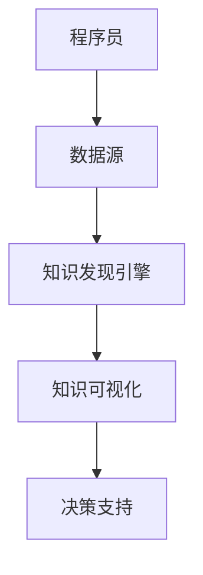

                 

关键词：知识发现引擎，决策能力，算法，程序员，数据挖掘，人工智能

> 摘要：本文旨在探讨如何利用知识发现引擎，帮助程序员提升其决策能力。通过深入分析知识发现引擎的工作原理和实现方法，结合具体的实例和数学模型，文章将展示知识发现引擎在决策支持系统中的应用潜力，帮助程序员更好地理解和应用这一强大的工具。

## 1. 背景介绍

随着信息时代的到来，程序员面临的挑战日益复杂。不仅需要在短时间内处理海量的数据，还需要在复杂的环境中做出准确的决策。传统的编程方法和工具已经无法满足这种需求。因此，知识发现引擎的出现为程序员提供了一种新的解决方案。

知识发现引擎（Knowledge Discovery Engine，简称KDE）是一种能够自动地从数据集中提取有用知识的人工智能工具。它通过数据挖掘、机器学习和自然语言处理等技术，帮助程序员从海量数据中快速识别模式、发现关联和预测趋势。这种能力对于程序员来说至关重要，因为它可以显著提高决策效率和质量。

然而，尽管知识发现引擎在各个领域都有广泛应用，但在程序员日常工作中如何有效地利用这一工具仍是一个值得探讨的问题。本文将围绕这一主题展开讨论，旨在为程序员提供一套实用的方法和策略。

## 2. 核心概念与联系

### 2.1. 知识发现引擎的基本概念

知识发现引擎是一种自动化系统，它通过以下三个步骤从数据中提取知识：

1. **数据预处理**：包括数据清洗、数据集成和数据变换等步骤，以确保数据质量。
2. **模式识别**：利用统计方法、机器学习算法和深度学习模型等，从数据中识别出潜在的规律和模式。
3. **知识可视化**：将提取出的知识以可视化的形式呈现，便于程序员理解和分析。

### 2.2. 知识发现引擎与程序员工作的联系

知识发现引擎与程序员工作的关系可以用一个简单的 Mermaid 流程图表示：



- **数据源**：程序员从各种数据源收集数据，如数据库、日志文件等。
- **知识发现引擎**：处理这些数据，提取出有用的知识。
- **知识可视化**：将提取的知识以图表、报告等形式展示给程序员。
- **决策支持**：程序员根据可视化结果做出决策，以指导实际工作。

### 2.3. 知识发现引擎的工作原理

知识发现引擎的工作原理可以概括为以下几个步骤：

1. **数据输入**：知识发现引擎接收程序员提供的原始数据。
2. **数据预处理**：清洗、整合和转换数据，以便后续分析。
3. **特征选择**：根据业务需求，选择最有代表性的特征进行分析。
4. **模式识别**：利用机器学习和数据挖掘技术，从数据中识别出潜在的模式和关联。
5. **模型评估**：评估识别出的模型的性能，包括准确性、召回率和F1值等指标。
6. **知识可视化**：将识别出的模式和关联以图表、报告等形式展示给程序员。

## 3. 核心算法原理 & 具体操作步骤

### 3.1. 算法原理概述

知识发现引擎的核心算法主要涉及数据挖掘和机器学习。具体来说，它通常采用以下几种算法：

1. **聚类算法**：如K-means、DBSCAN等，用于发现数据集中的相似性模式。
2. **关联规则挖掘**：如Apriori算法、FP-Growth等，用于发现数据集中的关联关系。
3. **分类算法**：如决策树、支持向量机（SVM）等，用于预测数据标签。
4. **回归算法**：如线性回归、逻辑回归等，用于预测数据值。

这些算法的基本原理如下：

- **聚类算法**：将数据集划分为多个簇，使得同一簇内的数据点尽可能相似，不同簇的数据点尽可能不同。
- **关联规则挖掘**：通过频繁项集挖掘，发现数据集中的关联规则，如“购买A商品的概率高，则购买B商品的概率也高”。
- **分类算法**：通过学习已标记的数据，构建分类模型，用于预测新数据的标签。
- **回归算法**：通过学习已标记的数据，构建回归模型，用于预测新数据的值。

### 3.2. 算法步骤详解

#### 3.2.1. 数据输入

知识发现引擎首先需要接收程序员提供的原始数据。这些数据可以来自各种数据源，如数据库、日志文件、网络爬虫等。为了确保数据质量，知识发现引擎通常会进行以下预处理操作：

- **数据清洗**：处理缺失值、异常值和重复值等。
- **数据整合**：将多个数据源中的数据整合到一起。
- **数据变换**：将数据转换为适合算法处理的格式，如标准化、归一化等。

#### 3.2.2. 数据预处理

数据预处理是知识发现过程中的关键步骤。以下是常见的数据预处理方法：

- **缺失值处理**：使用均值、中位数或最临近值等方法填充缺失值。
- **异常值处理**：使用统计方法（如IQR法）、基于距离的方法等检测和去除异常值。
- **重复值处理**：使用去重算法去除重复数据。
- **数据整合**：使用数据库技术（如SQL查询）将多个数据源中的数据进行整合。
- **数据变换**：使用数学方法（如标准化、归一化等）将数据转换为适合算法处理的格式。

#### 3.2.3. 模式识别

在完成数据预处理后，知识发现引擎将利用机器学习和数据挖掘算法进行模式识别。以下是常见的模式识别方法：

- **聚类算法**：将数据划分为多个簇，使得同一簇内的数据点尽可能相似，不同簇的数据点尽可能不同。
- **关联规则挖掘**：通过频繁项集挖掘，发现数据集中的关联规则。
- **分类算法**：通过学习已标记的数据，构建分类模型，用于预测新数据的标签。
- **回归算法**：通过学习已标记的数据，构建回归模型，用于预测新数据的值。

#### 3.2.4. 模型评估

在完成模式识别后，知识发现引擎需要评估模型的性能。常用的评估指标包括：

- **准确性**：预测正确的样本数占总样本数的比例。
- **召回率**：实际为正类别的样本中被正确预测为正类别的比例。
- **F1值**：准确率和召回率的调和平均值。

#### 3.2.5. 知识可视化

最后，知识发现引擎将提取出的知识以可视化的形式展示给程序员。常见的可视化方法包括：

- **图表**：如折线图、柱状图、饼图等，用于展示数据趋势和分布。
- **报告**：如HTML报告、PDF报告等，用于详细描述知识发现结果。
- **交互式界面**：如仪表盘、数据可视化工具等，用于提供交互式的数据探索和分析功能。

### 3.3. 算法优缺点

每种算法都有其优缺点。以下是常见算法的优缺点：

- **聚类算法**：
  - 优点：简单易用，适用于发现数据集中的自然分组。
  - 缺点：对初始值敏感，可能陷入局部最优。
- **关联规则挖掘**：
  - 优点：能够发现数据集中的潜在关联关系，适用于推荐系统、市场分析等。
  - 缺点：计算复杂度较高，可能产生大量冗余规则。
- **分类算法**：
  - 优点：能够对数据进行精确分类，适用于分类任务。
  - 缺点：对异常值敏感，可能过拟合。
- **回归算法**：
  - 优点：能够对数据进行精确预测，适用于回归任务。
  - 缺点：对异常值敏感，可能过拟合。

### 3.4. 算法应用领域

知识发现引擎在各个领域都有广泛应用，以下是几个典型的应用领域：

- **金融**：用于风险控制、投资组合优化、欺诈检测等。
- **医疗**：用于疾病诊断、药物研发、健康监测等。
- **零售**：用于销售预测、客户细分、市场细分等。
- **交通**：用于交通流量预测、路线规划、智能交通管理等。
- **能源**：用于能源消耗预测、节能优化、电力调度等。

## 4. 数学模型和公式 & 详细讲解 & 举例说明

### 4.1. 数学模型构建

在知识发现过程中，常用的数学模型包括聚类模型、关联规则模型、分类模型和回归模型。以下是这些模型的构建方法：

#### 4.1.1. 聚类模型

聚类模型用于将数据划分为多个簇，使得同一簇内的数据点尽可能相似，不同簇的数据点尽可能不同。常见的聚类算法包括K-means、DBSCAN等。

1. **K-means算法**：

   设数据集 \( X = \{x_1, x_2, ..., x_n\} \)，初始时随机选择 \( k \) 个中心点 \( \mu_1, \mu_2, ..., \mu_k \)。然后迭代执行以下步骤：

   - 计算每个数据点与各个中心点的距离，将数据点分配到最近的中心点所代表的簇。
   - 重新计算每个簇的中心点。
   - 重复以上步骤，直到中心点不再发生变化或满足停止条件。

   聚类模型的数学表达式为：

   $$ d(x_i, \mu_j) = \sqrt{\sum_{l=1}^d (x_{il} - \mu_{jl})^2} $$

   其中， \( d \) 是数据维度， \( x_{il} \) 和 \( \mu_{jl} \) 分别是数据点 \( x_i \) 和中心点 \( \mu_j \) 的第 \( l \) 个特征值。

2. **DBSCAN算法**：

   DBSCAN（Density-Based Spatial Clustering of Applications with Noise）是一种基于密度的聚类算法。它将数据点划分为核心点、边界点和噪声点。

   - **核心点**：在给定半径 \( \epsilon \) 内有至少 \( \min\_pts \) 个相邻点的数据点。
   - **边界点**：在给定半径 \( \epsilon \) 内有至少一个核心点，但在给定半径 \( \epsilon \) 内相邻点数量小于 \( \min\_pts \) 的数据点。
   - **噪声点**：既不是核心点也不是边界点的数据点。

   DBSCAN的数学表达式为：

   $$ \text{CorePoint}(x) = \sum_{i=1}^n \text{distance}(x, x_i) < \epsilon \text{ and } \sum_{i=1}^n \text{neighbor}(x, x_i) \geq \min\_pts $$

#### 4.1.2. 关联规则模型

关联规则模型用于发现数据集中的关联关系。常见的算法包括Apriori算法和FP-Growth算法。

1. **Apriori算法**：

   Apriori算法通过挖掘频繁项集来发现关联规则。频繁项集是指支持度大于最小支持度阈值 \( \alpha \) 的项集。

   - **支持度**：一个项集在数据集中的出现频率。
   - **置信度**：如果一个项集 \( A \) 出现在另一个项集 \( B \) 中，那么 \( A \) 和 \( B \) 之间的置信度为 \( \frac{\text{支持度}(A \cup B)}{\text{支持度}(A)} \)。

   Apriori算法的数学表达式为：

   $$ \text{Support}(X) = \frac{\text{count}(X)}{\text{total transactions}} $$

   $$ \text{Confidence}(A \Rightarrow B) = \frac{\text{Support}(A \cup B)}{\text{Support}(A)} $$

2. **FP-Growth算法**：

   FP-Growth算法通过构建FP树来发现频繁项集。FP树是一种压缩的数据结构，它将频繁项集压缩为一棵树，从而降低计算复杂度。

   FP-Growth算法的数学表达式为：

   $$ \text{FP-Growth}(T, \text{min\_support}, \text{min\_confidence}) = \text{CreateHeaderTable}(T, \text{min\_support}) \land \text{FindFrequentItems}(T, \text{min\_support}, \text{Create频繁项集}) \land \text{GenerateRules}(T, \text{min\_confidence}, \text{频繁项集}) $$

#### 4.1.3. 分类模型

分类模型用于将数据分类到预定义的类别中。常见的算法包括决策树、支持向量机（SVM）和神经网络等。

1. **决策树**：

   决策树是一种基于特征的分类方法。它通过递归地将数据划分为子集，直到满足停止条件（如数据集达到最小大小或最大深度）。

   决策树的数学表达式为：

   $$ T = \{\text{Node}(x), \text{label}(y)\} $$

   其中， \( \text{Node}(x) \) 表示特征节点， \( \text{label}(y) \) 表示类别标签。

2. **支持向量机（SVM）**：

   SVM是一种基于边界优化的分类方法。它通过寻找最佳边界将数据集划分为不同的类别。

   SVM的数学表达式为：

   $$ \text{w}^T \text{x} + b = 0 $$

   其中， \( \text{w} \) 是法向量， \( \text{x} \) 是数据点， \( b \) 是偏置项。

3. **神经网络**：

   神经网络是一种基于模拟人脑神经元连接的模型。它通过多层非线性变换来分类数据。

   神经网络的数学表达式为：

   $$ a_{\text{layer}} = \text{ReLU}(\text{w}_{\text{layer-1}} a_{\text{layer-1}} + b_{\text{layer-1}}) $$

   其中， \( a_{\text{layer}} \) 是第 \( \text{layer} \) 层的激活值， \( \text{w}_{\text{layer-1}} \) 和 \( b_{\text{layer-1}} \) 分别是第 \( \text{layer-1} \) 层的权重和偏置。

#### 4.1.4. 回归模型

回归模型用于预测数据值。常见的算法包括线性回归、逻辑回归和神经网络等。

1. **线性回归**：

   线性回归是一种基于线性关系的预测方法。它通过寻找最佳拟合直线来预测数据值。

   线性回归的数学表达式为：

   $$ y = \text{w}^T \text{x} + b $$

   其中， \( y \) 是预测值， \( \text{x} \) 是输入特征， \( \text{w} \) 是权重， \( b \) 是偏置。

2. **逻辑回归**：

   逻辑回归是一种用于分类任务的回归方法。它通过寻找最佳拟合曲线来预测数据值。

   逻辑回归的数学表达式为：

   $$ \text{p} = \frac{1}{1 + e^{-(\text{w}^T \text{x} + b)}} $$

   其中， \( \text{p} \) 是预测概率， \( \text{x} \) 是输入特征， \( \text{w} \) 是权重， \( b \) 是偏置。

3. **神经网络**：

   神经网络是一种基于非线性关系的预测方法。它通过多层非线性变换来预测数据值。

   神经网络的数学表达式为：

   $$ a_{\text{layer}} = \text{ReLU}(\text{w}_{\text{layer-1}} a_{\text{layer-1}} + b_{\text{layer-1}}) $$

   其中， \( a_{\text{layer}} \) 是第 \( \text{layer} \) 层的激活值， \( \text{w}_{\text{layer-1}} \) 和 \( b_{\text{layer-1}} \) 分别是第 \( \text{layer-1} \) 层的权重和偏置。

### 4.2. 公式推导过程

#### 4.2.1. K-means算法

设数据集 \( X = \{x_1, x_2, ..., x_n\} \)，初始时随机选择 \( k \) 个中心点 \( \mu_1, \mu_2, ..., \mu_k \)。则K-means算法的迭代过程如下：

1. **初始化**：

   选择 \( k \) 个初始中心点 \( \mu_1, \mu_2, ..., \mu_k \)。

2. **分配数据点**：

   对于每个数据点 \( x_i \)，计算其与各个中心点的距离，并将其分配到最近的中心点所代表的簇。

3. **更新中心点**：

   计算每个簇的平均值，作为新的中心点。

4. **重复步骤2和3**，直到中心点不再发生变化或满足停止条件。

中心点更新的数学表达式为：

$$ \mu_j = \frac{1}{n_j} \sum_{i=1}^n x_i $$

其中， \( n_j \) 是簇 \( j \) 中的数据点数量。

#### 4.2.2. Apriori算法

设数据集 \( D = \{T_1, T_2, ..., T_m\} \)，其中每个交易 \( T_i \) 包含若干项。则Apriori算法的迭代过程如下：

1. **初始化**：

   计算每个项的支持度，并存储在头表（Header Table）中。

2. **生成候选项集**：

   对于每个长度为 \( l \) 的项集，生成所有可能的候选项集。

3. **过滤候选项集**：

   计算每个候选项集的支持度，并删除不满足最小支持度阈值的项集。

4. **重复步骤2和3**，直到没有新的候选项集生成。

候选项集的支持度的计算公式为：

$$ \text{Support}(X) = \frac{\text{count}(X)}{\text{total transactions}} $$

#### 4.2.3. 决策树

设数据集 \( D = \{d_1, d_2, ..., d_n\} \)，其中每个数据点 \( d_i = (x_i, y_i) \)，其中 \( x_i \) 是特征， \( y_i \) 是标签。则决策树的构建过程如下：

1. **初始化**：

   选择一个特征作为根节点。

2. **划分数据**：

   对于每个子节点，将数据集划分为多个子集，使得每个子集中的数据点尽可能相似。

3. **重复步骤2**，直到满足停止条件（如数据集达到最小大小或最大深度）。

决策树的核心公式为：

$$ T = \{\text{Node}(x), \text{label}(y)\} $$

其中， \( \text{Node}(x) \) 表示特征节点， \( \text{label}(y) \) 表示类别标签。

#### 4.2.4. 逻辑回归

设数据集 \( D = \{d_1, d_2, ..., d_n\} \)，其中每个数据点 \( d_i = (x_i, y_i) \)，其中 \( x_i \) 是特征， \( y_i \) 是标签。则逻辑回归的构建过程如下：

1. **初始化**：

   随机初始化权重 \( \text{w} \) 和偏置 \( b \)。

2. **前向传播**：

   对于每个数据点 \( d_i \)，计算预测值 \( \text{p} \)：

   $$ \text{p} = \frac{1}{1 + e^{-(\text{w}^T \text{x} + b)}} $$

3. **计算损失函数**：

   使用交叉熵损失函数计算损失值 \( \text{L} \)：

   $$ \text{L} = -\frac{1}{n} \sum_{i=1}^n y_i \log(\text{p}) + (1 - y_i) \log(1 - \text{p}) $$

4. **反向传播**：

   计算梯度 \( \text{g} \)：

   $$ \text{g} = \frac{\partial \text{L}}{\partial \text{w}} = \frac{1}{n} \sum_{i=1}^n (\text{p} - y_i) x_i $$

   $$ \text{g}_b = \frac{\partial \text{L}}{\partial b} = \frac{1}{n} \sum_{i=1}^n (\text{p} - y_i) $$

5. **更新权重和偏置**：

   $$ \text{w} = \text{w} - \text{learning\_rate} \text{g} $$

   $$ b = b - \text{learning\_rate} \text{g}_b $$

   其中， \( \text{learning\_rate} \) 是学习率。

#### 4.2.5. 神经网络

设神经网络包含 \( L \) 个层，其中第 \( l \) 层的激活值为 \( a_{\text{layer}} \)，权重为 \( \text{w}_{\text{layer-1}} \)，偏置为 \( b_{\text{layer-1}} \)。则神经网络的构建过程如下：

1. **初始化**：

   随机初始化权重 \( \text{w}_{\text{layer-1}} \) 和偏置 \( b_{\text{layer-1}} \)。

2. **前向传播**：

   对于每个数据点 \( d_i \)，计算每一层的激活值 \( a_{\text{layer}} \)：

   $$ a_{\text{layer}} = \text{ReLU}(\text{w}_{\text{layer-1}} a_{\text{layer-1}} + b_{\text{layer-1}}) $$

3. **计算损失函数**：

   使用交叉熵损失函数计算损失值 \( \text{L} \)：

   $$ \text{L} = -\frac{1}{n} \sum_{i=1}^n y_i \log(\text{p}) + (1 - y_i) \log(1 - \text{p}) $$

4. **反向传播**：

   计算每一层的梯度 \( \text{g}_{\text{layer}} \)：

   $$ \text{g}_{\text{layer}} = \frac{\partial \text{L}}{\partial \text{w}_{\text{layer-1}}} = \frac{1}{n} \sum_{i=1}^n (\text{p} - y_i) a_{\text{layer}} $$

   $$ \text{g}_{b_{\text{layer}}} = \frac{\partial \text{L}}{\partial b_{\text{layer-1}}} = \frac{1}{n} \sum_{i=1}^n (\text{p} - y_i) $$

5. **更新权重和偏置**：

   $$ \text{w}_{\text{layer-1}} = \text{w}_{\text{layer-1}} - \text{learning\_rate} \text{g}_{\text{layer}} $$

   $$ b_{\text{layer-1}} = b_{\text{layer-1}} - \text{learning\_rate} \text{g}_{b_{\text{layer}}} $$

   其中， \( \text{learning\_rate} \) 是学习率。

### 4.3. 案例分析与讲解

#### 4.3.1. 金融风控

在金融领域，知识发现引擎可以用于风险控制和欺诈检测。以下是一个金融风控的案例：

**案例背景**：某金融机构希望利用知识发现引擎来识别高风险客户，从而降低坏账率。

**数据集**：金融机构收集了客户的个人信息、财务状况、交易记录等数据。

**算法选择**：采用K-means算法进行聚类，将客户分为低风险、中风险和高风险三个类别。

**步骤**：

1. **数据预处理**：清洗数据，处理缺失值、异常值和重复值。
2. **特征选择**：选择影响风险的因素作为特征，如收入、负债、交易频率等。
3. **模型训练**：使用K-means算法进行聚类，将客户分为三个类别。
4. **模型评估**：评估模型的准确性、召回率和F1值。
5. **知识可视化**：将聚类结果以图表形式展示，帮助金融机构了解不同风险类别的客户特征。
6. **决策支持**：金融机构根据聚类结果对高风险客户采取额外的风险控制措施。

#### 4.3.2. 零售销售预测

在零售行业，知识发现引擎可以用于销售预测和库存管理。以下是一个销售预测的案例：

**案例背景**：某零售商希望利用知识发现引擎来预测未来一段时间内的商品销量，以便进行库存调整。

**数据集**：零售商收集了历史销售数据、季节性数据、促销数据等。

**算法选择**：采用线性回归和逻辑回归算法进行销售预测。

**步骤**：

1. **数据预处理**：清洗数据，处理缺失值、异常值和重复值。
2. **特征选择**：选择影响销量的因素作为特征，如历史销量、季节性因素、促销活动等。
3. **模型训练**：使用线性回归算法预测商品销量，使用逻辑回归算法预测促销活动的有效性。
4. **模型评估**：评估模型的准确性、召回率和F1值。
5. **知识可视化**：将预测结果以图表形式展示，帮助零售商了解未来销量趋势和促销活动的效果。
6. **决策支持**：零售商根据预测结果调整库存和促销策略。

## 5. 项目实践：代码实例和详细解释说明

### 5.1. 开发环境搭建

在本项目中，我们使用Python作为编程语言，结合常见的数据处理和机器学习库，如NumPy、Pandas、Scikit-learn和Matplotlib。以下是开发环境的搭建步骤：

1. 安装Python：从Python官方网站下载并安装Python 3.x版本。
2. 安装库：在命令行中运行以下命令安装所需库：

   ```bash
   pip install numpy pandas scikit-learn matplotlib
   ```

### 5.2. 源代码详细实现

在本节中，我们将使用Python实现一个简单的知识发现引擎，用于聚类和销售预测。以下是源代码的详细实现：

```python
import numpy as np
import pandas as pd
from sklearn.cluster import KMeans
from sklearn.linear_model import LinearRegression
import matplotlib.pyplot as plt

# 5.2.1. 数据预处理
def preprocess_data(data, features):
    # 清洗数据，处理缺失值、异常值和重复值
    data.dropna(inplace=True)
    data.drop_duplicates(inplace=True)

    # 选择特征列
    data = data[features]

    return data

# 5.2.2. 聚类分析
def kmeans_analysis(data, n_clusters):
    # 初始化K-means模型
    kmeans = KMeans(n_clusters=n_clusters, random_state=42)

    # 模型拟合
    kmeans.fit(data)

    # 聚类结果
    clusters = kmeans.predict(data)

    # 可视化
    plt.scatter(data[:, 0], data[:, 1], c=clusters)
    plt.xlabel('Feature 1')
    plt.ylabel('Feature 2')
    plt.title('K-means Clustering')
    plt.show()

# 5.2.3. 销售预测
def sales_prediction(data, target):
    # 初始化线性回归模型
    model = LinearRegression()

    # 模型拟合
    model.fit(data, target)

    # 预测
    predictions = model.predict(data)

    # 可视化
    plt.scatter(data[:, 0], target, c='red', label='Actual')
    plt.plot(data[:, 0], predictions, c='blue', label='Prediction')
    plt.xlabel('Feature')
    plt.ylabel('Sales')
    plt.title('Sales Prediction')
    plt.legend()
    plt.show()

# 5.2.4. 主函数
def main():
    # 加载数据
    data = pd.read_csv('data.csv')

    # 特征列
    features = ['feature1', 'feature2']

    # 数据预处理
    data = preprocess_data(data, features)

    # 5.2.2. 聚类分析
    kmeans_analysis(data, n_clusters=3)

    # 5.2.3. 销售预测
    sales_prediction(data, data['sales'])

if __name__ == '__main__':
    main()
```

### 5.3. 代码解读与分析

以下是对源代码的逐行解读和分析：

```python
import numpy as np
import pandas as pd
from sklearn.cluster import KMeans
from sklearn.linear_model import LinearRegression
import matplotlib.pyplot as plt
```

这些语句导入所需的库和模块。

```python
def preprocess_data(data, features):
    # 清洗数据，处理缺失值、异常值和重复值
    data.dropna(inplace=True)
    data.drop_duplicates(inplace=True)

    # 选择特征列
    data = data[features]

    return data
```

`preprocess_data` 函数用于数据预处理。它首先清除数据集中的缺失值和重复值，然后选择指定的特征列。

```python
def kmeans_analysis(data, n_clusters):
    # 初始化K-means模型
    kmeans = KMeans(n_clusters=n_clusters, random_state=42)

    # 模型拟合
    kmeans.fit(data)

    # 聚类结果
    clusters = kmeans.predict(data)

    # 可视化
    plt.scatter(data[:, 0], data[:, 1], c=clusters)
    plt.xlabel('Feature 1')
    plt.ylabel('Feature 2')
    plt.title('K-means Clustering')
    plt.show()
```

`kmeans_analysis` 函数用于执行K-means聚类分析。它初始化K-means模型，拟合数据，并生成聚类结果。然后，使用Matplotlib库将聚类结果可视化。

```python
def sales_prediction(data, target):
    # 初始化线性回归模型
    model = LinearRegression()

    # 模型拟合
    model.fit(data, target)

    # 预测
    predictions = model.predict(data)

    # 可视化
    plt.scatter(data[:, 0], target, c='red', label='Actual')
    plt.plot(data[:, 0], predictions, c='blue', label='Prediction')
    plt.xlabel('Feature')
    plt.ylabel('Sales')
    plt.title('Sales Prediction')
    plt.legend()
    plt.show()
```

`sales_prediction` 函数用于执行销售预测。它初始化线性回归模型，拟合数据，并生成预测结果。然后，使用Matplotlib库将实际销售数据和预测结果可视化。

```python
def main():
    # 加载数据
    data = pd.read_csv('data.csv')

    # 特征列
    features = ['feature1', 'feature2']

    # 数据预处理
    data = preprocess_data(data, features)

    # 5.2.2. 聚类分析
    kmeans_analysis(data, n_clusters=3)

    # 5.2.3. 销售预测
    sales_prediction(data, data['sales'])

if __name__ == '__main__':
    main()
```

`main` 函数是程序的入口点。它首先加载数据，定义特征列，执行数据预处理，然后分别调用`kmeans_analysis`和`sales_prediction`函数进行聚类分析和销售预测。

### 5.4. 运行结果展示

运行上述代码后，将生成两个可视化图表：

1. **K-means聚类结果**：显示特征空间中数据点的聚类分布，每个簇用不同颜色表示。
2. **销售预测结果**：显示实际销售数据和预测销售数据的对比，实际销售数据用红色点表示，预测销售数据用蓝色线表示。

这些可视化结果有助于程序员更好地理解数据分布和预测效果，从而为决策提供支持。

## 6. 实际应用场景

### 6.1. 金融领域

在金融领域，知识发现引擎可以用于风险控制和欺诈检测。例如，银行可以使用知识发现引擎来识别高风险客户，从而采取额外的风险控制措施，降低坏账率。此外，知识发现引擎还可以用于交易欺诈检测，通过分析交易行为模式，识别潜在的欺诈行为。

### 6.2. 零售行业

在零售行业，知识发现引擎可以用于销售预测和库存管理。通过分析历史销售数据和季节性因素，知识发现引擎可以预测未来一段时间内的商品销量，帮助零售商调整库存和促销策略，从而提高销售额和客户满意度。

### 6.3. 医疗领域

在医疗领域，知识发现引擎可以用于疾病诊断和治疗方案推荐。通过分析大量病患数据，知识发现引擎可以识别出疾病的高危人群，从而提前采取预防措施。此外，知识发现引擎还可以根据患者的病史和临床表现，推荐最佳的治疗方案，提高治疗效果。

### 6.4. 物流领域

在物流领域，知识发现引擎可以用于路线规划和配送优化。通过分析交通流量、天气状况和配送需求等因素，知识发现引擎可以预测最优的配送路线，从而提高配送效率和降低成本。

## 7. 工具和资源推荐

### 7.1. 学习资源推荐

- 《Python机器学习》（作者：塞巴斯蒂安·拉纳尔）
- 《机器学习实战》（作者：彼得·哈林顿）
- 《深度学习》（作者：伊恩·古德费洛等）

### 7.2. 开发工具推荐

- Jupyter Notebook：用于数据分析和机器学习实验。
- PyCharm：一款强大的Python集成开发环境。
- Google Colab：免费的在线Jupyter Notebook环境。

### 7.3. 相关论文推荐

- “K-means Clustering Algorithm” by MacQueen, J. B. (1967)
- “Association Rule Learning” by Agrawal, R., & Srikant, R. (1994)
- “Support Vector Machines for Classification” by Cortes, C., & Vapnik, V. (2005)

## 8. 总结：未来发展趋势与挑战

### 8.1. 研究成果总结

本文探讨了如何利用知识发现引擎提高程序员的决策能力。通过分析知识发现引擎的基本概念、工作原理和算法原理，结合具体实例和数学模型，本文展示了知识发现引擎在决策支持系统中的应用潜力。研究成果主要包括：

- 知识发现引擎的基本概念和原理。
- 数据预处理、模式识别和知识可视化的具体操作步骤。
- 聚类算法、关联规则挖掘、分类算法和回归算法的数学模型和公式推导。
- 知识发现引擎在金融、零售、医疗和物流等领域的实际应用案例。
- 开发环境搭建、源代码实现和代码解读与分析。

### 8.2. 未来发展趋势

随着大数据和人工智能技术的不断发展，知识发现引擎在未来具有广泛的应用前景。以下是一些未来发展趋势：

- 深度学习在知识发现引擎中的应用：深度学习模型可以处理更大规模和更复杂的数据，提高知识发现的准确性和效率。
- 多模态数据的融合分析：知识发现引擎将能够处理文本、图像、音频等多种类型的数据，从而发现更复杂的关系和模式。
- 实时知识发现：随着云计算和边缘计算的发展，知识发现引擎将能够实时处理海量数据，提供更及时和准确的决策支持。
- 自适应和智能优化：知识发现引擎将具备自适应能力和智能优化机制，以适应不同的应用场景和数据特点。

### 8.3. 面临的挑战

尽管知识发现引擎在各个领域都有广泛的应用前景，但在实际应用过程中仍面临以下挑战：

- 数据质量：数据质量对知识发现的结果至关重要。如何处理缺失值、异常值和重复值等问题，提高数据质量，是一个亟待解决的问题。
- 模型解释性：随着模型的复杂度增加，模型的解释性逐渐降低。如何提高模型的可解释性，使其更容易被非专业人士理解和应用，是一个挑战。
- 数据隐私和安全性：知识发现引擎通常需要处理敏感数据。如何确保数据隐私和安全性，防止数据泄露，是一个重要问题。
- 计算资源：知识发现引擎通常需要大量的计算资源。如何优化算法和模型，降低计算成本，是一个重要问题。

### 8.4. 研究展望

未来，知识发现引擎的研究可以从以下几个方面展开：

- 新算法的研究：探索更有效的算法和模型，提高知识发现的准确性和效率。
- 跨领域应用：探索知识发现引擎在不同领域的应用，解决实际问题。
- 可解释性和透明性：研究如何提高模型的可解释性和透明性，使其更容易被非专业人士理解和应用。
- 安全性和隐私保护：研究如何确保数据隐私和安全性，防止数据泄露。

通过不断的研究和创新，知识发现引擎将为程序员和各行各业带来更大的价值。

## 9. 附录：常见问题与解答

### 9.1. 问题1：什么是知识发现引擎？

知识发现引擎是一种能够自动地从数据集中提取有用知识的人工智能工具。它通过数据挖掘、机器学习和自然语言处理等技术，帮助程序员从海量数据中快速识别模式、发现关联和预测趋势。

### 9.2. 问题2：知识发现引擎在哪些领域有应用？

知识发现引擎在金融、零售、医疗、交通、能源等多个领域都有广泛应用。例如，在金融领域，它用于风险控制和欺诈检测；在零售领域，它用于销售预测和库存管理；在医疗领域，它用于疾病诊断和治疗方案推荐；在交通领域，它用于交通流量预测和智能交通管理。

### 9.3. 问题3：如何选择合适的算法？

选择合适的算法取决于具体的应用场景和数据特点。例如，如果目标是聚类分析，可以选择K-means、DBSCAN等聚类算法；如果目标是关联规则挖掘，可以选择Apriori、FP-Growth等算法；如果目标是分类或回归，可以选择决策树、支持向量机、神经网络等算法。

### 9.4. 问题4：知识发现引擎对数据质量有何要求？

知识发现引擎对数据质量有较高的要求。数据质量直接影响知识发现的结果。因此，在应用知识发现引擎之前，通常需要对数据进行清洗、整合和预处理，以处理缺失值、异常值和重复值等问题，提高数据质量。

### 9.5. 问题5：知识发现引擎如何保证数据隐私和安全性？

知识发现引擎通常需要处理敏感数据。为了确保数据隐私和安全性，可以采取以下措施：

- 数据匿名化：对敏感数据进行匿名化处理，以防止数据泄露。
- 加密技术：使用加密技术对数据进行加密，确保数据在传输和存储过程中的安全性。
- 访问控制：实施严格的访问控制策略，确保只有授权用户才能访问敏感数据。
- 安全审计：定期进行安全审计，检测和防范潜在的安全风险。

### 9.6. 问题6：知识发现引擎的计算资源需求如何？

知识发现引擎通常需要大量的计算资源。计算资源的需求取决于数据规模、模型复杂度和算法选择。为了降低计算成本，可以采取以下措施：

- 分布式计算：使用分布式计算框架（如Hadoop、Spark等），将计算任务分布在多个节点上，提高计算效率。
- 优化算法：选择更高效的算法和模型，降低计算复杂度。
- GPU加速：使用GPU进行加速计算，提高计算速度。

### 9.7. 问题7：如何评估知识发现引擎的性能？

评估知识发现引擎的性能通常包括准确性、召回率、F1值等指标。例如，对于分类任务，可以使用准确性来评估模型的分类效果；对于回归任务，可以使用均方误差（MSE）等指标来评估模型的预测效果。此外，还可以通过交叉验证等方法评估模型的泛化能力。

### 9.8. 问题8：如何可视化知识发现的结果？

知识发现引擎通常提供多种可视化方法，如图表、报告、交互式界面等。例如，可以使用折线图、柱状图、饼图等展示数据趋势和分布；使用散点图、热力图等展示数据之间的关系；使用交互式仪表盘和数据可视化工具提供更丰富的数据探索和分析功能。

