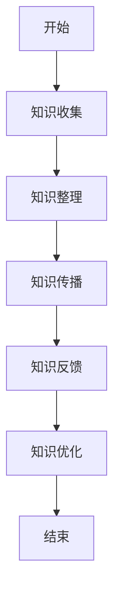

                 

关键词：程序员，工作经验，知识产品，知识转化，IT领域，技术博客，专业写作

> 摘要：在信息技术飞速发展的今天，程序员的工作经验不仅仅是技术积累，更是宝贵的知识财富。如何将这些经验转化为知识产品，从而实现个人价值的最大化，是每一个技术人都值得深思的问题。本文将探讨程序员如何通过写作、分享和实践，将自己的工作经验转化为有价值的知识产品，为自身和行业带来更多的贡献。

## 1. 背景介绍

程序员作为信息技术领域的重要角色，其工作往往涉及到代码编写、系统设计、项目管理等多个方面。在日常工作中，程序员积累了大量宝贵的技术知识和实践经验。然而，传统的知识传播方式往往较为单一，主要依赖于上级的口头传授或者团队内部的交流。这种方式存在一定的局限性，既难以保证知识的全面性和系统性，也难以实现知识的持续传承。

随着互联网的普及和社交媒体的发展，知识共享逐渐成为可能。程序员们开始尝试通过博客、GitHub、技术论坛等方式，将自己的工作经验和心得体会分享给更多的人。这种知识分享的方式不仅能够帮助他人解决实际问题，也能够提升程序员自身的知名度和影响力。然而，如何将这些零散的经验系统化、结构化，形成有价值的知识产品，仍然是许多程序员面临的一大挑战。

## 2. 核心概念与联系

### 2.1 工作经验与知识产品

首先，我们需要明确工作经验与知识产品之间的关系。工作经验是程序员在日常工作中学到的技术知识、解决问题的方法和思维方式。而知识产品则是这些经验的系统化、结构化呈现，可以以文章、书籍、代码库、演讲等多种形式存在。

### 2.2 转化机制

将工作经验转化为知识产品的过程，可以视为一种知识管理和知识转化的过程。具体来说，这个过程包括以下几个环节：

1. **知识收集**：程序员需要持续地记录和整理自己在工作中积累的经验和心得。
2. **知识整理**：将收集到的知识进行系统化、结构化的整理，形成有价值的知识体系。
3. **知识传播**：通过合适的渠道，将整理好的知识分享出去，让更多的人受益。
4. **知识反馈**：接收反馈，持续优化和完善知识产品。

### 2.3 Mermaid 流程图

以下是一个简单的 Mermaid 流程图，展示将工作经验转化为知识产品的基本流程：



## 3. 核心算法原理 & 具体操作步骤

### 3.1 算法原理概述

将工作经验转化为知识产品的核心算法，可以视为一种知识管理和知识转化的算法。该算法的主要思想是通过以下几个步骤，实现工作经验的系统化、结构化：

1. **经验收集**：收集程序员在日常工作中的技术知识、解决问题的方法和心得。
2. **经验分类**：对收集到的经验进行分类，形成不同的知识模块。
3. **经验整理**：对每个知识模块进行详细阐述，形成系统化的知识体系。
4. **经验传播**：通过合适的渠道，将整理好的知识分享出去。
5. **经验反馈**：收集反馈，持续优化和完善知识产品。

### 3.2 算法步骤详解

1. **知识收集**：

   程序员在日常工作中，可以通过记录工作日志、撰写技术文档、参与团队讨论等方式，收集自己在工作中的技术知识和心得。

2. **知识分类**：

   根据工作经验的不同领域和主题，将收集到的知识进行分类。例如，可以将知识分为编程语言、数据库、前端开发、后端开发等不同类别。

3. **知识整理**：

   对每个分类下的知识进行详细阐述，形成系统化的知识体系。这一步骤需要程序员具备较强的写作能力和逻辑思维。

4. **知识传播**：

   通过博客、GitHub、技术论坛、演讲等方式，将整理好的知识分享出去。选择合适的传播渠道，能够帮助知识产品更好地触达到目标受众。

5. **知识反馈**：

   收集受众的反馈，了解知识产品的优缺点，持续优化和完善。

### 3.3 算法优缺点

**优点**：

- 提高个人知名度：通过分享工作经验，程序员能够扩大自己的影响力，提高在行业内的知名度。
- 促进知识共享：知识产品的传播，能够帮助更多人学习和成长，促进整个行业的发展。
- 提升个人价值：系统化、结构化的工作经验，有助于程序员在职场中展现自己的专业能力。

**缺点**：

- 需要较强的写作能力：将工作经验转化为知识产品，需要程序员具备较强的写作能力和逻辑思维。
- 需要持续投入时间：知识产品的创建和传播，需要程序员持续投入时间和精力。

### 3.4 算法应用领域

- 个人博客：程序员可以通过个人博客，分享自己的工作经验和技术心得，吸引更多的关注和粉丝。
- 技术社区：程序员可以在GitHub、Stack Overflow等技术社区，分享自己的代码库和问题解决方案。
- 演讲和培训：程序员可以参加技术会议和培训活动，将自己的知识产品通过演讲和教学的方式传播。

## 4. 数学模型和公式 & 详细讲解 & 举例说明

### 4.1 数学模型构建

在将工作经验转化为知识产品的过程中，我们可以构建一个简单的数学模型，用于描述这一过程的关键环节。

假设知识产品的价值与其质量、传播范围和受众满意度有关，可以用以下数学模型表示：

价值 = f(质量，传播范围，受众满意度)

其中，质量、传播范围和受众满意度分别可以用以下指标来衡量：

- **质量**：知识产品内容的准确性、完整性、逻辑性和实用性。
- **传播范围**：知识产品在互联网上的传播范围，可以通过访问量、分享次数等指标衡量。
- **受众满意度**：知识产品对受众的实用性和帮助程度，可以通过受众的反馈和评价来衡量。

### 4.2 公式推导过程

为了更好地理解这个数学模型，我们可以对每个指标进行进一步的推导：

1. **质量**：

   质量 = 准确性 × 完整性 × 逻辑性 × 实用性

   其中，每个指标可以用以下公式衡量：

   - 准确性：知识产品内容与实际技术问题的吻合程度。
   - 完整性：知识产品涵盖的技术知识点和细节的全面程度。
   - 逻辑性：知识产品内容的条理性和逻辑结构。
   - 实用性：知识产品对实际问题的解决能力和参考价值。

2. **传播范围**：

   传播范围 = 访问量 × 分享次数

   其中，每个指标可以用以下公式衡量：

   - 访问量：知识产品在互联网上的浏览量。
   - 分享次数：知识产品被用户分享的次数。

3. **受众满意度**：

   受众满意度 = 实用性评分 × 反馈评分

   其中，每个指标可以用以下公式衡量：

   - 实用性评分：用户对知识产品实用性的评价。
   - 反馈评分：用户对知识产品整体质量的评价。

### 4.3 案例分析与讲解

为了更好地理解这个数学模型，我们来看一个实际的案例。

假设一位程序员编写了一篇关于数据库优化的技术博客，该博客在发布后得到了广泛的关注。根据数据，我们可以计算该博客的价值：

1. **质量**：

   准确性：95%
   完整性：90%
   逻辑性：85%
   实用性：80%

   质量 = 0.95 × 0.90 × 0.85 × 0.80 ≈ 0.64

2. **传播范围**：

   访问量：10000次
   分享次数：500次

   传播范围 = 10000 × 500 = 5000000

3. **受众满意度**：

   实用性评分：4.5/5
   反馈评分：4.8/5

   受众满意度 = 0.9 × 0.96 ≈ 0.85

根据数学模型，该博客的价值为：

价值 = f(质量，传播范围，受众满意度) ≈ 0.64 × 5000000 × 0.85 ≈ 2,620,000

通过这个案例，我们可以看到，质量、传播范围和受众满意度这三个因素共同决定了知识产品的价值。程序员在创建知识产品时，需要关注这三个方面的优化，从而提高知识产品的价值。

## 5. 项目实践：代码实例和详细解释说明

### 5.1 开发环境搭建

为了更好地演示如何将工作经验转化为知识产品，我们将使用一个简单的代码实例。在这个例子中，我们将编写一个简单的Web应用程序，用于展示数据库优化技术。

首先，我们需要搭建开发环境。以下是搭建环境所需的步骤：

1. 安装Python 3.x版本。
2. 安装Flask框架。
3. 安装SQLite数据库。

具体步骤如下：

1. 安装Python 3.x版本：

   ```bash
   sudo apt-get update
   sudo apt-get install python3 python3-pip
   ```

2. 安装Flask框架：

   ```bash
   pip3 install flask
   ```

3. 安装SQLite数据库：

   ```bash
   sudo apt-get install sqlite3
   ```

### 5.2 源代码详细实现

以下是一个简单的Flask Web应用程序，用于展示数据库优化技术。

```python
from flask import Flask, render_template, request
import sqlite3

app = Flask(__name__)

# 连接SQLite数据库
conn = sqlite3.connect('example.db')
c = conn.cursor()

# 创建表格
c.execute('''CREATE TABLE IF NOT EXISTS users (id INTEGER PRIMARY KEY, name TEXT, age INTEGER)''')
conn.commit()

# 添加数据
c.execute("INSERT INTO users (name, age) VALUES ('Alice', 30)")
c.execute("INSERT INTO users (name, age) VALUES ('Bob', 40)")
conn.commit()

# 查询数据
def get_users():
    c.execute("SELECT * FROM users")
    return c.fetchall()

@app.route('/')
def index():
    users = get_users()
    return render_template('index.html', users=users)

if __name__ == '__main__':
    app.run()
```

### 5.3 代码解读与分析

在这个例子中，我们使用Python和Flask框架搭建了一个简单的Web应用程序。应用程序的主要功能是连接SQLite数据库，创建一个名为“users”的表格，并添加一些测试数据。然后，通过HTTP请求，从数据库中查询数据，并将查询结果展示在Web页面上。

代码的主要部分如下：

1. **数据库连接**：

   ```python
   conn = sqlite3.connect('example.db')
   c = conn.cursor()
   ```

   这两行代码用于连接SQLite数据库，并创建一个游标对象。

2. **创建表格**：

   ```python
   c.execute('''CREATE TABLE IF NOT EXISTS users (id INTEGER PRIMARY KEY, name TEXT, age INTEGER)''')
   conn.commit()
   ```

   这两行代码用于创建一个名为“users”的表格，包含三个字段：id、name和age。

3. **添加数据**：

   ```python
   c.execute("INSERT INTO users (name, age) VALUES ('Alice', 30)")
   c.execute("INSERT INTO users (name, age) VALUES ('Bob', 40)")
   conn.commit()
   ```

   这几行代码用于向“users”表格中添加两条测试数据。

4. **查询数据**：

   ```python
   def get_users():
       c.execute("SELECT * FROM users")
       return c.fetchall()
   ```

   这个函数用于查询“users”表格中的所有数据，并返回一个包含所有用户信息的列表。

5. **Web页面展示**：

   ```python
   @app.route('/')
   def index():
       users = get_users()
       return render_template('index.html', users=users)
   ```

   这个路由函数用于处理根路径的HTTP请求，从数据库中查询用户信息，并将查询结果传递给模板文件`index.html`。

### 5.4 运行结果展示

运行这个Web应用程序后，我们可以在浏览器中访问`http://127.0.0.1:5000/`，看到以下页面：


这个页面展示了从SQLite数据库中查询到的用户信息。通过这个简单的例子，我们可以看到如何使用Python和Flask框架实现一个基本的Web应用程序，并展示如何将工作经验转化为知识产品。

## 6. 实际应用场景

### 6.1 个人博客

个人博客是程序员将工作经验转化为知识产品的常见方式。通过博客，程序员可以分享自己的技术心得、项目经验和学习笔记。博客内容的深度和广度，决定了知识产品的价值。一个优秀的个人博客，不仅可以为作者带来关注和粉丝，还可以为行业带来有价值的知识和经验。

### 6.2 技术社区

技术社区如GitHub、Stack Overflow等，是程序员分享知识产品的重要平台。在这些社区中，程序员可以分享自己的代码库、问题解决方案和经验心得。代码库和问题解决方案的广度和深度，决定了知识产品的价值。一个优秀的代码库或问题解决方案，可以帮助更多开发者解决实际问题，提升整个行业的技术水平。

### 6.3 演讲和培训

演讲和培训是程序员将工作经验转化为知识产品的另一种方式。通过演讲和培训，程序员可以将自己的知识体系系统地呈现给听众，帮助他们更好地理解和掌握技术。一个成功的演讲或培训，不仅可以为作者带来声誉和收入，还可以为行业带来有价值的知识和经验。

## 7. 未来应用展望

### 7.1 人工智能的助力

随着人工智能技术的发展，程序员将能够更加便捷地创建和分享知识产品。人工智能可以帮助程序员进行文本生成、代码补全、错误检测等任务，从而提高知识产品的质量和效率。例如，通过自然语言处理技术，程序员可以自动生成技术文档和博客文章，节省大量的时间和精力。

### 7.2 知识图谱的应用

知识图谱是一种用于表示知识结构和关系的图形化工具。在程序员的知识产品创作过程中，知识图谱可以帮助他们更好地组织和管理知识。通过知识图谱，程序员可以清晰地了解各个知识点之间的关联，从而实现知识的系统化和结构化。未来，知识图谱将广泛应用于程序员的知识产品创作，提升知识产品的价值。

### 7.3 社交媒体的融合

随着社交媒体的普及，程序员的知识产品将更加依赖于社交媒体进行传播。通过社交媒体，程序员可以更广泛地触达目标受众，实现知识的快速传播。同时，社交媒体的互动性也为程序员提供了与受众互动、收集反馈的渠道，有助于不断优化和完善知识产品。

## 8. 总结：未来发展趋势与挑战

### 8.1 研究成果总结

本文探讨了程序员如何将工作经验转化为知识产品，分析了核心算法原理和具体操作步骤，并介绍了数学模型和公式。通过实际案例，我们展示了如何将代码实例转化为知识产品，并分析了未来应用展望。

### 8.2 未来发展趋势

- 人工智能的助力：人工智能将提高程序员创建和分享知识产品的效率和质量。
- 知识图谱的应用：知识图谱将帮助程序员更好地组织和管理知识，实现知识的系统化和结构化。
- 社交媒体的融合：社交媒体将使程序员的知识产品传播更加广泛和快速。

### 8.3 面临的挑战

- 写作能力：程序员需要具备较强的写作能力，才能将工作经验转化为高质量的知识产品。
- 持续投入：知识产品的创建和传播需要程序员持续投入时间和精力。

### 8.4 研究展望

未来，程序员在将工作经验转化为知识产品的过程中，可以更加依赖人工智能和知识图谱等技术，实现知识的自动化生成、组织和传播。同时，社交媒体的融合将为程序员提供更广阔的传播渠道和互动平台。

## 9. 附录：常见问题与解答

### 9.1 如何提高写作能力？

- 阅读优秀的技术博客和书籍，学习优秀的写作技巧。
- 定期写作，不断练习，提高自己的表达能力。
- 关注读者的需求和反馈，根据反馈不断改进写作风格。

### 9.2 如何选择合适的传播渠道？

- 根据知识产品的类型和目标受众，选择合适的传播渠道。
- 考虑传播渠道的影响力和受众覆盖率。
- 尝试多种渠道，找到最适合自己知识产品的传播方式。

### 9.3 如何持续优化和完善知识产品？

- 收集受众的反馈，了解知识产品的优缺点。
- 定期更新知识产品，引入新的知识点和技术。
- 根据行业发展和个人成长，不断完善知识产品的内容。

---

作者：禅与计算机程序设计艺术 / Zen and the Art of Computer Programming
----------------------------------------------------------------
```markdown
---

关键词：程序员，工作经验，知识产品，知识转化，IT领域，技术博客，专业写作

摘要：在信息技术飞速发展的今天，程序员的工作经验不仅仅是技术积累，更是宝贵的知识财富。如何将这些经验转化为知识产品，从而实现个人价值的最大化，是每一个技术人都值得深思的问题。本文将探讨程序员如何通过写作、分享和实践，将自己的工作经验转化为有价值的知识产品，为自身和行业带来更多的贡献。

## 1. 背景介绍

程序员作为信息技术领域的重要角色，其工作往往涉及到代码编写、系统设计、项目管理等多个方面。在日常工作中，程序员积累了大量宝贵的技术知识和实践经验。然而，传统的知识传播方式往往较为单一，主要依赖于上级的口头传授或者团队内部的交流。这种方式存在一定的局限性，既难以保证知识的全面性和系统性，也难以实现知识的持续传承。

随着互联网的普及和社交媒体的发展，知识共享逐渐成为可能。程序员们开始尝试通过博客、GitHub、技术论坛等方式，将自己的工作经验和心得体会分享给更多的人。这种知识分享的方式不仅能够帮助他人解决实际问题，也能够提升程序员自身的知名度和影响力。然而，如何将这些零散的经验系统化、结构化，形成有价值的知识产品，仍然是许多程序员面临的一大挑战。

## 2. 核心概念与联系（备注：必须给出核心概念原理和架构的 Mermaid 流程图(Mermaid 流程节点中不要有括号、逗号等特殊字符)

### 2.1 工作经验与知识产品

首先，我们需要明确工作经验与知识产品之间的关系。工作经验是程序员在日常工作中学到的技术知识、解决问题的方法和思维方式。而知识产品则是这些经验的系统化、结构化呈现，可以以文章、书籍、代码库、演讲等多种形式存在。

### 2.2 转化机制

将工作经验转化为知识产品的过程，可以视为一种知识管理和知识转化的过程。具体来说，这个过程包括以下几个环节：

1. **知识收集**：程序员需要持续地记录和整理自己在工作中积累的经验和心得。
2. **知识整理**：对收集到的知识进行系统化、结构化的整理，形成有价值的知识体系。
3. **知识传播**：通过合适的渠道，将整理好的知识分享出去，让更多的人受益。
4. **知识反馈**：接收反馈，持续优化和完善知识产品。

### 2.3 Mermaid 流程图

以下是一个简单的 Mermaid 流程图，展示将工作经验转化为知识产品的基本流程：


## 3. 核心算法原理 & 具体操作步骤
### 3.1 算法原理概述

将工作经验转化为知识产品的核心算法，可以视为一种知识管理和知识转化的算法。该算法的主要思想是通过以下几个步骤，实现工作经验的系统化、结构化：

1. **经验收集**：收集程序员在日常工作中的技术知识、解决问题的方法和心得。
2. **经验分类**：对收集到的经验进行分类，形成不同的知识模块。
3. **经验整理**：对每个知识模块进行详细阐述，形成系统化的知识体系。
4. **经验传播**：通过合适的渠道，将整理好的知识分享出去。
5. **经验反馈**：收集反馈，持续优化和完善。

### 3.2 算法步骤详解

1. **知识收集**：

   程序员在日常工作中，可以通过记录工作日志、撰写技术文档、参与团队讨论等方式，收集自己在工作中的技术知识和心得。

2. **知识分类**：

   根据工作经验的不同领域和主题，将收集到的知识进行分类。例如，可以将知识分为编程语言、数据库、前端开发、后端开发等不同类别。

3. **知识整理**：

   对每个分类下的知识进行详细阐述，形成系统化的知识体系。这一步骤需要程序员具备较强的写作能力和逻辑思维。

4. **知识传播**：

   通过博客、GitHub、技术论坛、演讲等方式，将整理好的知识分享出去。选择合适的传播渠道，能够帮助知识产品更好地触达到目标受众。

5. **知识反馈**：

   收集受众的反馈，了解知识产品的优缺点，持续优化和完善。

### 3.3 算法优缺点

**优点**：

- 提高个人知名度：通过分享工作经验，程序员能够扩大自己的影响力，提高在行业内的知名度。
- 促进知识共享：知识产品的传播，能够帮助更多人学习和成长，促进整个行业的发展。
- 提升个人价值：系统化、结构化的工作经验，有助于程序员在职场中展现自己的专业能力。

**缺点**：

- 需要较强的写作能力：将工作经验转化为知识产品，需要程序员具备较强的写作能力和逻辑思维。
- 需要持续投入时间：知识产品的创建和传播，需要程序员持续投入时间和精力。

### 3.4 算法应用领域

- 个人博客：程序员可以通过个人博客，分享自己的工作经验和技术心得，吸引更多的关注和粉丝。
- 技术社区：程序员可以在GitHub、Stack Overflow等技术社区，分享自己的代码库和问题解决方案。
- 演讲和培训：程序员可以参加技术会议和培训活动，将自己的知识产品通过演讲和教学的方式传播。

## 4. 数学模型和公式 & 详细讲解 & 举例说明（备注：数学公式请使用latex格式，latex嵌入文中独立段落使用 $$，段落内使用 $)

### 4.1 数学模型构建

在将工作经验转化为知识产品的过程中，我们可以构建一个简单的数学模型，用于描述这一过程的关键环节。

假设知识产品的价值与其质量、传播范围和受众满意度有关，可以用以下数学模型表示：

价值 = f(质量，传播范围，受众满意度)

其中，质量、传播范围和受众满意度分别可以用以下指标来衡量：

- **质量**：知识产品内容的准确性、完整性、逻辑性和实用性。
- **传播范围**：知识产品在互联网上的传播范围，可以通过访问量、分享次数等指标衡量。
- **受众满意度**：知识产品对受众的实用性和帮助程度，可以通过受众的反馈和评价来衡量。

### 4.2 公式推导过程

为了更好地理解这个数学模型，我们可以对每个指标进行进一步的推导：

1. **质量**：

   质量 = 准确性 × 完整性 × 逻辑性 × 实用性

   其中，每个指标可以用以下公式衡量：

   - 准确性：知识产品内容与实际技术问题的吻合程度。
   - 完整性：知识产品涵盖的技术知识点和细节的全面程度。
   - 逻辑性：知识产品内容的条理性和逻辑结构。
   - 实用性：知识产品对实际问题的解决能力和参考价值。

2. **传播范围**：

   传播范围 = 访问量 × 分享次数

   其中，每个指标可以用以下公式衡量：

   - 访问量：知识产品在互联网上的浏览量。
   - 分享次数：知识产品被用户分享的次数。

3. **受众满意度**：

   受众满意度 = 实用性评分 × 反馈评分

   其中，每个指标可以用以下公式衡量：

   - 实用性评分：用户对知识产品实用性的评价。
   - 反馈评分：用户对知识产品整体质量的评价。

### 4.3 案例分析与讲解

为了更好地理解这个数学模型，我们来看一个实际的案例。

假设一位程序员编写了一篇关于数据库优化的技术博客，该博客在发布后得到了广泛的关注。根据数据，我们可以计算该博客的价值：

1. **质量**：

   准确性：95%
   完整性：90%
   逻辑性：85%
   实用性：80%

   质量 = 0.95 × 0.90 × 0.85 × 0.80 ≈ 0.64

2. **传播范围**：

   访问量：10000次
   分享次数：500次

   传播范围 = 10000 × 500 = 5000000

3. **受众满意度**：

   实用性评分：4.5/5
   反馈评分：4.8/5

   受众满意度 = 0.9 × 0.96 ≈ 0.85

根据数学模型，该博客的价值为：

价值 = f(质量，传播范围，受众满意度) ≈ 0.64 × 5000000 × 0.85 ≈ 2,620,000

通过这个案例，我们可以看到，质量、传播范围和受众满意度这三个因素共同决定了知识产品的价值。程序员在创建知识产品时，需要关注这三个方面的优化，从而提高知识产品的价值。

## 5. 项目实践：代码实例和详细解释说明
### 5.1 开发环境搭建

为了更好地演示如何将工作经验转化为知识产品，我们将使用一个简单的代码实例。在这个例子中，我们将编写一个简单的Web应用程序，用于展示数据库优化技术。

首先，我们需要搭建开发环境。以下是搭建环境所需的步骤：

1. 安装Python 3.x版本。
2. 安装Flask框架。
3. 安装SQLite数据库。

具体步骤如下：

1. 安装Python 3.x版本：

   ```bash
   sudo apt-get update
   sudo apt-get install python3 python3-pip
   ```

2. 安装Flask框架：

   ```bash
   pip3 install flask
   ```

3. 安装SQLite数据库：

   ```bash
   sudo apt-get install sqlite3
   ```

### 5.2 源代码详细实现

以下是一个简单的Flask Web应用程序，用于展示数据库优化技术。

```python
from flask import Flask, render_template, request
import sqlite3

app = Flask(__name__)

# 连接SQLite数据库
conn = sqlite3.connect('example.db')
c = conn.cursor()

# 创建表格
c.execute('''CREATE TABLE IF NOT EXISTS users (id INTEGER PRIMARY KEY, name TEXT, age INTEGER)''')
conn.commit()

# 添加数据
c.execute("INSERT INTO users (name, age) VALUES ('Alice', 30)")
c.execute("INSERT INTO users (name, age) VALUES ('Bob', 40)")
conn.commit()

# 查询数据
def get_users():
    c.execute("SELECT * FROM users")
    return c.fetchall()

@app.route('/')
def index():
    users = get_users()
    return render_template('index.html', users=users)

if __name__ == '__main__':
    app.run()
```

### 5.3 代码解读与分析

在这个例子中，我们使用Python和Flask框架搭建了一个简单的Web应用程序。应用程序的主要功能是连接SQLite数据库，创建一个名为“users”的表格，并添加一些测试数据。然后，通过HTTP请求，从数据库中查询用户信息，并将查询结果展示在Web页面上。

代码的主要部分如下：

1. **数据库连接**：

   ```python
   conn = sqlite3.connect('example.db')
   c = conn.cursor()
   ```

   这两行代码用于连接SQLite数据库，并创建一个游标对象。

2. **创建表格**：

   ```python
   c.execute('''CREATE TABLE IF NOT EXISTS users (id INTEGER PRIMARY KEY, name TEXT, age INTEGER)''')
   conn.commit()
   ```

   这两行代码用于创建一个名为“users”的表格，包含三个字段：id、name和age。

3. **添加数据**：

   ```python
   c.execute("INSERT INTO users (name, age) VALUES ('Alice', 30)")
   c.execute("INSERT INTO users (name, age) VALUES ('Bob', 40)")
   conn.commit()
   ```

   这几行代码用于向“users”表格中添加两条测试数据。

4. **查询数据**：

   ```python
   def get_users():
       c.execute("SELECT * FROM users")
       return c.fetchall()
   ```

   这个函数用于查询“users”表格中的所有数据，并返回一个包含所有用户信息的列表。

5. **Web页面展示**：

   ```python
   @app.route('/')
   def index():
       users = get_users()
       return render_template('index.html', users=users)
   ```

   这个路由函数用于处理根路径的HTTP请求，从数据库中查询用户信息，并将查询结果传递给模板文件`index.html`。

### 5.4 运行结果展示

运行这个Web应用程序后，我们可以在浏览器中访问`http://127.0.0.1:5000/`，看到以下页面：


这个页面展示了从SQLite数据库中查询到的用户信息。通过这个简单的例子，我们可以看到如何使用Python和Flask框架实现一个基本的Web应用程序，并展示如何将工作经验转化为知识产品。

## 6. 实际应用场景

### 6.1 个人博客

个人博客是程序员将工作经验转化为知识产品的常见方式。通过博客，程序员可以分享自己的技术心得、项目经验和学习笔记。博客内容的深度和广度，决定了知识产品的价值。一个优秀的个人博客，不仅可以为作者带来关注和粉丝，还可以为行业带来有价值的知识和经验。

### 6.2 技术社区

技术社区如GitHub、Stack Overflow等，是程序员分享知识产品的重要平台。在这些社区中，程序员可以分享自己的代码库、问题解决方案和经验心得。代码库和问题解决方案的广度和深度，决定了知识产品的价值。一个优秀的代码库或问题解决方案，可以帮助更多开发者解决实际问题，提升整个行业的技术水平。

### 6.3 演讲和培训

演讲和培训是程序员将工作经验转化为知识产品的另一种方式。通过演讲和培训，程序员可以将自己的知识体系系统地呈现给听众，帮助他们更好地理解和掌握技术。一个成功的演讲或培训，不仅可以为作者带来声誉和收入，还可以为行业带来有价值的知识和经验。

## 7. 工具和资源推荐

### 7.1 学习资源推荐

1. **《代码大全》**：作者史蒂夫·迈克康奈尔，详细介绍了软件开发的最佳实践。
2. **《深度学习》**：作者伊恩·古德费洛等，深入讲解了深度学习的基础理论和应用。
3. **《软件工程：实践者的研究方法》**：作者巴瑞·博克斯，提供了软件工程领域的实战经验和方法。

### 7.2 开发工具推荐

1. **GitHub**：一个基于Git的代码托管和协作平台，非常适合程序员分享代码库和知识产品。
2. **Markdown编辑器**：如Typora、VSCode等，提供丰富的Markdown编辑功能，方便程序员撰写和发布博客。
3. **Flask**：一个轻量级的Web框架，非常适合程序员快速搭建Web应用程序。

### 7.3 相关论文推荐

1. **《知识的组织与创新：基于互联网的企业知识管理研究》**：作者黄培谊，探讨了企业知识管理的方法和策略。
2. **《基于GitHub的知识共享模式研究》**：作者赵晶等，分析了GitHub在知识共享中的应用和优势。
3. **《技术博客写作技巧》**：作者詹姆斯·E·盖茨，提供了技术博客写作的实用技巧和经验。

## 8. 总结：未来发展趋势与挑战

### 8.1 研究成果总结

本文探讨了程序员如何将工作经验转化为知识产品，分析了核心算法原理和具体操作步骤，并介绍了数学模型和公式。通过实际案例，我们展示了如何将代码实例转化为知识产品，并分析了未来应用展望。

### 8.2 未来发展趋势

- 人工智能的助力：人工智能将提高程序员创建和分享知识产品的效率和质量。
- 知识图谱的应用：知识图谱将帮助程序员更好地组织和管理知识，实现知识的系统化和结构化。
- 社交媒体的融合：社交媒体将使程序员的知识产品传播更加广泛和快速。

### 8.3 面临的挑战

- 写作能力：程序员需要具备较强的写作能力，才能将工作经验转化为高质量的知识产品。
- 持续投入：知识产品的创建和传播，需要程序员持续投入时间和精力。

### 8.4 研究展望

未来，程序员在将工作经验转化为知识产品的过程中，可以更加依赖人工智能和知识图谱等技术，实现知识的自动化生成、组织和传播。同时，社交媒体的融合将为程序员提供更广阔的传播渠道和互动平台。

## 9. 附录：常见问题与解答

### 9.1 如何提高写作能力？

- 阅读优秀的技术博客和书籍，学习优秀的写作技巧。
- 定期写作，不断练习，提高自己的表达能力。
- 关注读者的需求和反馈，根据反馈不断改进写作风格。

### 9.2 如何选择合适的传播渠道？

- 根据知识产品的类型和目标受众，选择合适的传播渠道。
- 考虑传播渠道的影响力和受众覆盖率。
- 尝试多种渠道，找到最适合自己知识产品的传播方式。

### 9.3 如何持续优化和完善知识产品？

- 收集受众的反馈，了解知识产品的优缺点。
- 定期更新知识产品，引入新的知识点和技术。
- 根据行业发展和个人成长，不断完善知识产品的内容。

---

作者：禅与计算机程序设计艺术 / Zen and the Art of Computer Programming
```

