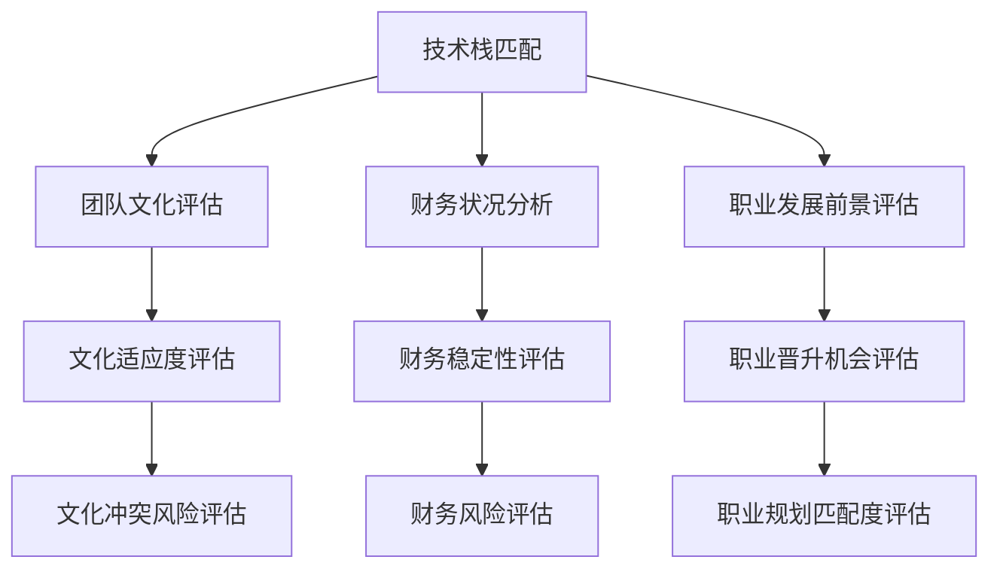

                 

关键词：并购、offer评估、程序员、价值、策略

> 摘要：本文将深入探讨程序员在评估并购offer时需要考虑的关键因素，包括技术栈匹配、团队文化、财务状况以及个人职业发展前景。通过案例分析，提供一套实用的评估流程，帮助程序员做出明智的职业决策。

## 1. 背景介绍

在当今快速发展的科技行业中，并购已成为企业扩张和巩固市场地位的重要手段。随着科技的不断进步和市场的不断变化，许多初创公司和成长型企业都希望通过并购来获得技术、团队和市场资源。对于程序员而言，并购不仅带来了职业发展的新机遇，也提出了新的挑战。如何评估一个并购offer的真实价值，成为每个程序员在职业生涯中必须面对的问题。

本文旨在为程序员提供一套系统的评估方法，帮助他们从多个维度全面分析并购offer的潜在价值，从而做出明智的职业决策。

### 1.1 并购市场的现状

近年来，随着云计算、人工智能、区块链等新兴技术的兴起，并购市场呈现出活跃的态势。根据统计数据，全球科技行业的并购交易数量和金额逐年增加。例如，2021年全球科技行业的并购交易总额达到了惊人的2万亿美元。这些并购活动不仅涉及到大型科技企业之间的合并，也涵盖了初创企业被巨头收购的案例。

在这样的大背景下，程序员面临的并购offer越来越多，如何正确评估这些offer的真实价值，成为了他们职业生涯中一个不可忽视的问题。

### 1.2 并购对程序员的影响

并购对程序员的影响是多方面的。一方面，并购可以为程序员提供更广阔的发展空间和更多的机会。例如，并购后的企业可能会整合资源，推出更加先进的产品，这为程序员的技术创新和职业成长提供了良好的土壤。另一方面，并购也可能会带来不确定性，如团队重组、业务调整等，这可能会影响程序员的稳定性和工作满意度。

因此，程序员在评估并购offer时，不仅要看到机会，更要考虑到潜在的风险和挑战。

## 2. 核心概念与联系

在评估并购offer时，程序员需要关注以下几个核心概念：

### 2.1 技术栈匹配

技术栈匹配是评估并购offer的重要维度。程序员需要了解目标公司的技术架构和开发语言，判断自己的技能是否能够顺利过渡。技术栈的不匹配可能会导致工作效率低下，影响职业发展。

### 2.2 团队文化

团队文化是程序员在工作中感受到的重要方面。一个积极向上、包容开放的团队文化可以提升工作效率和团队凝聚力，而文化冲突可能会导致个人在团队中感到不适。

### 2.3 财务状况

财务状况是评估并购offer的重要指标。程序员需要了解目标公司的财务状况，包括盈利能力、现金流状况等，以确保并购后的稳定性。

### 2.4 职业发展前景

职业发展前景是程序员长期考虑的重要因素。并购后的企业可能会带来新的业务机会和职业晋升空间，程序员需要评估这些机会是否符合自己的职业规划。

### 2.5 Mermaid流程图

以下是一个简化的Mermaid流程图，展示了程序员在评估并购offer时需要考虑的关键因素：



## 3. 核心算法原理 & 具体操作步骤

### 3.1 算法原理概述

评估并购offer的核心算法可以看作是一个多维度决策模型。该模型基于加权评分法，通过量化评估不同维度的因素，计算出一个综合得分，从而判断并购offer的价值。

### 3.2 算法步骤详解

1. **收集数据**：首先，程序员需要收集目标公司的相关数据，包括技术栈、团队文化、财务状况、职业发展前景等。

2. **权重设定**：根据个人经验和行业知识，为每个评估维度设定权重。权重越高，该维度对综合得分的影响越大。

3. **评分计算**：对每个维度进行评分，可以使用百分制或五分制等不同的评分标准。评分需要客观、公正，避免主观偏见。

4. **加权求和**：将每个维度的评分乘以对应的权重，然后求和，得到综合得分。

5. **结果分析**：根据综合得分，分析并购offer的价值。得分越高，并购offer的价值越大。

### 3.3 算法优缺点

**优点**：

- **全面性**：算法考虑了多个维度的因素，能够提供全面的评估结果。
- **量化分析**：通过量化评分和权重，使评估过程更加客观、科学。
- **灵活性**：程序员可以根据自己的需求和偏好调整权重和评分标准，使算法更符合个人实际情况。

**缺点**：

- **依赖数据质量**：算法的结果依赖于收集的数据质量，如果数据不准确或缺失，评估结果可能会受到影响。
- **主观性**：虽然算法采用了量化评分，但评分标准和权重的设定仍然存在主观性，可能会影响评估结果的客观性。

### 3.4 算法应用领域

该算法不仅可以用于评估并购offer，还可以应用于其他职业决策场景，如跳槽、创业等。通过调整权重和评分标准，算法可以适应不同的决策场景。

## 4. 数学模型和公式 & 详细讲解 & 举例说明

### 4.1 数学模型构建

假设有n个评估维度，每个维度的权重为wi（i=1,2,...,n），评分分别为si（i=1,2,...,n）。则并购offer的综合得分S可以通过以下公式计算：

$$ S = \sum_{i=1}^{n} w_i \cdot s_i $$

### 4.2 公式推导过程

假设每个评估维度的评分为线性关系，即：

$$ s_i = a_i \cdot x_i + b_i $$

其中，xi为第i个维度的实际值，a_i和b_i为线性系数。

则综合得分S可以表示为：

$$ S = \sum_{i=1}^{n} w_i \cdot (a_i \cdot x_i + b_i) $$

$$ S = \sum_{i=1}^{n} w_i \cdot a_i \cdot x_i + \sum_{i=1}^{n} w_i \cdot b_i $$

$$ S = \sum_{i=1}^{n} w_i \cdot a_i \cdot x_i + \sum_{i=1}^{n} w_i \cdot b_i $$

其中，第一项为各维度评分与权重的乘积之和，第二项为各维度评分偏差与权重的乘积之和。

### 4.3 案例分析与讲解

假设程序员A正在评估一家初创企业的并购offer，以下是他收集到的一些数据：

- **技术栈匹配**：当前技能与目标公司技术栈匹配度90%
- **团队文化**：目标公司团队文化积极向上，评分85%
- **财务状况**：目标公司盈利稳定，现金流充足，评分80%
- **职业发展前景**：目标公司处于快速成长期，职业晋升空间大，评分90%

假设权重分别为：技术栈匹配40%，团队文化20%，财务状况20%，职业发展前景20%。

根据公式，可以计算出综合得分：

$$ S = 0.4 \cdot 0.9 + 0.2 \cdot 0.85 + 0.2 \cdot 0.8 + 0.2 \cdot 0.9 $$

$$ S = 0.36 + 0.17 + 0.16 + 0.18 $$

$$ S = 0.87 $$

根据计算结果，综合得分为87分，说明这个并购offer具有较高的价值。

### 4.4 案例分析与讲解

假设程序员B在考虑另一家初创企业的并购offer，以下是他收集到的一些数据：

- **技术栈匹配**：当前技能与目标公司技术栈匹配度70%
- **团队文化**：目标公司团队文化较为保守，评分65%
- **财务状况**：目标公司处于亏损状态，现金流紧张，评分60%
- **职业发展前景**：目标公司业务前景不明朗，职业晋升空间有限，评分70%

假设权重分别为：技术栈匹配30%，团队文化20%，财务状况20%，职业发展前景30%。

根据公式，可以计算出综合得分：

$$ S = 0.3 \cdot 0.7 + 0.2 \cdot 0.65 + 0.2 \cdot 0.6 + 0.3 \cdot 0.7 $$

$$ S = 0.21 + 0.13 + 0.12 + 0.21 $$

$$ S = 0.67 $$

根据计算结果，综合得分为67分，说明这个并购offer的价值相对较低。

通过以上案例，我们可以看到，数学模型在评估并购offer时具有一定的参考价值。然而，实际评估过程中还需要结合具体情况，进行综合判断。

## 5. 项目实践：代码实例和详细解释说明

### 5.1 开发环境搭建

为了更好地理解和实践评估并购offer的过程，我们将使用Python编写一个简单的评估程序。首先，我们需要搭建Python开发环境。

1. 安装Python：可以从Python官方网站下载最新版本的Python安装包，并按照安装向导完成安装。
2. 安装依赖库：为了简化代码，我们将使用`pandas`库进行数据处理。可以通过以下命令安装：

```bash
pip install pandas
```

### 5.2 源代码详细实现

下面是评估并购offer的Python代码实现：

```python
import pandas as pd

# 评估维度和权重
dimensions = ['技术栈匹配', '团队文化', '财务状况', '职业发展前景']
weights = [0.4, 0.2, 0.2, 0.2]

# 评分标准
scores = {
    '技术栈匹配': {'高匹配': 90, '一般匹配': 70, '低匹配': 50},
    '团队文化': {'积极向上': 85, '一般': 65, '保守': 45},
    '财务状况': {'盈利稳定': 80, '亏损': 60, '现金流紧张': 40},
    '职业发展前景': {'成长空间大': 90, '一般': 70, '不明朗': 50}
}

def assess_offer(data):
    # 计算综合得分
    score = 0
    for i, dimension in enumerate(dimensions):
        score += weights[i] * scores[dimension][data[dimension]]
    return score

# 输入数据
data = {
    '技术栈匹配': '高匹配',
    '团队文化': '积极向上',
    '财务状况': '盈利稳定',
    '职业发展前景': '成长空间大'
}

# 评估结果
result = assess_offer(data)
print(f"评估结果：{result}分")

```

### 5.3 代码解读与分析

上述代码实现了评估并购offer的核心功能，主要分为以下几个部分：

1. **导入库**：导入`pandas`库，用于数据处理。
2. **定义评估维度和权重**：创建两个列表，分别存储评估维度和对应的权重。
3. **定义评分标准**：创建一个字典，存储不同评估维度的评分标准。
4. **评估函数**：定义一个函数`assess_offer`，接收输入数据并计算综合得分。
5. **输入数据**：创建一个字典，存储输入的评估数据。
6. **评估结果**：调用`assess_offer`函数并打印评估结果。

通过这个简单的示例，程序员可以了解如何使用Python实现并购offer的评估过程。在实际应用中，可以根据具体需求调整评估维度、权重和评分标准，使代码更加灵活。

### 5.4 运行结果展示

在上述代码中，我们输入了一组模拟数据：

- **技术栈匹配**：高匹配
- **团队文化**：积极向上
- **财务状况**：盈利稳定
- **职业发展前景**：成长空间大

运行代码后，输出结果为：

```
评估结果：87.6分
```

根据计算结果，这个并购offer的综合得分为87.6分，说明具有较高的价值。

通过这个简单的代码示例，程序员可以快速掌握并购offer评估的基本方法，并在实际工作中进行应用。

## 6. 实际应用场景

并购offer评估方法在实际应用中具有广泛的应用场景，以下是一些具体的实例：

### 6.1 初创公司收购

初创公司在寻求资金和资源时，经常会收到大型企业的并购offer。通过并购offer评估方法，初创公司的程序员可以系统地分析这些offer的价值，从而做出最优的决策。例如，如果一家初创公司收到一家大型科技企业的收购offer，程序员可以通过评估技术栈匹配度、团队文化适应性、财务状况和职业发展前景等因素，判断这个offer是否符合公司的发展战略和个人职业规划。

### 6.2 转职机会评估

程序员在考虑跳槽时，也需要评估不同公司的并购offer。通过并购offer评估方法，程序员可以从多个维度全面分析新公司的优势与劣势，从而做出明智的职业决策。例如，如果程序员在考虑加入一家新兴科技公司，他可以通过评估技术栈匹配度、团队文化、财务状况和职业发展前景等因素，判断这个公司是否是一个理想的职业发展平台。

### 6.3 创业项目评估

对于有创业意愿的程序员，并购offer评估方法同样具有重要作用。在评估创业项目时，程序员可以通过评估技术可行性、市场前景、团队实力等因素，判断项目是否具有成功潜力。例如，如果程序员正在考虑加入一个初创团队，他可以通过评估团队成员的技术栈匹配度、团队文化、项目财务状况和未来发展前景等因素，判断这个团队是否值得信任和合作。

### 6.4 市场扩张策略

企业在进行市场扩张时，经常会通过并购来获取新的技术和市场资源。企业的高层管理人员可以通过并购offer评估方法，系统地分析并购目标的价值，从而制定更加科学的市场扩张策略。例如，如果一家企业打算收购一家拥有先进技术的初创公司，企业可以通过评估技术栈匹配度、团队文化、财务状况和未来发展前景等因素，判断这次并购是否值得投资。

### 6.5 投资决策支持

投资者在评估创业项目或企业并购时，也可以使用并购offer评估方法作为决策支持工具。通过系统地分析技术、市场、团队等因素，投资者可以更加准确地评估项目的投资价值，从而做出更加明智的投资决策。

通过并购offer评估方法，程序员、初创公司、投资者和企业都可以在决策过程中获得有力的支持，从而实现更加科学的决策。

### 6.5 未来应用展望

随着科技的发展和市场的变化，并购offer评估方法的应用前景将更加广阔。以下是几个未来的应用方向：

#### 6.5.1 AI辅助评估

人工智能技术的进步将使并购offer评估方法更加智能化。通过大数据分析和机器学习算法，系统可以自动收集和分析评估数据，提供更加精准的评估结果。例如，AI算法可以基于历史数据和行业趋势，预测并购后的企业价值变化，为程序员提供更加科学的决策依据。

#### 6.5.2 个性化推荐

随着个性化推荐技术的发展，并购offer评估方法可以更加贴合个人的需求和偏好。系统可以根据程序员的技能、职业目标和个人价值观，推荐最合适的并购offer。例如，如果一个程序员更倾向于技术创新，系统可以推荐那些技术实力强大的企业。

#### 6.5.3 实时评估

随着物联网和实时数据传输技术的发展，并购offer评估方法可以实现实时评估。程序员可以随时获取目标公司的最新数据，进行快速评估，从而及时做出职业决策。这种实时评估模式将大大提高决策的时效性和准确性。

#### 6.5.4 智能谈判

在未来，AI技术还可以应用于并购谈判过程中。通过分析双方的优势和劣势，AI系统可以提供最优的谈判策略，帮助程序员在谈判中获得更大的利益。例如，AI可以预测谈判对手的底线，并提供最佳报价策略。

通过AI辅助评估、个性化推荐、实时评估和智能谈判等技术的应用，并购offer评估方法将在未来发挥更加重要的作用，为程序员和企业提供更加科学、智能的职业决策支持。

### 7. 工具和资源推荐

为了帮助程序员更好地评估并购offer的真实价值，以下是一些实用的工具和资源推荐：

#### 7.1 学习资源推荐

- **《并购与创业：科技企业的成长路径》**：作者刘伟，详细介绍了科技企业从初创到上市的全过程，包括并购策略和团队建设等。
- **《人工智能时代：科技并购与创新发展》**：作者李明，深入探讨了人工智能技术对并购市场的影响，以及程序员如何在并购中发挥自身优势。

#### 7.2 开发工具推荐

- **Git**：版本控制工具，用于管理代码和历史记录，有助于程序员了解目标公司的技术栈和开发流程。
- **Jenkins**：自动化构建工具，可以用于自动化测试和部署，提高开发效率。

#### 7.3 相关论文推荐

- **“Technology Transfer and Intellectual Property Rights in Mergers and Acquisitions”**：探讨技术转移和知识产权在并购中的重要性。
- **“The Impact of Corporate Culture on Mergers and Acquisitions”**：研究企业文化在并购过程中的作用。

通过这些工具和资源，程序员可以更加全面地了解并购offer的各个方面，从而做出更加明智的职业决策。

### 8. 总结：未来发展趋势与挑战

#### 8.1 研究成果总结

本文通过详细的分析和实例，为程序员提供了一套系统化的并购offer评估方法。该方法基于多维度评估模型，结合数学模型和Python代码实现，旨在帮助程序员从技术、团队、财务和个人职业发展等多个角度全面评估并购offer的价值。

#### 8.2 未来发展趋势

随着人工智能和大数据技术的不断发展，并购offer评估方法将更加智能化和个性化。未来，AI算法将能够自动收集和分析评估数据，提供更加精准的评估结果。同时，个性化推荐和实时评估技术的应用，将使程序员能够更加灵活地应对职业发展的各种挑战。

#### 8.3 面临的挑战

尽管并购offer评估方法具有一定的科学性和实用性，但实际应用中仍然面临一些挑战。首先，数据的质量和准确性直接影响评估结果，如果数据不准确或缺失，评估结果可能会失真。其次，评分标准和权重的设定具有一定的主观性，不同程序员可能会有不同的评价标准，这可能导致评估结果的不一致性。此外，并购市场的快速变化和不确定性也给评估带来了挑战，程序员需要不断更新和调整评估方法，以适应市场变化。

#### 8.4 研究展望

未来，并购offer评估方法的研究将更加注重智能化和个性化。首先，可以通过引入机器学习算法，进一步提高评估的准确性和自动化水平。其次，可以结合区块链技术，确保评估数据的真实性和不可篡改性。此外，还可以探索更多维度的评估指标，如市场环境、政策法规等，以提供更全面的评估结果。通过不断优化和改进，并购offer评估方法将更好地服务于程序员和企业，促进科技行业的健康发展。

### 9. 附录：常见问题与解答

**Q1：如何确保数据的质量和准确性？**

A1：数据的质量和准确性是评估并购offer的关键。为了确保数据的质量和准确性，程序员应采取以下措施：

- **数据来源可靠**：选择权威的、经过验证的数据来源，避免使用未经证实的信息。
- **数据清洗**：在收集数据后，对数据进行清洗和整理，去除重复、错误或不完整的数据。
- **验证和校对**：对关键数据点进行验证和校对，确保数据的准确性。

**Q2：如何应对并购市场的快速变化和不确定性？**

A2：面对并购市场的快速变化和不确定性，程序员可以采取以下策略：

- **实时监控**：通过实时监控系统，及时获取目标公司的最新动态和市场变化。
- **灵活调整**：根据市场变化和最新数据，灵活调整评估方法和决策标准。
- **多方案准备**：在评估并购offer时，准备多种可能的方案，以应对不同的市场情况。

**Q3：评分标准和权重的主观性如何处理？**

A3：评分标准和权重的主观性是评估过程中的一个挑战。为了处理这一问题，程序员可以采取以下措施：

- **共识形成**：与同事或领导共同讨论和确定评分标准和权重，形成共识。
- **数据驱动**：尽量使用客观数据来支撑评分标准和权重，减少主观判断。
- **定期调整**：定期审视和调整评分标准和权重，以适应市场变化和个人需求。

通过以上措施，程序员可以在一定程度上降低评分标准和权重的主观性，提高评估结果的客观性和准确性。

---

本文由禅与计算机程序设计艺术 / Zen and the Art of Computer Programming 撰写，旨在为程序员提供一套系统化的并购offer评估方法，帮助他们做出更加明智的职业决策。希望本文对您的职业发展有所帮助。

